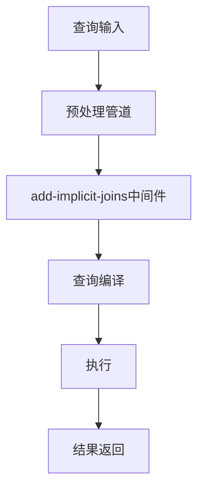
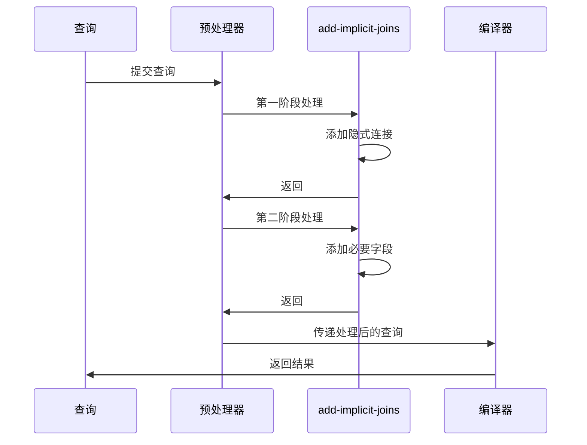
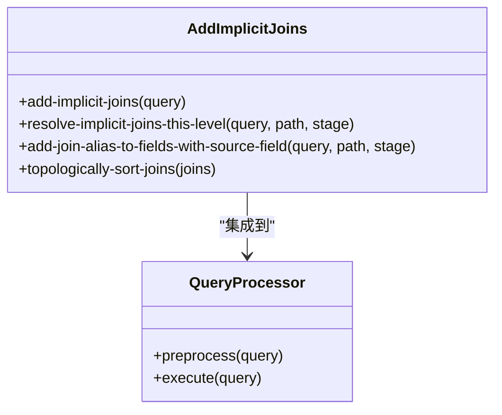
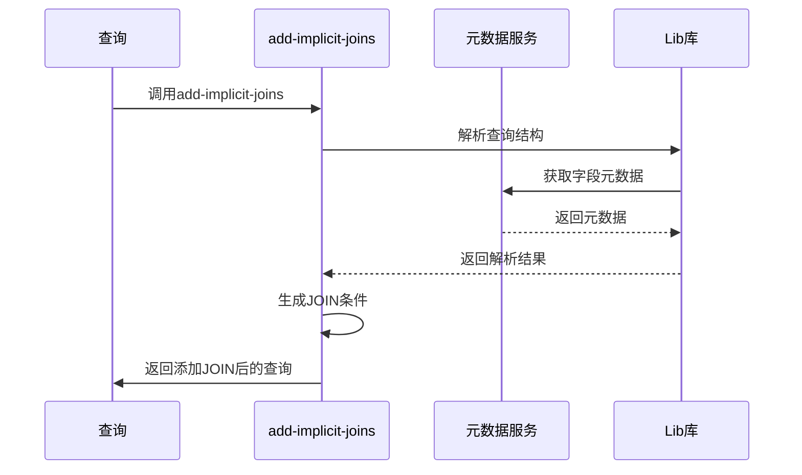
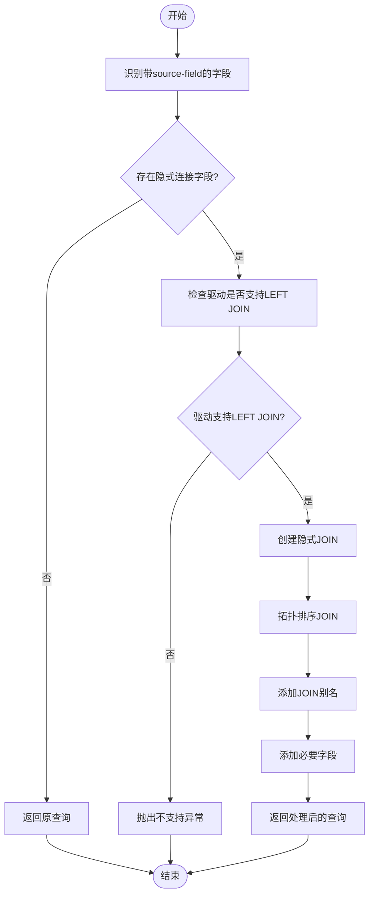
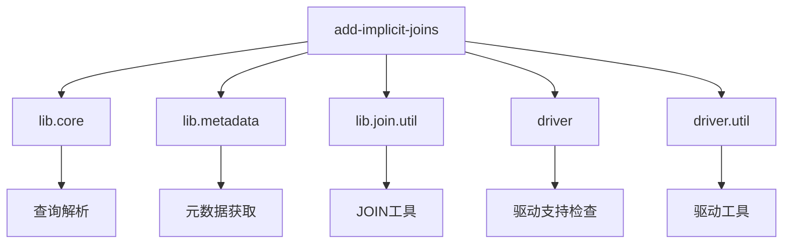

# 隐式连接添加

<cite>
**本文档中引用的文件**  
- [add_implicit_joins.clj](file://src/metabase/query_processor/middleware/add_implicit_joins.clj)
- [preprocess.clj](file://src/metabase/query_processor/preprocess.clj)
- [core.clj](file://src/metabase/lib/core.clj)
- [metadata.clj](file://src/metabase/lib/metadata.clj)
- [join.util.clj](file://src/metabase/lib/join/util.clj)
- [settings.clj](file://src/metabase/settings/core.clj)
- [driver.clj](file://src/metabase/driver.clj)
</cite>

## 目录
1. [简介](#简介)
2. [项目结构](#项目结构)
3. [核心组件](#核心组件)
4. [架构概述](#架构概述)
5. [详细组件分析](#详细组件分析)
6. [依赖分析](#依赖分析)
7. [性能考虑](#性能考虑)
8. [故障排除指南](#故障排除指南)
9. [结论](#结论)

## 简介
本文档详细介绍了Metabase中的隐式连接添加机制，该机制通过元数据自动推断并补充JOIN条件，从而减少用户手动编写JOIN语句的需求。文档深入分析了`add-implicit-joins`中间件在查询处理管道中的执行时机和触发条件，解释了其如何提升查询构建效率。同时讨论了该优化对复杂查询性能的影响、多表关联场景下的行为特征、配置选项以及可能产生的意外连接情况和规避策略。

## 项目结构
Metabase的项目结构遵循Clojure的命名空间组织方式，核心查询处理逻辑位于`src/metabase/query_processor`目录下。隐式连接功能主要由`middleware/add_implicit_joins.clj`文件实现，该文件作为查询预处理管道的一部分被调用。

**Diagram sources**
- [add_implicit_joins.clj](file://src/metabase/query_processor/middleware/add_implicit_joins.clj#L0-L28)
- [preprocess.clj](file://src/metabase/query_processor/preprocess.clj#L88)

**Section sources**
- [add_implicit_joins.clj](file://src/metabase/query_processor/middleware/add_implicit_joins.clj#L0-L431)
- [preprocess.clj](file://src/metabase/query_processor/preprocess.clj#L0-L158)

## 核心组件
`add-implicit-joins`中间件是实现隐式连接的核心组件，它通过分析查询中的`:field`子句，识别需要隐式连接的字段，并自动添加相应的JOIN子句。该中间件在查询预处理阶段被调用，确保在查询编译前完成所有必要的连接操作。

**Section sources**
- [add_implicit_joins.clj](file://src/metabase/query_processor/middleware/add_implicit_joins.clj#L418-L430)
- [preprocess.clj](file://src/metabase/query_processor/preprocess.clj#L88)

## 架构概述
隐式连接添加机制作为查询预处理管道的一部分，与其他中间件协同工作。它在查询解析后、编译前的阶段执行，通过两阶段处理确保连接的正确性和完整性。

**Diagram sources**
- [add_implicit_joins.clj](file://src/metabase/query_processor/middleware/add_implicit_joins.clj#L394-L430)
- [preprocess.clj](file://src/metabase/query_processor/preprocess.clj#L88)

## 详细组件分析

### 隐式连接添加分析
`add-implicit-joins`中间件通过两阶段处理来实现隐式连接的添加。第一阶段识别需要连接的字段并添加JOIN子句，第二阶段确保必要的字段被包含在查询中。

#### 对象导向组件

**Diagram sources**
- [add_implicit_joins.clj](file://src/metabase/query_processor/middleware/add_implicit_joins.clj#L366-L392)
- [preprocess.clj](file://src/metabase/query_processor/preprocess.clj#L88)

#### API/服务组件

**Diagram sources**
- [add_implicit_joins.clj](file://src/metabase/query_processor/middleware/add_implicit_joins.clj#L111-L133)
- [metadata.clj](file://src/metabase/lib/metadata.clj)
- [core.clj](file://src/metabase/lib/core.clj)

#### 复杂逻辑组件

**Diagram sources**
- [add_implicit_joins.clj](file://src/metabase/query_processor/middleware/add_implicit_joins.clj#L345-L368)
- [driver.clj](file://src/metabase/driver.clj)

**Section sources**
- [add_implicit_joins.clj](file://src/metabase/query_processor/middleware/add_implicit_joins.clj#L0-L431)

## 依赖分析
隐式连接添加机制依赖于多个核心组件和库，包括查询处理器、元数据服务、驱动程序接口等。这些依赖关系确保了中间件能够正确解析查询、获取必要的元数据并生成有效的JOIN条件。

**Diagram sources**
- [add_implicit_joins.clj](file://src/metabase/query_processor/middleware/add_implicit_joins.clj#L0-L28)
- [preprocess.clj](file://src/metabase/query_processor/preprocess.clj)

**Section sources**
- [add_implicit_joins.clj](file://src/metabase/query_processor/middleware/add_implicit_joins.clj#L0-L431)

## 性能考虑
隐式连接添加机制对查询性能有重要影响。在简单查询中，它能显著提高查询构建效率；但在复杂查询中，可能引入不必要的JOIN操作，影响查询性能。建议在大型数据集上谨慎使用此功能，并监控查询执行计划。

## 故障排除指南
当隐式连接功能出现问题时，可以检查以下方面：
1. 确认数据库驱动支持LEFT JOIN操作
2. 检查字段元数据是否正确配置
3. 验证查询结构是否符合隐式连接的要求
4. 查看日志中的相关错误信息

**Section sources**
- [add_implicit_joins.clj](file://src/metabase/query_processor/middleware/add_implicit_joins.clj#L391-L417)
- [driver.clj](file://src/metabase/driver.clj)

## 结论
Metabase的隐式连接添加机制通过自动化JOIN操作显著提升了查询构建效率。该功能通过两阶段处理确保连接的正确性和完整性，同时提供了灵活的配置选项。在使用此功能时，需要权衡其带来的便利性和潜在的性能影响，特别是在复杂查询场景下。