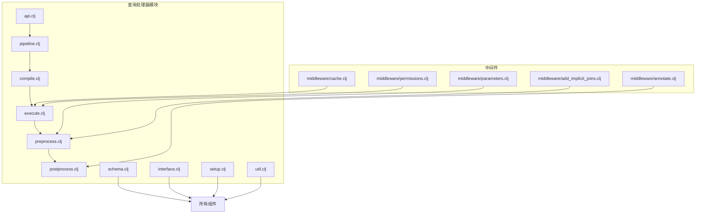
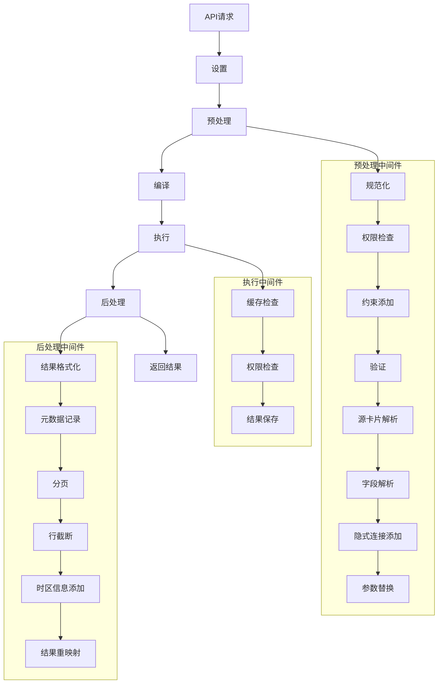
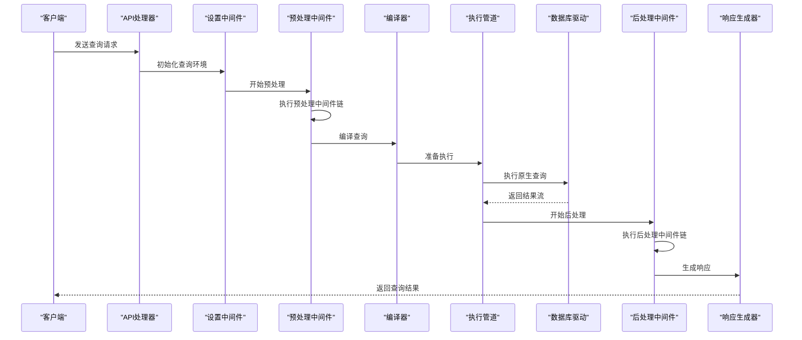
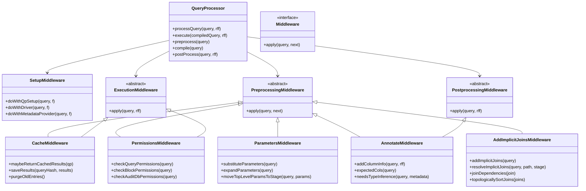
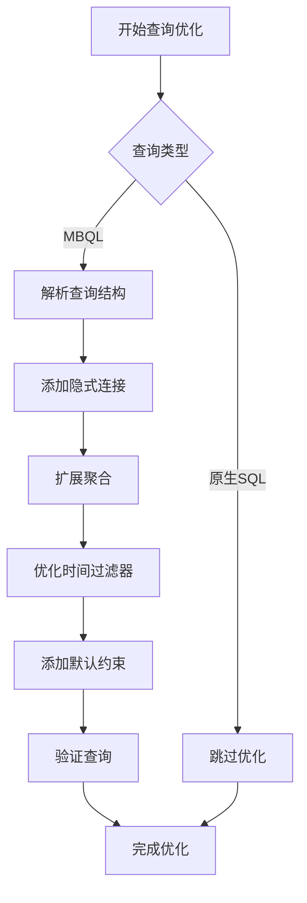
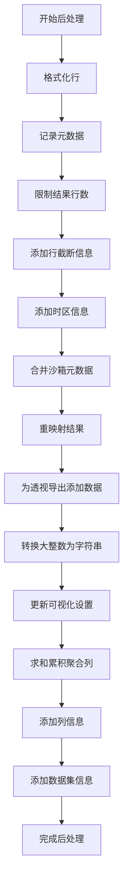
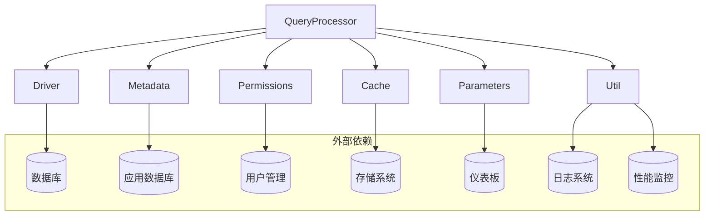

# 查询处理器

<cite>
**本文档中引用的文件**  
- [api.clj](file://src/metabase/query_processor/api.clj)
- [pipeline.clj](file://src/metabase/query_processor/pipeline.clj)
- [compile.clj](file://src/metabase/query_processor/compile.clj)
- [execute.clj](file://src/metabase/query_processor/execute.clj)
- [preprocess.clj](file://src/metabase/query_processor/preprocess.clj)
- [postprocess.clj](file://src/metabase/query_processor/postprocess.clj)
- [schema.clj](file://src/metabase/query_processor/schema.clj)
- [interface.clj](file://src/metabase/query_processor/interface.clj)
- [setup.clj](file://src/metabase/query_processor/setup.clj)
- [util.clj](file://src/metabase/query_processor/util.clj)
- [middleware/cache.clj](file://src/metabase/query_processor/middleware/cache.clj)
- [middleware/permissions.clj](file://src/metabase/query_processor/middleware/permissions.clj)
- [middleware/parameters.clj](file://src/metabase/query_processor/middleware/parameters.clj)
- [middleware/annotate.clj](file://src/metabase/query_processor/middleware/annotate.clj)
- [middleware/add_implicit_joins.clj](file://src/metabase/query_processor/middleware/add_implicit_joins.clj)
</cite>

## 目录
1. [简介](#简介)
2. [项目结构](#项目结构)
3. [核心组件](#核心组件)
4. [架构概述](#架构概述)
5. [详细组件分析](#详细组件分析)
6. [依赖分析](#依赖分析)
7. [性能考虑](#性能考虑)
8. [故障排除指南](#故障排除指南)
9. [结论](#结论)

## 简介
本文档详细介绍了Metabase查询处理器的架构，深入解释了MBQL查询的解析、预处理、编译和执行流程。文档描述了中间件管道模式在查询处理中的应用，包括各个中间件（如权限验证、参数处理、缓存、结果格式化等）的职责和执行顺序。详细说明了查询优化策略，如隐式连接添加、聚合扩展、时间过滤器优化等。分析了查询结果的后处理机制，包括分页、可视化设置注入和元数据附加。提供了查询执行的数据流图，展示了从API请求到数据库驱动调用的完整路径。

## 项目结构
Metabase查询处理器位于`src/metabase/query_processor`目录下，采用模块化设计，将查询处理的不同阶段分离到不同的文件中。核心组件包括API接口、执行管道、编译器、预处理器、后处理器等。中间件系统通过管道模式组织，每个中间件负责特定的处理任务。

**Diagram sources**
- [api.clj](file://src/metabase/query_processor/api.clj)
- [pipeline.clj](file://src/metabase/query_processor/pipeline.clj)
- [compile.clj](file://src/metabase/query_processor/compile.clj)
- [execute.clj](file://src/metabase/query_processor/execute.clj)
- [preprocess.clj](file://src/metabase/query_processor/preprocess.clj)
- [postprocess.clj](file://src/metabase/query_processor/postprocess.clj)

**Section sources**
- [api.clj](file://src/metabase/query_processor/api.clj)
- [pipeline.clj](file://src/metabase/query_processor/pipeline.clj)
- [compile.clj](file://src/metabase/query_processor/compile.clj)
- [execute.clj](file://src/metabase/query_processor/execute.clj)
- [preprocess.clj](file://src/metabase/query_processor/preprocess.clj)
- [postprocess.clj](file://src/metabase/query_processor/postprocess.clj)
- [schema.clj](file://src/metabase/query_processor/schema.clj)

## 核心组件
Metabase查询处理器的核心组件包括API接口、执行管道、编译器、预处理器和后处理器。API接口处理来自前端的查询请求，执行管道管理查询的执行流程，编译器将MBQL查询转换为原生SQL，预处理器在编译前对查询进行各种转换和优化，后处理器在查询执行后对结果进行处理。

**Section sources**
- [api.clj](file://src/metabase/query_processor/api.clj)
- [pipeline.clj](file://src/metabase/query_processor/pipeline.clj)
- [compile.clj](file://src/metabase/query_processor/compile.clj)
- [execute.clj](file://src/metabase/query_processor/execute.clj)
- [preprocess.clj](file://src/metabase/query_processor/preprocess.clj)
- [postprocess.clj](file://src/metabase/query_processor/postprocess.clj)

## 架构概述
Metabase查询处理器采用中间件管道模式，将查询处理过程分解为多个阶段。每个阶段由一个中间件负责，中间件按特定顺序执行，形成一个处理管道。查询首先经过设置阶段，然后进入预处理阶段，接着是编译阶段，执行阶段，最后是后处理阶段。

**Diagram sources**
- [setup.clj](file://src/metabase/query_processor/setup.clj)
- [preprocess.clj](file://src/metabase/query_processor/preprocess.clj)
- [compile.clj](file://src/metabase/query_processor/compile.clj)
- [execute.clj](file://src/metabase/query_processor/execute.clj)
- [postprocess.clj](file://src/metabase/query_processor/postprocess.clj)

## 详细组件分析

### 查询处理流程分析
Metabase查询处理器的处理流程从API请求开始，经过一系列中间件处理，最终返回查询结果。流程包括设置、预处理、编译、执行和后处理五个主要阶段。

#### 查询处理序列图

**Diagram sources**
- [api.clj](file://src/metabase/query_processor/api.clj)
- [setup.clj](file://src/metabase/query_processor/setup.clj)
- [preprocess.clj](file://src/metabase/query_processor/preprocess.clj)
- [compile.clj](file://src/metabase/query_processor/compile.clj)
- [execute.clj](file://src/metabase/query_processor/execute.clj)
- [postprocess.clj](file://src/metabase/query_processor/postprocess.clj)

**Section sources**
- [api.clj](file://src/metabase/query_processor/api.clj)
- [setup.clj](file://src/metabase/query_processor/setup.clj)
- [preprocess.clj](file://src/metabase/query_processor/preprocess.clj)
- [compile.clj](file://src/metabase/query_processor/compile.clj)
- [execute.clj](file://src/metabase/query_processor/execute.clj)
- [postprocess.clj](file://src/metabase/query_processor/postprocess.clj)

### 中间件管道模式
Metabase查询处理器使用中间件管道模式来组织查询处理逻辑。每个中间件负责一个特定的任务，中间件按顺序执行，形成一个处理管道。这种设计使得查询处理逻辑易于扩展和维护。

#### 中间件管道类图

**Diagram sources**
- [middleware/cache.clj](file://src/metabase/query_processor/middleware/cache.clj)
- [middleware/permissions.clj](file://src/metabase/query_processor/middleware/permissions.clj)
- [middleware/parameters.clj](file://src/metabase/query_processor/middleware/parameters.clj)
- [middleware/annotate.clj](file://src/metabase/query_processor/middleware/annotate.clj)
- [middleware/add_implicit_joins.clj](file://src/metabase/query_processor/middleware/add_implicit_joins.clj)

### 查询优化策略
Metabase查询处理器实现了多种查询优化策略，包括隐式连接添加、聚合扩展、时间过滤器优化等。这些优化策略在预处理阶段应用，旨在提高查询性能和用户体验。

#### 查询优化流程图

**Diagram sources**
- [preprocess.clj](file://src/metabase/query_processor/preprocess.clj)
- [middleware/add_implicit_joins.clj](file://src/metabase/query_processor/middleware/add_implicit_joins.clj)
- [middleware/expand_aggregations.clj](file://src/metabase/query_processor/middleware/expand_aggregations.clj)
- [middleware/optimize_temporal_filters.clj](file://src/metabase/query_processor/middleware/optimize_temporal_filters.clj)

### 查询结果后处理
查询结果后处理阶段负责对查询执行结果进行最终处理，包括分页、可视化设置注入、元数据附加等。后处理中间件按逆序执行，确保结果的正确性和完整性。

#### 后处理流程图

**Diagram sources**
- [postprocess.clj](file://src/metabase/query_processor/postprocess.clj)

## 依赖分析
Metabase查询处理器依赖于多个核心组件和中间件，这些组件通过精心设计的依赖关系协同工作。查询处理器依赖于驱动系统执行原生查询，依赖于元数据系统解析查询中的实体，依赖于权限系统验证用户权限。

**Diagram sources**
- [execute.clj](file://src/metabase/query_processor/execute.clj)
- [setup.clj](file://src/metabase/query_processor/setup.clj)
- [util.clj](file://src/metabase/query_processor/util.clj)

**Section sources**
- [execute.clj](file://src/metabase/query_processor/execute.clj)
- [setup.clj](file://src/metabase/query_processor/setup.clj)
- [util.clj](file://src/metabase/query_processor/util.clj)

## 性能考虑
Metabase查询处理器在设计时考虑了多种性能优化策略。查询缓存机制可以显著提高重复查询的性能，异步执行模式可以提高系统吞吐量，查询编译缓存可以减少重复编译的开销。此外，查询处理器还实现了查询超时和资源限制机制，防止资源耗尽。

## 故障排除指南
当查询处理器出现问题时，可以按照以下步骤进行排查：
1. 检查查询语法是否正确
2. 验证用户是否有执行查询的权限
3. 检查数据库连接是否正常
4. 查看日志文件中的错误信息
5. 验证查询缓存配置是否正确
6. 检查中间件配置是否正确

**Section sources**
- [execute.clj](file://src/metabase/query_processor/execute.clj)
- [middleware/cache.clj](file://src/metabase/query_processor/middleware/cache.clj)
- [middleware/permissions.clj](file://src/metabase/query_processor/middleware/permissions.clj)

## 结论
Metabase查询处理器是一个复杂而强大的系统，它通过中间件管道模式将查询处理过程分解为多个可管理的阶段。这种设计使得系统易于扩展和维护，同时提供了高性能和高可靠性的查询处理能力。通过深入理解查询处理器的架构和工作原理，开发者可以更好地利用Metabase的功能，为用户提供更好的数据分析体验。