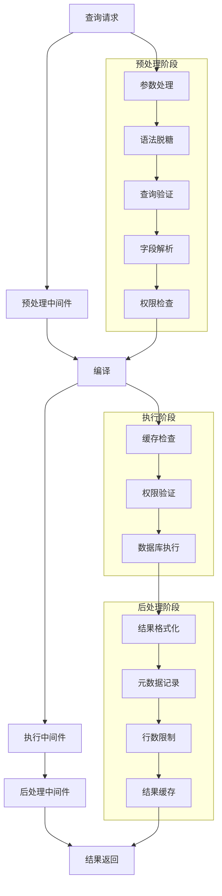
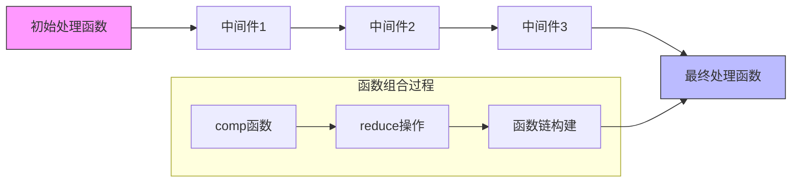
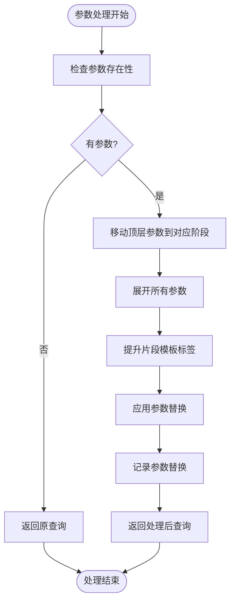
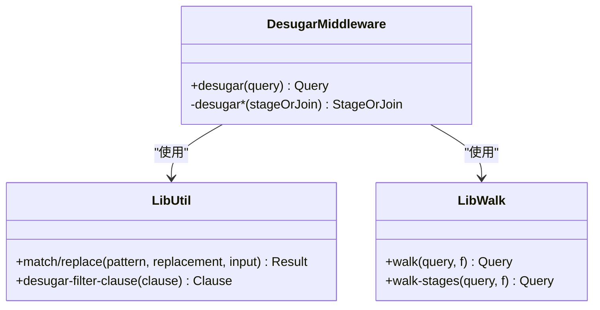
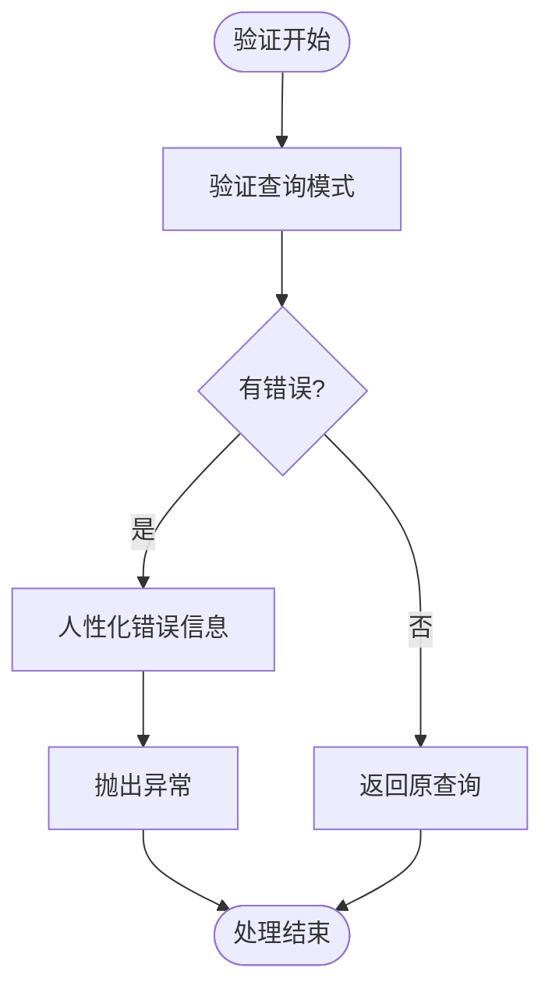
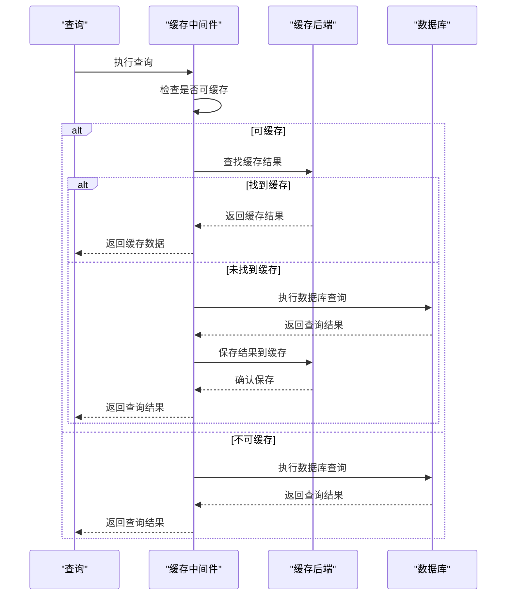
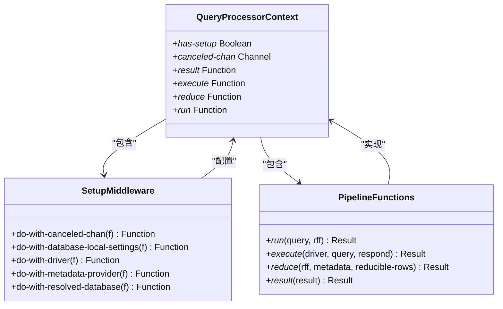
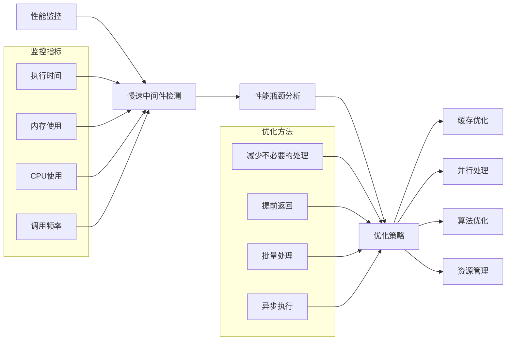

# 中间件处理链

<cite>
**本文档引用的文件**   
- [query_processor.clj](file://src/metabase/query_processor.clj)
- [preprocess.clj](file://src/metabase/query_processor/preprocess.clj)
- [postprocess.clj](file://src/metabase/query_processor/postprocess.clj)
- [execute.clj](file://src/metabase/query_processor/execute.clj)
- [pipeline.clj](file://src/metabase/query_processor/pipeline.clj)
- [compile.clj](file://src/metabase/query_processor/compile.clj)
- [setup.clj](file://src/metabase/query_processor/setup.clj)
- [desugar.clj](file://src/metabase/query_processor/middleware/desugar.clj)
- [validate.clj](file://src/metabase/query_processor/middleware/validate.clj)
- [parameters.clj](file://src/metabase/query_processor/middleware/parameters.clj)
- [cache.clj](file://src/metabase/query_processor/middleware/cache.clj)
</cite>

## 目录
1. [引言](#引言)
2. [中间件管道架构](#中间件管道架构)
3. [函数式组合机制](#函数式组合机制)
4. [核心中间件分析](#核心中间件分析)
5. [执行上下文管理](#执行上下文管理)
6. [自定义中间件开发](#自定义中间件开发)
7. [性能分析与优化](#性能分析与优化)
8. [结论](#结论)

## 引言
Metabase查询处理器采用函数式中间件管道架构来处理查询请求。该架构通过函数式组合将多个中间件串联成处理链，每个中间件负责特定的处理任务，如参数处理、语法脱糖、查询验证等。中间件管道的设计使得查询处理过程高度模块化和可扩展，允许开发者通过添加自定义中间件来扩展系统功能。

## 中间件管道架构



**图示来源**
- [query_processor.clj](file://src/metabase/query_processor.clj#L24-L52)
- [preprocess.clj](file://src/metabase/query_processor/preprocess.clj#L121-L143)
- [execute.clj](file://src/metabase/query_processor/execute.clj#L30-L63)
- [postprocess.clj](file://src/metabase/query_processor/postprocess.clj#L54-L64)

**本节来源**
- [query_processor.clj](file://src/metabase/query_processor.clj#L24-L82)
- [preprocess.clj](file://src/metabase/query_processor/preprocess.clj#L92-L123)
- [execute.clj](file://src/metabase/query_processor/execute.clj#L30-L63)
- [postprocess.clj](file://src/metabase/query_processor/postprocess.clj#L1-L65)

## 函数式组合机制



**图示来源**
- [query_processor.clj](file://src/metabase/query_processor.clj#L49-L82)
- [execute.clj](file://src/metabase/query_processor/execute.clj#L63-L98)
- [postprocess.clj](file://src/metabase/query_processor/postprocess.clj#L54-L64)

**本节来源**
- [query_processor.clj](file://src/metabase/query_processor.clj#L49-L82)
- [execute.clj](file://src/metabase/query_processor/execute.clj#L63-L98)
- [preprocess.clj](file://src/metabase/query_processor/preprocess.clj#L121-L143)

Metabase查询处理器使用函数式编程中的组合模式来构建中间件管道。核心机制是通过`comp`函数和`reduce`操作将多个中间件函数组合成一个处理链。每个中间件都是一个高阶函数，接收一个处理函数作为参数并返回一个新的处理函数。

在预处理阶段，`preprocess`函数使用`transduce`和`reduce`操作将预处理中间件列表中的每个中间件依次应用到查询上。每个中间件都遵循`(f query) -> query`的模式，即接收一个查询对象并返回处理后的查询对象。

在执行阶段，`execute-fn`函数使用`reduce`操作将执行中间件列表中的每个中间件应用到`run`函数上。每个执行中间件都遵循`(f qp) -> qp`的模式，其中`qp`是一个处理函数，接收查询和结果减少函数(rff)作为参数。

这种函数式组合机制使得中间件管道具有以下优点：
- **可组合性**：中间件可以灵活组合，形成不同的处理链
- **可重用性**：每个中间件都是独立的函数，可以在不同场景下重用
- **可测试性**：每个中间件可以独立测试，无需依赖整个处理链
- **可扩展性**：可以轻松添加新的中间件而不影响现有代码

## 核心中间件分析

### 参数处理中间件



**图示来源**
- [parameters.clj](file://src/metabase/query_processor/middleware/parameters.clj#L1-L147)

**本节来源**
- [parameters.clj](file://src/metabase/query_processor/middleware/parameters.clj#L1-L147)
- [preprocess.clj](file://src/metabase/query_processor/preprocess.clj#L92-L123)

参数处理中间件负责处理查询中的参数替换。它首先检查查询中是否存在参数，如果存在则进行参数处理。处理过程包括移动顶层参数到对应的查询阶段、展开所有参数、提升片段模板标签以及应用参数替换。该中间件还负责记录参数替换的详细信息，便于调试和日志记录。

### 语法脱糖中间件



**图示来源**
- [desugar.clj](file://src/metabase/query_processor/middleware/desugar.clj#L1-L28)

**本节来源**
- [desugar.clj](file://src/metabase/query_processor/middleware/desugar.clj#L1-L28)
- [preprocess.clj](file://src/metabase/query_processor/preprocess.clj#L92-L123)

语法脱糖中间件负责将高级语法糖转换为底层查询结构。它使用`lib.match/replace`函数来匹配和替换查询中的语法糖结构，如`time-interval`和`inside`等高级语法被转换为`between`等底层语法。该中间件通过`lib.walk/walk`函数遍历查询的每个阶段和连接，确保所有语法糖都被正确处理。

### 查询验证中间件



**图示来源**
- [validate.clj](file://src/metabase/query_processor/middleware/validate.clj#L1-L19)

**本节来源**
- [validate.clj](file://src/metabase/query_processor/middleware/validate.clj#L1-L19)
- [preprocess.clj](file://src/metabase/query_processor/preprocess.clj#L92-L123)

查询验证中间件负责验证查询的合法性。它使用`malli`库的模式验证功能来检查查询是否符合定义的模式。如果查询验证失败，中间件会生成人性化的错误信息并抛出异常。该中间件在预处理阶段早期执行，确保后续处理的查询都是合法的。

### 缓存中间件



**图示来源**
- [cache.clj](file://src/metabase/query_processor/middleware/cache.clj#L1-L246)
- [execute.clj](file://src/metabase/query_processor/execute.clj#L30-L63)

**本节来源**
- [cache.clj](file://src/metabase/query_processor/middleware/cache.clj#L1-L246)
- [execute.clj](file://src/metabase/query_processor/execute.clj#L30-L63)
- [postprocess.clj](file://src/metabase/query_processor/postprocess.clj#L1-L65)

缓存中间件负责查询结果的缓存和检索。它首先检查查询是否可缓存，如果可缓存则在缓存后端中查找结果。如果找到缓存结果则直接返回，否则执行数据库查询并将结果保存到缓存中。该中间件支持多种缓存后端，包括数据库和内存缓存。

## 执行上下文管理



**图示来源**
- [setup.clj](file://src/metabase/query_processor/setup.clj#L157-L200)
- [pipeline.clj](file://src/metabase/query_processor/pipeline.clj#L1-L129)

**本节来源**
- [setup.clj](file://src/metabase/query_processor/setup.clj#L157-L200)
- [pipeline.clj](file://src/metabase/query_processor/pipeline.clj#L1-L129)
- [query_processor.clj](file://src/metabase/query_processor.clj#L24-L52)

Metabase查询处理器通过动态变量和绑定机制管理执行上下文。核心上下文变量包括`*has-setup*`、`*canceled-chan*`、`*result*`、`*execute*`、`*reduce*`和`*run*`。这些动态变量在查询处理过程中被绑定和修改，确保各个中间件可以访问和修改共享状态。

`setup-middleware`列表中的中间件负责初始化和配置执行上下文。这些中间件按照特定顺序执行，从底部到顶部，确保正确的初始化顺序。例如，`do-with-resolved-database`中间件首先解析数据库ID，然后`do-with-driver`中间件根据数据库ID绑定相应的驱动程序。

执行上下文管理还支持查询取消功能。通过`*canceled-chan*`通道，可以在查询执行过程中检测是否需要取消查询。这对于长时间运行的查询特别有用，当用户关闭页面或取消请求时可以及时停止查询执行。

## 自定义中间件开发

```mermaid
flowchart TD
Start([开发开始]) --> DefineMiddleware["定义中间件函数"]
DefineMiddleware --> FollowPattern{"遵循模式?"]
FollowPattern --> |是| ImplementLogic["实现处理逻辑"]
FollowPattern --> |否| FixPattern["修正函数签名"]
FixPattern --> ImplementLogic
ImplementLogic --> AddValidation["添加输入验证"]
AddValidation --> HandleError["处理异常"]
HandleError --> TestMiddleware["测试中间件"]
TestMiddleware --> Integrate["集成到处理管道"]
Integrate --> Monitor["监控性能"]
Monitor --> End([开发完成])
```

**本节来源**
- [query_processor.clj](file://src/metabase/query_processor.clj#L49-L82)
- [preprocess.clj](file://src/metabase/query_processor/preprocess.clj#L92-L123)
- [execute.clj](file://src/metabase/query_processor/execute.clj#L30-L63)

开发自定义中间件需要遵循特定的模式和约定。预处理中间件应遵循`(f query) -> query`的模式，执行中间件应遵循`(f qp) -> qp`的模式，而后处理中间件应遵循`(f preprocessed-query rff) -> rff`的模式。

开发自定义中间件的步骤包括：
1. 定义中间件函数，确保函数签名正确
2. 实现具体的处理逻辑
3. 添加输入验证和错误处理
4. 编写单元测试验证中间件功能
5. 将中间件集成到相应的处理管道中
6. 监控中间件的性能和资源使用情况

中间件应尽量保持单一职责，每个中间件只负责一个特定的处理任务。这样可以提高代码的可维护性和可测试性。

## 性能分析与优化



**本节来源**
- [preprocess.clj](file://src/metabase/query_processor/preprocess.clj#L121-L143)
- [cache.clj](file://src/metabase/query_processor/middleware/cache.clj#L1-L246)
- [execute.clj](file://src/metabase/query_processor/execute.clj#L63-L98)

Metabase查询处理器提供了多种性能分析和优化策略。首先，系统内置了慢速中间件检测机制，当中间件执行时间超过阈值时会记录警告日志。生产环境的阈值为1000毫秒，开发环境为100毫秒。

性能优化策略包括：
- **缓存优化**：使用缓存中间件避免重复查询执行
- **并行处理**：对于独立的处理任务可以考虑并行执行
- **算法优化**：优化中间件内部的算法复杂度
- **资源管理**：合理管理内存和连接资源

监控中间件性能的关键指标包括执行时间、内存使用、CPU使用和调用频率。通过分析这些指标可以识别性能瓶颈并采取相应的优化措施。

## 结论
Metabase查询处理器的中间件管道架构采用函数式编程思想，通过函数组合构建灵活的处理链。该架构具有高度的模块化和可扩展性，支持通过添加自定义中间件来扩展系统功能。中间件管道分为预处理、执行和后处理三个阶段，每个阶段都有特定的中间件负责相应的处理任务。

执行上下文管理通过动态变量和绑定机制实现，确保各个中间件可以共享和修改状态。性能分析和优化策略包括慢速中间件检测、缓存优化和资源管理等。整体架构设计合理，既保证了功能的灵活性，又考虑了性能和可维护性。