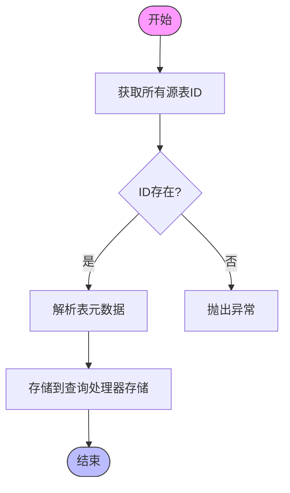

# 查询处理管道

<cite>
**本文档中引用的文件**  
- [pipeline.clj](file://src/metabase/query_processor/pipeline.clj)
- [preprocess.clj](file://src/metabase/query_processor/preprocess.clj)
- [postprocess.clj](file://src/metabase/query_processor/postprocess.clj)
- [execute.clj](file://src/metabase/query_processor/execute.clj)
- [compile.clj](file://src/metabase/query_processor/compile.clj)
- [setup.clj](file://src/metabase/query_processor/setup.clj)
- [resolve_source_table.clj](file://src/metabase/query_processor/middleware/resolve_source_table.clj)
- [resolve_fields.clj](file://src/metabase/query_processor/middleware/resolve_fields.clj)
- [resolve_joins.clj](file://src/metabase/query_processor/middleware/resolve_joins.clj)
- [schema.clj](file://src/metabase/query_processor/schema.clj)
</cite>

## 目录
1. [介绍](#介绍)
2. [查询处理管道架构](#查询处理管道架构)
3. [核心处理阶段](#核心处理阶段)
4. [中间件函数式组合机制](#中间件函数式组合机制)
5. [核心解析中间件分析](#核心解析中间件分析)
6. [自定义中间件注入](#自定义中间件注入)
7. [管道执行时序图](#管道执行时序图)
8. [错误处理机制](#错误处理机制)

## 介绍
Metabase查询处理管道是一个复杂的函数式处理系统，负责将用户提交的查询从原始形式转换为可执行的数据库查询，并最终返回结果。该管道采用分阶段处理模式，通过一系列中间件的组合来实现查询的预处理、执行和后处理。本文档将深入分析查询从接收到执行的完整生命周期，重点介绍管道的函数式组合机制、核心解析步骤和错误处理策略。

## 查询处理管道架构
Metabase查询处理管道采用分层架构设计，将查询处理过程分解为多个独立但相互关联的阶段。整个管道由四个主要阶段组成：设置阶段、预处理阶段、执行阶段和后处理阶段。每个阶段都有特定的职责，通过函数式组合的方式将这些阶段连接起来，形成一个完整的处理流水线。


**图源**
- [setup.clj](file://src/metabase/query_processor/setup.clj#L157-L200)
- [preprocess.clj](file://src/metabase/query_processor/preprocess.clj#L67-L93)
- [execute.clj](file://src/metabase/query_processor/execute.clj#L30-L63)
- [postprocess.clj](file://src/metabase/query_processor/postprocess.clj#L54-L64)

## 核心处理阶段
查询处理管道的核心处理阶段包括预处理、执行和后处理三个主要部分。每个阶段都有明确的职责和输入输出规范，通过函数式组合的方式将这些阶段连接起来。

### 预处理阶段
预处理阶段负责将原始查询转换为标准化的内部表示形式。这个阶段包括多个中间件，每个中间件负责特定的转换任务，如规范化查询结构、解析源表、解析字段引用、处理连接等。预处理阶段的输出是一个完全解析和标准化的查询，准备进入编译阶段。

**阶段源**
- [preprocess.clj](file://src/metabase/query_processor/preprocess.clj#L67-L93)

### 执行阶段
执行阶段负责将预处理后的查询编译为特定数据库的原生查询语言（如SQL），并执行该查询。这个阶段包括查询编译、实际执行和结果减少三个子阶段。执行阶段使用动态绑定的驱动程序来执行查询，并通过异步通道处理查询取消。

**阶段源**
- [execute.clj](file://src/metabase/query_processor/execute.clj#L30-L63)

### 后处理阶段
后处理阶段负责对执行阶段返回的原始结果进行转换和增强。这个阶段包括格式化行数据、添加结果元数据、应用结果限制、添加时区信息等任务。后处理阶段的输出是最终的查询结果，可以直接返回给客户端。

**阶段源**
- [postprocess.clj](file://src/metabase/query_processor/postprocess.clj#L54-L64)

## 中间件函数式组合机制
Metabase查询处理管道的核心是其函数式中间件组合机制。管道使用`comp`函数将多个中间件函数组合成一个处理链，每个中间件函数接收前一个中间件的输出作为输入，并返回处理后的结果。

### 函数式组合原理
管道的中间件组合基于函数式编程的组合原理。每个中间件都是一个高阶函数，接收一个处理函数作为参数，并返回一个新的处理函数。通过`reduce`函数将这些中间件依次应用，形成一个嵌套的处理链。


**图源**
- [execute.clj](file://src/metabase/query_processor/execute.clj#L63-L98)
- [preprocess.clj](file://src/metabase/query_processor/preprocess.clj#L121-L143)

### 中间件执行顺序
中间件的执行顺序遵循特定的规则，确保查询处理的正确性和一致性。预处理中间件按从上到下的顺序执行，而后处理中间件则按从下到上的顺序执行，形成一个"洋葱模型"。

```clojure
(def ^:private middleware
  "Pre-processing middleware. Has the form
    (f query) -> query
  All of these middlewares assume MBQL 5."
  ;; ↓↓↓ PRE-PROCESSING ↓↓↓ happens from TOP TO BOTTOM
  [#'normalize/normalize-preprocessing-middleware
   #'qp.perms/remove-permissions-key
   #'qp.resolve-source-table/resolve-source-tables
   #'qp.resolve-fields/resolve-fields
   #'resolve-joins/resolve-joins
   ...])
```

**阶段源**
- [preprocess.clj](file://src/metabase/query_processor/preprocess.clj#L67-L93)

## 核心解析中间件分析
查询处理管道中的核心解析中间件负责处理查询中的关键元素，如源表、字段和连接。这些中间件在预处理阶段执行，确保查询中的所有引用都被正确解析和验证。

### resolve-source-table中间件
`resolve-source-table`中间件负责解析查询中的源表引用。它查找查询中所有`source-table`ID，并从元数据存储中获取相应的表信息。



**图源**
- [resolve_source_table.clj](file://src/metabase/query_processor/middleware/resolve_source_table.clj#L0-L13)

**阶段源**
- [resolve_source_table.clj](file://src/metabase/query_processor/middleware/resolve_source_table.clj#L0-L13)

### resolve-fields中间件
`resolve-fields`中间件负责解析查询中引用的所有字段。它查找查询中所有字段ID，并从元数据存储中获取相应的字段信息，包括父字段信息。


**图源**
- [resolve_fields.clj](file://src/metabase/query_processor/middleware/resolve_fields.clj#L0-L37)

**阶段源**
- [resolve_fields.clj](file://src/metabase/query_processor/middleware/resolve_fields.clj#L0-L37)

### resolve-joins中间件
`resolve-joins`中间件负责处理查询中的连接操作。它解析连接条件，合并连接默认值，并将连接字段添加到父查询的字段列表中。


**图源**
- [resolve_joins.clj](file://src/metabase/query_processor/middleware/resolve_joins.clj#L0-L150)

**阶段源**
- [resolve_joins.clj](file://src/metabase/query_processor/middleware/resolve_joins.clj#L0-L150)

## 自定义中间件注入
Metabase查询处理管道支持自定义中间件的注入，允许开发者扩展查询处理功能。自定义中间件可以通过添加到中间件列表中来集成到处理管道中。

### 中间件注入机制
管道使用动态变量和`add-watch`机制来实现中间件的热重载。当中间件发生变化时，系统会自动重建处理函数，确保新的中间件生效。

```clojure
(defn- rebuild-execute-fn! []
  (alter-var-root #'execute* (constantly (execute-fn))))

(doseq [varr middleware]
  (add-watch varr ::reload (fn [_key _ref _old-state _new-state]
                             (log/infof "%s changed, rebuilding %s" varr `execute*)
                             (rebuild-execute-fn!))))
```

**阶段源**
- [execute.clj](file://src/metabase/query_processor/execute.clj#L63-L98)

### 自定义中间件示例
要创建自定义中间件，需要定义一个符合中间件签名的函数，并将其添加到相应的中间件列表中。例如，创建一个简单的日志中间件：

```clojure
(defn logging-middleware
  [next-handler]
  (fn [query rff]
    (log/info "Processing query:" query)
    (let [result (next-handler query rff)]
      (log/info "Query processed, result:" result)
      result)))
```

然后将该中间件添加到执行中间件列表中：

```clojure
(def ^:private middleware
  [#'logging-middleware
   #'qp.middleware.enterprise/swap-destination-db-middleware
   ...])
```

## 管道执行时序图
以下时序图展示了查询处理管道的完整执行流程，包括关键检查点和数据结构变化。


**图源**
- [pipeline.clj](file://src/metabase/query_processor/pipeline.clj#L0-L129)
- [execute.clj](file://src/metabase/query_processor/execute.clj#L30-L63)

## 错误处理机制
查询处理管道具有完善的错误处理机制，确保在查询处理过程中出现异常时能够正确处理和传播。

### 异常传播路径
管道中的错误处理遵循特定的传播路径。每个中间件都包含异常捕获逻辑，将底层异常包装为具有上下文信息的高级异常。


**图源**
- [preprocess.clj](file://src/metabase/query_processor/preprocess.clj#L121-L143)
- [postprocess.clj](file://src/metabase/query_processor/postprocess.clj#L54-L64)

### 错误类型分类
管道定义了多种错误类型，用于区分不同类型的查询处理错误。这些错误类型包括：
- `qp.error-type/invalid-query`: 无效查询错误
- `qp.error-type/qp`: 查询处理器错误
- `qp.error-type/driver`: 驱动程序错误

错误信息包含详细的上下文数据，如查询内容、中间件函数和错误类型，便于调试和问题定位。

**阶段源**
- [schema.clj](file://src/metabase/query_processor/schema.clj#L0-L81)