# 查询执行与结果归约

<cite>
**本文档中引用的文件**
- [pipeline.clj](file://src/metabase/query_processor/pipeline.clj)
- [execute.clj](file://src/metabase/query_processor/execute.clj)
- [reducible.clj](file://src/metabase/query_processor/reducible.clj)
- [query_cancelation.clj](file://src/metabase/app_db/query_cancelation.clj)
- [sql_jdbc_execute.clj](file://src/metabase/driver/sql_jdbc/execute.clj)
- [streaming.clj](file://src/metabase/query_processor/streaming.clj)
- [error_type.clj](file://src/metabase/query_processor/error_type.clj)
- [compile.clj](file://src/metabase/query_processor/compile.clj)
- [catch_exceptions.clj](file://src/metabase/query_processor/middleware/catch_exceptions.clj)
</cite>

## 目录
1. [引言](#引言)
2. [核心动态变量架构](#核心动态变量架构)
3. [查询执行生命周期](#查询执行生命周期)
4. [结果归约机制](#结果归约机制)
5. [查询取消机制](#查询取消机制)
6. [异常处理与错误传播](#异常处理与错误传播)
7. [数据库驱动适配机制](#数据库驱动适配机制)
8. [流式处理实现](#流式处理实现)
9. [性能优化最佳实践](#性能优化最佳实践)
10. [总结](#总结)

## 引言

Metabase查询执行引擎采用了一套高度模块化和可扩展的设计架构，通过三个核心动态变量`*run*`、`*execute*`和`*reduce*`实现了查询执行到结果归约的完整生命周期管理。这种设计不仅确保了查询执行的高效性，还提供了强大的错误处理能力和灵活的数据库驱动适配机制。

## 核心动态变量架构

### 动态变量层次结构

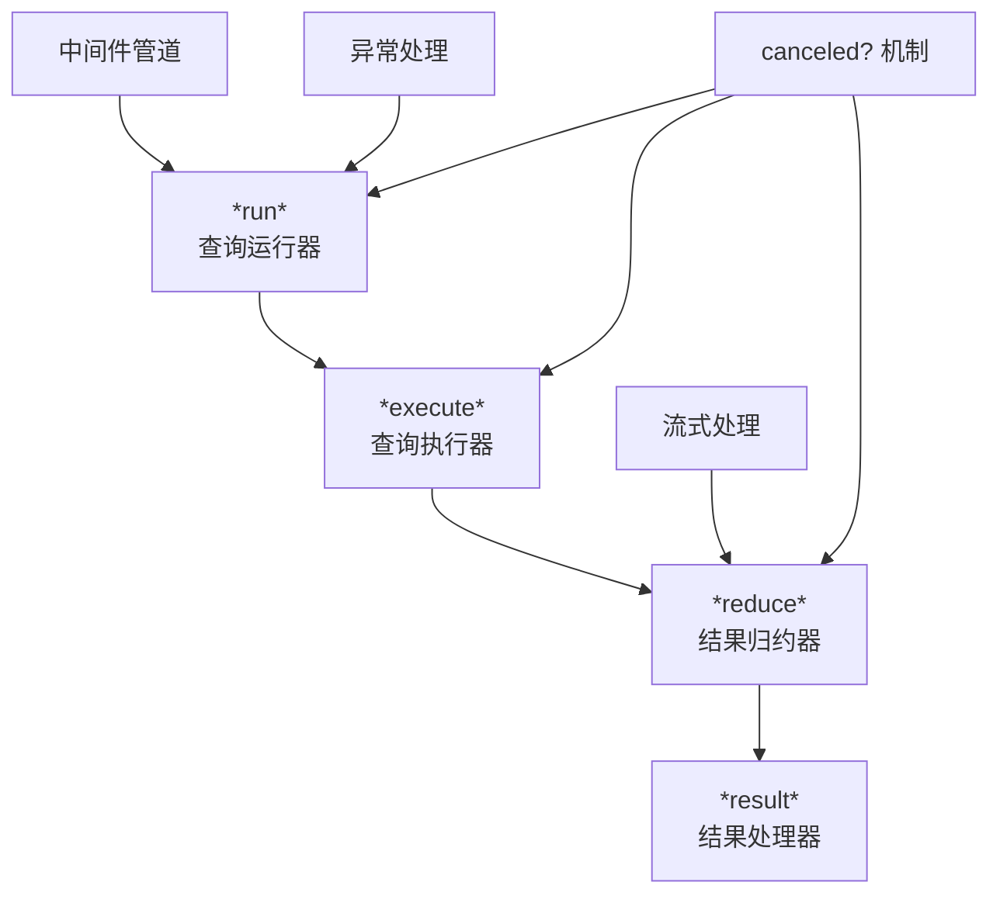

**图表来源**
- [pipeline.clj](file://src/metabase/query_processor/pipeline.clj#L27-L128)

### 动态变量定义与职责

| 动态变量 | 职责 | 生命周期阶段 | 取消支持 |
|---------|------|------------|----------|
| `*run*` | 协调整个查询执行流程 | 查询启动 | ✅ |
| `*execute*` | 驱动程序执行查询 | 查询执行 | ✅ |
| `*reduce*` | 归约查询结果 | 结果处理 | ✅ |
| `*result*` | 处理最终结果 | 结果返回 | ❌ |

**章节来源**
- [pipeline.clj](file://src/metabase/query_processor/pipeline.clj#L45-L128)

## 查询执行生命周期

### 完整执行流程

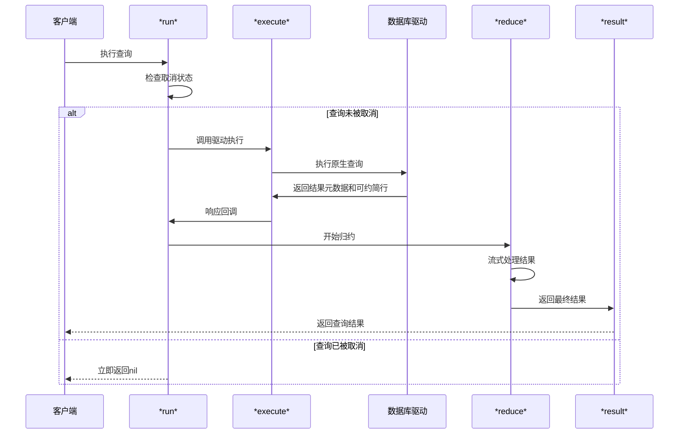

**图表来源**
- [pipeline.clj](file://src/metabase/query_processor/pipeline.clj#L95-L128)

### *run*函数的协作机制

`*run*`函数作为查询执行的入口点，负责协调`*execute*`和`*reduce*`两个关键步骤：

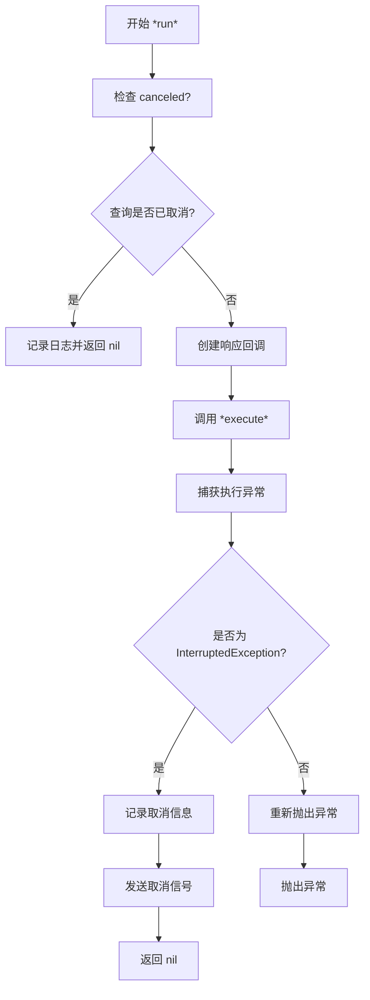

**图表来源**
- [pipeline.clj](file://src/metabase/query_processor/pipeline.clj#L95-L128)

**章节来源**
- [pipeline.clj](file://src/metabase/query_processor/pipeline.clj#L95-L128)

## 结果归约机制

### *reduce*函数的工作原理

`*reduce*`函数是查询结果处理的核心，它将可约简的行集合转换为最终的查询结果：

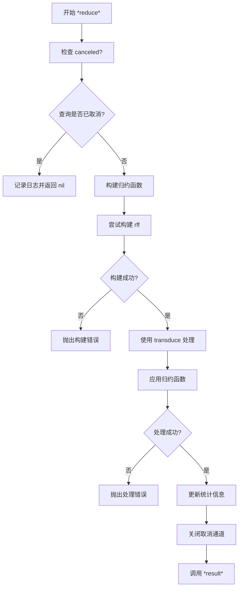

**图表来源**
- [pipeline.clj](file://src/metabase/query_processor/pipeline.clj#L62-L117)

### 默认归约函数实现

默认的归约函数`default-rff`提供了标准的结果格式化能力：

| 特性 | 实现方式 | 性能考虑 |
|------|----------|----------|
| 行计数 | `volatile!`原子操作 | 高并发安全 |
| 行存储 | `transient`向量 | 内存效率 |
| 标准格式 | `{:data {:cols ..., :rows ...}, :row_count ...}` | 兼容性保证 |

**章节来源**
- [reducible.clj](file://src/metabase/query_processor/reducible.clj#L15-L40)

## 查询取消机制

### canceled?机制的实现

Metabase通过`*canceled-chan*`动态变量实现了精确的查询取消控制：

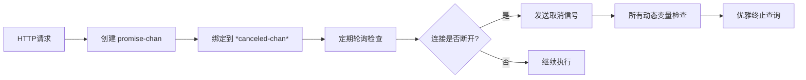

**图表来源**
- [pipeline.clj](file://src/metabase/query_processor/pipeline.clj#L10-L25)

### 取消机制的多层防护

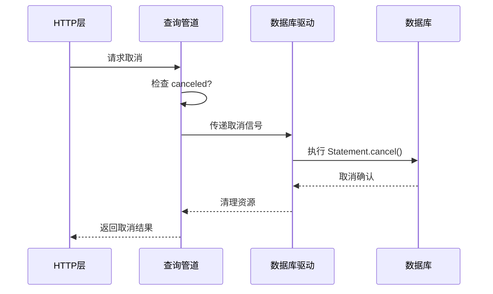

**图表来源**
- [query_cancelation.clj](file://src/metabase/app_db/query_cancelation.clj#L34-L52)

### 不同数据库的取消处理

| 数据库类型 | 取消机制 | 错误码识别 | 实现位置 |
|-----------|----------|-----------|----------|
| H2 | STATEMENT_WAS_CANCELED | ErrorCode/STATEMENT_WAS_CANCELED | `query-canceled-exception?*` |
| PostgreSQL | QUERY_CANCELED | PSQLState/QUERY_CANCELED | `query-canceled-exception?*` |
| MySQL/MariaDB | 多种错误码 | 1317, 1969, 3024 | `query-canceled-exception?*` |

**章节来源**
- [query_cancelation.clj](file://src/metabase/app_db/query_cancelation.clj#L10-L52)

## 异常处理与错误传播

### 异常处理层次结构

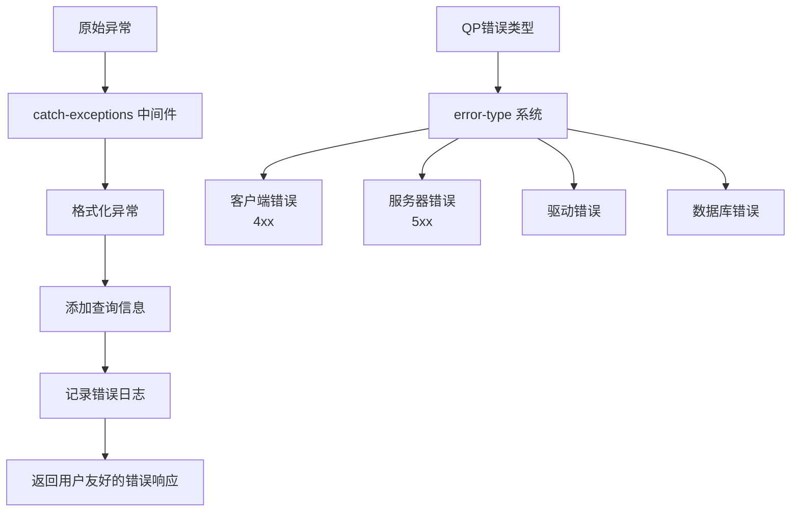

**图表来源**
- [error_type.clj](file://src/metabase/query_processor/error_type.clj#L30-L101)

### 异常分类与处理策略

| 异常类型 | 父类型 | 处理策略 | 用户可见性 |
|---------|--------|----------|-----------|
| `client` | `error` | 显示具体错误信息 | ✅ |
| `invalid-query` | `client` | 显示查询相关错误 | ✅ |
| `missing-required-parameter` | `invalid-query` | 显示参数缺失信息 | ✅ |
| `server` | `error` | 显示通用错误信息 | ❌ |
| `qp` | `server` | 记录详细错误日志 | ❌ |
| `driver` | `qp` | 显示驱动相关错误 | ❌ |
| `db` | `server` | 显示数据库错误 | ❌ |

**章节来源**
- [error_type.clj](file://src/metabase/query_processor/error_type.clj#L30-L101)

### 异常传播机制

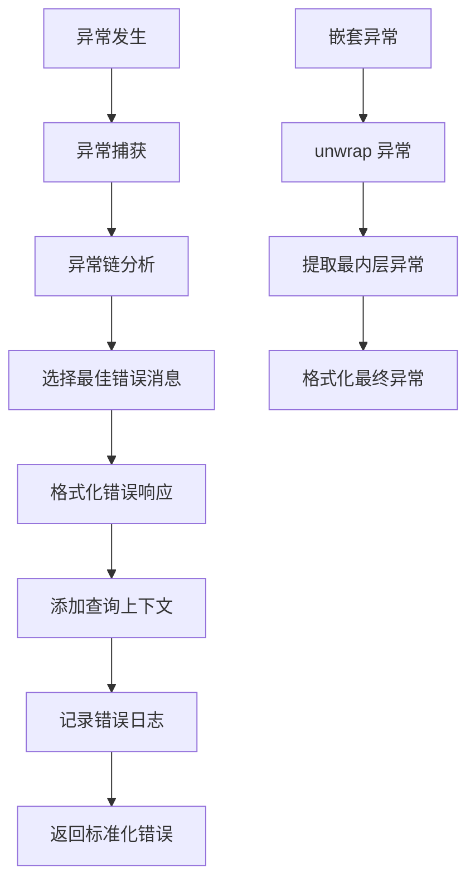

**图表来源**
- [catch_exceptions.clj](file://src/metabase/query_processor/middleware/catch_exceptions.clj#L65-L151)

**章节来源**
- [catch_exceptions.clj](file://src/metabase/query_processor/middleware/catch_exceptions.clj#L65-L151)

## 数据库驱动适配机制

### execute-reducible-query接口

每个数据库驱动都必须实现`execute-reducible-query`方法来适配查询执行机制：

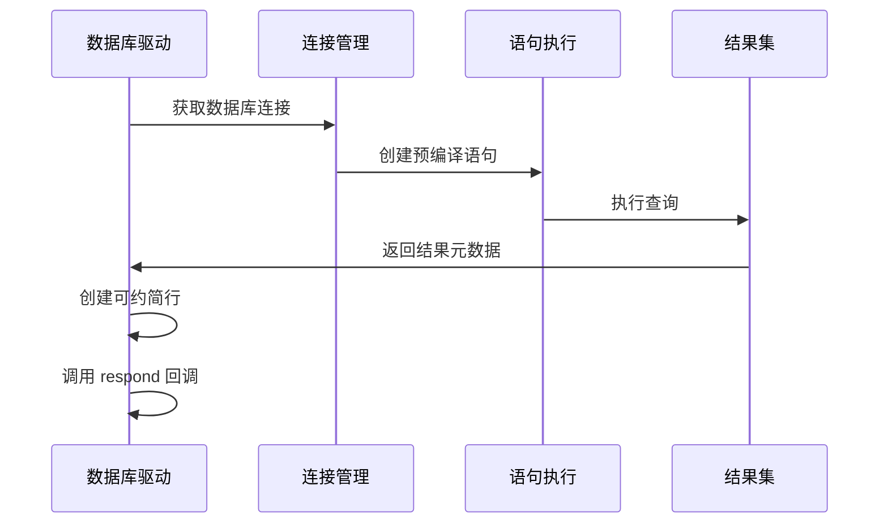

**图表来源**
- [sql_jdbc_execute.clj](file://src/metabase/driver/sql_jdbc/execute.clj#L745-L799)

### 驱动适配的关键特性

| 特性 | 实现要求 | 性能影响 | 可选性 |
|------|----------|----------|--------|
| 可约简结果 | 实现 `reducible-rows` | 流式处理 | 必需 |
| 取消支持 | 支持 `Statement.cancel()` | 及时清理 | 推荐 |
| 类型映射 | 正确的JDBC类型转换 | 数据准确性 | 必需 |
| 连接池 | 使用连接池管理 | 资源效率 | 必需 |

**章节来源**
- [sql_jdbc_execute.clj](file://src/metabase/driver/sql_jdbc/execute.clj#L745-L799)

## 流式处理实现

### reducible-rows机制

Metabase通过`reducible-rows`实现了高效的流式查询处理：

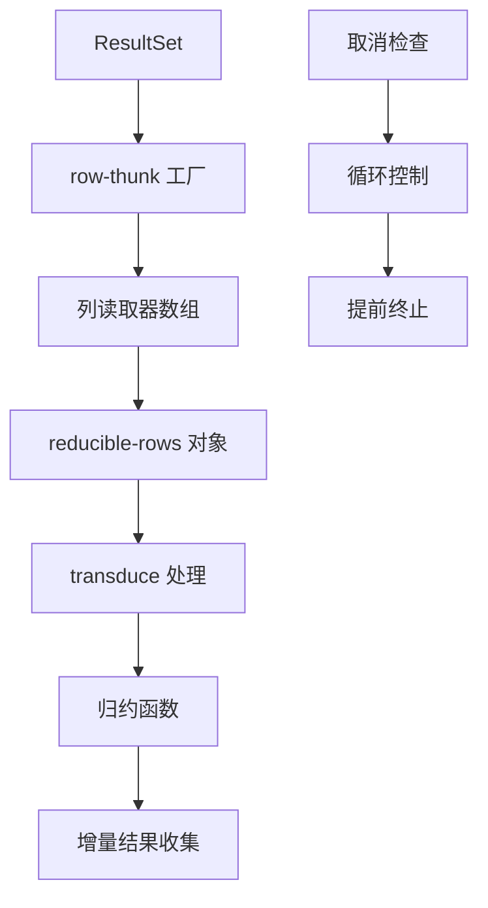

**图表来源**
- [reducible.clj](file://src/metabase/query_processor/reducible.clj#L42-L70)

### 流式处理的优势

| 优势 | 技术实现 | 性能收益 | 内存节省 |
|------|----------|----------|----------|
| 大结果集处理 | 增量归约 | 避免OOM | 线性内存使用 |
| 实时数据流 | 拉取式处理 | 降低延迟 | 最小缓存 |
| 取消响应性 | 定期检查 | 及时清理 | 快速释放 |
| 资源管理 | 自动关闭 | 防止泄漏 | 及时回收 |

**章节来源**
- [reducible.clj](file://src/metabase/query_processor/reducible.clj#L42-L70)

### 下载流式处理

对于大文件下载，Metabase实现了专门的流式处理机制：

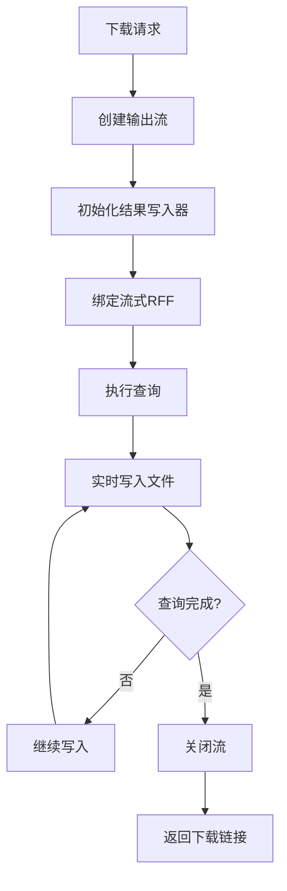

**图表来源**
- [streaming.clj](file://src/metabase/query_processor/streaming.clj#L180-L265)

**章节来源**
- [streaming.clj](file://src/metabase/query_processor/streaming.clj#L180-L265)

## 性能优化最佳实践

### 查询执行优化策略

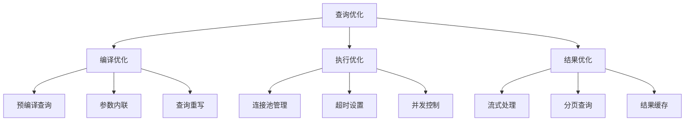

### 性能监控指标

| 指标类别 | 关键指标 | 监控方法 | 优化目标 |
|---------|----------|----------|----------|
| 执行时间 | 查询响应时间 | `u/start-timer` | < 5秒 |
| 资源使用 | 内存占用 | JVM监控 | 稳定运行 |
| 并发性能 | 同时查询数 | 连接池监控 | 最大吞吐量 |
| 错误率 | 失败查询比例 | 异常统计 | < 1% |

### 中间件性能优化

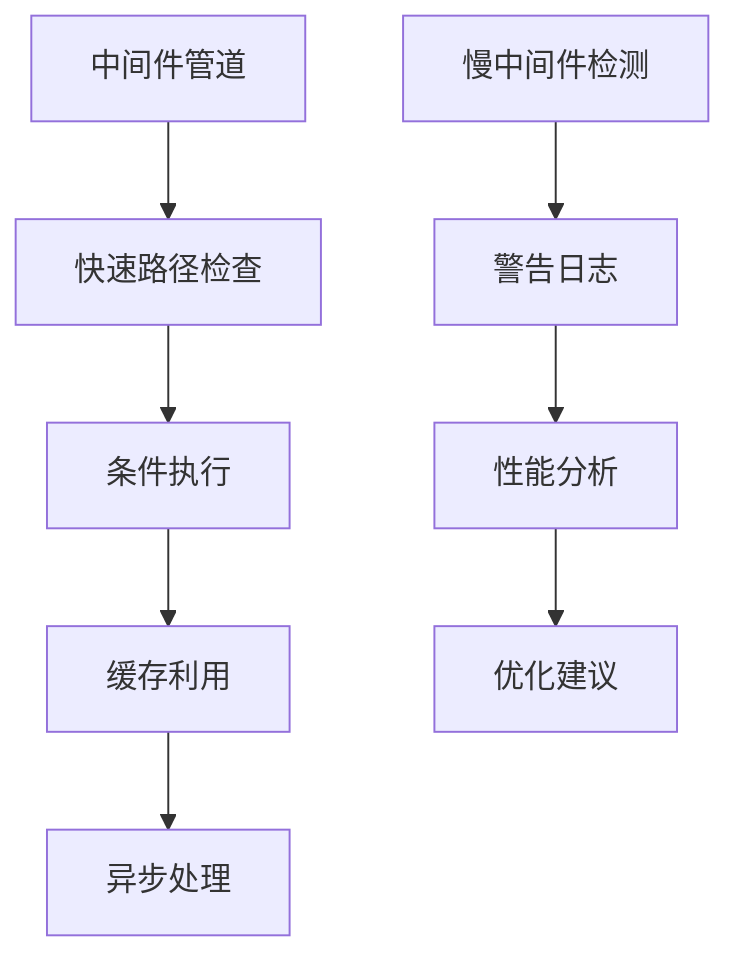

**章节来源**
- [compile.clj](file://src/metabase/query_processor/compile.clj#L40-L96)

## 总结

Metabase查询执行引擎通过精心设计的动态变量系统、完善的异常处理机制和灵活的数据库驱动适配，实现了高效、可靠、可扩展的查询处理能力。其核心特点包括：

1. **模块化架构**：通过`*run*`、`*execute*`、`*reduce*`三个动态变量实现了清晰的职责分离
2. **取消机制**：多层次的取消检查确保了资源的有效管理和用户体验
3. **异常处理**：完善的错误分类和传播机制提供了良好的故障恢复能力
4. **流式处理**：可约简的结果集处理支持大规模数据的高效查询
5. **驱动适配**：统一的接口设计使得新数据库驱动的集成变得简单

这种设计不仅满足了当前的功能需求，还为未来的扩展和优化奠定了坚实的基础。通过遵循本文档中的最佳实践，开发者可以充分利用Metabase查询引擎的强大功能，构建高性能的数据分析应用。