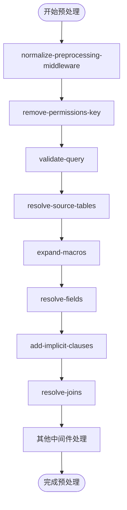
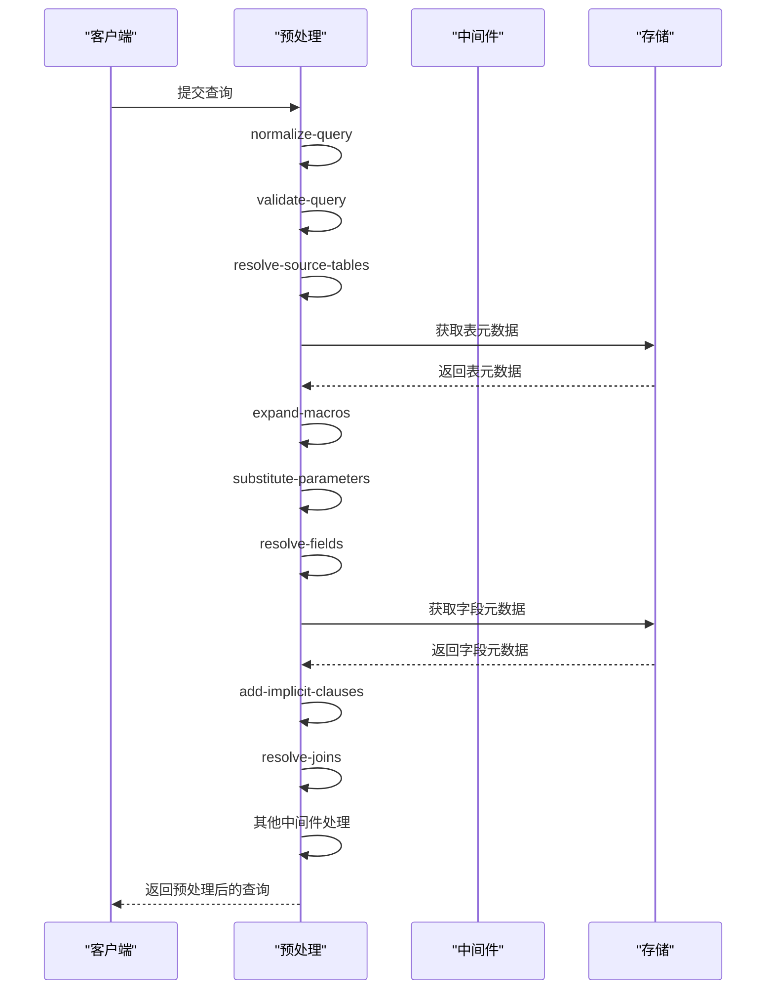

# 查询预处理阶段

<cite>
**本文档中引用的文件**  
- [preprocess.clj](file://src/metabase/query_processor/preprocess.clj)
- [resolve_source_table.clj](file://src/metabase/query_processor/middleware/resolve_source_table.clj)
- [resolve_fields.clj](file://src/metabase/query_processor/middleware/resolve_fields.clj)
- [resolve_joins.clj](file://src/metabase/query_processor/middleware/resolve_joins.clj)
- [expand_macros.clj](file://src/metabase/query_processor/middleware/expand_macros.clj)
- [parameters.clj](file://src/metabase/query_processor/middleware/parameters.clj)
- [add_implicit_clauses.clj](file://src/metabase/query_processor/middleware/add_implicit_clauses.clj)
- [desugar.clj](file://src/metabase/query_processor/middleware/desugar.clj)
- [normalize_query.clj](file://src/metabase/query_processor/middleware/normalize_query.clj)
- [validate.clj](file://src/metabase/query_processor/middleware/validate.clj)
- [catch_exceptions.clj](file://src/metabase/query_processor/middleware/catch_exceptions.clj)
- [debug.clj](file://src/metabase/query_processor/debug.clj)
</cite>

## 目录
1. [简介](#简介)
2. [预处理流程概述](#预处理流程概述)
3. [中间件处理链机制](#中间件处理链机制)
4. [核心解析步骤分析](#核心解析步骤分析)
5. [预处理功能实现细节](#预处理功能实现细节)
6. [错误处理机制](#错误处理机制)
7. [预处理阶段时序图](#预处理阶段时序图)
8. [调试与性能监控](#调试与性能监控)

## 简介
Metabase查询预处理阶段是将原始查询转换为可执行内部表示的关键环节。该阶段通过组合多个中间件形成处理链，依次执行参数替换、隐式子句添加、宏展开等操作，最终生成标准化的查询结构。本文档深入分析预处理机制的实现原理。

## 预处理流程概述

Metabase查询预处理阶段通过`preprocess`函数实现，该函数位于`src/metabase/query_processor/preprocess.clj`文件中。预处理流程将原始查询作为输入，经过一系列中间件处理，输出标准化的内部查询表示。

预处理流程的主要特点包括：
- 使用`transduce`函数组合多个中间件形成处理链
- 每个中间件接收查询并返回修改后的查询
- 处理链按预定义顺序执行，确保依赖关系正确
- 提供详细的日志记录和调试支持

**本节来源**
- [preprocess.clj](file://src/metabase/query_processor/preprocess.clj#L92-L123)

## 中间件处理链机制

预处理阶段的核心是中间件处理链机制，通过`transduce`函数将多个中间件组合成一个处理管道。处理链的执行顺序在`middleware`变量中定义，位于`preprocess.clj`文件中。



**图示来源**
- [preprocess.clj](file://src/metabase/query_processor/preprocess.clj#L92-L123)

**本节来源**
- [preprocess.clj](file://src/metabase/query_processor/preprocess.clj#L92-L123)

## 核心解析步骤分析

### 源表解析

`resolve-source-tables`中间件负责解析查询中的源表引用。该中间件通过`lib.metadata/bulk-metadata-or-throw`函数批量获取表元数据，并将其存储在查询处理器的存储中。

```clojure
(defn resolve-source-tables
  "Middleware that will take any `:source-table`s (integer IDs) anywhere in the query and fetch and save the
  corresponding Table in the Query Processor Store."
  [query]
  ;; this is done for side effects
  (lib.metadata/bulk-metadata-or-throw query :metadata/table (lib/all-source-table-ids query))
  query)
```

**本节来源**
- [resolve_source_table.clj](file://src/metabase/query_processor/middleware/resolve_source_table.clj#L1-L13)

### 字段解析

`resolve-fields`中间件负责解析查询中引用的所有字段。该中间件通过`lib.all-field-ids`函数获取所有字段ID，然后使用`bulk-metadata-or-throw`函数批量获取字段元数据。

```clojure
(defn resolve-fields
  "Resolve all field referenced in the `query`, and store them in the Metadata Provider."
  [query]
  (let [ids (lib/all-field-ids query)]
    (try
      (u/prog1 query
        (resolve-fields-with-ids! query ids))
      (catch Throwable e
        (throw (ex-info (tru "Error resolving Fields in query: {0}" (ex-message e))
                        {:field-ids ids
                         :query     query
                         :type      qp.error-type/qp}
                        e))))))
```

**本节来源**
- [resolve_fields.clj](file://src/metabase/query_processor/middleware/resolve_fields.clj#L1-L37)

### 连接解析

`resolve-joins`中间件负责解析查询中的连接操作。该中间件处理连接的默认策略、字段解析和连接字段的合并。

```clojure
(mu/defn resolve-joins :- ::lib.schema/query
  "1. Walk joins and merge defaults like `:strategy :left-join`
   2. Walk joins and resolve `:fields :all` to a vector of field refs
   3. Walk stages and merge in `:fields` from `:joins`"
  [query :- ::lib.schema/query]
  (-> query
      (lib.walk/walk (fn [query path-type path join]
                       (when (= path-type :lib.walk/join)
                         (resolve-join query path join))))
      (lib.walk/walk-stages (fn [__query _path stage]
                              (when (seq (:joins stage))
                                (merge-joins-fields stage))))))
```

**本节来源**
- [resolve_joins.clj](file://src/metabase/query_processor/middleware/resolve_joins.clj#L1-L150)

## 预处理功能实现细节

### 参数替换

`substitute-parameters`中间件负责处理查询参数的替换。该中间件支持MBQL和原生查询的参数替换，能够处理阶段级别的参数应用。

```clojure
(mu/defn substitute-parameters :- ::lib.schema/query
  "Substitute Dashboard or Card-supplied parameters in a query, replacing the param placeholers with appropriate values
  and/or modifiying the query as appropriate."
  [query :- ::lib.schema/query]
  (-> query
      hoist-database-for-snippet-tags
      expand-parameters))
```

**本节来源**
- [parameters.clj](file://src/metabase/query_processor/middleware/parameters.clj#L1-L147)

### 隐式子句添加

`add-implicit-clauses`中间件负责为查询添加隐式子句。该中间件会为没有聚合、分组或显式字段的查询添加隐式字段，并为分组字段添加隐式排序。

```clojure
(mu/defn add-implicit-clauses :- ::lib.schema/query
  "Add an implicit `fields` clause to queries with no `:aggregation`, `breakout`, or explicit `:fields` clauses.
   Add implicit `:order-by` clauses for fields specified in a `:breakout`."
  [query :- ::lib.schema/query]
  (-> query
      (lib.walk/walk-stages add-implicit-breakout-order-by)
      (lib.walk/walk-stages add-implicit-fields)))
```

**本节来源**
- [add_implicit_clauses.clj](file://src/metabase/query_processor/middleware/add_implicit_clauses.clj#L1-L93)

### 宏展开

`expand-macros`中间件负责展开查询中的宏（如段）。该中间件递归处理宏引用，防止无限递归。

```clojure
(mu/defn expand-macros
  "Middleware that looks for `:segment` macros in an unexpanded MBQL query and substitute the macros for
  their contents."
  ([query  :- ::lib.schema/query]
   (expand-macros query 0))

  ([query recursion-depth]
   (when (> recursion-depth max-recursion-depth)
     (throw (ex-info (tru "Segment expansion failed. Check mutually recursive segment definitions.")
                     {:type qp.error-type/invalid-query, :query query})))
   (let [query' (expand-legacy-macros :segment query)]
     ;; if we expanded anything, we need to recursively try expanding again until nothing is left to expand
     (if-not (= query' query)
       (recur query' (inc recursion-depth))
       (do
         (log/trace "No more legacy Segments to expand.")
         query')))))
```

**本节来源**
- [expand_macros.clj](file://src/metabase/query_processor/middleware/expand_macros.clj#L1-L157)

### 语法糖处理

`desugar`中间件负责将高级语法糖转换为低级MBQL子句。这减少了驱动程序需要支持的MBQL子句数量。

```clojure
(mu/defn desugar :- ::lib.schema/query
  "Middleware that uses MBQL lib functions to replace high-level 'syntactic sugar' clauses like `time-interval` and
  `inside` with lower-level clauses like `between`."
  [query :- ::lib.schema/query]
  (lib.walk/walk query (fn [_query _path-type _path stage-or-join]
                         (desugar* stage-or-join))))
```

**本节来源**
- [desugar.clj](file://src/metabase/query_processor/middleware/desugar.clj#L1-L28)

## 错误处理机制

预处理阶段的错误处理机制通过try-catch块实现，能够捕获和包装中间件执行过程中的异常。

```clojure
([query middleware-fn]
 (try
   (assert (ifn? middleware-fn))
   (let [start-timer (u/start-timer)]
     (u/prog1 (middleware-fn query)
       (let [duration-ms (u/since-ms start-timer)]
         (when (> duration-ms slow-middleware-warning-threshold-ms)
           (log/warnf "Slow middleware: %s took %s" middleware-fn (u/format-milliseconds duration-ms))))
       (qp.debug/debug>
         (when-not (= <> query)
           (list middleware-fn '=> <>
                 ^{:portal.viewer/default :portal.viewer/diff}
                 [query <>])))
       (when-not (map? <>)
         (throw (ex-info (format "Middleware did not return a valid query.")
                         {:fn middleware-fn, :query query, :result <>, :type qp.error-type/qp})))))
   (catch Throwable e
     (let [middleware-fn middleware-fn]
       (throw (ex-info (i18n/tru "Error preprocessing query in {0}: {1}" middleware-fn ((some-fn ex-message class) e))
                       {:fn middleware-fn, :query query, :type qp.error-type/qp}
                       e)))))))
```

错误处理机制的特点包括：
- 捕获每个中间件执行过程中的异常
- 包装异常信息，包含中间件函数、原始查询和错误类型
- 提供本地化错误消息
- 记录慢速中间件的执行时间

**本节来源**
- [preprocess.clj](file://src/metabase/query_processor/preprocess.clj#L121-L143)

## 预处理阶段时序图



**图示来源**
- [preprocess.clj](file://src/metabase/query_processor/preprocess.clj#L92-L123)
- [resolve_source_table.clj](file://src/metabase/query_processor/middleware/resolve_source_table.clj#L1-L13)
- [resolve_fields.clj](file://src/metabase/query_processor/middleware/resolve_fields.clj#L1-L37)
- [resolve_joins.clj](file://src/metabase/query_processor/middleware/resolve_joins.clj#L1-L150)

## 调试与性能监控

预处理阶段提供了详细的调试和性能监控支持。通过`debug>`宏可以启用调试模式，记录中间件执行前后的查询变化。

```clojure
(defmacro debug>
  "tap> something for debug purposes if [[*debug*]] is enabled. Body is not evaluated unless debugging is enabled."
  {:style/indent 0}
  [& body]
  #_{:clj-kondo/ignore [:discouraged-var]}
  `(when *debug*
     (when-some [result# (do ~@body)]
       (tap> result#))))
```

性能监控功能包括：
- 记录每个中间件的执行时间
- 对执行时间超过阈值的中间件发出警告
- 提供查询预处理前后的差异比较

**本节来源**
- [debug.clj](file://src/metabase/query_processor/debug.clj#L1-L22)
- [preprocess.clj](file://src/metabase/query_processor/preprocess.clj#L121-L143)