# 结果后处理阶段

<cite>
**本文档中引用的文件**
- [postprocess.clj](file://src/metabase/query_processor/postprocess.clj)
- [format_rows.clj](file://src/metabase/query_processor/middleware/format_rows.clj)
- [results_metadata.clj](file://src/metabase/query_processor/middleware/results_metadata.clj)
- [add_timezone_info.clj](file://src/metabase/query_processor/middleware/add-timezone-info.clj)
- [large_int.clj](file://src/metabase/query_processor/middleware/large_int.clj)
- [visualization_settings.clj](file://src/metabase/query_processor/middleware/visualization_settings.clj)
- [add_rows_truncated.clj](file://src/metabase/query_processor/middleware/add_rows_truncated.clj)
- [annotate.clj](file://src/metabase/query_processor/middleware/annotate.clj)
- [fetch_source_query.clj](file://src/metabase/query_processor/middleware/fetch_source_query.clj)
- [pipeline.clj](file://src/metabase/query_processor/pipeline.clj)
- [reducible.clj](file://src/metabase/query_processor/reducible.clj)
- [execute.clj](file://src/metabase/query_processor/execute.clj)
- [preprocess.clj](file://src/metabase/query_processor/preprocess.clj)
</cite>

## 目录
1. [简介](#简介)
2. [系统架构概览](#系统架构概览)
3. [post-processing-rff函数详解](#post-processing-rff函数详解)
4. [核心中间件分析](#核心中间件分析)
5. [流式处理机制](#流式处理机制)
6. [数据完整性与性能优化](#数据完整性与性能优化)
7. [高级功能实现](#高级功能实现)
8. [故障排除指南](#故障排除指南)
9. [总结](#总结)

## 简介

Metabase查询结果后处理阶段是查询处理流水线中的关键环节，负责将查询执行后的原始结果进行格式化、元数据记录、行数限制等处理操作。该阶段通过一系列中间件函数对结果进行变换，确保最终返回给用户的查询结果既符合预期格式，又包含必要的元数据信息。

后处理阶段的核心目标包括：
- 将数据库返回的原始数据格式化为前端可识别的格式
- 添加时间戳、类型信息等元数据
- 实现行数限制和截断功能
- 处理大整数转换以避免JavaScript精度丢失
- 生成可视化设置和配置信息
- 保持流式处理特性的同时确保数据完整性

## 系统架构概览

Metabase查询处理采用分层架构设计，后处理阶段位于整个流水线的末端，接收来自执行阶段的结果并进行最终处理。

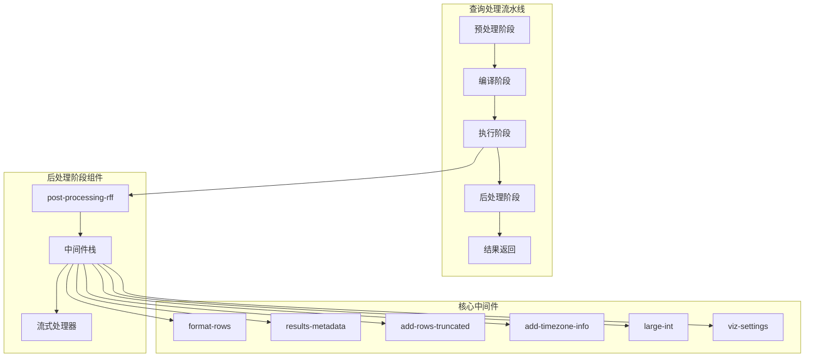

**图表来源**
- [postprocess.clj](file://src/metabase/query_processor/postprocess.clj#L21-L57)
- [pipeline.clj](file://src/metabase/query_processor/pipeline.clj#L62-L85)

**章节来源**
- [postprocess.clj](file://src/metabase/query_processor/postprocess.clj#L1-L66)
- [pipeline.clj](file://src/metabase/query_processor/pipeline.clj#L1-L130)

## post-processing-rff函数详解

`post-processing-rff`函数是后处理阶段的核心入口点，它将多个中间件函数串联起来形成一个处理流水线。该函数采用函数组合的方式，从底部向上依次应用各个中间件。

### 函数签名与工作原理

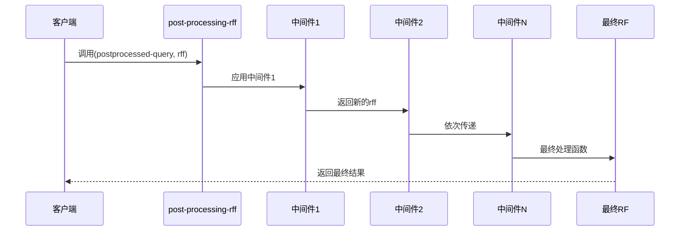

**图表来源**
- [postprocess.clj](file://src/metabase/query_processor/postprocess.clj#L48-L64)

### 中间件执行顺序

后处理中间件按照特定顺序执行，形成了一个从底层到顶层的处理链：

1. **format-rows**: 格式化行数据，特别是时间戳和日期格式
2. **results-metadata**: 记录和返回结果元数据
3. **limit**: 应用行数限制
4. **enterprise限制**: 企业版下载限制
5. **add-rows-truncated**: 添加截断标记
6. **add-timezone-info**: 添加时区信息
7. **enterprise元数据合并**: 企业版沙箱元数据合并
8. **add-remaps**: 结果重映射
9. **pivot-export**: 透视导出支持
10. **large-int**: 大整数转换
11. **viz-settings**: 可视化设置更新
12. **cumulative-aggregations**: 累积聚合处理
13. **annotate**: 列信息注解
14. **fetch-source-query**: 获取源查询信息

这种自底向上的执行顺序确保了每个中间件都能在适当的上下文中处理数据。

**章节来源**
- [postprocess.clj](file://src/metabase/query_processor/postprocess.clj#L21-L57)
- [postprocess.clj](file://src/metabase/query_processor/postprocess.clj#L48-L64)

## 核心中间件分析

### format-rows中间件

`format-rows`中间件负责将查询结果中的值格式化为适合前端显示的格式，特别是时间戳和日期类型的处理。

#### 核心功能

- **时间戳格式化**: 将Java时间对象转换为ISO-8601格式字符串
- **时区处理**: 支持结果时区和请求时区的双重处理
- **协议扩展**: 使用`FormatValue`协议支持自定义类型格式化

#### 实现细节

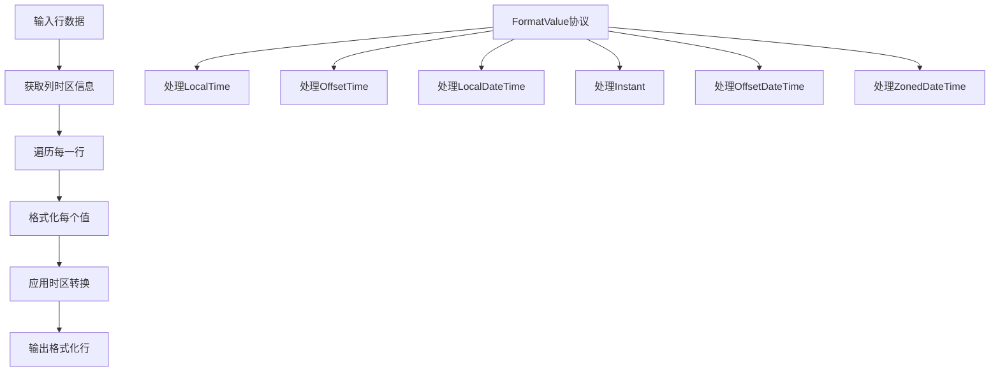

**图表来源**
- [format_rows.clj](file://src/metabase/query_processor/middleware/format_rows.clj#L64-L84)

#### 关键特性

- **惰性求值**: 使用transducers实现高效的流式处理
- **时区感知**: 支持列级别的时区转换
- **类型安全**: 通过Malli schema确保类型正确性

**章节来源**
- [format_rows.clj](file://src/metabase/query_processor/middleware/format_rows.clj#L1-L86)

### results-metadata中间件

该中间件负责记录和管理查询结果的元数据信息，包括列类型、分析洞察等。

#### 元数据记录流程

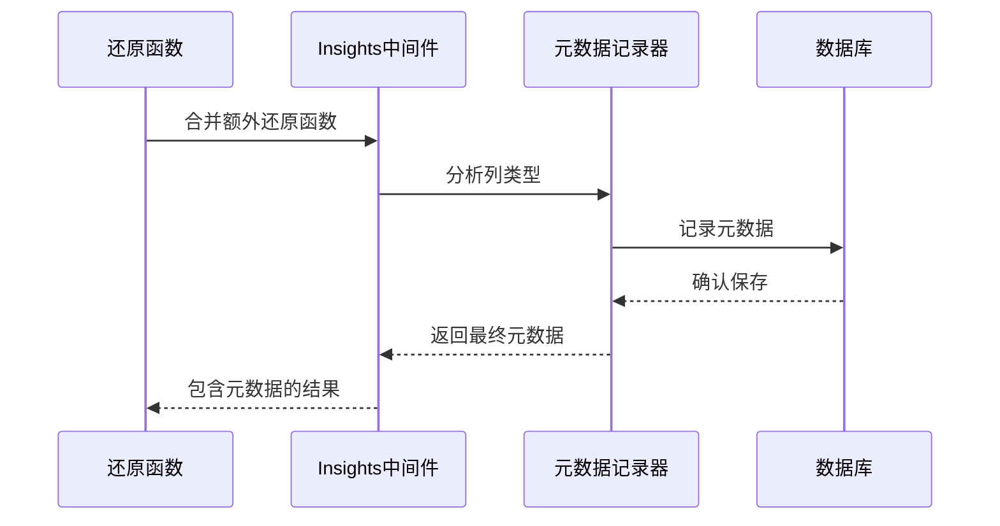

**图表来源**
- [results_metadata.clj](file://src/metabase/query_processor/middleware/results_metadata.clj#L120-L160)

#### 功能特性

- **自动类型推断**: 基于样本数据推断列类型
- **元数据合并**: 合并不同来源的列元数据
- **缓存机制**: 避免重复记录相同的元数据
- **错误处理**: 优雅处理元数据记录失败的情况

**章节来源**
- [results_metadata.clj](file://src/metabase/query_processor/middleware/results_metadata.clj#L1-L161)

### add-rows-truncated中间件

该中间件负责检测查询结果是否被截断，并添加相应的标记信息。

#### 截断检测逻辑

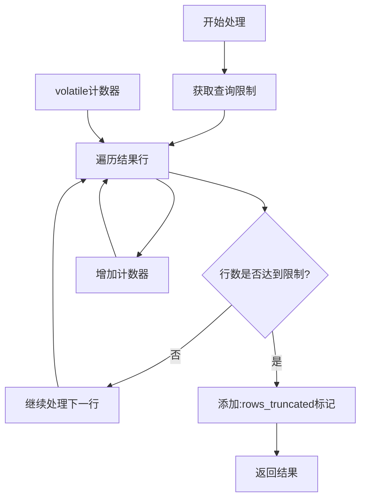

**图表来源**
- [add_rows_truncated.clj](file://src/metabase/query_processor/middleware/add_rows_truncated.clj#L25-L48)

#### 实现特点

- **状态管理**: 使用volatile变量跟踪行数
- **条件判断**: 仅在结果为map且达到限制时添加标记
- **兼容性**: 仅影响标准结果格式，不影响流式导出

**章节来源**
- [add_rows_truncated.clj](file://src/metabase/query_processor/middleware/add_rows_truncated.clj#L1-L48)

### add-timezone-info中间件

为查询结果添加时区相关信息，支持前端正确显示时间数据。

#### 时区信息结构

| 字段名 | 类型 | 描述 |
|--------|------|------|
| results_timezone | string | 查询结果的默认时区 |
| requested_timezone | string | 用户请求的时区（可选） |

**章节来源**
- [add_timezone_info.clj](file://src/metabase/query_processor/middleware/add-timezone-info.clj#L1-L17)

### large-int中间件

处理大整数转换，避免JavaScript精度丢失问题。

#### 大整数检测范围

| 数值类型 | 检测范围 |
|----------|----------|
| Long | [-2^53+1, 2^53-1] |
| BigInt | [-2^53+1, 2^53-1] |
| BigInteger | [-2^53+1, 2^53-1] |
| BigDecimal | [-2^53+1, 2^53-1] |

#### 性能优化策略

- **列级检查**: 仅对可能包含大整数的列进行检查
- **索引掩码**: 使用布尔数组快速跳过非匹配列
- **延迟转换**: 仅在必要时进行字符串转换

**章节来源**
- [large_int.clj](file://src/metabase/query_processor/middleware/large_int.clj#L1-L91)

### viz-settings中间件

生成和处理可视化设置信息，支持复杂的图表配置。

#### 设置合并流程

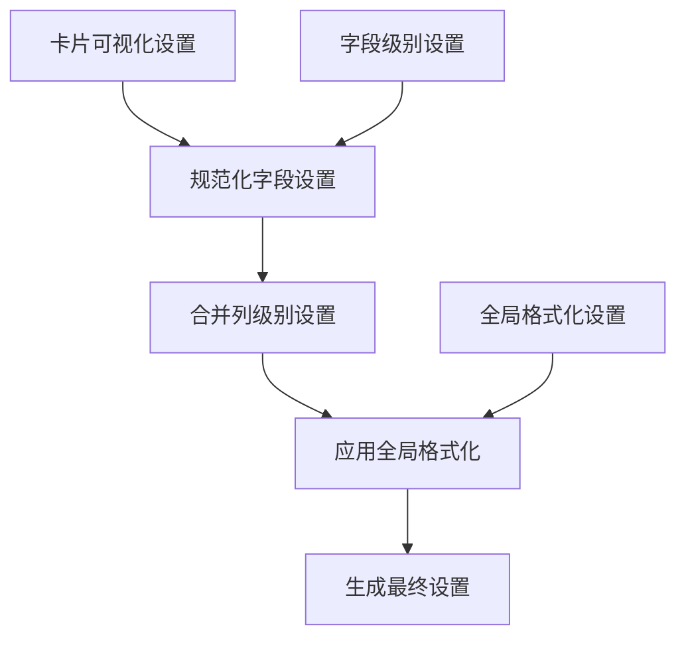

**图表来源**
- [visualization_settings.clj](file://src/metabase/query_processor/middleware/visualization_settings.clj#L25-L87)

**章节来源**
- [visualization_settings.clj](file://src/metabase/query_processor/middleware/visualization_settings.clj#L1-L88)

## 流式处理机制

Metabase的后处理阶段采用了先进的流式处理技术，能够在处理大量数据时保持内存效率和响应性。

### reducible接口

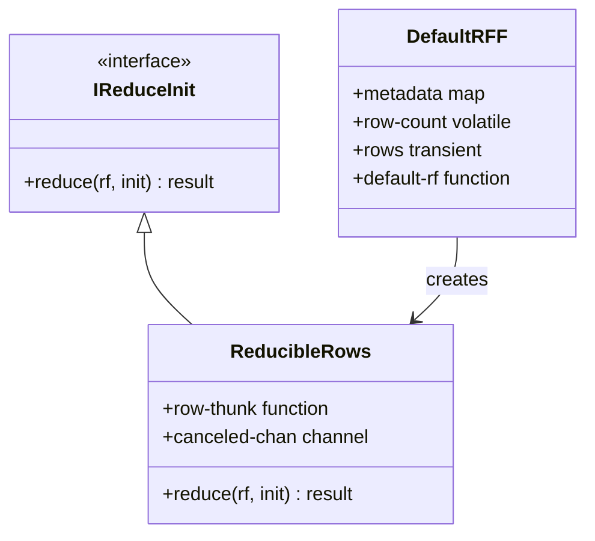

**图表来源**
- [reducible.clj](file://src/metabase/query_processor/reducible.clj#L37-L76)

### 流式处理优势

1. **内存效率**: 不需要将所有数据加载到内存中
2. **早期终止**: 支持在满足条件时提前停止处理
3. **并发处理**: 可以与其他任务并行执行
4. **取消支持**: 在长时间运行的任务中提供取消机制

### 管道处理流程

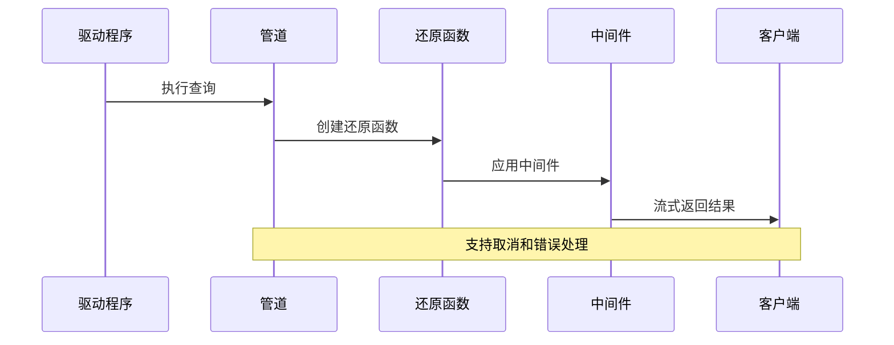

**图表来源**
- [pipeline.clj](file://src/metabase/query_processor/pipeline.clj#L62-L85)

**章节来源**
- [reducible.clj](file://src/metabase/query_processor/reducible.clj#L1-L117)
- [pipeline.clj](file://src/metabase/query_processor/pipeline.clj#L1-L130)

## 数据完整性与性能优化

### 数据完整性保障

后处理阶段通过多种机制确保数据的完整性和一致性：

1. **类型验证**: 使用Malli schema进行严格的类型检查
2. **错误恢复**: 提供优雅的错误处理和恢复机制
3. **状态同步**: 使用volatile变量保证状态的一致性
4. **事务性**: 在元数据记录等关键操作中使用事务

### 性能优化策略

#### 并行处理

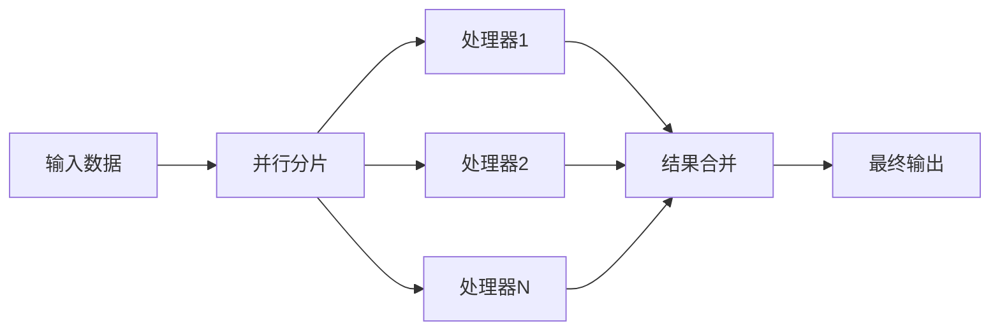

#### 缓存机制

- **元数据缓存**: 缓存列类型和分析结果
- **中间件缓存**: 缓存昂贵的计算结果
- **查询结果缓存**: 缓存完整的查询结果

#### 内存管理

- **惰性求值**: 只在需要时才计算数据
- **流式处理**: 避免大量数据的内存占用
- **垃圾回收**: 及时释放不需要的对象

**章节来源**
- [postprocess.clj](file://src/metabase/query_processor/postprocess.clj#L48-L64)
- [reducible.clj](file://src/metabase/query_processor/reducible.clj#L75-L96)

## 高级功能实现

### 时区信息处理

后处理阶段能够智能地处理不同时区的时间数据：

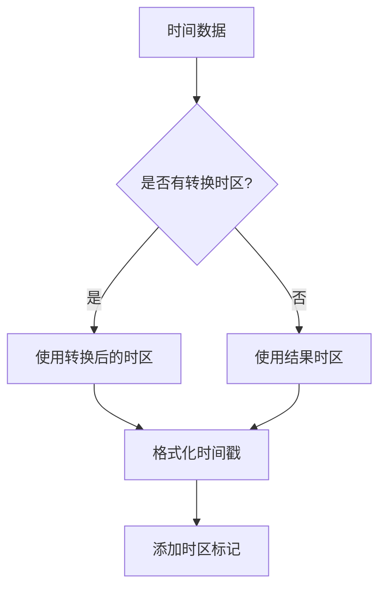

### 大整数转换

对于可能在JavaScript中丢失精度的大整数，系统会自动将其转换为字符串：

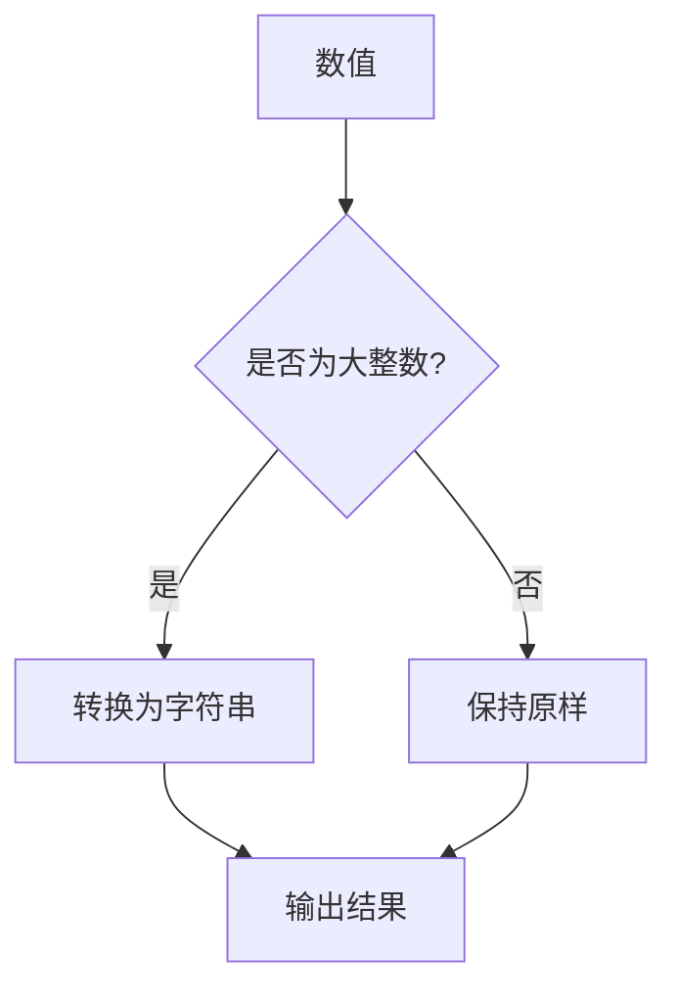

### 可视化设置生成

系统能够根据查询类型和用户偏好生成相应的可视化设置：

- **字段级别设置**: 基于字段属性的个性化配置
- **卡片级别设置**: 卡片级别的全局配置
- **全局设置**: 系统级别的默认设置
- **动态调整**: 根据数据特征自动调整设置

**章节来源**
- [format_rows.clj](file://src/metabase/query_processor/middleware/format_rows.clj#L25-L85)
- [large_int.clj](file://src/metabase/query_processor/middleware/large_int.clj#L60-L91)
- [visualization_settings.clj](file://src/metabase/query_processor/middleware/visualization_settings.clj#L50-L87)

## 故障排除指南

### 常见问题及解决方案

#### 中间件执行失败

**症状**: 查询结果为空或出现异常
**原因**: 中间件返回无效函数
**解决方案**: 检查中间件的返回值，确保返回有效的还原函数

#### 内存溢出

**症状**: 处理大数据集时出现OutOfMemoryError
**原因**: 流式处理未正确实现或缓存过多数据
**解决方案**: 
- 检查reducible接口的实现
- 减少缓存大小
- 增加JVM堆内存

#### 时区处理错误

**症状**: 时间数据显示不正确
**原因**: 时区信息缺失或格式错误
**解决方案**: 
- 确保查询包含正确的时区信息
- 检查时区转换逻辑
- 验证客户端时区设置

#### 性能问题

**症状**: 查询处理速度慢
**原因**: 中间件执行时间过长或存在瓶颈
**解决方案**:
- 启用中间件性能监控
- 优化耗时的中间件
- 考虑并行处理

### 调试技巧

1. **启用调试日志**: 设置适当的日志级别查看中间件执行过程
2. **性能分析**: 使用性能分析工具识别瓶颈
3. **单元测试**: 为关键中间件编写单元测试
4. **监控指标**: 监控查询处理时间和资源使用情况

**章节来源**
- [postprocess.clj](file://src/metabase/query_processor/postprocess.clj#L54-L64)
- [pipeline.clj](file://src/metabase/query_processor/pipeline.clj#L100-L129)

## 总结

Metabase的查询结果后处理阶段是一个精心设计的系统，它通过一系列中间件实现了复杂的数据处理需求。该系统的主要优势包括：

1. **模块化设计**: 每个中间件专注于特定的功能，便于维护和扩展
2. **流式处理**: 支持大规模数据的高效处理
3. **类型安全**: 使用Malli schema确保数据的正确性
4. **性能优化**: 采用多种优化策略提高处理效率
5. **错误处理**: 提供完善的错误处理和恢复机制

后处理阶段不仅保证了查询结果的质量和一致性，还为Metabase提供了强大的扩展能力。开发者可以通过添加新的中间件来实现特定的需求，而无需修改核心处理逻辑。

随着数据量的增长和用户需求的多样化，这个后处理系统将继续演进，为用户提供更加丰富和高效的数据分析体验。