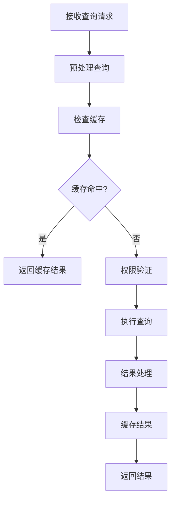
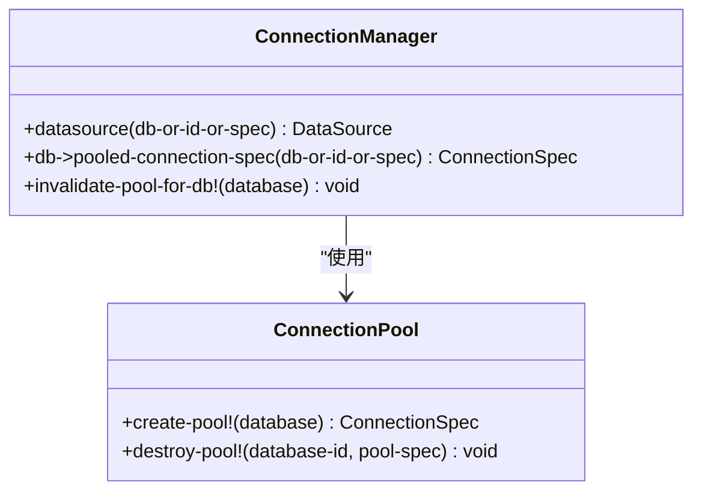
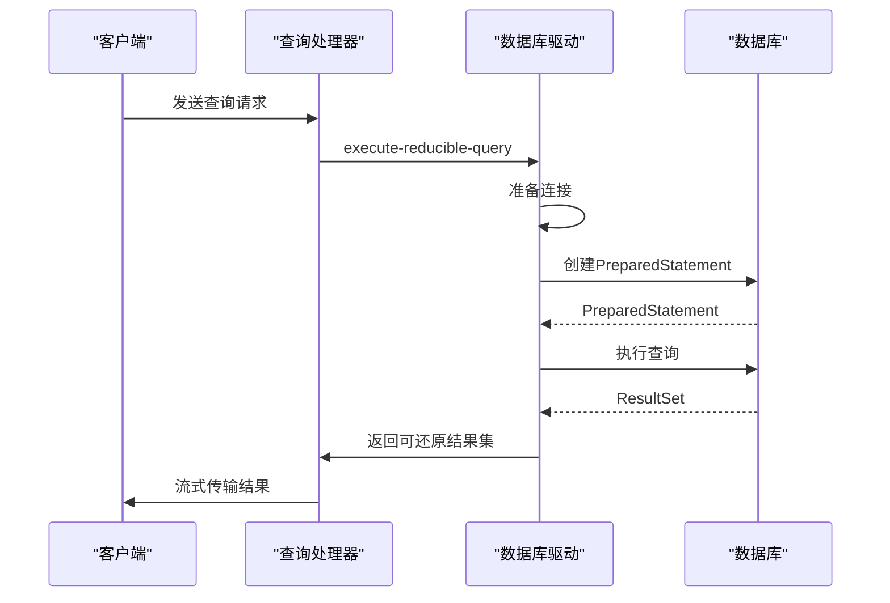
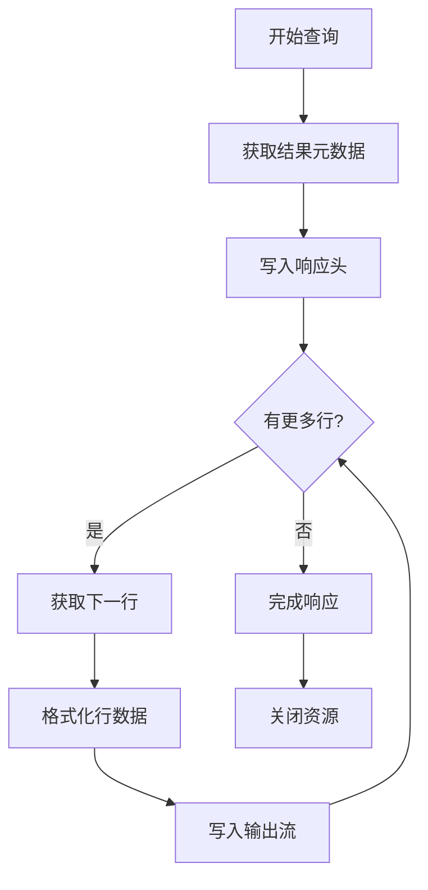
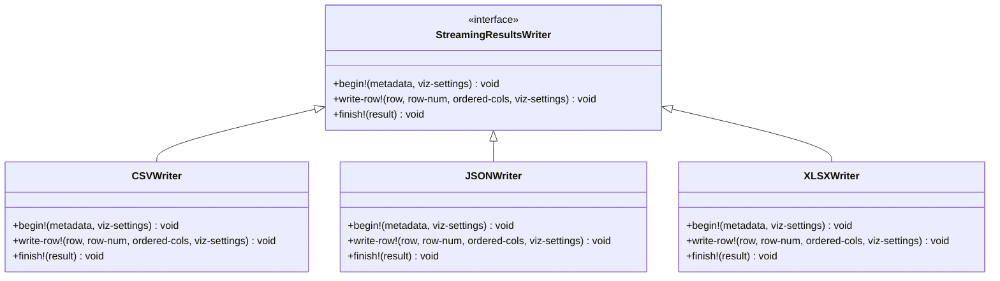
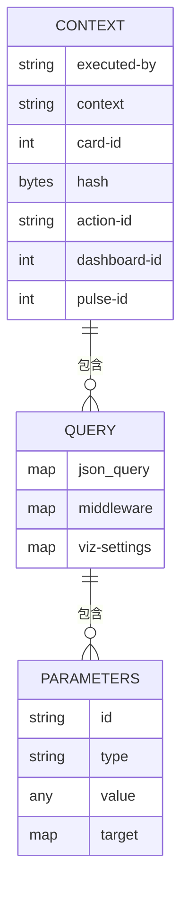
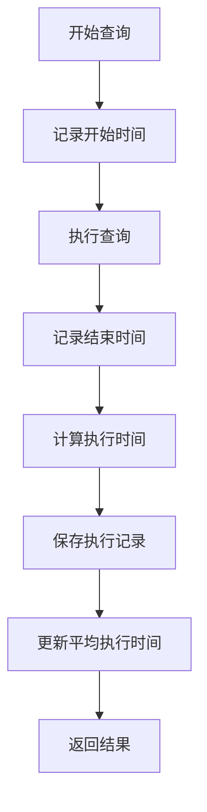
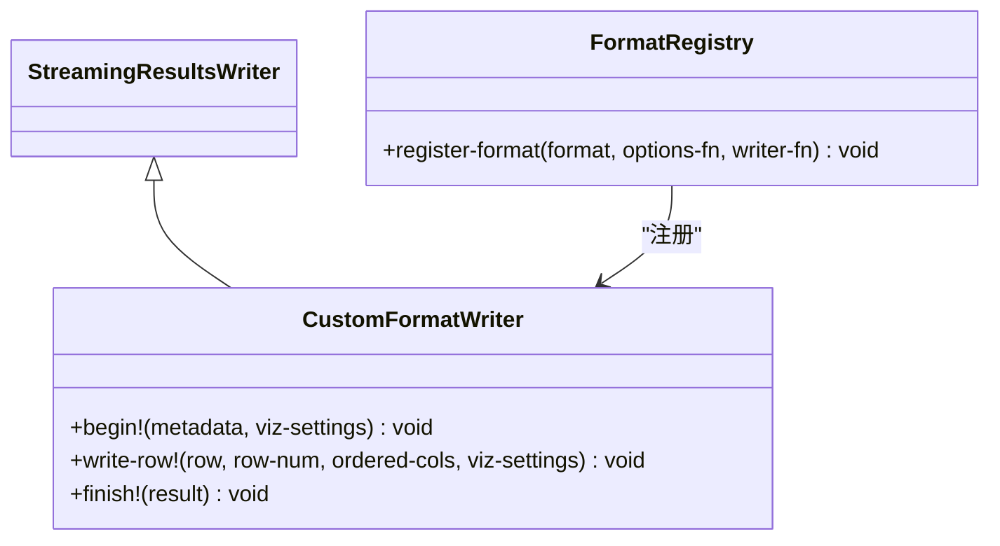

# 查询执行引擎

<cite>
**本文档引用的文件**   
- [execution.clj](file://src/metabase/actions/execution.clj)
- [execute.clj](file://src/metabase/query_processor/execute.clj)
- [streaming.clj](file://src/metabase/query_processor/streaming.clj)
- [api.clj](file://src/metabase/query_processor/api.clj)
- [connection.clj](file://src/metabase/driver/sql_jdbc/connection.clj)
- [execute.clj](file://src/metabase/driver/sql_jdbc/execute.clj)
- [csv.clj](file://src/metabase/query_processor/streaming/csv.clj)
- [json.clj](file://src/metabase/query_processor/streaming/json.clj)
- [xlsx.clj](file://src/metabase/query_processor/streaming/xlsx.clj)
</cite>

## 目录
1. [引言](#引言)
2. [执行流程架构](#执行流程架构)
3. [连接管理](#连接管理)
4. [语句执行](#语句执行)
5. [结果流式处理](#结果流式处理)
6. [输出格式支持](#输出格式支持)
7. [执行上下文管理](#执行上下文管理)
8. [性能监控](#性能监控)
9. [扩展性设计](#扩展性设计)

## 引言

Metabase查询执行引擎是系统的核心组件，负责处理所有查询请求并返回结果。该引擎采用模块化设计，通过多态分发机制与不同数据库驱动交互，支持多种输出格式的实时生成，并具备完善的超时控制和缓存策略。本文档详细解析查询执行的完整流程，包括连接管理、语句执行、结果流式处理和超时控制机制。

**Section sources**
- [execute.clj](file://src/metabase/query_processor/execute.clj#L1-L100)
- [api.clj](file://src/metabase/query_processor/api.clj#L1-L50)

## 执行流程架构

查询执行引擎采用分层架构设计，从接收到查询请求到返回结果，经历多个中间件处理阶段。核心执行流程由`query_processor.execute`命名空间中的`execute`函数驱动，该函数通过组合多个中间件函数来构建完整的执行管道。

执行流程始于`execute`函数，它首先对查询进行预处理，然后通过`qp.pipeline/*run*`动态变量调用实际的执行逻辑。执行管道包含一系列中间件，如缓存检查、权限验证、结果缓存等，这些中间件按特定顺序组合，形成一个可扩展的处理链。

**Diagram sources**
- [execute.clj](file://src/metabase/query_processor/execute.clj#L1-L100)
- [middleware/cache.clj](file://src/metabase/query_processor/middleware/cache.clj#L1-L50)

**Section sources**
- [execute.clj](file://src/metabase/query_processor/execute.clj#L1-L100)
- [pipeline.clj](file://src/metabase/query_processor/pipeline.clj#L1-L50)

## 连接管理

查询执行引擎通过`sql-jdbc`驱动的连接管理机制来处理数据库连接。连接管理的核心是`do-with-connection-with-options`多态函数，它负责获取和配置数据库连接。

连接池由`db->pooled-connection-spec`函数管理，该函数为每个数据库实例创建和维护一个连接池。连接池使用C3P0实现，具有以下关键配置：
- 最大连接数由`jdbc-data-warehouse-max-connection-pool-size`设置控制
- 空闲连接超时时间为3小时
- 连接检查时验证连接有效性
- 支持SSH隧道连接

**Diagram sources**
- [connection.clj](file://src/metabase/driver/sql_jdbc/connection.clj#L1-L50)
- [execute.clj](file://src/metabase/driver/sql_jdbc/execute.clj#L1-L50)

**Section sources**
- [connection.clj](file://src/metabase/driver/sql_jdbc/connection.clj#L1-L100)
- [execute.clj](file://src/metabase/driver/sql_jdbc/execute.clj#L1-L50)

## 语句执行

语句执行是查询执行引擎的核心功能，通过`execute-reducible-query`函数实现。该函数采用可还原（reducible）的设计模式，能够高效地处理大量数据而不会耗尽内存。

执行过程分为三个主要阶段：
1. 准备阶段：创建PreparedStatement并设置参数
2. 执行阶段：执行查询并获取ResultSet
3. 结果处理阶段：逐行处理结果集

**Diagram sources**
- [execute.clj](file://src/metabase/driver/sql_jdbc/execute.clj#L1-L50)
- [execute.clj](file://src/metabase/query_processor/execute.clj#L1-L50)

**Section sources**
- [execute.clj](file://src/metabase/driver/sql_jdbc/execute.clj#L1-L100)
- [execute.clj](file://src/metabase/query_processor/execute.clj#L1-L50)

## 结果流式处理

查询执行引擎支持结果的流式处理，通过`streaming-response`宏实现。流式处理允许在结果生成的同时将其发送给客户端，避免了将整个结果集加载到内存中。

流式处理的核心是`do-with-streaming-rff`函数，它创建一个流式响应函数（rff），该函数在接收到每一行结果时立即写入输出流。这种设计特别适合处理大型结果集，因为它不会受到内存限制的影响。

**Diagram sources**
- [streaming.clj](file://src/metabase/query_processor/streaming.clj#L1-L50)
- [api.clj](file://src/metabase/query_processor/api.clj#L1-L50)

**Section sources**
- [streaming.clj](file://src/metabase/query_processor/streaming.clj#L1-L100)
- [api.clj](file://src/metabase/query_processor/api.clj#L1-L50)

## 输出格式支持

查询执行引擎支持多种输出格式，包括CSV、JSON和XLSX。格式支持通过`StreamingResultsWriter`接口实现，每种格式都有对应的实现类。

格式选择通过`export-format`参数控制，支持以下格式：
- `:api`：标准JSON API响应
- `:json`：纯JSON数据
- `:csv`：CSV格式
- `:xlsx`：Excel格式

**Diagram sources**
- [streaming.clj](file://src/metabase/query_processor/streaming.clj#L1-L50)
- [csv.clj](file://src/metabase/query_processor/streaming/csv.clj#L1-L50)
- [json.clj](file://src/metabase/query_processor/streaming/json.clj#L1-L50)
- [xlsx.clj](file://src/metabase/query_processor/streaming/xlsx.clj#L1-L50)

**Section sources**
- [streaming.clj](file://src/metabase/query_processor/streaming.clj#L1-L100)
- [csv.clj](file://src/metabase/query_processor/streaming/csv.clj#L1-L50)
- [json.clj](file://src/metabase/query_processor/streaming/json.clj#L1-L50)
- [xlsx.clj](file://src/metabase/query_processor/streaming/xlsx.clj#L1-L50)

## 执行上下文管理

执行上下文管理负责传递用户身份、查询参数和缓存策略等信息。上下文信息通过查询的`info`字段传递，包含以下关键信息：
- `executed-by`：执行用户ID
- `context`：执行上下文（如ad-hoc、dashboard等）
- `card-id`：关联的卡片ID
- `hash`：查询哈希值

**Diagram sources**
- [api.clj](file://src/metabase/query_processor/api.clj#L1-L50)
- [execute.clj](file://src/metabase/query_processor/execute.clj#L1-L50)

**Section sources**
- [api.clj](file://src/metabase/query_processor/api.clj#L1-L100)
- [execute.clj](file://src/metabase/query_processor/execute.clj#L1-L50)

## 性能监控

查询执行引擎提供详细的性能监控指标，包括查询延迟、结果集大小统计等。这些指标通过`QueryExecution`模型记录，包含以下关键数据：
- `running_time`：查询执行时间（毫秒）
- `result_rows`：结果行数
- `error`：错误信息（如果有）
- `context`：执行上下文

监控数据可用于分析系统性能瓶颈，优化查询效率。引擎还支持通过`MB_QP_CACHE_BACKEND`环境变量配置缓存后端，以提高查询性能。

**Diagram sources**
- [middleware/process_userland_query.clj](file://src/metabase/query_processor/middleware/process_userland_query.clj#L1-L50)
- [stats.clj](file://src/metabase/analytics/stats.clj#L1-L50)

**Section sources**
- [middleware/process_userland_query.clj](file://src/metabase/query_processor/middleware/process_userland_query.clj#L1-L100)
- [stats.clj](file://src/metabase/analytics/stats.clj#L1-L50)

## 扩展性设计

查询执行引擎采用高度可扩展的设计，支持通过多态分发机制集成新的数据库驱动和输出格式。扩展新输出格式的步骤如下：

1. 实现`StreamingResultsWriter`接口
2. 注册`stream-options`多态方法
3. 注册`streaming-results-writer`多态方法

**Diagram sources**
- [streaming.clj](file://src/metabase/query_processor/streaming.clj#L1-L50)
- [interface.clj](file://src/metabase/query_processor/streaming/interface.clj#L1-L50)

**Section sources**
- [streaming.clj](file://src/metabase/query_processor/streaming.clj#L1-L100)
- [interface.clj](file://src/metabase/query_processor/streaming/interface.clj#L1-L50)