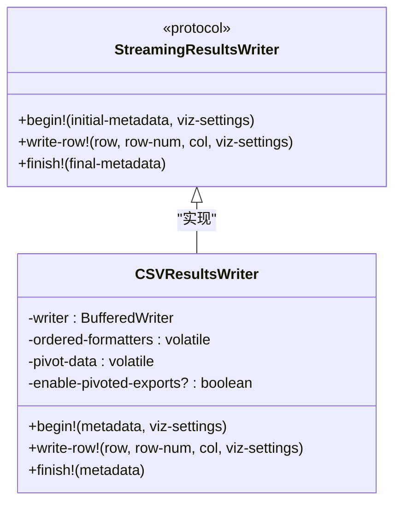
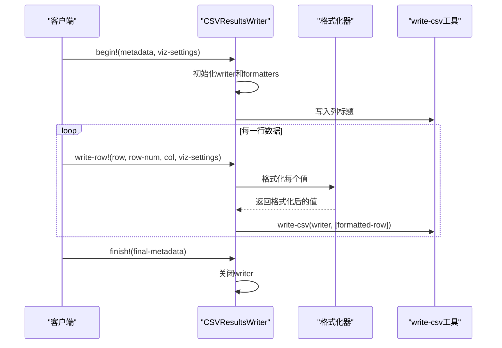
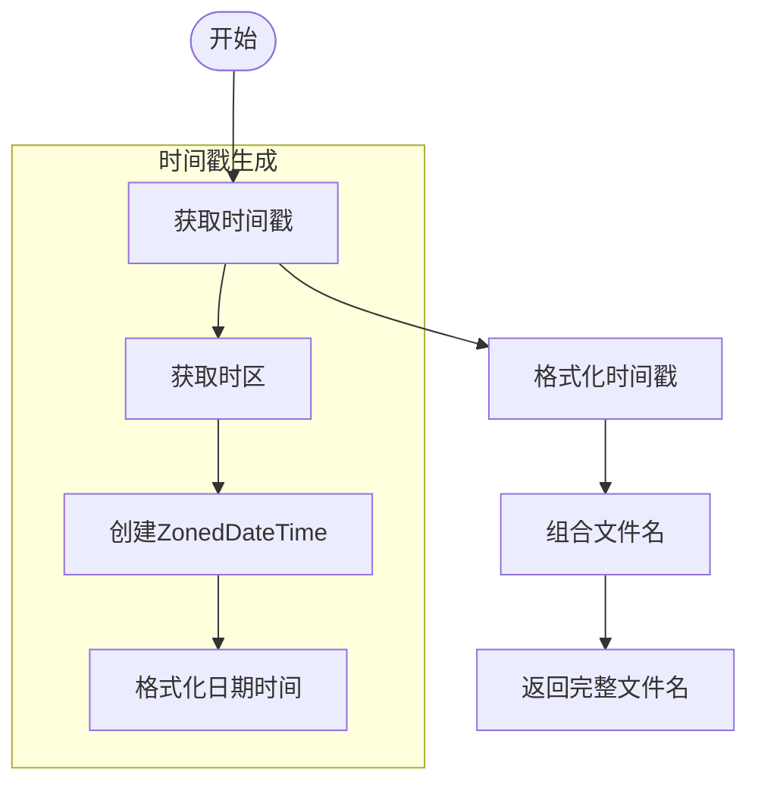
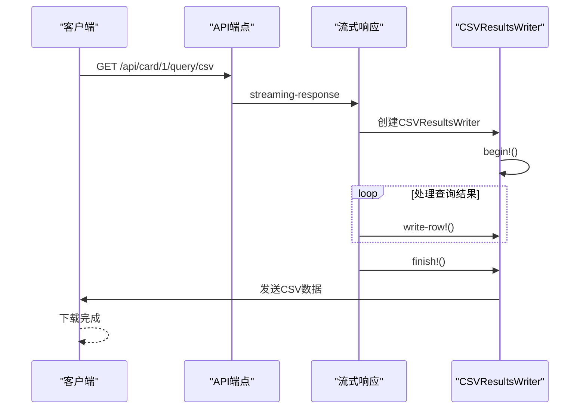
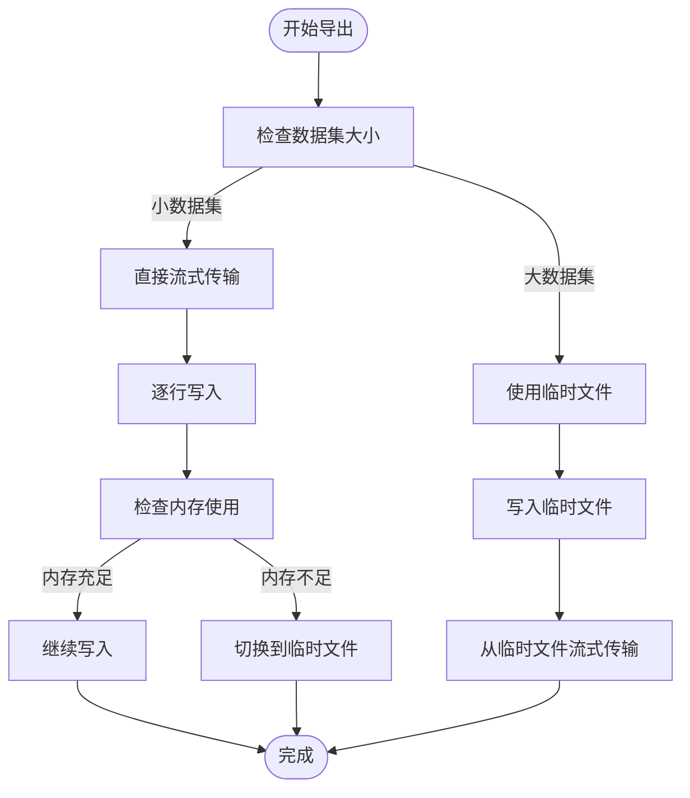

# CSV流式导出

<cite>
**本文档中引用的文件**   
- [csv.clj](file://src/metabase/query_processor/streaming/csv.clj)
- [interface.clj](file://src/metabase/query_processor/streaming/interface.clj)
- [common.clj](file://src/metabase/query_processor/streaming/common.clj)
</cite>

## 目录
1. [简介](#简介)
2. [CSVResultsWriter实现分析](#csvresultswriter实现分析)
3. [文件名生成机制](#文件名生成机制)
4. [下载请求处理流程](#下载请求处理流程)
5. [大数据集内存管理策略](#大数据集内存管理策略)
6. [自定义CSV导出格式](#自定义csv导出格式)
7. [结论](#结论)

## 简介
本文档深入分析Metabase系统中CSV流式导出功能的实现机制。重点探讨了CSVResultsWriter如何利用clojure.data.csv/write-csv进行高效流式写入，详细解释了文件名生成、下载请求处理以及大数据集导出时的内存管理策略。

## CSVResultsWriter实现分析

CSVResultsWriter是Metabase中负责CSV流式导出的核心组件，实现了StreamingResultsWriter协议。该组件通过自定义的write-csv函数对clojure.data.csv/write-csv进行了优化，提高了CSV写入效率。



**图表来源**
- [csv.clj](file://src/metabase/query_processor/streaming/csv.clj#L89-L154)

**本节来源**
- [csv.clj](file://src/metabase/query_processor/streaming/csv.clj#L89-L154)
- [interface.clj](file://src/metabase/query_processor/streaming/interface.clj#L15-L30)

### 流式写入实现

CSVResultsWriter通过以下方式实现流式写入：

1. **高效的CSV写入**: 使用自定义的write-csv函数，该函数通过更高效的quote?谓词优化了CSV写入过程
2. **内存优化**: 通过vreset!和vswap!等volatile操作实现内存的高效管理
3. **格式化处理**: 使用get-formatter函数为每列创建记忆化的格式化器



**图表来源**
- [csv.clj](file://src/metabase/query_processor/streaming/csv.clj#L89-L154)

**本节来源**
- [csv.clj](file://src/metabase/query_processor/streaming/csv.clj#L31-L62)
- [csv.clj](file://src/metabase/query_processor/streaming/csv.clj#L59-L90)

## 文件名生成机制

CSV导出文件名的生成遵循特定的规范，确保文件名的唯一性和可读性。文件名生成主要依赖于export-filename-timestamp函数。



**图表来源**
- [common.clj](file://src/metabase/query_processor/streaming/common.clj#L10-L20)

**本节来源**
- [common.clj](file://src/metabase/query_processor/streaming/common.clj#L10-L20)
- [csv.clj](file://src/metabase/query_processor/streaming/csv.clj#L15-L30)

### 文件名生成规则

文件名生成遵循以下规则：
- 基础文件名由前缀和时间戳组成
- 时间戳格式为YYYYMMDDHHmmss
- 使用UTC时区或系统时区
- 文件名包含查询结果标识

```clojure
(format "attachment; filename=\"%s_%s.csv\""
        (or filename-prefix "query_result")
        (streaming.common/export-filename-timestamp))
```

## 下载请求处理流程

CSV下载请求的处理流程涉及多个组件的协同工作，确保请求能够高效、正确地处理。



**图表来源**
- [csv.clj](file://src/metabase/query_processor/streaming/csv.clj#L15-L30)
- [streaming.clj](file://src/metabase/query_processor/streaming.clj#L251-L264)

**本节来源**
- [csv.clj](file://src/metabase/query_processor/streaming/csv.clj#L15-L30)
- [streaming.clj](file://src/metabase/query_processor/streaming.clj#L251-L264)

### 字符编码设置

CSV导出使用UTF-8字符编码，确保国际化字符的正确显示：

```clojure
(BufferedWriter. (OutputStreamWriter. os StandardCharsets/UTF_8))
```

### 流式传输优化

流式传输通过以下方式优化：
- 使用BufferedWriter提高写入效率
- 直接写入输出流，避免内存中存储完整数据集
- 及时刷新缓冲区确保数据及时传输

## 大数据集内存管理策略

针对大数据集导出，Metabase采用了多种内存管理策略来避免OutOfMemoryError。

### 内存优化技术

1. **流式处理**: 数据逐行处理，避免将整个数据集加载到内存中
2. **临时存储**: 对于超大数据集，使用临时文件存储
3. **内存监控**: 监控内存使用情况，及时调整处理策略



**图表来源**
- [csv.clj](file://src/metabase/query_processor/streaming/csv.clj#L89-L154)
- [temp_storage.clj](file://src/metabase/notification/payload/temp_storage.clj#L273-L293)

**本节来源**
- [csv.clj](file://src/metabase/query_processor/streaming/csv.clj#L89-L154)
- [temp_storage.clj](file://src/metabase/notification/payload/temp_storage.clj#L273-L293)

### 避免OutOfMemoryError的策略

1. **及时关闭资源**: 在finish!方法中确保关闭输出流
2. **使用volatile变量**: 减少内存占用
3. **分批处理**: 将大数据集分批处理
4. **及时清理**: 及时清理不再需要的数据

## 自定义CSV导出格式

Metabase提供了灵活的机制来自定义CSV导出格式，包括修改分隔符等。

### 自定义分隔符

虽然默认使用逗号作为分隔符，但可以通过修改write-csv函数来自定义分隔符：

```clojure
(let [separator \;  ; 使用分号作为分隔符
      quote \"
      quote? (fn [^String s] ...)
      newline "\n"]
  (#'clojure.data.csv/write-csv* writer data separator quote quote? newline))
```

### 格式化自定义

通过create-formatters函数可以为每列创建自定义格式化器：

```clojure
(defn- create-formatters
  [columns indexes timezone settings format-rows?]
  (let [formatter-fn (get-formatter timezone settings format-rows?)]
    (mapv (fn [idx]
            (let [column (nth columns idx)
                  formatter (formatter-fn column)]
              (fn [value]
                (formatter (streaming.common/format-value value)))))
          indexes)))
```

**本节来源**
- [csv.clj](file://src/metabase/query_processor/streaming/csv.clj#L70-L85)
- [csv.clj](file://src/metabase/query_processor/streaming/csv.clj#L31-L62)

## 结论

Metabase的CSV流式导出功能通过精心设计的架构和优化策略，实现了高效、可靠的大数据集导出。CSVResultsWriter组件通过流式处理、内存优化和高效的CSV写入算法，确保了即使在处理大规模数据集时也能保持良好的性能。文件名生成机制遵循规范，下载请求处理流程清晰，内存管理策略有效避免了OutOfMemoryError。此外，系统还提供了灵活的自定义选项，满足不同用户的导出需求。