# Metabase JSON流式导出技术文档

<cite>
**本文档中引用的文件**
- [json.clj](file://src/metabase/query_processor/streaming/json.clj)
- [streaming_response.clj](file://src/metabase/server/streaming_response.clj)
- [json.clj](file://src/metabase/server/middleware/json.clj)
- [common.clj](file://src/metabase/query_processor/streaming/common.clj)
- [interface.clj](file://src/metabase/query_processor/streaming/interface.clj)
- [streaming.clj](file://src/metabase/query_processor/streaming.clj)
- [json.clj](file://src/metabase/util/json.clj)
</cite>

## 目录
1. [简介](#简介)
2. [项目架构概览](#项目架构概览)
3. [核心组件分析](#核心组件分析)
4. [JSONResultsWriter实现机制](#jsonresultswriter实现机制)
5. [流式JSON生成优化](#流式json生成优化)
6. [下载处理机制](#下载处理机制)
7. [性能优化策略](#性能优化策略)
8. [扩展性设计](#扩展性设计)
9. [故障排除指南](#故障排除指南)
10. [总结](#总结)

## 简介

Metabase的JSON流式导出系统是一个高度优化的数据导出解决方案，专门设计用于处理大规模查询结果的高效传输。该系统通过流式JSON生成、智能缓冲策略和多格式支持，为用户提供了快速、可靠的数据导出体验。

本文档深入分析了JSON流式导出的核心实现机制，包括JSONResultsWriter的工作原理、generate-json-filename的命名逻辑、handle-json-download的差异化处理，以及各种性能优化技巧。

## 项目架构概览

Metabase JSON流式导出系统采用分层架构设计，主要包含以下核心层次：

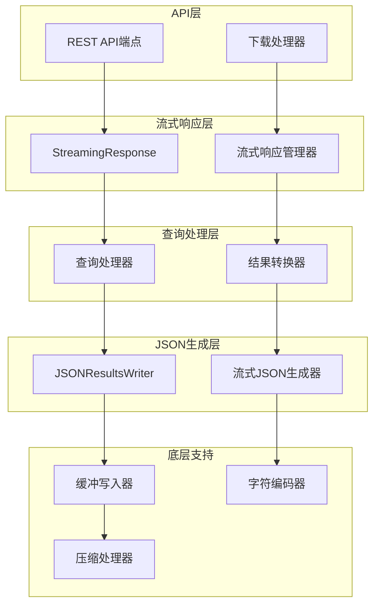

**图表来源**
- [streaming_response.clj](file://src/metabase/server/streaming_response.clj#L274-L306)
- [json.clj](file://src/metabase/query_processor/streaming/json.clj#L28-L52)

**章节来源**
- [streaming.clj](file://src/metabase/query_processor/streaming.clj#L0-L32)
- [interface.clj](file://src/metabase/query_processor/streaming/interface.clj#L0-L30)

## 核心组件分析

### StreamingResultsWriter协议

StreamingResultsWriter是整个流式导出系统的核心协议，定义了统一的结果写入接口：

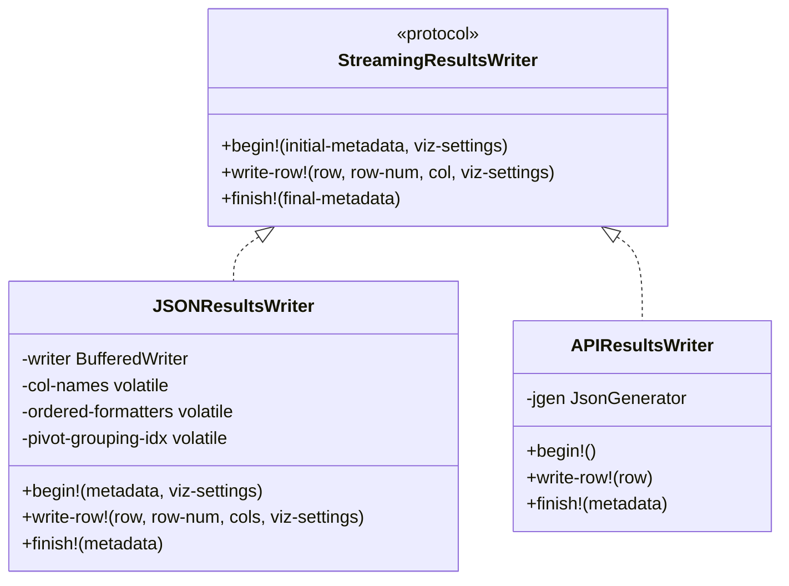

**图表来源**
- [interface.clj](file://src/metabase/query_processor/streaming/interface.clj#L10-L30)
- [json.clj](file://src/metabase/query_processor/streaming/json.clj#L28-L52)

### 流式响应系统

流式响应系统负责管理HTTP连接和异步处理：

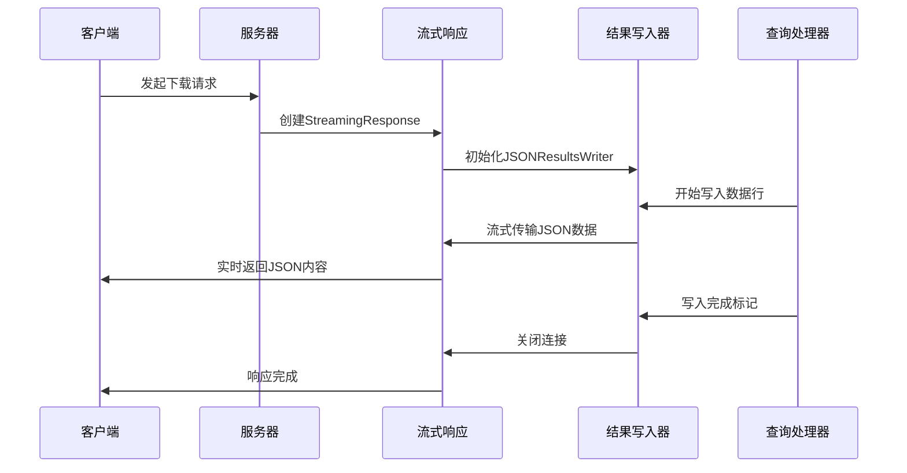

**图表来源**
- [streaming_response.clj](file://src/metabase/server/streaming_response.clj#L100-L137)
- [json.clj](file://src/metabase/query_processor/streaming/json.clj#L73-L101)

**章节来源**
- [interface.clj](file://src/metabase/query_processor/streaming/interface.clj#L10-L30)
- [streaming_response.clj](file://src/metabase/server/streaming_response.clj#L274-L306)

## JSONResultsWriter实现机制

### 核心工作流程

JSONResultsWriter采用三阶段工作流程：初始化、数据写入和清理阶段。

#### 初始化阶段（begin!）

初始化阶段负责设置列名映射和格式化器：

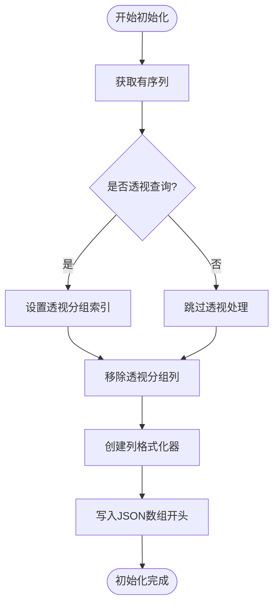

**图表来源**
- [json.clj](file://src/metabase/query_processor/streaming/json.clj#L35-L52)

#### 数据写入阶段（write-row!）

数据写入阶段实现了高效的行级处理和格式化：

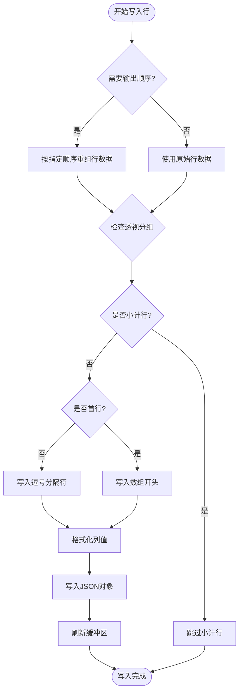

**图表来源**
- [json.clj](file://src/metabase/query_processor/streaming/json.clj#L54-L89)

#### 清理阶段（finish!）

清理阶段确保资源正确释放和最终标记写入：

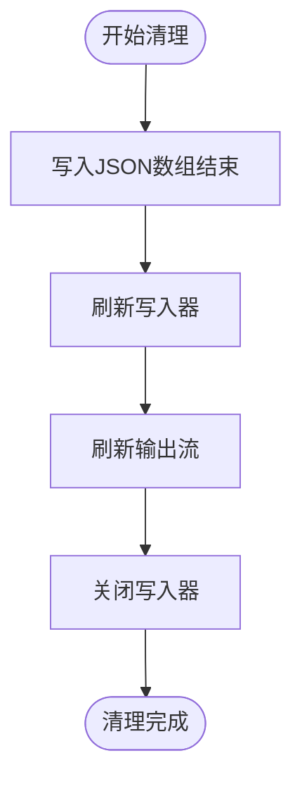

**图表来源**
- [json.clj](file://src/metabase/query_processor/streaming/json.clj#L91-L97)

**章节来源**
- [json.clj](file://src/metabase/query_processor/streaming/json.clj#L28-L97)

## 流式JSON生成优化

### 缓冲策略

系统采用多层次缓冲策略来优化性能：

#### 字节级缓冲

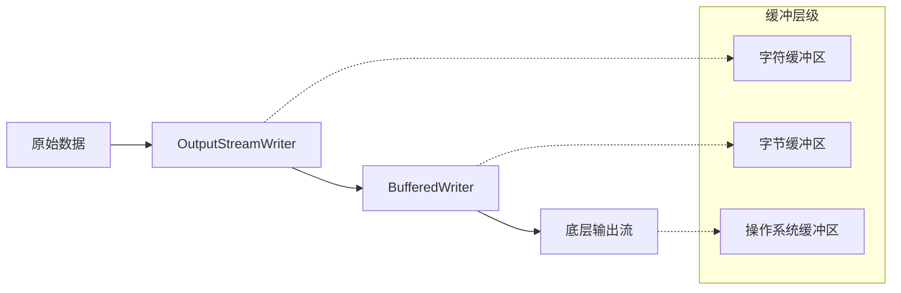

**图表来源**
- [json.clj](file://src/metabase/query_processor/streaming/json.clj#L32-L34)

#### 对象序列化优化

系统针对不同数据类型采用专门的序列化策略：

| 数据类型 | 序列化策略 | 性能特点 |
|---------|-----------|----------|
| 数字类型 | 直接数值输出 | 避免字符串转换开销 |
| 日期时间 | 格式化字符串 | 支持时区转换 |
| 文本内容 | 转义处理 | 确保JSON语法正确 |
| 特殊对象 | 自定义编码器 | 处理数据库特定类型 |

**章节来源**
- [json.clj](file://src/metabase/query_processor/streaming/json.clj#L73-L89)
- [common.clj](file://src/metabase/query_processor/streaming/common.clj#L40-L80)

### 格式化器系统

格式化器系统提供了灵活的数据格式化能力：

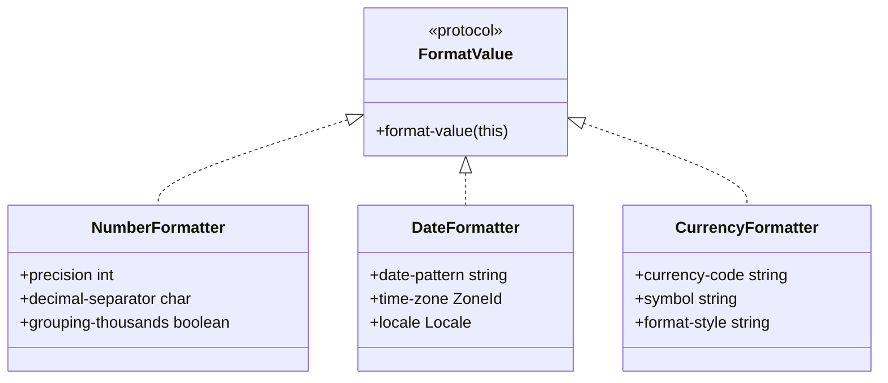

**图表来源**
- [common.clj](file://src/metabase/query_processor/streaming/common.clj#L40-L80)

**章节来源**
- [common.clj](file://src/metabase/query_processor/streaming/common.clj#L40-L120)

## 下载处理机制

### 文件名生成逻辑

generate-json-filename函数实现了智能的文件名生成策略：

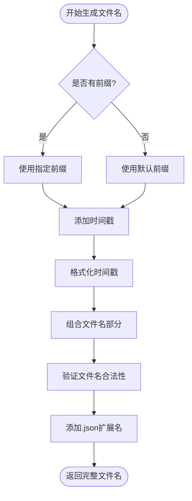

**图表来源**
- [json.clj](file://src/metabase/query_processor/streaming/json.clj#L20-L27)

### Content-Disposition头处理

系统根据不同的下载场景生成相应的Content-Disposition头：

| 场景 | Content-Disposition格式 | 用途 |
|------|------------------------|------|
| 直接下载 | `attachment; filename="query_result_20241201.json"` | 标准文件下载 |
| 公共分享 | `inline; filename="shared_query_20241201.json"` | 在线查看 |
| 嵌入内容 | `inline; filename="embedded_data_20241201.json"` | 嵌入页面显示 |

**章节来源**
- [json.clj](file://src/metabase/query_processor/streaming/json.clj#L20-L27)
- [common.clj](file://src/metabase/query_processor/streaming/common.clj#L15-L25)

### JSONP支持

虽然当前实现主要关注标准JSON格式，但系统架构支持JSONP扩展：

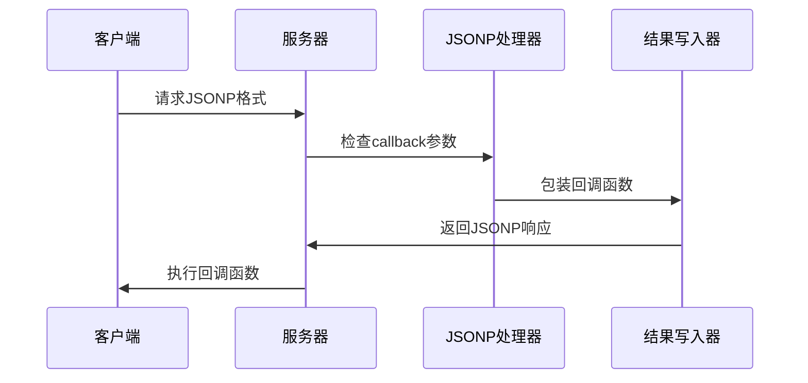

**图表来源**
- [json.clj](file://src/metabase/server/middleware/json.clj#L77-L110)

**章节来源**
- [json.clj](file://src/metabase/server/middleware/json.clj#L50-L80)

## 性能优化策略

### 异步处理机制

系统采用异步处理来避免阻塞主线程：

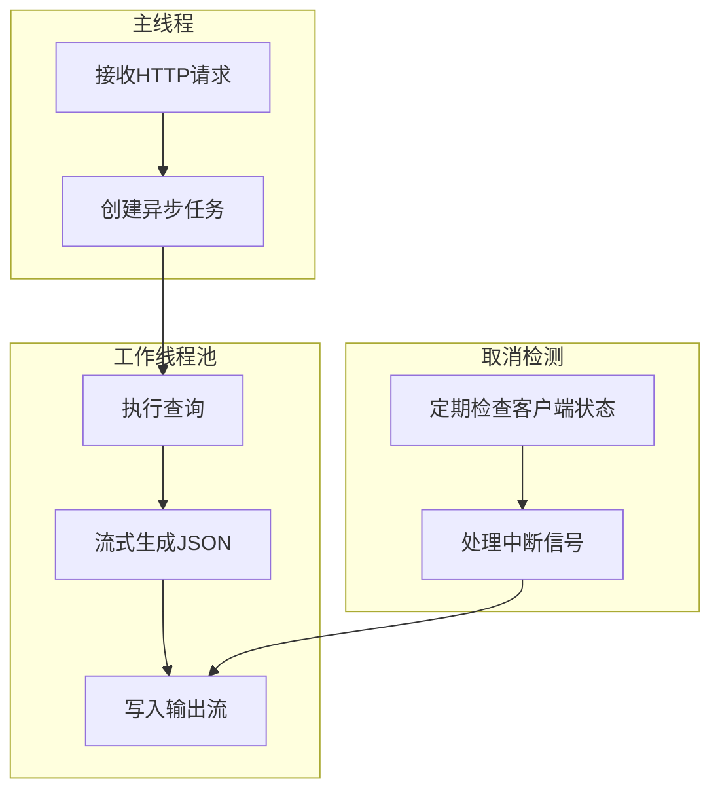

**图表来源**
- [streaming_response.clj](file://src/metabase/server/streaming_response.clj#L100-L137)

### 内存管理优化

系统实现了精细的内存管理策略：

#### 流式处理vs批量处理

| 处理方式 | 内存使用 | 吞吐量 | 适用场景 |
|---------|----------|--------|----------|
| 流式处理 | 低固定内存 | 中等 | 大数据集导出 |
| 批量处理 | 高内存峰值 | 高 | 小数据集处理 |
| 分页处理 | 中等内存 | 可调 | 中等数据集 |

#### 缓冲区大小调优

系统根据数据特征动态调整缓冲策略：

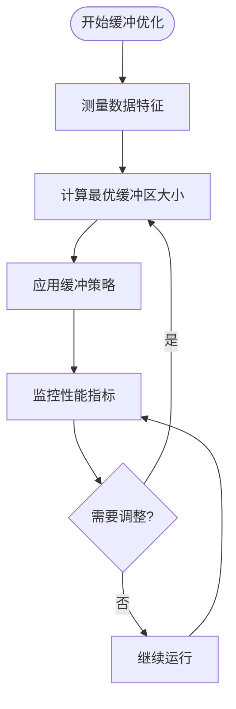

**图表来源**
- [streaming_response.clj](file://src/metabase/server/streaming_response.clj#L100-L137)

**章节来源**
- [streaming_response.clj](file://src/metabase/server/streaming_response.clj#L69-L101)
- [json.clj](file://src/metabase/query_processor/streaming/json.clj#L100-L123)

### 网络传输优化

#### GZIP压缩支持

系统提供透明的GZIP压缩功能：

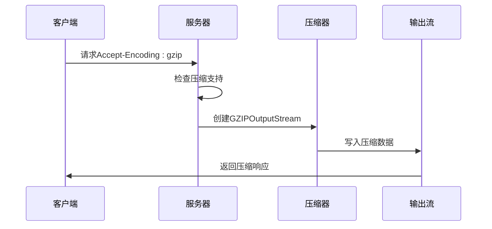

**图表来源**
- [streaming_response.clj](file://src/metabase/server/streaming_response.clj#L115-L137)

#### 连接管理

系统实现了智能的连接管理策略：

| 连接状态 | 处理策略 | 原因 |
|---------|----------|------|
| 正常连接 | 继续传输 | 用户仍在等待 |
| 连接中断 | 立即停止 | 避免浪费资源 |
| 超时检测 | 记录日志 | 提供调试信息 |
| 取消请求 | 清理资源 | 防止内存泄漏 |

**章节来源**
- [streaming_response.clj](file://src/metabase/server/streaming_response.clj#L115-L137)
- [streaming_response.clj](file://src/metabase/server/streaming_response.clj#L150-L200)

## 扩展性设计

### 多格式支持架构

系统设计支持多种导出格式的扩展：

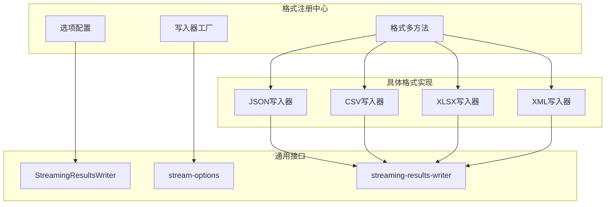

**图表来源**
- [interface.clj](file://src/metabase/query_processor/streaming/interface.clj#L20-L30)

### 插件化扩展点

系统提供了多个扩展点供第三方开发：

#### 自定义编码器

```clojure
;; 注册自定义类型编码器
(json/add-encoder CustomType
  (fn [obj json-generator]
    (json/write-string json-generator (custom-format obj))))
```

#### 格式化器扩展

```clojure
;; 扩展FormatValue协议
(extend-protocol FormatValue
  CustomType
  (format-value [this]
    (custom-format this)))
```

#### 写入器定制

```clojure
;; 定制特定格式的写入器
(defmethod qp.si/streaming-results-writer :custom-format
  [_ ^OutputStream os]
  (reify qp.si/StreamingResultsWriter
    (begin! [_ metadata viz-settings]
      ;; 自定义初始化逻辑
      )
    (write-row! [_ row row-num cols viz-settings]
      ;; 自定义行写入逻辑
      )
    (finish! [_ metadata]
      ;; 自定义清理逻辑
      )))
```

**章节来源**
- [json.clj](file://src/metabase/util/json.clj#L15-L30)
- [common.clj](file://src/metabase/query_processor/streaming/common.clj#L40-L80)

### 元数据扩展机制

系统支持向JSON输出添加自定义元数据：

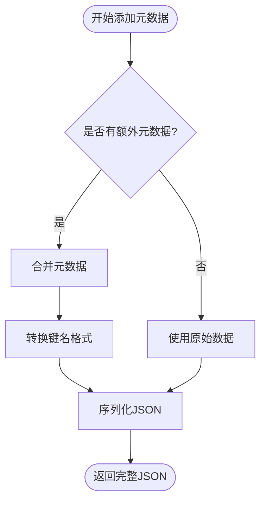

**图表来源**
- [json.clj](file://src/metabase/query_processor/streaming/json.clj#L122-L153)

**章节来源**
- [json.clj](file://src/metabase/query_processor/streaming/json.clj#L122-L153)

## 故障排除指南

### 常见问题诊断

#### 内存溢出问题

**症状**: 导出大文件时出现OutOfMemoryError

**原因分析**:
- 缓冲区设置过小
- 数据量超过可用内存
- 对象缓存未及时清理

**解决方案**:
1. 调整JVM堆内存设置
2. 优化缓冲区大小配置
3. 启用流式处理模式
4. 实现分块处理机制

#### 性能下降问题

**症状**: 导出速度明显变慢

**诊断步骤**:
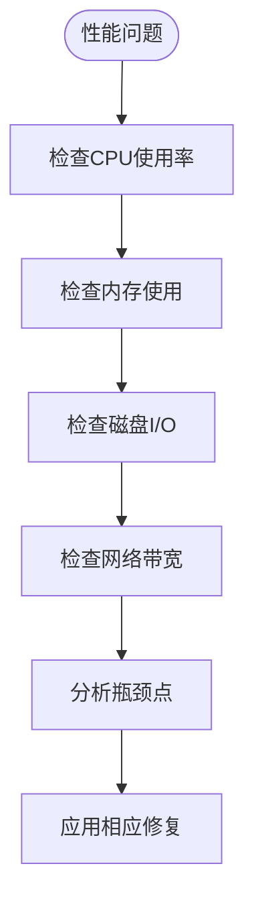

**图表来源**
- [streaming_response.clj](file://src/metabase/server/streaming_response.clj#L150-L200)

#### 连接中断问题

**症状**: 导出过程中连接意外断开

**处理机制**:
系统实现了多层次的连接监控：

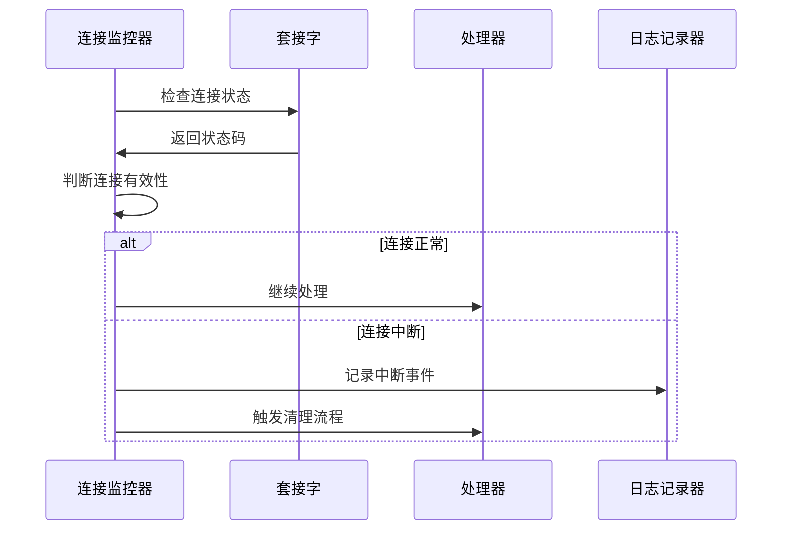

**图表来源**
- [streaming_response.clj](file://src/metabase/server/streaming_response.clj#L150-L200)

### 调试工具和技巧

#### 性能监控

系统提供了详细的性能监控指标：

| 指标类别 | 监控项目 | 正常范围 | 异常阈值 |
|---------|----------|----------|----------|
| 内存使用 | 堆内存占用率 | < 80% | > 90% |
| CPU使用 | 处理器占用率 | < 70% | > 90% |
| 网络吞吐 | 数据传输速率 | > 1MB/s | < 100KB/s |
| 延迟指标 | 响应时间 | < 5秒 | > 30秒 |

#### 日志分析

系统提供了丰富的日志信息用于问题诊断：

```clojure
;; 关键日志点示例
(log/debugf "Writing initial metadata to results writer.")
(log/trace "Writing one row to results writer.")
(log/warn "Client closed connection prematurely")
(log/error e "Error writing error to output stream")
```

**章节来源**
- [streaming_response.clj](file://src/metabase/server/streaming_response.clj#L69-L101)
- [streaming_response.clj](file://src/metabase/server/streaming_response.clj#L150-L200)

## 总结

Metabase的JSON流式导出系统是一个精心设计的高性能数据导出解决方案。通过采用流式处理、多层缓冲、异步处理和智能优化策略，系统能够在处理大规模数据时保持优异的性能表现。

### 核心优势

1. **高性能**: 流式处理避免了内存峰值，支持大数据集导出
2. **可扩展**: 模块化设计支持多种格式和自定义扩展
3. **可靠性**: 完善的错误处理和资源管理机制
4. **灵活性**: 支持多种下载场景和格式需求

### 技术创新

- **混合JSON生成**: 结合Jackson和Cheshire的优势，实现最佳性能
- **智能缓冲策略**: 动态调整缓冲区大小以优化吞吐量
- **异步取消机制**: 实时检测客户端取消并清理资源
- **多格式支持**: 统一的接口支持多种导出格式

### 最佳实践建议

1. **合理配置缓冲区大小**，根据数据特征选择最优设置
2. **启用GZIP压缩**，在带宽受限环境中显著提升效率
3. **监控关键性能指标**，及时发现和解决性能瓶颈
4. **实施适当的错误处理**，确保系统的稳定性和可靠性

通过深入理解这些设计原理和实现细节，开发者可以更好地利用和扩展Metabase的JSON流式导出功能，为用户提供更加优秀的数据导出体验。