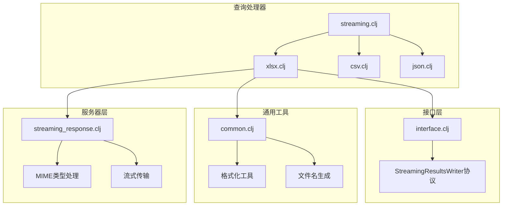
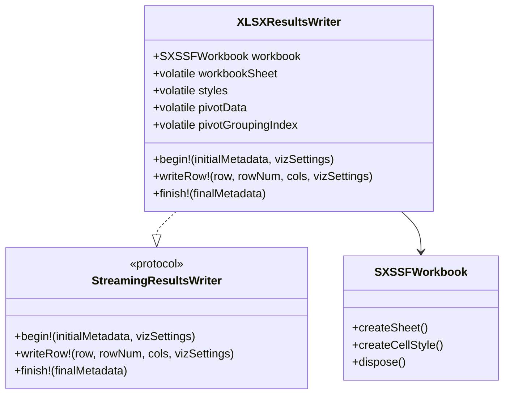
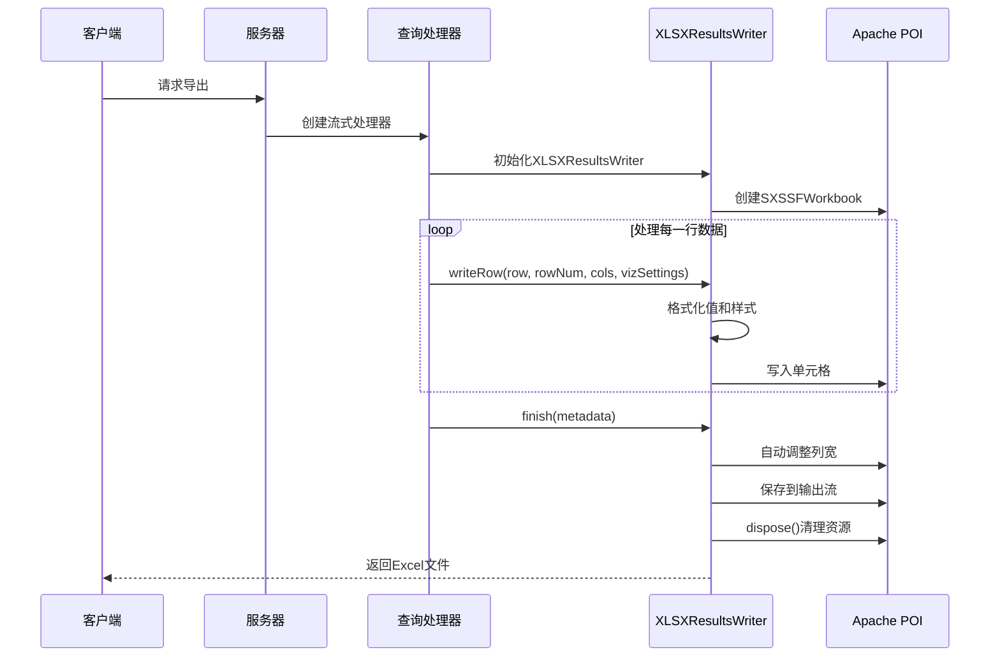
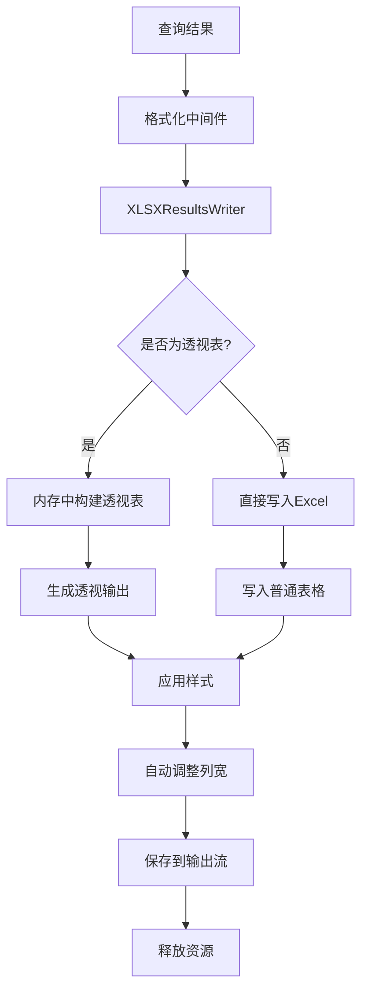
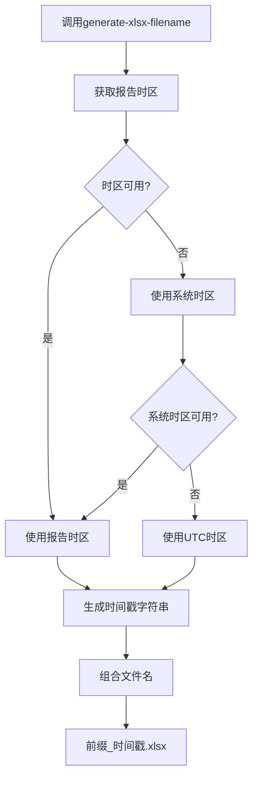
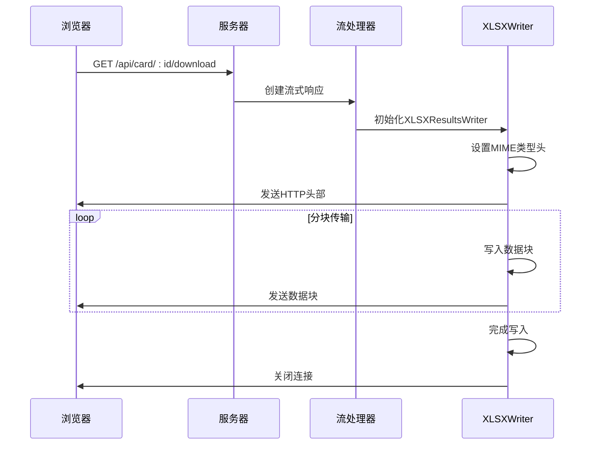
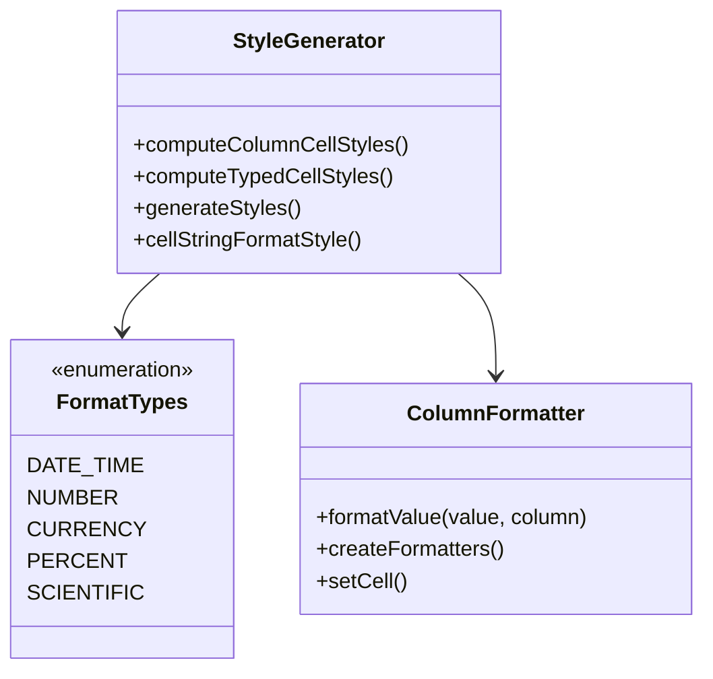
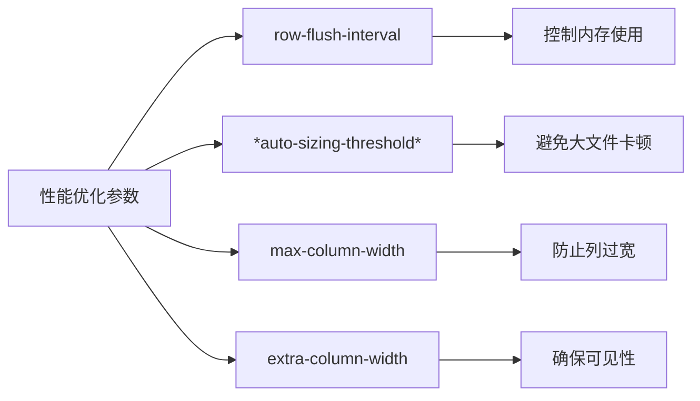
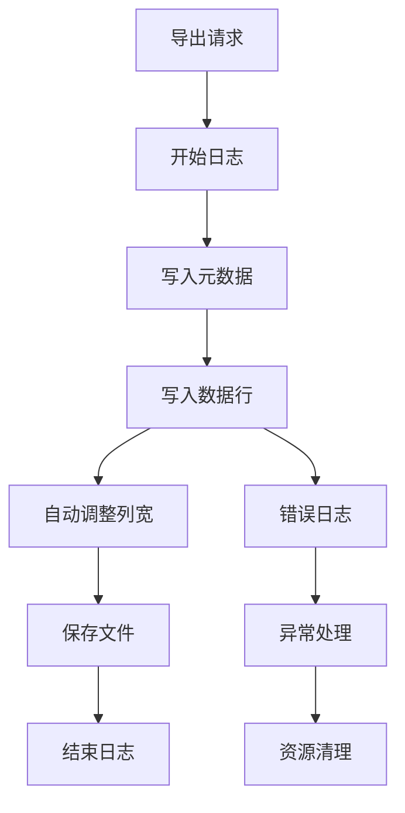

# Metabase XLSX流式导出功能深度技术文档

<cite>
**本文档中引用的文件**
- [xlsx.clj](file://src/metabase/query_processor/streaming/xlsx.clj)
- [interface.clj](file://src/metabase/query_processor/streaming/interface.clj)
- [common.clj](file://src/metabase/query_processor/streaming/common.clj)
- [streaming.clj](file://src/metabase/query_processor/streaming.clj)
- [streaming_response.clj](file://src/metabase/server/streaming_response.clj)
- [settings.clj](file://src/metabase/query_processor/settings.clj)
- [json.clj](file://src/metabase/query_processor/streaming/json.clj)
</cite>

## 目录
1. [简介](#简介)
2. [项目结构概览](#项目结构概览)
3. [核心组件分析](#核心组件分析)
4. [架构设计](#架构设计)
5. [详细组件分析](#详细组件分析)
6. [性能优化策略](#性能优化策略)
7. [故障排除指南](#故障排除指南)
8. [结论](#结论)

## 简介

Metabase的XLSX流式导出功能是一个高度优化的数据导出系统，专门设计用于处理大规模数据集的Excel文件生成。该功能基于Apache POI的SXSSFWorkbook实现，提供了内存高效的流式处理能力，能够处理包含数百万行数据的导出任务。

本文档深入解析了XLSXResultsWriter的实现原理，包括如何利用Apache POI的SXSSFWorkbook进行内存高效的大文件生成、generate-xlsx-filename函数的命名规则和国际化支持、handle-xlsx-download如何处理Excel文件的MIME类型和流式传输，以及大数据集导出时的性能瓶颈及解决方案。

## 项目结构概览

Metabase的流式导出功能采用模块化架构，主要组件分布在以下目录结构中：

**图表来源**
- [xlsx.clj](file://src/metabase/query_processor/streaming/xlsx.clj#L1-L40)
- [interface.clj](file://src/metabase/query_processor/streaming/interface.clj#L1-L30)

**章节来源**
- [xlsx.clj](file://src/metabase/query_processor/streaming/xlsx.clj#L1-L757)
- [streaming.clj](file://src/metabase/query_processor/streaming.clj#L1-L264)

## 核心组件分析

### XLSXResultsWriter实现

XLSXResultsWriter是整个流式导出系统的核心组件，它实现了StreamingResultsWriter协议，负责将查询结果以流式方式写入Excel文件。

#### 主要特性

1. **内存高效处理**：使用SXSSFWorkbook而非XSSFWorkbook，避免内存溢出
2. **动态样式生成**：根据列类型和用户设置动态生成单元格样式
3. **格式化支持**：支持日期、数字、货币等多种格式的自动格式化
4. **国际化支持**：完整的多语言文件名生成机制

#### 关键数据结构

**图表来源**
- [xlsx.clj](file://src/metabase/query_processor/streaming/xlsx.clj#L650-L668)
- [interface.clj](file://src/metabase/query_processor/streaming/interface.clj#L15-L30)

**章节来源**
- [xlsx.clj](file://src/metabase/query_processor/streaming/xlsx.clj#L650-L757)

## 架构设计

### 流式导出架构

**图表来源**
- [xlsx.clj](file://src/metabase/query_processor/streaming/xlsx.clj#L650-L757)
- [streaming_response.clj](file://src/metabase/server/streaming_response.clj#L218-L240)

### 数据流处理管道

**图表来源**
- [xlsx.clj](file://src/metabase/query_processor/streaming/xlsx.clj#L650-L757)

## 详细组件分析

### generate-xlsx-filename函数

generate-xlsx-filename函数负责生成符合规范的Excel文件名，支持国际化和时间戳嵌入。

#### 实现特点

1. **时间戳生成**：使用export-filename-timestamp函数生成当前时间戳
2. **国际化支持**：基于用户所在时区生成文件名
3. **命名规范**：遵循"前缀_时间戳.xlsx"的命名模式

#### 文件名生成流程

**图表来源**
- [common.clj](file://src/metabase/query_processor/streaming/common.clj#L18-L28)

**章节来源**
- [common.clj](file://src/metabase/query_processor/streaming/common.clj#L18-L28)

### handle-xlsx-download处理机制

handle-xlsx-download负责处理Excel文件的MIME类型设置和流式传输。

#### MIME类型处理

| 属性 | 值 | 说明 |
|------|-----|------|
| Content-Type | application/vnd.openxmlformats-officedocument.spreadsheetml.sheet | 标准Excel文件MIME类型 |
| Content-Disposition | attachment; filename="query_result_20241201.xlsx" | 指示浏览器下载文件 |
| Connection | close | 防止连接复用导致的问题 |

#### 流式传输优化

**图表来源**
- [xlsx.clj](file://src/metabase/query_processor/streaming/xlsx.clj#L259-L285)
- [streaming_response.clj](file://src/metabase/server/streaming_response.clj#L218-L240)

**章节来源**
- [xlsx.clj](file://src/metabase/query_processor/streaming/xlsx.clj#L259-L285)

### 样式和格式化系统

#### 动态样式生成

XLSXResultsWriter实现了复杂的样式生成系统，支持多种数据类型的自动格式化：

**图表来源**
- [xlsx.clj](file://src/metabase/query_processor/streaming/xlsx.clj#L285-L320)

#### 格式化规则

| 数据类型 | 默认格式 | 支持的格式选项 |
|----------|----------|----------------|
| 日期时间 | "yyyy-mm-dd hh:mm:ss" | 自定义日期格式、时间格式 |
| 数字 | "#,##0.00" | 千分位分隔符、小数位数 |
| 货币 | "$#,##0.00" | 货币符号、位置、精度 |
| 百分比 | "0.00%" | 小数位数、千分位 |
| 科学计数法 | "0.00E+00" | 小数位数 |

**章节来源**
- [xlsx.clj](file://src/metabase/query_processor/streaming/xlsx.clj#L32-L258)

## 性能优化策略

### SXSSFWorkbook内存管理

#### 内存效率优化

1. **行刷新机制**：通过row-flush-interval控制行刷新频率
2. **列自动调整阈值**：*auto-sizing-threshold*限制自动调整列宽的行数
3. **资源及时释放**：finish!方法确保资源正确释放

#### 性能参数配置

**图表来源**
- [xlsx.clj](file://src/metabase/query_processor/streaming/xlsx.clj#L558-L587)

#### 行刷新间隔优化

**图表来源**
- [xlsx.clj](file://src/metabase/query_processor/streaming/xlsx.clj#L680-L720)

### 大数据集处理策略

#### 内存使用优化

1. **流式处理**：避免将所有数据加载到内存
2. **延迟计算**：仅在需要时生成样式和格式
3. **资源池化**：重用样式对象减少GC压力

#### 性能监控指标

| 指标 | 目标值 | 监控方法 |
|------|--------|----------|
| 内存使用量 | < 2GB | JVM堆内存监控 |
| 导出时间 | < 30秒/百万行 | 响应时间监控 |
| CPU使用率 | < 80% | 系统资源监控 |
| 网络带宽 | > 10MB/s | 网络流量监控 |

**章节来源**
- [xlsx.clj](file://src/metabase/query_processor/streaming/xlsx.clj#L558-L587)

## 故障排除指南

### 常见问题及解决方案

#### 内存溢出问题

**症状**：导出大文件时出现OutOfMemoryError
**原因**：默认的SXSSFWorkbook配置不适合超大数据集
**解决方案**：
1. 调整row-flush-interval参数
2. 启用分批处理机制
3. 增加JVM堆内存限制

#### 文件损坏问题

**症状**：生成的Excel文件无法打开或显示错误
**原因**：流式写入过程中发生异常中断
**解决方案**：
1. 确保finish!方法被正确调用
2. 添加异常处理和资源清理逻辑
3. 验证输出流的完整性

#### 性能问题

**症状**：导出速度过慢或响应超时
**原因**：自动列宽调整或复杂样式计算
**解决方案**：
1. 调整*auto-sizing-threshold*阈值
2. 简化样式配置
3. 启用异步处理

### 调试和监控

#### 日志记录

**图表来源**
- [xlsx.clj](file://src/metabase/query_processor/streaming/xlsx.clj#L746-L757)

**章节来源**
- [xlsx.clj](file://src/metabase/query_processor/streaming/xlsx.clj#L746-L757)

## 结论

Metabase的XLSX流式导出功能是一个精心设计的高性能数据导出系统，通过以下关键技术实现了对大规模数据集的有效处理：

1. **内存高效设计**：基于Apache POI的SXSSFWorkbook实现，避免内存溢出
2. **智能格式化**：支持多种数据类型的自动格式化和样式生成
3. **国际化支持**：完整的多语言文件名生成和时间戳处理
4. **性能优化**：通过阈值控制和资源管理确保系统稳定性
5. **可扩展架构**：模块化设计便于功能扩展和维护

该系统不仅满足了企业级应用对大数据导出的需求，还为其他类似场景提供了优秀的参考实现。通过合理的配置和优化，可以处理包含数百万行数据的导出任务，同时保持良好的系统性能和用户体验。