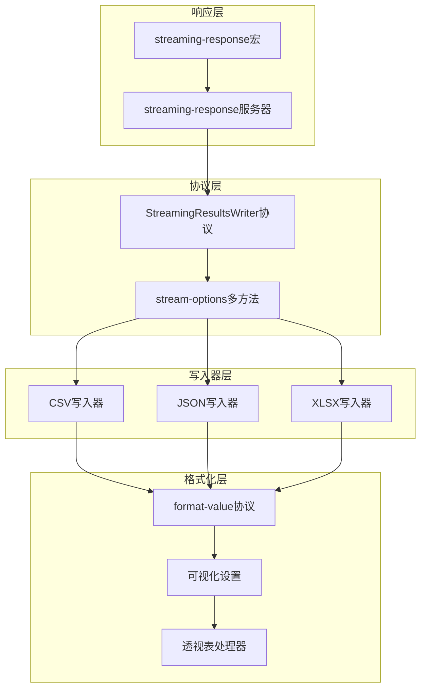
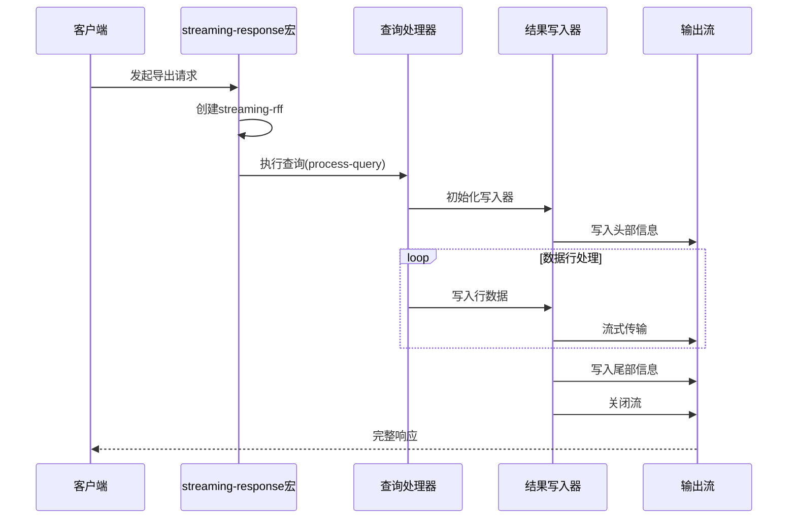
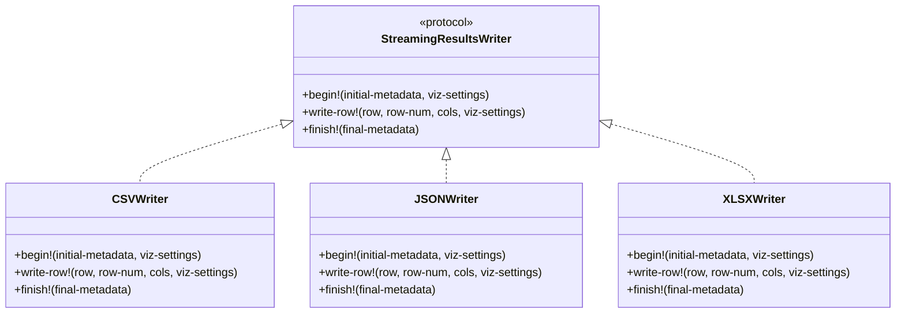
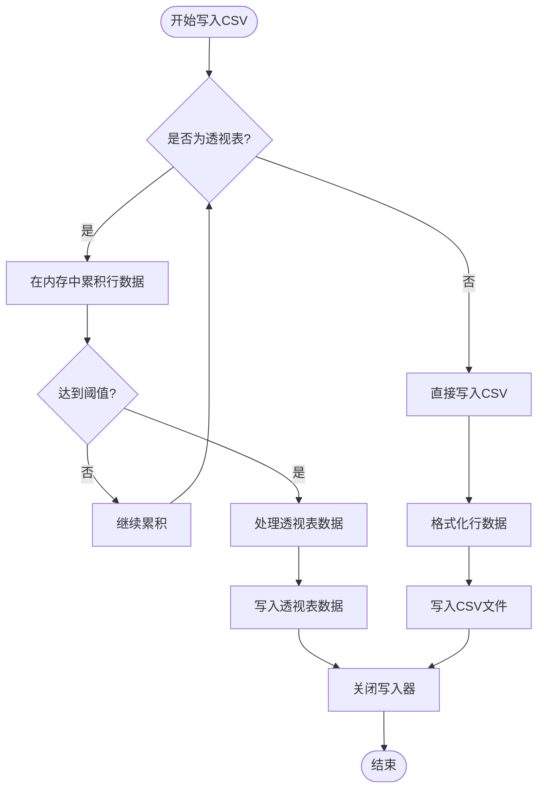
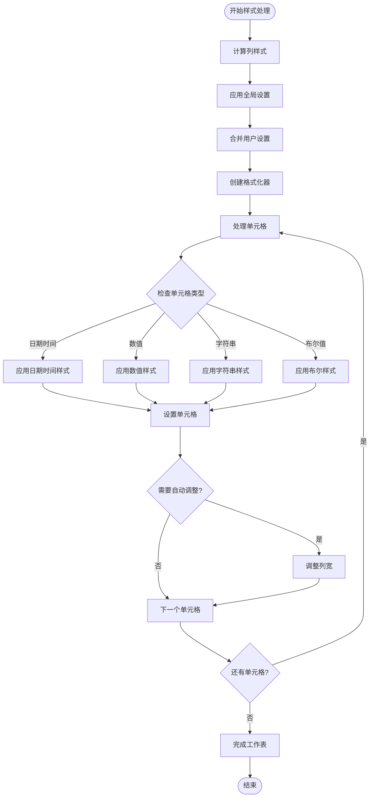
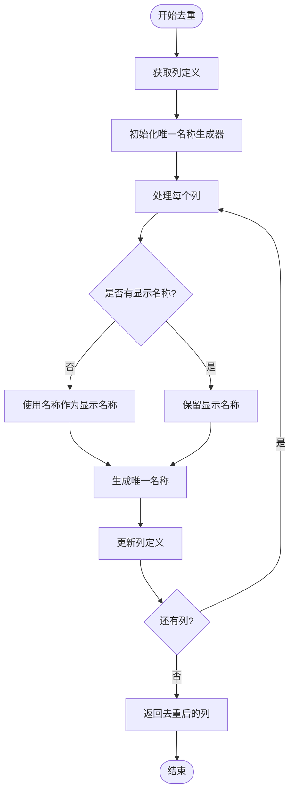
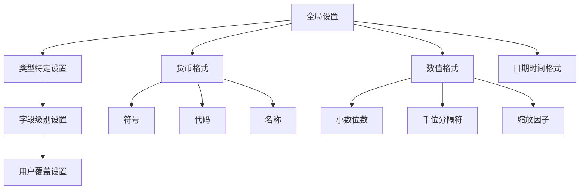
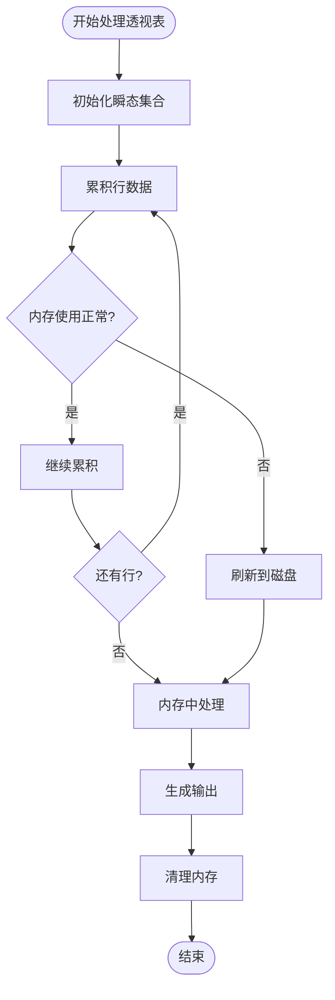

# 流式处理

<cite>
**本文档中引用的文件**
- [streaming.clj](file://src/metabase/query_processor/streaming.clj)
- [interface.clj](file://src/metabase/query_processor/streaming/interface.clj)
- [common.clj](file://src/metabase/query_processor/streaming/common.clj)
- [csv.clj](file://src/metabase/query_processor/streaming/csv.clj)
- [json.clj](file://src/metabase/query_processor/streaming/json.clj)
- [xlsx.clj](file://src/metabase/query_processor/streaming/xlsx.clj)
- [streaming_response.clj](file://src/metabase/server/streaming_response.clj)
- [postprocess.clj](file://src/metabase/query_processor/pivot/postprocess.clj)
- [visualization_settings.clj](file://src/metabase/query_processor/middleware/visualization_settings.clj)
</cite>

## 目录
1. [简介](#简介)
2. [系统架构概览](#系统架构概览)
3. [streaming-response宏详解](#streaming-response宏详解)
4. [结果写入器接口](#结果写入器接口)
5. [输出格式实现](#输出格式实现)
6. [列名去重与排序算法](#列名去重与排序算法)
7. [可视化设置处理](#可视化设置处理)
8. [透视表处理](#透视表处理)
9. [内存优化策略](#内存优化策略)
10. [扩展指南](#扩展指南)
11. [故障排除](#故障排除)
12. [总结](#总结)

## 简介

Metabase的流式处理系统是一个高度优化的数据导出框架，能够将查询结果实时流式传输到客户端，支持CSV、JSON和XLSX等多种输出格式。该系统通过分层架构设计，在保证数据准确性的同时，实现了对大数据集的高效内存管理。

核心特性包括：
- 实时流式数据传输
- 多格式输出支持（CSV、JSON、XLSX）
- 智能内存优化
- 可视化设置集成
- 透视表特殊处理
- 客户端取消检测

## 系统架构概览

流式处理系统采用分层架构，从上到下包含响应层、协议层、写入器层和格式化层。



**图表来源**
- [streaming.clj](file://src/metabase/query_processor/streaming.clj#L1-L50)
- [interface.clj](file://src/metabase/query_processor/streaming/interface.clj#L1-L32)

**章节来源**
- [streaming.clj](file://src/metabase/query_processor/streaming.clj#L1-L266)
- [interface.clj](file://src/metabase/query_processor/streaming/interface.clj#L1-L32)

## streaming-response宏详解

`streaming-response`宏是整个流式处理系统的核心入口点，它负责协调查询执行、结果写入和HTTP响应生成。

### 宏的工作原理



**图表来源**
- [streaming.clj](file://src/metabase/query_processor/streaming.clj#L251-L266)
- [streaming_response.clj](file://src/metabase/server/streaming_response.clj#L301-L322)

### 核心实现机制

宏通过以下步骤实现流式响应：

1. **环境绑定**：设置查询管道上下文和取消通道
2. **结果函数创建**：生成streaming-rff包装器
3. **异步处理**：在独立线程池中执行写入操作
4. **错误处理**：捕获并处理各种异常情况
5. **资源清理**：确保输出流正确关闭

**章节来源**
- [streaming.clj](file://src/metabase/query_processor/streaming.clj#L226-L251)
- [streaming_response.clj](file://src/metabase/server/streaming_response.clj#L100-L137)

## 结果写入器接口

`StreamingResultsWriter`协议定义了所有输出格式必须实现的标准接口，确保了一致性和可扩展性。

### 协议方法详解



**图表来源**
- [interface.clj](file://src/metabase/query_processor/streaming/interface.clj#L10-L31)

### 接口实现要求

每个写入器实现都必须满足以下要求：

- **begin!方法**：初始化输出，设置元数据和格式化选项
- **write-row!方法**：处理单行数据，应用格式化规则
- **finish!方法**：完成输出，清理资源并关闭流

**章节来源**
- [interface.clj](file://src/metabase/query_processor/streaming/interface.clj#L10-L31)

## 输出格式实现

### CSV格式实现

CSV写入器专门针对逗号分隔值格式进行了优化，支持复杂的格式化需求和透视表处理。

#### 核心特性
- **智能引号处理**：自动识别需要引号包围的字段
- **内存优化**：透视表数据在内存中累积后批量写入
- **格式化支持**：集成数值和日期格式化器

#### 实现细节



**图表来源**
- [csv.clj](file://src/metabase/query_processor/streaming/csv.clj#L89-L155)

**章节来源**
- [csv.clj](file://src/metabase/query_processor/streaming/csv.clj#L89-L155)

### JSON格式实现

JSON写入器提供灵活的结构化数据导出，支持API和纯JSON两种模式。

#### 特殊处理
- **数组映射**：使用array-map保持键值对顺序
- **数值处理**：区分数字包装器和文本包装器
- **流式编码**：避免完整的JSON对象构建

**章节来源**
- [json.clj](file://src/metabase/query_processor/streaming/json.clj#L30-L154)

### XLSX格式实现

XLSX写入器是最复杂也是最强大的输出格式，支持丰富的样式和格式化选项。

#### 高级特性
- **样式系统**：动态计算单元格样式
- **自动调整**：智能列宽调整
- **透视表支持**：完整的透视表导出
- **性能优化**：延迟样式计算和批量写入

#### 样式处理流程



**图表来源**
- [xlsx.clj](file://src/metabase/query_processor/streaming/xlsx.clj#L259-L350)

**章节来源**
- [xlsx.clj](file://src/metabase/query_processor/streaming/xlsx.clj#L259-L756)

## 列名去重与排序算法

列名去重和排序是确保导出数据一致性的重要机制，特别是在处理透视表和重新映射字段时。

### 去重算法实现



**图表来源**
- [streaming.clj](file://src/metabase/query_processor/streaming/streaming.clj#L45-L58)

### 导出列顺序控制

列顺序控制算法考虑了多种因素来确定最终的导出顺序：

1. **可视化设置优先**：尊重用户定义的列顺序
2. **透视表处理**：透视表有特殊的排序逻辑
3. **字段映射**：处理字段重新映射的情况
4. **兼容性维护**：确保向后兼容性

**章节来源**
- [streaming.clj](file://src/metabase/query_processor/streaming/streaming.clj#L45-L130)

## 可视化设置处理

可视化设置（viz-settings）是影响导出格式的关键配置，它决定了数值格式、日期格式、货币符号等显示选项。

### 设置层次结构



**图表来源**
- [common.clj](file://src/metabase/query_processor/streaming/common.clj#L186-L233)

### 格式化器创建

每个输出格式都有专门的格式化器创建逻辑：

- **数值格式化**：处理货币、百分比、科学记数法
- **日期时间格式化**：支持多种日期时间组合
- **字符串处理**：确保正确的引号和转义

**章节来源**
- [common.clj](file://src/metabase/query_processor/streaming/common.clj#L186-L233)

## 透视表处理

透视表是流式处理中最复杂的场景之一，需要特殊的处理逻辑来确保导出数据的正确性和一致性。

### 透视表数据结构

```mermaid
erDiagram
PivotData {
array rows
array cols
object settings
string timezone
boolean format-rows?
object pivot-export-options
}
PivotExportOptions {
array pivot-rows
array pivot-cols
array pivot-measures
boolean show-row-totals
boolean show-column-totals
}
Formatters {
array row-formatters
array col-formatters
array val-formatters
}
PivotData ||--|| PivotExportOptions : contains
PivotData ||--|| Formatters : uses
```

**图表来源**
- [postprocess.clj](file://src/metabase/query_processor/pivot/postprocess.clj#L25-L40)

### 后处理流程

透视表后处理涉及多个步骤来转换原始数据结构：

1. **分组索引提取**：识别透视分组列
2. **度量值确定**：找出聚合值所在位置
3. **标题构建**：生成顶部和左侧标题
4. **数据重组**：将扁平数据转换为二维表格

**章节来源**
- [postprocess.clj](file://src/metabase/query_processor/pivot/postprocess.clj#L155-L202)

## 内存优化策略

流式处理系统采用了多种内存优化策略来处理大数据集：

### 渐进式处理

- **行级处理**：逐行处理数据，避免完整加载
- **缓冲区管理**：合理控制内存缓冲区大小
- **及时释放**：及时释放不再需要的对象引用

### 透视表优化

对于透视表数据，系统采用内存累积策略：



**图表来源**
- [csv.clj](file://src/metabase/query_processor/streaming/csv.clj#L132-L155)
- [xlsx.clj](file://src/metabase/query_processor/streaming/xlsx.clj#L725-L756)

**章节来源**
- [csv.clj](file://src/metabase/query_processor/streaming/csv.clj#L132-L155)
- [xlsx.clj](file://src/metabase/query_processor/streaming/xlsx.clj#L725-L756)

## 扩展指南

### 添加新的输出格式

要添加新的输出格式，需要实现以下步骤：

1. **注册写入器**：在`streaming-results-writer`多方法中添加新格式
2. **定义选项**：在`stream-options`多方法中定义格式选项
3. **实现协议**：实现`StreamingResultsWriter`协议
4. **测试验证**：确保新格式正确处理各种数据类型

### 自定义文件名生成

可以通过修改`safe-filename-prefix`函数来自定义文件名生成逻辑：

```clojure
(defn safe-filename-prefix
  "生成安全的文件名前缀"
  [card-name]
  (or (some-> card-name
              str/trim
              not-empty
              (u/slugify {:max-length 200}))
      "question"))
```

### 扩展现有格式

现有格式可以通过以下方式扩展现有功能：

- **格式化器增强**：添加新的格式化选项
- **样式支持**：为XLSX格式添加新的样式类型
- **性能优化**：改进特定场景下的处理逻辑

## 故障排除

### 常见问题及解决方案

| 问题类型 | 症状 | 解决方案 |
|---------|------|----------|
| 内存溢出 | 大数据集导出失败 | 启用透视表导出或增加JVM堆内存 |
| 编码问题 | 导出文件乱码 | 检查字符编码设置，确保UTF-8 |
| 性能问题 | 导出速度慢 | 优化查询，减少不必要的列 |
| 格式错误 | 数值显示异常 | 检查可视化设置配置 |

### 调试技巧

1. **启用详细日志**：设置适当的日志级别
2. **监控内存使用**：观察JVM内存消耗
3. **测试小数据集**：先验证基本功能
4. **检查依赖版本**：确保所有依赖库版本兼容

## 总结

Metabase的流式处理系统是一个精心设计的高性能数据导出框架，通过以下关键特性实现了卓越的性能和灵活性：

### 核心优势

- **模块化架构**：清晰的分层设计便于维护和扩展
- **内存效率**：智能的内存管理策略支持大数据集处理
- **格式丰富**：支持多种输出格式满足不同需求
- **可定制性强**：完善的可视化设置集成
- **错误处理完善**：健壮的异常处理机制

### 技术亮点

- **协议驱动开发**：通过`StreamingResultsWriter`协议确保一致性
- **多方法分发**：利用Clojure多方法实现格式特定的处理逻辑
- **异步处理**：非阻塞的流式处理提升用户体验
- **透视表支持**：完整的透视表导出功能

该系统为Metabase提供了强大而灵活的数据导出能力，是现代数据分析平台不可或缺的核心组件。