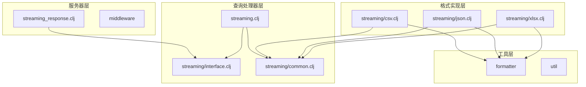
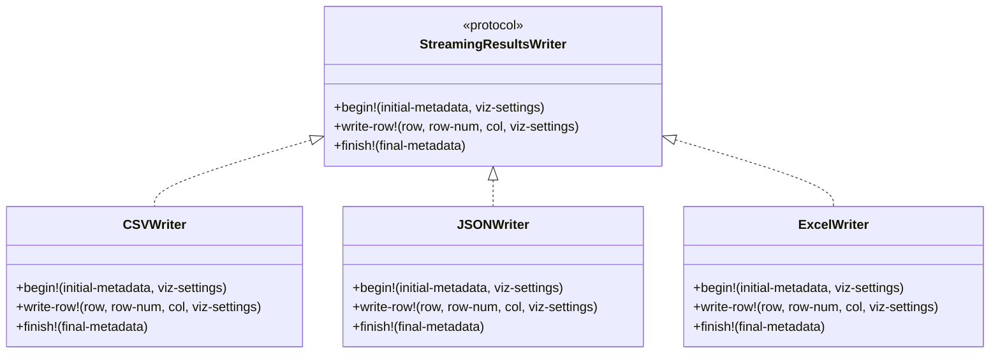
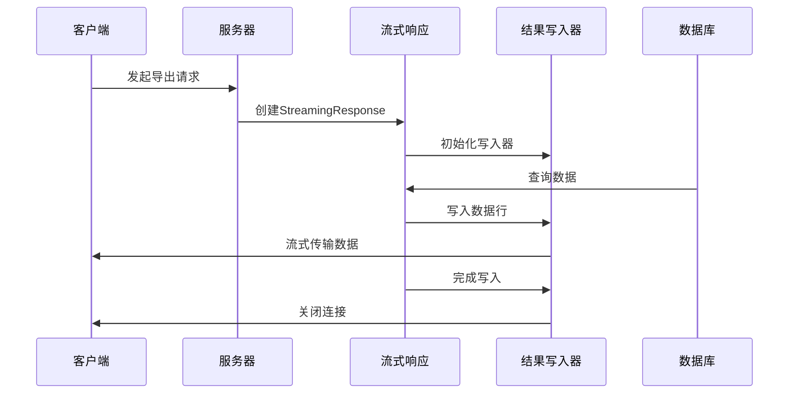
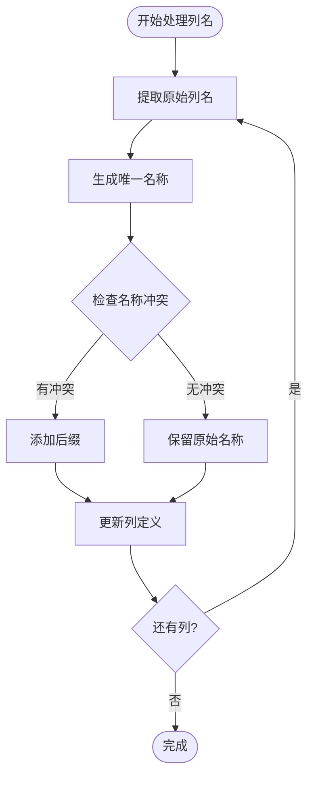
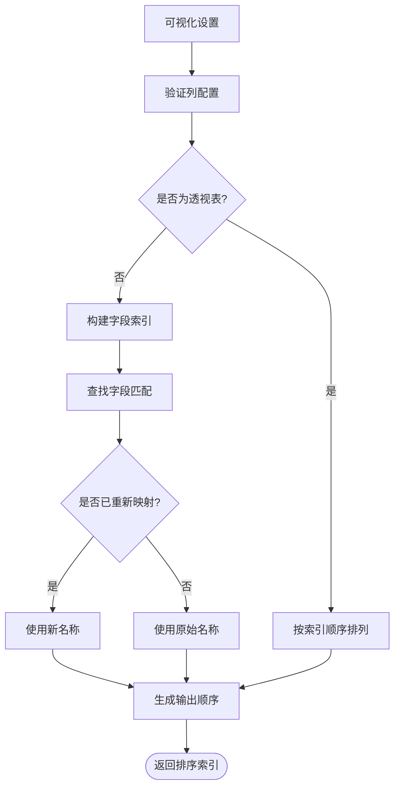
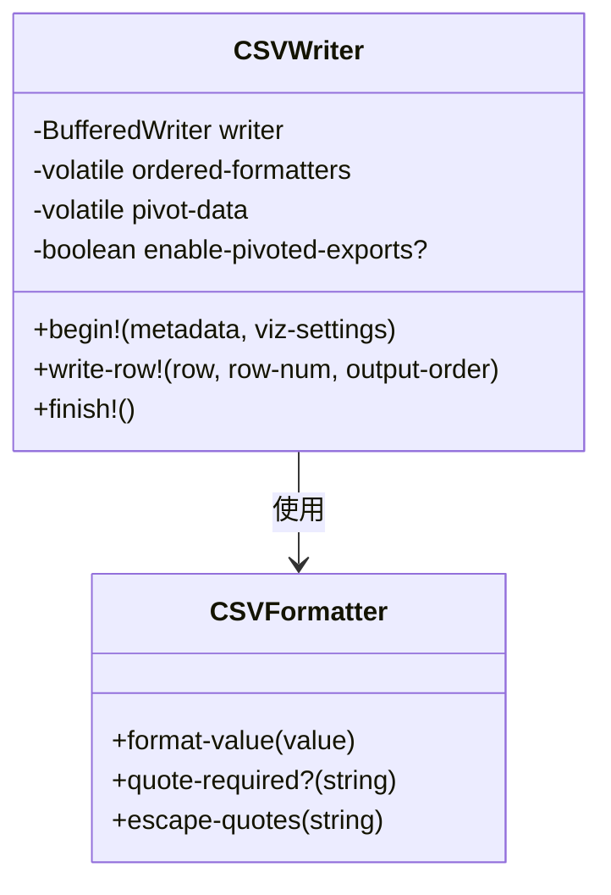
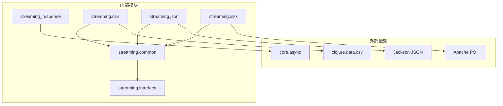

# 流式处理核心机制

<cite>
**本文档中引用的文件**
- [streaming_response.clj](file://src/metabase/server/streaming_response.clj)
- [interface.clj](file://src/metabase/query_processor/streaming/interface.clj)
- [streaming.clj](file://src/metabase/query_processor/streaming.clj)
- [csv.clj](file://src/metabase/query_processor/streaming/csv.clj)
- [json.clj](file://src/metabase/query_processor/streaming/json.clj)
- [xlsx.clj](file://src/metabase/query_processor/streaming/xlsx.clj)
- [common.clj](file://src/metabase/query_processor/streaming/common.clj)
</cite>

## 目录
1. [简介](#简介)
2. [项目结构概览](#项目结构概览)
3. [核心组件分析](#核心组件分析)
4. [架构概览](#架构概览)
5. [详细组件分析](#详细组件分析)
6. [依赖关系分析](#依赖关系分析)
7. [性能考虑](#性能考虑)
8. [故障排除指南](#故障排除指南)
9. [结论](#结论)

## 简介

Metabase的流式处理核心机制是一个高度优化的数据导出系统，专门设计用于处理大规模查询结果的实时流式传输。该系统通过`streaming-response`宏和`results-writer`协议实现了灵活且高效的多格式数据导出功能，支持CSV、JSON和Excel等多种格式。

该机制的核心优势在于：
- **内存效率**：采用流式处理避免将整个结果集加载到内存
- **格式多样性**：统一的接口支持多种导出格式
- **可扩展性**：基于协议的设计便于添加新的格式支持
- **错误处理**：完善的异常处理和连接取消机制

## 项目结构概览

Metabase的流式处理系统采用分层架构设计，主要包含以下核心模块：

**图表来源**
- [streaming_response.clj](file://src/metabase/server/streaming_response.clj#L1-L30)
- [interface.clj](file://src/metabase/query_processor/streaming/interface.clj#L1-L30)
- [streaming.clj](file://src/metabase/query_processor/streaming.clj#L1-L30)

**章节来源**
- [streaming_response.clj](file://src/metabase/server/streaming_response.clj#L1-L50)
- [interface.clj](file://src/metabase/query_processor/streaming/interface.clj#L1-L32)

## 核心组件分析

### streaming-response宏

`streaming-response`宏是整个流式处理系统的核心入口点，负责创建能够将结果流式传输到`OutputStream`的API响应。

#### 实现原理

该宏通过以下步骤实现响应包装：

1. **参数验证**：确保绑定参数数量正确
2. **函数封装**：使用`bound-fn`封装输出流和取消通道
3. **响应创建**：调用内部实现函数创建`StreamingResponse`对象

#### 响应头处理机制

系统通过`response-with-headers`模式自动处理HTTP响应头：

- **Content-Type设置**：根据导出格式自动设置正确的MIME类型
- **Content-Disposition**：为下载场景生成适当的文件名
- **安全头部**：添加必要的安全相关头部信息
- **压缩支持**：根据客户端请求自动启用GZIP压缩

**章节来源**
- [streaming_response.clj](file://src/metabase/server/streaming_response.clj#L301-L322)

### results-writer协议

`StreamingResultsWriter`协议定义了所有流式写入器必须实现的标准接口。

#### 协议定义

**图表来源**
- [interface.clj](file://src/metabase/query_processor/streaming/interface.clj#L10-L30)
- [csv.clj](file://src/metabase/query_processor/streaming/csv.clj#L70-L155)
- [json.clj](file://src/metabase/query_processor/streaming/json.clj#L28-L154)

#### 写入器协调机制

`write-results`函数作为协调器，根据导出格式选择合适的写入器：

1. **格式识别**：通过`streaming-results-writer`多方法识别目标格式
2. **写入器创建**：实例化对应的格式特定写入器
3. **结果处理**：将查询结果转换为流式格式并写入输出流
4. **资源清理**：确保输出流在完成后正确关闭

**章节来源**
- [interface.clj](file://src/metabase/query_processor/streaming/interface.clj#L1-L32)
- [streaming.clj](file://src/metabase/query_processor/streaming.clj#L165-L198)

## 架构概览

流式处理系统采用事件驱动的异步架构，支持高并发和低延迟的数据导出：

**图表来源**
- [streaming_response.clj](file://src/metabase/server/streaming_response.clj#L100-L137)
- [streaming.clj](file://src/metabase/query_processor/streaming.clj#L195-L229)

## 详细组件分析

### 列名去重算法(deduplicate-col-names)

该算法解决了数据库查询中可能出现的列名冲突问题，确保导出文件中的列名唯一性。

#### 实现逻辑

**图表来源**
- [streaming.clj](file://src/metabase/query_processor/streaming.clj#L40-L59)

#### 后缀追加策略

算法采用智能的后缀生成策略：
- 使用非截断的唯一名称生成器
- 保持显示名称的完整性
- 确保生成的名称符合数据库命名规范

**章节来源**
- [streaming.clj](file://src/metabase/query_processor/streaming.clj#L40-L59)

### export-column-order函数

该函数根据可视化设置确定导出列的顺序，支持复杂的列排序需求。

#### 可视化设置映射

**图表来源**
- [streaming.clj](file://src/metabase/query_processor/streaming.clj#L77-L140)

#### 字段匹配机制

函数实现了精确的字段匹配逻辑：
- 支持字段引用和名称两种匹配方式
- 处理重新映射字段的特殊情况
- 提供回退机制确保所有列都被包含

**章节来源**
- [streaming.clj](file://src/metabase/query_processor/streaming.clj#L77-L140)

### 格式特定写入器

#### CSV写入器实现

CSV写入器提供了高性能的逗号分隔值导出功能：

**图表来源**
- [csv.clj](file://src/metabase/query_processor/streaming/csv.clj#L70-L155)

#### JSON写入器实现

JSON写入器支持两种模式：简化数组模式和完整API模式。

#### Excel写入器实现

Excel写入器利用Apache POI库提供企业级电子表格导出功能，支持复杂的数据格式化和样式应用。

**章节来源**
- [csv.clj](file://src/metabase/query_processor/streaming/csv.clj#L70-L155)
- [json.clj](file://src/metabase/query_processor/streaming/json.clj#L28-L154)
- [xlsx.clj](file://src/metabase/query_processor/streaming/xlsx.clj#L642-L668)

### 自定义响应头扩展

系统提供了灵活的响应头定制机制：

#### 内容类型配置

每种导出格式都有预定义的内容类型：
- CSV：`text/csv`
- JSON：`application/json; charset=utf-8`
- Excel：`application/vnd.openxmlformats-officedocument.spreadsheetml.sheet`

#### 文件名生成

系统自动生成符合标准的文件名：
- 基于卡片名称或默认的"query_result"
- 包含时间戳确保文件唯一性
- 符合文件系统命名限制

**章节来源**
- [csv.clj](file://src/metabase/query_processor/streaming/csv.clj#L25-L35)
- [json.clj](file://src/metabase/query_processor/streaming/json.clj#L20-L27)
- [xlsx.clj](file://src/metabase/query_processor/streaming/xlsx.clj#L259-L268)

## 依赖关系分析

流式处理系统的依赖关系体现了清晰的分层架构：

**图表来源**
- [streaming_response.clj](file://src/metabase/server/streaming_response.clj#L1-L20)
- [interface.clj](file://src/metabase/query_processor/streaming/interface.clj#L1-L10)

**章节来源**
- [streaming_response.clj](file://src/metabase/server/streaming_response.clj#L1-L30)
- [interface.clj](file://src/metabase/query_processor/streaming/interface.clj#L1-L32)

## 性能考虑

### 内存管理

流式处理系统采用多项优化策略减少内存占用：

- **流式处理**：避免将整个结果集加载到内存
- **缓冲区管理**：合理配置缓冲区大小平衡性能和内存使用
- **及时释放**：确保不再使用的资源被及时回收

### 并发控制

系统通过异步处理提高并发性能：

- **线程池管理**：使用专用线程池处理流式响应
- **取消机制**：支持客户端主动取消长时间运行的查询
- **超时处理**：防止资源泄露和系统过载

### 网络优化

针对网络传输进行了专门优化：

- **GZIP压缩**：自动启用压缩减少带宽使用
- **Keep-alive**：合理配置连接复用策略
- **分块传输**：支持HTTP/1.1分块编码

## 故障排除指南

### 常见问题及解决方案

#### 连接中断处理

系统实现了完善的连接中断检测和恢复机制：

1. **心跳检测**：定期检查客户端连接状态
2. **优雅降级**：连接中断时进行适当的清理工作
3. **错误报告**：向客户端提供有意义的错误信息

#### 内存溢出预防

通过以下措施预防内存溢出：

- **流式写入**：避免大结果集的全量缓存
- **批量处理**：分批处理数据减少峰值内存使用
- **资源监控**：监控内存使用情况及时采取措施

#### 格式兼容性

确保各种导出格式的兼容性：

- **字符编码**：统一使用UTF-8编码避免乱码
- **数据类型**：正确处理各种数据类型的序列化
- **特殊字符**：妥善处理CSV中的特殊字符转义

**章节来源**
- [streaming_response.clj](file://src/metabase/server/streaming_response.clj#L100-L137)
- [streaming_response.clj](file://src/metabase/server/streaming_response.clj#L218-L240)

## 结论

Metabase的流式处理核心机制代表了现代数据分析平台在大规模数据导出方面的最佳实践。通过精心设计的架构和优化的实现，该系统成功地解决了传统批处理方式面临的内存压力、性能瓶颈和用户体验问题。

### 主要优势

1. **架构清晰**：分层设计便于维护和扩展
2. **性能优异**：流式处理显著降低内存使用
3. **格式丰富**：支持多种导出格式满足不同需求
4. **扩展性强**：基于协议的设计便于添加新功能

### 技术创新

- 智能的列名去重算法
- 灵活的可视化设置映射
- 完善的错误处理和恢复机制
- 高效的并发处理能力

该系统为其他需要处理大规模数据导出的应用程序提供了宝贵的参考价值，展示了如何在保证性能的同时提供丰富的功能和良好的用户体验。