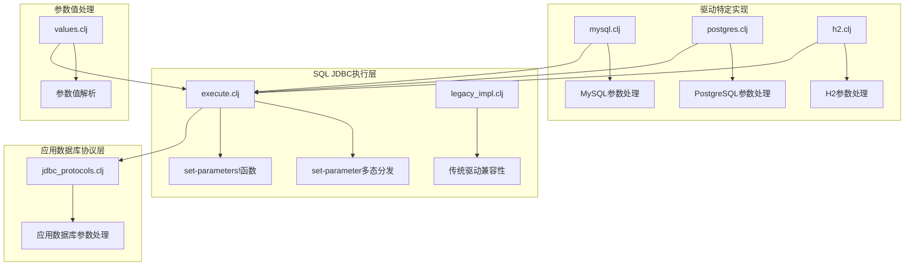
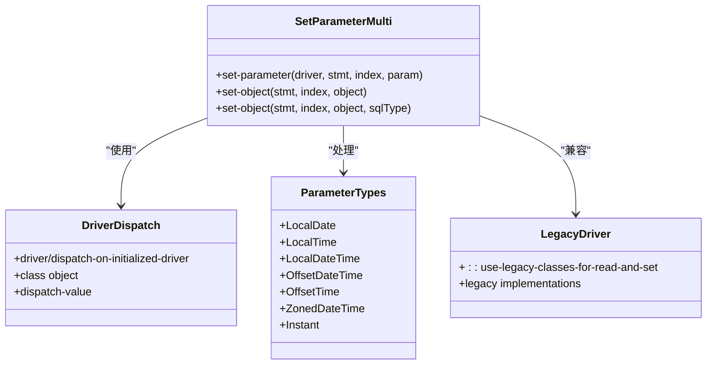
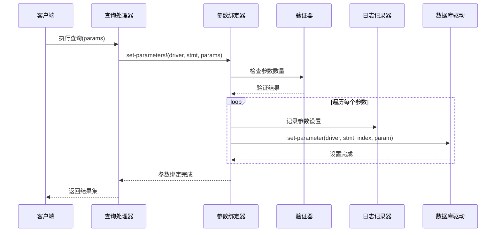
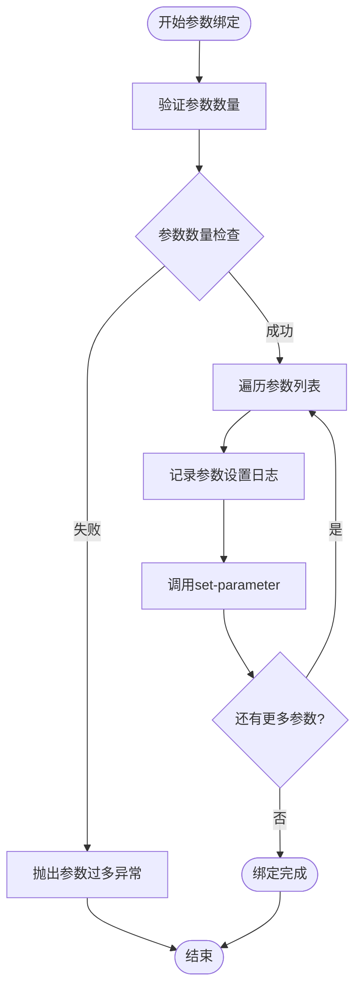
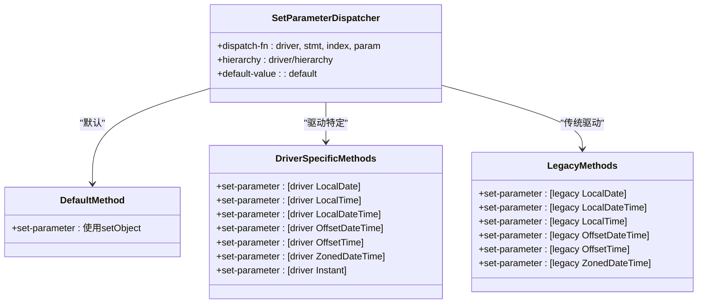
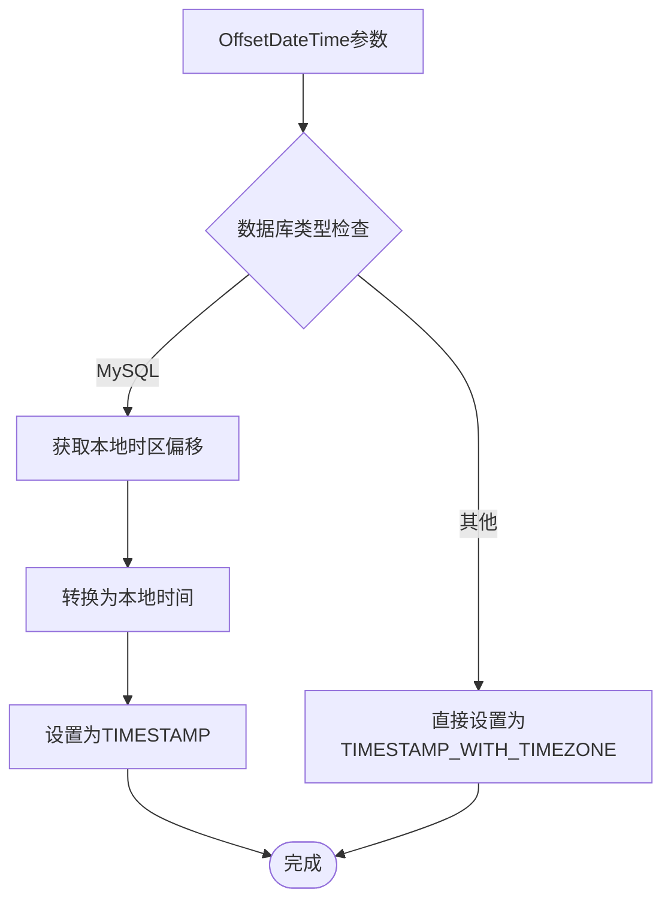
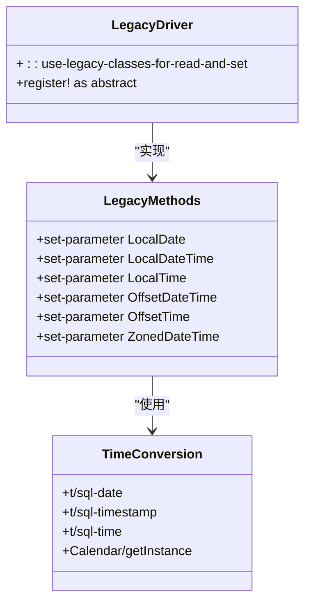
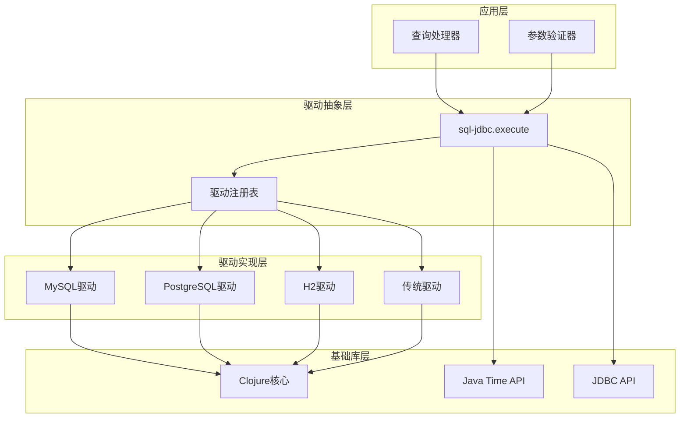

# 参数绑定

<cite>
**本文档中引用的文件**
- [execute.clj](file://src/metabase/driver/sql_jdbc/execute.clj)
- [legacy_impl.clj](file://src/metabase/driver/sql_jdbc/execute/legacy_impl.clj)
- [jdbc_protocols.clj](file://src/metabase/app_db/jdbc_protocols.clj)
- [values.clj](file://src/metabase/driver/common/parameters/values.clj)
- [mysql.clj](file://src/metabase/driver/mysql.clj)
- [postgres.clj](file://src/metabase/driver/postgres.clj)
- [h2.clj](file://src/metabase/driver/h2.clj)
</cite>

## 目录
1. [简介](#简介)
2. [项目结构概览](#项目结构概览)
3. [核心组件](#核心组件)
4. [架构概览](#架构概览)
5. [详细组件分析](#详细组件分析)
6. [依赖关系分析](#依赖关系分析)
7. [性能考虑](#性能考虑)
8. [故障排除指南](#故障排除指南)
9. [结论](#结论)

## 简介

Metabase的参数绑定系统是一个高度复杂且灵活的多态分发机制，专门设计用于处理SQL查询中参数的类型转换和JDBC setObject方法的正确调用。该系统的核心目标是确保不同类型的数据能够被正确地传递给数据库，并在不同数据库驱动之间提供一致的行为。

本文档深入分析了参数绑定的多态分发机制，详细说明了如何根据驱动类型和对象类型选择合适的JDBC setObject方法重载，特别是对Java Time API类型的特殊处理。同时，我们还将探讨set-parameters!函数如何遍历参数列表并为每个参数调用set-parameter方法，以及参数绑定过程中的日志记录和错误处理机制。

## 项目结构概览

Metabase的参数绑定功能主要分布在以下几个关键模块中：

**图表来源**
- [execute.clj](file://src/metabase/driver/sql_jdbc/execute.clj#L1-L50)
- [jdbc_protocols.clj](file://src/metabase/app_db/jdbc_protocols.clj#L1-L30)

**章节来源**
- [execute.clj](file://src/metabase/driver/sql_jdbc/execute.clj#L1-L100)
- [legacy_impl.clj](file://src/metabase/driver/sql_jdbc/execute/legacy_impl.clj#L1-L50)

## 核心组件

### 多态分发机制

Metabase使用Clojure的多态分发机制来处理不同类型的参数绑定。核心的`set-parameter`函数通过`defmulti`定义，支持基于驱动类型和参数类型的多重分发。

**图表来源**
- [execute.clj](file://src/metabase/driver/sql_jdbc/execute.clj#L135-L145)
- [legacy_impl.clj](file://src/metabase/driver/sql_jdbc/execute/legacy_impl.clj#L20-L30)

### Java Time API特殊处理

系统对Java Time API中的各种时间类型提供了特殊的处理逻辑：

| 时间类型 | JDBC类型 | 特殊处理 |
|---------|---------|---------|
| LocalDate | Types/DATE | 直接设置日期 |
| LocalTime | Types/TIME | 直接设置时间 |
| LocalDateTime | Types/TIMESTAMP | 直接设置时间戳 |
| OffsetDateTime | Types/TIMESTAMP_WITH_TIMEZONE | 转换为带时区的时间戳 |
| OffsetTime | Types/TIME_WITH_TIMEZONE | 转换为带时区的时间 |
| ZonedDateTime | Types/TIMESTAMP_WITH_TIMEZONE | 转换为OffsetDateTime |
| Instant | Types/TIMESTAMP | 转换为UTC偏移的OffsetDateTime |

**章节来源**
- [execute.clj](file://src/metabase/driver/sql_jdbc/execute.clj#L435-L470)
- [jdbc_protocols.clj](file://src/metabase/app_db/jdbc_protocols.clj#L31-L65)

## 架构概览

参数绑定系统的整体架构采用分层设计，从底层的JDBC操作到高层的应用逻辑：

**图表来源**
- [execute.clj](file://src/metabase/driver/sql_jdbc/execute.clj#L471-L500)

## 详细组件分析

### set-parameters!函数分析

`set-parameters!`函数是参数绑定流程的核心入口点，负责遍历所有参数并调用适当的set-parameter方法：

**图表来源**
- [execute.clj](file://src/metabase/driver/sql_jdbc/execute.clj#L471-L500)

该函数的关键特性包括：

1. **参数数量验证**：通过尝试获取PreparedStatement的参数元数据来验证参数数量是否匹配
2. **索引映射**：将零索引的参数列表转换为一索引的JDBC参数位置
3. **日志记录**：为每个参数设置操作记录详细的跟踪日志
4. **错误处理**：当参数数量不匹配时抛出明确的异常信息

**章节来源**
- [execute.clj](file://src/metabase/driver/sql_jdbc/execute.clj#L471-L500)

### 多态分发机制详解

set-parameter函数使用Clojure的多重分发机制，根据驱动类型和参数类型选择最合适的实现：

**图表来源**
- [execute.clj](file://src/metabase/driver/sql_jdbc/execute.clj#L135-L145)
- [legacy_impl.clj](file://src/metabase/driver/sql_jdbc/execute/legacy_impl.clj#L20-L50)

**章节来源**
- [execute.clj](file://src/metabase/driver/sql_jdbc/execute.clj#L135-L500)

### 驱动特定实现分析

#### MySQL驱动的特殊处理

MySQL驱动对OffsetDateTime进行了特殊的时区处理，因为MySQL的TIMESTAMP类型是非时区感知的：

**图表来源**
- [jdbc_protocols.clj](file://src/metabase/app_db/jdbc_protocols.clj#L45-L60)

#### PostgreSQL驱动的处理

PostgreSQL驱动保持了标准的Java Time API行为，直接使用相应的JDBC类型：

**章节来源**
- [jdbc_protocols.clj](file://src/metabase/app_db/jdbc_protocols.clj#L31-L65)

#### H2驱动的兼容性处理

H2驱动对某些时间类型进行了额外的转换处理：

**章节来源**
- [h2.clj](file://src/metabase/driver/h2.clj#L565-L575)

### 传统驱动兼容性

对于不完全支持JSR-310时间API的旧版JDBC驱动，系统提供了专门的兼容性实现：

**图表来源**
- [legacy_impl.clj](file://src/metabase/driver/sql_jdbc/execute/legacy_impl.clj#L20-L50)

**章节来源**
- [legacy_impl.clj](file://src/metabase/driver/sql_jdbc/execute/legacy_impl.clj#L1-L107)

## 依赖关系分析

参数绑定系统的依赖关系体现了清晰的分层架构：

**图表来源**
- [execute.clj](file://src/metabase/driver/sql_jdbc/execute.clj#L1-L30)
- [mysql.clj](file://src/metabase/driver/mysql.clj#L1-L30)

**章节来源**
- [execute.clj](file://src/metabase/driver/sql_jdbc/execute.clj#L1-L100)

## 性能考虑

参数绑定系统在设计时充分考虑了性能优化：

1. **延迟执行**：使用`dorun`确保参数设置的顺序执行
2. **类型缓存**：利用Clojure的类型系统避免重复的类型检查
3. **最小化反射**：通过类型注解减少运行时反射开销
4. **批量操作**：一次性设置所有参数而非逐个设置

## 故障排除指南

### 常见问题及解决方案

#### 参数数量不匹配错误

当出现"参数数量超过限制"的错误时，通常是因为：
- SQL语句中的占位符数量少于提供的参数数量
- 参数被意外地放置在注释或标识符中
- 预编译语句的参数元数据获取失败

**解决方法**：
1. 检查SQL语句中的占位符数量
2. 确保参数不会出现在注释或字符串字面量中
3. 验证数据库连接和驱动版本的兼容性

#### 时间类型转换问题

不同数据库对时间类型的处理差异可能导致问题：

**MySQL问题**：TIMESTAMP类型会自动转换为UTC存储
**PostgreSQL问题**：需要确保时区信息正确传递
**H2问题**：某些时间类型可能不被完全支持

**解决方法**：
1. 根据具体数据库调整时间类型的使用
2. 在应用层进行必要的时区转换
3. 使用数据库特定的参数处理逻辑

**章节来源**
- [execute.clj](file://src/metabase/driver/sql_jdbc/execute.clj#L471-L500)

## 结论

Metabase的参数绑定系统展现了现代数据库抽象层设计的最佳实践。通过精心设计的多态分发机制，系统能够在保持类型安全的同时提供高度的灵活性和兼容性。

该系统的主要优势包括：

1. **类型安全性**：通过Clojure的类型系统确保正确的JDBC方法调用
2. **驱动兼容性**：为不同数据库驱动提供统一的编程接口
3. **扩展性**：易于添加新的时间类型和数据库驱动支持
4. **调试友好**：详细的日志记录帮助诊断参数绑定问题
5. **性能优化**：合理的执行策略确保高效的参数设置

这种设计不仅满足了当前的功能需求，也为未来的扩展和优化奠定了坚实的基础。对于数据库驱动开发者而言，这套参数绑定机制提供了一个优秀的参考实现，展示了如何在复杂的类型系统中实现优雅的抽象和多态分发。