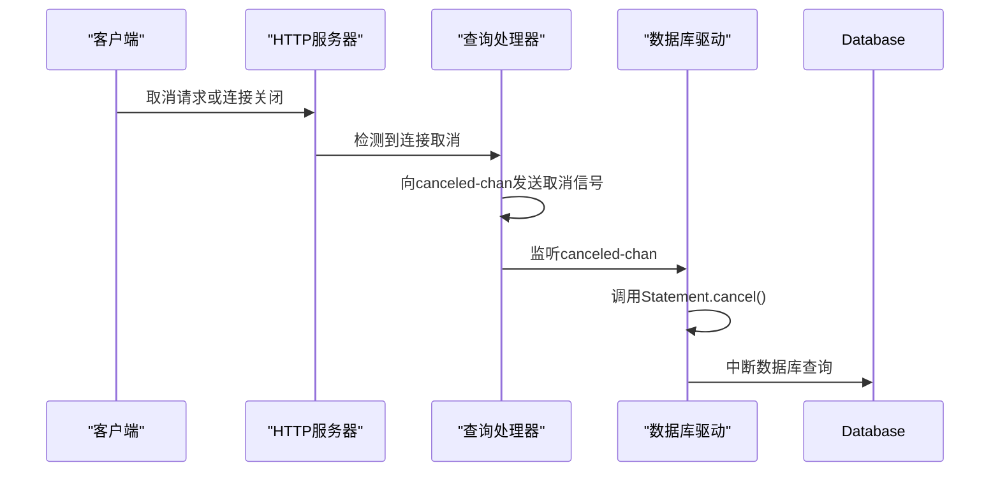
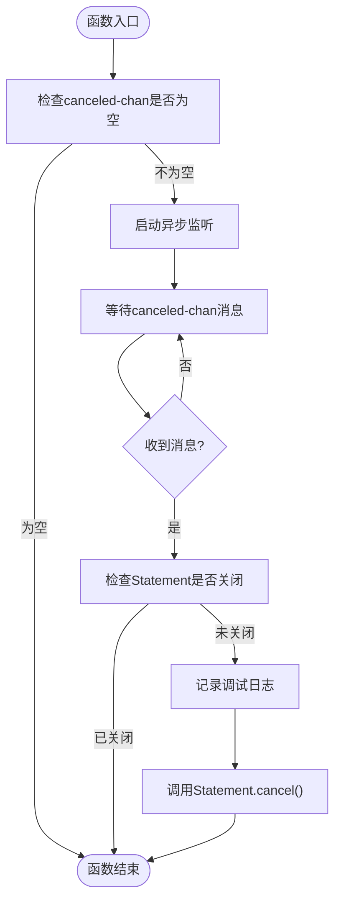
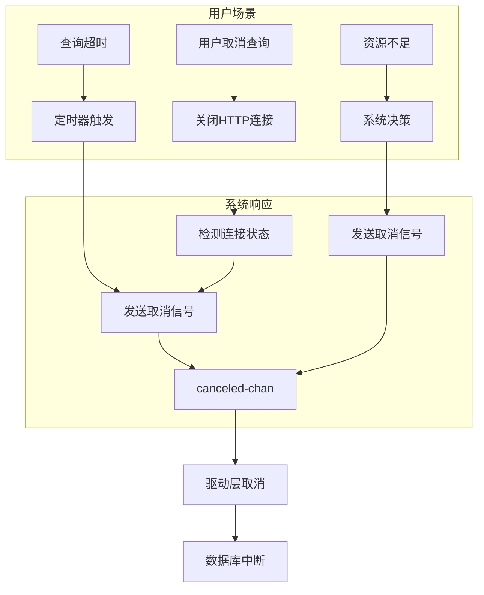

# 查询取消

<cite>
**本文档中引用的文件**  
- [query_cancelation.clj](file://src/metabase/app_db/query_cancelation.clj)
- [execute.clj](file://src/metabase/driver/sql_jdbc/execute.clj)
- [pipeline.clj](file://src/metabase/query_processor/pipeline.clj)
- [setup.clj](file://src/metabase/query_processor/setup.clj)
- [streaming_response.clj](file://src/metabase/server/streaming_response.clj)
- [core.clj](file://src/metabase/driver_api/core.clj)
</cite>

## 目录
1. [引言](#引言)
2. [查询取消机制概述](#查询取消机制概述)
3. [核心组件分析](#核心组件分析)
4. [canceled-chan通道实现原理](#canceled-chan通道实现原理)
5. [wire-up-canceled-chan-to-cancel-Statement!函数分析](#wire-up-canceled-chan-to-cancel-Statement!函数分析)
6. [execute-reducible-query中的资源管理](#execute-reducible-query中的资源管理)
7. [数据库驱动兼容性处理](#数据库驱动兼容性处理)
8. [实际应用场景](#实际应用场景)
9. [结论](#结论)

## 引言
Metabase是一个开源的数据分析平台，其查询取消机制是确保系统稳定性和用户体验的重要组成部分。当用户取消查询、查询超时或需要释放系统资源时，该机制能够及时中断正在执行的数据库查询，防止资源泄漏和系统阻塞。本文将深入分析Metabase中查询取消机制的实现原理，包括canceled-chan通道的使用、wire-up-canceled-chan-to-cancel-Statement!函数的工作方式、execute-reducible-query中finally块的资源管理，以及不同数据库驱动的兼容性问题。

## 查询取消机制概述
Metabase的查询取消机制基于Clojure的core.async库实现，通过异步通道（channel）来协调查询的取消操作。整个机制涉及多个组件的协同工作，包括查询处理器、驱动层和HTTP服务器层。当用户发起查询取消请求时，系统会通过canceled-chan通道发送取消信号，该信号最终传递到数据库驱动层，调用Statement.cancel()方法中断查询执行。这一机制不仅支持用户主动取消操作，还能处理查询超时和系统资源管理等场景。

```mermaid
graph TD
A[用户取消操作] --> B[HTTP请求取消检测]
B --> C[canceled-chan通道]
C --> D[wire-up-canceled-chan-to-cancel-Statement!]
D --> E[Statement.cancel()]
E --> F[数据库查询中断]
G[查询超时] --> C
H[资源管理] --> C
```

**Diagram sources**
- [streaming_response.clj](file://src/metabase/server/streaming_response.clj#L190-L323)
- [pipeline.clj](file://src/metabase/query_processor/pipeline.clj#L0-L31)
- [execute.clj](file://src/metabase/driver/sql_jdbc/execute.clj#L537-L545)

## 核心组件分析

### 查询处理器组件
查询处理器是Metabase的核心组件之一，负责处理查询请求的生命周期管理。它通过动态绑定*canceled-chan*通道来跟踪查询状态，并在查询执行前检查取消标志。

**Section sources**
- [pipeline.clj](file://src/metabase/query_processor/pipeline.clj#L0-L31)
- [setup.clj](file://src/metabase/query_processor/setup.clj#L157-L200)

### 驱动层组件
驱动层组件负责与具体数据库进行交互，实现数据库查询的执行和取消。sql-jdbc驱动提供了execute-reducible-query函数，该函数在finally块中确保语句被正确取消。

**Section sources**
- [execute.clj](file://src/metabase/driver/sql_jdbc/execute.clj#L748-L792)
- [core.clj](file://src/metabase/driver_api/core.clj#L0-L319)

## canceled-chan通道实现原理
canceled-chan通道是Metabase查询取消机制的核心，它是一个promise-chan类型的异步通道，用于传递查询取消信号。该通道在查询处理器的setup阶段被创建和绑定，贯穿整个查询执行过程。

通道的工作流程如下：
1. 在查询开始时，通过do-with-canceled-chan中间件创建新的canceled-chan通道
2. HTTP服务器层定期检查客户端连接状态，如果检测到连接关闭，则向canceled-chan发送取消信号
3. 驱动层监听canceled-chan通道，一旦收到信号就调用Statement.cancel()方法
4. 查询处理器在执行过程中定期检查canceled-chan状态，及时终止查询处理



**Diagram sources**
- [pipeline.clj](file://src/metabase/query_processor/pipeline.clj#L0-L31)
- [streaming_response.clj](file://src/metabase/server/streaming_response.clj#L190-L323)

## wire-up-canceled-chan-to-cancel-Statement!函数分析
wire-up-canceled-chan-to-cancel-Statement!函数是连接canceled-chan通道和数据库Statement的关键组件。该函数采用异步方式监听取消通道，并在收到取消信号时调用Statement的cancel方法。

函数实现要点：
- 使用core.async的go块实现异步监听
- 通过a/<!操作符等待canceled-chan通道的消息
- 在调用cancel方法前检查Statement是否已关闭
- 记录调试日志，便于问题排查

该函数在prepared-statement*和statement*函数中被调用，确保每个创建的Statement都与取消通道关联。



**Diagram sources**
- [execute.clj](file://src/metabase/driver/sql_jdbc/execute.clj#L537-L545)
- [execute.clj](file://src/metabase/driver/sql_jdbc/execute.clj#L547-L552)

**Section sources**
- [execute.clj](file://src/metabase/driver/sql_jdbc/execute.clj#L530-L563)

## execute-reducible-query中的资源管理
execute-reducible-query函数在finally块中实现了关键的资源管理逻辑，确保即使在异常情况下也能正确取消Statement，防止资源泄漏。

finally块的实现包含以下要点：
- 针对非Vertica数据库执行取消操作
- 调用Statement.cancel()方法中断数据库查询
- 捕获SQLFeatureNotSupportedException异常，处理不支持取消操作的驱动
- 记录警告日志，便于监控和问题排查

这种设计解决了在Redshift等数据库上遇到的问题，即当通过limit-xform中间件减少结果集时，Statement仍在数据库端继续执行，通过主动取消避免了.blocking .close调用。

**Section sources**
- [execute.clj](file://src/metabase/driver/sql_jdbc/execute.clj#L748-L792)

## 数据库驱动兼容性处理
Metabase通过多种机制处理不同数据库驱动的兼容性问题，确保查询取消机制在各种数据库上都能正常工作。

### SQLFeatureNotSupportedException处理
对于不支持Statement.cancel()方法的数据库驱动，Metabase捕获SQLFeatureNotSupportedException异常并记录警告日志，而不是让查询失败。这种容错设计保证了基本功能的可用性，同时提醒管理员注意潜在问题。

```clojure
(try (.cancel stmt)
     (catch SQLFeatureNotSupportedException _
       (log/warnf "Statemet's `.cancel` method is not supported by the `%s` driver." (name driver)))
     (catch Throwable _
       (log/warn "Statement cancelation failed.")))
```

### 数据库特定的取消异常识别
Metabase实现了query-canceled-exception?多方法，根据不同数据库类型识别查询取消异常：
- H2数据库：检查ErrorCode/STATEMENT_WAS_CANCELED
- PostgreSQL数据库：检查PSQLState/QUERY_CANCELED
- MySQL/MariaDB数据库：检查特定错误码(1317, 1969, 3024)

这种数据库特定的异常处理确保了取消机制的准确性和可靠性。

**Section sources**
- [query_cancelation.clj](file://src/metabase/app_db/query_cancelation.clj#L0-L53)
- [execute.clj](file://src/metabase/driver/sql_jdbc/execute.clj#L788-L792)

## 实际应用场景

### 用户取消操作
当用户在Web界面点击"取消查询"按钮时，浏览器会关闭HTTP连接。Metabase的HTTP服务器层通过start-async-cancel-loop!函数定期检查连接状态，一旦发现连接关闭就向canceled-chan发送取消信号，触发整个取消流程。

### 查询超时控制
虽然本文档主要分析主动取消机制，但类似的原理也适用于查询超时控制。系统可以设置查询执行时间限制，超时后自动向canceled-chan发送取消信号，实现超时中断功能。

### 资源管理
在高并发场景下，系统可能需要主动取消长时间运行的查询以释放资源。通过直接向canceled-chan发送消息，可以实现对查询执行的精细控制，优化系统资源利用率。



**Diagram sources**
- [streaming_response.clj](file://src/metabase/server/streaming_response.clj#L190-L323)
- [execute.clj](file://src/metabase/driver/sql_jdbc/execute.clj#L537-L545)

## 结论
Metabase的查询取消机制通过canceled-chan通道实现了优雅的异步查询中断功能。该机制结合了Clojure的函数式编程特性和Java JDBC的标准接口，既保证了跨数据库的兼容性，又提供了灵活的扩展能力。通过wire-up-canceled-chan-to-cancel-Statement!函数的巧妙设计，实现了取消信号的可靠传递；execute-reducible-query中finally块的资源管理确保了语句的正确取消，防止资源泄漏。针对不同数据库驱动的兼容性处理，特别是对SQLFeatureNotSupportedException的捕获和数据库特定取消异常的识别，体现了系统设计的健壮性和实用性。这一机制在用户取消操作、超时控制和资源管理等实际场景中发挥着重要作用，是Metabase作为企业级数据分析平台的关键特性之一。