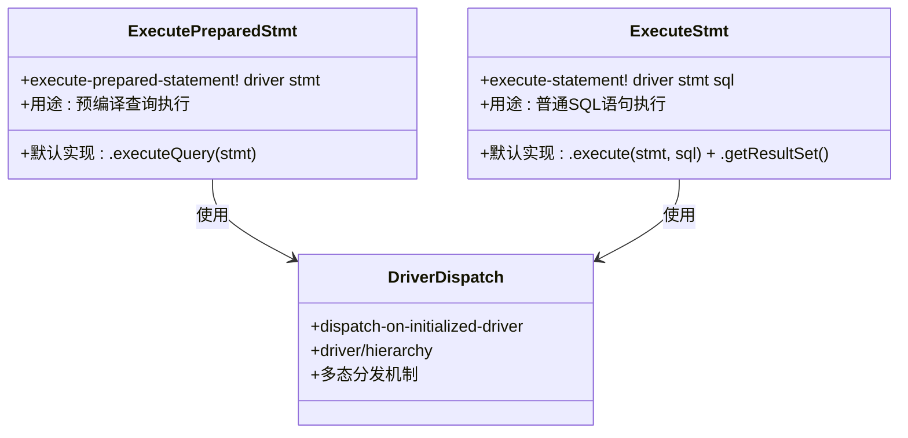
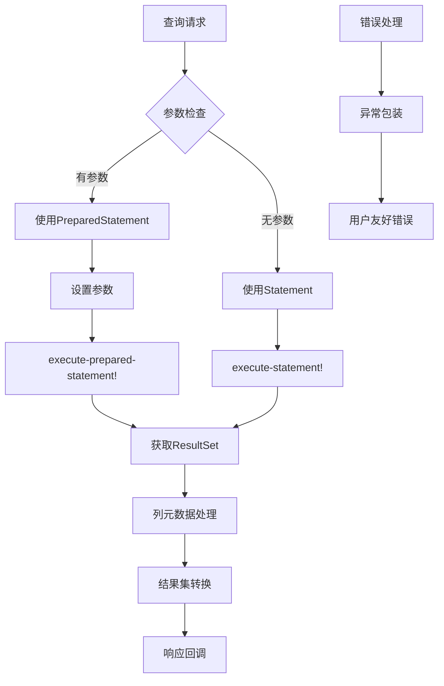
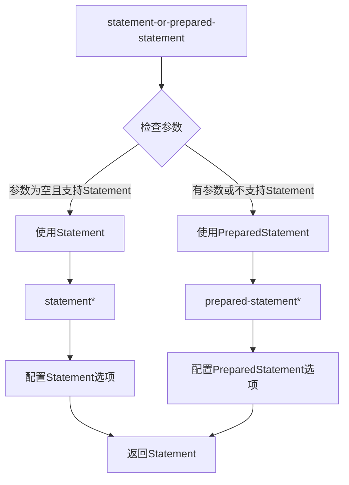
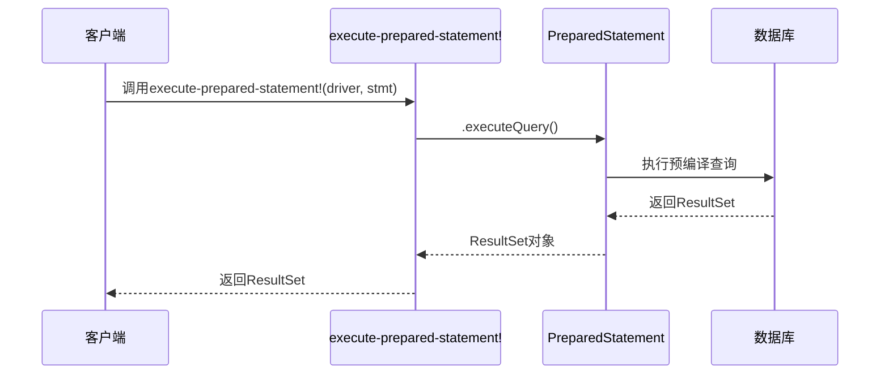
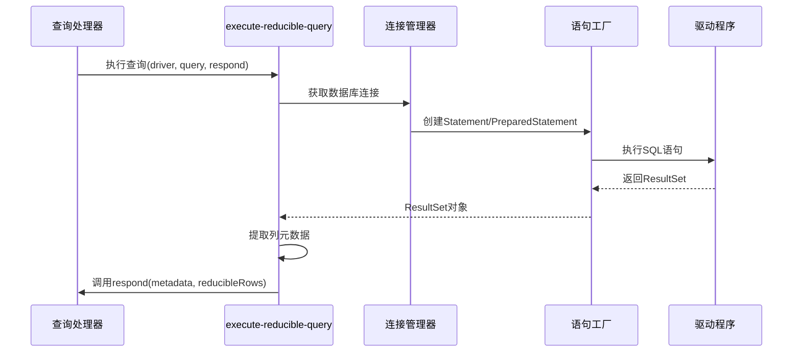
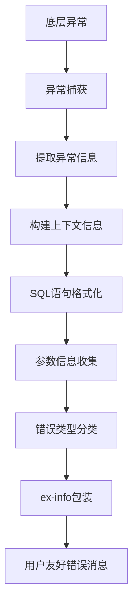
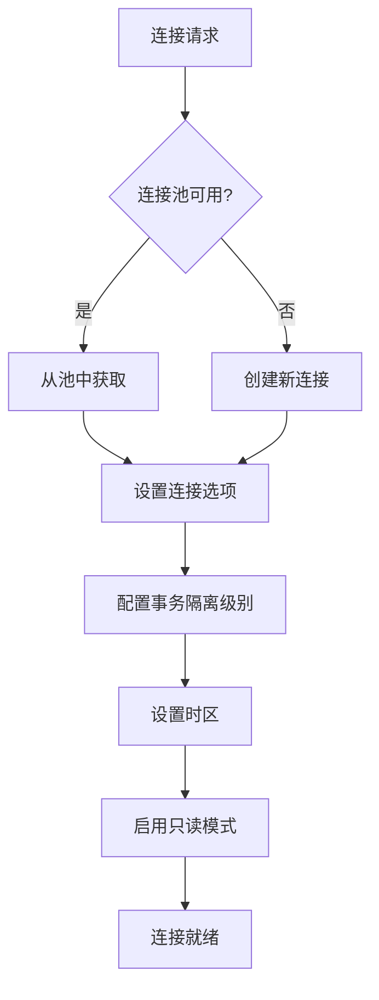

# 语句执行

<cite>
**本文档中引用的文件**
- [execute.clj](file://src/metabase/driver/sql_jdbc/execute.clj)
- [actions.clj](file://src/metabase/driver/sql_jdbc/actions.clj)
- [common.clj](file://src/metabase/driver/sql_jdbc/sync/common.clj)
- [driver.clj](file://src/metabase/driver.clj)
- [pipeline.clj](file://src/metabase/query_processor/pipeline.clj)
- [middleware.clj](file://src/metabase/query_processor/middleware/catch_exceptions.clj)
</cite>

## 目录
1. [简介](#简介)
2. [核心多态方法](#核心多态方法)
3. [执行流程架构](#执行流程架构)
4. [execute-prepared-statement! 方法详解](#execute-prepared-statement-方法详解)
5. [execute-statement! 方法详解](#execute-statement-方法详解)
6. [execute-reducible-query 执行机制](#execute-reducible-query-执行机制)
7. [错误包装与异常处理](#错误包装与异常处理)
8. [性能优化策略](#性能优化策略)
9. [总结](#总结)

## 简介

Metabase的SQL语句执行系统采用了一套精心设计的多态方法体系，通过`execute-prepared-statement!`和`execute-statement!`两个核心多态方法来处理不同类型的SQL查询执行。该系统不仅支持传统的预编译查询（PreparedStatement），也兼容普通的SQL语句执行（Statement），并通过智能的选择机制自动优化查询性能。

## 核心多态方法

### 多态方法定义

Metabase定义了两个关键的多态方法来处理SQL语句执行：



**图表来源**
- [execute.clj](file://src/metabase/driver/sql_jdbc/execute.clj#L154-L175)

### 方法签名对比

| 方法 | 参数类型 | 返回值 | 主要用途 |
|------|----------|--------|----------|
| `execute-prepared-statement!` | `driver`, `PreparedStatement` | `ResultSet` | 执行预编译查询，适用于有参数的查询 |
| `execute-statement!` | `driver`, `Statement`, `String` | `ResultSet` | 执行普通SQL语句，适用于无参数或动态SQL |

**节来源**
- [execute.clj](file://src/metabase/driver/sql_jdbc/execute.clj#L154-L175)

## 执行流程架构

### 整体执行流程



**图表来源**
- [execute.clj](file://src/metabase/driver/sql_jdbc/execute.clj#L745-L783)

### statement-or-prepared-statement 选择机制

系统通过`use-statement?`函数智能选择使用Statement还是PreparedStatement：



**图表来源**
- [execute.clj](file://src/metabase/driver/sql_jdbc/execute.clj#L560-L593)

**节来源**
- [execute.clj](file://src/metabase/driver/sql_jdbc/execute.clj#L560-L593)

## execute-prepared-statement! 方法详解

### 默认实现机制

`execute-prepared-statement!`方法的默认实现极其简洁，直接调用JDBC的`executeQuery()`方法：



**图表来源**
- [execute.clj](file://src/metabase/driver/sql_jdbc/execute.clj#L586-L590)

### 性能优势

预编译语句的优势包括：
- **安全性**：自动防止SQL注入攻击
- **性能**：数据库可以缓存执行计划
- **可预测性**：参数化查询避免语法错误

**节来源**
- [execute.clj](file://src/metabase/driver/sql_jdbc/execute.clj#L586-L590)

## execute-statement! 方法详解

### 实现逻辑

`execute-statement!`方法提供了更复杂的执行逻辑，确保查询产生有效的ResultSet：

```mermaid
flowchart TD
A[execute-statement!] --> B[调用stmt.execute(sql)]
B --> C{执行成功?}
C --> |是| D[调用stmt.getResultSet()]
C --> |否| E[抛出异常]
D --> F{ResultSet存在?}
F --> |是| G[返回ResultSet]
F --> |否| E
E --> H[异常信息: Select statement did not produce a ResultSet]
```

**图表来源**
- [execute.clj](file://src/metabase/driver/sql_jdbc/execute.clj#L592-L596)

### 错误处理机制

该方法专门处理以下情况：
- 查询不是SELECT语句
- 查询没有返回结果集
- 执行过程中发生数据库错误

**节来源**
- [execute.clj](file://src/metabase/driver/sql_jdbc/execute.clj#L592-L596)

## execute-reducible-query 执行机制

### 核心执行流程

`execute-reducible-query`是SQL语句执行的核心入口点，负责协调整个查询执行过程：



**图表来源**
- [execute.clj](file://src/metabase/driver/sql_jdbc/execute.clj#L745-L783)

### 参数处理与优化

系统在执行前会进行多项优化处理：

| 优化项 | 描述 | 实现位置 |
|--------|------|----------|
| 用户标识注入 | 在SQL中添加用户信息用于审计 | `inject-remark` |
| 最大行数限制 | 设置查询结果的最大行数 | `determine-query-max-rows` |
| 下载模式检测 | 识别是否为下载操作 | `download?`函数 |
| 连接池配置 | 使用适当的连接池设置 | `do-with-connection-with-options` |

**节来源**
- [execute.clj](file://src/metabase/driver/sql_jdbc/execute.clj#L745-L783)

### 结果集处理

执行完成后，系统会：
1. 提取ResultSet的元数据
2. 转换为标准格式的列信息
3. 创建可缩减的结果集
4. 通过回调函数返回给上层

**节来源**
- [execute.clj](file://src/metabase/driver/sql_jdbc/execute.clj#L768-L783)

## 错误包装与异常处理

### 异常包装机制

Metabase实现了完善的异常包装机制，将底层数据库异常转换为用户友好的错误信息：



**图表来源**
- [execute.clj](file://src/metabase/driver/sql_jdbc/execute.clj#L768-L783)

### 错误信息增强

包装后的异常包含以下关键信息：
- **SQL语句**：格式化后的可读版本
- **参数列表**：所有绑定参数的值
- **驱动信息**：使用的数据库驱动
- **错误类型**：标准化的错误分类

### 特殊错误处理

系统对特定类型的错误提供特殊处理：
- **查询取消**：优雅地处理用户取消的查询
- **连接失效**：自动重试和连接恢复
- **权限错误**：提供详细的权限信息

**节来源**
- [execute.clj](file://src/metabase/driver/sql_jdbc/execute.clj#L768-L783)

## 性能优化策略

### 连接管理优化



### 查询优化策略

| 优化技术 | 实现方式 | 性能收益 |
|----------|----------|----------|
| 结果集流式处理 | 使用reducible-rows | 减少内存占用 |
| 批量操作 | PreparedStatement批量 | 提高批量插入效率 |
| 连接复用 | 连接池管理 | 减少连接建立开销 |
| 参数化查询 | PreparedStatement | 缓存执行计划 |

### 内存管理

系统采用多种策略优化内存使用：
- **及时释放资源**：使用`with-open`确保资源正确关闭
- **流式处理**：避免将整个结果集加载到内存
- **连接池复用**：减少频繁的连接创建销毁

**节来源**
- [execute.clj](file://src/metabase/driver/sql_jdbc/execute.clj#L498-L532)

## 总结

Metabase的SQL语句执行系统展现了优秀的软件设计原则：

### 设计亮点

1. **多态抽象**：通过`execute-prepared-statement!`和`execute-statement!`提供统一的接口
2. **智能选择**：自动选择最优的执行方式
3. **完整错误处理**：提供丰富的上下文信息帮助调试
4. **性能优化**：多层次的性能优化策略
5. **资源管理**：确保资源的正确分配和释放

### 技术优势

- **安全性**：自动防止SQL注入
- **可维护性**：清晰的职责分离和模块化设计
- **扩展性**：基于多态的可扩展架构
- **可靠性**：完善的错误处理和资源管理

这套执行系统不仅满足了当前的功能需求，也为未来的功能扩展和性能优化奠定了坚实的基础。通过精心设计的抽象层次和完善的错误处理机制，它为Metabase提供了稳定可靠的SQL执行能力。