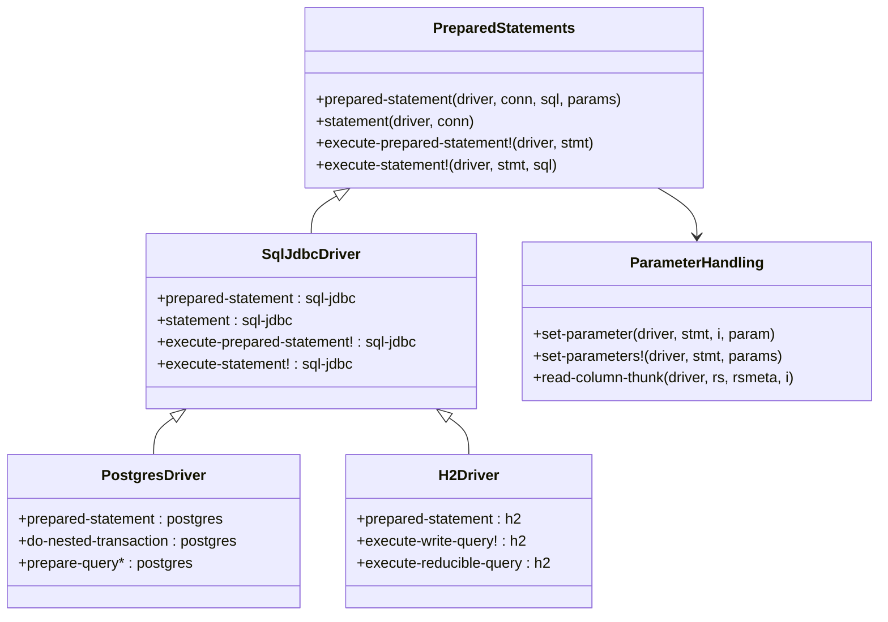
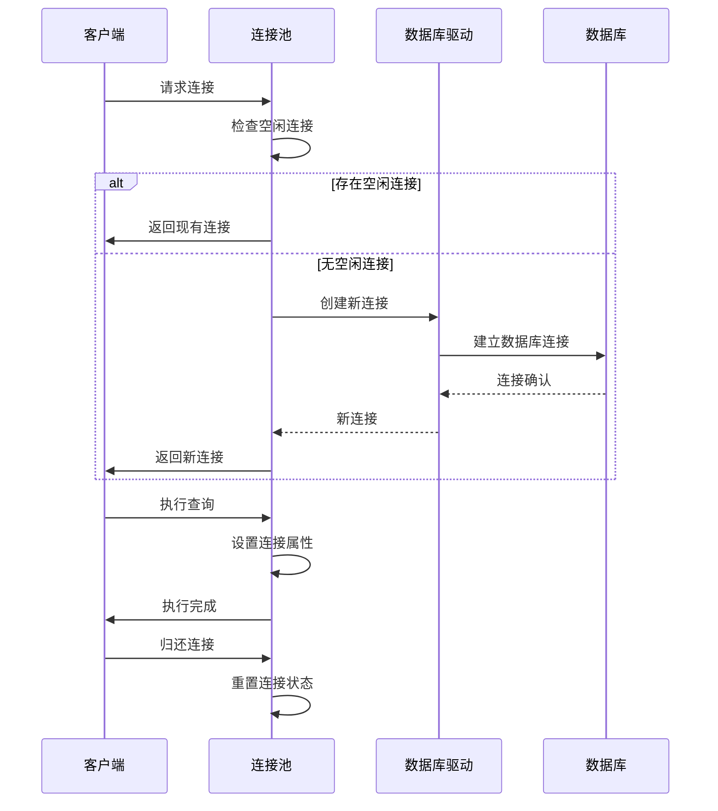
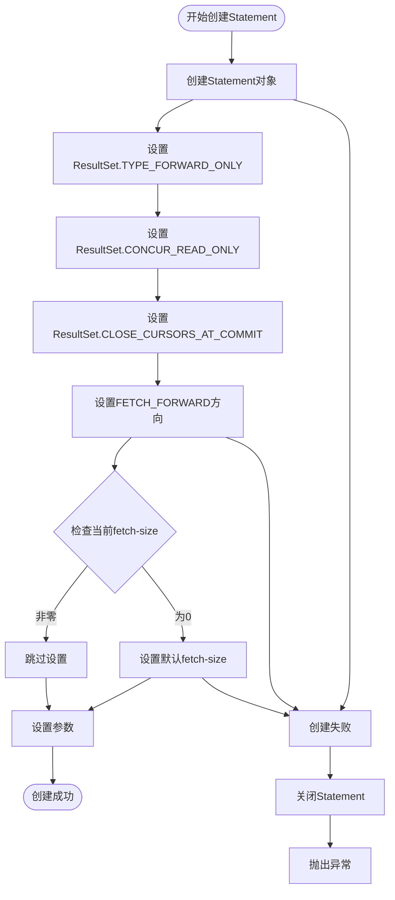
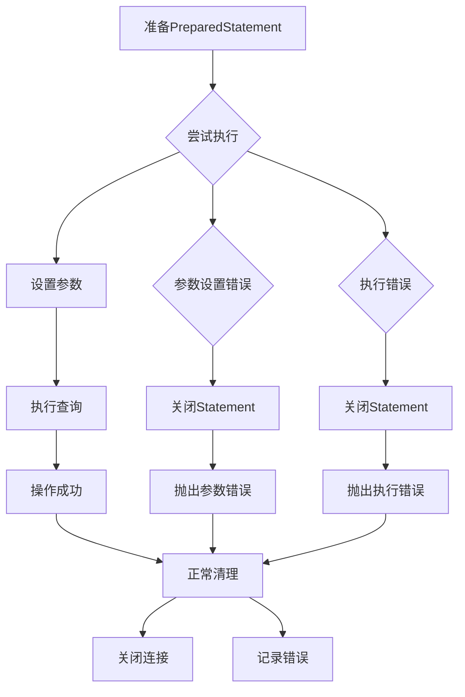
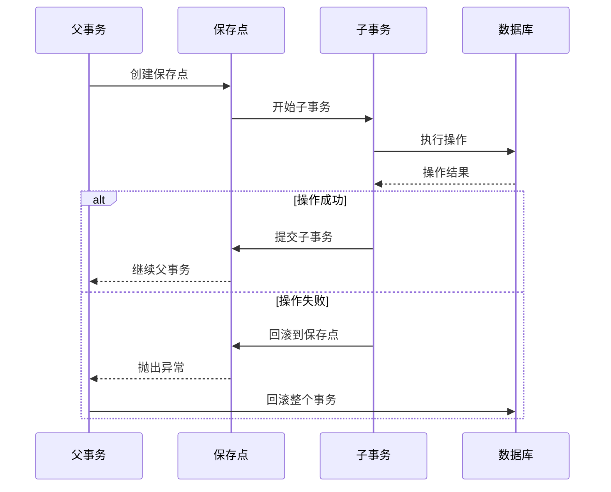

# 预编译语句创建

<cite>
**本文档引用的文件**
- [execute.clj](file://src/metabase/driver/sql_jdbc/execute.clj)
- [connection.clj](file://src/metabase/driver/sql_jdbc/connection.clj)
- [actions.clj](file://src/metabase/driver/sql_jdbc/actions.clj)
- [settings.clj](file://src/metabase/driver/settings.clj)
- [legacy_impl.clj](file://src/metabase/driver/sql_jdbc/execute/legacy_impl.clj)
- [postgres/actions.clj](file://src/metabase/driver/postgres/actions.clj)
- [h2.clj](file://src/metabase/driver/h2.clj)
</cite>

## 目录
1. [简介](#简介)
2. [PreparedStatement多态方法架构](#preparedstatement多态方法架构)
3. [JDBC连接创建机制](#jdbc连接创建机制)
4. [ResultSet配置与优化](#resultset配置与优化)
5. [异常处理与资源管理](#异常处理与资源管理)
6. [驱动程序特定实现](#驱动程序特定实现)
7. [性能优化最佳实践](#性能优化最佳实践)
8. [故障排除指南](#故障排除指南)
9. [总结](#总结)

## 简介

Metabase的PreparedStatement创建机制是一个高度模块化和可扩展的系统，旨在为各种数据库驱动程序提供统一的预编译语句创建接口。该系统通过多态方法（multimethod）模式实现了灵活的数据库特定行为，同时确保了资源的安全管理和性能优化。

核心设计理念包括：
- **统一接口**：所有数据库驱动程序都遵循相同的PreparedStatement创建协议
- **资源安全**：自动处理连接、语句和结果集的生命周期管理
- **性能优化**：通过合理的ResultSet配置和fetch-size设置提升查询性能
- **异常恢复**：提供完善的错误处理和资源清理机制

## PreparedStatement多态方法架构

### 核心多态方法体系

Metabase使用Clojure的多态方法系统来实现PreparedStatement的创建和管理，形成了一个层次化的架构：

**图表来源**
- [execute.clj](file://src/metabase/driver/sql_jdbc/execute.clj#L134-L154)
- [actions.clj](file://src/metabase/driver/sql_jdbc/actions.clj#L184-L213)

### 方法分发机制

PreparedStatement的创建过程通过以下关键方法进行分发：

1. **`prepared-statement`**：创建带有参数绑定的PreparedStatement对象
2. **`statement`**：创建不带参数的Statement对象（用于原生查询）
3. **`execute-prepared-statement!`**：执行PreparedStatement并返回ResultSet
4. **`execute-statement!`**：执行Statement并返回ResultSet

**章节来源**
- [execute.clj](file://src/metabase/driver/sql_jdbc/execute.clj#L134-L154)

## JDBC连接创建机制

### 连接池管理

Metabase采用C3P0连接池来管理数据库连接，提供了高效的连接复用和资源控制：

**图表来源**
- [connection.clj](file://src/metabase/driver/sql_jdbc/connection.clj#L150-L200)

### 连接配置策略

连接创建过程包含以下关键配置步骤：

1. **连接规范构建**：根据数据库详情生成JDBC连接规范
2. **SSH隧道支持**：处理需要SSH隧道的远程数据库连接
3. **认证信息集成**：整合外部认证提供程序的凭据
4. **连接池初始化**：配置C3P0连接池参数

**章节来源**
- [connection.clj](file://src/metabase/driver/sql_jdbc/connection.clj#L150-L250)

## ResultSet配置与优化

### ResultSet类型配置

Metabase为PreparedStatement和Statement设置了标准化的ResultSet配置：

**图表来源**
- [execute.clj](file://src/metabase/driver/sql_jdbc/execute.clj#L498-L532)

### Fetch Size优化策略

Metabase通过以下方式优化ResultSet的fetch-size配置：

| 配置项 | 默认值 | 作用 | 性能影响 |
|--------|--------|------|----------|
| `ResultSet.TYPE_FORWARD_ONLY` | 固定值 | 只允许正向遍历 | 减少内存占用 |
| `ResultSet.CONCUR_READ_ONLY` | 固定值 | 只读模式 | 提升查询性能 |
| `ResultSet.CLOSE_CURSORS_AT_COMMIT` | 固定值 | 提交时关闭游标 | 资源及时释放 |
| `ResultSet.FETCH_FORWARD` | 固定值 | 正向获取数据 | 优化内存使用 |
| `sql-jdbc-fetch-size` | 500 | 默认fetch大小 | 平衡内存与网络开销 |

**章节来源**
- [execute.clj](file://src/metabase/driver/sql_jdbc/execute.clj#L507-L531)
- [settings.clj](file://src/metabase/driver/settings.clj#L157-L162)

## 异常处理与资源管理

### 异常处理架构

Metabase实现了多层次的异常处理机制来确保资源的安全清理：

**图表来源**
- [execute.clj](file://src/metabase/driver/sql_jdbc/execute.clj#L520-L532)

### 资源清理策略

系统采用以下资源清理策略：

1. **自动关闭机制**：使用`with-open`宏确保资源自动关闭
2. **异常安全**：即使发生异常也能保证资源清理
3. **连接池管理**：连接归还到连接池而非直接关闭
4. **超时处理**：支持查询取消和超时机制

**章节来源**
- [execute.clj](file://src/metabase/driver/sql_jdbc/execute.clj#L520-L532)

## 驱动程序特定实现

### PostgreSQL特殊处理

PostgreSQL驱动程序实现了特殊的嵌套事务处理机制：

**图表来源**
- [postgres/actions.clj](file://src/metabase/driver/postgres/actions.clj#L118-L140)

### 参数类型映射

不同驱动程序对参数类型的处理存在差异：

| 驱动程序 | 时间类型处理 | 特殊功能 | 注意事项 |
|----------|--------------|----------|----------|
| PostgreSQL | 支持完整的时区信息 | 自动转换到UTC | 使用TIMESTAMP WITH TIME ZONE |
| H2 | 兼容性模式 | 有限的时间类型支持 | 需要特殊转换逻辑 |
| MySQL | 标准JDBC类型 | 基本类型支持 | 部分类型需要额外配置 |

**章节来源**
- [legacy_impl.clj](file://src/metabase/driver/sql_jdbc/execute/legacy_impl.clj#L20-L50)

## 性能优化最佳实践

### 查询性能优化

为了最大化查询性能，Metabase采用了以下优化策略：

1. **合理设置fetch-size**：默认500行，平衡内存使用和网络效率
2. **只读模式优化**：启用CONCUR_READ_ONLY提升查询速度
3. **连接池配置**：优化连接池参数减少连接建立开销
4. **参数预编译**：使用PreparedStatement避免SQL注入和解析开销

### 内存管理策略

**图表来源**
- [execute.clj](file://src/metabase/driver/sql_jdbc/execute.clj#L507-L531)

## 故障排除指南

### 常见问题诊断

| 问题症状 | 可能原因 | 解决方案 |
|----------|----------|----------|
| PreparedStatement创建失败 | SQL语法错误或参数不匹配 | 检查SQL语句和参数类型 |
| 查询性能差 | fetch-size设置不当 | 调整sql-jdbc-fetch-size配置 |
| 连接泄漏 | 异常处理不当 | 确保使用try-catch-finally块 |
| 内存溢出 | 结果集过大 | 减小fetch-size或增加内存 |

### 调试技巧

1. **启用详细日志**：设置适当的日志级别查看详细执行信息
2. **监控连接池**：观察连接池使用情况和性能指标
3. **参数验证**：检查参数类型和数量是否匹配
4. **资源监控**：监控内存使用和垃圾回收情况

**章节来源**
- [execute.clj](file://src/metabase/driver/sql_jdbc/execute.clj#L520-L532)

## 总结

Metabase的PreparedStatement创建机制体现了现代数据库应用开发的最佳实践：

- **模块化设计**：通过多态方法实现灵活的驱动程序适配
- **资源安全**：完善的异常处理和自动资源管理
- **性能优化**：合理的配置和优化策略
- **可扩展性**：清晰的接口设计支持新驱动程序的添加

该系统不仅确保了数据库操作的安全性和可靠性，还通过精心设计的性能优化策略提升了整体查询效率。对于开发者而言，理解这些机制有助于更好地利用Metabase的功能，并在遇到问题时能够快速定位和解决。