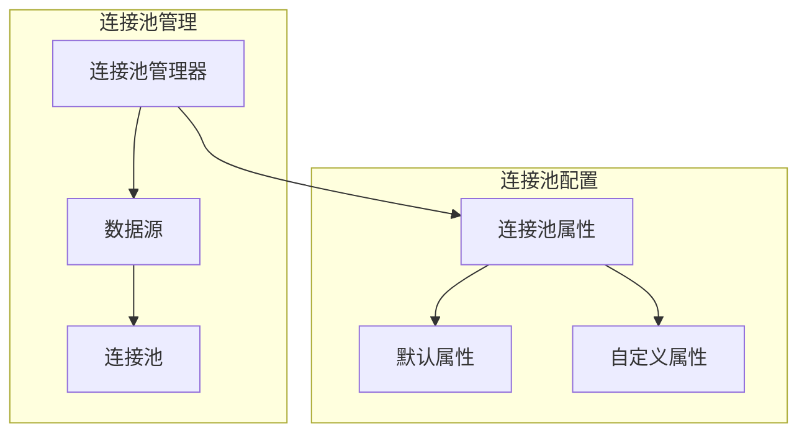
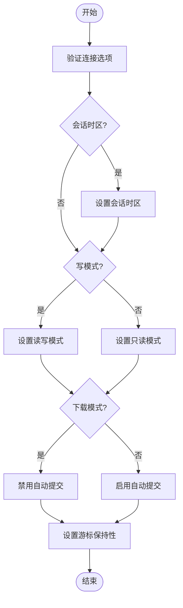
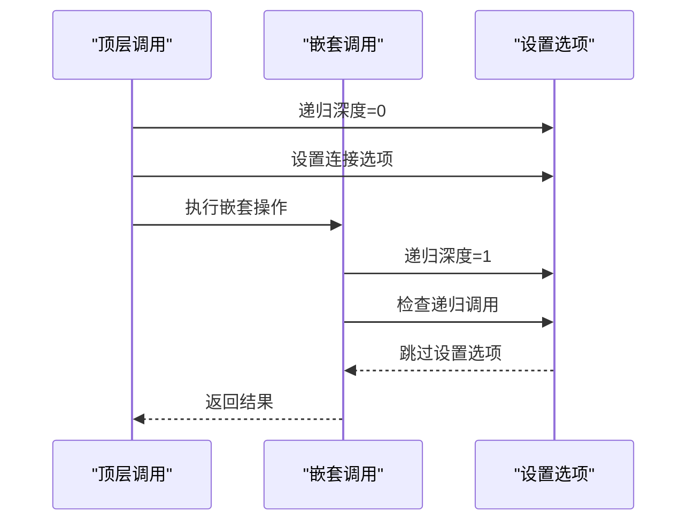
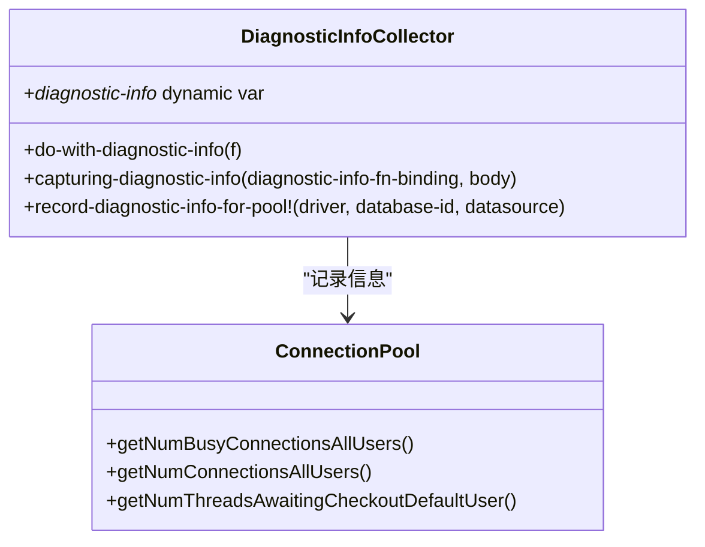
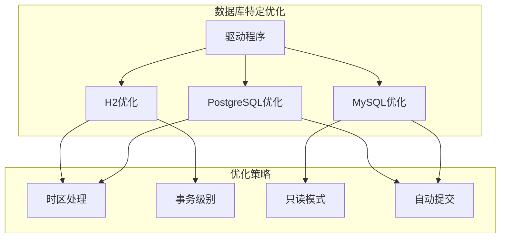

# 连接管理

<cite>
**本文档中引用的文件**   
- [execute.clj](file://src/metabase/driver/sql_jdbc/execute.clj)
- [connection.clj](file://src/metabase/driver/sql_jdbc/connection.clj)
- [diagnostic.clj](file://src/metabase/driver/sql_jdbc/execute/diagnostic.clj)
- [connection_pool_setup.clj](file://src/metabase/app_db/connection_pool_setup.clj)
- [h2.clj](file://src/metabase/driver/h2.clj)
- [postgres.clj](file://src/metabase/driver/postgres.clj)
</cite>

## 目录
1. [连接管理架构概述](#连接管理架构概述)
2. [连接池管理机制](#连接池管理机制)
3. [连接选项处理逻辑](#连接选项处理逻辑)
4. [递归连接检测机制](#递归连接检测机制)
5. [连接诊断信息收集](#连接诊断信息收集)
6. [数据库特定连接参数优化](#数据库特定连接参数优化)
7. [扩展连接管理支持](#扩展连接管理支持)

## 连接管理架构概述

Metabase查询执行引擎中的连接管理基于`do-with-connection-with-options`多态方法实现，该方法负责从驱动程序/数据库规范中获取JDBC连接并执行指定函数。连接管理架构采用分层设计，将连接获取、连接池管理、连接选项设置和诊断信息收集等功能分离，确保系统的可维护性和可扩展性。

连接管理的核心组件包括连接池管理器、连接选项处理器、递归连接检测器和诊断信息收集器。这些组件协同工作，确保连接的高效利用和正确配置。连接管理器通过`db->pooled-connection-spec`函数获取数据库的连接池规范，然后使用`do-with-connection-with-options`方法获取实际连接。

**Section sources**
- [execute.clj](file://src/metabase/driver/sql_jdbc/execute.clj#L67-L128)
- [connection.clj](file://src/metabase/driver/sql_jdbc/connection.clj#L50-L70)

## 连接池管理机制

Metabase使用c3p0连接池库来管理数据库连接池，为应用程序数据库和数据仓库数据库提供不同的连接池配置。连接池管理机制通过`data-warehouse-connection-pool-properties`多态方法定义数据仓库连接池的属性，这些属性针对数据仓库工作负载进行了优化。

对于应用程序数据库，连接池配置在`connection_pool_setup.clj`文件中定义，包括空闲连接测试周期、连接自定义器类名、超额连接空闲时间、最大连接年龄和最大连接池大小等参数。这些配置旨在平衡性能和资源利用率，确保连接池的稳定运行。

数据仓库连接池的配置更加注重可靠性和内存效率，包括获取增量、获取重试次数、最大空闲时间、最小池大小、最大池大小、检查连接时测试、超额连接最大空闲时间、未返回连接超时和调试未返回连接堆栈跟踪等属性。这些配置选项允许根据具体数据库的需求进行调整。

**Diagram sources **
- [connection.clj](file://src/metabase/driver/sql_jdbc/connection.clj#L141-L154)
- [connection_pool_setup.clj](file://src/metabase/app_db/connection_pool_setup.clj#L85-L108)

**Section sources**
- [connection.clj](file://src/metabase/driver/sql_jdbc/connection.clj#L141-L154)
- [connection_pool_setup.clj](file://src/metabase/app_db/connection_pool_setup.clj#L85-L108)

## 连接选项处理逻辑

连接选项通过`ConnectionOptions`模式传递给`do-with-connection-with-options`方法，包括会话时区、读写模式、下载模式和保持打开等参数。这些选项在连接获取过程中被处理，确保连接按照指定要求配置。

会话时区选项通过`set-time-zone-if-supported!`函数设置，该函数执行驱动程序特定的SQL语句来设置会话时区。读写模式通过`set-default-connection-options!`函数处理，根据`write?`参数的值设置连接的只读属性。下载模式在PostgreSQL等特定数据库中影响自动提交设置，以防止内存溢出问题。

连接选项的处理遵循分层原则，只有在顶层调用时才设置连接选项，避免在递归调用中覆盖先前的选项。这种设计确保了连接属性的一致性和正确性，特别是在嵌套查询执行场景中。

**Diagram sources **
- [execute.clj](file://src/metabase/driver/sql_jdbc/execute.clj#L339-L386)
- [connection.clj](file://src/metabase/driver/sql_jdbc/connection.clj#L273-L293)

**Section sources**
- [execute.clj](file://src/metabase/driver/sql_jdbc/execute.clj#L339-L386)
- [connection.clj](file://src/metabase/driver/sql_jdbc/connection.clj#L273-L293)

## 递归连接检测机制

递归连接检测机制通过动态变量`*connection-recursion-depth*`实现，用于防止在递归调用中重复设置连接属性。该机制在`do-with-resolved-connection`函数中递增递归深度，在`set-default-connection-options!`函数中检查是否为递归调用。

当`recursive-connection?`函数返回true时，表示当前处于递归调用中，不应再次设置连接选项。这种设计避免了在顶层写操作调用中禁用自动提交后，内部只读调用又将其更改回自动提交的问题。递归检测机制确保了连接属性的一致性，特别是在复杂的查询执行场景中。

递归深度变量初始化为-1，确保顶层调用的深度为0。每次进入`do-with-resolved-connection`函数时，递归深度递增1。这种设计简单而有效，能够准确识别递归调用层次，防止连接属性被意外覆盖。

**Diagram sources **
- [execute.clj](file://src/metabase/driver/sql_jdbc/execute.clj#L311-L340)
- [execute.clj](file://src/metabase/driver/sql_jdbc/execute.clj#L339-L366)

**Section sources**
- [execute.clj](file://src/metabase/driver/sql_jdbc/execute.clj#L311-L340)
- [execute.clj](file://src/metabase/driver/sql_jdbc/execute.clj#L339-L366)

## 连接诊断信息收集

连接诊断信息收集功能通过`diagnostic.clj`文件中的函数实现，用于捕获JDBC连接池在执行时的诊断信息。诊断信息收集器使用动态变量`*diagnostic-info*`存储当前查询执行的诊断信息，并提供`capturing-diagnostic-info`宏来启用诊断信息捕获。

诊断信息包括数据库ID、驱动程序、活动连接数、总连接数和等待获取连接的线程数等关键指标。这些信息通过`record-diagnostic-info-for-pool!`函数记录，该函数从连接池数据源中获取统计信息并存储到诊断信息原子中。

诊断信息收集功能与查询执行流程集成，在执行查询时自动捕获连接池状态。这些信息可用于监控连接池的健康状况，识别连接泄漏问题，以及优化连接池配置。诊断信息还可以通过Prometheus等监控系统暴露，实现对连接池的实时监控。

**Diagram sources **
- [diagnostic.clj](file://src/metabase/driver/sql_jdbc/execute/diagnostic.clj#L28-L48)
- [execute.clj](file://src/metabase/driver/sql_jdbc/execute.clj#L339-L366)

**Section sources**
- [diagnostic.clj](file://src/metabase/driver/sql_jdbc/execute/diagnostic.clj#L28-L48)
- [execute.clj](file://src/metabase/driver/sql_jdbc/execute.clj#L339-L366)

## 数据库特定连接参数优化

不同数据库类型的连接参数优化通过驱动程序特定的实现方法完成。例如，H2数据库驱动程序通过`do-with-connection-with-options`方法的特定实现，跳过不支持的时区设置和事务级别更改操作。PostgreSQL驱动程序则通过`connection-properties`方法定义SSL模式等特定连接属性。

连接参数优化考虑了不同数据库的特性和限制。例如，在PostgreSQL中，下载模式需要禁用自动提交以防止内存溢出问题。H2数据库不支持设置时区，因此相关选项被忽略。这些优化确保了连接管理在不同数据库环境下的正确性和高效性。

驱动程序通过`data-warehouse-connection-pool-properties`方法提供自定义的连接池属性，允许根据数据库特性进行优化。例如，某些数据库可能需要不同的获取重试次数或连接测试策略。这种灵活的设计使得连接管理能够适应各种数据库环境的需求。

**Diagram sources **
- [h2.clj](file://src/metabase/driver/h2.clj#L533-L563)
- [postgres.clj](file://src/metabase/driver/postgres.clj#L144-L182)

**Section sources**
- [h2.clj](file://src/metabase/driver/h2.clj#L533-L563)
- [postgres.clj](file://src/metabase/driver/postgres.clj#L144-L182)

## 扩展连接管理支持

扩展连接管理支持新的数据库特性通过实现驱动程序特定的多态方法完成。开发者可以通过实现`do-with-connection-with-options`、`connection-details->spec`和`data-warehouse-connection-pool-properties`等方法来支持新的数据库特性。

扩展连接管理的关键是遵循现有的设计模式和接口约定。新的驱动程序实现应该继承`sql-jdbc`基类的行为，并根据需要重写特定方法。例如，支持新的时区处理机制需要实现`set-timezone-sql`方法，而支持新的连接池属性需要重写`data-warehouse-connection-pool-properties`方法。

连接管理的扩展性设计允许在不修改核心代码的情况下添加新的数据库支持。通过多态方法和依赖注入机制，新的驱动程序可以无缝集成到现有的连接管理框架中。这种设计促进了代码的模块化和可维护性，使得Metabase能够快速支持新的数据库类型。

**Section sources**
- [execute.clj](file://src/metabase/driver/sql_jdbc/execute.clj#L413-L413)
- [h2.clj](file://src/metabase/driver/h2.clj#L554-L554)