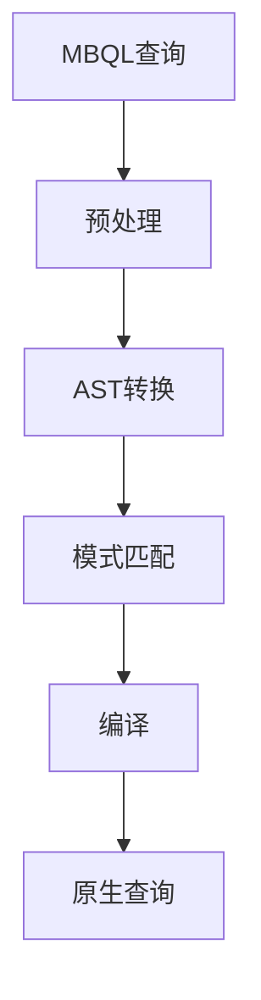
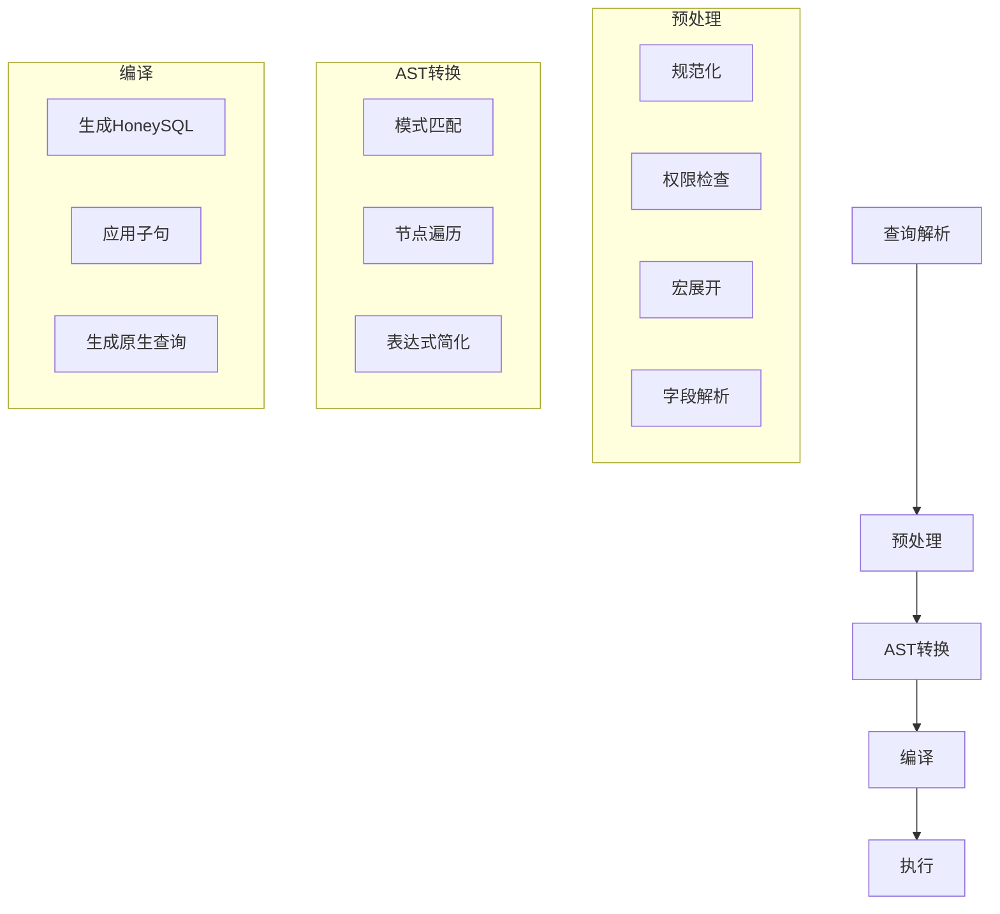
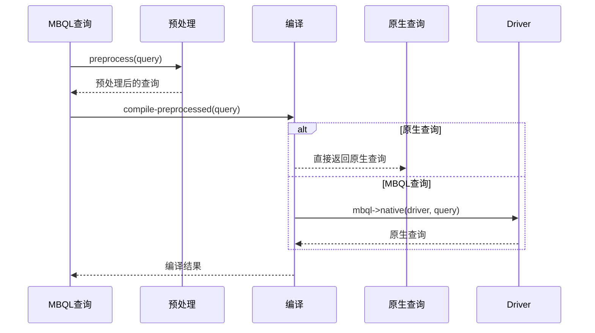
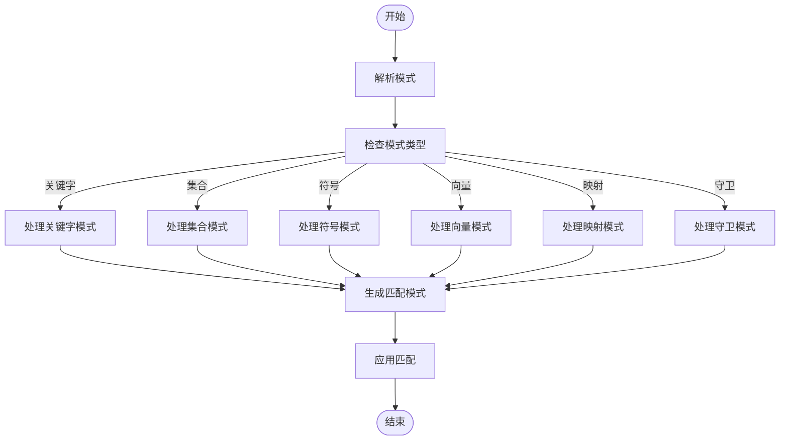
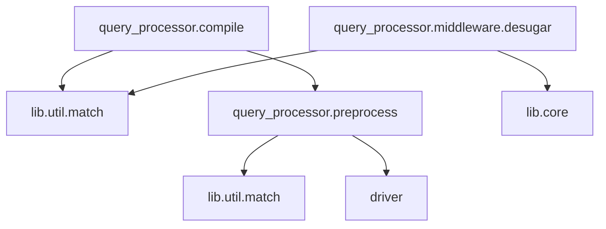

# AST转换机制

<cite>
**本文档引用的文件**
- [compile.clj](file://src/metabase/query_processor/compile.clj)
- [match.clj](file://src/metabase/lib/util/match.clj)
- [preprocess.clj](file://src/metabase/query_processor/preprocess.clj)
- [jvm.clj](file://src/metabase/lib/filter/desugar/jvm.clj)
</cite>

## 目录
1. [介绍](#介绍)
2. [项目结构](#项目结构)
3. [核心组件](#核心组件)
4. [架构概述](#架构概述)
5. [详细组件分析](#详细组件分析)
6. [依赖分析](#依赖分析)
7. [性能考虑](#性能考虑)
8. [故障排除指南](#故障排除指南)
9. [结论](#结论)

## 介绍
本文档详细解释了Metabase查询编译器的AST转换机制。重点描述了MBQL查询如何被解析为抽象语法树（AST），以及AST在编译过程中的转换规则和模式匹配机制。文档还说明了如何使用Clojure的模式匹配功能实现AST节点的遍历和转换，以及各种查询操作符对应的AST结构和转换逻辑。

## 项目结构
Metabase的查询处理器主要位于`src/metabase/query_processor`目录下，其核心功能包括查询预处理、编译、执行和后处理。查询编译器的AST转换机制主要涉及以下几个关键文件和模块：

- `query_processor/compile.clj`：负责查询的编译过程，将MBQL查询转换为原生查询
- `lib/util/match.clj`：提供模式匹配功能，用于AST节点的遍历和转换
- `query_processor/preprocess.clj`：包含查询预处理的中间件，对查询进行各种转换
- `lib/filter/desugar/jvm.clj`：包含过滤器去糖化的具体实现

**图表来源**
- [compile.clj](file://src/metabase/query_processor/compile.clj#L1-L30)
- [match.clj](file://src/metabase/lib/util/match.clj#L1-L30)

**章节来源**
- [compile.clj](file://src/metabase/query_processor/compile.clj#L1-L100)
- [match.clj](file://src/metabase/lib/util/match.clj#L1-L100)

## 核心组件
Metabase查询编译器的核心组件主要包括查询编译、模式匹配和预处理中间件。这些组件协同工作，将MBQL查询转换为可执行的原生查询。

查询编译过程从`compile.clj`文件中的`compile`函数开始，该函数首先对查询进行预处理，然后调用`compile-preprocessed`函数进行实际的编译工作。模式匹配功能由`lib/util/match.clj`文件提供，它基于Clojure的`core.match`库实现了强大的模式匹配能力。

**章节来源**
- [compile.clj](file://src/metabase/query_processor/compile.clj#L30-L80)
- [match.clj](file://src/metabase/lib/util/match.clj#L1-L50)

## 架构概述
Metabase查询编译器的架构采用分层设计，从上到下依次为：查询解析、预处理、AST转换、编译和执行。这种分层架构使得每个阶段的职责清晰，便于维护和扩展。

**图表来源**
- [compile.clj](file://src/metabase/query_processor/compile.clj#L1-L20)
- [preprocess.clj](file://src/metabase/query_processor/preprocess.clj#L1-L20)

## 详细组件分析
### 查询编译组件分析
查询编译组件负责将预处理后的MBQL查询转换为原生查询。这个过程主要由`compile.clj`文件中的`compile*`和`compile-preprocessed`函数实现。

**图表来源**
- [compile.clj](file://src/metabase/query_processor/compile.clj#L59-L80)
- [driver.clj](file://src/metabase/driver.clj#L882-L909)

### 模式匹配组件分析
模式匹配组件是AST转换的核心，它允许开发者以声明式的方式定义AST节点的转换规则。`lib/util/match.clj`文件提供了`match`和`replace`宏，这些宏基于Clojure的`core.match`库实现。

**图表来源**
- [match.clj](file://src/metabase/lib/util/match.clj#L204-L255)
- [match.clj](file://src/metabase/lib/util/match.clj#L95-L126)

### 预处理中间件分析
预处理中间件负责在编译前对查询进行各种转换和优化。这些中间件按顺序执行，每个中间件都接收一个查询并返回转换后的查询。

**图表来源**
- [preprocess.clj](file://src/metabase/query_processor/preprocess.clj#L37-L69)
- [preprocess.clj](file://src/metabase/query_processor/preprocess.clj#L92-L123)

**章节来源**
- [preprocess.clj](file://src/metabase/query_processor/preprocess.clj#L1-L158)
- [desugar.clj](file://src/metabase/query_processor/middleware/desugar.clj#L1-L27)

## 依赖分析
Metabase查询编译器的各个组件之间存在明确的依赖关系。查询编译组件依赖于模式匹配组件来实现AST转换，而预处理中间件则依赖于查询编译组件来完成最终的编译工作。

**图表来源**
- [compile.clj](file://src/metabase/query_processor/compile.clj#L1-L10)
- [match.clj](file://src/metabase/lib/util/match.clj#L1-L10)
- [preprocess.clj](file://src/metabase/query_processor/preprocess.clj#L1-L10)

**章节来源**
- [compile.clj](file://src/metabase/query_processor/compile.clj#L1-L100)
- [match.clj](file://src/metabase/lib/util/match.clj#L1-L100)
- [preprocess.clj](file://src/metabase/query_processor/preprocess.clj#L1-L158)

## 性能考虑
在设计和实现查询编译器时，需要考虑以下几个性能因素：

1. **编译时间**：复杂的查询可能需要较长的编译时间，特别是在处理大量嵌套查询时
2. **内存使用**：AST的构建和转换可能会消耗大量内存，特别是在处理大型查询时
3. **模式匹配效率**：复杂的模式匹配规则可能会影响查询编译的性能
4. **中间件链长度**：预处理中间件的数量和复杂度会影响整体性能

为了优化性能，可以采取以下措施：
- 缓存编译结果
- 优化模式匹配规则
- 减少不必要的中间件
- 使用更高效的数据结构

## 故障排除指南
在使用Metabase查询编译器时，可能会遇到以下常见问题：

1. **编译错误**：检查查询语法是否正确，确保所有必需的字段都已提供
2. **性能问题**：分析查询编译的瓶颈，优化模式匹配规则和中间件
3. **模式匹配失败**：检查模式定义是否正确，确保模式能够匹配预期的AST节点
4. **类型错误**：确保所有AST节点的类型都符合预期

**章节来源**
- [compile.clj](file://src/metabase/query_processor/compile.clj#L61-L80)
- [match.clj](file://src/metabase/lib/util/match.clj#L249-L276)

## 结论
Metabase查询编译器的AST转换机制是一个复杂而强大的系统，它通过分层架构和模块化设计实现了高效的查询编译。模式匹配功能为AST转换提供了声明式的编程接口，使得复杂的转换规则可以简洁地表达。预处理中间件链则提供了灵活的查询转换能力，可以适应各种不同的查询需求。

通过深入理解这些组件的工作原理和相互关系，开发者可以更好地利用Metabase的查询编译能力，构建更高效、更可靠的分析应用。