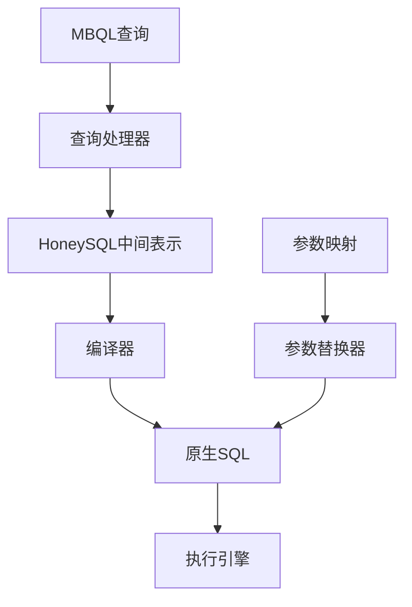
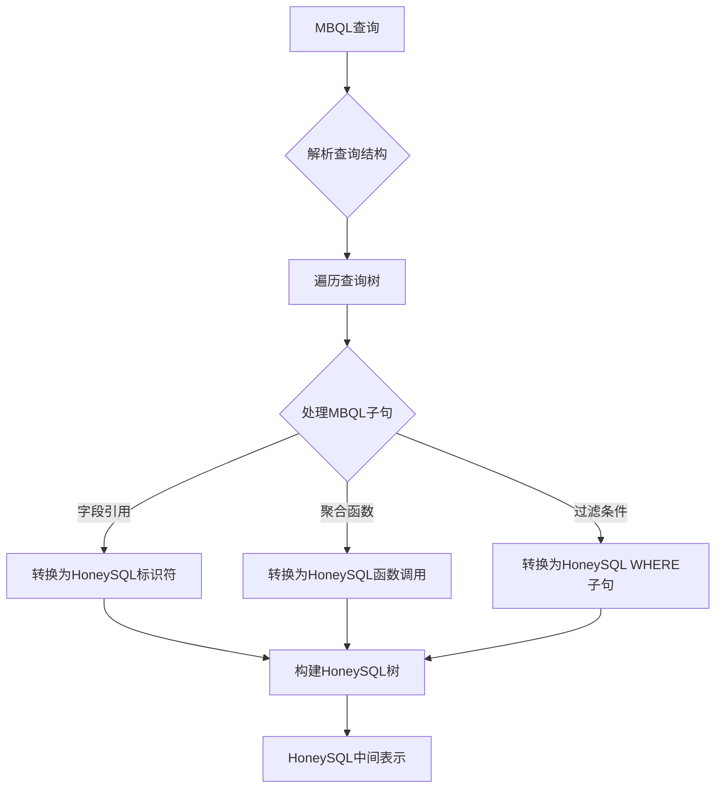
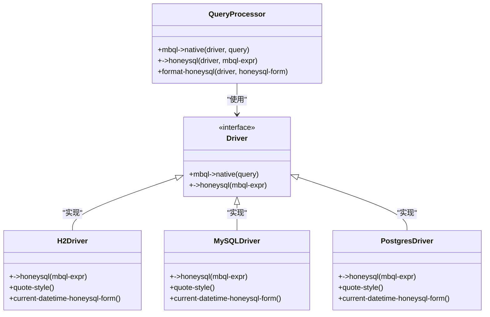
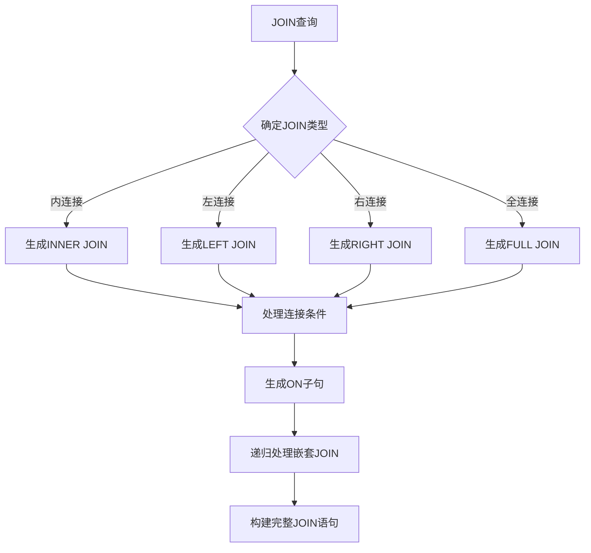
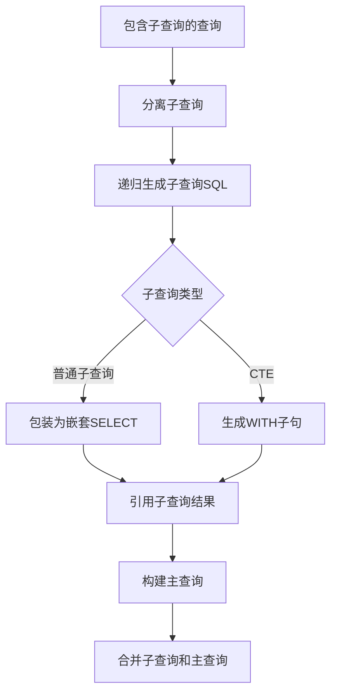
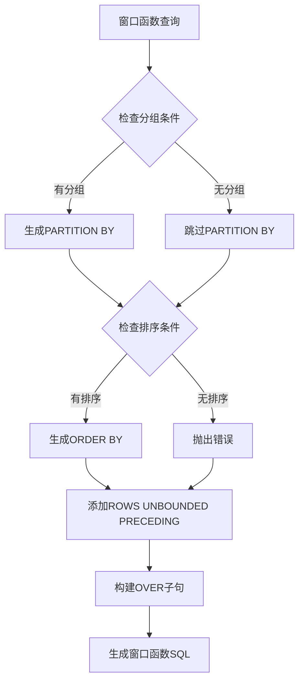
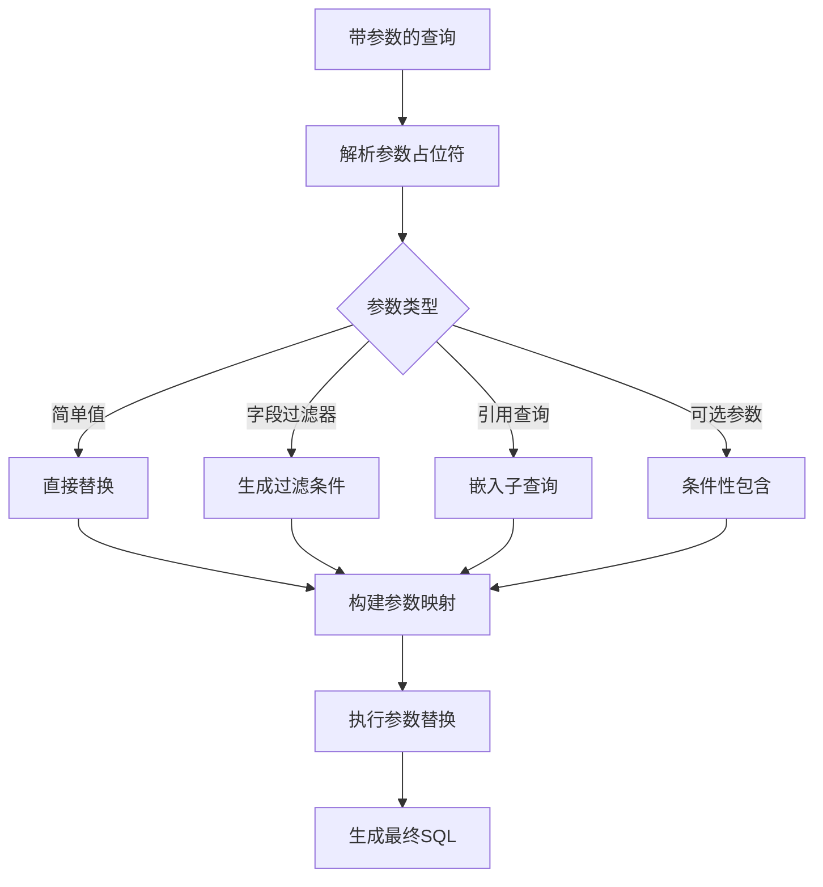
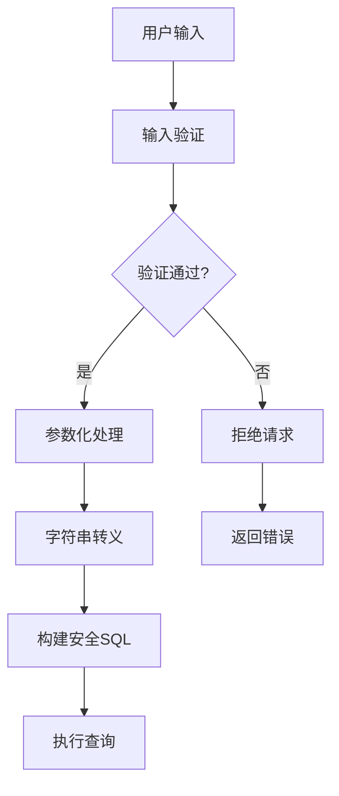
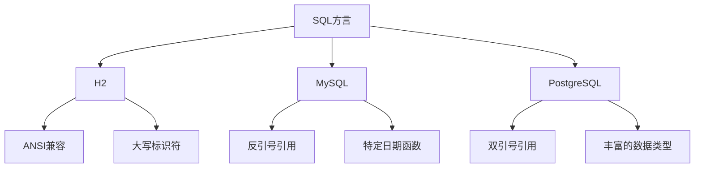
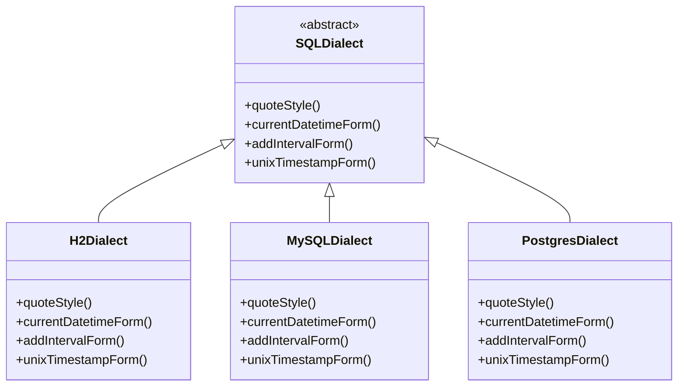

# SQL生成策略

<cite>
**本文档引用的文件**
- [query_processor.clj](file://src/metabase/driver/sql/query_processor.clj)
- [compile.clj](file://src/metabase/query_processor/compile.clj)
- [substitute.clj](file://src/metabase/driver/sql/parameters/substitute.clj)
- [h2.clj](file://src/metabase/driver/h2.clj)
- [mysql.clj](file://src/metabase/driver/mysql.clj)
- [postgres.clj](file://src/metabase/driver/postgres.clj)
- [util.clj](file://src/metabase/driver/sql/util.clj)
</cite>

## 目录
1. [引言](#引言)
2. [SQL生成架构概述](#sql生成架构概述)
3. [中间表示到SQL的转换机制](#中间表示到sql的转换机制)
4. [多态分发的SQL生成机制](#多态分发的sql生成机制)
5. 复杂SQL结构生成算法
   1. [JOIN生成算法](#join生成算法)
   2. [子查询和CTE生成](#子查询和cte生成)
   3. [窗口函数生成](#窗口函数生成)
6. [参数化查询处理](#参数化查询处理)
7. [SQL注入防护机制](#sql注入防护机制)
8. [数据库方言差异对比](#数据库方言差异对比)
9. [方言适配器工作原理](#方言适配器工作原理)
10. [结论](#结论)

## 引言
Metabase的SQL生成策略是其核心功能之一，负责将中间查询表示转换为特定数据库的原生SQL语句。该系统采用多态分发机制，根据数据库类型调用相应的驱动特定实现，确保生成的SQL语句符合目标数据库的语法和特性要求。本技术文档深入分析了SQL生成的各个方面，包括复杂SQL结构的生成算法、参数化查询处理和SQL注入防护机制。

## SQL生成架构概述
Metabase的SQL生成系统基于HoneySQL 2构建，采用分层架构设计。核心组件包括查询处理器、编译器和参数替换器。查询处理器负责将Metabase查询语言(MBQL)转换为HoneySQL形式，编译器将HoneySQL转换为原生SQL，参数替换器处理查询中的参数化部分。

**图表来源**
- [query_processor.clj](file://src/metabase/driver/sql/query_processor.clj#L0-L2093)
- [compile.clj](file://src/metabase/query_processor/compile.clj#L0-L96)

## 中间表示到SQL的转换机制
SQL生成过程始于将Metabase查询语言(MBQL)转换为HoneySQL中间表示。这一转换通过`->honeysql`多态方法实现，该方法根据查询元素的类型和数据库驱动进行分发。转换过程保持了查询的语义完整性，同时为后续的方言适配做好准备。

转换流程包括：
1. 解析MBQL查询结构
2. 递归遍历查询树
3. 将每个MBQL子句转换为对应的HoneySQL形式
4. 构建完整的HoneySQL查询树

**图表来源**
- [query_processor.clj](file://src/metabase/driver/sql/query_processor.clj#L643-L670)
- [compile.clj](file://src/metabase/query_processor/compile.clj#L79-L95)

**本节来源**
- [query_processor.clj](file://src/metabase/driver/sql/query_processor.clj#L0-L2093)

## 多态分发的SQL生成机制
Metabase采用Clojure的多态分发机制实现数据库特定的SQL生成。核心是`->honeysql`多态方法，它根据数据库驱动和MBQL子句类型进行双重分发。这种设计允许每个数据库驱动提供特定的SQL生成逻辑，同时保持核心架构的一致性。

**图表来源**
- [query_processor.clj](file://src/metabase/driver/sql/query_processor.clj#L277-L283)
- [h2.clj](file://src/metabase/driver/h2.clj#L30-L61)
- [mysql.clj](file://src/metabase/driver/mysql.clj#L405-L449)
- [postgres.clj](file://src/metabase/driver/postgres/actions.clj#L0-L141)

**本节来源**
- [query_processor.clj](file://src/metabase/driver/sql/query_processor.clj#L643-L670)
- [h2.clj](file://src/metabase/driver/h2.clj#L289-L325)

## 复杂SQL结构生成算法

### JOIN生成算法
JOIN操作的生成通过`apply-top-level-clause`多态方法实现。系统根据JOIN类型（内连接、左连接等）和连接条件生成相应的SQL语法。对于复杂的多表连接，系统会递归处理每个连接子句，确保生成正确的连接顺序和条件。

**图表来源**
- [query_processor.clj](file://src/metabase/driver/sql/query_processor.clj#L1008-L1038)
- [util.clj](file://src/metabase/driver/sql/util.clj#L0-L191)

### 子查询和CTE生成
子查询和CTE（公用表表达式）的生成采用递归处理机制。系统首先将子查询转换为独立的HoneySQL形式，然后将其嵌入到主查询中。对于CTE，系统使用`WITH`子句语法，确保生成的SQL符合目标数据库的标准。

**图表来源**
- [query_processor.clj](file://src/metabase/driver/sql/query_processor.clj#L1034-L1072)
- [util.clj](file://src/metabase/driver/sql/util.clj#L0-L191)

### 窗口函数生成
窗口函数的生成通过`window-aggregation-over-rows`和`cumulative-aggregation-over-rows`函数实现。系统根据查询中的分组和排序条件生成相应的`OVER`子句。对于累积聚合，系统会自动添加`ROWS UNBOUNDED PRECEDING`子句。

**图表来源**
- [query_processor.clj](file://src/metabase/driver/sql/query_processor.clj#L1068-L1111)
- [query_processor.clj](file://src/metabase/driver/sql/query_processor.clj#L985-L1009)

## 参数化查询处理
参数化查询处理由`substitute`函数实现，该函数负责将查询中的参数占位符替换为实际值。系统支持多种参数类型，包括简单值、字段过滤器和引用查询。处理过程确保参数值被正确转义和格式化。

**图表来源**
- [substitute.clj](file://src/metabase/driver/sql/parameters/substitute.clj#L24-L54)
- [substitute.clj](file://src/metabase/driver/sql/parameters/substitute.clj#L87-L108)

**本节来源**
- [substitute.clj](file://src/metabase/driver/sql/parameters/substitute.clj#L0-L109)

## SQL注入防护机制
Metabase通过多层次机制防止SQL注入攻击。核心策略包括使用参数化查询、输入验证和安全的字符串转义。系统禁止直接拼接用户输入到SQL语句中，所有动态内容都通过安全的参数化接口处理。

防护机制包括：
1. 参数化查询：使用预处理语句和参数占位符
2. 输入验证：验证参数类型和格式
3. 字符串转义：对特殊字符进行安全转义
4. 白名单控制：限制可执行的SQL操作类型

**图表来源**
- [substitute.clj](file://src/metabase/driver/sql/parameters/substitute.clj#L24-L54)
- [h2.clj](file://src/metabase/driver/h2.clj#L507-L533)

## 数据库方言差异对比
不同数据库在SQL语法和特性上存在显著差异。Metabase通过方言适配器处理这些差异，确保生成的SQL语句符合目标数据库的要求。主要差异包括标识符引用、日期函数和数据类型。

| 特性 | H2 | MySQL | PostgreSQL |
|------|-----|-------|------------|
| 标识符引用 | "IDENTIFIER" | `identifier` | "identifier" |
| 当前时间 | NOW() | NOW() | NOW() |
| 日期加法 | TIMESTAMPADD | DATE_ADD | + INTERVAL |
| 布尔类型 | BOOLEAN | BOOL | BOOLEAN |
| JSON支持 | JSON | JSON | JSON |

**图表来源**
- [h2.clj](file://src/metabase/driver/h2.clj#L455-L482)
- [mysql.clj](file://src/metabase/driver/mysql/actions.clj#L0-L234)
- [postgres.clj](file://src/metabase/driver/postgres/actions.clj#L0-L141)

**本节来源**
- [h2.clj](file://src/metabase/driver/h2.clj#L156-L179)
- [mysql.clj](file://src/metabase/driver/mysql.clj#L409-L449)
- [postgres.clj](file://src/metabase/driver/postgres/actions.clj#L0-L141)

## 方言适配器工作原理
方言适配器是Metabase SQL生成系统的核心组件，负责处理数据库特定的语法和特性差异。适配器通过继承和重写基类方法来提供特定数据库的实现，同时保持接口的一致性。

适配器工作流程：
1. 检测目标数据库类型
2. 加载相应的方言适配器
3. 应用数据库特定的转换规则
4. 生成符合方言要求的SQL语句

**图表来源**
- [query_processor.clj](file://src/metabase/driver/sql/query_processor.clj#L468-L495)
- [h2.clj](file://src/metabase/driver/h2.clj#L320-L354)
- [mysql.clj](file://src/metabase/driver/mysql.clj#L551-L551)
- [postgres.clj](file://src/metabase/driver/postgres/actions.clj#L0-L141)

**本节来源**
- [query_processor.clj](file://src/metabase/driver/sql/query_processor.clj#L1880-L1910)
- [h2.clj](file://src/metabase/driver/h2.clj#L407-L411)

## 结论
Metabase的SQL生成策略采用先进的多态分发架构，有效处理了不同数据库方言的复杂性。通过将中间表示转换为特定数据库的原生SQL语句，系统实现了高度的灵活性和可扩展性。基于多态分发的机制允许轻松添加新的数据库支持，而复杂的SQL结构生成算法确保了查询的准确性和性能。参数化查询处理和SQL注入防护机制共同保障了系统的安全性。整体架构设计体现了良好的分层和模块化原则，为数据分析应用提供了可靠的SQL生成能力。