# 方言处理机制

<cite>
**本文档引用的文件**
- [query_processor.clj](file://src/metabase/driver/sql/query_processor.clj)
- [honey_sql_2.clj](file://src/metabase/util/honey_sql_2.clj)
- [normalize.clj](file://src/metabase/driver/sql/normalize.clj)
- [util.clj](file://src/metabase/driver/sql/util.clj)
- [h2.clj](file://src/metabase/driver/h2.clj)
- [mysql.clj](file://src/metabase/driver/mysql.clj)
- [postgres.clj](file://src/metabase/driver/postgres.clj)
</cite>

## 目录
1. [引言](#引言)
2. [方言适配层架构设计](#方言适配层架构设计)
3. [SQL语法差异处理](#sql语法差异处理)
4. [Honey SQL在方言抽象中的作用](#honey-sql在方言抽象中的作用)
5. [SQL规范化过程](#sql规范化过程)
6. [添加新数据库方言支持指南](#添加新数据库方言支持指南)
7. [最佳实践](#最佳实践)
8. [结论](#结论)

## 引言
Metabase是一个开源的数据分析平台，支持连接多种数据库系统。为了实现跨数据库的查询兼容性，Metabase采用了复杂的方言处理机制来应对不同数据库之间的SQL语法差异。本文档详细解释了Metabase如何通过协议和多态分发实现数据库特定行为的定制，以及如何利用Honey SQL进行方言抽象。

Metabase的核心设计理念是将用户友好的查询语言（MBQL）转换为特定数据库可以理解的原生SQL语句。这个过程中最关键的部分就是处理不同数据库的SQL方言差异，包括标识符引用、数据类型映射、函数名称转换等。Metabase通过一个精心设计的分层架构实现了这一目标，使得系统能够灵活地支持各种数据库类型。

## 方言适配层架构设计

Metabase的方言处理机制建立在一个基于协议和多态分发的架构之上。这种设计允许系统以模块化的方式处理不同数据库的特性，同时保持代码的可维护性和扩展性。

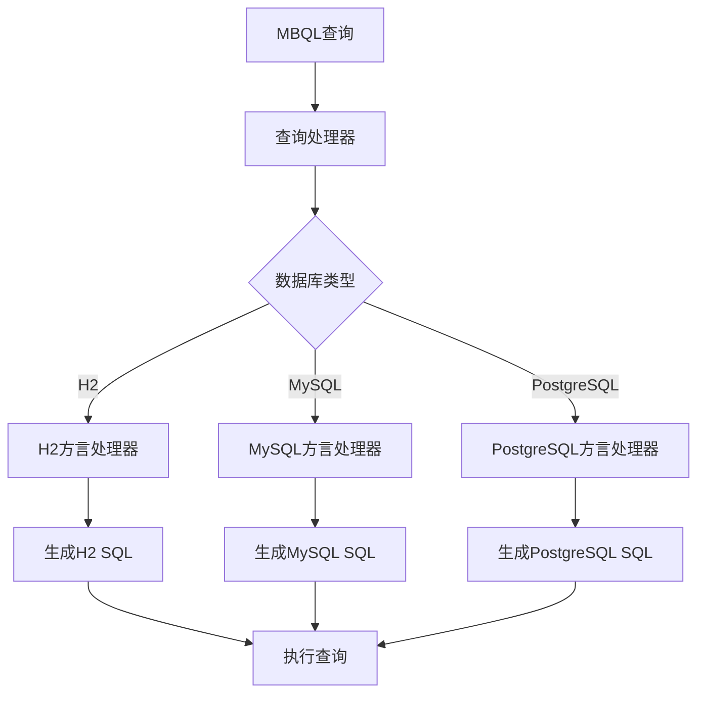

**图表来源**
- [query_processor.clj](file://src/metabase/driver/sql/query_processor.clj#L92-L134)
- [h2.clj](file://src/metabase/driver/h2.clj#L184-L205)
- [mysql.clj](file://src/metabase/driver/mysql.clj#L145-L168)
- [postgres.clj](file://src/metabase/driver/postgres.clj#L145-L168)

该架构的核心是`->honeysql`多态函数，它根据数据库类型和查询元素的组合进行分发。每个数据库驱动程序都可以重写这个函数的特定方法来实现自定义行为。例如，H2数据库需要将表名转换为大写，而MySQL使用反引号进行标识符引用。

**章节来源**
- [query_processor.clj](file://src/metabase/driver/sql/query_processor.clj#L275-L307)
- [honey_sql_2.clj](file://src/metabase/util/honey_sql_2.clj#L37-L69)

## SQL语法差异处理

Metabase通过一系列专门的机制来处理不同数据库的SQL语法差异，主要包括标识符引用、数据类型映射和函数名称转换三个方面。

### 标识符引用处理
不同的数据库系统对标识符的引用有不同的规则：
- H2数据库要求标识符大写并用双引号包围
- MySQL使用反引号进行引用
- PostgreSQL默认使用双引号，但对大小写敏感

Metabase通过`quote-style`多态函数来确定当前数据库的引用风格，并在生成SQL时应用相应的规则。例如，在H2驱动程序中，系统会注册一个特殊的方言，该方言在引用标识符时会自动将其转换为大写：

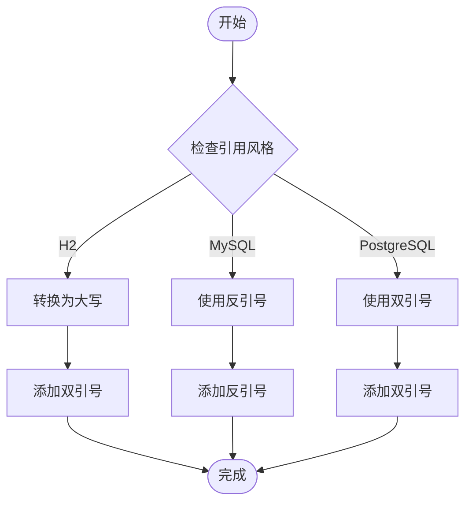

**图表来源**
- [honey_sql_2.clj](file://src/metabase/util/honey_sql_2.clj#L37-L69)
- [util.clj](file://src/metabase/driver/sql/util.clj#L28-L54)

### 数据类型映射
Metabase定义了一套通用的数据类型系统，并通过`base-type->db-type-grammar`映射将这些类型转换为特定数据库的对应类型。例如：

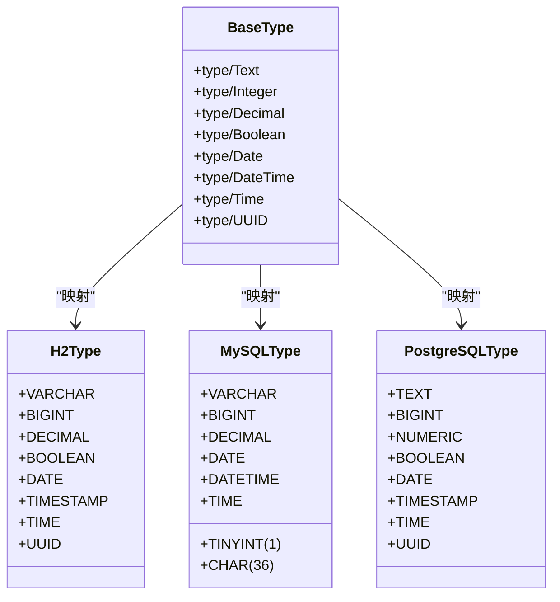

**图表来源**
- [h2.clj](file://src/metabase/driver/h2.clj#L480-L509)
- [mysql.clj](file://src/metabase/driver/mysql.clj#L197-L220)
- [postgres.clj](file://src/metabase/driver/postgres.clj#L197-L220)

### 函数名称转换
不同数据库对相同功能的函数可能有不同的命名。Metabase通过`->honeysql`多态函数的特定实现来处理这些差异。例如，正则表达式匹配函数在不同数据库中的实现：

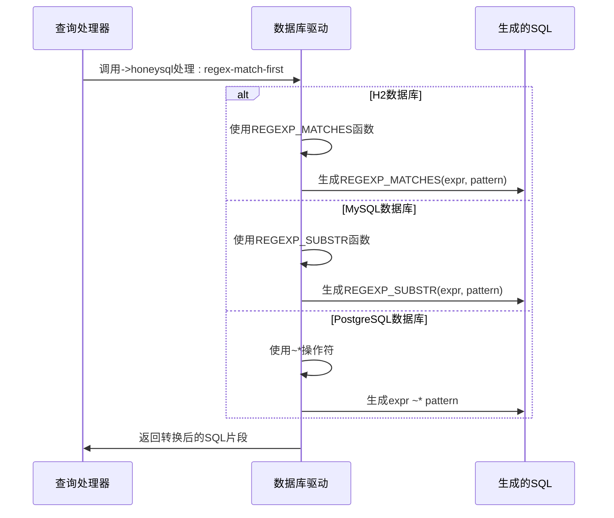

**图表来源**
- [query_processor.clj](file://src/metabase/driver/sql/query_processor.clj#L468-L495)
- [h2.clj](file://src/metabase/driver/h2.clj#L197-L220)
- [mysql.clj](file://src/metabase/driver/mysql.clj#L197-L220)
- [postgres.clj](file://src/metabase/driver/postgres.clj#L197-L220)

**章节来源**
- [query_processor.clj](file://src/metabase/driver/sql/query_processor.clj#L468-L495)
- [normalize.clj](file://src/metabase/driver/sql/normalize.clj#L0-L37)

## Honey SQL在方言抽象中的作用

Honey SQL是Metabase中用于SQL抽象的核心库，它提供了一个Clojure风格的DSL来构建SQL查询。Honey SQL在方言处理中扮演着至关重要的角色，主要体现在以下几个方面：

### 抽象语法树构建
Honey SQL允许Metabase将MBQL查询转换为一个抽象语法树（AST），然后再根据目标数据库的方言将其序列化为具体的SQL语句。这种中间表示层使得系统可以灵活地处理不同数据库的语法差异。

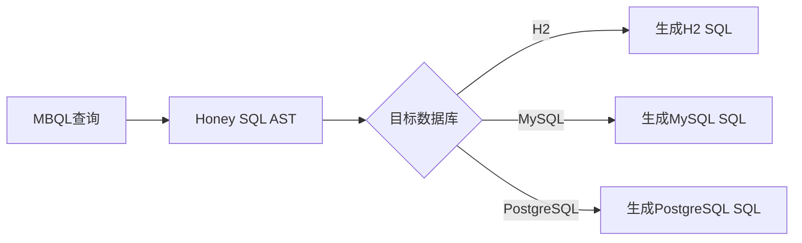

### 方言注册机制
Honey SQL提供了灵活的方言注册机制，允许Metabase为每个支持的数据库注册特定的方言配置。这些配置包括：
- 标识符引用规则
- 关键字大小写约定
- 特殊字符处理
- 子句排序规则

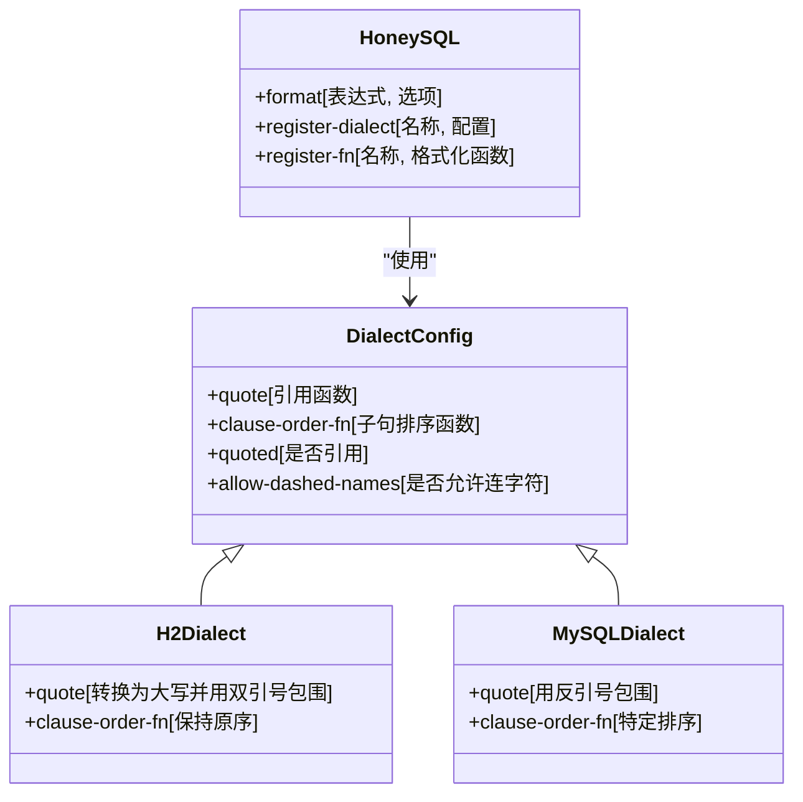

**图表来源**
- [honey_sql_2.clj](file://src/metabase/util/honey_sql_2.clj#L37-L69)
- [util.clj](file://src/metabase/driver/sql/util.clj#L134-L160)

### 自定义函数注册
Honey SQL允许注册自定义的SQL函数，这对于处理数据库特定的功能非常重要。Metabase利用这一特性来实现跨数据库的函数抽象：

```clojure
(sql/register-fn! ::percentile-cont #'format-percentile-cont)
(sql/register-fn! ::extract #'format-extract)
(sql/register-fn! ::compiled #'format-compiled)
```

这些注册的函数可以在生成SQL时被调用，确保生成的SQL语句符合目标数据库的语法要求。

**章节来源**
- [honey_sql_2.clj](file://src/metabase/util/honey_sql_2.clj#L97-L142)
- [query_processor.clj](file://src/metabase/driver/sql/query_processor.clj#L275-L307)

## SQL规范化过程

Metabase的SQL规范化过程是一个多层次的转换流程，旨在将用户友好的查询转换为高效、安全且符合目标数据库规范的SQL语句。

### 名称规范化
Metabase通过`normalize-name`函数来处理表名和列名的规范化，考虑了不同数据库的命名规则：

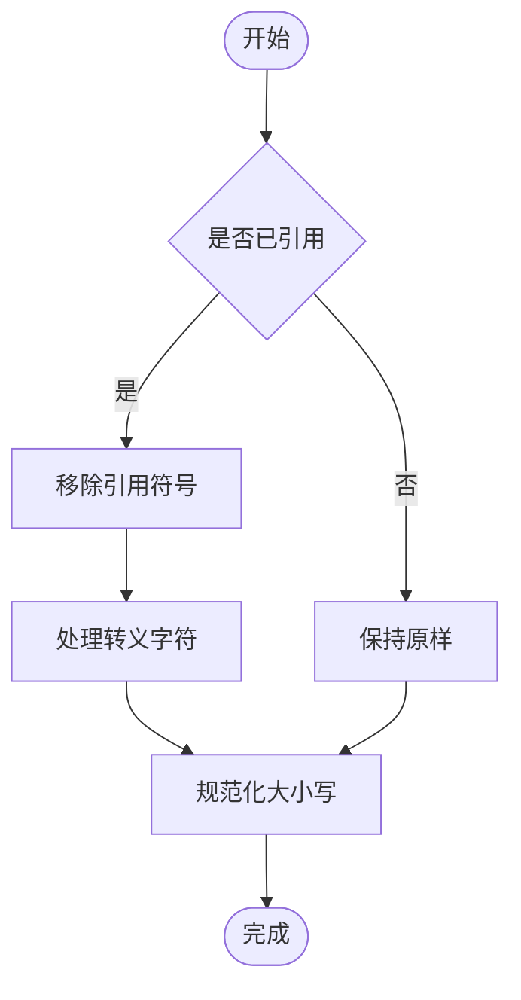

对于未引用的名称，系统会根据数据库类型应用不同的大小写规则：
- H2和Oracle：转换为大写
- MySQL：保持原样或根据配置
- PostgreSQL：转换为小写

**图表来源**
- [normalize.clj](file://src/metabase/driver/sql/normalize.clj#L0-L37)
- [honey_sql_2.clj](file://src/metabase/util/honey_sql_2.clj#L37-L69)

### 保留字处理
某些标识符可能是特定数据库的保留字或字面量值。Metabase通过`reserved-literal`多态函数来检测和处理这种情况：

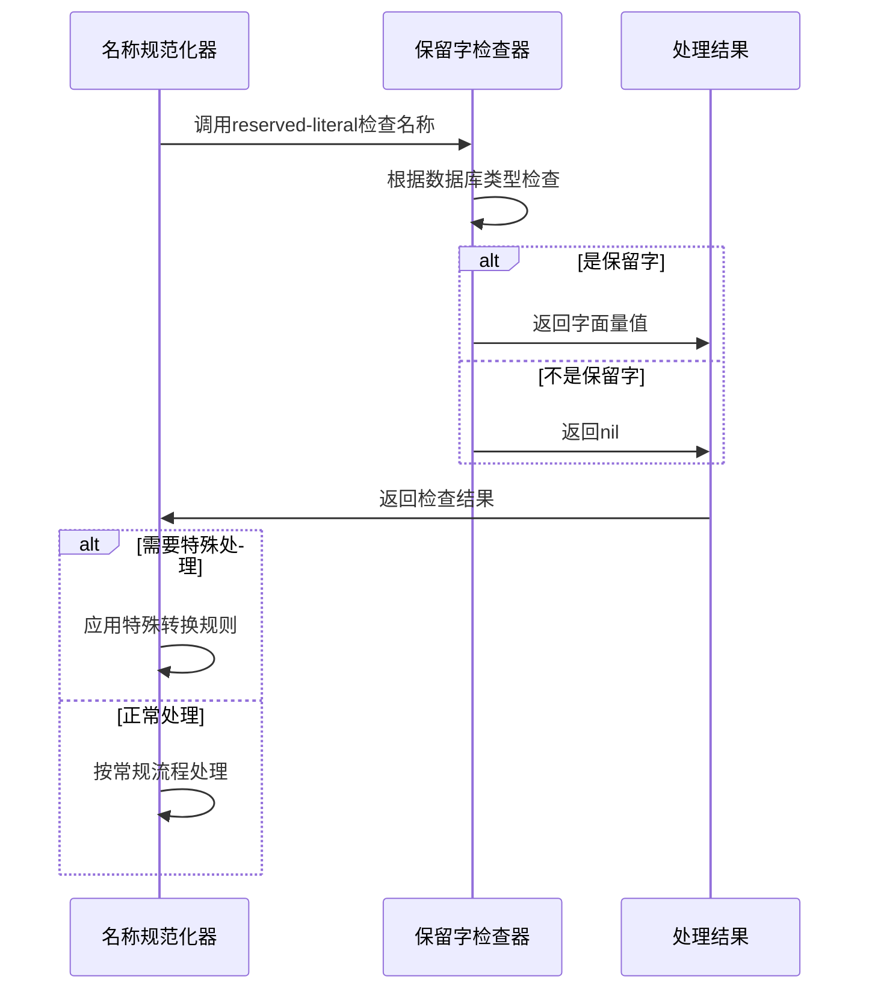

例如，"true"和"false"在SQL中通常是布尔字面量，而不是普通的标识符名称。

**图表来源**
- [normalize.clj](file://src/metabase/driver/sql/normalize.clj#L35-L51)
- [query_processor.clj](file://src/metabase/driver/sql/query_processor.clj#L468-L495)

### 参数化查询处理
为了防止SQL注入攻击，Metabase对用户输入的参数进行严格的处理：

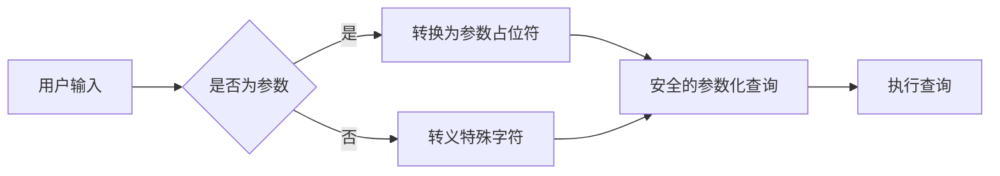

系统使用`fix-sql-params`函数来修复参数化值的格式，确保它们在生成的SQL中正确显示。

**章节来源**
- [util.clj](file://src/metabase/driver/sql/util.clj#L134-L160)
- [normalize.clj](file://src/metabase/driver/sql/normalize.clj#L0-L37)

## 添加新数据库方言支持指南

为Metabase添加新的数据库方言支持需要遵循一系列步骤，确保新驱动程序能够正确处理SQL语法差异。

### 基本步骤
1. 创建新的驱动程序文件
2. 注册驱动程序并设置父类
3. 实现必要的多态方法
4. 注册特定的Honey SQL方言
5. 测试和验证

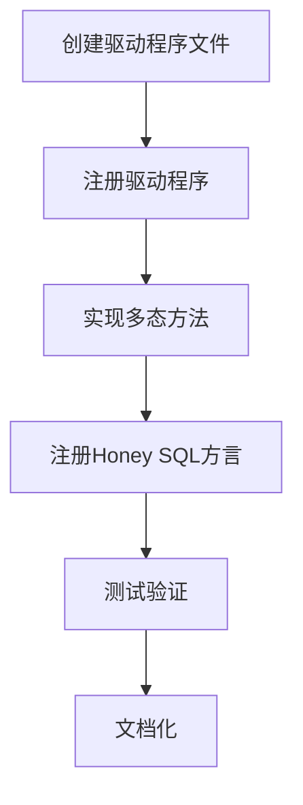

### 关键实现要点
#### 驱动程序注册
使用`driver/register!`宏来注册新的驱动程序：

```clojure
(driver/register! :new-db, :parent :sql-jdbc)
```

这会将新驱动程序添加到驱动程序层次结构中，并继承父类的基本功能。

#### 多态方法实现
需要实现的关键多态方法包括：
- `quote-style`：定义标识符引用风格
- `->honeysql`：处理特定的SQL语法转换
- `normalize-unquoted-name`：处理未引用名称的规范化
- `reserved-literal`：处理保留字和字面量

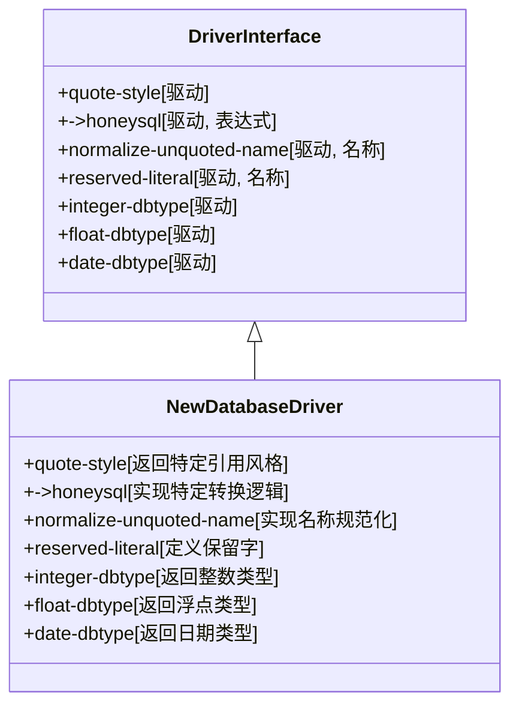

**图表来源**
- [query_processor.clj](file://src/metabase/driver/sql/query_processor.clj#L468-L495)
- [normalize.clj](file://src/metabase/driver/sql/normalize.clj#L0-L37)
- [honey_sql_2.clj](file://src/metabase/util/honey_sql_2.clj#L37-L69)

#### Honey SQL方言注册
为新数据库注册特定的Honey SQL方言：

```clojure
(sql/register-dialect!
 :new-db
 (update (sql/get-dialect :ansi) :quote (fn [quote]
                                          ;; 自定义引用逻辑
                                          )))
```

这确保了生成的SQL语句符合新数据库的语法要求。

**章节来源**
- [honey_sql_2.clj](file://src/metabase/util/honey_sql_2.clj#L37-L69)
- [query_processor.clj](file://src/metabase/driver/sql/query_processor.clj#L468-L495)

## 最佳实践

在实现和使用Metabase的方言处理机制时，应遵循以下最佳实践：

### 性能优化
- 尽量减少运行时的字符串操作
- 使用缓存来存储频繁使用的转换结果
- 避免在循环中进行昂贵的正则表达式匹配

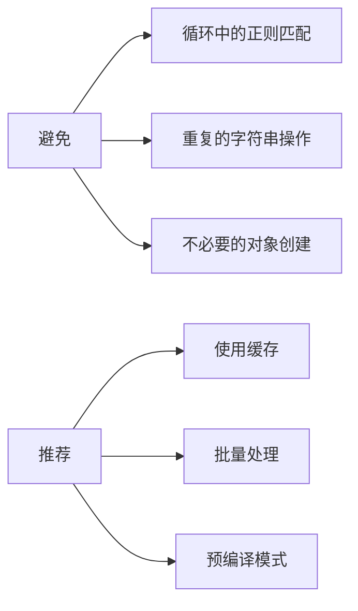

### 安全性考虑
- 始终对用户输入进行验证和转义
- 使用参数化查询而不是字符串拼接
- 限制可以执行的SQL语句类型

### 可维护性
- 保持代码的模块化和可测试性
- 提供详细的文档和示例
- 遵循一致的命名约定和代码风格

## 结论
Metabase的方言处理机制通过一个精心设计的分层架构，成功地解决了跨数据库查询的兼容性问题。该机制的核心是基于协议和多态分发的设计模式，结合Honey SQL的强大抽象能力，实现了灵活而高效的SQL方言转换。

通过`->honeysql`多态函数、`quote-style`引用风格管理和`normalize-name`名称规范化等一系列机制，Metabase能够准确地处理不同数据库之间的语法差异，包括标识符引用、数据类型映射和函数名称转换等关键方面。

为新数据库添加方言支持的过程清晰而规范，开发者只需要实现必要的多态方法并注册相应的Honey SQL方言即可。这种设计不仅保证了系统的可扩展性，也确保了代码的可维护性和一致性。

未来的发展方向可能包括进一步优化性能、增强安全性特性，以及支持更多新兴的数据库系统。随着数据生态系统的不断演进，Metabase的方言处理机制将继续发挥其关键作用，为用户提供无缝的跨数据库分析体验。