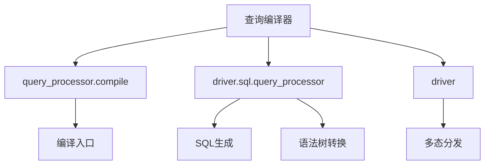
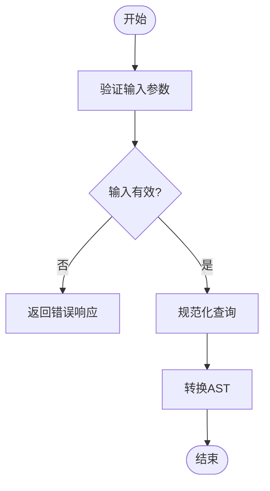
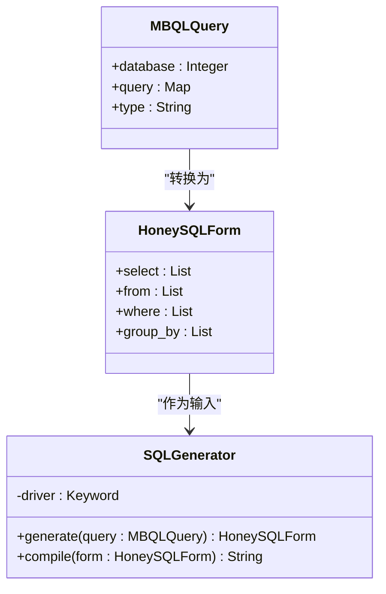
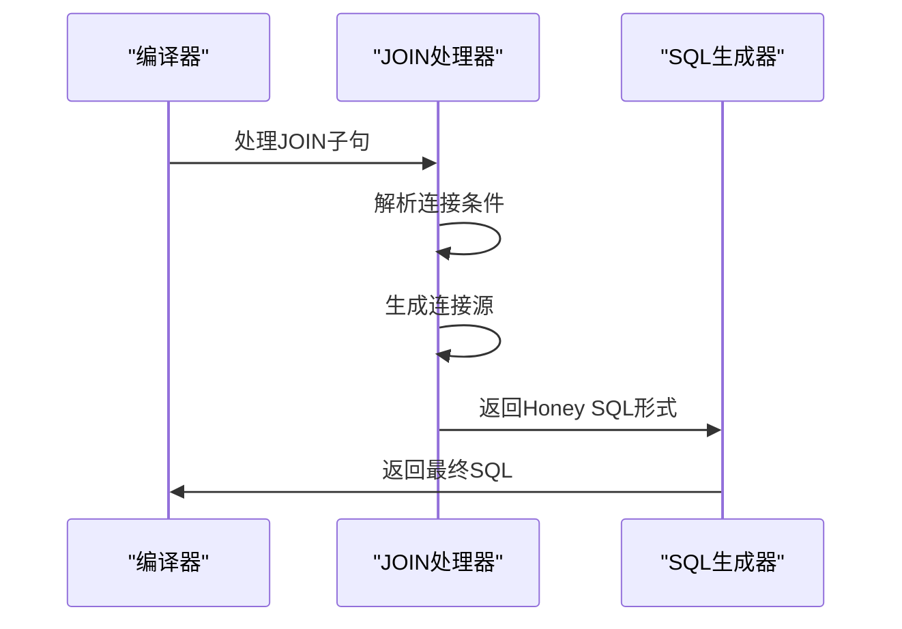
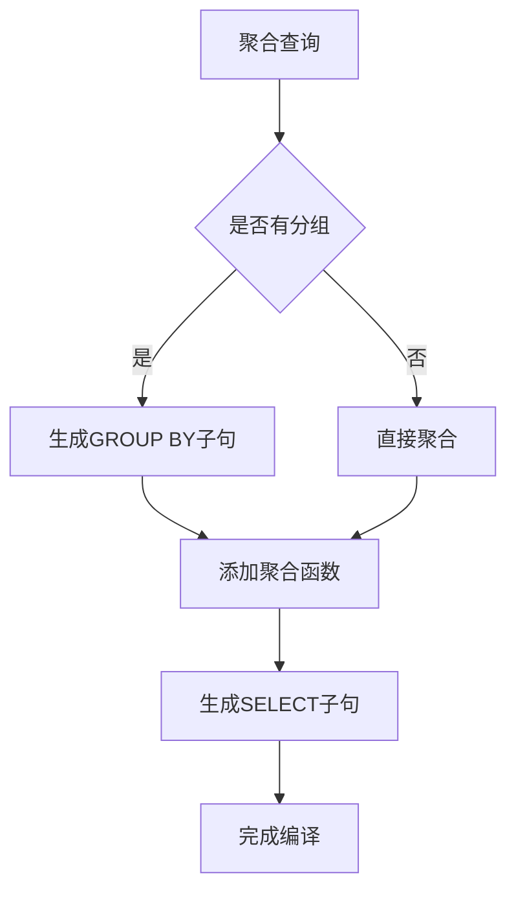
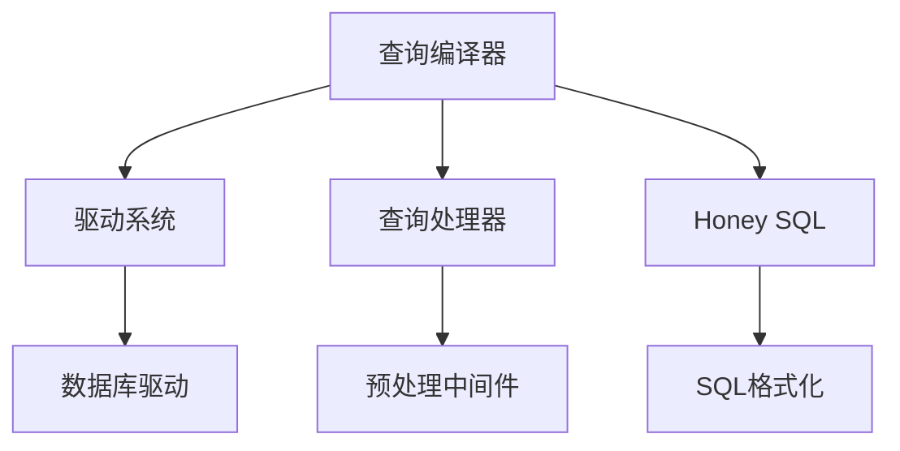

# 查询编译器

<cite>
**本文档引用的文件**
- [compile.clj](file://src/metabase/query_processor/compile.clj)
- [query_processor.clj](file://src/metabase/driver/sql/query_processor.clj)
- [sql.clj](file://src/metabase/driver/sql.clj)
- [driver.clj](file://src/metabase/driver.clj)
</cite>

## 目录
1. [简介](#简介)
2. [项目结构](#项目结构)
3. [核心组件](#核心组件)
4. [架构概述](#架构概述)
5. [详细组件分析](#详细组件分析)
6. [依赖分析](#依赖分析)
7. [性能考量](#性能考量)
8. [故障排除指南](#故障排除指南)
9. [结论](#结论)

## 简介
本文档深入解析Metabase查询编译器的技术实现，重点阐述MBQL查询到原生SQL的编译过程。文档涵盖查询规范化、语法树转换和SQL生成等核心阶段，详细说明编译器如何通过多态分发机制处理不同数据库方言的差异。同时，文档分析了JOIN、聚合、过滤等复杂查询结构的编译策略，以及为新数据库类型添加编译支持的扩展机制。

## 项目结构
Metabase查询编译器的核心功能分布在多个命名空间中，主要位于`src/metabase/query_processor`和`src/metabase/driver/sql`目录下。编译器采用模块化设计，将查询处理的不同阶段分离到独立的组件中。

**Diagram sources**
- [compile.clj](file://src/metabase/query_processor/compile.clj)
- [query_processor.clj](file://src/metabase/driver/sql/query_processor.clj)
- [sql.clj](file://src/metabase/driver/sql.clj)

**Section sources**
- [compile.clj](file://src/metabase/query_processor/compile.clj)
- [query_processor.clj](file://src/metabase/driver/sql/query_processor.clj)

## 核心组件
查询编译器的核心组件包括编译入口、语法树转换器和SQL生成器。编译入口负责协调整个编译过程，语法树转换器将MBQL查询转换为Honey SQL数据结构，SQL生成器则将Honey SQL转换为特定数据库的原生SQL。

**Section sources**
- [compile.clj](file://src/metabase/query_processor/compile.clj)
- [query_processor.clj](file://src/metabase/driver/sql/query_processor.clj)

## 架构概述
Metabase查询编译器采用分层架构，将查询处理过程分为多个阶段。每个阶段都有明确的职责，通过函数式编程的方式将各个阶段连接起来。

**Diagram sources**
- [compile.clj](file://src/metabase/query_processor/compile.clj)
- [query_processor.clj](file://src/metabase/driver/sql/query_processor.clj)

## 详细组件分析

### 编译过程分析
查询编译器的编译过程可以分为三个主要阶段：查询规范化、语法树转换和SQL生成。每个阶段都有特定的函数负责处理。

#### 查询规范化

**Diagram sources**
- [compile.clj](file://src/metabase/query_processor/compile.clj)

#### 语法树转换

**Diagram sources**
- [query_processor.clj](file://src/metabase/driver/sql/query_processor.clj)

### 复杂查询结构编译策略
编译器对JOIN、聚合、过滤等复杂查询结构有专门的处理策略。

#### JOIN编译策略

**Diagram sources**
- [query_processor.clj](file://src/metabase/driver/sql/query_processor.clj)

#### 聚合编译策略

**Diagram sources**
- [query_processor.clj](file://src/metabase/driver/sql/query_processor.clj)

## 依赖分析
查询编译器依赖于多个核心组件，包括驱动系统、查询处理器和Honey SQL库。这些依赖关系通过多态分发机制进行管理。

**Diagram sources**
- [driver.clj](file://src/metabase/driver.clj)
- [query_processor.clj](file://src/metabase/driver/sql/query_processor.clj)

**Section sources**
- [driver.clj](file://src/metabase/driver.clj)
- [query_processor.clj](file://src/metabase/driver/sql/query_processor.clj)

## 性能考量
查询编译器在设计时考虑了性能优化，通过缓存编译结果、避免重复编译等方式提高查询处理效率。

**Section sources**
- [compile.clj](file://src/metabase/query_processor/compile.clj)

## 故障排除指南
当查询编译出现问题时，可以通过检查编译器日志、验证查询语法和检查驱动实现来定位问题。

**Section sources**
- [compile.clj](file://src/metabase/query_processor/compile.clj)
- [query_processor.clj](file://src/metabase/driver/sql/query_processor.clj)

## 结论
Metabase查询编译器是一个功能强大且灵活的系统，能够将MBQL查询高效地转换为各种数据库的原生SQL。通过多态分发机制和模块化设计，编译器能够轻松扩展以支持新的数据库类型和查询功能。