# 查询编译管道

<cite>
**本文档中引用的文件**
- [pipeline.clj](file://src/metabase/query_processor/pipeline.clj)
- [preprocess.clj](file://src/metabase/query_processor/preprocess.clj)
- [compile.clj](file://src/metabase/query_processor/compile.clj)
- [query_processor.clj](file://src/metabase/query_processor.clj)
- [normalize_query.clj](file://src/metabase/query_processor/middleware/normalize_query.clj)
- [parameters.clj](file://src/metabase/query_processor/middleware/parameters.clj)
- [resolve_fields.clj](file://src/metabase/query_processor/middleware/resolve_fields.clj)
- [error_type.clj](file://src/metabase/query_processor/error_type.clj)
- [setup.clj](file://src/metabase/query_processor/setup.clj)
- [catch_exceptions.clj](file://src/metabase/query_processor/middleware/catch_exceptions.clj)
- [query_processor.clj](file://src/metabase/driver/sql/query_processor.clj)
</cite>

## 目录
1. [简介](#简介)
2. [系统架构概览](#系统架构概览)
3. [查询编译管道核心组件](#查询编译管道核心组件)
4. [预处理阶段详解](#预处理阶段详解)
5. [中间表示转换](#中间表示转换)
6. [SQL生成阶段](#SQL生成阶段)
7. [错误处理机制](#错误处理机制)
8. [执行时序图](#执行时序图)
9. [性能优化考虑](#性能优化考虑)
10. [故障排除指南](#故障排除指南)
11. [总结](#总结)

## 简介

Metabase查询编译管道是一个复杂而精密的系统，负责将用户提交的MBQL（Metabase Query Language）查询转换为可执行的原生SQL语句。该管道采用分层架构设计，通过多个处理阶段逐步将高级查询语言转换为数据库可理解的原生查询格式。

查询编译管道的核心目标是：
- 将MBQL查询标准化为统一的内部表示
- 解析字段引用和表关联关系
- 处理参数替换和模板标签
- 生成高效的原生SQL查询
- 提供完善的错误处理和异常传播机制

## 系统架构概览

查询编译管道采用中间件模式，通过一系列有序的处理步骤完成查询转换。整个系统分为三个主要阶段：预处理、编译和执行。

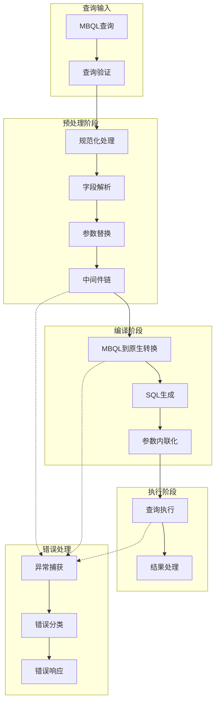

**图表来源**
- [query_processor.clj](file://src/metabase/query_processor.clj#L24-L52)
- [pipeline.clj](file://src/metabase/query_processor/pipeline.clj#L0-L129)

**章节来源**
- [query_processor.clj](file://src/metabase/query_processor.clj#L1-L116)
- [pipeline.clj](file://src/metabase/query_processor/pipeline.clj#L1-L129)

## 查询编译管道核心组件

### 主要入口点

查询编译管道的主要入口点是`process-query`函数，它协调整个编译流程：

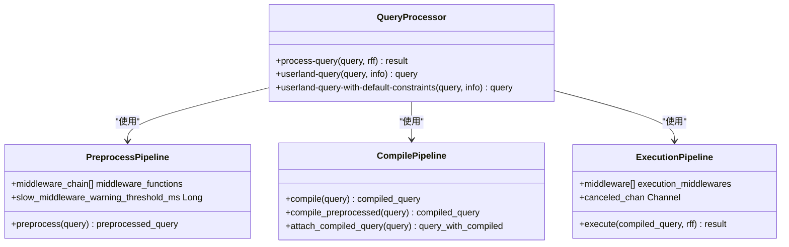

**图表来源**
- [query_processor.clj](file://src/metabase/query_processor.clj#L60-L116)
- [preprocess.clj](file://src/metabase/query_processor/preprocess.clj#L120-L158)
- [compile.clj](file://src/metabase/query_processor/compile.clj#L59-L96)

### 中间件机制

查询编译管道采用强大的中间件机制，通过函数组合实现模块化处理：

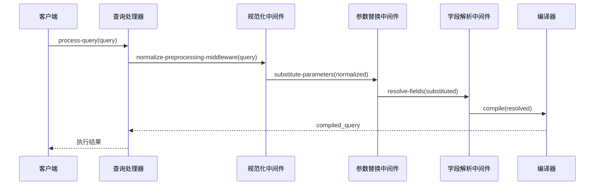

**图表来源**
- [preprocess.clj](file://src/metabase/query_processor/preprocess.clj#L45-L120)
- [normalize_query.clj](file://src/metabase/query_processor/middleware/normalize_query.clj#L20-L33)
- [parameters.clj](file://src/metabase/query_processor/middleware/parameters.clj#L130-L147)

**章节来源**
- [query_processor.clj](file://src/metabase/query_processor.clj#L24-L52)
- [preprocess.clj](file://src/metabase/query_processor/preprocess.clj#L45-L158)

## 预处理阶段详解

预处理阶段是查询编译管道的第一个关键阶段，负责将原始MBQL查询转换为标准化的内部表示。该阶段包含45个不同的中间件，每个中间件负责特定的处理任务。

### 预处理中间件栈

预处理中间件按照严格的顺序执行，确保查询在每个阶段都处于正确的状态：

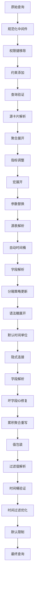

**图表来源**
- [preprocess.clj](file://src/metabase/query_processor/preprocess.clj#L45-L65)

### 字段解析机制

字段解析是预处理阶段的核心功能之一，负责将查询中的字段引用解析为具体的数据库列：

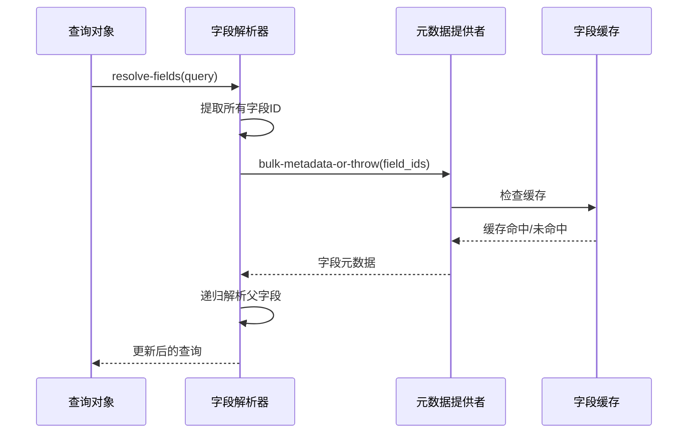

**图表来源**
- [resolve_fields.clj](file://src/metabase/query_processor/middleware/resolve_fields.clj#L15-L37)

### 参数替换逻辑

参数替换中间件处理查询中的参数占位符，支持多种参数类型和作用域：

| 参数类型 | 描述 | 示例 |
|---------|------|------|
| 顶级参数 | 直接在查询级别定义的参数 | `{:parameters [{:name "date" :type "date"}]}` |
| 模板标签 | 原生SQL中的参数标记 | `{{param_name}}` |
| 时间单位参数 | 影响时间桶操作的参数 | `{:temporal-unit "month"}` |
| 条件参数 | 控制查询条件的参数 | `{:condition "enabled"}` |

**章节来源**
- [preprocess.clj](file://src/metabase/query_processor/preprocess.clj#L45-L158)
- [resolve_fields.clj](file://src/metabase/query_processor/middleware/resolve_fields.clj#L1-L37)
- [parameters.clj](file://src/metabase/query_processor/middleware/parameters.clj#L1-L147)

## 中间表示转换

中间表示转换阶段将标准化的MBQL查询转换为驱动程序可理解的内部形式。这一阶段的关键是将查询结构转换为适合不同数据库驱动程序的格式。

### 规范化处理

规范化中间件确保查询符合MBQL 5标准，并进行必要的格式转换：

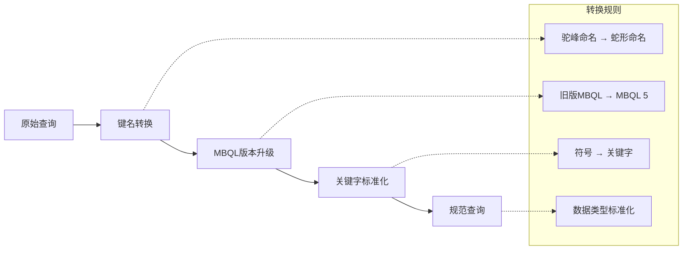

**图表来源**
- [normalize_query.clj](file://src/metabase/query_processor/middleware/normalize_query.clj#L15-L33)

### 查询阶段处理

查询编译管道将复杂查询分解为多个阶段，每个阶段可以独立处理：

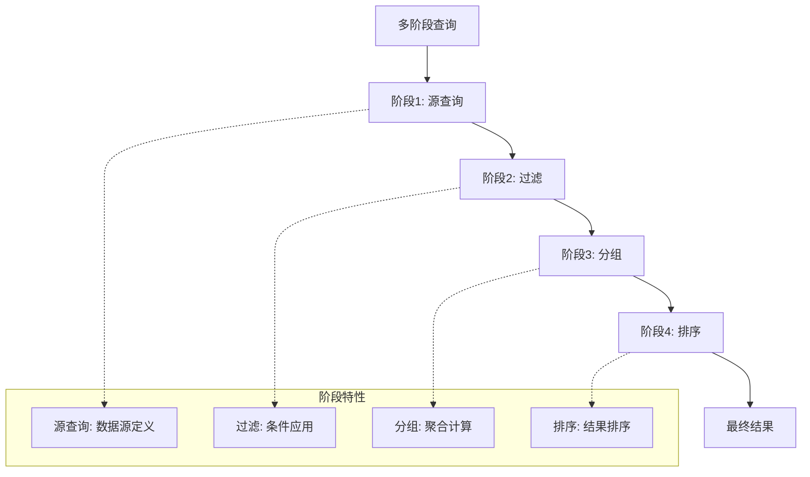

**章节来源**
- [normalize_query.clj](file://src/metabase/query_processor/middleware/normalize_query.clj#L1-L33)

## SQL生成阶段

SQL生成阶段是查询编译管道的最后一环，负责将中间表示转换为具体的原生SQL语句。

### MBQL到原生转换

MBQL到原生SQL的转换过程涉及复杂的语法映射和优化：

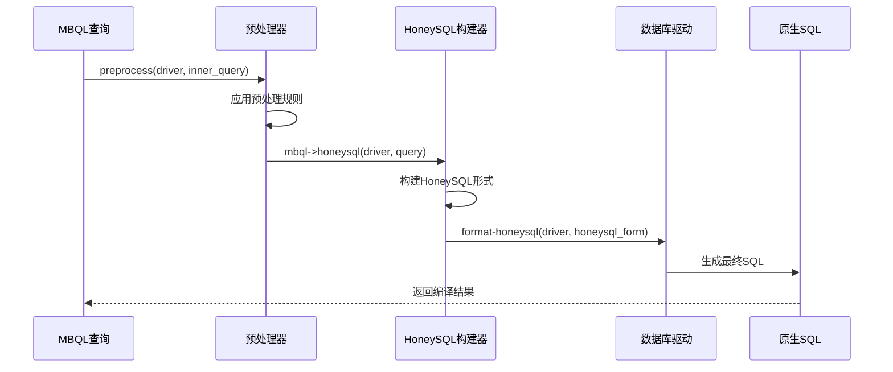

**图表来源**
- [query_processor.clj](file://src/metabase/driver/sql/query_processor.clj#L2036-L2091)
- [compile.clj](file://src/metabase/query_processor/compile.clj#L32-L61)

### 参数内联化

参数内联化是SQL生成的重要特性，允许将参数直接嵌入SQL语句中：

| 内联模式 | 描述 | 使用场景 |
|---------|------|----------|
| 参数化查询 | 使用占位符和分离参数 | 标准查询执行，防止SQL注入 |
| 参数内联 | 将参数值直接嵌入SQL | SQL导出、调试显示 |
| 混合模式 | 部分参数内联，部分参数化 | 特殊需求场景 |

**章节来源**
- [compile.clj](file://src/metabase/query_processor/compile.clj#L1-L96)
- [query_processor.clj](file://src/metabase/driver/sql/query_processor.clj#L2036-L2091)

## 错误处理机制

查询编译管道实现了完善的错误处理机制，能够捕获和分类各种类型的错误，并提供有意义的错误信息。

### 错误类型层次

查询编译管道定义了详细的错误类型层次结构：

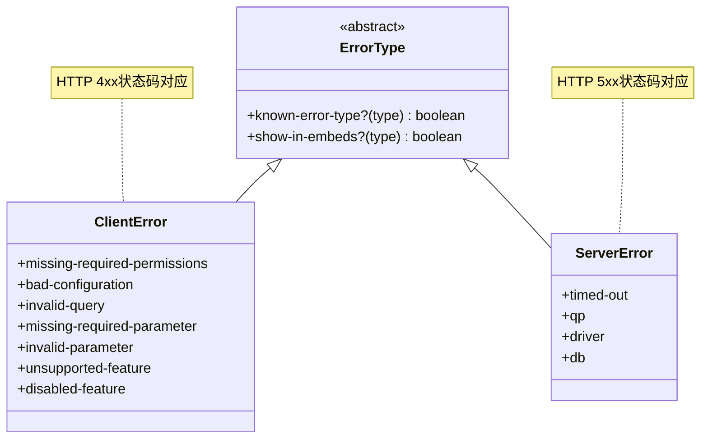

**图表来源**
- [error_type.clj](file://src/metabase/query_processor/error_type.clj#L20-L101)

### 异常捕获和传播

异常捕获中间件负责拦截查询处理过程中的异常，并将其转换为标准化的错误响应：

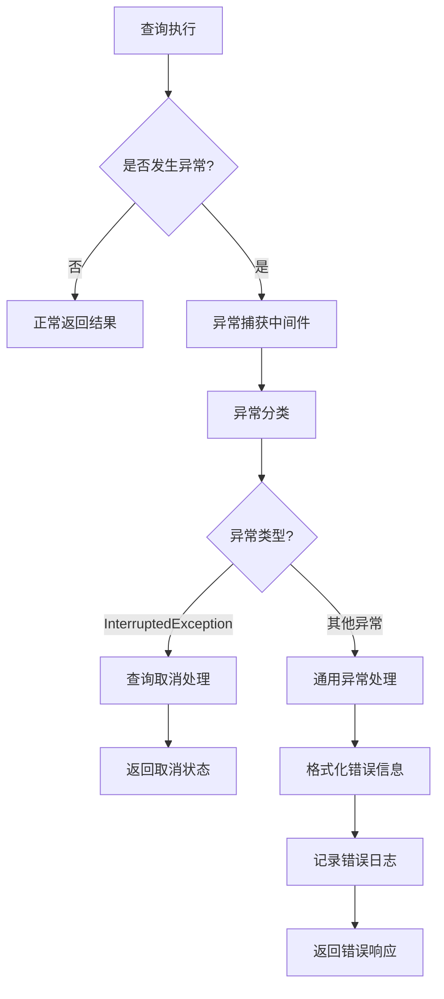

**图表来源**
- [catch_exceptions.clj](file://src/metabase/query_processor/middleware/catch_exceptions.clj#L117-L150)

### 错误恢复策略

查询编译管道采用多层次的错误恢复策略：

| 错误级别 | 恢复策略 | 处理方式 |
|---------|----------|----------|
| 查询级错误 | 返回具体错误信息 | 显示给用户或嵌入仪表板 |
| 系统级错误 | 记录详细日志 | 返回通用错误消息 |
| 驱动级错误 | 降级处理 | 使用备用方案或默认值 |
| 网络级错误 | 重试机制 | 自动重试或超时处理 |

**章节来源**
- [error_type.clj](file://src/metabase/query_processor/error_type.clj#L1-L101)
- [catch_exceptions.clj](file://src/metabase/query_processor/middleware/catch_exceptions.clj#L1-L150)

## 执行时序图

以下是查询从接收到编译完成的完整执行时序：

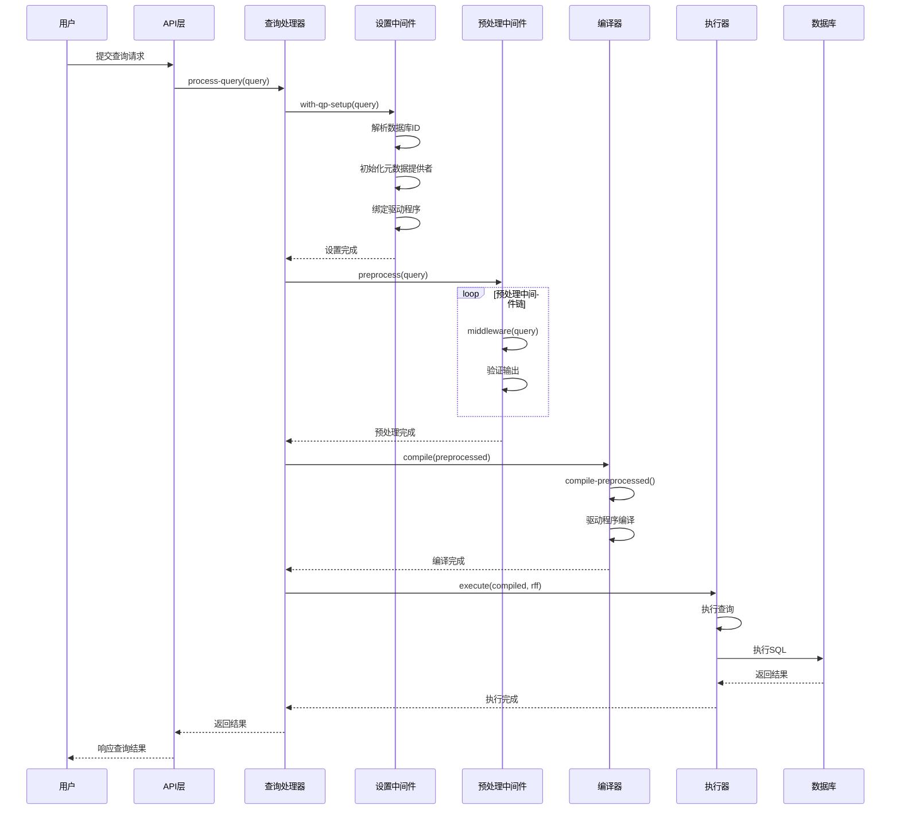

**图表来源**
- [query_processor.clj](file://src/metabase/query_processor.clj#L60-L116)
- [setup.clj](file://src/metabase/query_processor/setup.clj#L200-L256)
- [pipeline.clj](file://src/metabase/query_processor/pipeline.clj#L90-L129)

**章节来源**
- [query_processor.clj](file://src/metabase/query_processor.clj#L60-L116)
- [setup.clj](file://src/metabase/query_processor/setup.clj#L200-L256)
- [pipeline.clj](file://src/metabase/query_processor/pipeline.clj#L90-L129)

## 性能优化考虑

查询编译管道在设计时充分考虑了性能优化，采用了多种策略来提高处理效率：

### 缓存策略

- **字段元数据缓存**: 预先加载和缓存常用的字段元数据
- **查询结果缓存**: 对重复查询结果进行缓存
- **编译结果缓存**: 缓存已编译的查询结构

### 并发处理

- **异步执行**: 支持查询取消和超时控制
- **并行中间件**: 部分中间件可以并行执行
- **流式处理**: 支持大数据集的流式处理

### 内存管理

- **惰性求值**: 只在需要时才进行计算
- **资源清理**: 及时释放不再需要的资源
- **内存监控**: 监控内存使用情况

## 故障排除指南

### 常见问题及解决方案

| 问题类型 | 症状 | 可能原因 | 解决方案 |
|---------|------|----------|----------|
| 编译失败 | 查询无法转换为SQL | 字段不存在、语法错误 | 检查字段引用和查询语法 |
| 性能问题 | 查询执行缓慢 | 复杂查询、缺少索引 | 优化查询结构、添加索引 |
| 内存溢出 | 系统内存不足 | 大数据集处理 | 增加内存限制、启用分页 |
| 连接超时 | 查询长时间无响应 | 网络问题、数据库负载 | 检查网络连接、优化查询 |

### 调试技巧

1. **启用调试日志**: 使用`qp.debug`中间件查看详细处理过程
2. **检查中间件状态**: 验证每个中间件的输出是否正确
3. **监控性能指标**: 关注中间件执行时间和内存使用
4. **测试边界条件**: 验证极端情况下的处理行为

**章节来源**
- [preprocess.clj](file://src/metabase/query_processor/preprocess.clj#L120-L158)
- [setup.clj](file://src/metabase/query_processor/setup.clj#L200-L256)

## 总结

Metabase查询编译管道是一个高度模块化和可扩展的系统，通过精心设计的中间件架构实现了从MBQL查询到原生SQL的高效转换。该管道的主要优势包括：

1. **模块化设计**: 中间件机制使得系统易于扩展和维护
2. **完善的错误处理**: 多层次的错误捕获和恢复机制
3. **性能优化**: 缓存策略和并发处理提升系统性能
4. **类型安全**: 使用Malli schema确保数据完整性
5. **可调试性**: 丰富的日志和调试信息帮助问题诊断

查询编译管道的设计体现了现代软件架构的最佳实践，为Metabase提供了强大而可靠的查询处理能力。通过持续的优化和改进，该系统能够满足日益增长的业务需求和性能要求。