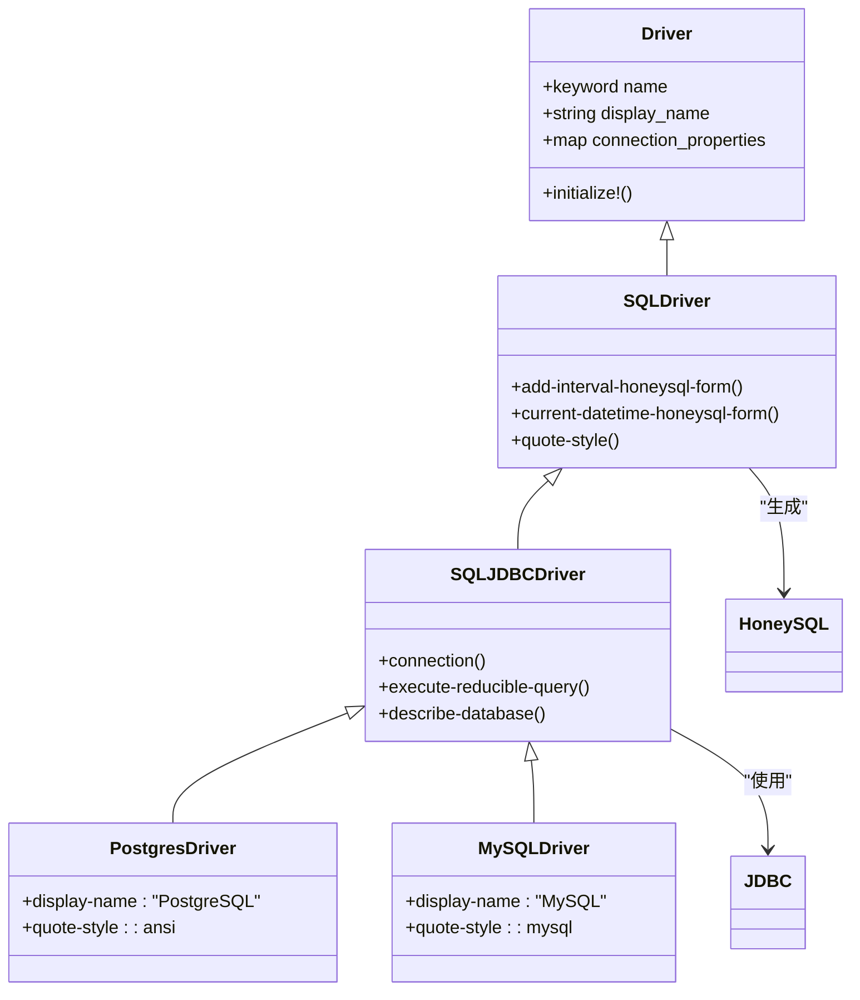
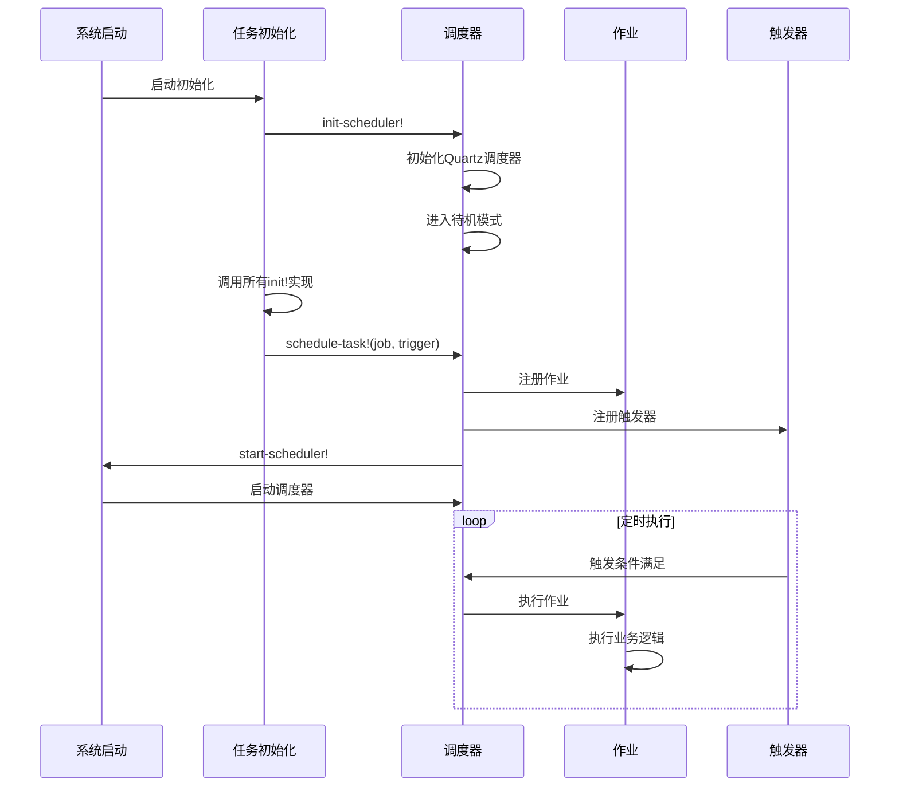
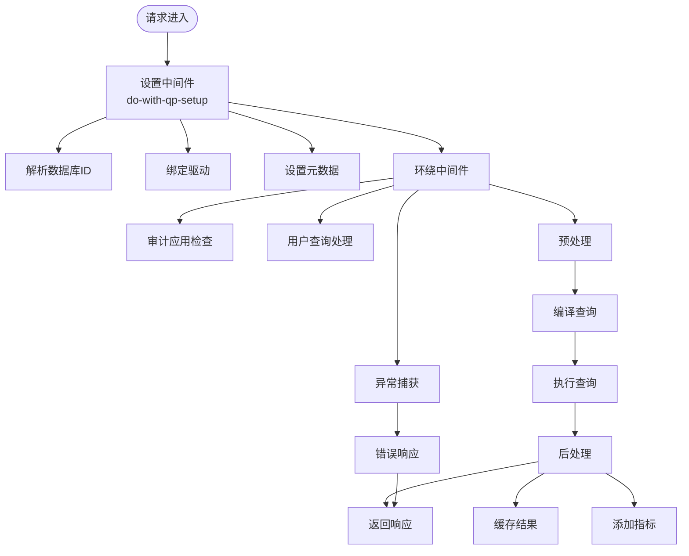
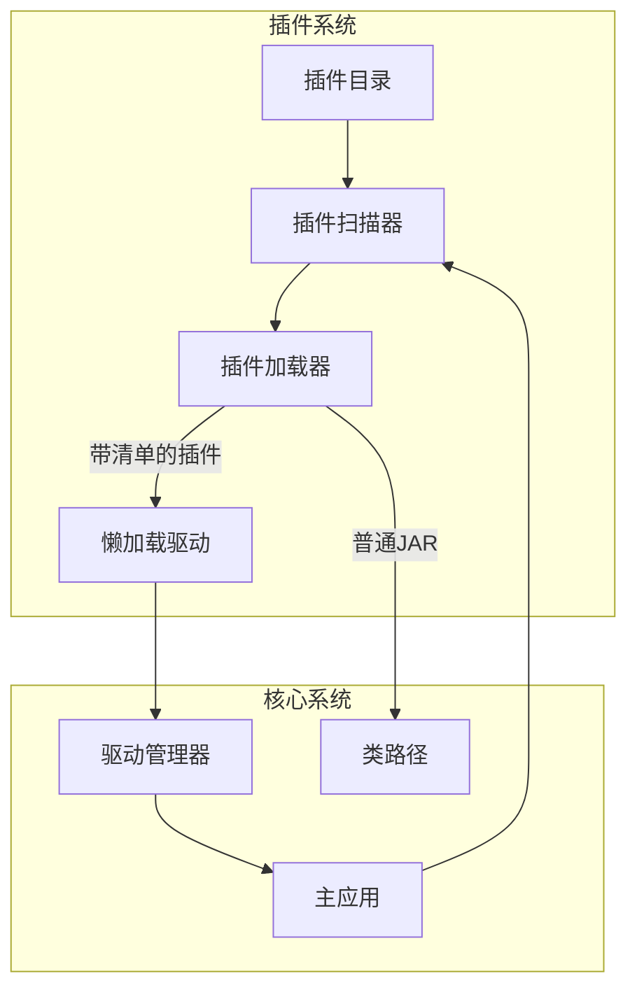
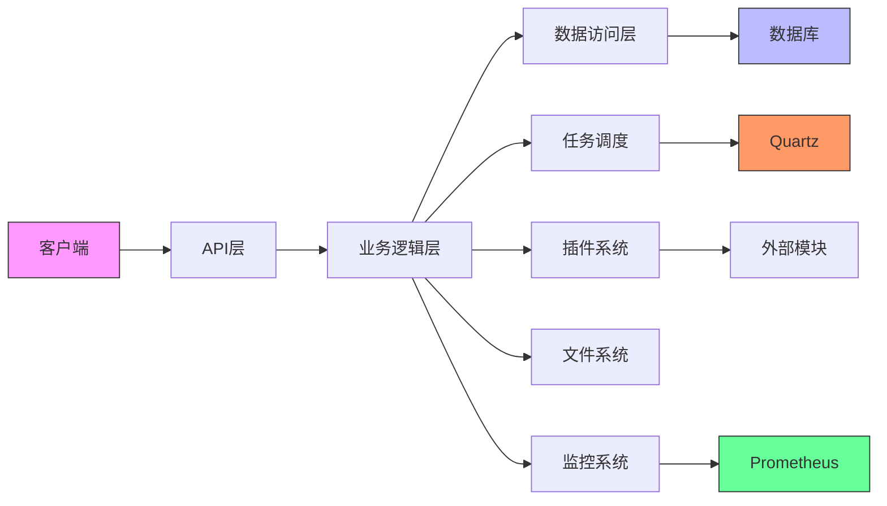

# 核心服务架构

<cite>
**本文档中引用的文件**  
- [query_processor.clj](file://src/metabase/query_processor.clj)
- [driver.clj](file://src/metabase/driver.clj)
- [task/core.clj](file://src/metabase/task/core.clj)
- [analytics/quartz.clj](file://src/metabase/analytics/quartz.clj)
- [plugins/core.clj](file://src/metabase/plugins/core.clj)
- [query_processor/setup.clj](file://src/metabase/query_processor/setup.clj)
- [query_processor/middleware/enterprise.clj](file://src/metabase/query_processor/middleware/enterprise.clj)
- [task/impl.clj](file://src/metabase/task/impl.clj)
- [plugins/impl.clj](file://src/metabase/plugins/impl.clj)
- [driver/sql/query_processor.clj](file://src/metabase/driver/sql/query_processor.clj)
</cite>

## 目录
1. [引言](#引言)
2. [查询处理器架构](#查询处理器架构)
3. [数据库驱动架构](#数据库驱动架构)
4. [任务调度系统](#任务调度系统)
5. [中间件管道模式](#中间件管道模式)
6. [系统扩展性设计](#系统扩展性设计)
7. [系统边界与组件交互](#系统边界与组件交互)
8. [数据流分析](#数据流分析)

## 引言
Metabase核心服务架构采用分层设计模式，通过模块化组件实现数据分析平台的核心功能。本架构文档深入分析查询处理、数据库驱动、任务调度和中间件管道等关键子系统，揭示其内部工作原理和组件间交互机制。系统基于Clojure语言开发，利用函数式编程范式和多态分发机制实现高度可扩展的架构设计。

## 查询处理器架构

Metabase查询处理器是系统的核心组件，负责将MBQL（Metabase Query Language）转换为底层数据库可执行的原生查询。查询处理器采用管道式架构，通过一系列预处理、编译和执行阶段完成查询转换。

查询处理流程始于`process-query`函数，该函数作为主要入口点接收MBQL查询并返回执行结果。处理器通过`around-middleware`定义的中间件链进行功能扩展，包括异常捕获、用户查询处理和企业级功能集成。中间件采用环绕式设计，在查询执行前后进行预处理和后处理操作。

查询执行流程包括预处理（preprocess）、编译（compile）和执行（execute）三个阶段。预处理阶段对查询进行标准化和验证，编译阶段将MBQL转换为HoneySQL格式的抽象语法树，执行阶段则将编译后的查询提交给数据库驱动执行。

**Section sources**
- [query_processor.clj](file://src/metabase/query_processor.clj#L0-L116)
- [query_processor/setup.clj](file://src/metabase/query_processor/setup.clj#L0-L256)

## 数据库驱动架构

Metabase数据库驱动架构采用多态分发机制实现对多种数据库的支持。驱动系统基于Clojure的多方法（multimethod）特性，通过`dispatch-on-initialized-driver`函数实现运行时动态分发。每个数据库驱动注册为关键字标识符，并通过继承层次结构共享通用功能。

驱动架构分为三层：基础驱动层（如`:sql`）、JDBC驱动层（如`:sql-jdbc`）和具体数据库驱动层（如`:postgres`、`:mysql`）。这种分层设计实现了代码复用和功能继承，具体驱动只需实现特定于数据库的功能，通用SQL处理逻辑由父驱动提供。

SQL方言处理通过`quote-style`多方法实现，不同数据库驱动返回相应的HoneySQL方言标识符（如`:ansi`、`:mysql`）。查询编译过程利用`->honeysql`多方法将MBQL表达式转换为特定数据库的SQL语法。驱动还支持`unix-timestamp->honeysql`等类型转换方法，处理不同数据库的时间戳格式差异。

驱动注册通过`register!`函数完成，驱动实现必须调用此函数将自身注册到全局驱动层次结构中。驱动初始化采用惰性加载策略，仅在首次使用时加载相关命名空间和依赖。

**Diagram sources**
- [driver.clj](file://src/metabase/driver.clj#L0-L799)
- [driver/sql/query_processor.clj](file://src/metabase/driver/sql/query_processor.clj#L0-L799)

**Section sources**
- [driver.clj](file://src/metabase/driver.clj#L0-L799)
- [driver/sql/query_processor.clj](file://src/metabase/driver/sql/query_processor.clj#L0-L799)

## 任务调度系统

Metabase任务调度系统基于Quartz框架实现，提供可靠的后台作业管理和定时任务执行功能。调度系统通过`metabase.task.core`命名空间暴露核心API，包括任务添加、触发器管理、调度器控制等操作。

任务调度架构包含三个核心组件：调度器（Scheduler）、作业（Job）和触发器（Trigger）。调度器负责管理作业的生命周期和执行计划，作业封装具体的业务逻辑，触发器定义作业的执行时间规则。系统通过`init!`多方法实现任务的初始化注册，各模块在启动时注册自己的定时任务。

Quartz集成通过`metabase.analytics.quartz`命名空间实现监控功能，包括作业执行监听器和触发器状态监听器。作业执行监听器记录任务执行指标到Prometheus监控系统，触发器监听器跟踪任务状态变化。调度器启动过程包括初始化、进入待机模式和最终启动三个阶段，确保系统稳定运行。

任务调度系统支持Cron表达式定义复杂的执行计划，通过`schedule-task!`函数将作业与触发器关联。系统还提供`trigger-now!`函数支持手动触发任务执行，便于调试和运维操作。

**Diagram sources**
- [task/core.clj](file://src/metabase/task/core.clj#L0-L30)
- [task/impl.clj](file://src/metabase/task/impl.clj#L0-L377)
- [analytics/quartz.clj](file://src/metabase/analytics/quartz.clj#L0-L92)

**Section sources**
- [task/core.clj](file://src/metabase/task/core.clj#L0-L30)
- [task/impl.clj](file://src/metabase/task/impl.clj#L0-L377)
- [analytics/quartz.clj](file://src/metabase/analytics/quartz.clj#L0-L92)

## 中间件管道模式

Metabase采用中间件管道模式处理请求，通过函数组合实现关注点分离。查询处理器的中间件系统定义了`around-middleware`、`setup-middleware`等中间件链，每个中间件封装特定的横切关注点。

中间件管道采用环绕式设计，形成类似洋葱的调用结构。请求处理时，调用栈从外层向内层逐层进入，执行预处理逻辑；查询执行后，结果从内层向外层逐层返回，执行后处理逻辑。这种设计确保了中间件的独立性和可组合性。

系统定义了多种中间件类型：预处理中间件（如`apply-sandboxing`）、执行中间件（如`swap-destination-db`）、后处理中间件（如`limit-download-result-rows`）和环绕中间件（如`catch-exceptions`）。企业级功能通过`defenterprise`宏实现条件加载，确保核心系统与企业模块的松耦合。

中间件注册采用动态重建机制，当任何中间件发生变化时，系统自动重建`process-query*`函数，确保最新中间件配置生效。这种热重载能力支持运行时配置更新，无需重启服务。

**Diagram sources**
- [query_processor.clj](file://src/metabase/query_processor.clj#L0-L116)
- [query_processor/setup.clj](file://src/metabase/query_processor/setup.clj#L0-L256)
- [query_processor/middleware/enterprise.clj](file://src/metabase/query_processor/middleware/enterprise.clj#L0-L131)

**Section sources**
- [query_processor.clj](file://src/metabase/query_processor.clj#L0-L116)
- [query_processor/setup.clj](file://src/metabase/query_processor/setup.clj#L0-L256)
- [query_processor/middleware/enterprise.clj](file://src/metabase/query_processor/middleware/enterprise.clj#L0-L131)

## 系统扩展性设计

Metabase通过插件机制和API扩展点实现系统扩展性。插件系统由`metabase.plugins.core`命名空间管理，支持动态加载第三方功能模块。插件架构采用懒加载策略，仅在需要时初始化相关驱动和功能。

插件机制基于`metabase-plugin.yaml`清单文件定义，包含驱动信息、依赖关系和初始化步骤。系统启动时扫描插件目录，加载所有JAR文件并解析插件清单。对于包含清单文件的插件，系统注册懒加载驱动；对于普通JAR文件，直接添加到类路径。

API扩展点通过命名空间导入实现，核心模块使用`potemkin/import-vars`宏暴露扩展接口。这种设计模式允许外部模块无缝集成到核心系统，同时保持接口稳定性。驱动API通过`driver-api.core`命名空间提供标准化接口，确保第三方驱动的兼容性。

系统还支持企业级功能的条件加载，通过`defenterprise`宏实现功能模块的按需激活。这种设计既保证了核心系统的轻量化，又支持企业级功能的灵活扩展。

**Diagram sources**
- [plugins/core.clj](file://src/metabase/plugins/core.clj#L0-L12)
- [plugins/impl.clj](file://src/metabase/plugins/impl.clj#L0-L200)

**Section sources**
- [plugins/core.clj](file://src/metabase/plugins/core.clj#L0-L12)
- [plugins/impl.clj](file://src/metabase/plugins/impl.clj#L0-L200)

## 系统边界与组件交互

Metabase系统边界清晰，核心服务与外部系统通过明确定义的接口交互。系统主要与数据库、文件系统、网络服务和监控系统进行交互。数据库交互通过JDBC驱动或原生驱动实现，文件系统交互用于插件管理和配置文件读取，网络服务支持REST API和WebSocket通信。

组件交互图展示了核心模块间的依赖关系。查询处理器依赖驱动系统执行查询，驱动系统依赖连接池管理数据库连接，任务调度系统依赖Quartz框架管理后台作业。所有组件通过共享状态和消息传递进行协作，确保系统整体协调运行。

系统采用分层架构，从上到下分为API层、业务逻辑层、数据访问层和基础设施层。API层处理HTTP请求，业务逻辑层实现核心功能，数据访问层管理数据持久化，基础设施层提供通用服务。这种分层设计降低了组件间的耦合度，提高了系统的可维护性。

**Diagram sources**
- [query_processor.clj](file://src/metabase/query_processor.clj#L0-L116)
- [driver.clj](file://src/metabase/driver.clj#L0-L799)
- [task/core.clj](file://src/metabase/task/core.clj#L0-L30)
- [plugins/core.clj](file://src/metabase/plugins/core.clj#L0-L12)

## 数据流分析

Metabase数据流从用户查询开始，经过查询解析、优化、执行和结果处理等阶段。查询数据流始于API端点接收MBQL查询，通过`userland-query-with-default-constraints`函数添加默认约束，然后进入查询处理器管道。

在查询处理器中，数据流经过预处理阶段进行查询验证和标准化，编译阶段将MBQL转换为HoneySQL抽象语法树，执行阶段通过数据库驱动将查询提交到目标数据库。查询结果返回后，经过后处理阶段进行格式化和缓存，最终返回给客户端。

缓存数据流通过独立的缓存系统管理，查询结果可根据配置存储在内存或外部缓存服务中。任务调度数据流由Quartz框架管理，定时任务生成的数据通过消息队列或直接存储到数据库。所有数据流都经过统一的错误处理和日志记录，确保系统的可观测性。

**Diagram sources**
- [query_processor.clj](file://src/metabase/query_processor.clj#L0-L116)
- [query_processor/setup.clj](file://src/metabase/query_processor/setup.clj#L0-L256)