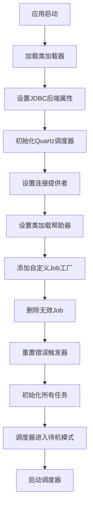
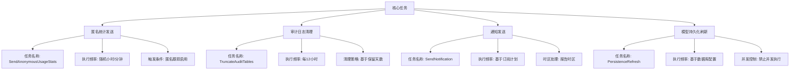
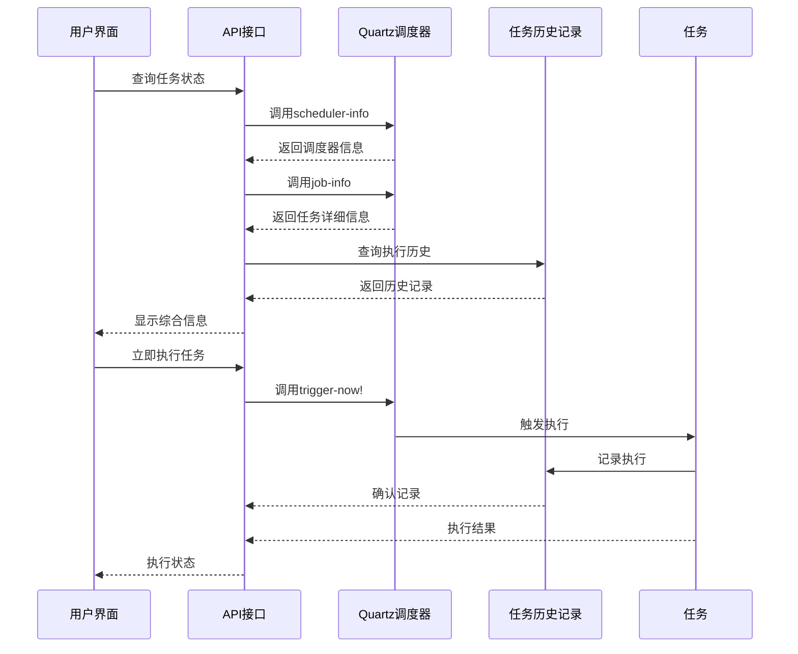
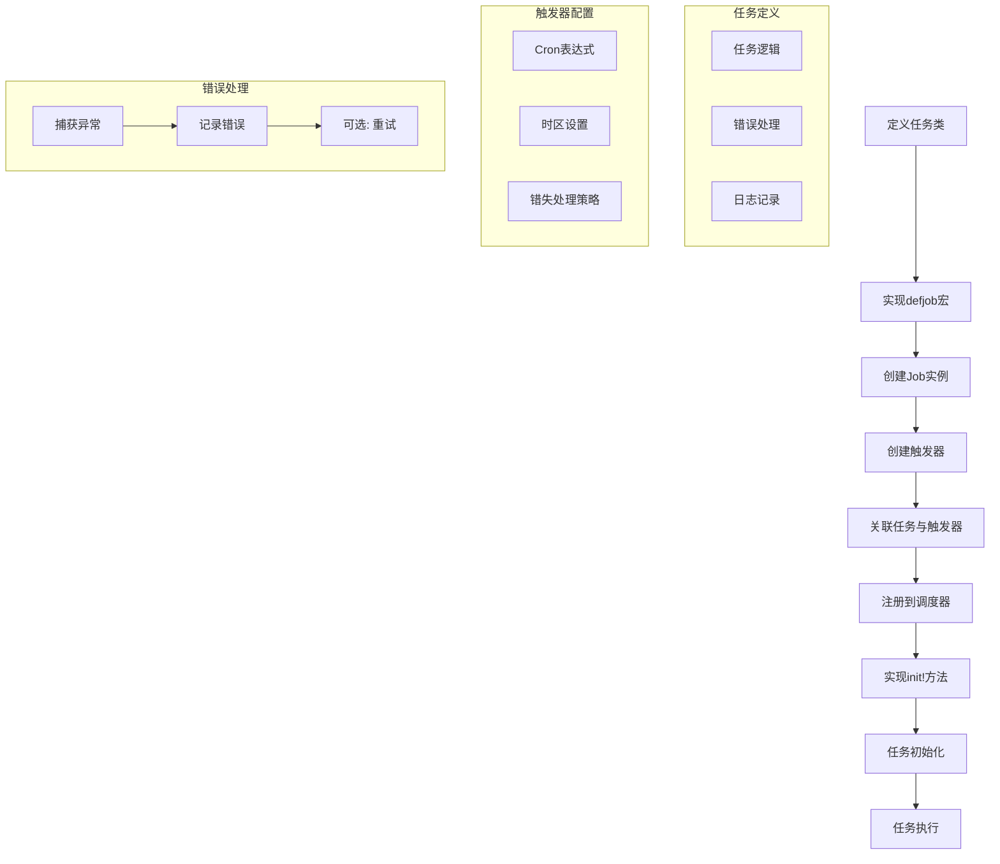

# 任务调度管理

<cite>
**本文档引用的文件**
- [bootstrap.clj](file://src/metabase/task/bootstrap.clj)
- [core.clj](file://src/metabase/task/core.clj)
- [impl.clj](file://src/metabase/task/impl.clj)
- [job_factory.clj](file://src/metabase/task/job_factory.clj)
- [quartz.clj](file://src/metabase/analytics/quartz.clj)
- [send_anonymous_stats.clj](file://src/metabase/analytics/task/send_anonymous_stats.clj)
- [truncate_audit_tables.clj](file://src/metabase/audit_app/task/truncate_audit_tables.clj)
- [send.clj](file://src/metabase/notification/task/send.clj)
- [persist_refresh.clj](file://src/metabase/model_persistence/task/persist_refresh.clj)
- [task_history.clj](file://src/metabase/task_history/core.clj)
</cite>

## 目录
1. [引言](#引言)
2. [任务调度框架初始化](#任务调度框架初始化)
3. [核心定时任务配置](#核心定时任务配置)
4. [任务执行监控与管理](#任务执行监控与管理)
5. [自定义定时任务开发](#自定义定时任务开发)
6. [集群环境下的任务协调](#集群环境下的任务协调)
7. [结论](#结论)

## 引言
Metabase任务调度系统基于Quartz框架实现，为系统提供可靠的后台任务管理机制。该系统负责执行各种周期性任务，包括匿名统计发送、脉冲报告发送、审计日志清理等关键功能。本文档详细说明任务调度系统的架构、核心组件、任务管理机制以及在集群环境下的协调策略。

## 任务调度框架初始化



**图示来源**
- [bootstrap.clj](file://src/metabase/task/bootstrap.clj#L1-L54)
- [impl.clj](file://src/metabase/task/impl.clj#L1-L377)

**本节来源**
- [bootstrap.clj](file://src/metabase/task/bootstrap.clj#L1-L54)
- [impl.clj](file://src/metabase/task/impl.clj#L1-L377)

Metabase任务调度系统的初始化过程始于应用启动时调用`init-scheduler!`函数。该过程首先通过`classloader/the-classloader`确保类加载器已准备就绪，然后调用`set-jdbc-backend-properties!`设置Quartz连接数据库所需的系统属性。

系统创建了一个自定义的`ConnectionProvider`，它使用Metabase的应用程序数据库连接池来提供连接，确保Quartz操作不会干扰当前的数据库事务。同时，系统设置了自定义的`ClassLoadHelper`，使用Metabase的类加载器来加载任务类。

在调度器初始化完成后，系统会执行清理操作：删除因类不存在而失效的Job，并重置处于"ERROR"状态的触发器，这在滚动升级场景中尤为重要，可以避免旧版本实例无法执行新版本添加的任务而导致的错误状态。

## 核心定时任务配置



**图示来源**
- [send_anonymous_stats.clj](file://src/metabase/analytics/task/send_anonymous_stats.clj#L1-L40)
- [truncate_audit_tables.clj](file://src/metabase/audit_app/task/truncate_audit_tables.clj#L1-L92)
- [send.clj](file://src/metabase/notification/task/send.clj#L1-L211)
- [persist_refresh.clj](file://src/metabase/model_persistence/task/persist_refresh.clj#L1-L446)

**本节来源**
- [send_anonymous_stats.clj](file://src/metabase/analytics/task/send_anonymous_stats.clj#L1-L40)
- [truncate_audit_tables.clj](file://src/metabase/audit_app/task/truncate_audit_tables.clj#L1-L92)
- [send.clj](file://src/metabase/notification/task/send.clj#L1-L211)
- [persist_refresh.clj](file://src/metabase/model_persistence/task/persist_refresh.clj#L1-L446)

### 匿名统计发送任务
匿名统计发送任务(`SendAnonymousUsageStats`)定期向Metabase团队发送匿名使用信息。该任务通过`defmethod task/init! ::SendAnonymousUsageStats`方法初始化，执行频率为随机的小时和分钟，以避免所有实例在同一时间发送请求造成服务器压力。

任务执行前会检查`anon-tracking-enabled`设置，仅在用户同意收集使用数据时才执行。任务使用`phone-home-stats!`函数发送统计信息，并包含完善的错误处理机制，确保发送失败不会影响系统其他功能。

### 审计日志清理任务
审计日志清理任务(`TruncateAuditTables`)负责清理超过配置保留期限的审计相关表数据，包括`audit_log`、`view_log`和`query_execution`表。该任务每12小时执行一次，使用批量删除策略以避免长时间锁定表。

清理策略由`audit-max-retention-days`设置控制，系统会分批删除过期数据，每批处理`audit-table-truncation-batch-size`条记录，直到没有更多过期数据需要删除。此设计确保了大数据库的清理操作不会影响系统性能。

### 通知发送任务
通知发送任务(`SendNotification`)处理基于时间计划的通知订阅。系统为每个活动的cron类型订阅创建独立的触发器，触发器的cron表达式和时区基于订阅配置和数据库的报告时区。

系统提供了`update-subscription-trigger!`函数来管理订阅变更，包括创建新触发器、更新现有触发器的计划或删除不再需要的触发器。`InitNotificationTriggers`任务在每次启动时初始化所有通知触发器，确保系统重启后通知功能能正常工作。

### 模型持久化刷新任务
模型持久化刷新任务(`PersistenceRefresh`)负责刷新持久化模型的数据。该任务支持两种执行模式：按数据库批量刷新和单个模型手动刷新。任务禁止并发执行，确保同一数据库的刷新操作不会相互干扰。

刷新计划由`persisted-model-refresh-cron-schedule`设置控制，系统会为每个启用持久化模型的数据库创建相应的触发器。`reschedule-refresh!`函数负责重新安排所有数据库的刷新计划，通常在相关设置更改时调用。

## 任务执行监控与管理



**图示来源**
- [impl.clj](file://src/metabase/task/impl.clj#L1-L377)
- [quartz.clj](file://src/metabase/analytics/quartz.clj#L1-L92)
- [task_history.clj](file://src/metabase/task_history/core.clj#L1-L10)

**本节来源**
- [impl.clj](file://src/metabase/task/impl.clj#L1-L377)
- [quartz.clj](file://src/metabase/analytics/quartz.clj#L1-L92)
- [task_history.clj](file://src/metabase/task_history/core.clj#L1-L10)

### 任务状态查看
系统提供了多种方式查看当前运行的任务状态。通过`scheduler-info`函数可以获取调度器的全局信息，包括正在执行的任务数量和各种状态的任务计数。`job-info`函数则提供特定任务的详细信息，包括任务键、类名、描述和所有关联的触发器。

任务状态包括：WAITING（等待执行）、EXECUTING（正在执行）、PAUSED（暂停）、BLOCKED（阻塞）和ERROR（错误）。这些状态信息对于诊断任务执行问题至关重要。

### 任务管理操作
系统提供了完整的任务管理API：

- `schedule-task!`：安排新的任务执行计划
- `reschedule-trigger!`：重新安排现有触发器
- `delete-task!`：删除任务及其触发器
- `trigger-now!`：立即触发任务执行
- `stop-scheduler!`和`start-scheduler!`：停止和启动调度器

这些操作允许管理员动态调整任务计划，响应系统需求变化。

### 执行历史监控
通过`task-history/with-task-history`宏，系统可以记录任务的执行历史，包括开始时间、结束时间、执行时长和结果状态。这些历史记录存储在数据库中，可用于性能分析、故障排查和审计。

Prometheus监控集成通过`create-job-execution-listener`和`create-trigger-listener`函数实现，将任务执行指标暴露给监控系统，包括任务执行次数、执行状态和各种状态的任务数量。

## 自定义定时任务开发



**图示来源**
- [impl.clj](file://src/metabase/task/impl.clj#L1-L377)
- [send_anonymous_stats.clj](file://src/metabase/analytics/task/send_anonymous_stats.clj#L1-L40)

**本节来源**
- [impl.clj](file://src/metabase/task/impl.clj#L1-L377)
- [send_anonymous_stats.clj](file://src/metabase/analytics/task/send_anonymous_stats.clj#L1-L40)

### 任务注册流程
开发自定义定时任务需要遵循标准流程：

1. 在适当的命名空间中定义任务类，通常位于`metabase.<module>.task.*`路径下
2. 使用`task/defjob`宏定义任务执行逻辑
3. 实现`task/init!`多方法来初始化任务
4. 在模块的`init`命名空间中添加对任务初始化的引用

### 调度表达式配置
系统使用Quartz的Cron表达式来定义任务执行计划。Cron表达式由6-7个字段组成，分别表示秒、分、小时、日、月、周和年（可选）。例如，`0 0 */12 * * ? *`表示每12小时执行一次。

对于需要考虑时区的任务，应使用`cron/in-time-zone`函数指定执行时区，通常使用数据库的报告时区或系统时区。

### 错误处理策略
系统提供了多种错误处理机制：

- `rerun-on-error`宏：捕获异常并重新抛出`JobExecutionException`，指示Quartz重试任务
- 任务内部的try-catch块：捕获和记录异常，避免任务执行中断调度器
- Prometheus监控：记录任务执行失败的指标，便于告警和分析

推荐的做法是在任务逻辑中使用try-catch捕获所有异常，记录详细的错误信息，并根据需要决定是否让任务失败。

## 集群环境下的任务协调

```mermaid
classDiagram
class ConnectionProvider {
+initialize()
+getConnection()
+shutdown()
}
class JobFactory {
+newJob()
}
class NoOpJob {
+execute()
}
class Scheduler {
+setJobFactory()
+getListenerManager()
}
ConnectionProvider --> Scheduler : "配置"
JobFactory --> Scheduler : "设置"
JobFactory --> NoOpJob : "创建"
Scheduler --> JobFactory : "委托"
note right of ConnectionProvider
使用应用数据库连接池
确保集群实例共享连接
end
note right of JobFactory
处理类找不到的情况
滚动升级时防止错误
end
note right of NoOpJob
空操作任务
旧实例遇到新任务时使用
end
```

**图示来源**
- [bootstrap.clj](file://src/metabase/task/bootstrap.clj#L1-L54)
- [job_factory.clj](file://src/metabase/task/job_factory.clj#L1-L65)
- [impl.clj](file://src/metabase/task/impl.clj#L1-L377)

**本节来源**
- [bootstrap.clj](file://src/metabase/task/bootstrap.clj#L1-L54)
- [job_factory.clj](file://src/metabase/task/job_factory.clj#L1-L65)
- [impl.clj](file://src/metabase/task/impl.clj#L1-L377)

### 防止重复执行
在集群环境中，多个Metabase实例可能同时运行，Quartz框架通过数据库锁机制确保同一任务不会被多个实例重复执行。所有任务调度信息存储在共享的Metabase应用程序数据库中，Quartz使用数据库行级锁来协调实例间的任务执行。

`ConnectionProvider`的实现确保Quartz使用与应用程序相同的数据库连接池，这不仅提高了连接效率，也确保了锁机制的一致性。

### 滚动升级兼容性
系统通过自定义的`JobFactory`解决了滚动升级期间的任务兼容性问题。当新版本添加了新任务而旧版本实例尚未升级时，旧实例会因找不到任务类而抛出`ClassNotFoundException`。

自定义的`JobFactory`捕获此类异常并返回一个`NoOpJob`（空操作任务），该任务只记录警告信息而不执行实际工作。同时，系统添加了`TriggerListener`来阻止`NoOpJob`的执行，避免不必要的日志输出。

### 故障恢复机制
系统实现了多种故障恢复机制：

- `reset-errored-triggers!`函数在启动时重置所有处于"ERROR"状态的触发器，使其恢复到"WAITING"状态
- 任务触发器配置了适当的错失处理策略，如`with-misfire-handling-instruction-do-nothing`或`fire-and-proceed`
- 关键任务使用`DisallowConcurrentExecution`注解禁止并发执行，防止同一任务的多个实例同时运行

## 结论
Metabase的任务调度系统基于Quartz框架构建，提供了可靠、可扩展的后台任务管理能力。系统通过精心设计的初始化流程、完善的监控机制和集群协调策略，确保了各种周期性任务的稳定执行。

核心设计特点包括：使用数据库作为任务存储确保集群一致性、自定义Job工厂处理版本兼容性问题、详细的执行历史记录和监控集成，以及灵活的任务管理API。这些特性共同构成了一个健壮的任务调度基础设施，支持Metabase的各种后台功能需求。