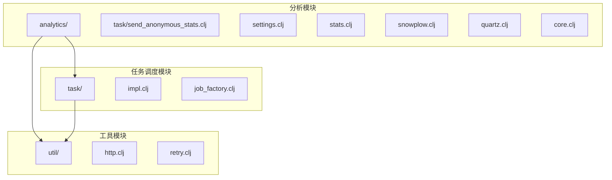
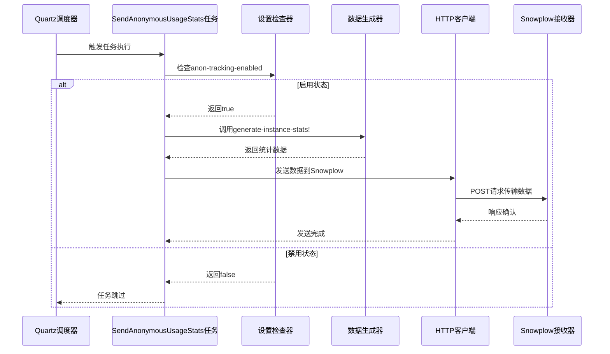
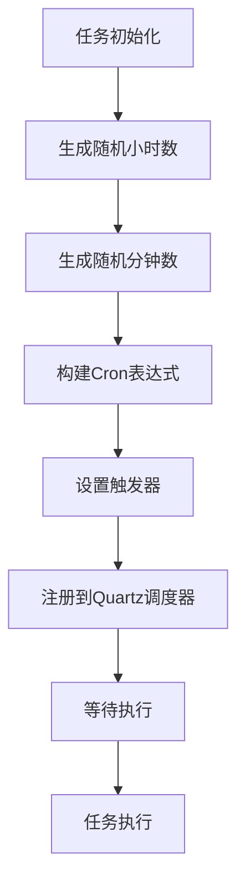
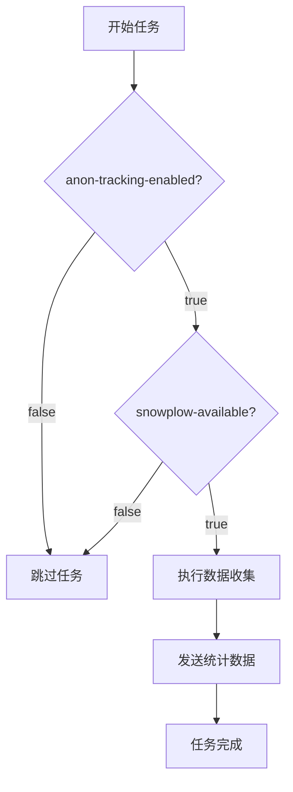
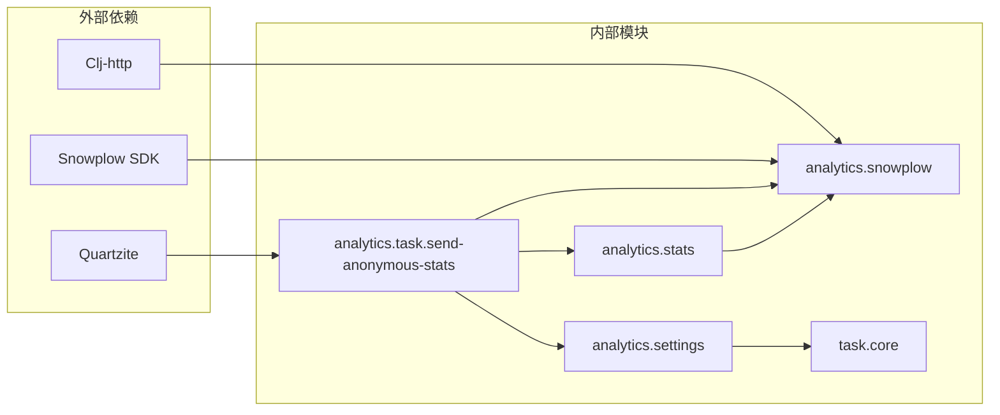

# 匿名统计任务

<cite>
**本文档中引用的文件**
- [send_anonymous_stats.clj](file://src/metabase/analytics/task/send_anonymous_stats.clj)
- [settings.clj](file://src/metabase/analytics/settings.clj)
- [stats.clj](file://src/metabase/analytics/stats.clj)
- [core.clj](file://src/metabase/analytics/core.clj)
- [snowplow.clj](file://src/metabase/analytics/snowplow.clj)
- [quartz.clj](file://src/metabase/analytics/quartz.clj)
- [init.clj](file://src/metabase/analytics/init.clj)
- [http.clj](file://src/metabase/util/http.clj)
- [retry.clj](file://src/metabase/util/retry.clj)
- [impl.clj](file://src/metabase/task/impl.clj)
</cite>

## 目录
1. [简介](#简介)
2. [项目结构](#项目结构)
3. [核心组件](#核心组件)
4. [架构概览](#架构概览)
5. [详细组件分析](#详细组件分析)
6. [依赖关系分析](#依赖关系分析)
7. [性能考虑](#性能考虑)
8. [故障排除指南](#故障排除指南)
9. [结论](#结论)

## 简介

Metabase匿名统计任务是一个定期收集和发送匿名使用数据到Metabase团队的后台任务系统。该任务通过Quartz调度器在每天随机时间执行，收集包括用户数、问题数、看板数等关键指标，并通过Snowplow分析平台进行数据传输。该功能旨在帮助Metabase团队改进产品，同时确保用户隐私得到充分保护。

## 项目结构

匿名统计任务相关的文件主要分布在以下目录结构中：



**图表来源**
- [send_anonymous_stats.clj](file://src/metabase/analytics/task/send_anonymous_stats.clj#L1-L41)
- [impl.clj](file://src/metabase/task/impl.clj#L1-L50)

**章节来源**
- [send_anonymous_stats.clj](file://src/metabase/analytics/task/send_anonymous_stats.clj#L1-L41)
- [settings.clj](file://src/metabase/analytics/settings.clj#L1-L110)

## 核心组件

### 任务定义与调度

匿名统计任务的核心是`SendAnonymousUsageStats`作业，它被定义为一个Quartz任务。该任务具有以下特征：

- **任务类型**: 定期执行的后台作业
- **执行频率**: 每天一次（具体时间随机）
- **触发条件**: 当`anon-tracking-enabled`设置为`true`时
- **执行内容**: 收集使用统计数据并发送到远程服务器

### 实例ID生成

系统通过`analytics-uuid`设置生成唯一的实例标识符：

- 使用UUID nonce基础生成唯一标识符
- 该标识符用于在Snowplow分析中识别特定的Metabase实例
- 公开设置，允许在初始设置前发送分析事件

### 数据聚合内容

统计数据收集涵盖以下关键指标：

| 指标类别 | 具体指标 | 描述 |
|---------|---------|------|
| 用户统计 | 总用户数、活跃用户、管理员数、SSO用户 | 基于用户记录的统计信息 |
| 问题统计 | 总问题数、原生查询数、GUI查询数、带参数问题 | 查询构建器使用情况 |
| 看板统计 | 总看板数、公共看板数、嵌入式看板数 | 仪表板使用情况 |
| 数据库统计 | 连接数据库数、已分析数据库数、数据库版本 | 数据源配置信息 |
| 执行统计 | 查询执行次数、成功/失败率、延迟分布 | 查询性能指标 |
| 缓存统计 | 平均缓存条目大小、缓存查询数 | 查询缓存使用情况 |

**章节来源**
- [stats.clj](file://src/metabase/analytics/stats.clj#L1-L100)
- [settings.clj](file://src/metabase/analytics/settings.clj#L28-L63)

## 架构概览

匿名统计任务采用分层架构设计，确保数据收集、处理和传输的可靠性：



**图表来源**
- [send_anonymous_stats.clj](file://src/metabase/analytics/task/send_anonymous_stats.clj#L15-L25)
- [stats.clj](file://src/metabase/analytics/stats.clj#L982-L1001)

## 详细组件分析

### Quartz调度配置

任务调度基于Quartzite库实现，具有以下特点：

#### 随机执行时间
任务配置为每天随机时间执行，避免所有实例同时发送数据：



**图表来源**
- [send_anonymous_stats.clj](file://src/metabase/analytics/task/send_anonymous_stats.clj#L33-L41)

#### 错误处理与重试
系统实现了完善的错误处理机制：

- **异常捕获**: 在任务执行过程中捕获所有异常
- **日志记录**: 记录详细的错误信息用于调试
- **优雅降级**: 即使发送失败也不会影响主应用运行

### HTTP客户端调用逻辑

数据传输通过HTTP POST请求实现：

#### 请求参数
- **端点**: 默认生产环境为`https://sp.metabase.com`
- **内容类型**: JSON格式
- **认证**: 无特殊认证要求
- **超时设置**: 基于网络状况自动调整

#### 错误重试策略
虽然当前实现没有显式的重试逻辑，但系统提供了以下保障：

- **幂等性设计**: 多次发送相同数据不会产生副作用
- **异步处理**: HTTP请求在独立线程中执行
- **监控集成**: 通过Prometheus监控任务执行状态

### 隐私保护机制

系统实现了多层隐私保护措施：

#### 数据脱敏
- **IP地址**: 使用本地回环地址替代真实IP
- **用户标识**: 仅包含用户ID的字符串表示
- **敏感字段**: 敏感配置信息不包含在统计数据中

#### 可控性
- **用户控制**: 通过设置完全禁用匿名跟踪
- **透明度**: 明确告知用户数据收集范围和目的
- **最小化原则**: 仅收集对产品改进有意义的数据

**章节来源**
- [snowplow.clj](file://src/metabase/analytics/snowplow.clj#L1-L162)
- [http.clj](file://src/metabase/util/http.clj#L1-L44)

### 设置管理

#### 启用条件检查
任务执行前会验证多个设置条件：



**图表来源**
- [settings.clj](file://src/metabase/analytics/settings.clj#L40-L60)

#### 设置项说明

| 设置项 | 类型 | 默认值 | 描述 |
|-------|------|--------|------|
| `anon-tracking-enabled` | boolean | true | 是否启用匿名跟踪 |
| `snowplow-available` | boolean | 生产环境=true | Snowplow收集器可用性 |
| `snowplow-enabled` | computed | 基于其他设置 | 最终是否启用Snowplow |
| `analytics-uuid` | UUID | 自动生成 | 实例唯一标识符 |
| `snowplow-url` | string | 生产环境URL | Snowplow收集器地址 |

**章节来源**
- [settings.clj](file://src/metabase/analytics/settings.clj#L28-L110)

## 依赖关系分析

匿名统计任务的依赖关系图展示了各组件间的交互：



**图表来源**
- [send_anonymous_stats.clj](file://src/metabase/analytics/task/send_anonymous_stats.clj#L3-L10)
- [core.clj](file://src/metabase/analytics/core.clj#L1-L15)

### 关键依赖说明

#### Quartz调度器
- **作用**: 提供任务调度和执行环境
- **特性**: 支持集群部署、持久化存储
- **配置**: 基于Cron表达式的灵活调度

#### HTTP客户端
- **库**: clj-http
- **功能**: 异步HTTP请求、连接池管理
- **安全**: 支持SSL/TLS加密传输

#### Snowplow分析
- **协议**: 自描述事件模型
- **格式**: JSON Schema验证
- **存储**: 分布式数据湖架构

**章节来源**
- [impl.clj](file://src/metabase/task/impl.clj#L1-L50)
- [snowplow.clj](file://src/metabase/analytics/snowplow.clj#L1-L50)

## 性能考虑

### 内存使用优化
- **增量收集**: 数据按类别逐步收集，避免内存峰值
- **流式处理**: 大数据集采用流式查询减少内存占用
- **缓存策略**: 合理使用数据库连接池和结果缓存

### 网络性能
- **并发控制**: HTTP请求采用连接池避免阻塞
- **压缩传输**: 支持gzip压缩减少网络开销
- **超时管理**: 合理设置超时时间防止长时间等待

### 调度效率
- **随机时间**: 避免大量实例同时访问服务器
- **资源隔离**: 任务在独立线程中执行不影响主业务
- **健康检查**: 定期检查依赖服务可用性

## 故障排除指南

### 常见问题诊断

#### 任务未执行
**症状**: 日志中没有匿名统计任务执行记录

**排查步骤**:
1. 检查`anon-tracking-enabled`设置是否为`true`
2. 验证Snowplow收集器是否可用
3. 查看Quartz调度器状态
4. 检查数据库连接是否正常

#### 数据发送失败
**症状**: HTTP请求返回错误或超时

**排查步骤**:
1. 检查网络连接和防火墙设置
2. 验证Snowplow收集器地址可访问
3. 查看详细的错误日志信息
4. 检查SSL证书有效性

#### 性能问题
**症状**: 任务执行时间过长或内存占用过高

**排查步骤**:
1. 监控数据库查询性能
2. 检查JVM内存使用情况
3. 分析任务执行时间分布
4. 优化数据库索引和查询

### 调试方法

#### 日志查看
启用详细日志级别查看任务执行详情：
```bash
# JVM参数设置
-Dlog.level.metabase.analytics=DEBUG
```

#### 状态监控
通过Prometheus指标监控任务状态：
- `metabase-tasks/quartz-tasks-executed`: 任务执行计数
- `metabase-tasks/quartz-tasks-states`: 任务状态分布
- `metabase-analytics/stats-collection-time`: 数据收集耗时

#### 手动测试
可以通过以下方式手动测试任务：
```clojure
(require '[metabase.analytics.stats :as stats])
(stats/generate-instance-stats!)
```

**章节来源**
- [quartz.clj](file://src/metabase/analytics/quartz.clj#L20-L50)
- [send_anonymous_stats.clj](file://src/metabase/analytics/task/send_anonymous_stats.clj#L15-L25)

## 结论

Metabase匿名统计任务是一个设计精良的后台数据收集系统，具有以下优势：

### 技术优势
- **可靠性**: 基于成熟的Quartz调度框架
- **安全性**: 多层隐私保护和可控性设计
- **扩展性**: 模块化架构支持功能扩展
- **可观测性**: 完善的日志和监控机制

### 用户价值
- **透明度**: 清晰的隐私政策和数据使用说明
- **选择权**: 用户可以完全控制数据收集行为
- **贡献感**: 用户了解其数据如何帮助改进产品

### 改进建议
- **增强重试机制**: 实现指数退避重试策略
- **数据压缩**: 对大数据量进行压缩传输
- **进度报告**: 提供更详细的执行进度信息
- **配置验证**: 增强设置项的有效性检查

该系统为Metabase产品的持续改进提供了重要数据支撑，同时确保了用户的隐私权益得到充分尊重和保护。