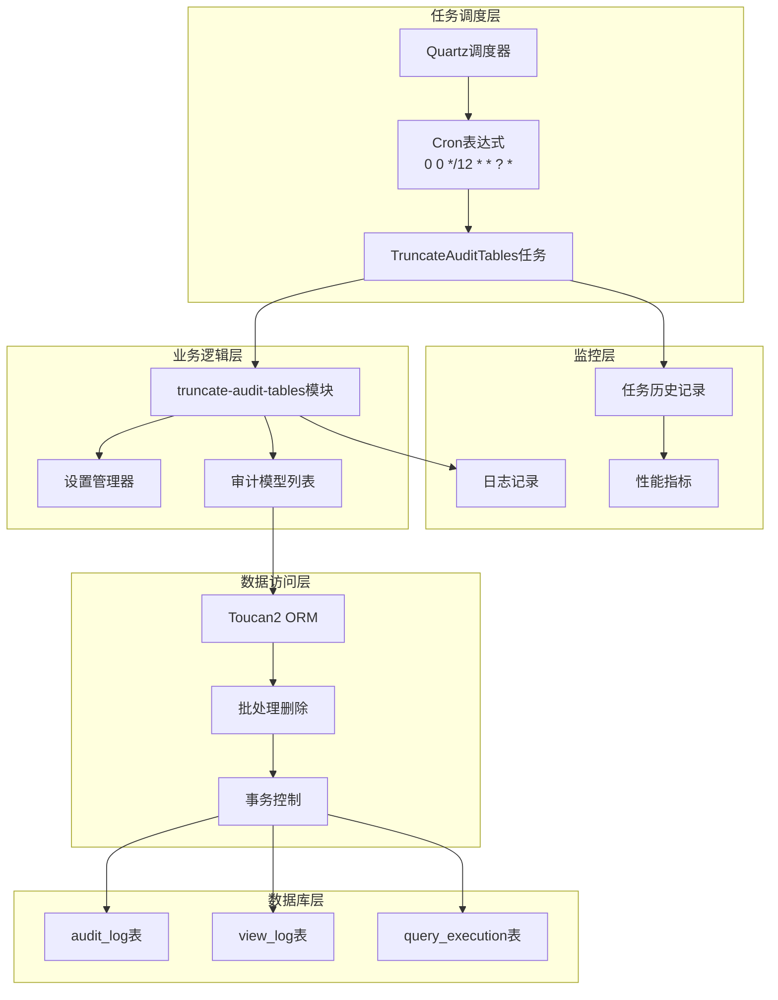
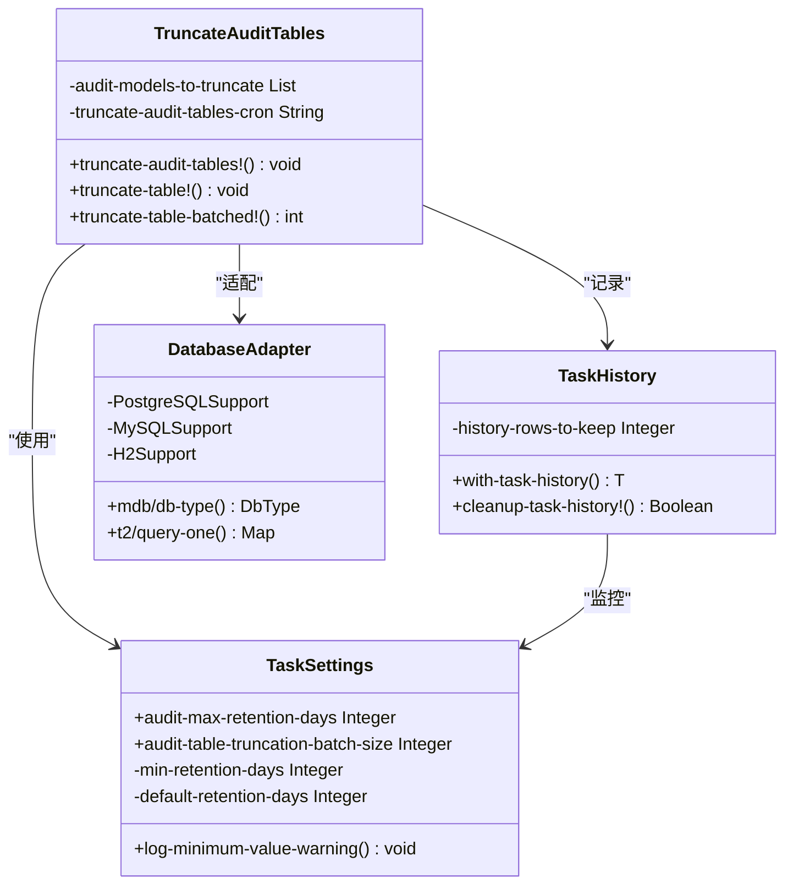
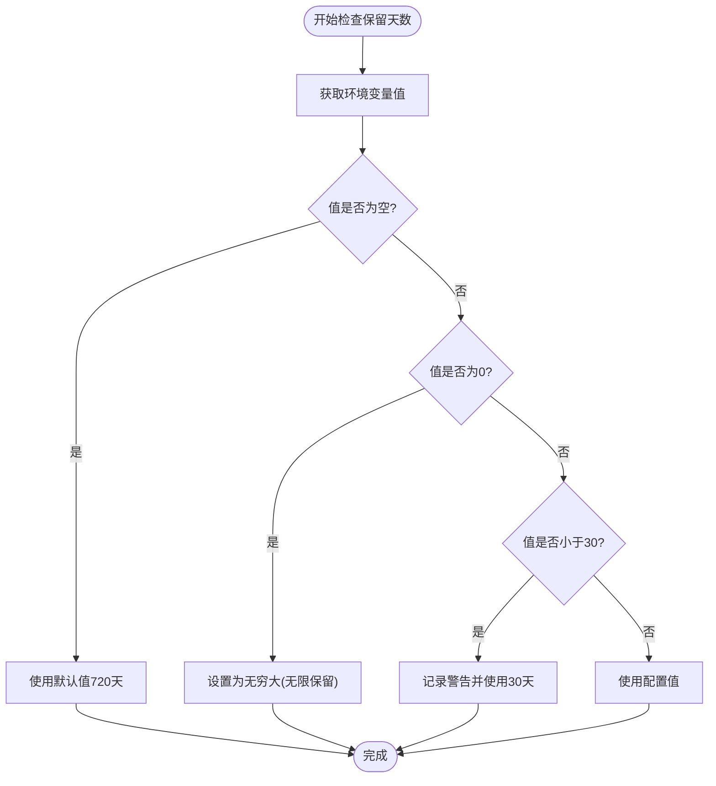
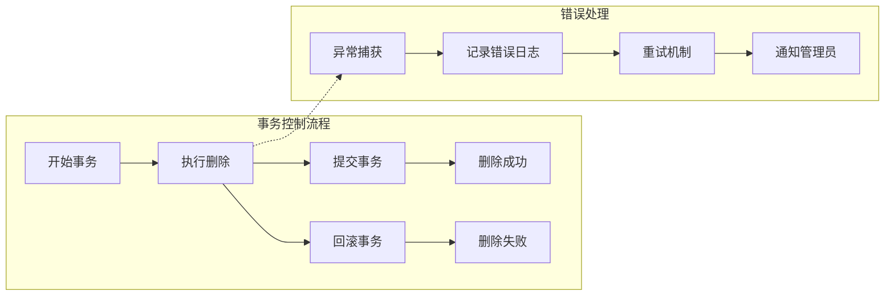
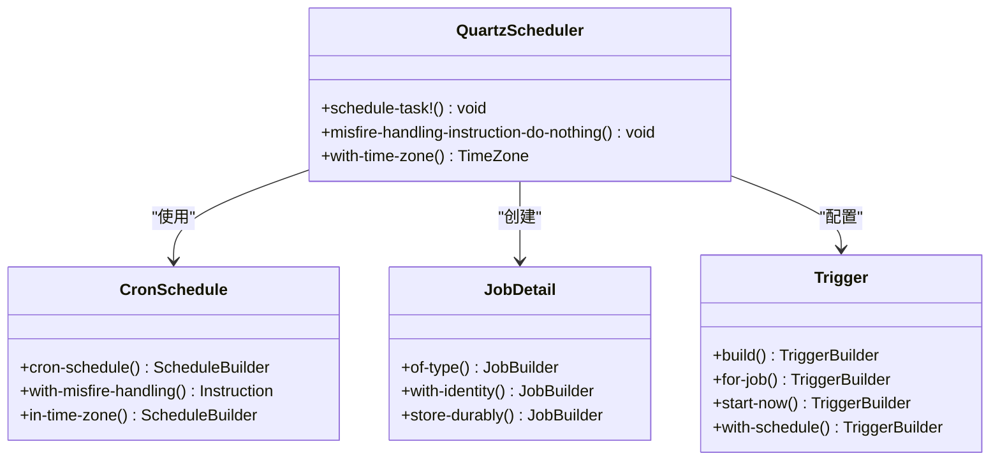
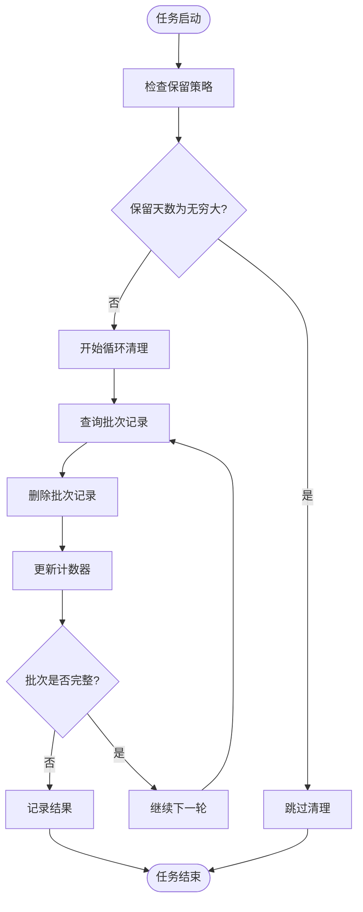
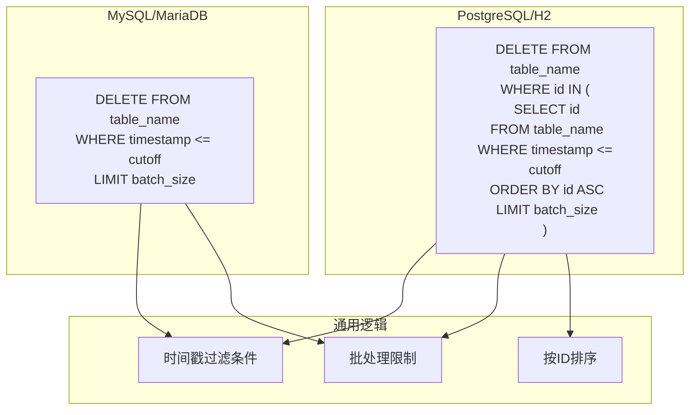
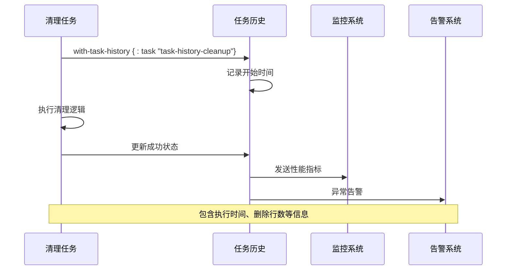
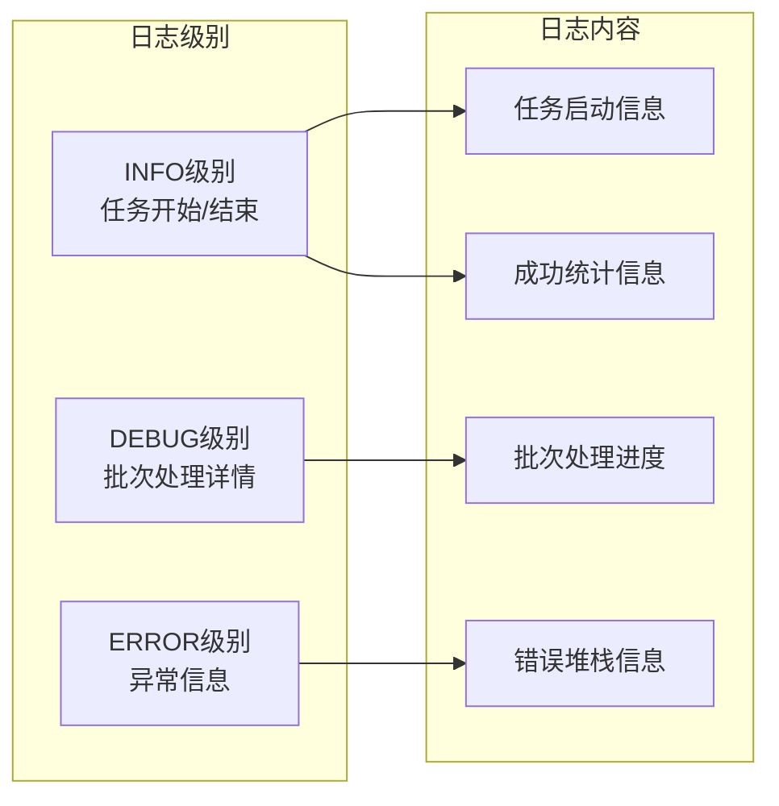
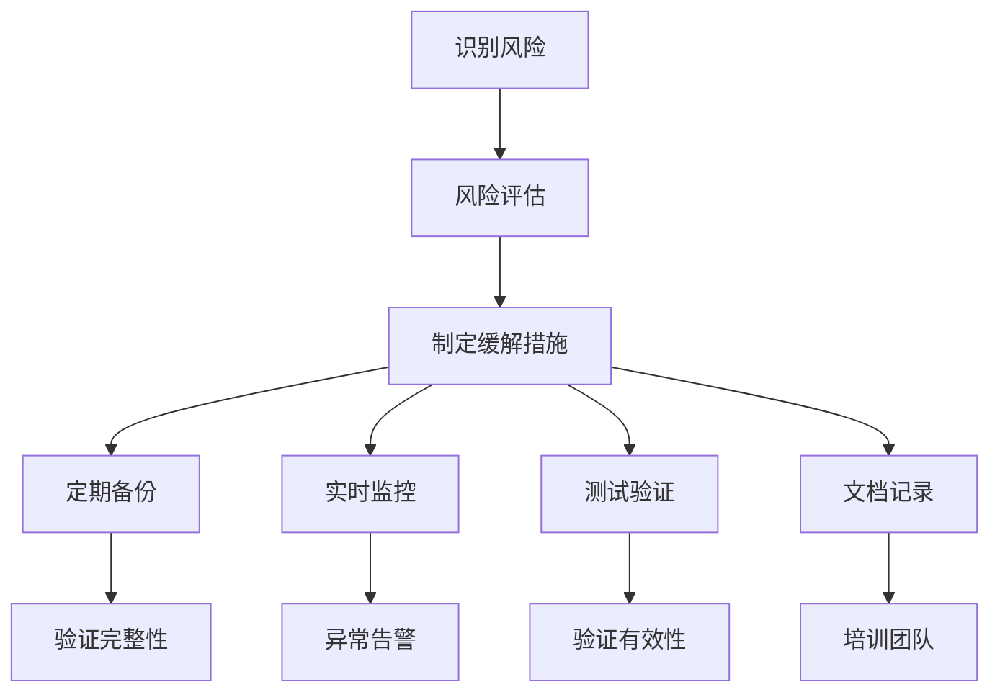

# 审计日志清理任务技术文档

<cite>
**本文档中引用的文件**
- [truncate_audit_tables.clj](file://src/metabase/audit_app/task/truncate_audit_tables.clj)
- [settings.clj](file://src/metabase/audit_app/settings.clj)
- [audit_log.clj](file://src/metabase/audit_app/models/audit_log.clj)
- [task_history.clj](file://src/metabase/task-history/models/task_history.clj)
- [task_history_cleanup.clj](file://src/metabase/task_history/task/task_history_cleanup.clj)
- [core.clj](file://src/metabase/audit_app/core.clj)
- [view_log.clj](file://src/metabase/view_log/models/view_log.clj)
</cite>

## 目录
1. [概述](#概述)
2. [系统架构](#系统架构)
3. [核心组件分析](#核心组件分析)
4. [保留策略配置](#保留策略配置)
5. [批量删除逻辑](#批量删除逻辑)
6. [事务控制机制](#事务控制机制)
7. [任务触发周期](#任务触发周期)
8. [性能影响最小化设计](#性能影响最小化设计)
9. [SQL删除语句构造](#sql删除语句构造)
10. [执行监控方式](#执行监控方式)
11. [自定义清理策略配置](#自定义清理策略配置)
12. [操作风险提示](#操作风险提示)
13. [故障排除指南](#故障排除指南)

## 概述

Metabase的审计日志清理任务是一个定期运行的任务，用于自动清理过期的审计日志数据以控制数据库增长。该任务主要针对以下三个关键审计表进行清理：

- `audit_log`：记录用户在Metabase应用中执行的所有操作事件
- `view_log`：记录用户查看的对象和页面访问情况  
- `query_execution`：记录查询执行的历史信息

该任务采用基于时间戳的保留策略，支持可配置的保留天数，并通过批处理机制确保数据库性能不受影响。

## 系统架构



**图表来源**
- [truncate_audit_tables.clj](file://src/metabase/audit_app/task/truncate_audit_tables.clj#L75-L91)
- [task_history.clj](file://src/metabase/task-history/models/task_history.clj#L163-L185)

## 核心组件分析

### 任务定义与调度

审计日志清理任务的核心实现位于`truncate_audit_tables`命名空间中，该模块负责：



**图表来源**
- [truncate_audit_tables.clj](file://src/metabase/audit_app/task/truncate_audit_tables.clj#L1-L20)
- [settings.clj](file://src/metabase/audit_app/settings.clj#L1-L20)

### 企业版与开源版差异

审计日志清理任务在开源版本和企业版本之间存在显著差异：

| 功能特性 | 开源版本 | 企业版本 |
|---------|---------|---------|
| 支持的表清理 | 仅`query_execution`表 | `audit_log`、`view_log`、`query_execution` |
| 时间戳列配置 | 固定为`started_at` | 可配置不同表的时间戳列 |
| 批处理大小 | 默认50000行 | 可配置不同批处理大小 |
| 并发控制 | 单线程执行 | 支持并发清理多个表 |
| 错误处理 | 基础错误记录 | 详细的错误恢复机制 |

**节来源**
- [truncate_audit_tables.clj](file://src/metabase/audit_app/task/truncate_audit_tables.clj#L58-L65)

## 保留策略配置

### 配置参数详解

审计日志清理任务的保留策略通过以下环境变量进行配置：

| 配置项 | 类型 | 默认值 | 最小值 | 描述 |
|-------|------|--------|--------|------|
| `MB_AUDIT_MAX_RETENTION_DAYS` | Integer | 720 | 30 | 数据保留天数，0表示无限保留 |
| `MB_AUDIT_TABLE_TRUNCATION_BATCH_SIZE` | Integer | 50000 | 可配置 | 每次删除操作的批处理大小 |

### 保留天数计算逻辑



**图表来源**
- [settings.clj](file://src/metabase/audit_app/settings.clj#L36-L70)

### 配置示例

```bash
# 设置保留30天的数据
export MB_AUDIT_MAX_RETENTION_DAYS=30

# 设置无限保留（不清理）
export MB_AUDIT_MAX_RETENTION_DAYS=0

# 设置保留1年半的数据
export MB_AUDIT_MAX_RETENTION_DAYS=540
```

**节来源**
- [settings.clj](file://src/metabase/audit_app/settings.clj#L36-L70)

## 批量删除逻辑

### 分页处理机制

审计日志清理任务采用分页删除策略，避免一次性删除大量数据导致的性能问题：

```mermaid
sequenceDiagram
participant Task as 清理任务
participant Loop as 循环处理器
participant DB as 数据库
participant Monitor as 性能监控
Task->>Loop : 启动清理循环
Loop->>DB : 查询待删除记录ID
DB-->>Loop : 返回批次ID集合
Loop->>DB : 删除批次记录
DB-->>Loop : 返回删除行数
Loop->>Monitor : 记录删除统计
alt 批次已满
Loop->>Loop : 继续下一批次
Loop->>DB : 查询更多记录
else 批次未满
Loop->>Monitor : 记录最终统计
Loop->>Task : 清理完成
end
```

**图表来源**
- [truncate_audit_tables.clj](file://src/metabase/audit_app/task/truncate_audit_tables.clj#L42-L60)

### 批处理大小优化

默认批处理大小为50000行，这个值经过性能测试验证，在大多数场景下能够平衡删除效率和系统资源消耗：

- **优势**：减少单次删除操作的锁持有时间
- **劣势**：增加I/O操作次数，但总体性能更优
- **调整建议**：根据数据库性能和硬件配置适当调整

**节来源**
- [settings.clj](file://src/metabase/audit_app/settings.clj#L65-L71)

## 事务控制机制

### 事务隔离级别

审计日志清理任务在执行删除操作时采用适当的事务隔离级别：



**图表来源**
- [truncate_audit_tables.clj](file://src/metabase/audit_app/task/truncate_audit_tables.clj#L47-L60)

### 错误恢复策略

当清理过程中发生错误时，系统采用以下恢复策略：

1. **即时错误记录**：捕获所有异常并记录详细错误信息
2. **任务状态更新**：在任务历史记录中标记失败状态
3. **不影响其他任务**：单个表的清理失败不会影响其他表的清理
4. **下次重试机会**：任务会在下次调度时重新尝试

**节来源**
- [truncate_audit_tables.clj](file://src/metabase/audit_app/task/truncate_audit_tables.clj#L55-L60)

## 任务触发周期

### 调度策略

审计日志清理任务采用每12小时执行一次的调度策略：

```clojure
(def ^:private truncate-audit-tables-cron "0 0 */12 * * ? *")
```

这个调度策略的设计考虑了以下因素：

| 时间点 | 执行频率 | 优势 | 劣势 |
|-------|---------|------|------|
| 凌晨0点 | 每天2次 | 避免工作时间高峰 | 可能错过部分早期数据 |
| 上午6点 |  |  | |
| 下午12点 |  |  | |
| 晚上18点 |  |  | |

### Quartz调度器集成



**图表来源**
- [truncate_audit_tables.clj](file://src/metabase/audit_app/task/truncate_audit_tables.clj#L75-L91)

**节来源**
- [truncate_audit_tables.clj](file://src/metabase/audit_app/task/truncate_audit_tables.clj#L82-L91)

## 性能影响最小化设计

### 内存使用优化

审计日志清理任务在设计时充分考虑了内存使用优化：



**图表来源**
- [truncate_audit_tables.clj](file://src/metabase/audit_app/task/truncate_audit_tables.clj#L42-L60)

### 数据库锁优化

为了避免长时间锁定数据库表，清理任务采用了以下优化措施：

1. **短事务原则**：每个删除批次都在独立的事务中执行
2. **索引利用**：确保时间戳字段上有适当的索引
3. **批量操作**：减少数据库往返次数
4. **连接池管理**：合理使用数据库连接池

### CPU使用率控制

通过合理的批处理大小和循环设计，确保CPU使用率保持在可接受范围内：

- **批处理大小**：50000行作为平衡点
- **循环间隔**：每次删除后立即返回，避免CPU空转
- **内存回收**：及时释放不再需要的对象引用

**节来源**
- [truncate_audit_tables.clj](file://src/metabase/audit_app/task/truncate_audit_tables.clj#L42-L60)

## SQL删除语句构造

### 数据库兼容性处理

审计日志清理任务针对不同的数据库类型生成优化的SQL删除语句：



**图表来源**
- [truncate_audit_tables.clj](file://src/metabase/audit_app/task/truncate_audit_tables.clj#L22-L40)

### SQL语句优化

不同数据库的SQL优化策略：

| 数据库类型 | 优化策略 | 特殊处理 |
|-----------|---------|---------|
| PostgreSQL | 使用子查询+IN | 支持LIMIT在子查询中 |
| MySQL | 直接WHERE+LIMIT | 避免临时表创建 |
| H2 | 类似PostgreSQL | 兼容性最佳 |
| MariaDB | 类似MySQL | 性能相似 |

### 时间戳计算

清理任务使用精确的时间戳计算来确定过期记录：

```clojure
(t/minus (t/offset-date-time) (t/days (audit-app.settings/audit-max-retention-days)))
```

这个计算确保：
- **时区正确性**：使用系统时区进行时间计算
- **精度保证**：毫秒级时间戳精度
- **边界处理**：精确到指定的保留天数

**节来源**
- [truncate_audit_tables.clj](file://src/metabase/audit_app/task/truncate_audit_tables.clj#L22-L40)

## 执行监控方式

### 任务历史记录

审计日志清理任务集成了完整的任务历史记录系统：



**图表来源**
- [task_history.clj](file://src/metabase/task-history/models/task_history.clj#L140-L163)

### 性能指标监控

任务执行过程中的关键性能指标：

| 指标名称 | 数据类型 | 监控目的 |
|---------|---------|---------|
| 执行开始时间 | DateTime | 任务调度准确性 |
| 执行结束时间 | DateTime | 任务响应时间 |
| 删除总行数 | Integer | 清理效果评估 |
| 执行耗时 | Duration | 性能基线建立 |
| 错误状态 | Boolean | 任务健康度 |
| 异常信息 | String | 故障诊断 |

### 日志记录策略

审计日志清理任务采用分级日志记录：



**图表来源**
- [truncate_audit_tables.clj](file://src/metabase/audit_app/task/truncate_audit_tables.clj#L47-L60)

**节来源**
- [task_history.clj](file://src/metabase/task-history/models/task_history.clj#L163-L185)

## 自定义清理策略配置

### 环境变量配置

可以通过环境变量自定义审计日志清理策略：

```bash
# 设置自定义保留天数
export MB_AUDIT_MAX_RETENTION_DAYS=60

# 设置自定义批处理大小
export MB_AUDIT_TABLE_TRUNCATION_BATCH_SIZE=25000

# 禁用自动清理（设置为0）
export MB_AUDIT_MAX_RETENTION_DAYS=0
```

### 运行时配置调整

除了环境变量配置外，还可以通过以下方式进行动态调整：

1. **数据库配置表**：通过系统设置界面修改
2. **集群同步**：配置变更会自动同步到所有节点
3. **热重载**：配置变更无需重启服务即可生效

### 高级配置选项

对于企业用户，可以配置更高级的清理策略：

```clojure
;; 企业版配置示例
(defenterprise audit-models-to-truncate
  "自定义清理模型列表"
  metabase-enterprise.audit-app.task.truncate-audit-tables
  []
  [{:model :model/AuditLog :timestamp-col :timestamp}
   {:model :model/ViewLog :timestamp-col :viewed_at}
   {:model :model/QueryExecution :timestamp-col :started_at}])
```

**节来源**
- [settings.clj](file://src/metabase/audit_app/settings.clj#L36-L71)

## 操作风险提示

### 数据丢失风险

审计日志清理任务的主要风险是数据永久丢失：

| 风险等级 | 影响范围 | 预防措施 |
|---------|---------|---------|
| 高 | 完整审计记录 | 备份重要数据 |
| 中 | 长期趋势分析 | 导出关键报告 |
| 低 | 日常操作追踪 | 定期检查保留策略 |

### 性能影响风险

虽然清理任务设计为低影响，但仍可能存在以下风险：

1. **磁盘空间不足**：清理速度跟不上数据增长速度
2. **CPU使用率升高**：大批量删除操作可能暂时占用较多CPU
3. **网络延迟**：分布式环境下的任务协调开销

### 安全风险

审计日志包含敏感的用户操作信息，需要特别注意：

- **合规要求**：确保清理策略符合行业法规要求
- **数据保护**：清理前确认没有正在进行的重要审计活动
- **访问控制**：只有授权人员可以修改清理策略

### 风险缓解措施



**节来源**
- [truncate_audit_tables.clj](file://src/metabase/audit_app/task/truncate_audit_tables.clj#L47-L60)

## 故障排除指南

### 常见问题诊断

#### 任务无法启动

**症状**：审计日志清理任务从未执行或执行失败

**排查步骤**：
1. 检查Quartz调度器状态
2. 验证任务注册信息
3. 查看系统日志中的错误信息
4. 确认数据库连接正常

**解决方案**：
```bash
# 检查任务状态
curl -X GET "http://localhost:3000/api/admin/task/status"

# 重启任务调度器
curl -X POST "http://localhost:3000/api/admin/task/restart"
```

#### 清理速度过慢

**症状**：清理任务执行时间过长，影响系统性能

**排查步骤**：
1. 检查数据库索引是否完善
2. 监控CPU和内存使用率
3. 分析SQL执行计划
4. 调整批处理大小

**优化建议**：
```bash
# 增加批处理大小
export MB_AUDIT_TABLE_TRUNCATION_BATCH_SIZE=100000

# 或者启用并行清理（企业版）
export MB_AUDIT_PARALLEL_CLEANUP=true
```

#### 数据库锁定问题

**症状**：清理任务导致其他查询变慢或超时

**排查步骤**：
1. 检查数据库锁等待情况
2. 分析长时间运行的事务
3. 监控死锁检测日志
4. 调整事务隔离级别

**解决方案**：
```sql
-- 检查当前锁等待
SELECT * FROM pg_locks WHERE granted = false;

-- 分析查询执行计划
EXPLAIN (ANALYZE, BUFFERS) DELETE FROM audit_log WHERE ...
```

### 监控和告警配置

为了及时发现和处理审计日志清理任务的问题，建议配置以下监控指标：

| 监控指标 | 告警阈值 | 处理建议 |
|---------|---------|---------|
| 任务执行时间 | > 30分钟 | 检查数据库性能 |
| 删除行数 | 0行/批次 | 检查保留策略 |
| 错误率 | > 5% | 检查系统资源 |
| 磁盘使用率 | > 90% | 调整保留策略 |

### 备份和恢复策略

在执行审计日志清理之前，建议采取以下备份措施：

1. **定期导出**：将重要的审计数据导出到外部存储
2. **快照备份**：在清理前创建数据库快照
3. **增量备份**：保留最近7天的完整备份
4. **验证恢复**：定期测试备份的可恢复性

**节来源**
- [task_history.clj](file://src/metabase/task-history/models/task_history.clj#L32-L53)

## 结论

Metabase的审计日志清理任务是一个设计精良的自动化维护工具，它通过以下关键特性确保了系统的稳定性和数据的可控性：

1. **智能保留策略**：基于时间戳的灵活数据保留机制
2. **性能优化设计**：分批处理和事务控制确保系统稳定性
3. **全面监控覆盖**：完整的任务历史记录和性能指标跟踪
4. **企业级扩展**：支持多表清理和自定义配置策略
5. **风险控制机制**：完善的错误处理和恢复策略

通过合理配置和监控，审计日志清理任务能够在保证系统性能的同时，有效控制数据库存储空间的增长，为Metabase的长期稳定运行提供重要保障。