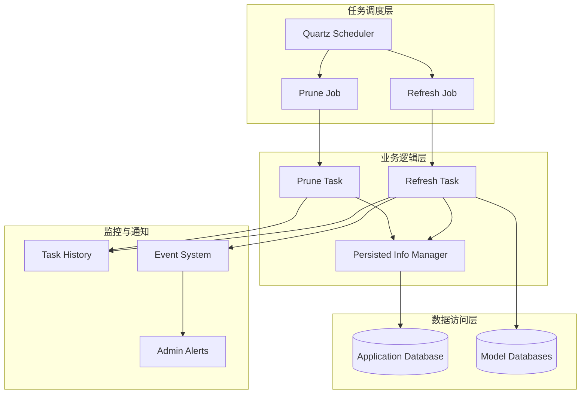
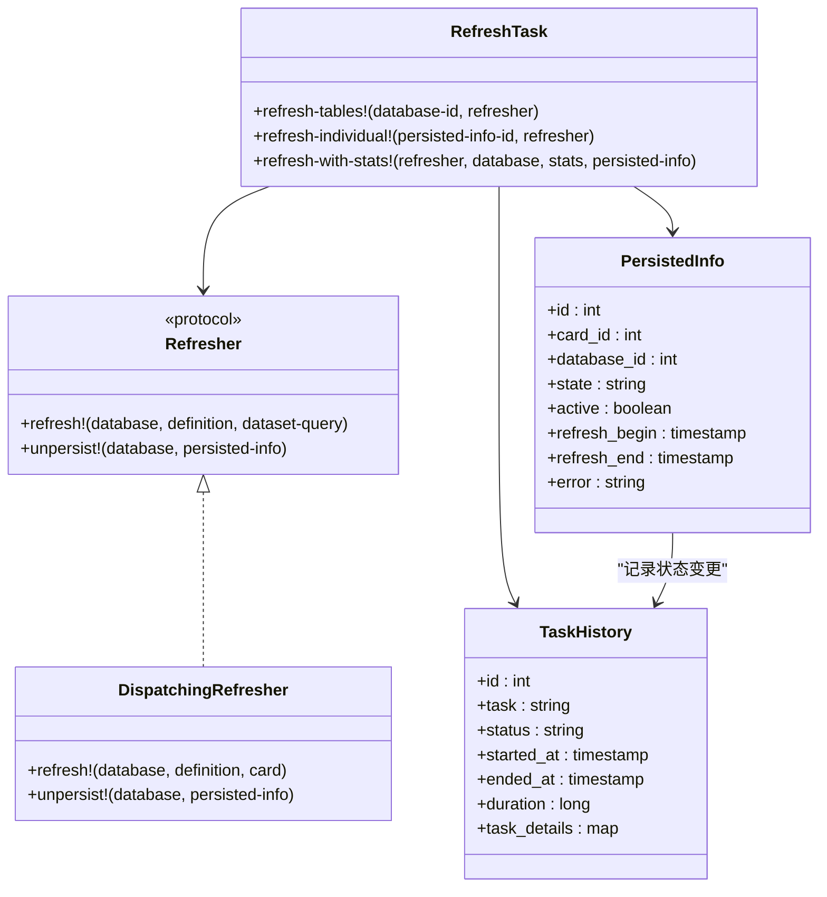
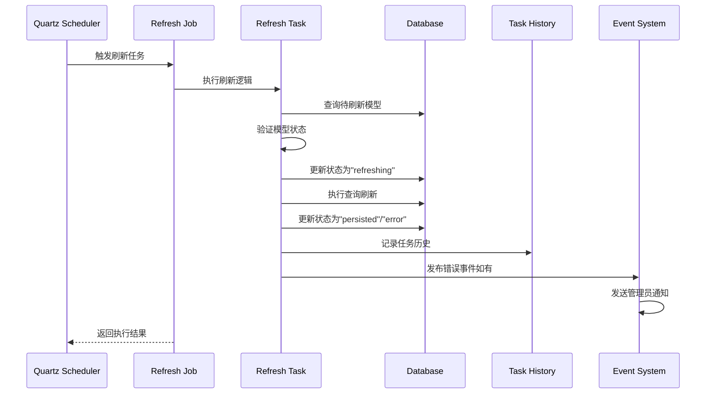
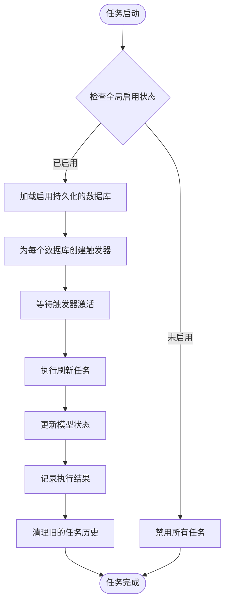
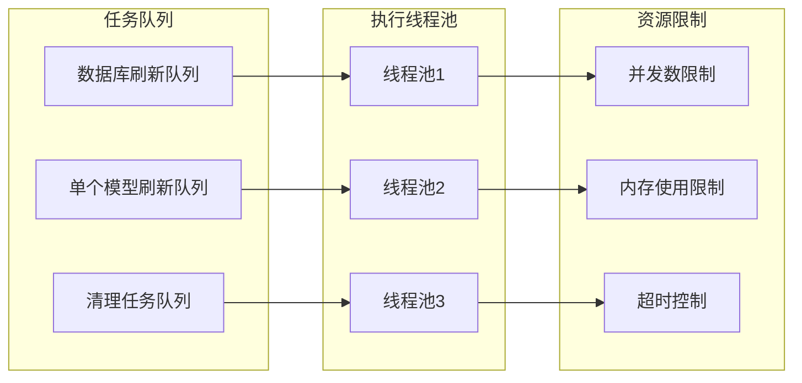
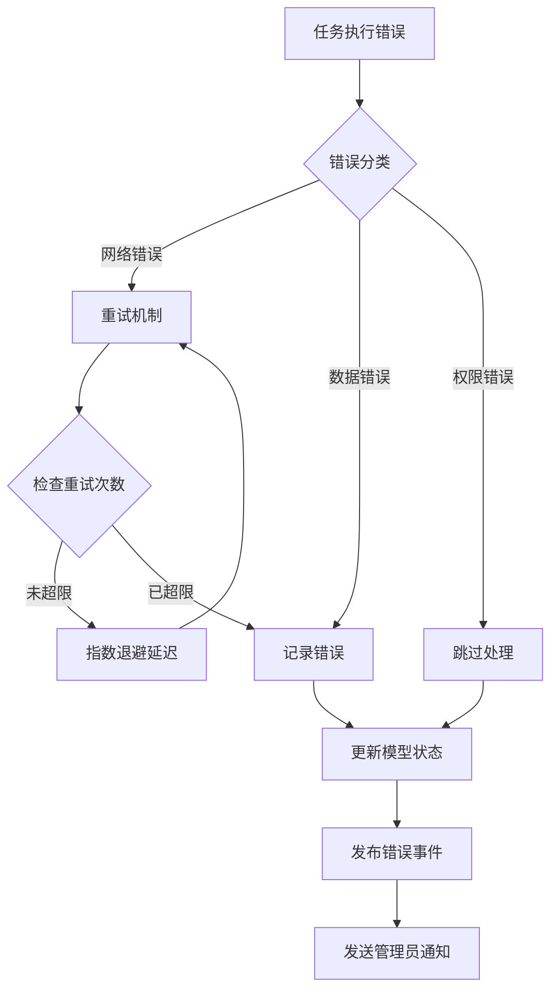
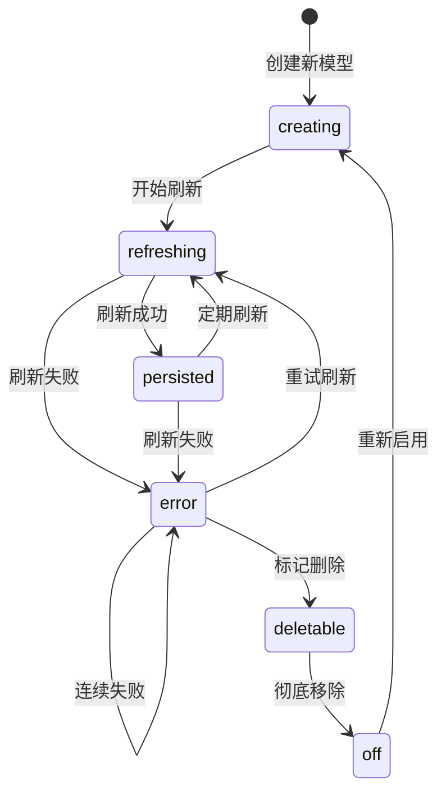
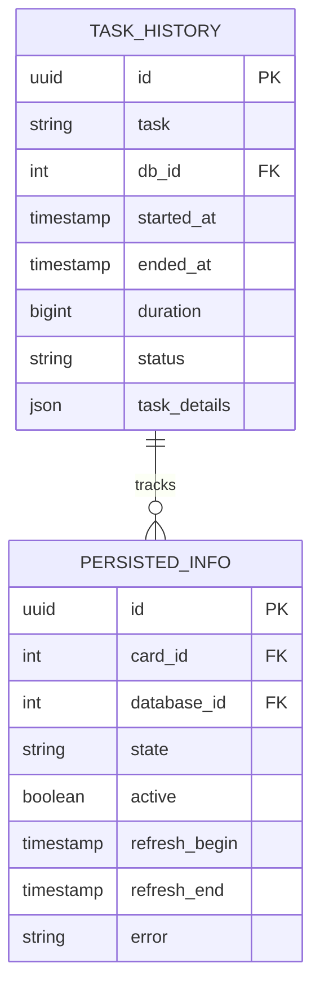
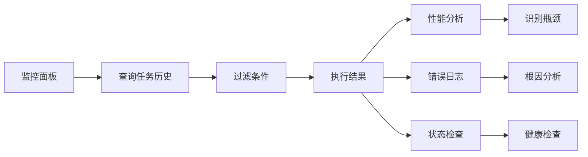

# 模型持久化刷新任务参考文档

<cite>
**本文档中引用的文件**
- [persist_refresh.clj](file://src/metabase/model_persistence/task/persist_refresh.clj)
- [persisted_info.clj](file://src/metabase/model_persistence/models/persisted_info.clj)
- [persisted_model_refresh_error.clj](file://src/metabase/model_persistence/events/persisted_model_refresh_error.clj)
- [settings.clj](file://src/metabase/model_persistence/settings.clj)
- [api.clj](file://src/metabase/model_persistence/api.clj)
- [task_history.clj](file://src/metabase/task-history/models/task_history.clj)
- [core.clj](file://src/metabase/task/core.clj)
</cite>

## 目录
1. [概述](#概述)
2. [系统架构](#系统架构)
3. [核心组件分析](#核心组件分析)
4. [刷新调度机制](#刷新调度机制)
5. [资源分配与并发控制](#资源分配与并发控制)
6. [失败恢复逻辑](#失败恢复逻辑)
7. [监控与诊断](#监控与诊断)
8. [操作指南](#操作指南)
9. [故障排除](#故障排除)
10. [最佳实践](#最佳实践)

## 概述

模型持久化刷新任务是Metabase中负责自动更新和刷新持久化模型（Pivoted Models）数据的核心组件。该任务确保缓存数据的时效性，通过定期或按需的方式从源数据库重新计算和存储模型结果，为用户提供最新的分析数据。

### 主要功能特性

- **自动刷新调度**：基于Cron表达式的定时任务调度
- **并行处理**：支持多数据库并发刷新
- **状态管理**：完整的生命周期状态跟踪
- **错误处理**：智能的失败恢复和通知机制
- **监控集成**：与任务历史系统深度集成
- **灵活配置**：可调整的刷新频率和调度策略

## 系统架构



**图表来源**
- [persist_refresh.clj](file://src/metabase/model_persistence/task/persist_refresh.clj#L228-L264)
- [task_history.clj](file://src/metabase/task-history/models/task_history.clj#L140-L163)

## 核心组件分析

### 刷新任务核心类图



**图表来源**
- [persist_refresh.clj](file://src/metabase/model_persistence/task/persist_refresh.clj#L40-L55)
- [persisted_info.clj](file://src/metabase/model_persistence/models/persisted_info.clj#L1-L50)

### 任务生命周期流程



**图表来源**
- [persist_refresh.clj](file://src/metabase/model_persistence/task/persist_refresh.clj#L180-L231)
- [task_history.clj](file://src/metabase/task-history/models/task_history.clj#L140-L185)

**章节来源**
- [persist_refresh.clj](file://src/metabase/model_persistence/task/persist_refresh.clj#L1-L447)
- [persisted_info.clj](file://src/metabase/model_persistence/models/persisted_info.clj#L1-L201)

## 刷新调度机制

### 调度器配置

模型持久化刷新任务使用Quartz调度器实现精确的时间控制：

| 调度类型 | 触发器名称 | 执行频率 | 描述 |
|---------|-----------|----------|------|
| 数据库刷新 | `PersistenceRefresh` | 可配置Cron | 定期刷新指定数据库的所有模型 |
| 单个模型刷新 | `PersistenceRefresh` | 立即触发 | 按需刷新特定模型 |
| 清理任务 | `PersistencePrune` | 每小时一次 | 清理标记为删除的模型 |

### Cron表达式配置

默认刷新间隔为每6小时一次，可通过设置进行调整：

```clojure
(defsetting persisted-model-refresh-cron-schedule
  "cron语法字符串用于调度刷新持久化模型"
  :type :string
  :default "0 0 0/6 * * ? *")
```

### 调度策略



**图表来源**
- [persist_refresh.clj](file://src/metabase/model_persistence/task/persist_refresh.clj#L387-L445)
- [settings.clj](file://src/metabase/model_persistence/settings.clj#L15-L20)

**章节来源**
- [persist_refresh.clj](file://src/metabase/model_persistence/task/persist_refresh.clj#L261-L330)
- [settings.clj](file://src/metabase/model_persistence/settings.clj#L1-L28)

## 资源分配与并发控制

### 并发控制机制

任务系统采用以下并发控制策略：

1. **互斥执行**：每个任务类型使用`DisallowConcurrentExecution`注解
2. **数据库隔离**：不同数据库的刷新任务并行执行
3. **状态锁定**：通过状态字段防止重复执行

### 资源池管理



### 性能优化策略

| 优化策略 | 实现方式 | 效果 |
|---------|----------|------|
| 批量处理 | 分组处理多个模型 | 减少数据库连接开销 |
| 状态预检查 | 执行前验证模型状态 | 避免无效操作 |
| 异步通知 | 后台发送错误邮件 | 不阻塞主流程 |
| 缓存利用 | 复用数据库连接 | 提高响应速度 |

**章节来源**
- [persist_refresh.clj](file://src/metabase/model_persistence/task/persist_refresh.clj#L228-L264)

## 失败恢复逻辑

### 错误处理层次结构



**图表来源**
- [persist_refresh.clj](file://src/metabase/model_persistence/task/persist_refresh.clj#L73-L100)
- [persisted_model_refresh_error.clj](file://src/metabase/model_persistence/events/persisted_model_refresh_error.clj#L1-L29)

### 错误恢复策略

| 错误类型 | 恢复策略 | 重试次数 | 延迟时间 |
|---------|----------|----------|----------|
| 网络连接超时 | 自动重试 | 3次 | 1s → 2s → 4s |
| 数据库锁定 | 跳过当前 | 无限制 | 等待解锁 |
| 权限不足 | 标记失败 | 1次 | 立即 |
| 查询超时 | 重试一次 | 1次 | 2倍原时间 |

### 状态转换规则



**图表来源**
- [persisted_info.clj](file://src/metabase/model_persistence/models/persisted_info.clj#L80-L120)

**章节来源**
- [persist_refresh.clj](file://src/metabase/model_persistence/task/persist_refresh.clj#L73-L122)
- [persisted_info.clj](file://src/metabase/model_persistence/models/persisted_info.clj#L140-L180)

## 监控与诊断

### 任务历史监控

任务历史系统提供完整的执行记录和性能指标：



**图表来源**
- [task_history.clj](file://src/metabase/task-history/models/task_history.clj#L117-L141)

### 关键监控指标

| 指标类别 | 具体指标 | 监控方法 | 告警阈值 |
|---------|----------|----------|----------|
| 执行频率 | 刷新成功率 | 任务历史统计 | < 95% |
| 性能指标 | 平均执行时间 | 时间序列分析 | > 30分钟 |
| 错误率 | 失败模型数量 | 错误事件统计 | > 5个/批次 |
| 资源使用 | 内存占用 | 系统监控 | > 80% |

### 诊断工具



**章节来源**
- [task_history.clj](file://src/metabase/task-history/models/task_history.clj#L94-L117)
- [api.clj](file://src/metabase/model_persistence/api.clj#L40-L80)

## 操作指南

### 启用持久化功能

1. **全局启用**：
   ```bash
   curl -X POST /api/model-persistence/enable \
        -H "Authorization: Bearer $TOKEN"
   ```

2. **数据库级别启用**：
   ```bash
   curl -X POST /api/model-persistence/database/{id}/persist \
        -H "Authorization: Bearer $TOKEN"
   ```

### 调整刷新频率

```bash
curl -X POST /api/model-persistence/set-refresh-schedule \
     -H "Content-Type: application/json" \
     -H "Authorization: Bearer $TOKEN" \
     -d '{"cron": "0 0 */4 * * ? *"}'
```

### 手动刷新模型

```bash
curl -X POST /api/model-persistence/card/{card-id}/refresh \
     -H "Authorization: Bearer $TOKEN"
```

### 禁用持久化

```bash
curl -X POST /api/model-persistence/disable \
     -H "Authorization: Bearer $TOKEN"
```

### 配置参数说明

| 参数名称 | 默认值 | 描述 | 修改建议 |
|---------|--------|------|----------|
| `persisted-models-enabled` | false | 全局功能开关 | 生产环境谨慎开启 |
| `persisted-model-refresh-cron-schedule` | "0 0 0/6 * * ? *" | 刷新Cron表达式 | 根据数据变化频率调整 |
| `persist-models-enabled` | false | 数据库级开关 | 按需启用 |

**章节来源**
- [api.clj](file://src/metabase/model_persistence/api.clj#L120-L260)
- [settings.clj](file://src/metabase/model_persistence/settings.clj#L1-L28)

## 故障排除

### 常见问题诊断

#### 1. 刷新任务不执行

**症状**：模型长时间未刷新，任务历史显示无执行记录

**排查步骤**：
1. 检查全局功能是否启用
2. 验证数据库是否已启用持久化
3. 确认Cron调度是否正确
4. 检查Quartz调度器状态

**解决方案**：
```clojure
;; 重新调度所有任务
(reschedule-refresh!)
(enable-persisting!)
```

#### 2. 刷新频繁失败

**症状**：大量模型刷新失败，错误信息重复出现

**排查步骤**：
1. 检查数据库连接状态
2. 验证模型查询语句
3. 查看系统资源使用情况
4. 检查权限配置

**解决方案**：
- 调整重试策略
- 优化查询性能
- 增加系统资源

#### 3. 内存使用过高

**症状**：任务执行期间内存占用持续上升

**排查步骤**：
1. 分析任务执行时间
2. 检查数据量大小
3. 监控垃圾回收情况
4. 查看并发度设置

**解决方案**：
- 减少并发刷新数量
- 优化查询分页
- 增加JVM堆内存

### 日志分析指南

关键日志位置：
- 任务执行日志：`metabase.model-persistence.task.persist-refresh`
- 错误事件日志：`metabase.model-persistence.events.persisted-model-refresh-error`
- 任务历史日志：`metabase.task-history.models.task-history`

### 性能调优建议

| 优化方向 | 具体措施 | 预期效果 |
|---------|----------|----------|
| 数据库连接 | 增加连接池大小 | 提高并发处理能力 |
| 查询优化 | 添加索引，优化SQL | 减少查询时间 |
| 内存管理 | 调整JVM参数 | 稳定运行性能 |
| 网络优化 | 使用本地数据库 | 减少网络延迟 |

**章节来源**
- [persist_refresh.clj](file://src/metabase/model_persistence/task/persist_refresh.clj#L387-L445)

## 最佳实践

### 部署建议

1. **生产环境配置**
   - 启用任务历史清理
   - 设置合理的重试策略
   - 监控关键指标
   - 定期备份配置

2. **性能优化**
   - 根据数据量调整刷新频率
   - 使用专用数据库进行持久化
   - 实施查询缓存策略
   - 监控系统资源使用

3. **安全考虑**
   - 限制API访问权限
   - 加密敏感配置
   - 定期审计访问日志
   - 实施最小权限原则

### 监控告警

推荐的监控指标和告警阈值：

| 指标 | 告警阈值 | 处理建议 |
|------|----------|----------|
| 刷新成功率 | < 95% | 检查数据质量和网络 |
| 平均执行时间 | > 30分钟 | 优化查询或增加资源 |
| 失败模型数量 | > 10个/批次 | 分析具体错误原因 |
| 内存使用率 | > 80% | 增加内存或优化查询 |

### 运维流程

1. **日常监控**
   - 检查任务执行状态
   - 监控错误率趋势
   - 验证数据新鲜度

2. **定期维护**
   - 清理过期任务历史
   - 优化数据库索引
   - 更新调度策略

3. **应急响应**
   - 快速定位失败原因
   - 实施临时修复方案
   - 事后分析改进措施

通过遵循这些最佳实践，可以确保模型持久化刷新任务稳定高效地运行，为用户提供可靠的数据服务。