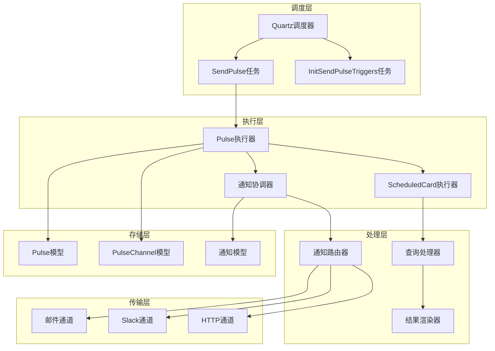
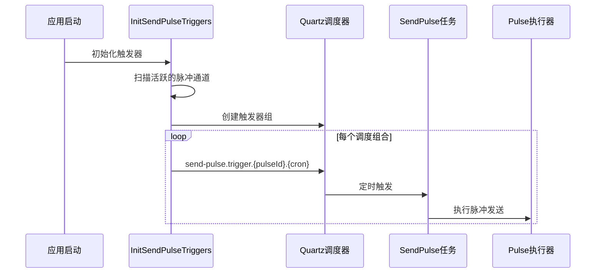
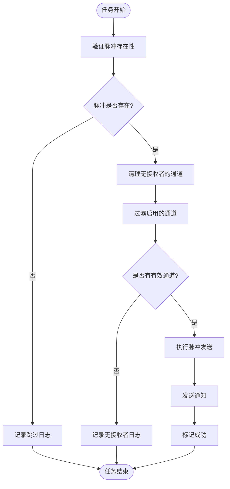
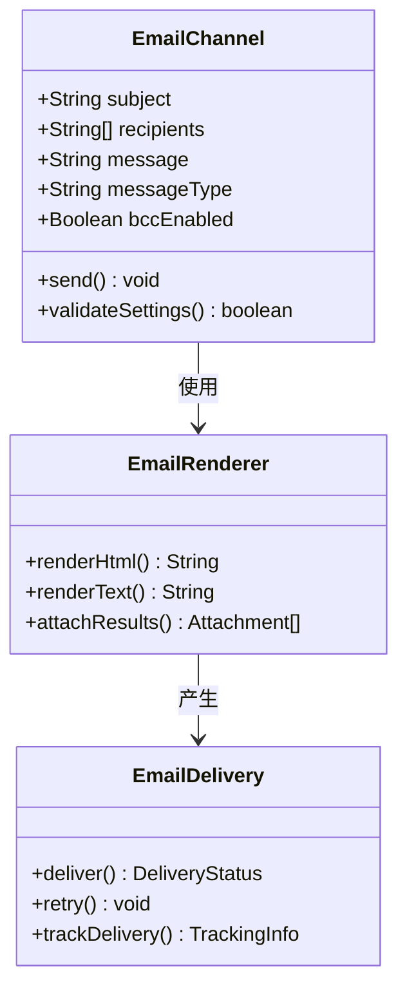
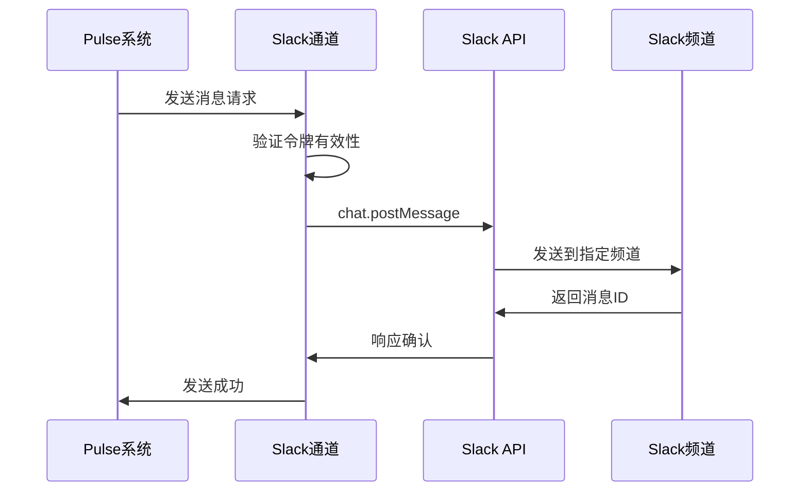
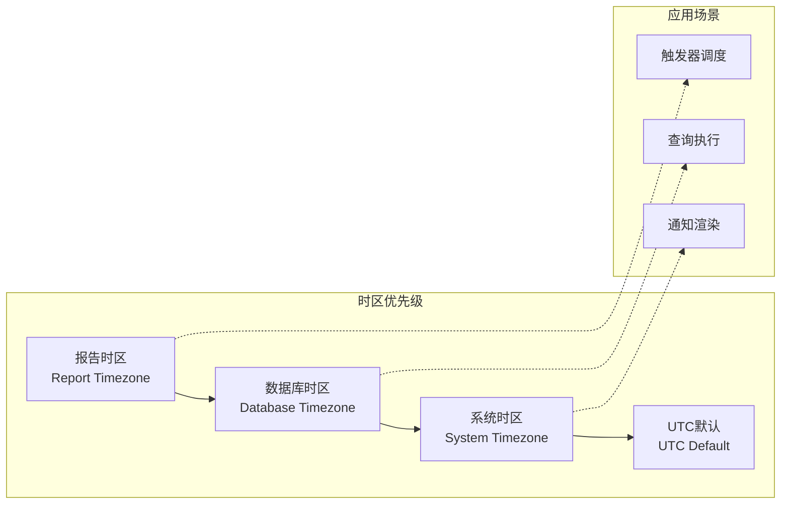
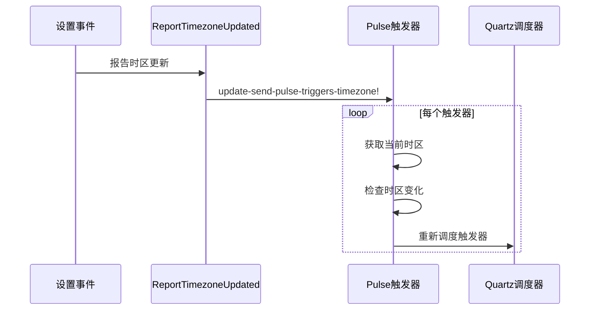
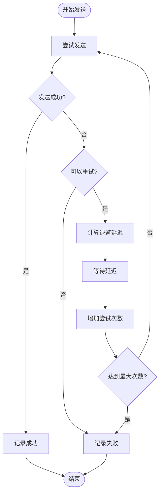
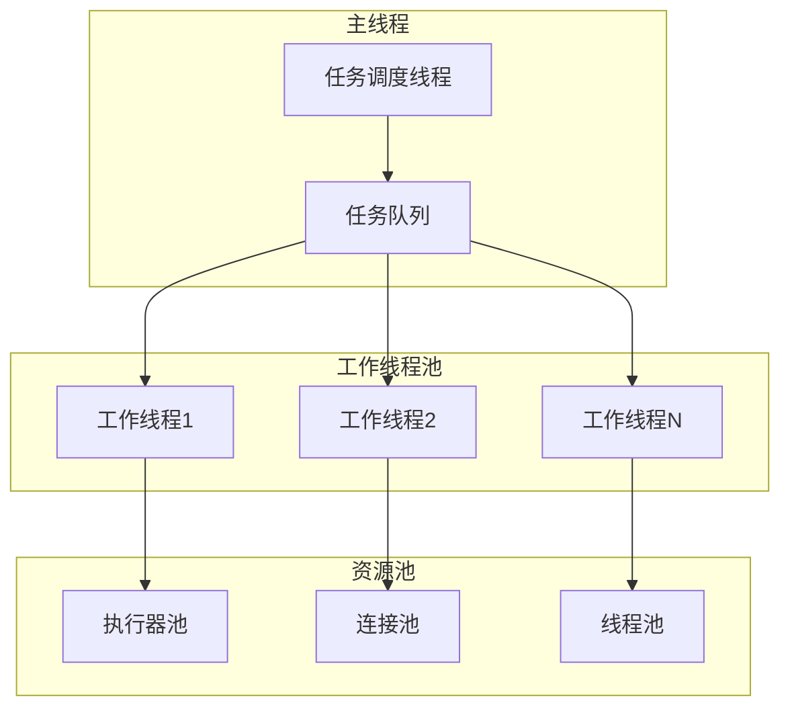
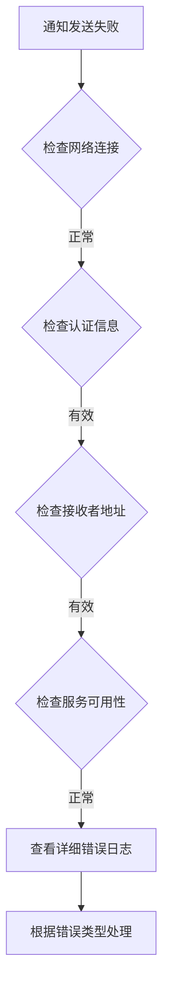

# 脉冲报告推送任务

<cite>
**本文档中引用的文件**
- [send_pulses.clj](file://src/metabase/pulse/task/send_pulses.clj)
- [send.clj](file://src/metabase/pulse/send.clj)
- [pulse_channel.clj](file://src/metabase/pulse/models/pulse_channel.clj)
- [report_timezone_updated.clj](file://src/metabase/pulse/events/report_timezone_updated.clj)
- [send.clj](file://src/metabase/notification/send.clj)
- [email.clj](file://src/metabase/channel/api/email.clj)
- [slack.clj](file://src/metabase/channel/slack.clj)
- [retry.clj](file://src/metabase/util/retry.clj)
- [impl.clj](file://src/metabase/task/impl.clj)
</cite>

## 目录
1. [简介](#简介)
2. [系统架构概览](#系统架构概览)
3. [任务调度机制](#任务调度机制)
4. [脉冲执行流程](#脉冲执行流程)
5. [通知渠道处理](#通知渠道处理)
6. [时区管理与转换](#时区管理与转换)
7. [并发控制与错误处理](#并发控制与错误处理)
8. [性能优化策略](#性能优化策略)
9. [故障排查指南](#故障排查指南)
10. [总结](#总结)

## 简介

Metabase脉冲（Pulse）报告推送系统是一个基于Quartz调度器的定时任务框架，负责按照预设的时间表自动执行数据仪表板订阅并将其结果发送给指定的接收者。该系统支持多种通知渠道（邮件、Slack、Webhook），具备完善的时区处理、并发控制和错误重试机制。

脉冲系统的核心特性包括：
- 基于CRON表达式的精确时间调度
- 多渠道通知支持（邮件、Slack、HTTP）
- 智能时区转换和本地化处理
- 并发安全的任务执行
- 自动重试和错误恢复机制
- 实时监控和状态跟踪

## 系统架构概览

脉冲报告推送系统采用分层架构设计，主要包含以下核心组件：



**图表来源**
- [send_pulses.clj](file://src/metabase/pulse/task/send_pulses.clj#L1-L50)
- [send.clj](file://src/metabase/pulse/send.clj#L1-L30)

**章节来源**
- [send_pulses.clj](file://src/metabase/pulse/task/send_pulses.clj#L1-L269)
- [send.clj](file://src/metabase/pulse/send.clj#L1-L131)

## 任务调度机制

### Quartz调度器集成

脉冲系统基于Quartz调度器实现精确的时间调度，每个脉冲订阅都会在启动时创建对应的触发器：



**图表来源**
- [send_pulses.clj](file://src/metabase/pulse/task/send_pulses.clj#L180-L204)
- [impl.clj](file://src/metabase/task/impl.clj#L104-L130)

### 触发器管理策略

系统采用按脉冲ID和调度时间分组的触发器管理模式：

| 触发器类型 | 键格式 | 描述 | 优先级 |
|------------|--------|------|--------|
| SendPulse | `metabase.task.send-pulse.trigger.{pulseId}.{cron}` | 单个脉冲的定时触发器 | 6 |
| InitSendPulseTriggers | 固定键名 | 启动时初始化所有触发器 | 1 |

触发器的关键配置包括：
- **时间表达式**：基于CRON格式的调度规则
- **时区设置**：支持系统时区和数据库特定时区
- **错失触发处理**：采用`fire-and-proceed`策略
- **并发控制**：通过注解防止任务并发执行

**章节来源**
- [send_pulses.clj](file://src/metabase/pulse/task/send_pulses.clj#L30-L91)
- [send_pulses.clj](file://src/metabase/pulse/task/send_pulses.clj#L131-L154)

## 脉冲执行流程

### 任务执行生命周期

脉冲任务的完整执行流程包含多个阶段，每个阶段都有明确的职责和错误处理机制：



**图表来源**
- [send_pulses.clj](file://src/metabase/pulse/task/send_pulses.clj#L57-L91)
- [send_pulses.clj](file://src/metabase/pulse/task/send_pulses.clj#L110-L131)

### 查询执行与结果处理

脉冲系统支持复杂的查询执行和结果处理：

1. **卡片查询执行**：针对每个脉冲卡片执行相应的数据库查询
2. **结果缓存**：利用查询处理器的缓存机制提高性能
3. **数据格式化**：将原始查询结果转换为适合不同渠道的格式
4. **条件评估**：根据预设的告警条件决定是否发送

**章节来源**
- [send.clj](file://src/metabase/pulse/send.clj#L105-L129)
- [send.clj](file://src/metabase/pulse/send.clj#L129-L131)

## 通知渠道处理

### 邮件通道处理

邮件通道是最常用的脉冲通知方式，支持多种配置选项：



**图表来源**
- [email.clj](file://src/metabase/channel/api/email.clj#L31-L56)
- [send.clj](file://src/metabase/notification/send.clj#L30-L56)

邮件通道的关键特性：
- **SMTP配置**：支持SSL/TLS加密连接
- **批量发送**：支持CC/BCC模式
- **附件处理**：可附加CSV/XLS格式的数据文件
- **模板渲染**：支持HTML和纯文本两种消息格式

### Slack通道处理

Slack通道提供实时团队协作通知：



**图表来源**
- [slack.clj](file://src/metabase/channel/slack.clj#L280-L337)
- [slack.clj](file://src/metabase/channel/slack.clj#L31-L56)

Slack通道的高级功能：
- **频道验证**：自动检查目标频道的存在性
- **用户权限**：验证发送令牌的权限范围
- **文件上传**：支持大文件的分块上传
- **消息块**：使用Slack Block Kit构建富媒体消息

**章节来源**
- [slack.clj](file://src/metabase/channel/slack.clj#L1-L338)
- [email.clj](file://src/metabase/channel/api/email.clj#L1-L56)

## 时区管理与转换

### 多层级时区处理

脉冲系统实现了多层次的时区管理体系，确保全球用户的正确时间计算：



**图表来源**
- [send_pulses.clj](file://src/metabase/pulse/task/send_pulses.clj#L75-L82)
- [report_timezone_updated.clj](file://src/metabase/pulse/events/report_timezone_updated.clj#L1-L14)

### 时区事件响应机制

当系统时区设置发生变化时，脉冲系统会自动更新所有相关触发器：



**图表来源**
- [report_timezone_updated.clj](file://src/metabase/pulse/events/report_timezone_updated.clj#L10-L12)
- [send_pulses.clj](file://src/metabase/pulse/task/send_pulses.clj#L131-L154)

**章节来源**
- [send_pulses.clj](file://src/metabase/pulse/task/send_pulses.clj#L75-L82)
- [report_timezone_updated.clj](file://src/metabase/pulse/events/report_timezone_updated.clj#L1-L14)

## 并发控制与错误处理

### 并发执行控制

脉冲系统采用多层并发控制策略确保系统的稳定性和数据一致性：

| 控制层级 | 实现方式 | 目标 | 适用场景 |
|----------|----------|------|----------|
| Quartz级别 | `DisallowConcurrentExecution`注解 | 防止单任务并发执行 | SendPulse任务 |
| 数据库级别 | 行级锁和事务隔离 | 防止数据竞争 | 脉冲通道更新 |
| 内存级别 | 原子操作和同步块 | 防止状态不一致 | 触发器管理 |

### 错误重试机制

系统实现了智能的指数退避重试策略：



**图表来源**
- [send.clj](file://src/metabase/notification/send.clj#L30-L56)
- [retry.clj](file://src/metabase/util/retry.clj#L80-L120)

重试配置参数：
- **最大尝试次数**：开发环境1次，生产环境7次
- **初始间隔**：500毫秒
- **乘数因子**：2.0（指数增长）
- **随机化因子**：0.1（避免集群风暴）
- **最大间隔**：30000毫秒

**章节来源**
- [send.clj](file://src/metabase/notification/send.clj#L30-L56)
- [retry.clj](file://src/metabase/util/retry.clj#L1-L121)

## 性能优化策略

### 异步处理架构

脉冲系统采用异步处理模式提升整体性能：



**图表来源**
- [send.clj](file://src/metabase/notification/send.clj#L400-L463)

### 关键优化技术

1. **连接池管理**：数据库连接和HTTP客户端连接的复用
2. **批量处理**：同一触发器下的多个通道合并处理
3. **缓存策略**：Slack频道列表和用户信息的定期缓存
4. **优先级队列**：基于频率的动态优先级调整

### 监控指标体系

系统提供了全面的性能监控指标：

| 指标类别 | 具体指标 | 监控目的 | 告警阈值 |
|----------|----------|----------|----------|
| 任务执行 | 执行时间分布 | 性能基线 | >95%分位数 |
| 错误统计 | 失败率趋势 | 系统健康度 | >5% |
| 资源使用 | 线程池利用率 | 负载均衡 | >80% |
| 通知传递 | 成功率统计 | 用户体验 | <99% |

**章节来源**
- [send.clj](file://src/metabase/notification/send.clj#L400-L463)

## 故障排查指南

### 常见问题诊断

#### 1. 脉冲未按时发送

**症状表现**：脉冲订阅设定的时间到了但没有收到通知

**排查步骤**：
1. 检查Quartz调度器状态
2. 验证触发器是否正常激活
3. 确认脉冲通道的启用状态
4. 检查接收者邮箱或Slack频道的有效性

**解决方案**：
```sql
-- 检查触发器状态
SELECT * FROM qrtz_triggers WHERE trigger_name LIKE 'metabase.task.send-pulse.trigger.%';

-- 检查脉冲通道状态
SELECT * FROM pulse_channel WHERE enabled = true;
```

#### 2. 通知发送失败

**症状表现**：任务执行完成但接收者未收到通知

**排查流程**：



**图表来源**
- [send.clj](file://src/metabase/notification/send.clj#L30-L56)

#### 3. 时区相关问题

**症状表现**：脉冲在错误的时间发送或显示错误的时间

**诊断方法**：
1. 检查系统时区设置
2. 验证数据库时区配置
3. 确认报告时区设置
4. 查看触发器的时区配置

**章节来源**
- [send_pulses.clj](file://src/metabase/pulse/task/send_pulses.clj#L131-L154)
- [send.clj](file://src/metabase/notification/send.clj#L30-L56)

### 日志分析技巧

#### 关键日志模式识别

1. **任务启动日志**：
   ```
   Starting Pulse Execution: 123
   ```

2. **发送成功日志**：
   ```
   Sent successfully
   ```

3. **错误日志**：
   ```
   Error sending Pulse 123 to channel ids: 456
   ```

4. **时区变更日志**：
   ```
   Updating timezone of trigger X to Y. Was: Z
   ```

#### 性能瓶颈定位

通过分析以下指标识别性能问题：
- **任务执行时间**：超过预期时间的任务
- **重试次数**：频繁重试的任务
- **并发冲突**：锁等待时间过长的操作
- **资源耗尽**：连接池满载的情况

## 总结

Metabase脉冲报告推送系统是一个设计精良的企业级定时任务系统，具有以下核心优势：

### 技术亮点

1. **高可靠性**：完善的错误处理和重试机制确保任务的高成功率
2. **高性能**：异步处理架构和连接池优化提供优秀的并发性能
3. **易扩展**：模块化设计支持新的通知渠道和处理逻辑
4. **易维护**：清晰的日志记录和监控指标便于运维管理

### 最佳实践建议

1. **合理设置调度频率**：根据业务需求平衡及时性和系统负载
2. **监控关键指标**：重点关注发送成功率和响应时间
3. **定期清理无效数据**：及时删除无接收者的脉冲通道
4. **备份重要配置**：特别是时区和通知渠道的配置信息

### 未来发展方向

1. **智能调度算法**：基于机器学习的最优调度时间预测
2. **增强的可视化**：更直观的任务执行状态展示
3. **自动化调优**：根据历史数据自动调整重试策略
4. **云原生支持**：更好的容器化和微服务架构适配

通过深入理解脉冲系统的架构设计和实现细节，开发者可以更好地利用这一强大功能，同时也能在遇到问题时快速定位和解决。系统的模块化设计也为后续的功能扩展和性能优化奠定了良好的基础。