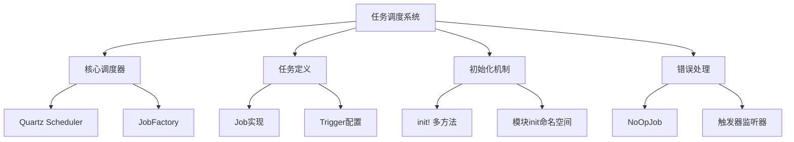
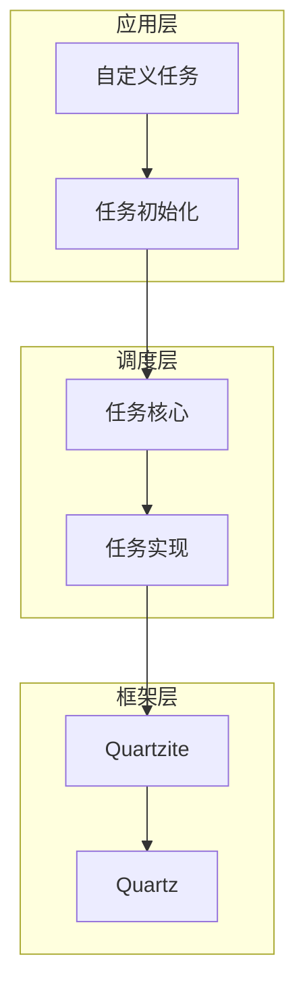
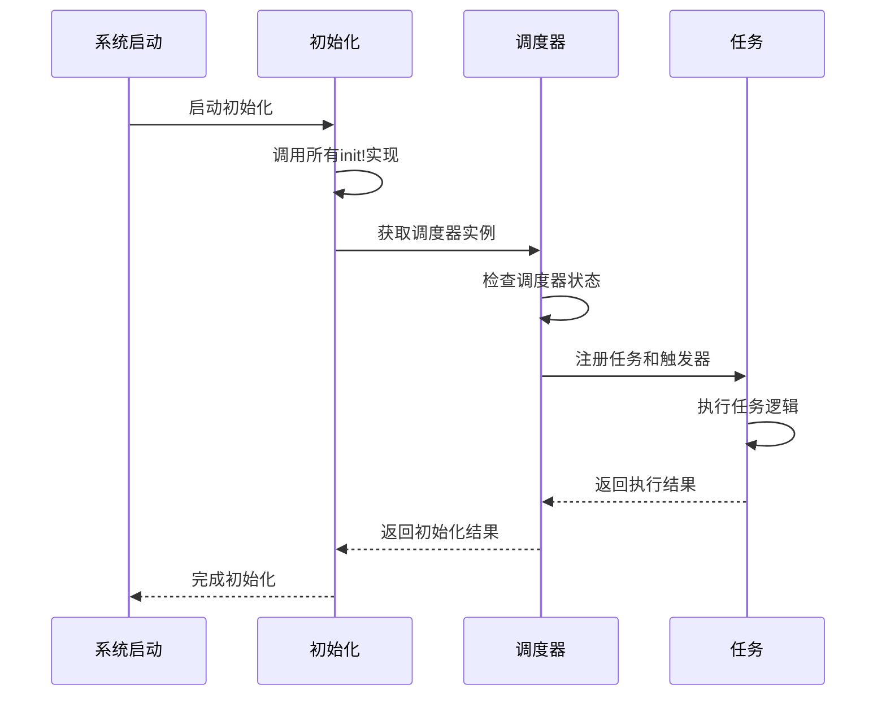
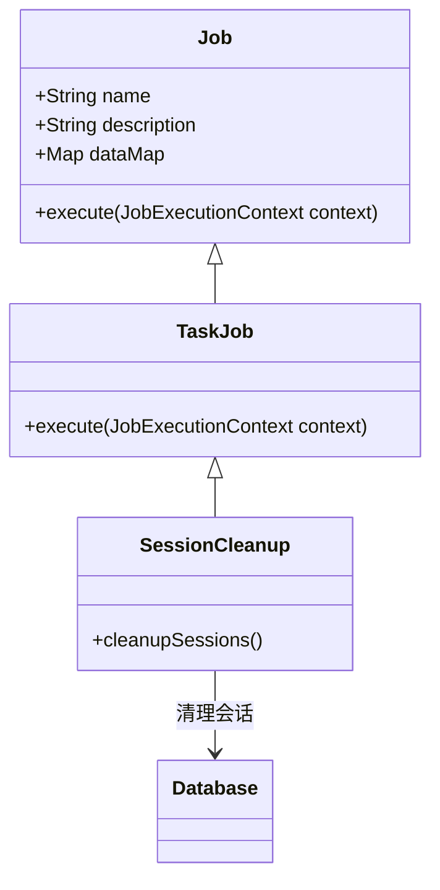
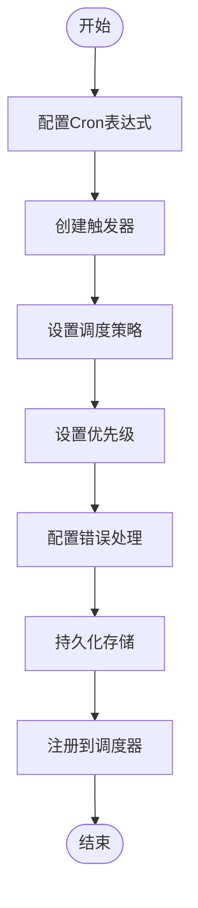
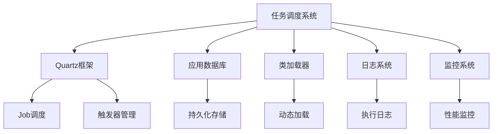

# 自定义任务

<cite>
**本文档中引用的文件**  
- [core.clj](file://src/metabase/task/core.clj)
- [impl.clj](file://src/metabase/task/impl.clj)
- [QUARTZ.md](file://src/metabase/task/QUARTZ.md)
- [session_cleanup.clj](file://src/metabase/session/task/session_cleanup.clj)
- [send.clj](file://src/metabase/notification/task/send.clj)
- [task_history_cleanup.clj](file://src/metabase/task_history/task/task_history_cleanup.clj)
- [init.clj](file://src/metabase/session/init.clj)
- [bootstrap.clj](file://src/metabase/task/bootstrap.clj)
- [job_factory.clj](file://src/metabase/task/job_factory.clj)
</cite>

## 目录
1. [简介](#简介)
2. [项目结构](#项目结构)
3. [核心组件](#核心组件)
4. [架构概述](#架构概述)
5. [详细组件分析](#详细组件分析)
6. [依赖分析](#依赖分析)
7. [性能考虑](#性能考虑)
8. [故障排除指南](#故障排除指南)
9. [结论](#结论)

## 简介
本文档旨在为Metabase开发者提供自定义定时任务的开发指南。文档详细说明了如何注册新的后台任务，包括定义任务函数、配置调度策略、设置启动条件和集成错误报告机制。通过分析Metabase源码中的任务调度系统，本文档提供了完整的Clojure代码示例，展示从任务声明到集群环境兼容的完整实现路径。同时涵盖了测试自定义任务的推荐方法、调试技巧和性能监控建议。

## 项目结构
Metabase的任务调度系统主要位于`src/metabase/task`目录下，采用模块化设计，将任务调度的核心功能与具体任务实现分离。系统基于Quartz调度框架，通过Clojure封装提供了简洁的API。任务通常按照功能模块组织在`metabase.<module>.task.*`命名空间下，并通过`init`命名空间进行初始化。

**Diagram sources**
- [impl.clj](file://src/metabase/task/impl.clj#L1-L50)
- [core.clj](file://src/metabase/task/core.clj#L1-L10)

**Section sources**
- [impl.clj](file://src/metabase/task/impl.clj#L1-L100)
- [QUARTZ.md](file://src/metabase/task/QUARTZ.md#L1-L50)

## 核心组件
Metabase的自定义任务系统由多个核心组件构成，包括任务调度器、任务定义、触发器配置和初始化机制。系统通过`metabase.task.core`命名空间提供API，开发者可以使用这些API来注册和管理自定义任务。任务的执行基于Quartz框架，确保了任务调度的可靠性和灵活性。

**Section sources**
- [core.clj](file://src/metabase/task/core.clj#L1-L30)
- [impl.clj](file://src/metabase/task/impl.clj#L1-L50)

## 架构概述
Metabase的任务调度架构基于Quartz框架，通过Clojure封装提供了简洁的API。系统在启动时初始化调度器，并通过多方法机制注册各种后台任务。任务的执行和调度是分离的，允许开发者灵活地定义任务的执行逻辑和调度策略。

**Diagram sources**
- [impl.clj](file://src/metabase/task/impl.clj#L1-L30)
- [core.clj](file://src/metabase/task/core.clj#L1-L10)

## 详细组件分析

### 任务注册与初始化
Metabase使用多方法`init!`来初始化和注册任务。每个任务模块通过实现`init!`多方法来注册自己的任务。系统在启动时调用所有`init!`的实现，确保所有任务都被正确注册。

**Diagram sources**
- [impl.clj](file://src/metabase/task/impl.clj#L54-L81)
- [core.clj](file://src/metabase/task/core.clj#L1-L10)

**Section sources**
- [impl.clj](file://src/metabase/task/impl.clj#L50-L100)
- [QUARTZ.md](file://src/metabase/task/QUARTZ.md#L1-L30)

### 任务定义与执行
任务的定义使用`defjob`宏，该宏封装了Quartz的Job接口。任务的执行逻辑在`execute`方法中定义，系统会自动处理任务的生命周期管理。

**Diagram sources**
- [session_cleanup.clj](file://src/metabase/session/task/session_cleanup.clj#L1-L20)
- [core.clj](file://src/metabase/task/core.clj#L1-L10)

**Section sources**
- [session_cleanup.clj](file://src/metabase/session/task/session_cleanup.clj#L1-L40)
- [impl.clj](file://src/metabase/task/impl.clj#L1-L30)

### 调度策略配置
任务的调度策略通过触发器(Trigger)配置，支持Cron表达式、简单调度等多种方式。系统提供了丰富的API来配置任务的执行频率、启动时间和错误处理策略。

**Diagram sources**
- [send.clj](file://src/metabase/notification/task/send.clj#L1-L50)
- [impl.clj](file://src/metabase/task/impl.clj#L1-L30)

**Section sources**
- [send.clj](file://src/metabase/notification/task/send.clj#L1-L100)
- [QUARTZ.md](file://src/metabase/task/QUARTZ.md#L50-L100)

## 依赖分析
Metabase的任务调度系统依赖于多个核心组件，包括Quartz调度框架、应用数据库连接池和类加载器。系统通过自定义的JobFactory处理类加载问题，确保在滚动升级时任务的稳定性。

**Diagram sources**
- [job_factory.clj](file://src/metabase/task/job_factory.clj#L1-L30)
- [bootstrap.clj](file://src/metabase/task/bootstrap.clj#L1-L30)

**Section sources**
- [job_factory.clj](file://src/metabase/task/job_factory.clj#L1-L60)
- [bootstrap.clj](file://src/metabase/task/bootstrap.clj#L1-L50)

## 性能考虑
在设计自定义任务时，需要考虑性能影响。长时间运行的任务应避免并发执行，可以通过`DisallowConcurrentExecution`注解来确保任务的串行执行。对于可能失败的任务，应合理配置重试策略，避免对系统造成过大压力。

## 故障排除指南
当自定义任务出现问题时，可以通过以下步骤进行排查：检查任务是否正确注册、验证调度配置是否正确、查看执行日志以确定错误原因。系统提供了`job-info`和`scheduler-info`等工具函数来帮助诊断任务状态。

**Section sources**
- [impl.clj](file://src/metabase/task/impl.clj#L200-L300)
- [task_history_cleanup.clj](file://src/metabase/task_history/task/task_history_cleanup.clj#L1-L20)

## 结论
Metabase的自定义任务系统提供了一套完整且灵活的API，使开发者能够轻松地创建和管理后台任务。通过遵循文档中的指导原则，开发者可以创建出高效、可靠且易于维护的自定义任务，为Metabase平台增添更多功能。