# Metabase任务调度框架架构文档

<cite>
**本文档中引用的文件**
- [src/metabase/task/impl.clj](file://src/metabase/task/impl.clj)
- [src/metabase/task/job_factory.clj](file://src/metabase/task/job_factory.clj)
- [src/metabase/task/bootstrap.clj](file://src/metabase/task/bootstrap.clj)
- [src/metabase/task/core.clj](file://src/metabase/task/core.clj)
- [src/metabase/analytics/quartz.clj](file://src/metabase/analytics/quartz.clj)
- [src/metabase/app_db/cluster_lock.clj](file://src/metabase/app_db/cluster_lock.clj)
- [src/metabase/task/QUARTZ.md](file://src/metabase/task/QUARTZ.md)
- [src/metabase/notification/task/send.clj](file://src/metabase/notification/task/send.clj)
- [src/metabase/sync/task/sync_databases.clj](file://src/metabase/sync/task/sync_databases.clj)
</cite>

## 目录
1. [概述](#概述)
2. [系统架构](#系统架构)
3. [调度器初始化](#调度器初始化)
4. [任务注册机制](#任务注册机制)
5. [作业工厂模式](#作业工厂模式)
6. [集群锁协调机制](#集群锁协调机制)
7. [多态分发与任务执行策略](#多态分发与任务执行策略)
8. [任务生命周期管理](#任务生命周期管理)
9. [系统启动引导流程](#系统启动引导流程)
10. [分布式环境下的任务协调](#分布式环境下的任务协调)
11. [监控与指标收集](#监控与指标收集)
12. [故障处理与恢复](#故障处理与恢复)
13. [最佳实践与示例](#最佳实践与示例)

## 概述

Metabase任务调度框架基于Quartz调度器构建，提供了强大而灵活的后台任务管理系统。该框架支持多种任务类型，包括一次性启动任务、定期调度任务和事件驱动任务，同时具备高可用性和容错能力。

### 核心特性

- **基于Quartz的成熟调度引擎**：利用Quartz的强大功能实现复杂的调度需求
- **多态分发机制**：支持不同类型任务的统一管理和执行
- **集群锁协调**：确保分布式环境下的任务唯一执行
- **任务历史记录**：完整的任务执行状态跟踪和审计
- **监控与指标**：实时的任务执行状态监控和性能指标收集

## 系统架构

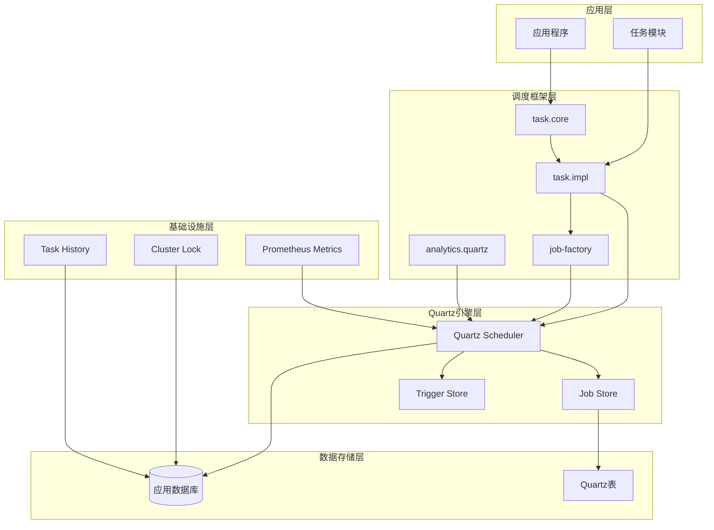

**图表来源**
- [src/metabase/task/core.clj](file://src/metabase/task/core.clj#L1-L31)
- [src/metabase/task/impl.clj](file://src/metabase/task/impl.clj#L1-L50)
- [src/metabase/analytics/quartz.clj](file://src/metabase/analytics/quartz.clj#L1-L30)

## 调度器初始化

### 初始化流程

调度器的初始化是一个多阶段的过程，确保所有组件正确配置和启动：

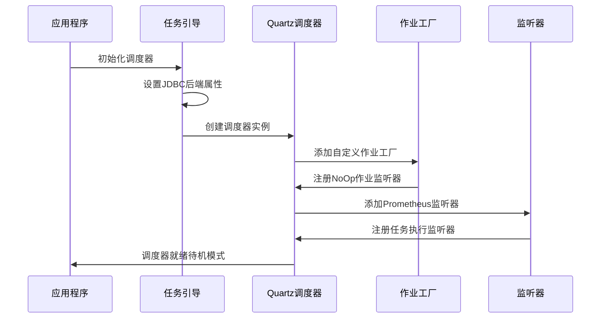

**图表来源**
- [src/metabase/task/impl.clj](file://src/metabase/task/impl.clj#L115-L140)
- [src/metabase/task/job_factory.clj](file://src/metabase/task/job_factory.clj#L60-L66)

### 配置加载机制

调度器初始化过程中会加载和验证各种配置：

| 配置项 | 描述 | 默认值 | 作用域 |
|--------|------|--------|--------|
| `org.quartz.dataSource.db.connectionProvider.class` | 数据库连接提供者 | 自定义ConnectionProvider | 全局 |
| `org.quartz.scheduler.classLoadHelper.class` | 类加载帮助器 | 自定义ClassLoadHelper | 全局 |
| `org.quartz.jobStore.driverDelegateClass` | 数据库代理类 | PostgreSQLDelegate | PostgreSQL专用 |
| `mb-disable-scheduler` | 禁用调度器标志 | false | 运行时 |

**章节来源**
- [src/metabase/task/bootstrap.clj](file://src/metabase/task/bootstrap.clj#L1-L55)
- [src/metabase/task/impl.clj](file://src/metabase/task/impl.clj#L115-L130)

## 任务注册机制

### 多方法分发系统

Metabase使用Clojure的多方法系统来实现任务注册的多态分发：

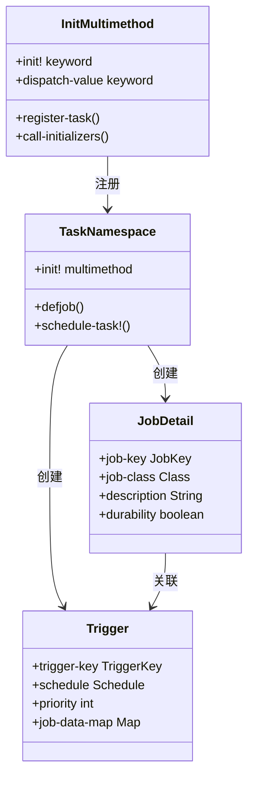

**图表来源**
- [src/metabase/task/impl.clj](file://src/metabase/task/impl.clj#L54-L81)
- [src/metabase/task/QUARTZ.md](file://src/metabase/task/QUARTZ.md#L15-L35)

### 任务注册流程

每个任务模块通过实现`init!`多方法来注册其任务：

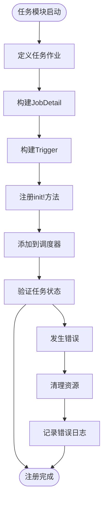

**图表来源**
- [src/metabase/task/impl.clj](file://src/metabase/task/impl.clj#L181-L215)

**章节来源**
- [src/metabase/task/impl.clj](file://src/metabase/task/impl.clj#L54-L81)
- [src/metabase/task/QUARTZ.md](file://src/metabase/task/QUARTZ.md#L40-L80)

## 作业工厂模式

### 自定义作业工厂

Metabase实现了自定义的作业工厂来处理类加载问题和滚动升级场景：

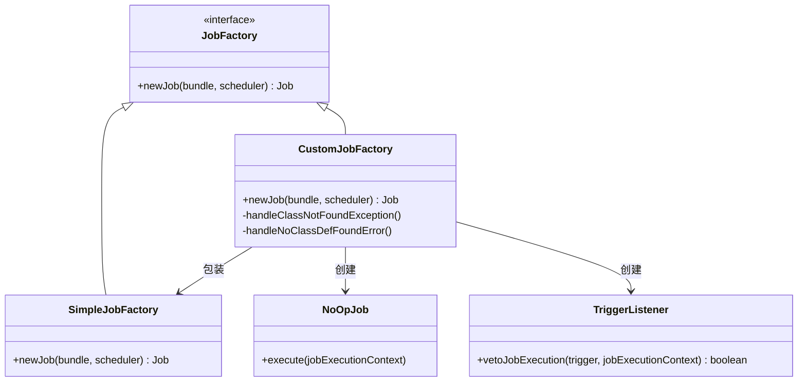

**图表来源**
- [src/metabase/task/job_factory.clj](file://src/metabase/task/job_factory.clj#L1-L66)

### 错误处理机制

作业工厂提供了强大的错误处理能力：

| 异常类型 | 处理策略 | 结果 |
|----------|----------|------|
| `ClassNotFoundException` | 创建NoOp作业 | 记录警告日志 |
| `NoClassDefFoundError` | 创建NoOp作业 | 记录错误日志 |
| 正常情况 | 使用SimpleJobFactory | 正常创建作业 |

**章节来源**
- [src/metabase/task/job_factory.clj](file://src/metabase/task/job_factory.clj#L20-L45)

## 集群锁协调机制

### 分布式锁实现

为了防止多个Metabase实例同时执行同一任务，框架实现了基于数据库的分布式锁：

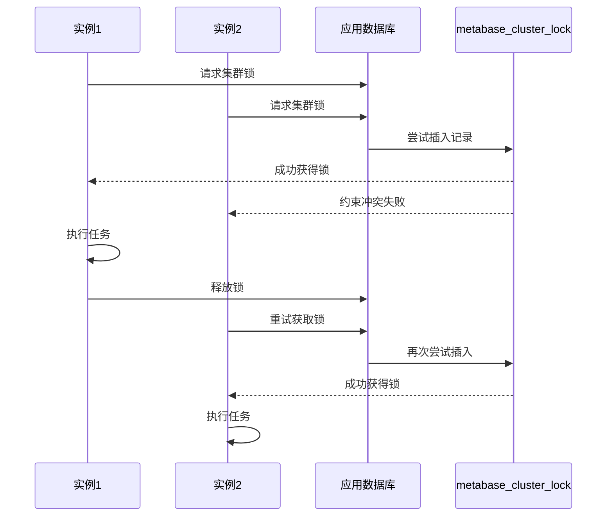

**图表来源**
- [src/metabase/app_db/cluster_lock.clj](file://src/metabase/app_db/cluster_lock.clj#L40-L80)

### 锁超时与重试机制

| 参数 | 值 | 说明 |
|------|----|----- |
| 默认超时时间 | 1秒 | 防止长时间阻塞 |
| 最大重试次数 | 5次 | 避免无限重试 |
| 初始间隔 | 1000毫秒 | 基础重试间隔 |
| 随机化因子 | 0.1 | 避免惊群效应 |

**章节来源**
- [src/metabase/app_db/cluster_lock.clj](file://src/metabase/app_db/cluster_lock.clj#L20-L40)

## 多态分发与任务执行策略

### 任务类型分类

Metabase支持多种任务执行策略：

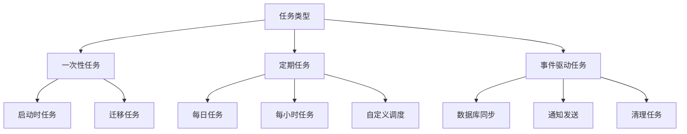

### 并发控制策略

| 策略 | 适用场景 | 实现方式 | 优势 |
|------|----------|----------|------|
| 并发执行 | 独立任务 | 默认行为 | 高吞吐量 |
| 禁止并发 | 资源竞争任务 | `@DisallowConcurrentExecution` | 避免冲突 |
| 优先级调度 | 关键任务 | 触发器优先级 | 确保及时执行 |

**章节来源**
- [src/metabase/task/QUARTZ.md](file://src/metabase/task/QUARTZ.md#L120-L160)

## 任务生命周期管理

### 生命周期阶段

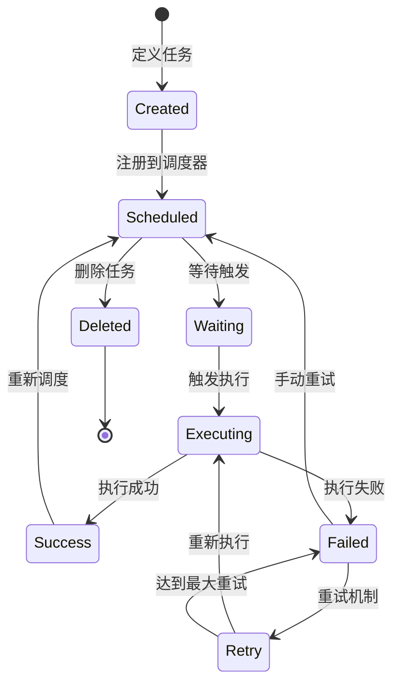

### 任务历史记录

每次任务执行都会被记录到任务历史表中：

| 字段 | 类型 | 描述 |
|------|------|------|
| `id` | UUID | 主键标识 |
| `task_name` | String | 任务名称 |
| `status` | Enum | 执行状态 |
| `started_at` | Timestamp | 开始时间 |
| `ended_at` | Timestamp | 结束时间 |
| `duration` | Integer | 执行时长（毫秒） |
| `task_details` | JSON | 任务详情 |

**章节来源**
- [src/metabase/task_history/models/task_history.clj](file://src/metabase/task_history/models/task_history.clj#L140-L185)

## 系统启动引导流程

### 启动序列

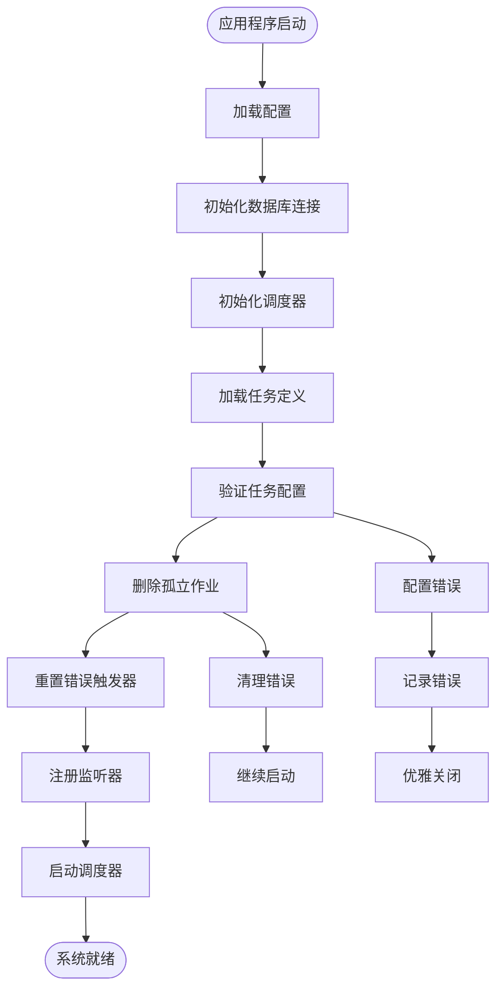

**图表来源**
- [src/metabase/task/impl.clj](file://src/metabase/task/impl.clj#L115-L140)

### 关键初始化步骤

1. **类加载器初始化**：确保Quartz能够正确加载任务类
2. **JDBC后端配置**：设置持久化存储参数
3. **作业工厂注册**：添加自定义作业工厂
4. **监听器注册**：添加Prometheus指标监听器
5. **任务清理**：删除无效的作业和触发器
6. **错误重置**：重置处于ERROR状态的触发器

**章节来源**
- [src/metabase/task/impl.clj](file://src/metabase/task/impl.clj#L115-L140)

## 分布式环境下的任务协调

### 避免重复执行

在分布式环境中，Metabase通过以下机制确保任务不会重复执行：

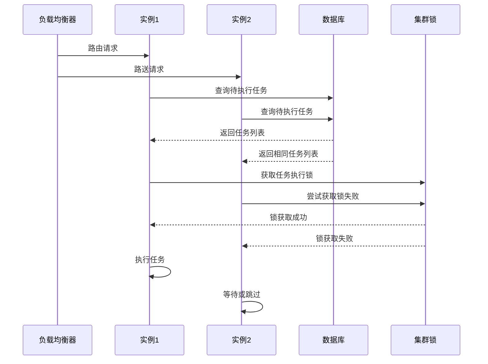

### 集群一致性保证

| 机制 | 实现方式 | 效果 |
|------|----------|------|
| 数据库约束 | 唯一索引 | 防止重复插入 |
| 事务隔离 | 数据库事务 | 确保操作原子性 |
| 锁超时 | 时间戳检查 | 避免死锁 |
| 重试机制 | 指数退避 | 处理临时故障 |

**章节来源**
- [src/metabase/app_db/cluster_lock.clj](file://src/metabase/app_db/cluster_lock.clj#L40-L80)

## 监控与指标收集

### Prometheus指标

Metabase集成了Prometheus指标收集，提供实时的任务执行监控：

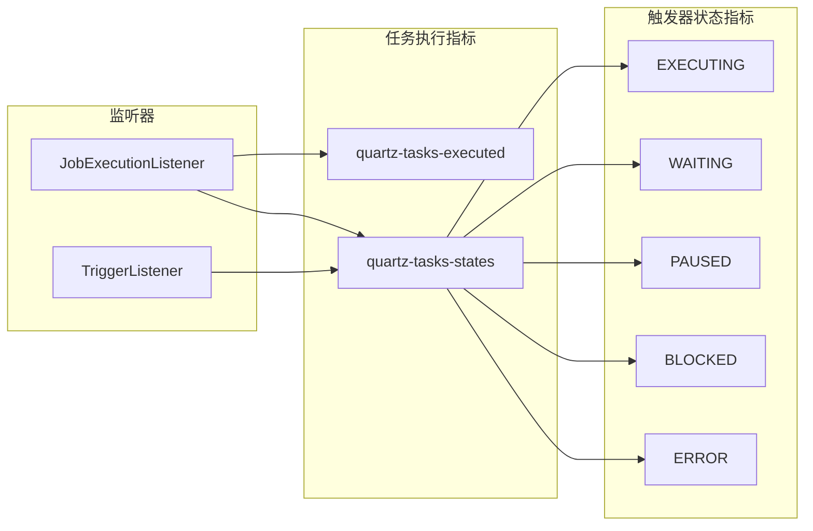

**图表来源**
- [src/metabase/analytics/quartz.clj](file://src/metabase/analytics/quartz.clj#L15-L55)

### 监控指标说明

| 指标名称 | 类型 | 标签 | 描述 |
|----------|------|------|------|
| `metabase-tasks/quartz-tasks-executed` | Counter | `status`, `job-name` | 任务执行计数 |
| `metabase-tasks/quartz-tasks-states` | Gauge | `state` | 触发器状态分布 |

**章节来源**
- [src/metabase/analytics/quartz.clj](file://src/metabase/analytics/quartz.clj#L15-L93)

## 故障处理与恢复

### 错误恢复策略

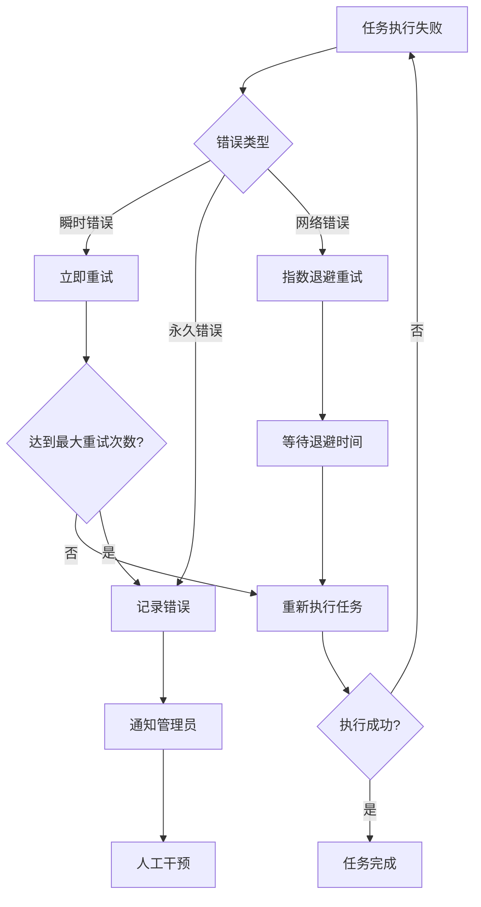

### 自动恢复机制

| 场景 | 恢复策略 | 实现方式 |
|------|----------|----------|
| 作业类不存在 | 创建NoOp作业 | 作业工厂拦截 |
| 触发器错误状态 | 自动重置为WAITING | 启动时扫描 |
| 数据库连接失败 | 重试连接 | 连接池配置 |
| 任务执行超时 | 取消当前执行 | 超时监控 |

**章节来源**
- [src/metabase/task/impl.clj](file://src/metabase/task/impl.clj#L82-L110)

## 最佳实践与示例

### 任务定义最佳实践

1. **使用`defjob`宏**：提供日志上下文和结构化日志
2. **实现幂等性**：确保任务可以安全地重复执行
3. **合理设置并发控制**：根据任务特性选择合适的并发策略
4. **添加错误处理**：使用`rerun-on-error`宏处理临时错误

### 示例任务实现

以下是典型的任务实现模式：

```clojure
;; 任务定义
(task/defjob ^{org.quartz.DisallowConcurrentExecution true
               :doc "同步数据库元数据"}
  SyncDatabaseMetadata [job-context]
  (let [db-id (job-context->database-id job-context)]
    (sync-metadata/sync-db-metadata! db-id)))

;; 任务注册
(defmethod task/init! ::SyncDatabaseMetadata [_]
  (let [job (jobs/build
             (jobs/of-type SyncDatabaseMetadata)
             (jobs/with-identity (jobs/key "sync-database-metadata"))
             (jobs/store-durably))
        trigger (triggers/build
                 (triggers/with-identity (triggers/key "sync-database-metadata-trigger"))
                 (triggers/start-now)
                 (triggers/with-schedule
                   (cron/cron-schedule "0 0 * * * ? *")))]
    (task/schedule-task! job trigger)))
```

### 性能优化建议

| 方面 | 建议 | 原因 |
|------|------|------|
| 任务粒度 | 保持小而专注 | 减少单次执行时间 |
| 并发控制 | 合理使用`DisallowConcurrentExecution` | 避免资源竞争 |
| 错误处理 | 区分可重试和不可重试错误 | 提高系统稳定性 |
| 监控指标 | 收集关键性能指标 | 及时发现问题 |

**章节来源**
- [src/metabase/task/QUARTZ.md](file://src/metabase/task/QUARTZ.md#L1-L160)
- [src/metabase/sync/task/sync_databases.clj](file://src/metabase/sync/task/sync_databases.clj#L100-L150)

## 总结

Metabase的任务调度框架是一个设计精良、功能完备的后台任务管理系统。它通过以下关键特性确保了系统的可靠性和可扩展性：

1. **基于Quartz的成熟调度引擎**：充分利用Quartz的强大功能
2. **灵活的多态分发机制**：支持多种任务类型的统一管理
3. **完善的错误处理和恢复机制**：确保系统稳定运行
4. **分布式环境下的协调能力**：避免任务重复执行
5. **全面的监控和指标收集**：提供实时的系统状态洞察

该框架为Metabase提供了强大的后台任务处理能力，支持从简单的定时任务到复杂的分布式协调等各种应用场景。通过遵循最佳实践和合理配置，可以构建出高性能、高可用的后台任务系统。