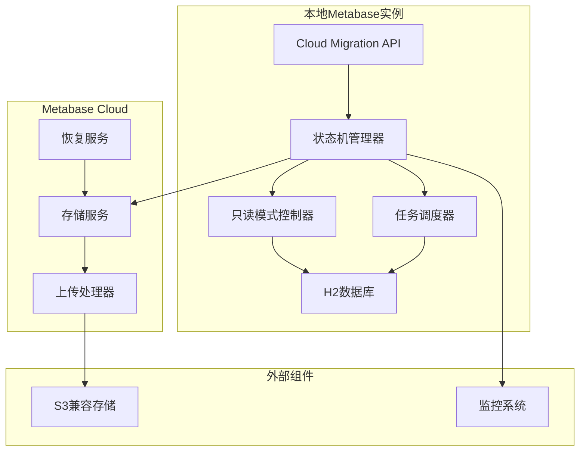
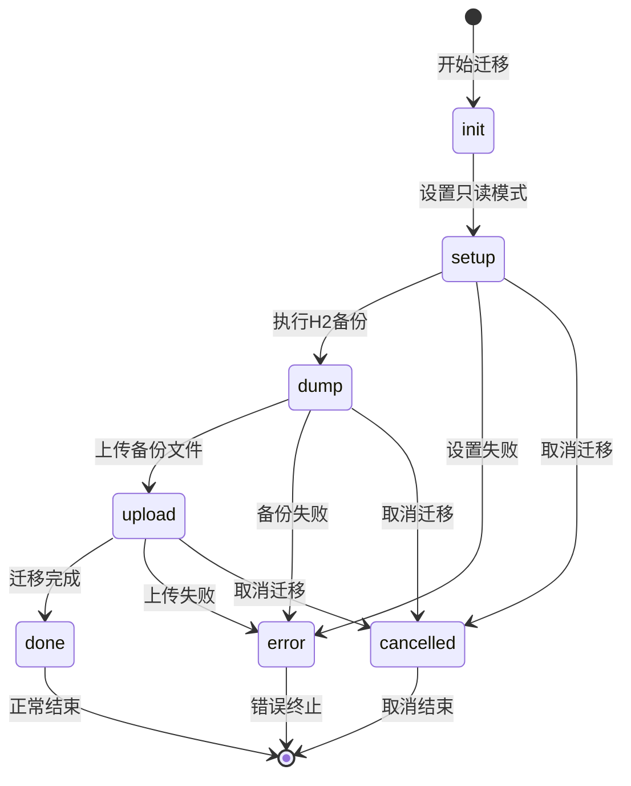
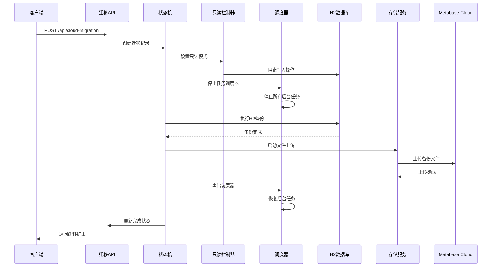
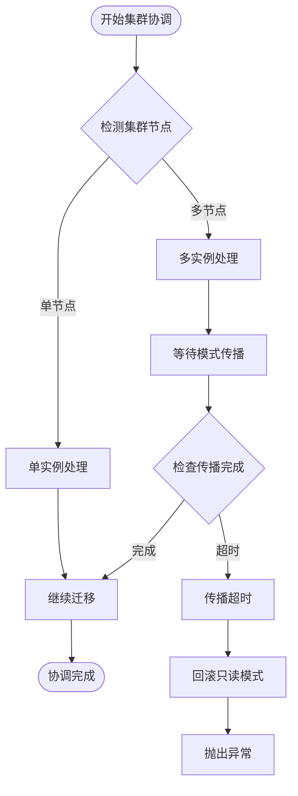
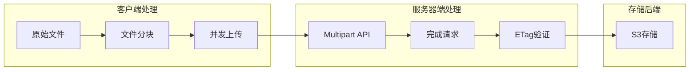
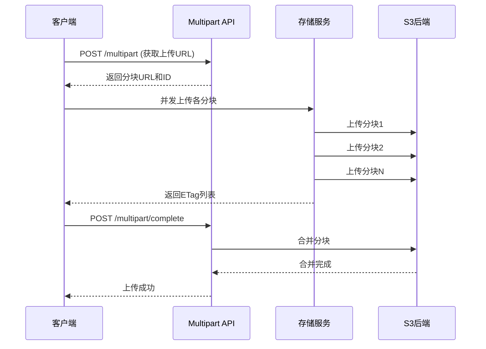
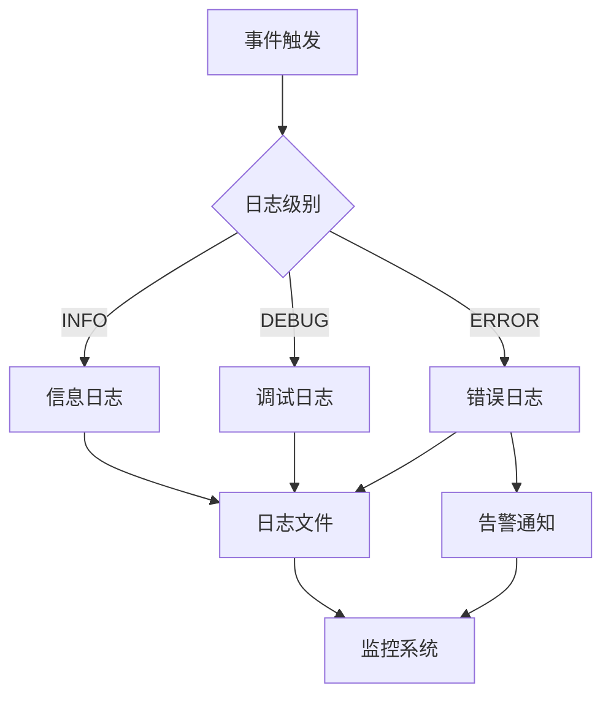
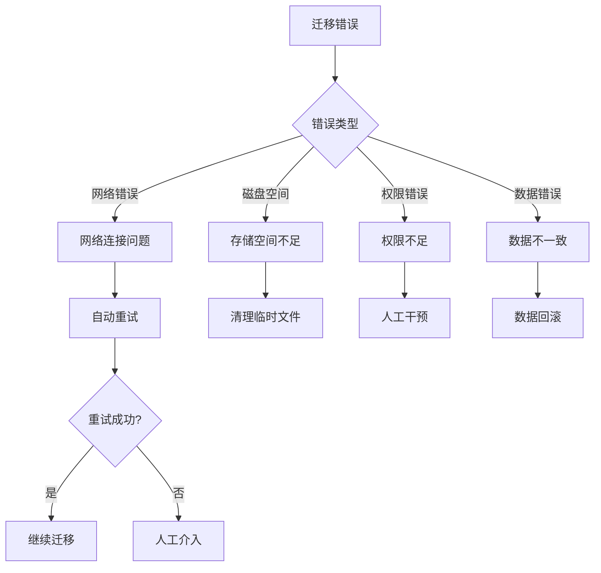
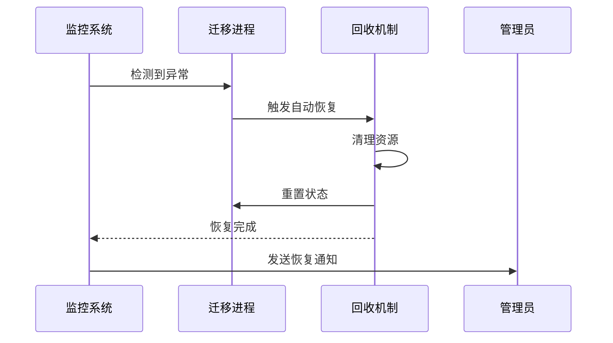

# Metabase云迁移场景备份恢复文档

<cite>
**本文档引用的文件**
- [cloud_migration.clj](file://src/metabase/cloud_migration/models/cloud_migration.clj)
- [cloud_migration_api.clj](file://src/metabase/cloud_migration/api.clj)
- [cloud_migration_settings.clj](file://src/metabase/cloud_migration/settings.clj)
- [dump_to_h2.clj](file://src/metabase/cmd/dump_to_h2.clj)
- [copy.clj](file://src/metabase/cmd/copy.clj)
- [load_from_h2.clj](file://src/metabase/cmd/load_from_h2.clj)
- [task_impl.clj](file://src/metabase/task/impl.clj)
- [app_db_core.clj](file://src/metabase/app_db/core.clj)
</cite>

## 目录
1. [概述](#概述)
2. [系统架构](#系统架构)
3. [状态机管理机制](#状态机管理机制)
4. [迁移流程详解](#迁移流程详解)
5. [集群环境协调](#集群环境协调)
6. [大文件分块上传](#大文件分块上传)
7. [监控与日志](#监控与日志)
8. [故障处理与回滚](#故障处理与回滚)
9. [最佳实践](#最佳实践)
10. [故障排除指南](#故障排除指南)

## 概述

Metabase云迁移功能提供了从本地实例无缝迁移到Metabase Cloud的完整解决方案。该系统通过状态机驱动的迁移流程、集群环境协调、大文件分块上传等核心机制，确保迁移过程的安全性、可靠性和可监控性。

### 核心特性

- **状态机驱动的迁移流程**：通过init、setup、dump、upload、done、error等状态管理迁移进度
- **集群环境支持**：自动检测集群节点并协调读写模式切换
- **大文件分块上传**：支持超过100MB的备份文件分块传输和断点续传
- **实时进度跟踪**：提供详细的迁移进度监控和状态报告
- **安全的数据保护**：采用只读模式和加密传输确保数据完整性

## 系统架构



**图表来源**
- [cloud_migration.clj](file://src/metabase/cloud_migration/models/cloud_migration.clj#L1-L307)
- [cloud_migration_api.clj](file://src/metabase/cloud_migration/api.clj#L1-L49)

## 状态机管理机制

### 状态定义

cloud_migration模型实现了完整的状态机管理，包含以下状态：



**图表来源**
- [cloud_migration.clj](file://src/metabase/cloud_migration/models/cloud_migration.clj#L89-L91)

### 状态转换逻辑

状态转换通过`set-progress`函数实现，该函数具有集群协调能力：

- **集群协调机制**：任何实例都可以取消迁移，确保一致性
- **终端状态检查**：防止在已完成或错误状态下进行状态更新
- **原子性保证**：使用数据库事务确保状态更新的原子性

**章节来源**
- [cloud_migration.clj](file://src/metabase/cloud_migration/models/cloud_migration.clj#L122-L130)

### 进度跟踪实现

进度跟踪采用相对进度到绝对进度的映射机制：

- **初始阶段（1%）**：设置只读模式
- **备份阶段（20%-50%）**：H2数据库转储
- **上传阶段（51%-99%）**：文件上传进度
- **完成阶段（100%）**：迁移成功完成

**章节来源**
- [cloud_migration.clj](file://src/metabase/cloud_migration/models/cloud_migration.clj#L132-L138)

## 迁移流程详解

### 完整迁移流程



**图表来源**
- [cloud_migration.clj](file://src/metabase/cloud_migration/models/cloud_migration.clj#L200-L282)
- [cloud_migration_api.clj](file://src/metabase/cloud_migration/api.clj#L15-L47)

### 关键步骤详解

#### 1. 初始化阶段
- 创建迁移记录并分配唯一标识符
- 验证当前没有正在进行的迁移
- 获取Metabase Cloud的上传URL和外部ID

#### 2. 设置只读模式
- 将实例设置为只读模式，阻止用户写入操作
- 自动识别集群环境并等待模式传播
- 支持例外表（如用户、会话、审计日志）的写入权限

#### 3. 停止任务调度器
- 停止所有后台任务以确保数据一致性
- 包括数据库同步、脉冲发送、清理任务等
- 保存当前调度器配置以便后续恢复

#### 4. H2备份执行
- 使用`dump-to-h2`命令创建完整的数据库转储
- 支持明文导出选项用于调试和测试
- 确保备份文件的自一致性验证

#### 5. 文件上传处理
- 根据文件大小选择单文件上传或多部分上传
- 实现断点续传和重试机制
- 使用AWS KMS加密传输数据

**章节来源**
- [cloud_migration.clj](file://src/metabase/cloud_migration/models/cloud_migration.clj#L200-L282)

## 集群环境协调

### 集群检测机制

系统通过Quartz调度器节点数量检测集群环境：

```clojure
(defn cluster?
  "EXPERIMENTAL Returns true if this metabase instance is part of a cluster.
  Works by checking how many Quartz nodes there are."
  []
  (>= (t2/count (if (= (mdb/db-type) :postgres)
                  "qrtz_scheduler_state"
                  "QRTZ_SCHEDULER_STATE"))
      2))
```

### 读写模式切换协调

在集群环境中，读写模式切换需要特殊处理：

- **模式传播延迟**：等待1.5倍缓存更新间隔时间确保所有节点同步
- **分布式锁**：使用数据库事务确保模式切换的一致性
- **异常处理**：如果模式切换失败，自动回滚并抛出异常

### 集群状态同步



**图表来源**
- [cloud_migration.clj](file://src/metabase/cloud_migration/models/cloud_migration.clj#L93-L97)

**章节来源**
- [cloud_migration.clj](file://src/metabase/cloud_migration/models/cloud_migration.clj#L93-L97)

## 大文件分块上传

### 分块上传架构

对于大于100MB的备份文件，系统采用多部分上传机制：



**图表来源**
- [cloud_migration.clj](file://src/metabase/cloud_migration/models/cloud_migration.clj#L149-L210)

### 分块策略

- **默认分块大小**：100MB（可配置）
- **最小分块大小**：6MB
- **并发上传**：支持多个分块同时上传
- **断点续传**：每个分块独立上传，支持失败重试

### 多部分上传流程



**图表来源**
- [cloud_migration.clj](file://src/metabase/cloud_migration/models/cloud_migration.clj#L175-L210)

### 断点续传机制

- **独立分块处理**：每个分块都有独立的上传状态
- **ETag验证**：上传完成后验证分块完整性
- **重试策略**：最多重试3次，支持指数退避

**章节来源**
- [cloud_migration.clj](file://src/metabase/cloud_migration/models/cloud_migration.clj#L149-L210)

## 监控与日志

### 监控指标体系

系统提供全面的监控指标：

| 指标类型 | 指标名称 | 描述 | 数据源 |
|---------|---------|------|--------|
| 进度指标 | migration_progress | 当前迁移进度百分比 | 状态机更新 |
| 状态指标 | migration_state | 当前迁移状态 | 数据库状态字段 |
| 性能指标 | backup_duration | 备份耗时 | 时间戳差值 |
| 错误指标 | migration_errors | 迁移错误次数 | 异常捕获 |
| 网络指标 | upload_speed | 上传速度 | 文件大小/时间 |

### 日志记录策略



### 关键日志点

- **迁移开始**：记录迁移ID和目标版本
- **状态变更**：每次状态转换都记录详细信息
- **错误发生**：记录完整的异常堆栈和上下文
- **性能指标**：记录关键操作的耗时统计

**章节来源**
- [cloud_migration.clj](file://src/metabase/cloud_migration/models/cloud_migration.clj#L200-L282)

## 故障处理与回滚

### 错误分类与处理



### 回滚策略

#### 自动回滚条件
- **只读模式失效**：备份过程中只读模式被意外关闭
- **集群协调失败**：集群环境下的模式切换失败
- **上传中断**：文件上传过程中出现不可恢复的错误

#### 回滚操作序列
1. **立即停止**：终止所有正在进行的操作
2. **状态恢复**：将迁移状态重置为初始状态
3. **资源清理**：删除临时文件和中间状态
4. **服务恢复**：重启任务调度器和数据库连接

### 故障恢复机制



**章节来源**
- [cloud_migration.clj](file://src/metabase/cloud_migration/models/cloud_migration.clj#L250-L282)

## 最佳实践

### 迁移前准备

1. **环境检查**
   - 确认网络连接稳定
   - 验证存储配额充足
   - 检查数据库连接正常

2. **数据验证**
   - 确认数据完整性
   - 验证用户权限设置
   - 测试查询功能正常

3. **资源规划**
   - 预估迁移时间
   - 准备回滚方案
   - 制定沟通计划

### 迁移执行建议

1. **时间窗口选择**
   - 选择业务低峰期进行迁移
   - 预留充足的缓冲时间
   - 通知相关人员迁移计划

2. **监控配置**
   - 启用详细日志记录
   - 设置关键指标监控
   - 配置告警通知机制

3. **质量保证**
   - 执行迁移前的数据备份
   - 验证迁移后的数据完整性
   - 测试核心功能正常运行

### 迁移后验证

1. **功能验证**
   - 用户登录功能
   - 查询执行能力
   - 数据可视化显示

2. **性能测试**
   - 查询响应时间
   - 并发用户支持
   - 系统资源使用率

3. **安全检查**
   - 权限设置正确性
   - 数据访问控制
   - 审计日志完整性

## 故障排除指南

### 常见问题及解决方案

#### 1. 迁移卡在某个状态
**症状**：迁移长时间停留在某个状态（如setup或dump）
**原因**：
- 只读模式设置失败
- 数据库连接问题
- 磁盘空间不足

**解决步骤**：
1. 检查数据库连接状态
2. 验证磁盘空间是否充足
3. 查看详细错误日志
4. 手动取消并重试迁移

#### 2. 上传失败
**症状**：文件上传过程中断或失败
**原因**：
- 网络连接不稳定
- 存储服务不可用
- 文件过大导致超时

**解决步骤**：
1. 检查网络连接质量
2. 验证存储服务状态
3. 调整上传超时参数
4. 使用断点续传功能

#### 3. 集群协调失败
**症状**：集群环境下迁移无法正常进行
**原因**：
- 节点间通信问题
- 缓存同步延迟
- 分布式锁竞争

**解决步骤**：
1. 检查集群节点健康状态
2. 验证网络连通性
3. 重启受影响的节点
4. 手动触发模式传播

### 调试工具和技巧

#### 日志分析
```bash
# 查看迁移日志
tail -f logs/metabase.log | grep "cloud_migration"

# 搜索特定错误
grep "ERROR" logs/metabase.log | grep "migration"
```

#### 状态检查
```sql
-- 检查当前迁移状态
SELECT * FROM cloud_migration ORDER BY created_at DESC LIMIT 1;

-- 查看历史迁移记录
SELECT state, progress, created_at, updated_at 
FROM cloud_migration 
WHERE state IN ('error', 'cancelled') 
ORDER BY created_at DESC;
```

#### 性能监控
```bash
# 监控上传进度
curl -X GET "http://localhost:3000/api/cloud-migration"

# 检查系统资源使用
top -p $(pgrep -f metabase)
```

### 紧急处理程序

当遇到严重问题时，按照以下紧急处理程序操作：

1. **立即停止迁移**
   ```bash
   curl -X PUT "http://localhost:3000/api/cloud-migration/cancel"
   ```

2. **清理残留状态**
   ```sql
   UPDATE cloud_migration 
   SET state = 'cancelled' 
   WHERE state NOT IN ('done', 'error', 'cancelled');
   ```

3. **恢复系统状态**
   - 重启Metabase服务
   - 检查数据库连接
   - 验证任务调度器状态

4. **评估影响范围**
   - 确认数据完整性
   - 检查用户访问权限
   - 验证核心功能可用性

**章节来源**
- [cloud_migration.clj](file://src/metabase/cloud_migration/models/cloud_migration.clj#L250-L282)
- [cloud_migration_api.clj](file://src/metabase/cloud_migration/api.clj#L40-L47)

## 结论

Metabase云迁移功能通过精心设计的状态机、集群协调机制、大文件处理能力和完善的监控体系，为企业级用户提供了一个安全可靠的云迁移解决方案。通过遵循本文档的最佳实践和故障排除指南，可以确保迁移过程的顺利进行，并在出现问题时快速恢复系统正常运行。

系统的模块化设计和丰富的配置选项使其能够适应各种复杂的部署环境，而完善的错误处理和回滚机制则为迁移操作提供了强有力的安全保障。随着Metabase平台的不断发展，云迁移功能将继续演进，为用户提供更加便捷和高效的迁移体验。