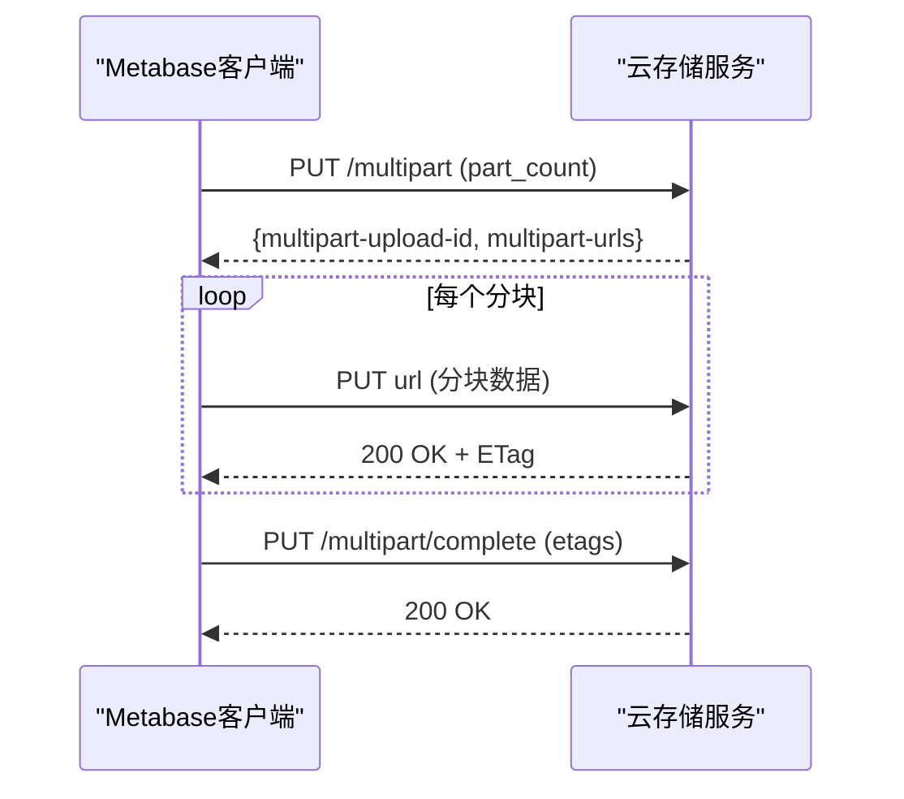
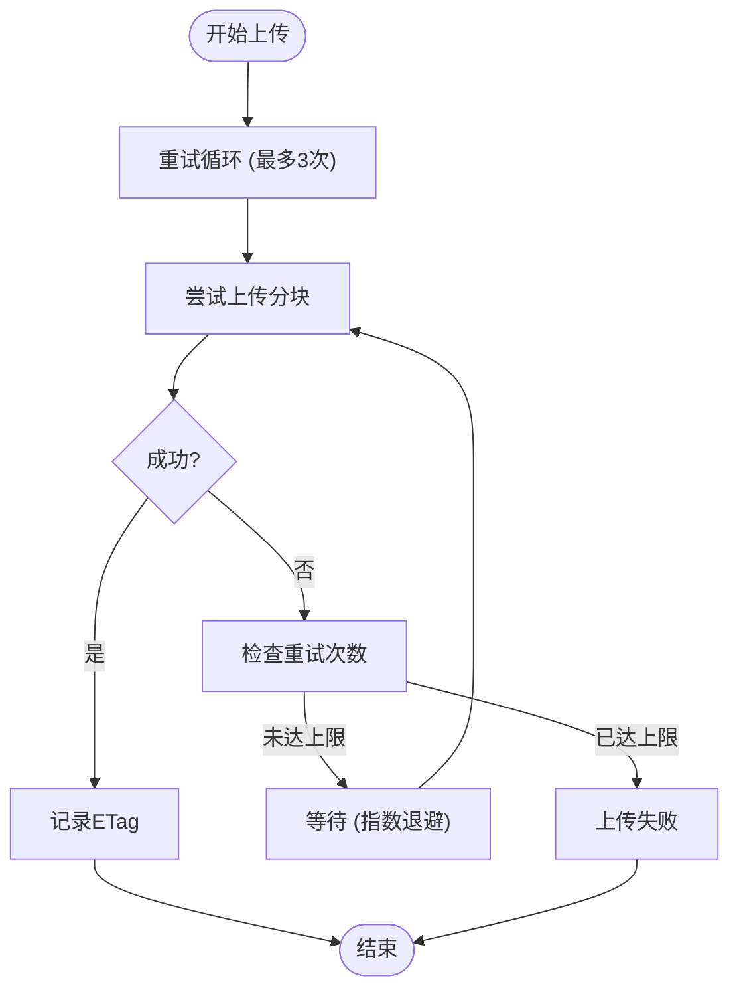

# 文件上传机制

<cite>
**本文档中引用的文件**  
- [cloud_migration.clj](file://src/metabase/cloud_migration/models/cloud_migration.clj)
- [upload.clj](file://src/metabase/upload/api.clj)
- [impl.clj](file://src/metabase/upload/impl.clj)
- [settings.clj](file://src/metabase/upload/settings.clj)
- [retry.clj](file://src/metabase/util/retry.clj)
- [http.clj](file://src/metabase/util/http.clj)
- [store_api.clj](file://src/metabase/store_api/core.clj)
</cite>

## 目录
1. [大尺寸H2备份文件分块上传实现原理](#大尺寸h2备份文件分块上传实现原理)  
2. [分块策略与并发控制](#分块策略与并发控制)  
3. [校验和验证与断点续传](#校验和验证与断点续传)  
4. [云存储API交互流程](#云存储api交互流程)  
5. [错误重试与网络恢复](#错误重试与网络恢复)  
6. [性能瓶颈与优化建议](#性能瓶颈与优化建议)  
7. [HTTP请求示例与响应处理](#http请求示例与响应处理)

## 大尺寸H2备份文件分块上传实现原理

Metabase系统中大尺寸H2备份文件的分块上传机制主要通过`cloud_migration`模块实现，该机制专为将本地H2数据库迁移到云端而设计。上传流程始于`migrate!`函数，该函数首先将当前数据库转储为H2文件，然后根据文件大小决定采用单次上传或分块上传策略。

当文件大小超过预设阈值（约100MB）时，系统自动启用分块上传。该机制通过调用云存储服务的API创建多部分上传会话，获取每个分块的预签名URL，然后并行上传各个分块。上传完成后，客户端发送完成请求，通知服务器合并所有分块。整个过程通过`upload`函数协调，该函数根据文件长度动态选择上传策略。

上传过程中，系统通过`set-progress`函数实时更新迁移状态，确保在集群环境中状态的一致性。进度报告通过`on-progress`回调函数实现，该函数将文件读取进度转换为0-100的百分比值，并通过`abs-progress`函数映射到全局进度范围（51-99），以反映上传阶段在整个迁移过程中的相对位置。

**Section sources**  
- [cloud_migration.clj](file://src/metabase/cloud_migration/models/cloud_migration.clj#L149-L174)

## 分块策略与并发控制

分块上传策略的核心是`part-size`常量，其值设定为1亿字节（约95.4MB）。该值作为阈值，决定是否启用分块上传：小于该值的文件采用单次PUT请求上传，大于该值的文件则被分割为多个块。

文件分块通过`partition`函数实现，将文件的字节范围划分为连续的区间。例如，一个250MB的文件将被划分为`[[0 100e6] [100e6 200e6] [200e6 250e6]]`三个区间。每个区间对应一个分块上传请求。

并发控制通过Clojure的`map-indexed`和`->>`线程宏实现。系统遍历所有分块区间，为每个分块发起独立的上传请求。这些请求在逻辑上是并行处理的，但由于`put-file`函数的同步性质，实际执行是顺序的。每个分块上传完成后，系统从响应头中提取ETag值，该值用于后续的分块验证和合并。

上传过程中，系统通过`multipart-urls`映射获取每个分块的上传URL，该映射由云存储服务在创建多部分上传会话时返回。系统通过`part-id`（从1开始的索引）查找对应的URL，确保每个分块被正确路由。

**Section sources**  
- [cloud_migration.clj](file://src/metabase/cloud_migration/models/cloud_migration.clj#L173-L196)

## 校验和验证与断点续传

分块上传的完整性验证依赖于ETag校验和机制。每个分块上传完成后，服务器返回一个包含ETag头的HTTP响应。ETag是服务器为该分块生成的唯一标识符，通常基于分块内容的MD5哈希值。客户端通过`get-in resp [:headers "ETag"]`提取该值，并将其与分块ID一起存储在`etags`映射中。

在上传完成阶段，客户端将`multipart-upload-id`和`etags`映射作为表单参数发送到`/multipart/complete`端点。服务器使用这些信息验证所有分块的完整性，并按顺序合并它们。如果任何分块的ETag不匹配，服务器将拒绝合并请求，从而保证数据的完整性。

断点续传功能通过`read-only-mode`机制实现。在迁移开始时，系统将数据库设置为只读模式，防止数据在转储过程中被修改。如果上传中断，系统可以重新启动`migrate!`函数，并从`set-progress`记录的状态恢复。由于H2转储文件在上传前已完全生成，因此可以从上次中断的分块继续上传，而无需重新转储数据库。

**Section sources**  
- [cloud_migration.clj](file://src/metabase/cloud_migration/models/cloud_migration.clj#L122-L150)

## 云存储API交互流程

与云存储服务的API交互流程始于创建多部分上传会话。客户端向`/api/v2/migration/{external_id}/multipart`端点发送PUT请求，携带`part_count`参数（分块总数）。服务器响应包含`multipart-upload-id`和`multipart-urls`，后者为每个分块提供唯一的预签名URL。



**Diagram sources**  
- [cloud_migration.clj](file://src/metabase/cloud_migration/models/cloud_migration.clj#L173-L196)

预签名URL的生成由云存储服务内部完成，客户端无需处理签名逻辑。上传进度通过`on-progress`回调函数实时监控，该函数在文件流读取时被调用，将字节进度转换为百分比并更新到数据库。

上传完成后，客户端发送`/uploaded`通知，触发服务器端的后续处理。整个流程通过`store-api-url`配置项确定云存储服务的基础URL，确保与正确的目标环境通信。

**Section sources**  
- [cloud_migration.clj](file://src/metabase/cloud_migration/models/cloud_migration.clj#L149-L174)
- [store_api.clj](file://src/metabase/store_api/core.clj#L1-L10)

## 错误重试与网络恢复

错误重试策略通过`u/auto-retry`宏实现，该宏对`put-file`函数应用最多3次的自动重试。每次重试前，系统会捕获异常并根据情况决定是否重试。核心重试逻辑封装在`util.retry`命名空间中，提供基于指数退避的重试机制。



**Diagram sources**  
- [retry.clj](file://src/metabase/util/retry.clj#L73-L101)

网络中断恢复机制依赖于分块上传的原子性。每个分块独立上传，失败的分块可以单独重试，而无需重新上传已成功的分块。系统通过`etags`映射跟踪已成功上传的分块，确保只有失败的分块被重试。

此外，`progress-file-input-stream`函数在文件流读取时报告进度，即使上传中断，已读取的字节数也被记录，为断点续传提供基础。`set-progress`函数的幂等性确保状态更新不会因重试而混乱。

**Section sources**  
- [cloud_migration.clj](file://src/metabase/cloud_migration/models/cloud_migration.clj#L149-L150)
- [retry.clj](file://src/metabase/util/retry.clj#L34-L77)

## 性能瓶颈与优化建议

主要性能瓶颈包括：
1. **文件转储时间**：`dump-to-h2!`函数将数据库转储为H2文件，对于大型数据库可能耗时较长。
2. **单线程上传**：尽管分块逻辑支持并发，但`map-indexed`的实现导致分块上传是顺序执行的。
3. **连接开销**：每个分块上传都建立独立的HTTP连接，增加了网络开销。

优化建议：
- **调整分块大小**：`part-size`的默认值（~100MB）可针对特定网络环境优化。较小的分块提高并行度但增加开销，较大的分块减少开销但降低容错性。
- **连接池配置**：虽然当前实现未显式使用连接池，但可通过HTTP客户端配置复用TCP连接，减少握手开销。
- **并行上传**：重构上传逻辑，使用`pmap`或`future`实现真正的并行上传，充分利用多核CPU和网络带宽。
- **压缩传输**：在上传前压缩H2文件，减少传输数据量，尽管会增加CPU负载。

**Section sources**  
- [cloud_migration.clj](file://src/metabase/cloud_migration/models/cloud_migration.clj#L149-L174)
- [cmd/dump_to_h2.clj](file://src/metabase/cmd/dump_to_h2.clj#L36-L46)

## HTTP请求示例与响应处理

### 创建多部分上传会话
```http
PUT /api/v2/migration/external-123/multipart HTTP/1.1
Content-Type: application/json

{
  "part_count": 3
}
```

**响应码处理**：
- `200 OK`：返回`multipart-upload-id`和`multipart-urls`，继续上传分块。
- `400 Bad Request`：请求参数无效，终止上传。
- `500 Internal Server Error`：服务端错误，可重试。

### 上传分块
```http
PUT https://upload.example.com/part/1?token=xxx HTTP/1.1
Content-Length: 100000000

[分块数据]
```

**响应码处理**：
- `200 OK`：提取`ETag`头，记录成功。
- `403 Forbidden`：预签名URL失效，需重新获取。
- `412 Precondition Failed`：数据校验失败，需重传。

### 完成分块上传
```http
PUT /api/v2/migration/external-123/multipart/complete HTTP/1.1
Content-Type: application/json

{
  "multipart_upload_id": "upload-456",
  "multipart_etags": {
    ":1": "\"etag1\"",
    ":2": "\"etag2\"",
    ":3": "\"etag3\""
  }
}
```

**响应码处理**：
- `200 OK`：上传成功，迁移完成。
- `400 Bad Request`：ETag不匹配，检查分块完整性。
- `404 Not Found`：上传会话不存在，重新开始。

**Section sources**  
- [cloud_migration.clj](file://src/metabase/cloud_migration/models/cloud_migration.clj#L173-L196)
- [http.clj](file://src/metabase/util/http.clj#L1-L44)