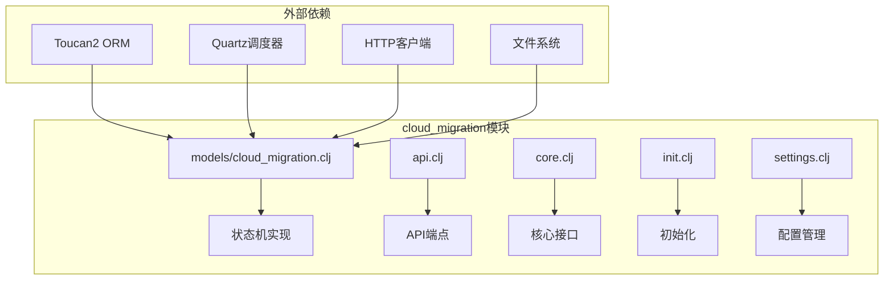
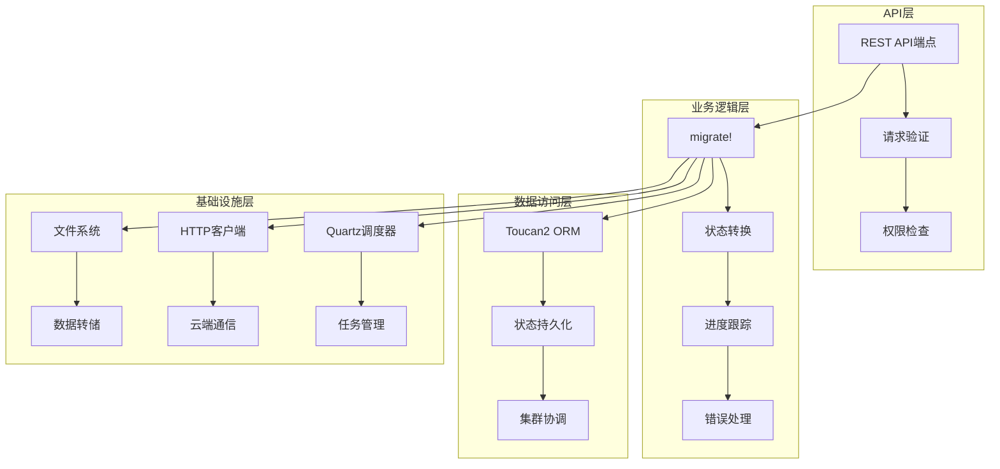
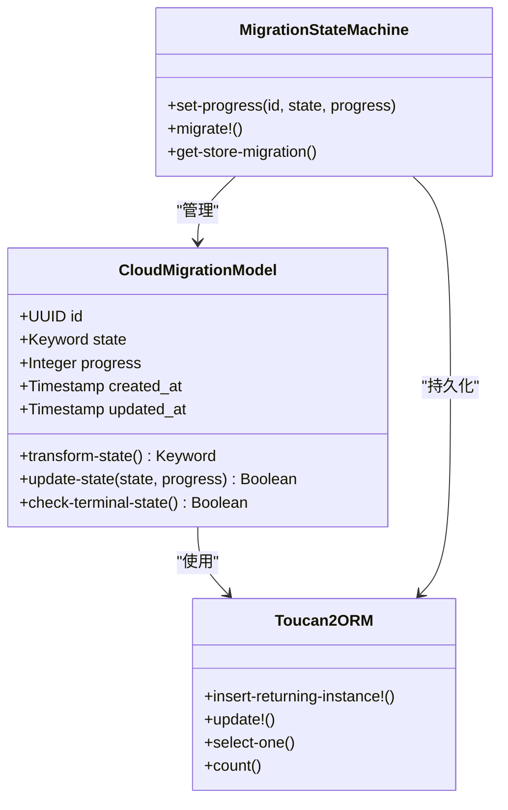
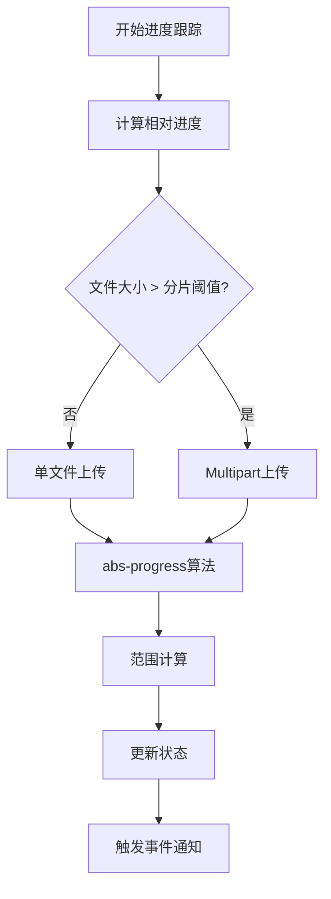
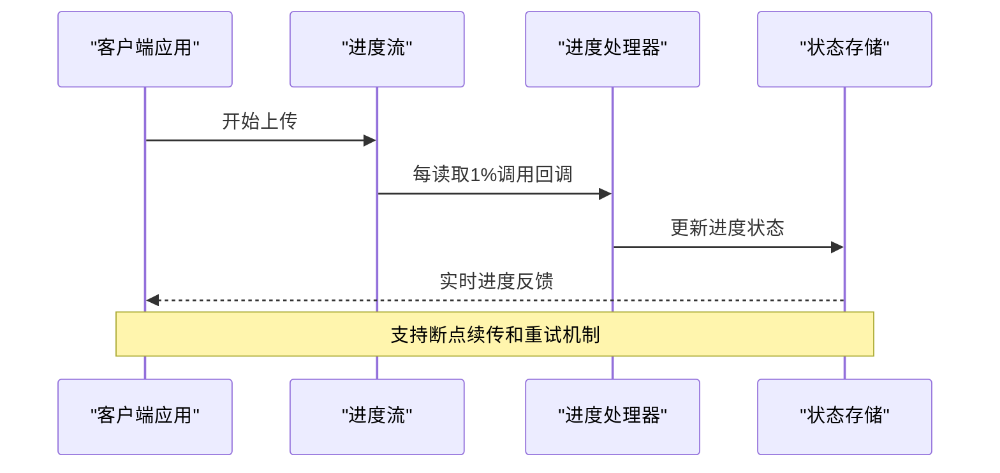
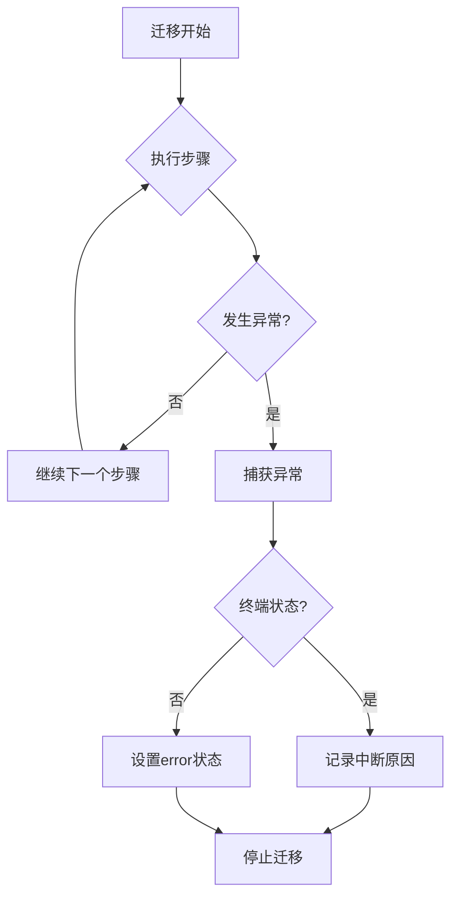
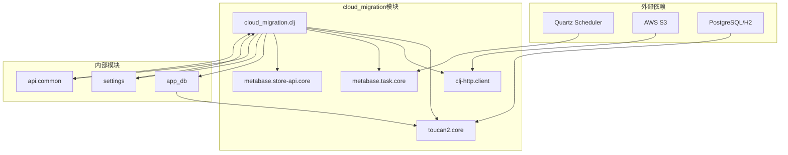

# 状态管理

<cite>
**本文档中引用的文件**
- [cloud_migration.clj](file://src/metabase/cloud_migration/models/cloud_migration.clj)
- [api.clj](file://src/metabase/cloud_migration/api.clj)
- [core.clj](file://src/metabase/cloud_migration/core.clj)
- [init.clj](file://src/metabase/cloud_migration/init.clj)
- [settings.clj](file://src/metabase/cloud_migration/settings.clj)
- [task/core.clj](file://src/metabase/task/core.clj)
- [task/impl.clj](file://src/metabase/task/impl.clj)
- [setup.clj](file://src/metabase/app_db/setup.clj)
</cite>

## 目录
1. [简介](#简介)
2. [项目结构](#项目结构)
3. [核心组件](#核心组件)
4. [架构概览](#架构概览)
5. [详细组件分析](#详细组件分析)
6. [依赖关系分析](#依赖关系分析)
7. [性能考虑](#性能考虑)
8. [故障排除指南](#故障排除指南)
9. [结论](#结论)

## 简介

cloud_migration模块是Metabase云迁移功能的核心实现，采用状态机模式管理整个迁移过程。该模块负责将本地部署的Metabase实例迁移到Metabase Cloud平台，通过六个主要状态（init、setup、dump、upload、done和error）实现迁移流程的精确控制。

该模块的核心特性包括：
- 基于Toucan2 ORM的状态持久化机制
- 实时进度跟踪和百分比计算
- 集群环境下的状态协调
- 异常状态的自动恢复和诊断
- 用户界面的实时更新支持

## 项目结构

cloud_migration模块位于`src/metabase/cloud_migration/`目录下，包含以下核心文件：



**图表来源**
- [cloud_migration.clj](file://src/metabase/cloud_migration/models/cloud_migration.clj#L1-L50)
- [api.clj](file://src/metabase/cloud_migration/api.clj#L1-L20)

**章节来源**
- [cloud_migration.clj](file://src/metabase/cloud_migration/models/cloud_migration.clj#L1-L307)
- [api.clj](file://src/metabase/cloud_migration/api.clj#L1-L49)

## 核心组件

### 状态机定义

cloud_migration模块实现了严格的状态机模型，包含以下六种状态：

1. **init** - 初始化状态，创建迁移记录
2. **setup** - 设置阶段，启用只读模式
3. **dump** - 转储阶段，创建数据库备份
4. **upload** - 上传阶段，传输数据到云端
5. **done** - 完成状态，迁移成功结束
6. **error** - 错误状态，迁移过程中出现异常

### 终止状态集合

```clojure
(def terminal-states
  "Cloud migration states that are terminal."
  #{:done :error :cancelled})
```

终止状态具有以下特征：
- 不可逆性：一旦进入终止状态，无法回退到其他状态
- 协调机制：集群中的任何实例都可以取消正在进行的迁移
- 数据一致性：确保在终端状态下不会发生数据修改操作

**章节来源**
- [cloud_migration.clj](file://src/metabase/cloud_migration/models/cloud_migration.clj#L83-L85)

## 架构概览

cloud_migration模块采用分层架构设计，确保状态管理的可靠性和可扩展性：



**图表来源**
- [cloud_migration.clj](file://src/metabase/cloud_migration/models/cloud_migration.clj#L219-L282)
- [api.clj](file://src/metabase/cloud_migration/api.clj#L15-L47)

## 详细组件分析

### 状态持久化机制

#### Toucan2 ORM集成

cloud_migration模块深度集成了Toucan2 ORM，实现状态的可靠持久化：



**图表来源**
- [cloud_migration.clj](file://src/metabase/cloud_migration/models/cloud_migration.clj#L36-L37)
- [cloud_migration.clj](file://src/metabase/cloud_migration/models/cloud_migration.clj#L122-L130)

#### 状态转换安全机制

状态转换通过原子性更新确保数据一致性：

```clojure
(defn- set-progress
  "Attempt to set id to state and progress.
  Throws if the migration has already reached a terminal state (e.g. cancelled).
  This is the main cluster coordination mechanism for migrations, since any instance
  can cancel the migration, not just the one that initiated it."
  [id state progress]
  (when (= 0 (t2/update! :model/CloudMigration :id id :state [:not-in terminal-states]
                         {:state state :progress progress}))
    (throw (ex-info "Cannot update migration in terminal state" {:terminal true}))))
```

这种设计确保：
- **集群协调**：所有节点都能观察到状态变化
- **原子性**：状态更新是不可分割的操作
- **冲突检测**：防止并发状态冲突

**章节来源**
- [cloud_migration.clj](file://src/metabase/cloud_migration/models/cloud_migration.clj#L122-L130)

### 进度跟踪技术实现

#### 百分比计算算法

进度跟踪采用相对和绝对进度相结合的方式：



**图表来源**
- [cloud_migration.clj](file://src/metabase/cloud_migration/models/cloud_migration.clj#L131-L135)
- [cloud_migration.clj](file://src/metabase/cloud_migration/models/cloud_migration.clj#L140-L174)

#### 时间预估和用户界面更新

进度跟踪系统提供了精确的时间预估和用户界面更新策略：

```clojure
(defn abs-progress
  "Returns absolute progress from a relative progress.
  E.g. if you're at relative 50 from 51 to 99, that's absolute 75."
  [relative-progress from to]
  (int (+ from (* (- to from) (/ relative-progress 100)))))
```

该算法支持：
- **动态范围调整**：根据当前阶段调整进度范围
- **平滑过渡**：确保进度显示的连续性
- **实时更新**：通过回调机制实现实时界面更新

**章节来源**
- [cloud_migration.clj](file://src/metabase/cloud_migration/models/cloud_migration.clj#L131-L135)

### 事件通知机制

#### 文件上传进度事件

文件上传过程中的进度事件通过流式处理实现：



**图表来源**
- [cloud_migration.clj](file://src/metabase/cloud_migration/models/cloud_migration.clj#L97-L121)

#### 集群状态同步

在集群环境中，状态变更需要跨节点同步：

```clojure
(defn cluster?
  "EXPERIMENTAL Returns true if this metabase instance is part of a cluster.
  Works by checking how many Quartz nodes there are."
  []
  (>= (t2/count (if (= (mdb/db-type) :postgres)
                  "qrtz_scheduler_state"
                  "QRTZ_SCHEDULER_STATE"))
      2))
```

集群同步机制：
- **节点发现**：通过Quartz调度器状态判断集群规模
- **延迟传播**：等待1.5倍缓存更新间隔确保状态同步
- **最终一致性**：保证所有节点最终看到相同状态

**章节来源**
- [cloud_migration.clj](file://src/metabase/cloud_migration/models/cloud_migration.clj#L105-L112)

### 异常状态处理

#### 错误状态诊断

当迁移过程中出现异常时，系统会自动进入error状态并记录详细信息：



**图表来源**
- [cloud_migration.clj](file://src/metabase/cloud_migration/models/cloud_migration.clj#L254-L265)

#### 常见异常类型

1. **网络连接异常**：与Metabase Cloud的连接失败
2. **磁盘空间不足**：临时文件写入失败
3. **数据库锁定**：并发访问冲突
4. **文件系统错误**：备份文件损坏或不可访问

**章节来源**
- [cloud_migration.clj](file://src/metabase/cloud_migration/models/cloud_migration.clj#L254-L265)

## 依赖关系分析

cloud_migration模块与Metabase系统的其他组件存在复杂的依赖关系：



**图表来源**
- [cloud_migration.clj](file://src/metabase/cloud_migration/models/cloud_migration.clj#L3-L25)
- [api.clj](file://src/metabase/cloud_migration/api.clj#L6-L12)

**章节来源**
- [cloud_migration.clj](file://src/metabase/cloud_migration/models/cloud_migration.clj#L1-L30)
- [api.clj](file://src/metabase/cloud_migration/api.clj#L1-L15)

## 性能考虑

### 并发控制

cloud_migration模块采用多种机制确保并发安全性：

1. **唯一性约束**：同一时间只能有一个活跃的迁移
2. **乐观锁**：通过状态检查防止并发更新
3. **集群协调**：确保集群内状态一致性

### 内存管理

- **流式处理**：大文件采用流式上传避免内存溢出
- **临时文件清理**：自动删除完成后的临时备份文件
- **资源池化**：复用HTTP连接和数据库连接

### 网络优化

- **分块上传**：大文件采用Multipart上传提高成功率
- **断点续传**：支持网络中断后的恢复
- **压缩传输**：启用gzip压缩减少传输时间

## 故障排除指南

### API查询当前状态

通过REST API可以查询当前迁移状态：

```clojure
;; 获取最新迁移记录
(GET "/api/cloud-migration")

;; 返回示例：
{:id "12345",
 :external_id "abcde",
 :state :upload,
 :progress 75,
 :created_at "2024-01-01T10:00:00Z",
 :updated_at "2024-01-01T10:30:00Z"}
```

### 常见状态卡滞问题

#### 问题1：迁移卡在setup状态

**症状**：状态长时间停留在:setup，进度为1%

**排查步骤**：
1. 检查只读模式是否正确启用
2. 验证集群节点间状态同步
3. 查看日志中的"Cluster detected"消息

**解决方案**：
```clojure
;; 手动检查只读模式状态
(read-only-mode)

;; 强制重置状态
(t2/update! :model/CloudMigration :id id {:state :init})
```

#### 问题2：dump阶段失败

**症状**：状态停留在:dump，进度固定不变

**排查步骤**：
1. 检查磁盘空间是否充足
2. 验证数据库连接稳定性
3. 查看dump-to-h2命令输出

**解决方案**：
```clojure
;; 重新启动dump阶段
(migrate! migration :retry? true)
```

#### 问题3：upload阶段超时

**症状**：状态停留在:upload，进度缓慢或停滞

**排查步骤**：
1. 检查网络连接质量
2. 验证AWS凭证有效性
3. 查看分块上传日志

**解决方案**：
```clojure
;; 使用较小的分块大小
(def ^:private part-size 6e6)

;; 或者手动重试上传
(upload migration dump-file)
```

### 状态重置和恢复

当遇到无法解决的问题时，可以使用以下方法重置状态：

```clojure
;; 取消所有进行中的迁移
(t2/update! :model/CloudMigration {:state [:not-in terminal-states]} {:state :cancelled})

;; 删除特定迁移记录
(t2/delete! :model/CloudMigration :id migration-id)

;; 重新开始新的迁移
(let [migration (get-store-migration)]
  (future (migrate! migration)))
```

**章节来源**
- [api.clj](file://src/metabase/cloud_migration/api.clj#L38-L47)
- [cloud_migration.clj](file://src/metabase/cloud_migration/models/cloud_migration.clj#L300-L307)

## 结论

cloud_migration模块通过精心设计的状态机实现，提供了可靠、可扩展的云迁移解决方案。其核心优势包括：

1. **状态管理**：严格的六状态模型确保迁移过程的可控性
2. **持久化机制**：基于Toucan2 ORM的可靠状态存储
3. **进度跟踪**：精确的百分比计算和实时更新
4. **集群支持**：完善的分布式协调机制
5. **错误处理**：全面的异常捕获和恢复策略

该模块的设计充分体现了现代软件架构的最佳实践，为Metabase用户提供了安全可靠的云迁移体验。通过合理的监控和故障排除机制，管理员可以有效地管理和维护迁移过程，确保数据的安全性和完整性。