# Metabase云环境迁移流程详细指南

<cite>
**本文档中引用的文件**
- [cloud_migration.clj](file://src/metabase/cloud_migration/models/cloud_migration.clj)
- [dump_to_h2.clj](file://src/metabase/cmd/dump_to_h2.clj)
- [migrate.clj](file://src/metabase/cmd/migrate.clj)
- [impl.clj](file://src/metabase/task/impl.clj)
- [settings.clj](file://src/metabase/cloud_migration/settings.clj)
- [core.clj](file://src/metabase/task/core.clj)
- [copy_h2.clj](file://src/metabase/cmd/copy/h2.clj)
- [load_from_h2.clj](file://src/metabase/cmd/load_from_h2.clj)
- [update_h2.clj](file://src/metabase/app_db/update_h2.clj)
</cite>

## 目录
1. [概述](#概述)
2. [迁移前准备](#迁移前准备)
3. [迁移流程架构](#迁移流程架构)
4. [详细迁移步骤](#详细迁移步骤)
5. [任务调度器管理](#任务调度器管理)
6. [H2数据库备份处理](#h2数据库备份处理)
7. [安全上传机制](#安全上传机制)
8. [数据一致性保障](#数据一致性保障)
9. [验证检查点](#验证检查点)
10. [故障排除指南](#故障排除指南)
11. [最佳实践建议](#最佳实践建议)

## 概述

Metabase从本地实例迁移到云环境是一个复杂的过程，涉及多个关键步骤：进入只读模式、停止任务调度器、生成H2数据库备份、安全上传备份文件等。本指南详细说明了整个迁移流程，确保数据完整性和系统稳定性。

### 迁移目标
- 将本地Metabase实例完整迁移到云环境
- 确保迁移过程中的数据一致性
- 最小化服务中断时间
- 提供完整的回滚机制

## 迁移前准备

### 系统状态检查

在开始迁移之前，需要进行以下准备工作：

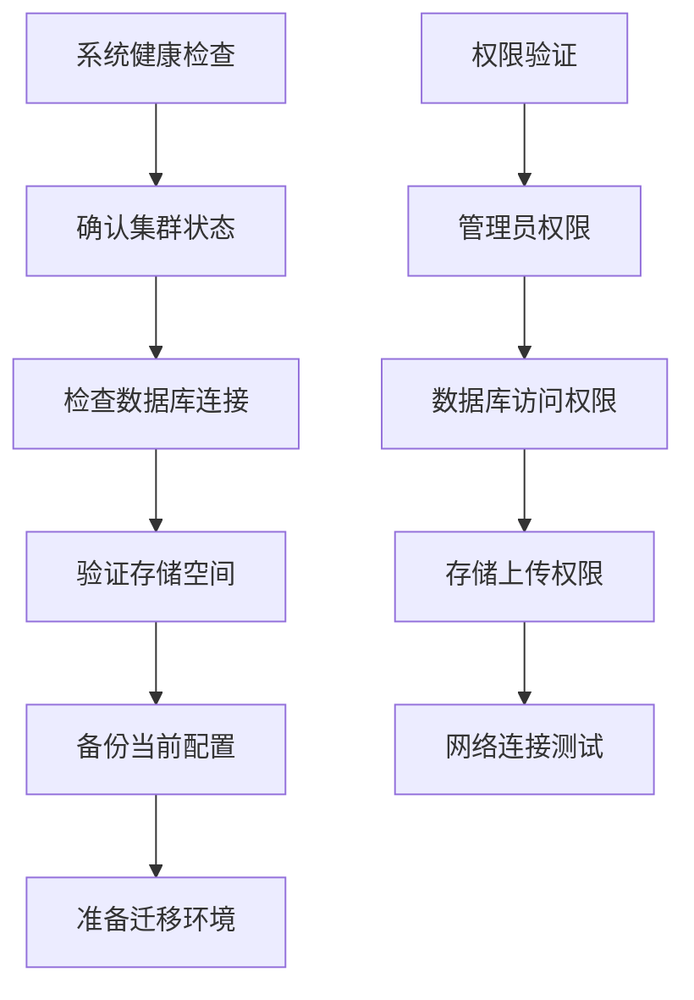

**节源**
- [cloud_migration.clj](file://src/metabase/cloud_migration/models/cloud_migration.clj#L108-L115)

### 配置验证

迁移前需要验证以下配置项：
- 存储API URL配置
- AWS KMS加密设置
- 分块上传阈值配置
- 版本兼容性检查

## 迁移流程架构

### 整体架构图

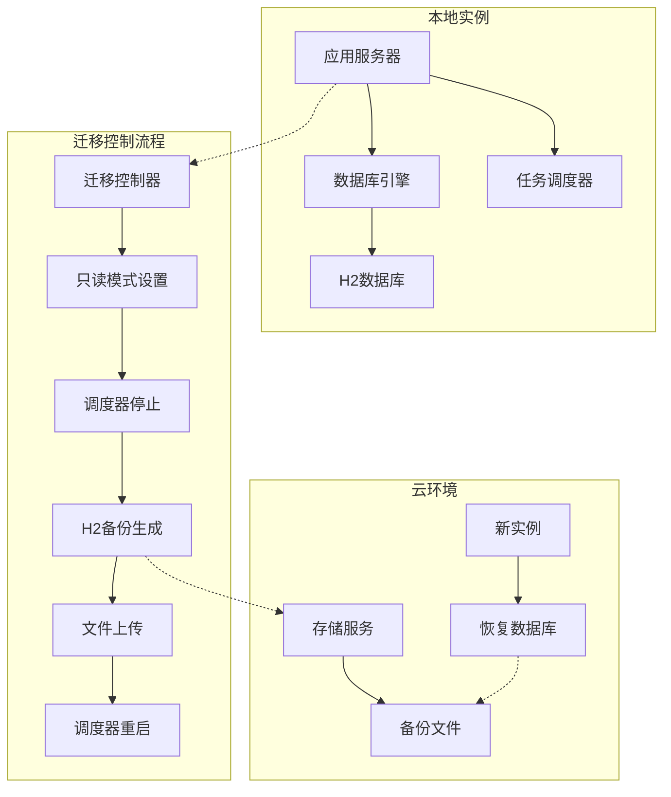

**图表源**
- [cloud_migration.clj](file://src/metabase/cloud_migration/models/cloud_migration.clj#L219-L249)

### 核心组件关系

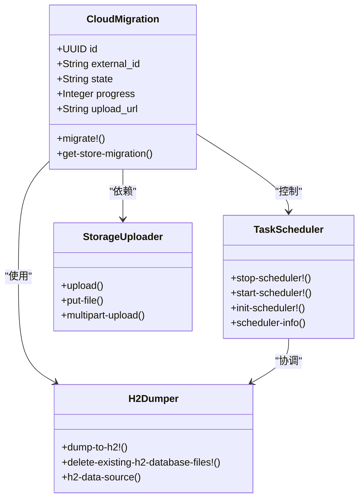

**图表源**
- [cloud_migration.clj](file://src/metabase/cloud_migration/models/cloud_migration.clj#L1-L50)
- [impl.clj](file://src/metabase/task/impl.clj#L1-L50)

## 详细迁移步骤

### 第一阶段：进入只读模式

#### 设置只读模式

迁移的第一步是将Metabase实例设置为只读模式，防止在备份过程中发生数据写入：

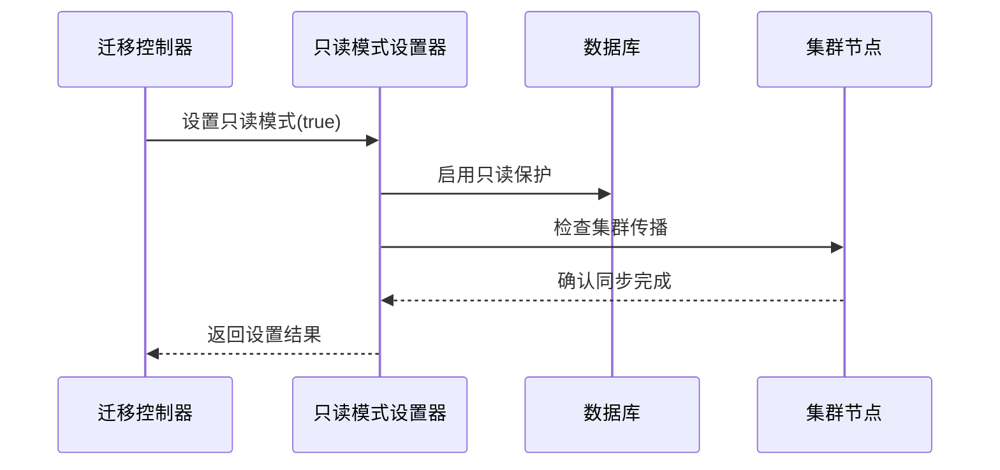

**图表源**
- [cloud_migration.clj](file://src/metabase/cloud_migration/models/cloud_migration.clj#L221-L225)

#### 只读模式保护范围

只读模式会阻止对以下表的写入操作：
- 所有业务数据表（Card、Dashboard、User等）
- 排除审计表、用户会话表
- 允许更新卡片最后使用时间戳

**节源**
- [cloud_migration.clj](file://src/metabase/cloud_migration/models/cloud_migration.clj#L47-L65)

### 第二阶段：任务调度器管理

#### 停止调度器

任务调度器的停止是确保迁移稳定性的关键步骤：

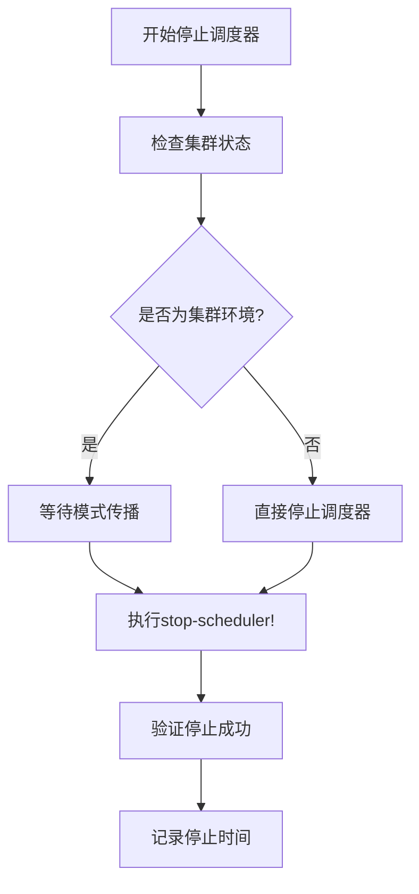

**图表源**
- [impl.clj](file://src/metabase/task/impl.clj#L140-L150)

#### 调度器启动恢复

迁移完成后，需要重新启动任务调度器：

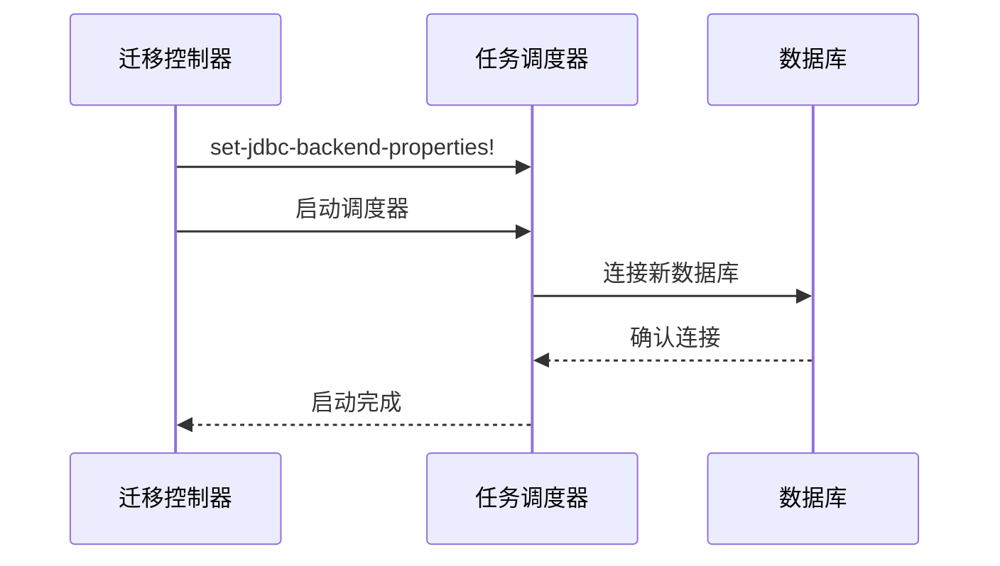

**图表源**
- [cloud_migration.clj](file://src/metabase/cloud_migration/models/cloud_migration.clj#L246-L248)

### 第三阶段：H2数据库备份生成

#### dump_to_h2功能调用

H2数据库备份的核心功能通过`dump-to-h2`命令实现：

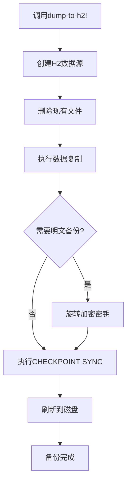

**图表源**
- [dump_to_h2.clj](file://src/metabase/cmd/dump_to_h2.clj#L36-L46)

#### 参数配置详解

| 参数 | 类型 | 默认值 | 说明 |
|------|------|--------|------|
| h2-filename | String | "metabase_dump.h2" | H2文件名 |
| keep-existing? | Boolean | false | 是否保留现有文件 |
| dump-plaintext? | Boolean | false | 是否生成明文备份 |

**节源**
- [dump_to_h2.clj](file://src/metabase/cmd/dump_to_h2.clj#L25-L35)

### 第四阶段：安全上传机制

#### 单文件上传

对于小于100MB的文件，使用单文件上传：

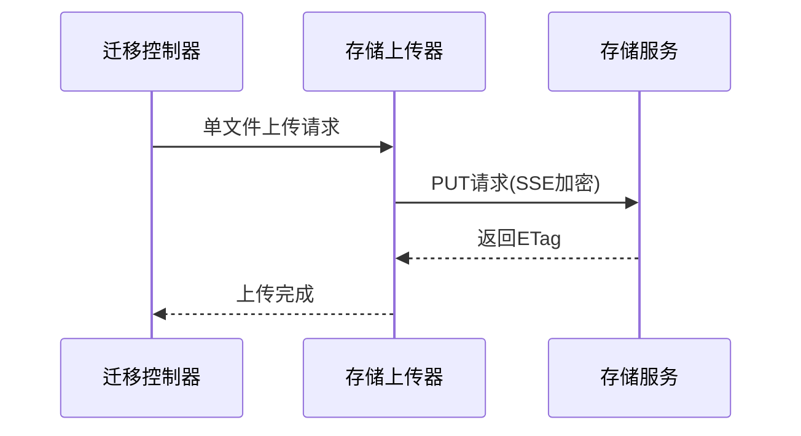

**图表源**
- [cloud_migration.clj](file://src/metabase/cloud_migration/models/cloud_migration.clj#L158-L160)

#### 多部分上传

对于大于100MB的文件，采用多部分上传机制：

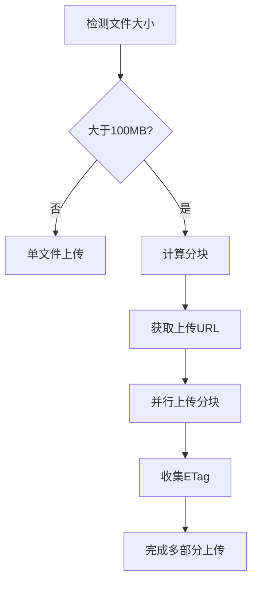

**图表源**
- [cloud_migration.clj](file://src/metabase/cloud_migration/models/cloud_migration.clj#L161-L196)

#### 上传进度监控

**图表源**
- [cloud_migration.clj](file://src/metabase/cloud_migration/models/cloud_migration.clj#L115-L125)

## 任务调度器管理

### 调度器生命周期

任务调度器在迁移过程中的生命周期管理：

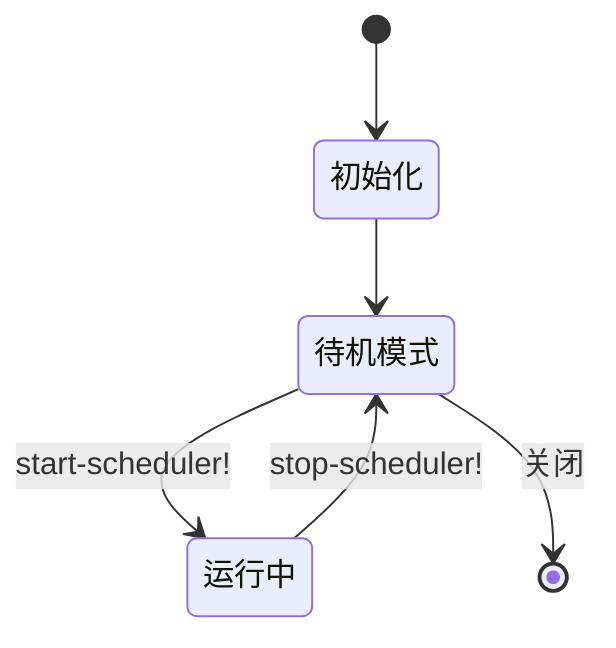

**图表源**
- [impl.clj](file://src/metabase/task/impl.clj#L120-L150)

### 调度器配置管理

调度器的配置信息通过以下方式管理：

| 配置项 | 作用 | 影响范围 |
|--------|------|----------|
| JDBC后端属性 | 数据库连接配置 | 所有定时任务 |
| 触发器状态 | 任务执行计划 | 定时任务调度 |
| 作业监听器 | 任务执行监控 | 任务状态跟踪 |

**节源**
- [impl.clj](file://src/metabase/task/impl.clj#L80-L90)

## H2数据库备份处理

### 备份生成流程

H2数据库备份的完整生成流程：

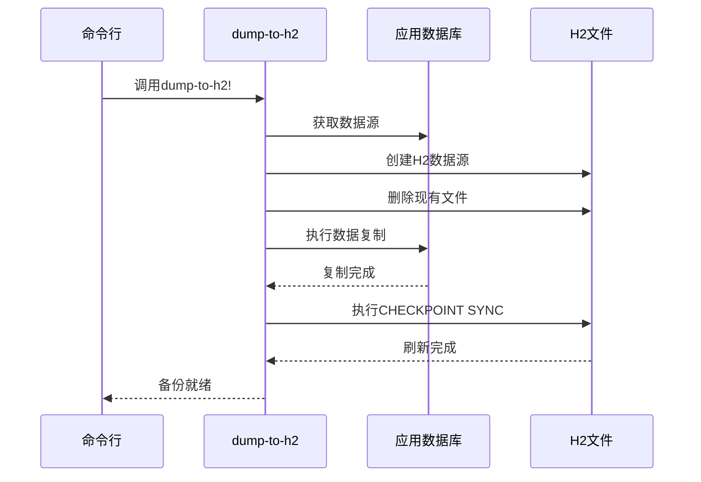

**图表源**
- [dump_to_h2.clj](file://src/metabase/cmd/dump_to_h2.clj#L36-L46)

### 加密处理

备份文件的加密处理机制：

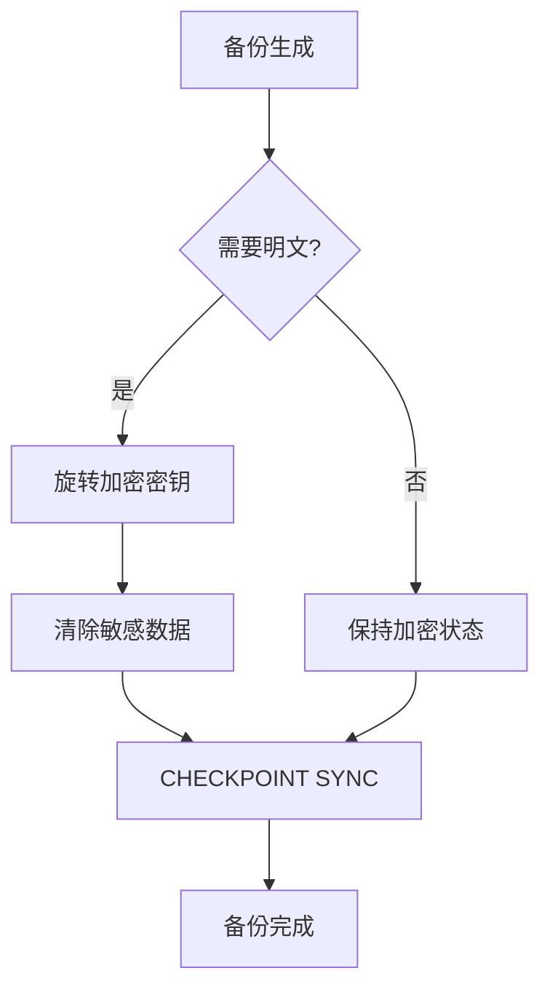

**图表源**
- [dump_to_h2.clj](file://src/metabase/cmd/dump_to_h2.clj#L42-L45)

### 文件清理策略

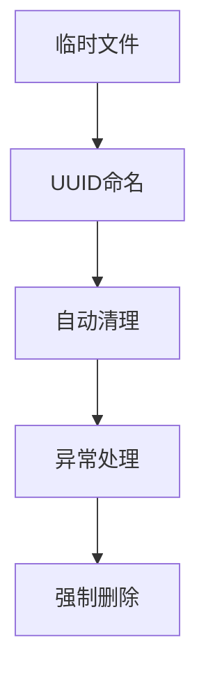

**图表源**
- [cloud_migration.clj](file://src/metabase/cloud_migration/models/cloud_migration.clj#L258-L260)

## 安全上传机制

### 传输加密

所有上传的数据都采用AWS KMS服务器端加密：

| 加密类型 | 算法 | 密钥长度 | 用途 |
|----------|------|----------|------|
| SSE-KMS | AES-256 | 256位 | 服务器端加密 |
| 传输层 | TLS 1.2+ | 动态 | 网络传输加密 |

### 上传可靠性

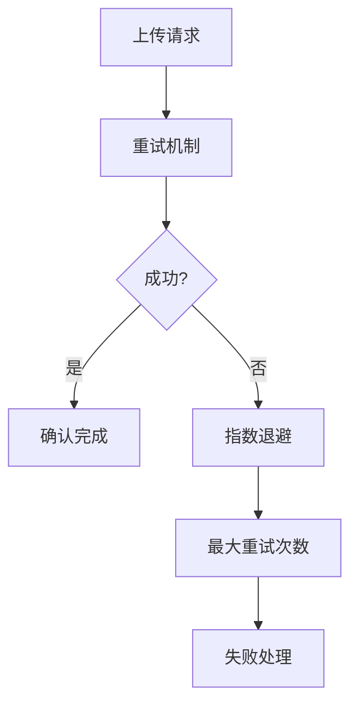

**图表源**
- [cloud_migration.clj](file://src/metabase/cloud_migration/models/cloud_migration.clj#L135-L145)

### 断点续传支持

多部分上传支持断点续传：

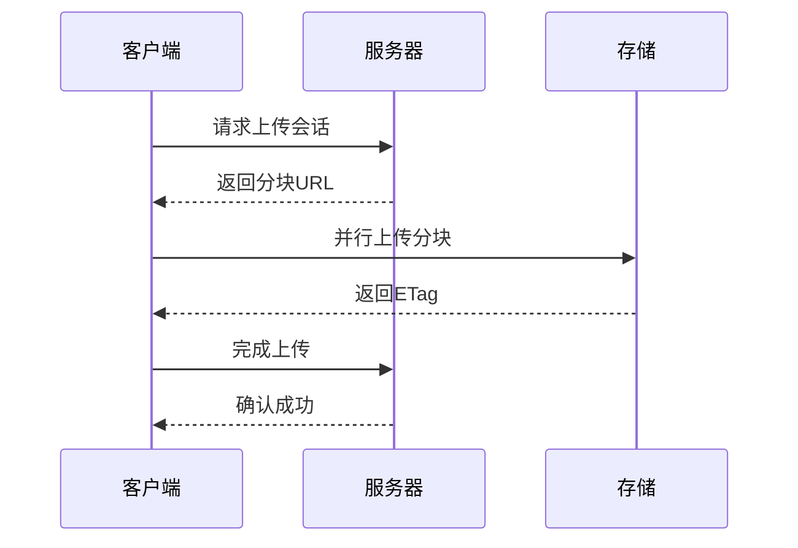

**图表源**
- [cloud_migration.clj](file://src/metabase/cloud_migration/models/cloud_migration.clj#L173-L196)

## 数据一致性保障

### 只读模式验证

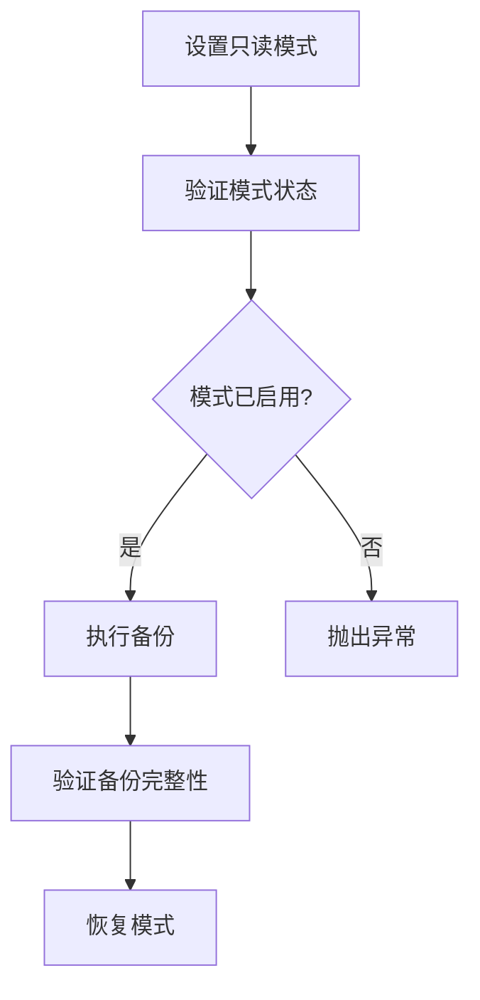

**图表源**
- [cloud_migration.clj](file://src/metabase/cloud_migration/models/cloud_migration.clj#L227-L230)

### 写入保护机制

只读模式通过管道拦截写入操作：

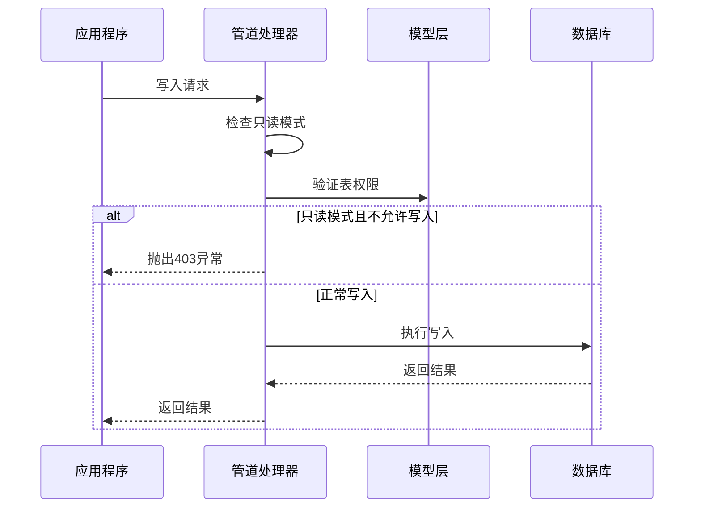

**图表源**
- [cloud_migration.clj](file://src/metabase/cloud_migration/models/cloud_migration.clj#L70-L85)

### 数据完整性检查

迁移过程中的数据完整性验证：

| 检查项目 | 验证方法 | 失败处理 |
|----------|----------|----------|
| 只读模式状态 | 模式标志检查 | 异常终止 |
| 备份文件完整性 | 文件大小验证 | 重新生成 |
| 上传完成状态 | ETag匹配 | 重新上传 |
| 集群同步状态 | 缓存更新间隔 | 等待同步 |

**节源**
- [cloud_migration.clj](file://src/metabase/cloud_migration/models/cloud_migration.clj#L227-L230)

## 验证检查点

### 迁移状态管理

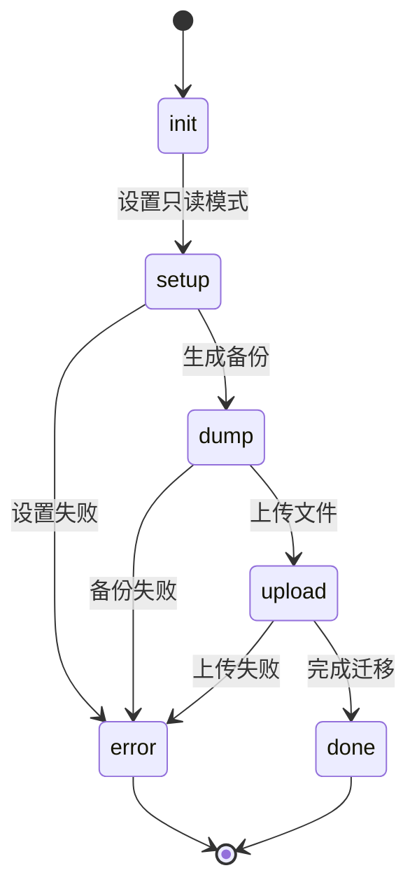

**图表源**
- [cloud_migration.clj](file://src/metabase/cloud_migration/models/cloud_migration.clj#L108-L115)

### 进度跟踪

每个阶段都有详细的进度跟踪：

| 阶段 | 进度范围 | 描述 |
|------|----------|------|
| init | 0% | 初始化状态 |
| setup | 1% | 设置只读模式 |
| dump | 20-49% | H2备份生成 |
| upload | 51-99% | 文件上传 |
| done | 100% | 迁移完成 |

**节源**
- [cloud_migration.clj](file://src/metabase/cloud_migration/models/cloud_migration.clj#L122-L125)

### 终止状态处理

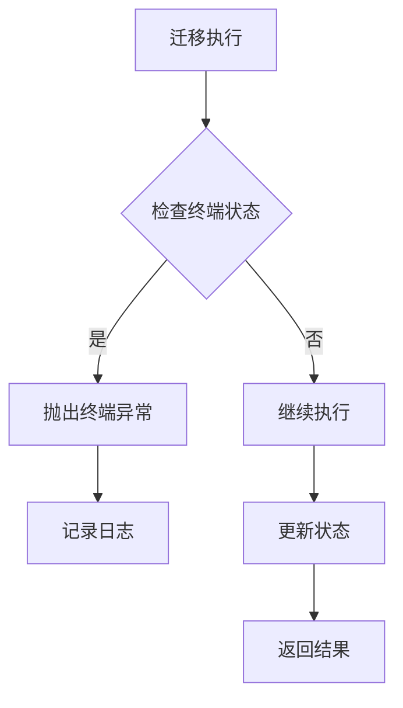

**图表源**
- [cloud_migration.clj](file://src/metabase/cloud_migration/models/cloud_migration.clj#L250-L255)

## 故障排除指南

### 常见问题及解决方案

#### 只读模式设置失败

**症状**: 备份过程中出现写入冲突错误

**原因**: 只读模式未正确设置或集群同步延迟

**解决方案**:
1. 检查集群节点状态
2. 增加等待时间
3. 手动验证只读模式状态

#### 任务调度器停止失败

**症状**: 调度器无法正常停止

**原因**: 任务正在执行或调度器配置错误

**解决方案**:
1. 等待当前任务完成
2. 检查调度器配置
3. 强制关闭调度器

#### 备份文件损坏

**症状**: H2文件无法正常加载

**原因**: 写入操作干扰或磁盘空间不足

**解决方案**:
1. 重新生成备份文件
2. 检查磁盘空间
3. 验证文件完整性

#### 上传超时

**症状**: 文件上传过程中断

**原因**: 网络不稳定或文件过大

**解决方案**:
1. 使用多部分上传
2. 增加重试次数
3. 检查网络连接

### 日志分析

关键日志位置和含义：

| 日志级别 | 关键词 | 含义 |
|----------|--------|------|
| INFO | "Setting read-only mode" | 只读模式设置 |
| INFO | "Stopping scheduler" | 调度器停止 |
| INFO | "Dumping h2 backup" | 备份生成 |
| INFO | "Uploading dump" | 文件上传 |
| ERROR | "Migration failed" | 迁移失败 |

**节源**
- [cloud_migration.clj](file://src/metabase/cloud_migration/models/cloud_migration.clj#L220-L255)

## 最佳实践建议

### 迁移前准备清单

- [ ] 验证系统资源充足
- [ ] 备份当前配置文件
- [ ] 测试网络连接
- [ ] 确认存储权限
- [ ] 准备回滚方案

### 迁移过程监控

- 实时监控迁移进度
- 定期检查系统状态
- 记录关键操作时间
- 监控资源使用情况

### 迁移后验证

- 验证数据完整性
- 测试核心功能
- 检查性能指标
- 更新监控告警

### 安全考虑

- 使用HTTPS传输
- 启用服务器端加密
- 定期轮换访问密钥
- 监控异常访问

通过遵循本指南中的步骤和最佳实践，可以确保Metabase从本地实例到云环境的平滑迁移，最大程度地减少服务中断和数据丢失风险。