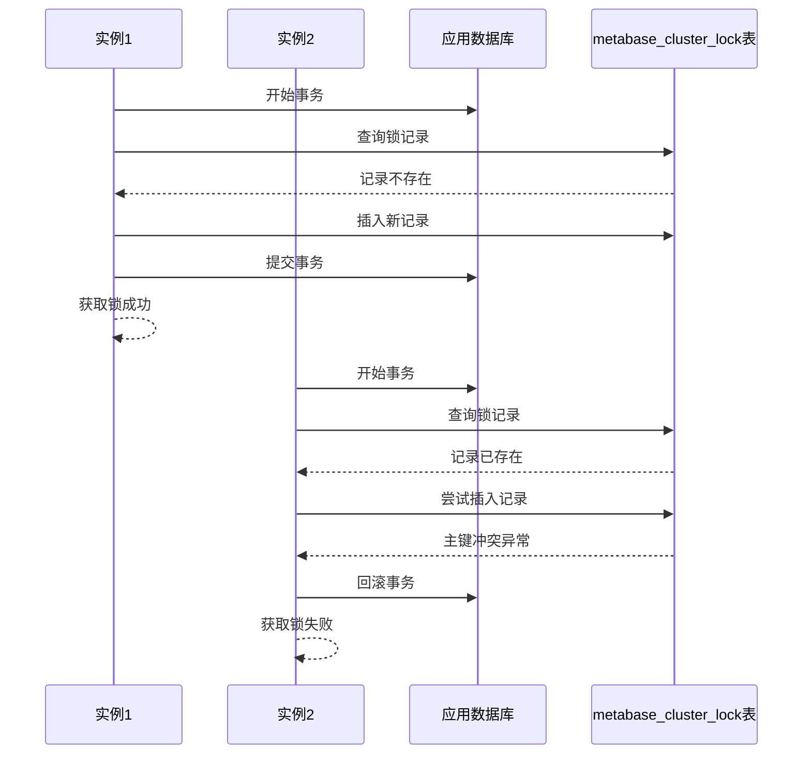
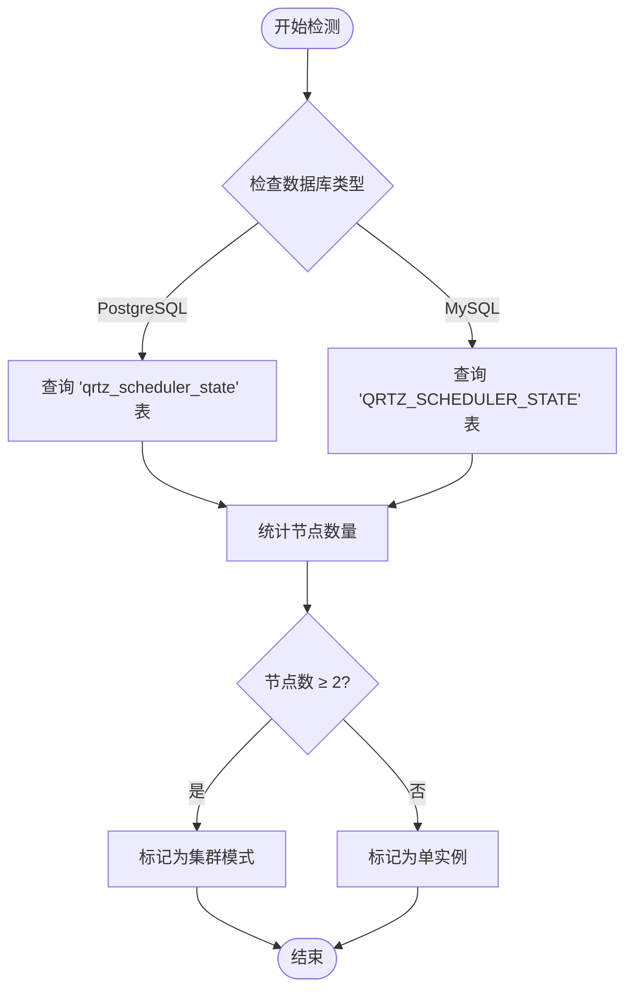
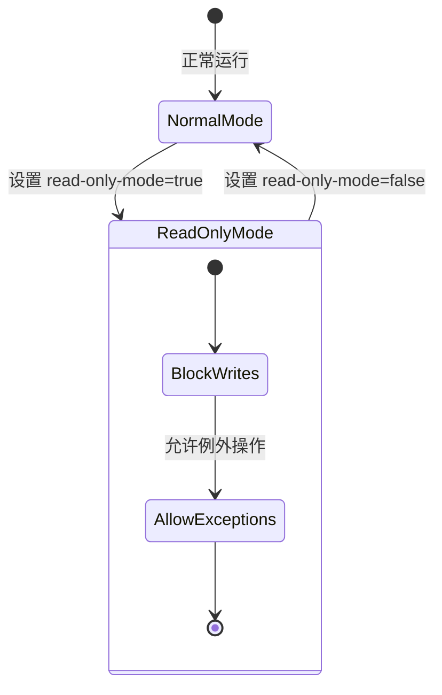
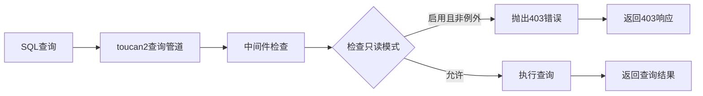
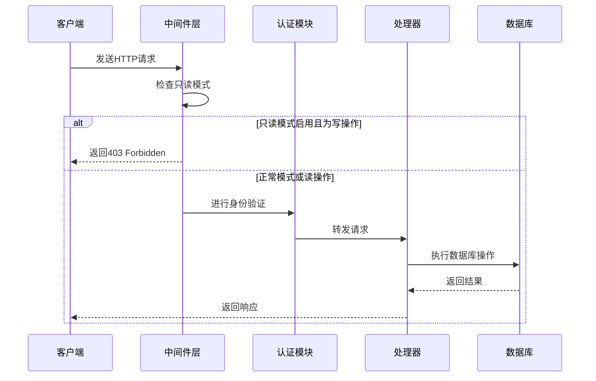
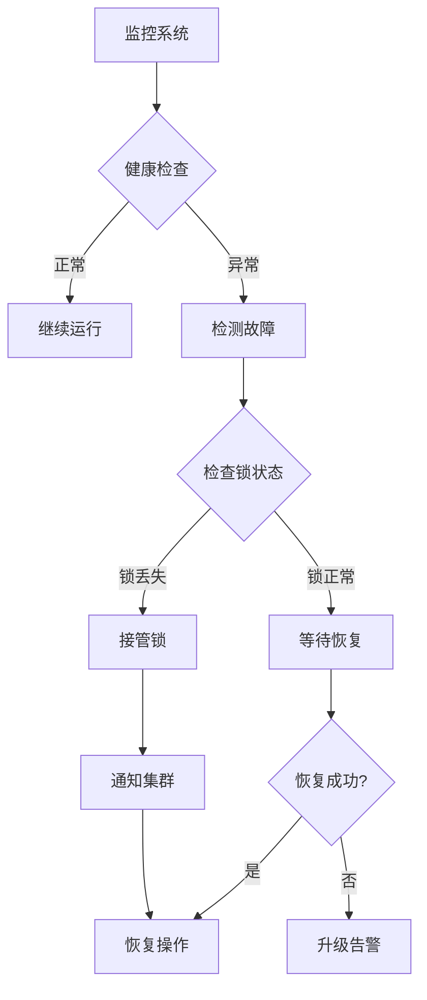

# 集群协调

<cite>
**本文档中引用的文件**
- [cluster_lock.clj](file://src/metabase/app_db/cluster_lock.clj)
- [cloud_migration.clj](file://src/metabase/cloud_migration/models/cloud_migration.clj)
- [settings.clj](file://src/metabase/cloud_migration/settings.clj)
- [core.clj](file://src/metabase/cloud_migration/core.clj)
- [migrate.clj](file://src/metabase/cmd/migrate.clj)
- [core.clj](file://src/metabase/app_db/core.clj)
- [connection.clj](file://src/metabase/app_db/connection.clj)
- [liquibase.clj](file://src/metabase/app_db/liquibase.clj)
- [config.clj](file://src/metabase/config/core.clj)
- [retry.clj](file://src/metabase/util/retry.clj)
- [cache.clj](file://src/metabase/cache/settings.clj)
- [setting_cache.clj](file://src/metabase/settings/models/setting/cache.clj)
</cite>

## 目录
1. [概述](#概述)
2. [分布式锁机制](#分布式锁机制)
3. [集群状态同步](#集群状态同步)
4. [读写模式切换](#读写模式切换)
5. [HTTP请求拦截](#http请求拦截)
6. [集群配置要求](#集群配置要求)
7. [故障转移与恢复](#故障转移与恢复)
8. [最佳实践](#最佳实践)

## 概述

在多实例Metabase集群环境中执行云迁移时，系统需要确保只有一个实例能够执行迁移操作，同时保证其他实例处于只读模式以维护数据一致性。本文档详细阐述了Metabase集群协调机制的设计原理和实现细节。

集群协调的核心组件包括：
- **分布式锁系统**：确保同一时间只有一个实例执行迁移
- **状态同步机制**：在集群节点间传播迁移状态
- **读写模式控制**：动态切换实例的读写权限
- **HTTP请求拦截**：阻止写操作的执行
- **故障转移处理**：应对节点故障和网络分区

## 分布式锁机制

### 锁实现原理

Metabase使用数据库级别的分布式锁来协调集群中的多个实例。核心实现位于[`cluster_lock.clj`](file://src/metabase/app_db/cluster_lock.clj#L58-L83)文件中。



**图表来源**
- [cluster_lock.clj](file://src/metabase/app_db/cluster_lock.clj#L58-L83)

### 锁特性

分布式锁具有以下关键特性：

1. **唯一性约束**：通过主键约束确保只有一个实例能成功插入锁记录
2. **事务隔离**：使用数据库事务保证锁操作的原子性
3. **超时机制**：支持设置查询超时防止死锁
4. **重试策略**：实现指数退避重试算法处理并发竞争

### 锁配置参数

| 参数 | 默认值 | 说明 |
|------|--------|------|
| 超时秒数 | 1秒 | 锁查询的最大等待时间 |
| 最大重试次数 | 5次 | 获取锁失败后的最大重试次数 |
| 初始间隔 | 1000毫秒 | 第一次重试的等待时间 |
| 最大间隔 | 1000毫秒 | 重试的最大等待时间 |
| 随机化因子 | 0.1 | 防止惊群效应的随机因子 |

**章节来源**
- [cluster_lock.clj](file://src/metabase/app_db/cluster_lock.clj#L28-L59)

## 集群状态同步

### 集群检测机制

系统通过检查Quartz调度器节点数量来判断是否为集群环境。实现逻辑如下：



**图表来源**
- [cloud_migration.clj](file://src/metabase/cloud_migration/models/cloud_migration.clj#L104-L110)

### 状态传播延迟

当启用集群模式时，系统会等待一段时间以确保所有节点都感知到状态变化：

```clojure
(when (cluster?)
  (log/info "Cluster detected, waiting for read-only mode to propagate")
  (Thread/sleep (int (* 1.5 setting/cache-update-check-interval-ms))))
```

这种设计确保了：
- 所有节点都有足够时间更新缓存
- 避免因网络延迟导致的状态不一致
- 提供可预测的同步窗口

**章节来源**
- [cloud_migration.clj](file://src/metabase/cloud_migration/models/cloud_migration.clj#L219-L222)

## 读写模式切换

### 只读模式设置

迁移过程中，系统通过设置全局标志位来控制实例的读写权限：



**图表来源**
- [settings.clj](file://src/metabase/cloud_migration/settings.clj#L75-L83)

### 写操作阻断机制

系统通过`toucan2`查询管道的中间件来拦截写操作：



**图表来源**
- [cloud_migration.clj](file://src/metabase/cloud_migration/models/cloud_migration.clj#L61-L75)

### 例外操作列表

以下操作被允许在只读模式下执行：

| 模型 | 特殊条件 |
|------|----------|
| CloudMigration | 允许所有字段更新 |
| Setting | 允许所有字段更新 |
| User | 允许登录和查询 |
| Session | 允许用户会话管理 |
| LoginHistory | 允许审计日志 |
| AuditLog | 允许审计跟踪 |
| ViewLog | 允许访问日志 |
| Card | 仅允许更新 `last_used_at` 和 `updated_at` 字段 |

**章节来源**
- [cloud_migration.clj](file://src/metabase/cloud_migration/models/cloud_migration.clj#L32-L50)

## HTTP请求拦截

### 请求拦截器架构

HTTP请求拦截通过Clojure中间件层实现，确保在应用层阻止写操作：



**图表来源**
- [cloud_migration.clj](file://src/metabase/cloud_migration/models/cloud_migration.clj#L61-L75)

### 错误处理机制

当检测到写操作时，系统抛出结构化的异常信息：

```clojure
(throw (ex-info (tru "Metabase is in read-only-mode mode!")
                {:status-code 403}))
```

这种设计确保：
- 客户端能够正确识别请求被拒绝的原因
- 日志记录包含详细的上下文信息
- API响应格式保持一致性

**章节来源**
- [cloud_migration.clj](file://src/metabase/cloud_migration/models/cloud_migration.clj#L68-L70)

## 集群配置要求

### 数据库要求

集群环境对数据库有特定要求：

| 要求 | PostgreSQL | MySQL | H2 |
|------|------------|-------|----|
| 支持的连接池 | c3p0 | c3p0 | 不支持 |
| 分布式锁支持 | ✅ | ✅ | ❌ |
| 事务隔离级别 | 可序列化 | 可重复读 | 读未提交 |
| 并发控制 | MVCC | MVCC | 无 |

### 网络通信要求

1. **数据库连接**：所有实例必须能够直接访问共享的应用数据库
2. **时钟同步**：建议使用NTP服务确保各节点时钟同步
3. **网络延迟**：控制在100ms以内以减少锁竞争
4. **防火墙配置**：开放必要的数据库端口

### 配置参数优化

```clojure
;; 推荐的集群配置参数
{
  :mb-db-connection-pool-size 20
  :mb-db-connection-timeout 30000
  :mb-cache-update-check-interval-ms 2000
  :mb-cluster-lock-timeout-seconds 1
}
```

**章节来源**
- [config.clj](file://src/metabase/config/core.clj#L50-L70)
- [connection.clj](file://src/metabase/app_db/connection.clj#L40-L60)

## 故障转移与恢复

### 故障检测机制

系统通过多种方式检测节点故障：



### 恢复策略

1. **自动恢复**：对于临时性故障，系统自动尝试重新建立连接
2. **手动干预**：对于严重故障，提供管理员手动干预接口
3. **数据一致性检查**：迁移完成后验证数据完整性
4. **回滚机制**：在发现问题时能够安全回滚到迁移前状态

### 锁清理机制

当实例异常终止时，系统提供锁清理功能：

```clojure
(defn release-concurrent-locks!
  "释放当前进程持有的任何锁"
  [conn-or-data-source]
  ;; 检查是否有锁定的实例
  ;; 创建新的Liquibase实例清理锁
  ;; 确保清理的是同数据库的锁)
```

**章节来源**
- [liquibase.clj](file://src/metabase/app_db/liquibase.clj#L284-L302)

## 最佳实践

### 迁移前准备

1. **备份验证**：确保所有实例都有完整备份
2. **依赖检查**：确认所有外部依赖服务可用
3. **容量评估**：评估目标环境的资源需求
4. **测试验证**：在测试环境中验证迁移流程

### 迁移执行

1. **分阶段执行**：采用渐进式迁移策略
2. **监控告警**：实时监控迁移进度和系统状态
3. **人工干预**：保留人工干预的通道
4. **文档记录**：详细记录每一步操作

### 迁移后验证

1. **功能测试**：验证所有核心功能正常
2. **性能测试**：确认系统性能满足要求
3. **数据完整性**：检查数据一致性和完整性
4. **回滚准备**：准备好快速回滚方案

### 运维监控

1. **健康指标**：监控集群健康状态
2. **性能指标**：跟踪系统性能表现
3. **错误监控**：及时发现和处理异常
4. **容量规划**：根据使用情况调整资源配置

通过以上机制和实践，Metabase集群能够安全、可靠地执行云迁移操作，确保数据一致性和业务连续性。