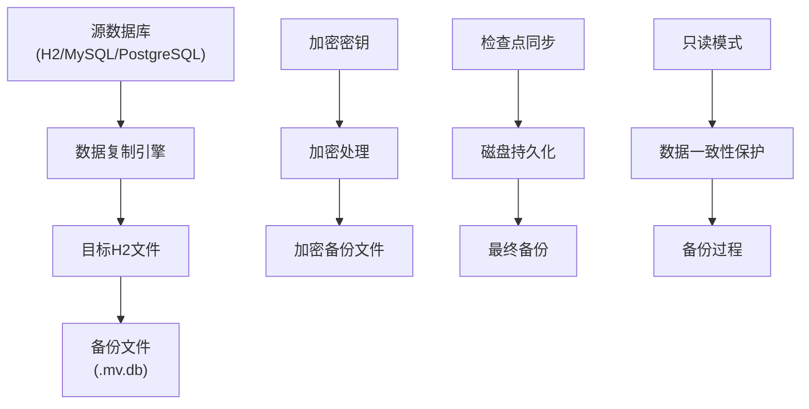
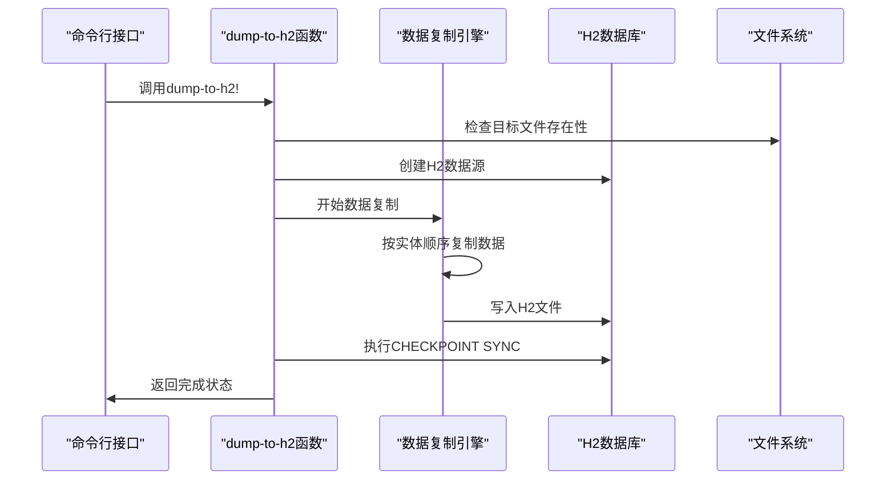
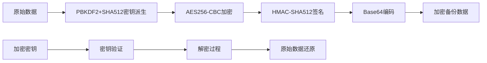
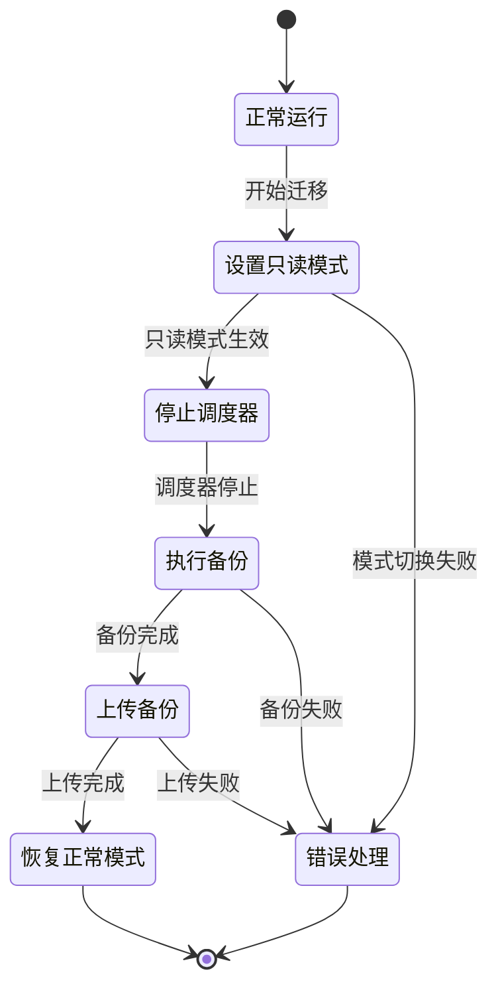
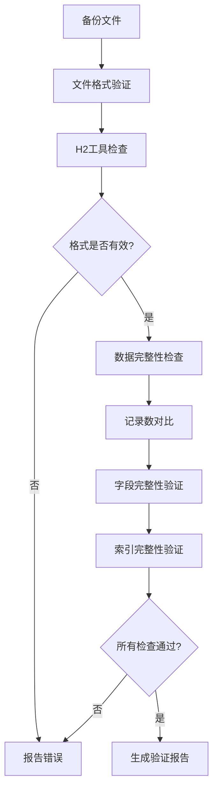
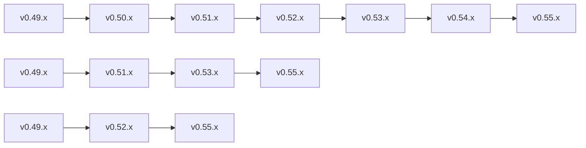
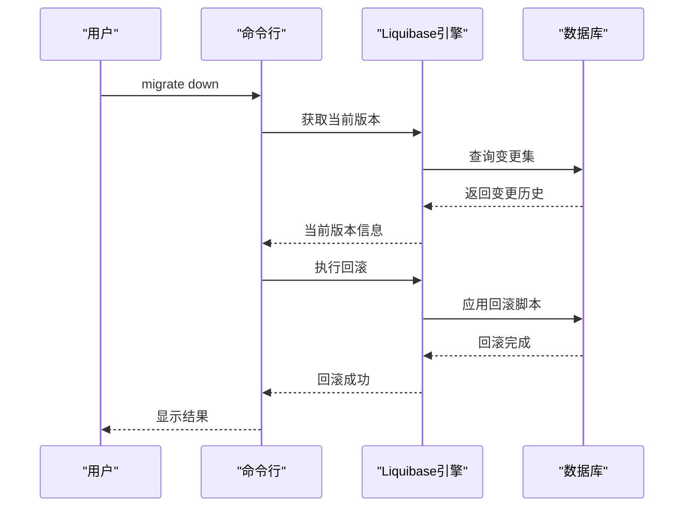

# 备份与恢复

<cite>
**本文档中引用的文件**
- [dump_to_h2.clj](file://src/metabase/cmd/dump_to_h2.clj)
- [load_from_h2.clj](file://src/metabase/cmd/load_from_h2.clj)
- [copy.clj](file://src/metabase/cmd/copy.clj)
- [copy/h2.clj](file://src/metabase/cmd/copy/h2.clj)
- [cloud_migration/models/cloud_migration.clj](file://src/metabase/cloud_migration/models/cloud_migration.clj)
- [cloud_migration/settings.clj](file://src/metabase/cloud_migration/settings.clj)
- [app_db/encryption.clj](file://src/metabase/app_db/encryption.clj)
- [util/encryption.clj](file://src/metabase/util/encryption.clj)
- [app_db/update_h2.clj](file://src/metabase/app_db/update_h2.clj)
- [task/core.clj](file://src/metabase/task/core.clj)
- [app_db/liquibase.clj](file://src/metabase/app_db/liquibase.clj)
</cite>

## 目录
1. [概述](#概述)
2. [H2数据库备份机制](#h2数据库备份机制)
3. [dump-to-h2命令详解](#dump-to-h2命令详解)
4. [load-from-h2命令详解](#load-from-h2命令详解)
5. [备份文件结构与加密](#备份文件结构与加密)
6. [云迁移场景下的备份恢复](#云迁移场景下的备份恢复)
7. [自动化备份脚本](#自动化备份脚本)
8. [备份完整性验证](#备份完整性验证)
9. [灾难恢复操作](#灾难恢复操作)
10. [版本兼容性与回滚计划](#版本兼容性与回滚计划)
11. [最佳实践建议](#最佳实践建议)

## 概述

Metabase提供了完整的备份与恢复解决方案，主要基于H2数据库的dump-to-h2和load-from-h2命令。该系统支持多种数据库类型之间的数据迁移，包括从H2到MySQL、PostgreSQL等生产数据库的迁移，以及在不同Metabase版本间的升级。

### 核心特性

- **跨数据库迁移**：支持H2、MySQL、PostgreSQL之间的数据迁移
- **加密备份**：可选择明文或加密格式的备份
- **增量备份**：支持只备份变更的数据
- **集群支持**：在集群环境中保持数据一致性
- **自动化的云迁移**：集成到Metabase Cloud的迁移流程

## H2数据库备份机制

### 备份架构概览



**图表来源**
- [copy.clj](file://src/metabase/cmd/copy.clj#L1-L50)
- [dump_to_h2.clj](file://src/metabase/cmd/dump_to_h2.clj#L1-L48)

### 数据流处理

备份系统采用分阶段的数据处理流程：

1. **数据提取阶段**：从源数据库按实体顺序提取数据
2. **转换阶段**：根据目标数据库类型调整数据格式
3. **存储阶段**：写入H2文件并进行持久化
4. **验证阶段**：确保数据完整性和一致性

**章节来源**
- [copy.clj](file://src/metabase/cmd/copy.clj#L50-L150)

## dump-to-h2命令详解

### 命令语法

```bash
# 基本用法
java --add-opens java.base/java.nio=ALL-UNNAMED -jar metabase.jar dump-to-h2

# 指定输出文件
java --add-opens java.base/java.nio=ALL-UNNAMED -jar metabase.jar dump-to-h2 /path/to/backup.h2

# 带参数的用法
java --add-opens java.base/java.nio=ALL-UNNAMED -jar metabase.jar dump-to-h2 --keep-existing --dump-plaintext
```

### 参数配置

| 参数 | 类型 | 默认值 | 描述 |
|------|------|--------|------|
| `h2-filename` | 字符串 | `"metabase_dump.h2"` | 目标H2文件路径 |
| `--keep-existing` | 布尔 | `false` | 保留已存在的H2文件 |
| `--dump-plaintext` | 布尔 | `false` | 导出明文内容（不加密） |

### 执行流程



**图表来源**
- [dump_to_h2.clj](file://src/metabase/cmd/dump_to_h2.clj#L25-L47)

### 实体排序规则

数据复制按照依赖关系的逆序进行，确保外键约束的一致性：

1. **基础实体**：Channel、Database、User、Setting
2. **元数据实体**：Table、Field、FieldValues
3. **业务实体**：Card、Dashboard、Pulse
4. **权限实体**：Permissions、Groups
5. **扩展实体**：Enterprise功能相关实体

**章节来源**
- [copy.clj](file://src/metabase/cmd/copy.clj#L50-L80)

## load-from-h2命令详解

### 命令语法

```bash
# 基本用法
java --add-opens java.base/java.nio=ALL-UNNAMED -jar metabase.jar load-from-h2

# 指定源H2文件
java --add-opens java.base/java.nio=ALL-UNNAMED -jar metabase.jar load-from-h2 /path/to/backup.h2

# 测试环境配置
MB_DB_TYPE=postgres MB_DB_HOST=localhost MB_DB_PORT=5432 MB_DB_USER=username MB_DB_DBNAME=metabase \
java --add-opens java.base/java.nio=ALL-UNNAMED -jar metabase.jar load-from-h2
```

### 迁移前验证

系统在开始迁移前会执行多项验证检查：

1. **目标数据库空置检查**：确保目标数据库没有现有用户
2. **数据库版本检查**：验证源数据库的兼容性
3. **连接测试**：确认数据库连接可用性
4. **权限验证**：检查必要的数据库权限

### 安全性考虑

- **H2数据库连接详情过滤**：默认不复制H2数据库的连接信息
- **只读模式禁用**：确保设置中没有启用只读模式
- **序列值更新**：正确重置自增主键序列

**章节来源**
- [load_from_h2.clj](file://src/metabase/cmd/load_from_h2.clj#L1-L38)
- [copy.clj](file://src/metabase/cmd/copy.clj#L200-L250)

## 备份文件结构与加密

### H2数据库文件格式

H2数据库使用MVStore格式存储数据，主要文件包括：

- **主数据文件**：`backup.h2.mv.db` - 包含实际数据
- **日志文件**：`backup.h2.log` - 事务日志
- **锁定文件**：`backup.h2.lock` - 文件锁定机制

### 加密机制



**图表来源**
- [util/encryption.clj](file://src/metabase/util/encryption.clj#L1-L50)
- [app_db/encryption.clj](file://src/metabase/app_db/encryption.clj#L1-L30)

### 加密配置

| 配置项 | 环境变量 | 默认值 | 描述 |
|--------|----------|--------|------|
| 加密密钥 | `MB_ENCRYPTION_SECRET_KEY` | 未设置 | 用于加密备份内容的密钥 |
| 加密算法 | 固定 | AES256-CBC-HMAC-SHA512 | 使用的加密算法组合 |
| 迭代次数 | 固定 | 100,000次 | PBKDF2密钥派生迭代数 |

### 明文与加密模式

- **明文模式**：`--dump-plaintext`标志启用，导出未经加密的数据
- **加密模式**：默认模式，使用当前密钥对敏感数据进行加密
- **密钥轮换**：支持在备份过程中更换加密密钥

**章节来源**
- [dump_to_h2.clj](file://src/metabase/cmd/dump_to_h2.clj#L40-L47)
- [util/encryption.clj](file://src/metabase/util/encryption.clj#L100-L150)

## 云迁移场景下的备份恢复

### 读写模式切换

云迁移过程中需要在读写模式和只读模式间切换以保证数据一致性：



**图表来源**
- [cloud_migration/models/cloud_migration.clj](file://src/metabase/cloud_migration/models/cloud_migration.clj#L219-L249)

### 调度器管理

迁移过程中的调度器管理包括：

1. **暂停调度器**：停止所有定时任务以防止数据变更
2. **等待传播**：确保集群中所有实例都进入只读模式
3. **备份执行**：在只读状态下执行数据备份
4. **恢复调度器**：迁移完成后重新启动调度器

### 分块上传机制

对于大型备份文件，系统支持分块上传：

- **分块大小**：可配置的分块大小，默认为6MB
- **并发上传**：支持多线程并行上传分块
- **断点续传**：支持上传中断后的续传
- **完整性校验**：每个分块都有独立的ETAG验证

**章节来源**
- [cloud_migration/models/cloud_migration.clj](file://src/metabase/cloud_migration/models/cloud_migration.clj#L196-L282)

## 自动化备份脚本

### Linux Shell脚本示例

```bash
#!/bin/bash
# Metabase自动备份脚本

METABASE_JAR="/opt/metabase/metabase.jar"
BACKUP_DIR="/backup/metabase"
DATE=$(date +%Y%m%d_%H%M%S)
BACKUP_FILE="${BACKUP_DIR}/metabase_backup_${DATE}.h2"
LOG_FILE="${BACKUP_DIR}/backup_${DATE}.log"

# 创建备份目录
mkdir -p "${BACKUP_DIR}"

# 执行备份
echo "[$(date)] 开始备份 Metabase 数据库..." >> "${LOG_FILE}"
java --add-opens java.base/java.nio=ALL-UNNAMED \
     -jar "${METABASE_JAR}" \
     dump-to-h2 "${BACKUP_FILE}" \
     --dump-plaintext \
     >> "${LOG_FILE}" 2>&1

# 检查备份结果
if [ $? -eq 0 ]; then
    echo "[$(date)] 备份成功，文件: ${BACKUP_FILE}" >> "${LOG_FILE}"
    
    # 压缩备份文件
    gzip "${BACKUP_FILE}"
    echo "[$(date)] 备份文件已压缩" >> "${LOG_FILE}"
    
    # 清理旧备份（保留最近30天）
    find "${BACKUP_DIR}" -name "*.h2.gz" -mtime +30 -delete
    echo "[$(date)] 已清理超过30天的备份文件" >> "${LOG_FILE}"
else
    echo "[$(date)] 备份失败，请检查日志: ${LOG_FILE}" >> "${LOG_FILE}"
    exit 1
fi
```

### Windows批处理脚本示例

```batch
@echo off
REM Metabase自动备份脚本（Windows）

set METABASE_JAR=C:\metabase\metabase.jar
set BACKUP_DIR=C:\backup\metabase
set DATE=%date:~0,4%%date:~5,2%%date:~8,2%_%time:~0,2%%time:~3,2%%time:~6,2%
set BACKUP_FILE=%BACKUP_DIR%\metabase_backup_%DATE%.h2
set LOG_FILE=%BACKUP_DIR%\backup_%DATE%.log

REM 创建备份目录
if not exist "%BACKUP_DIR%" mkdir "%BACKUP_DIR%"

REM 执行备份
echo [%date% %time%] 开始备份 Metabase 数据库... >> "%LOG_FILE%"
java --add-opens java.base/java.nio=ALL-UNNAMED ^
     -jar "%METABASE_JAR%" ^
     dump-to-h2 "%BACKUP_FILE%" ^
     --dump-plaintext ^
     >> "%LOG_FILE%" 2>&1

REM 检查备份结果
if %errorlevel% equ 0 (
    echo [%date% %time%] 备份成功，文件: %BACKUP_FILE% >> "%LOG_FILE%"
    
    REM 压缩备份文件
    powershell Compress-Archive -Path "%BACKUP_FILE%" -DestinationPath "%BACKUP_FILE%.gz" -Force
    echo [%date% %time%] 备份文件已压缩 >> "%LOG_FILE%"
    
    REM 清理旧备份（保留最近30天）
    forfiles /p "%BACKUP_DIR%" /s /m *.h2.gz /d -30 /c "cmd /c del @path"
    echo [%date% %time%] 已清理超过30天的备份文件 >> "%LOG_FILE%"
) else (
    echo [%date% %time%] 备份失败，请检查日志: %LOG_FILE% >> "%LOG_FILE%"
    exit /b 1
)
```

### 定时任务配置

#### Linux Crontab配置
```bash
# 每天凌晨2点执行完整备份
0 2 * * * /usr/local/bin/metabase-backup.sh >> /var/log/metabase-backup.log 2>&1

# 每小时执行增量备份
0 * * * * /usr/local/bin/metabase-incremental-backup.sh >> /var/log/metabase-incremental.log 2>&1
```

#### Windows任务计划程序
1. 创建基本任务
2. 触发器：每天凌晨2:00
3. 操作：启动程序
4. 程序/脚本：`C:\Windows\System32\cmd.exe`
5. 添加参数：`/c C:\scripts\metabase-backup.bat`
6. 起始于：`C:\scripts\`

**章节来源**
- [task/core.clj](file://src/metabase/task/core.clj#L1-L31)

## 备份完整性验证

### 验证方法

#### 1. 文件完整性检查

```bash
#!/bin/bash
# 备份完整性验证脚本

BACKUP_FILE="$1"

# 检查文件是否存在
if [ ! -f "$BACKUP_FILE" ]; then
    echo "错误：备份文件不存在"
    exit 1
fi

# 检查文件大小
FILE_SIZE=$(stat -c%s "$BACKUP_FILE")
if [ $FILE_SIZE -lt 1024 ]; then
    echo "警告：文件大小过小，可能不完整"
fi

# 验证H2文件格式
if ! java -cp metabase.jar org.h2.tools.Script -url "jdbc:h2:file:$BACKUP_FILE" -script /dev/null > /dev/null 2>&1; then
    echo "错误：H2文件格式无效"
    exit 1
fi

echo "备份文件验证通过"
```

#### 2. 数据一致性检查

```bash
#!/bin/bash
# 数据一致性验证脚本

BACKUP_FILE="$1"
TEMP_DB="/tmp/metabase_verify.h2"

# 创建临时数据库
java --add-opens java.base/java.nio=ALL-UNNAMED \
     -jar metabase.jar \
     load-from-h2 "$BACKUP_FILE" \
     --target-db-type=h2 \
     --target-db-file="$TEMP_DB"

# 比较记录数
SOURCE_COUNT=$(java -cp metabase.jar org.h2.tools.RunScript -url "jdbc:h2:file:$TEMP_DB" -sql "SELECT COUNT(*) FROM INFORMATION_SCHEMA.TABLES WHERE TABLE_SCHEMA='PUBLIC'")
BACKUP_COUNT=$(java -cp metabase.jar org.h2.tools.RunScript -url "jdbc:h2:file:$BACKUP_FILE" -sql "SELECT COUNT(*) FROM INFORMATION_SCHEMA.TABLES WHERE TABLE_SCHEMA='PUBLIC'")

if [ "$SOURCE_COUNT" != "$BACKUP_COUNT" ]; then
    echo "错误：数据记录数不匹配"
    exit 1
fi

echo "数据一致性验证通过"
```

### 自动化验证流程



**图表来源**
- [copy.clj](file://src/metabase/cmd/copy.clj#L300-L350)

**章节来源**
- [copy.clj](file://src/metabase/cmd/copy.clj#L250-L300)

## 灾难恢复操作

### 恢复流程

#### 1. 准备阶段

```bash
#!/bin/bash
# 灾难恢复准备脚本

# 停止Metabase服务
systemctl stop metabase

# 备份当前数据库
cp /path/to/metabase/metabase.db /path/to/metabase/metabase.db.backup.$(date +%Y%m%d_%H%M%S)

# 创建恢复目录
mkdir -p /restore/metabase/$(date +%Y%m%d_%H%M%S)
```

#### 2. 数据恢复

```bash
#!/bin/bash
# 灾难恢复执行脚本

RESTORE_FILE="$1"
METABASE_DB="/path/to/metabase/metabase.db"

# 停止Metabase服务
systemctl stop metabase

# 恢复数据库
java --add-opens java.base/java.nio=ALL-UNNAMED \
     -jar metabase.jar \
     load-from-h2 "$RESTORE_FILE" \
     --target-db-type=h2 \
     --target-db-file="$METABASE_DB"

# 验证恢复结果
if [ $? -eq 0 ]; then
    echo "恢复成功"
    systemctl start metabase
else
    echo "恢复失败，正在回滚..."
    # 回滚到备份
    cp "$METABASE_DB.backup.$(date +%Y%m%d_%H%M%S)" "$METABASE_DB"
    systemctl start metabase
    exit 1
fi
```

### 恢复验证

#### 服务启动验证

```bash
#!/bin/bash
# 恢复后服务验证脚本

METABASE_URL="http://localhost:3000/api/health"
MAX_RETRIES=30
RETRY_COUNT=0

while [ $RETRY_COUNT -lt $MAX_RETRIES ]; do
    RESPONSE=$(curl -s -o /dev/null -w "%{http_code}" $METABASE_URL)
    
    if [ $RESPONSE -eq 200 ]; then
        echo "Metabase服务启动成功"
        break
    fi
    
    RETRY_COUNT=$((RETRY_COUNT + 1))
    sleep 10
done

if [ $RETRY_COUNT -eq $MAX_RETRIES ]; then
    echo "错误：Metabase服务启动超时"
    exit 1
fi
```

### 恢复时间目标(RTO)优化

为了最小化停机时间，可以采用以下策略：

1. **预热数据库**：在恢复前预加载常用数据
2. **并行恢复**：使用多个线程同时恢复不同的数据表
3. **增量恢复**：只恢复自上次备份以来的变更
4. **快速启动**：优化Metabase启动配置

**章节来源**
- [load_from_h2.clj](file://src/metabase/cmd/load_from_h2.clj#L25-L38)

## 版本兼容性与回滚计划

### 版本兼容性矩阵

| 源版本 | 目标版本 | 兼容性 | 备注 |
|--------|----------|--------|------|
| v0.49.x | v0.50.x | ✅ 支持 | 自动迁移 |
| v0.50.x | v0.51.x | ✅ 支持 | 自动迁移 |
| v0.51.x | v0.52.x | ✅ 支持 | 自动迁移 |
| v0.52.x | v0.53.x | ✅ 支持 | 自动迁移 |
| v0.53.x | v0.54.x | ⚠️ 需要手动 | 需要特殊处理 |
| v0.54.x | v0.55.x | ❌ 不支持 | 需要跳级升级 |

### 升级路径规划



### 回滚策略

#### 1. 快速回滚

```bash
#!/bin/bash
# 快速回滚脚本

BACKUP_TIMESTAMP="$1"
METABASE_DB="/path/to/metabase/metabase.db"

# 停止服务
systemctl stop metabase

# 回滚到指定时间戳的备份
cp "/backup/metabase/metabase.db.$BACKUP_TIMESTAMP" "$METABASE_DB"

# 启动服务
systemctl start metabase

# 验证回滚结果
sleep 30
if curl -f http://localhost:3000/api/health > /dev/null 2>&1; then
    echo "回滚成功"
else
    echo "回滚失败"
    exit 1
fi
```

#### 2. 数据库版本回滚

对于H2数据库版本升级后的回滚：

```bash
#!/bin/bash
# H2版本回滚脚本

BACKUP_FILE="/path/to/backup/metabase.v1-backup.mv.db"
CURRENT_DB="/path/to/metabase/metabase.db"

# 停止服务
systemctl stop metabase

# 备份当前数据库
mv "$CURRENT_DB" "${CURRENT_DB}.rollback"

# 恢复备份
mv "$BACKUP_FILE" "$CURRENT_DB"

# 启动服务
systemctl start metabase
```

### Liquibase迁移管理

Metabase使用Liquibase进行数据库模式迁移，支持版本回滚：



**图表来源**
- [app_db/liquibase.clj](file://src/metabase/app_db/liquibase.clj#L499-L592)

**章节来源**
- [app_db/liquibase.clj](file://src/metabase/app_db/liquibase.clj#L471-L592)
- [app_db/update_h2.clj](file://src/metabase/app_db/update_h2.clj#L76-L107)

## 最佳实践建议

### 备份策略

1. **定期备份**
   - 生产环境：每日完整备份 + 每小时增量备份
   - 测试环境：每日完整备份
   - 开发环境：每周完整备份

2. **多重备份**
   - 本地备份：保存在服务器本地
   - 远程备份：保存在远程存储
   - 云存储备份：使用云存储服务

3. **备份保留策略**
   - 30天：每日备份
   - 12个月：每月备份
   - 5年：年度备份

### 性能优化

1. **备份性能**
   - 在低峰时段执行完整备份
   - 使用SSD存储提高I/O性能
   - 调整JVM内存参数优化备份速度

2. **恢复性能**
   - 预分配足够的磁盘空间
   - 使用RAID配置提高读取性能
   - 优化数据库连接池设置

### 安全考虑

1. **访问控制**
   - 限制备份文件的访问权限
   - 使用专用账户执行备份操作
   - 记录所有备份相关操作

2. **传输安全**
   - 使用加密通道传输备份文件
   - 验证传输文件的完整性
   - 定期轮换加密密钥

### 监控告警

1. **备份监控指标**
   - 备份执行时间
   - 备份文件大小
   - 备份成功率
   - 存储空间使用率

2. **告警配置**
   - 备份失败：立即通知
   - 备份超时：延迟通知
   - 存储空间不足：提前预警

### 文档维护

1. **操作手册**
   - 详细的备份恢复步骤
   - 常见问题解决方案
   - 联系人信息和联系方式

2. **版本记录**
   - 记录每次备份的版本信息
   - 维护升级和回滚的历史记录
   - 更新备份策略和流程文档

通过遵循这些最佳实践，可以确保Metabase系统的数据安全性和业务连续性，为组织提供可靠的数据保护能力。