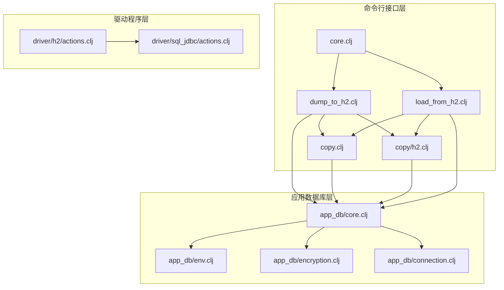
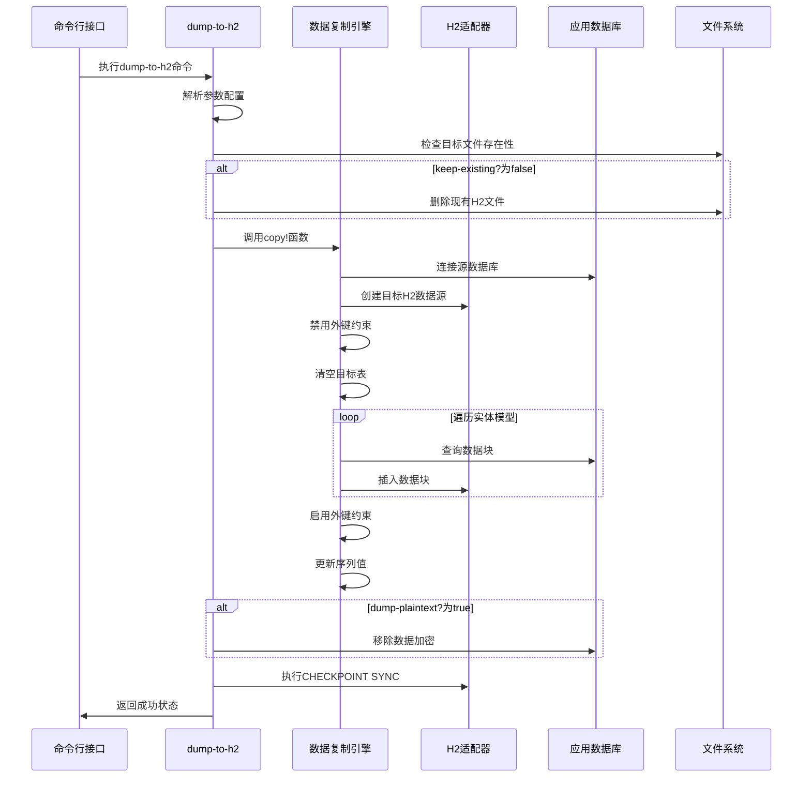
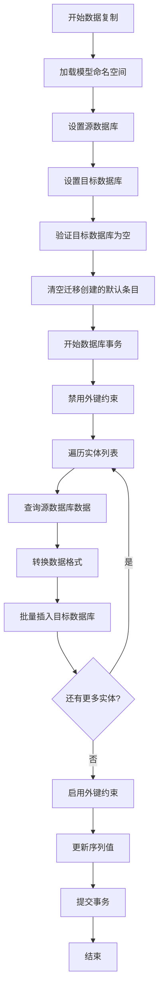
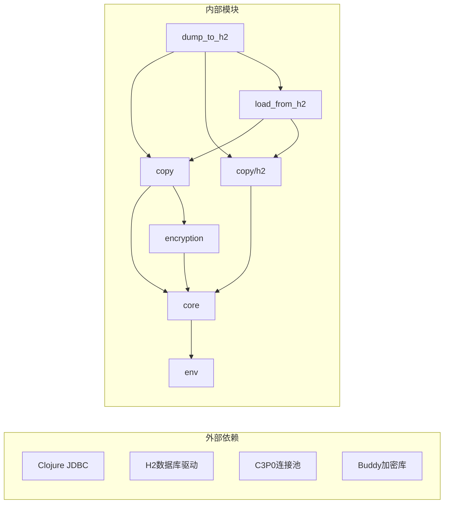

# H2备份机制

<cite>
**本文档中引用的文件**
- [dump_to_h2.clj](file://src/metabase/cmd/dump_to_h2.clj)
- [copy.clj](file://src/metabase/cmd/copy.clj)
- [copy/h2.clj](file://src/metabase/cmd/copy/h2.clj)
- [load_from_h2.clj](file://src/metabase/cmd/load_from_h2.clj)
- [core.clj](file://src/metabase/cmd/core.clj)
- [actions.clj](file://src/metabase/driver/h2/actions.clj)
- [encryption.clj](file://src/metabase/app_db/encryption.clj)
- [rotate_encryption_key.clj](file://src/metabase/cmd/rotate-encryption-key.clj)
- [core.clj](file://src/metabase/app_db/core.clj)
- [env.clj](file://src/metabase/app-db/env.clj)
</cite>

## 目录
1. [简介](#简介)
2. [项目结构概述](#项目结构概述)
3. [核心组件分析](#核心组件分析)
4. [架构概览](#架构概览)
5. [详细组件分析](#详细组件分析)
6. [依赖关系分析](#依赖关系分析)
7. [性能考虑](#性能考虑)
8. [故障排除指南](#故障排除指南)
9. [结论](#结论)

## 简介

Metabase的H2备份机制是一个强大的数据迁移工具，专门设计用于将现有的Metabase应用程序数据库（支持H2、MySQL和PostgreSQL）导出到H2文件格式，或者从H2文件导入到其他数据库类型。该机制的核心是`dump-to-h2`命令，它提供了完整的数据序列化功能，包括加密处理、数据完整性保证和批量操作优化。

该备份系统采用分层架构设计，通过JDBC连接管理、数据复制引擎和H2数据库适配器实现了跨数据库类型的无缝数据迁移。系统支持多种配置选项，包括保留现有文件、明文导出和加密处理等高级功能。

## 项目结构概述

Metabase的H2备份机制主要分布在以下关键目录中：

**图表来源**
- [dump_to_h2.clj](file://src/metabase/cmd/dump_to_h2.clj#L1-L48)
- [copy.clj](file://src/metabase/cmd/copy.clj#L1-L50)
- [core.clj](file://src/metabase/app_db/core.clj#L1-L36)

**章节来源**
- [dump_to_h2.clj](file://src/metabase/cmd/dump_to_h2.clj#L1-L48)
- [copy.clj](file://src/metabase/cmd/copy.clj#L1-L450)
- [core.clj](file://src/metabase/cmd/core.clj#L1-L200)

## 核心组件分析

### dump-to-h2命令实现

`dump-to-h2`命令是整个备份机制的核心入口点，负责协调数据导出过程的各个阶段。该命令接受可选的H2文件名作为参数，并支持两个关键配置参数：

- **keep-existing?**: 控制是否删除已存在的H2文件
- **dump-plaintext?**: 控制是否以明文形式导出数据

该命令的工作流程包含以下关键步骤：

1. **环境验证**: 检查数据库连接状态和配置
2. **文件清理**: 根据keep-existing?参数决定是否删除现有文件
3. **数据复制**: 调用copy!函数执行实际的数据迁移
4. **加密处理**: 如果启用dump-plaintext?，则移除数据加密
5. **持久化同步**: 执行CHECKPOINT SYNC确保数据写入磁盘

### copy!函数核心逻辑

copy!函数是数据迁移的核心引擎，实现了跨数据库类型的通用数据复制功能。该函数支持四种数据库组合模式：

- H2 → H2
- PostgreSQL → H2  
- MySQL → H2
- H2 → 其他数据库类型

数据复制过程采用批量处理策略，通过分区和事务管理确保数据完整性和性能优化。

### H2数据库适配器

H2适配器提供了专门针对H2数据库特性的支持，包括文件路径处理、连接管理和约束控制等功能。

**章节来源**
- [dump_to_h2.clj](file://src/metabase/cmd/dump_to_h2.clj#L20-L48)
- [copy.clj](file://src/metabase/cmd/copy.clj#L400-L450)
- [copy/h2.clj](file://src/metabase/cmd/copy/h2.clj#L1-L38)

## 架构概览

Metabase的H2备份机制采用多层架构设计，确保了系统的可扩展性、可维护性和跨平台兼容性：

**图表来源**
- [dump_to_h2.clj](file://src/metabase/cmd/dump_to_h2.clj#L30-L46)
- [copy.clj](file://src/metabase/cmd/copy.clj#L350-L450)

## 详细组件分析

### dump-to-h2命令实现原理

#### 参数处理与验证

`dump-to-h2!`函数采用灵活的参数处理机制，支持两种调用方式：

1. **简单调用**: 只指定H2文件名
2. **完整调用**: 指定H2文件名和配置选项

函数内部通过解构获取配置参数，提供默认值确保系统正常运行。

#### 文件管理机制

H2文件管理包含以下关键功能：

- **路径规范化**: 自动添加file:前缀和移除.mv.db扩展名
- **文件删除**: 安全删除现有H2数据库文件及其相关文件
- **冲突检测**: 在删除前检查文件是否存在并记录警告

#### 数据复制流程

数据复制过程遵循严格的顺序和约束管理：

1. **连接建立**: 建立源数据库和目标H2数据库的JDBC连接
2. **约束禁用**: 临时禁用外键约束以避免插入顺序问题
3. **数据清理**: 清空目标数据库中的现有数据
4. **批量插入**: 分批处理大量数据以优化内存使用
5. **约束恢复**: 恢复外键约束并更新序列值

#### 加密处理机制

当启用`dump-plaintext?`参数时，系统会执行以下操作：

1. **连接切换**: 使用H2数据源重新连接应用数据库
2. **密钥轮换**: 调用`rotate-encryption-key!`函数移除数据加密
3. **数据解密**: 将所有加密字段转换为明文格式

#### 数据持久化保证

通过执行`CHECKPOINT SYNC`命令确保：
- 内存中的数据立即写入磁盘
- 防止系统崩溃导致的数据丢失
- 提供数据一致性保证

### copy!函数实现详解

#### 实体模型排序

copy!函数按照预定义的实体依赖顺序处理数据，确保引用完整性：

**图表来源**
- [copy.clj](file://src/metabase/cmd/copy.clj#L350-L450)

#### 数据转换与映射

copy!函数实现了复杂的数据转换逻辑：

- **列名映射**: 处理不同数据库间的标识符大小写差异
- **类型转换**: 确保数据类型在目标数据库中的兼容性
- **特殊处理**: 对特定模型进行定制化的数据处理

#### 错误处理与恢复

系统实现了完善的错误处理机制：

- **事务回滚**: 发生错误时自动回滚所有更改
- **详细日志**: 记录每个操作的详细信息和错误详情
- **资源清理**: 确保数据库连接和文件句柄得到正确释放

### H2数据库适配器

#### 数据源创建

H2数据源创建过程包含以下步骤：

1. **路径标准化**: 处理相对路径和绝对路径
2. **协议添加**: 自动添加file:前缀
3. **扩展名处理**: 移除.mv.db扩展名
4. **数据源构建**: 使用标准化路径创建JDBC数据源

#### 文件清理机制

delete-existing-h2-database-files!函数安全地删除H2数据库文件：

- **双重检查**: 验证文件存在性
- **批量删除**: 同时删除主文件和.mv.db文件
- **日志记录**: 记录删除操作和潜在的安全警告

**章节来源**
- [dump_to_h2.clj](file://src/metabase/cmd/dump_to_h2.clj#L30-L46)
- [copy.clj](file://src/metabase/cmd/copy.clj#L350-L450)
- [copy/h2.clj](file://src/metabase/cmd/copy/h2.clj#L15-L38)

## 依赖关系分析

### 核心依赖图

**图表来源**
- [dump_to_h2.clj](file://src/metabase/cmd/dump_to_h2.clj#L10-L18)
- [copy.clj](file://src/metabase/cmd/copy.clj#L10-L25)

### 模块间交互

各模块之间的交互遵循清晰的职责分离原则：

- **命令层**: 处理用户输入和输出格式化
- **业务逻辑层**: 实现核心的数据迁移算法
- **数据访问层**: 管理数据库连接和事务
- **工具层**: 提供通用的辅助功能

### 数据流分析

数据在系统中的流动遵循单向原则：

1. **读取阶段**: 从源数据库读取原始数据
2. **转换阶段**: 应用数据格式转换和清理规则
3. **写入阶段**: 将处理后的数据写入目标数据库
4. **验证阶段**: 确保数据完整性和一致性

**章节来源**
- [dump_to_h2.clj](file://src/metabase/cmd/dump_to_h2.clj#L1-L48)
- [copy.clj](file://src/metabase/cmd/copy.clj#L1-L450)
- [core.clj](file://src/metabase/app_db/core.clj#L1-L36)

## 性能考虑

### 批量处理优化

系统采用多种策略优化大规模数据迁移的性能：

- **分块处理**: 默认100行/块的批量插入策略
- **连接池管理**: 使用C3P0连接池提高并发性能
- **内存控制**: 通过合理设置批次大小平衡内存使用和I/O效率

### 并发控制

系统实现了细粒度的并发控制机制：

- **读写锁**: 使用ReentrantReadWriteLock保护数据库连接
- **事务隔离**: 通过事务边界确保数据一致性
- **死锁预防**: 通过固定的实体处理顺序避免循环依赖

### 存储优化

H2数据库的存储优化包括：

- **压缩策略**: 利用H2内置的压缩功能减少磁盘占用
- **索引管理**: 在数据迁移完成后重建必要的索引
- **垃圾回收**: 定期执行CHECKPOINT操作清理未使用的空间

## 故障排除指南

### 常见问题及解决方案

#### 数据库连接失败

**症状**: 无法建立源数据库或目标H2数据库的连接
**原因**: 
- 环境变量配置错误
- 数据库服务不可用
- 权限不足

**解决方案**:
1. 验证环境变量设置
2. 检查数据库服务状态
3. 确认用户权限配置

#### 数据迁移中断

**症状**: 迁移过程中断，部分数据丢失
**原因**:
- 内存不足
- 磁盘空间不足
- 网络连接不稳定

**解决方案**:
1. 增加JVM堆内存设置
2. 清理磁盘空间
3. 检查网络连接稳定性

#### 加密数据处理异常

**症状**: 启用dump-plaintext?后数据损坏
**原因**:
- 加密密钥缺失
- 数据格式不兼容
- 版本不匹配

**解决方案**:
1. 确保正确的加密密钥设置
2. 验证数据格式兼容性
3. 检查版本兼容性要求

### 调试技巧

#### 日志分析

系统提供了详细的日志记录功能：

- **操作跟踪**: 记录每个数据处理步骤
- **错误详情**: 包含完整的错误堆栈信息
- **性能指标**: 记录处理时间和资源使用情况

#### 数据验证

建议在迁移完成后执行以下验证步骤：

1. **完整性检查**: 验证数据行数和关键字段
2. **关联性验证**: 检查外键引用的完整性
3. **功能测试**: 验证迁移后的数据库功能正常

**章节来源**
- [dump_to_h2.clj](file://src/metabase/cmd/dump_to_h2.clj#L30-L46)
- [copy.clj](file://src/metabase/cmd/copy.clj#L350-L450)

## 结论

Metabase的H2备份机制是一个设计精良、功能完备的数据迁移解决方案。它通过模块化架构、完善的错误处理和性能优化策略，为用户提供了可靠的数据备份和迁移能力。

### 主要优势

1. **跨平台兼容**: 支持多种数据库类型和操作系统
2. **数据完整性**: 通过事务管理和约束控制确保数据一致性
3. **性能优化**: 采用批量处理和连接池技术提高处理效率
4. **安全性**: 提供加密处理和明文导出的灵活选择
5. **易用性**: 简洁的命令行接口和详细的错误提示

### 最佳实践建议

1. **定期备份**: 建立定期的H2备份策略
2. **测试验证**: 在生产环境使用前充分测试
3. **监控告警**: 设置备份完成和失败的监控告警
4. **版本管理**: 维护不同版本的备份文件
5. **文档记录**: 保持备份操作的详细文档

该备份机制为Metabase用户提供了强大的数据保护和迁移能力，是确保数据安全和系统可用性的重要工具。