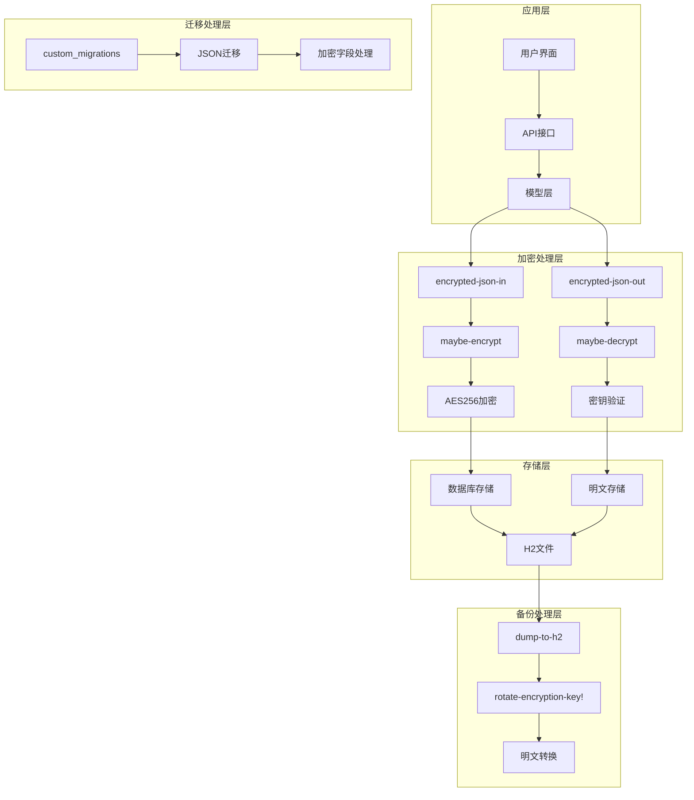
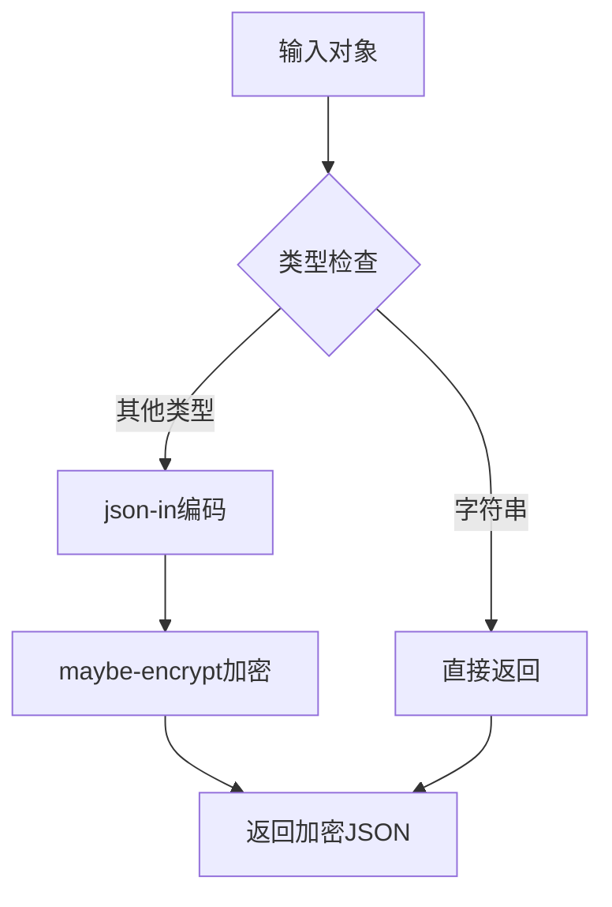
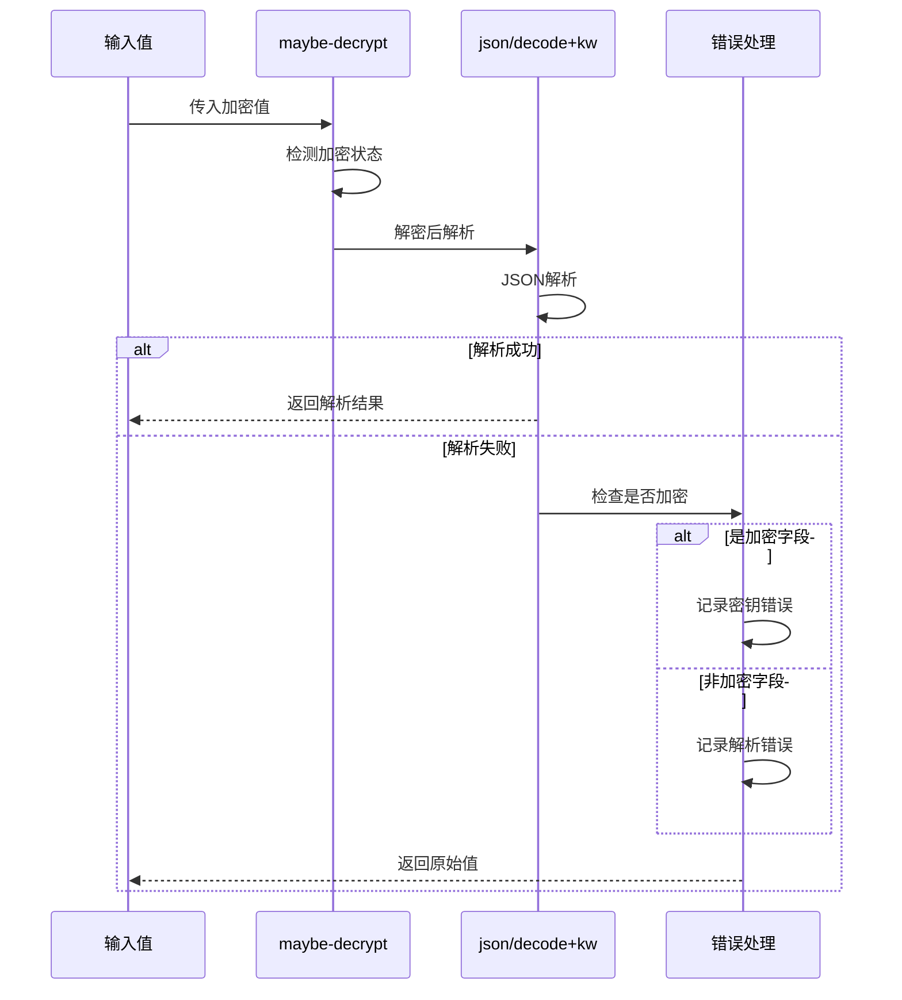
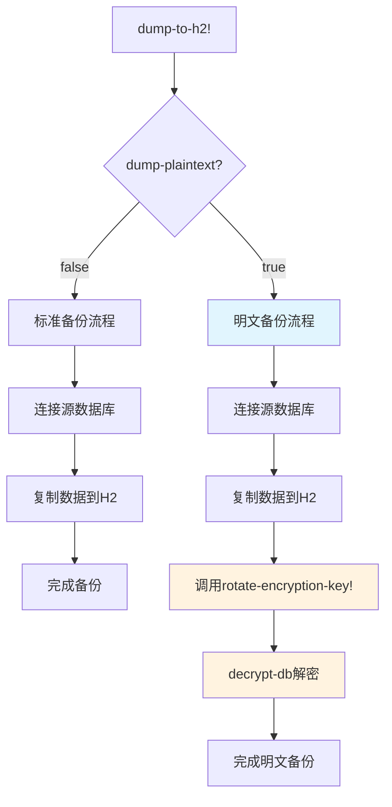
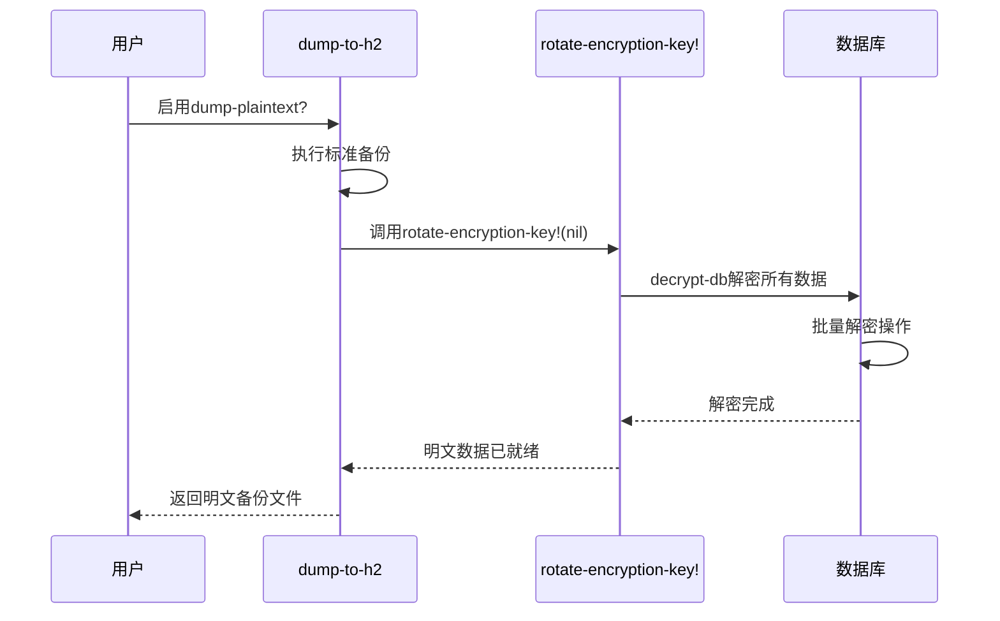
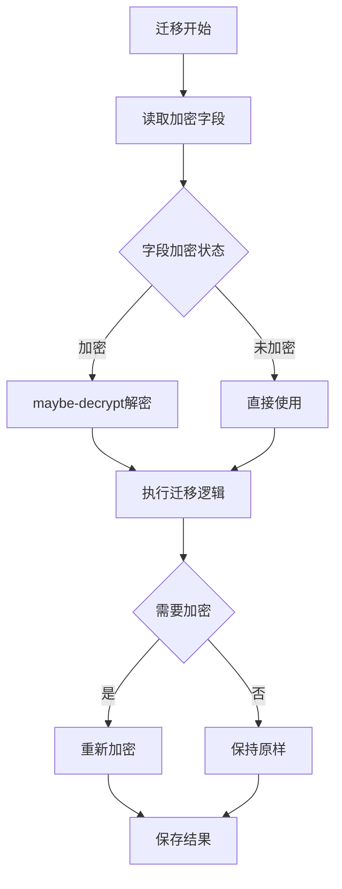
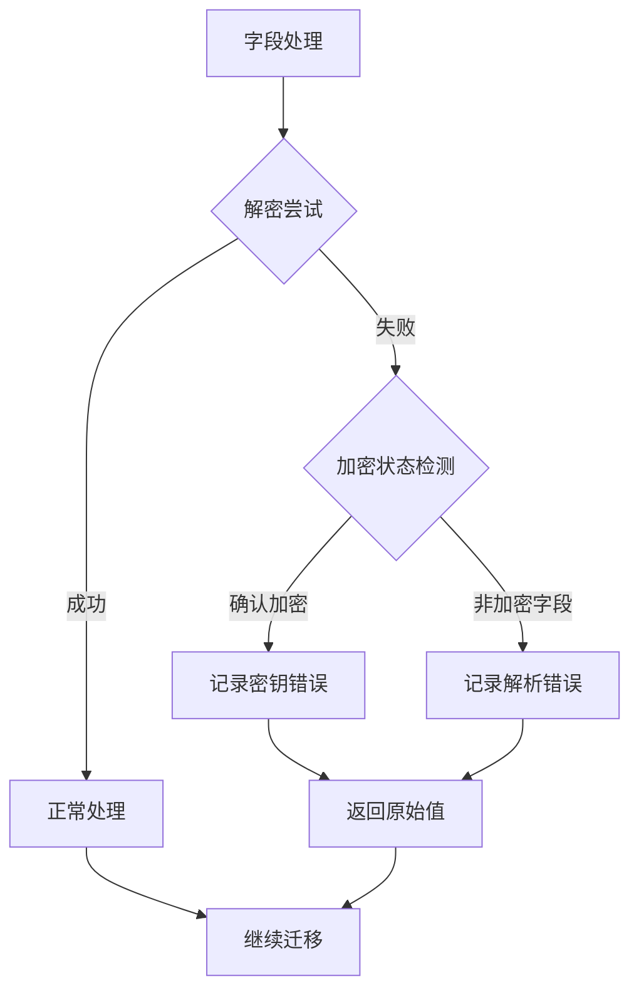
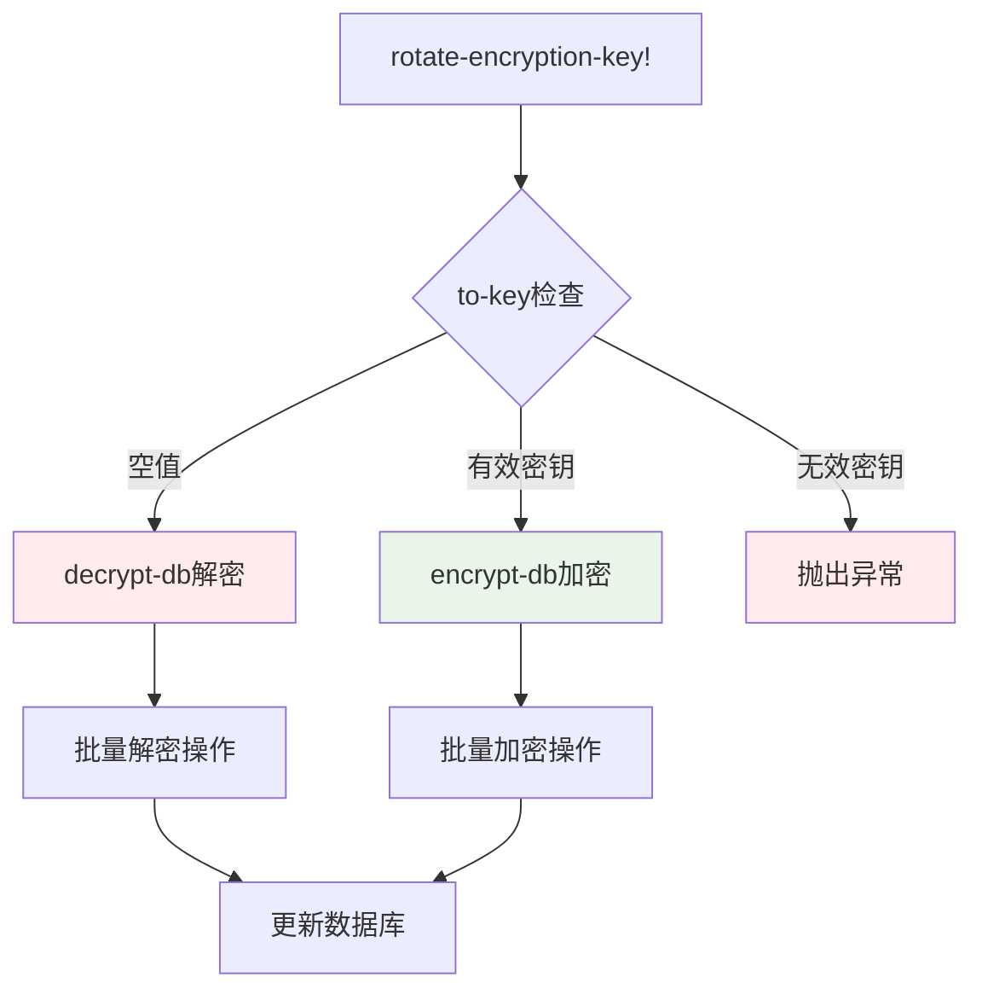
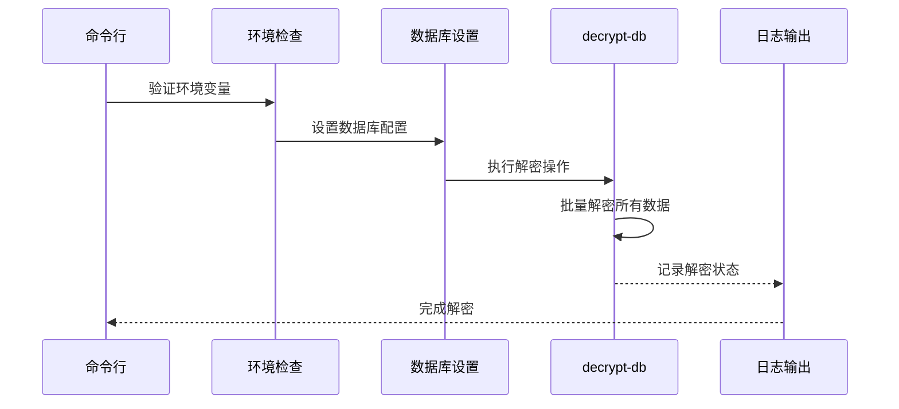
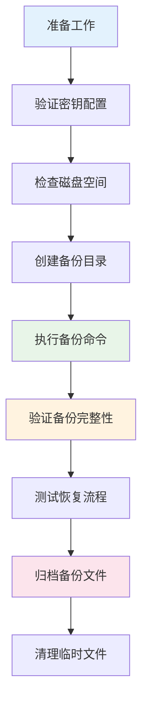

# 加密数据处理

<cite>
**本文档中引用的文件**
- [dump_to_h2.clj](file://src/metabase/cmd/dump_to_h2.clj)
- [custom_migrations.clj](file://src/metabase/app_db/custom_migrations.clj)
- [encryption.clj](file://src/metabase/util/encryption.clj)
- [app_db_encryption.clj](file://src/metabase/app_db/encryption.clj)
- [rotate_encryption_key.clj](file://src/metabase/cmd/rotate_encryption_key.clj)
- [remove_encryption.clj](file://src/metabase/cmd/remove_encryption.clj)
- [copy.clj](file://src/metabase/cmd/copy.clj)
- [load_from_h2.clj](file://src/metabase/cmd/load_from_h2.clj)
- [json_migration.clj](file://src/metabase/models/json_migration.clj)
- [interface.clj](file://src/metabase/models/interface.clj)
</cite>

## 目录
1. [概述](#概述)
2. [加密字段处理架构](#加密字段处理架构)
3. [核心加密函数分析](#核心加密函数分析)
4. [备份过程中的加密处理](#备份过程中的加密处理)
5. [自定义迁移中的加密处理](#自定义迁移中的加密处理)
6. [密钥轮换和解密机制](#密钥轮换和解密机制)
7. [安全最佳实践](#安全最佳实践)
8. [故障排除指南](#故障排除指南)
9. [总结](#总结)

## 概述

Metabase采用了一套完整的加密数据处理机制，确保敏感数据在备份、迁移和存储过程中的安全性。该系统通过多层次的加密策略，结合环境变量管理和运行时验证，提供了强大的数据保护能力。

核心组件包括：
- **encrypted-json-in/encrypted-json-out函数**：专门处理JSON字段的加密和解密
- **dump-plaintext?参数**：控制备份过程中是否将加密数据转换为明文
- **rotate-encryption/rotate-encryption-key!函数**：支持密钥轮换和解密操作
- **maybe-decrypt函数**：智能检测和解密加密字段
- **MB_ENCRYPTION_SECRET_KEY环境变量**：密钥管理的核心机制

## 加密字段处理架构

Metabase的加密数据处理采用分层架构设计，确保不同场景下的数据安全需求得到满足。



**图表来源**
- [dump_to_h2.clj](file://src/metabase/cmd/dump_to_h2.clj#L36-L46)
- [custom_migrations.clj](file://src/metabase/app_db/custom_migrations.clj#L100-L140)
- [encryption.clj](file://src/metabase/util/encryption.clj#L152-L191)

## 核心加密函数分析

### encrypted-json-in函数

`encrypted-json-in`函数是JSON字段加密处理的核心入口点，它与`json-in`函数协同工作，实现智能加密策略。



**图表来源**
- [custom_migrations.clj](file://src/metabase/app_db/custom_migrations.clj#L100-L105)

该函数的设计特点：
- **类型感知**：对字符串输入直接返回，避免重复加密
- **链式处理**：与`json-in`函数配合，先序列化后加密
- **智能加密**：仅在密钥可用时执行加密操作

**节来源**
- [custom_migrations.clj](file://src/metabase/app_db/custom_migrations.clj#L100-L105)

### encrypted-json-out函数

`encrypted-json-out`函数负责解密和解析加密的JSON字段，提供完整的逆向处理能力。



**图表来源**
- [custom_migrations.clj](file://src/metabase/app_db/custom_migrations.clj#L107-L130)

该函数的关键特性：
- **双重检测**：同时检查字符串和字节数组的加密状态
- **智能错误处理**：根据加密状态提供不同的错误信息
- **回退机制**：解析失败时返回原始值而非抛出异常

**节来源**
- [custom_migrations.clj](file://src/metabase/app_db/custom_migrations.clj#L107-L130)

### 加密工具函数

Metabase提供了完整的加密工具函数集，支持多种加密场景：

| 函数名 | 功能描述 | 使用场景 |
|--------|----------|----------|
| `encrypt-bytes` | 字节数组加密 | 大数据量加密 |
| `encrypt` | 字符串加密 | 标准文本加密 |
| `decrypt-bytes` | 字节数组解密 | 大数据量解密 |
| `decrypt` | 字符串解密 | 标准文本解密 |
| `maybe-encrypt` | 条件加密 | 可选加密场景 |
| `maybe-decrypt` | 条件解密 | 智能解密检测 |

**节来源**
- [encryption.clj](file://src/metabase/util/encryption.clj#L64-L124)

## 备份过程中的加密处理

### dump-to-h2命令的工作流程

Metabase的备份机制通过`dump-to-h2`命令实现，该命令支持两种模式：加密备份和明文备份。



**图表来源**
- [dump_to_h2.clj](file://src/metabase/cmd/dump_to_h2.clj#L36-L46)

**节来源**
- [dump_to_h2.clj](file://src/metabase/cmd/dump_to_h2.clj#L36-L46)

### dump-plaintext?参数的作用机制

当启用`dump-plaintext?`参数时，系统会自动将加密数据转换为明文存储：



**图表来源**
- [dump_to_h2.clj](file://src/metabase/cmd/dump_to_h2.clj#L40-L42)
- [rotate_encryption_key.clj](file://src/metabase/cmd/rotate_encryption_key.clj#L8-L15)

这种机制的优势：
- **兼容性**：明文备份便于跨平台迁移
- **可读性**：备份内容可以直接查看
- **调试便利**：问题排查更加直观

**节来源**
- [dump_to_h2.clj](file://src/metabase/cmd/dump_to_h2.clj#L40-L42)

### 备份过程中的数据完整性保障

备份系统实现了多层数据完整性保障机制：

1. **约束禁用**：临时禁用外键约束以支持无序插入
2. **事务管理**：使用回滚只读事务确保原子性
3. **批量处理**：分块处理大量数据避免内存溢出
4. **错误恢复**：完善的错误处理和回滚机制

**节来源**
- [copy.clj](file://src/metabase/cmd/copy.clj#L300-L449)

## 自定义迁移中的加密处理

### maybe-decrypt函数在迁移中的应用

在自定义迁移过程中，`maybe-decrypt`函数发挥关键作用，确保加密字段的正确处理。



**图表来源**
- [custom_migrations.clj](file://src/metabase/app_db/custom_migrations.clj#L141-L162)

**节来源**
- [custom_migrations.clj](file://src/metabase/app_db/custom_migrations.clj#L141-L162)

### 加密字段的智能检测机制

系统通过多个维度检测字段是否加密：

| 检测方法 | 描述 | 应用场景 |
|----------|------|----------|
| `possibly-encrypted-string?` | 检查Base64字符串格式 | 字符串字段检测 |
| `possibly-encrypted-bytes?` | 检查字节数组结构 | 字节数组字段检测 |
| 密钥验证 | 尝试解密验证 | 确认加密状态 |
| 格式验证 | 检查AES格式特征 | 精确识别加密数据 |

**节来源**
- [encryption.clj](file://src/metabase/util/encryption.clj#L191-L222)

### 迁移过程中的错误处理策略

迁移系统实现了智能的错误处理策略：



**图表来源**
- [custom_migrations.clj](file://src/metabase/app_db/custom_migrations.clj#L141-L162)

**节来源**
- [custom_migrations.clj](file://src/metabase/app_db/custom_migrations.clj#L141-L162)

## 密钥轮换和解密机制

### rotate-encryption-key!函数详解

密钥轮换功能通过`rotate-encryption-key!`函数实现，支持加密、解密和密钥更新操作。



**图表来源**
- [rotate_encryption_key.clj](file://src/metabase/cmd/rotate_encryption_key.clj#L8-L15)

**节来源**
- [rotate_encryption_key.clj](file://src/metabase/cmd/rotate_encryption_key.clj#L8-L15)

### 密钥验证和安全检查

系统在密钥处理过程中实施严格的安全检查：

1. **长度验证**：确保密钥至少16字符
2. **格式验证**：PBKDF2+SHA512算法处理
3. **迭代强度**：100,000次迭代保证安全性
4. **环境检查**：验证`MB_ENCRYPTION_SECRET_KEY`环境变量

**节来源**
- [encryption.clj](file://src/metabase/util/encryption.clj#L35-L66)

### remove-encryption功能

`remove-encryption`命令提供一键解密功能，用于完全移除数据库加密：



**图表来源**
- [remove_encryption.clj](file://src/metabase/cmd/remove_encryption.clj#L8-L13)

**节来源**
- [remove_encryption.clj](file://src/metabase/cmd/remove_encryption.clj#L8-L13)

## 安全最佳实践

### 密钥管理策略

为了确保加密数据的安全性，建议遵循以下密钥管理最佳实践：

| 实践领域 | 具体措施 | 安全级别 |
|----------|----------|----------|
| 密钥生成 | 使用强随机数生成器 | 高 |
| 密钥存储 | 环境变量或专用密钥管理器 | 高 |
| 密钥轮换 | 定期（如每90天）轮换密钥 | 中 |
| 访问控制 | 最小权限原则 | 高 |
| 备份保护 | 加密备份文件 | 高 |

### 文件权限设置

备份文件的文件系统权限应严格控制：

```bash
# 创建备份目录
mkdir -p /secure/backups/metabase
chmod 700 /secure/backups/metabase

# 创建备份文件
touch /secure/backups/metabase/metabase_backup.h2
chmod 600 /secure/backups/metabase/metabase_backup.h2
```

### 传输加密

在传输备份文件时，必须使用加密协议：

```bash
# 使用SCP进行安全传输
scp -C -i ~/.ssh/private_key \
    /secure/backups/metabase/metabase_backup.h2 \
    user@remote-server:/secure/backups/metabase/

# 或使用rsync over SSH
rsync -avz -e "ssh -i ~/.ssh/private_key" \
    /secure/backups/metabase/metabase_backup.h2 \
    user@remote-server:/secure/backups/metabase/
```

### 生产环境操作指南

在生产环境中执行加密数据备份时，应遵循以下操作流程：



**节来源**
- [dump_to_h2.clj](file://src/metabase/cmd/dump_to_h2.clj#L10-L25)

### 监控和审计

建立完善的监控和审计机制：

1. **日志记录**：详细记录所有加密操作
2. **访问审计**：跟踪密钥访问和使用
3. **完整性检查**：定期验证备份文件完整性
4. **告警机制**：异常操作及时告警

## 故障排除指南

### 常见问题及解决方案

#### MB_ENCRYPTION_SECRET_KEY缺失错误

**问题症状**：
```
Error: Database is encrypted but the MB_ENCRYPTION_SECRET_KEY environment variable was NOT set
```

**解决方案**：
1. 检查环境变量设置
2. 验证密钥格式和长度
3. 确保密钥正确传递给进程

#### 密钥不匹配错误

**问题症状**：
```
Error: Database was encrypted with a different key than the MB_ENCRYPTION_SECRET_KEY environment contains
```

**解决方案**：
1. 使用正确的密钥
2. 执行密钥轮换
3. 检查密钥版本一致性

#### 备份文件损坏

**问题症状**：
```
Error parsing JSON: Backup file corrupted
```

**解决方案**：
1. 验证文件完整性
2. 重新生成备份
3. 检查存储介质健康状况

### 调试技巧

1. **启用详细日志**：设置适当的日志级别
2. **分步验证**：逐步验证每个组件
3. **环境隔离**：在测试环境中验证
4. **版本兼容性**：确保软件版本兼容

**节来源**
- [setup.clj](file://src/metabase/app_db/setup.clj#L145-L165)

## 总结

Metabase的加密数据处理机制提供了一个完整、安全且灵活的解决方案。通过多层次的加密策略、智能的密钥管理和完善的错误处理机制，系统能够在各种场景下安全地处理敏感数据。

关键优势包括：
- **透明性**：加密操作对应用程序透明
- **灵活性**：支持多种加密场景和需求
- **安全性**：采用业界标准的加密算法
- **可靠性**：完善的错误处理和恢复机制

在实际部署中，建议结合具体的业务需求和安全要求，制定相应的加密策略和备份计划，确保数据的安全性和系统的稳定性。