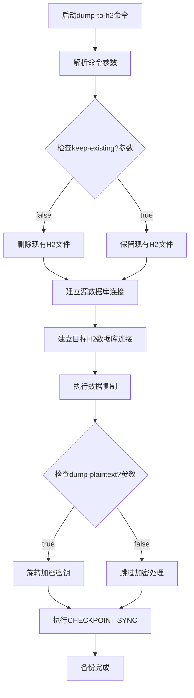
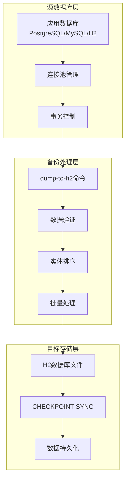
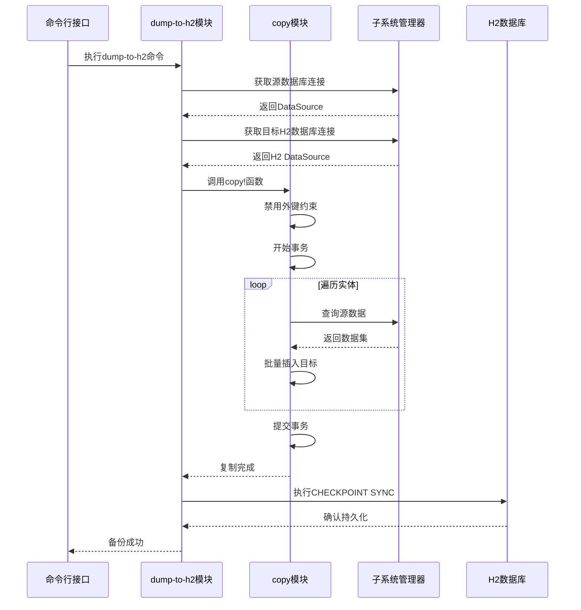
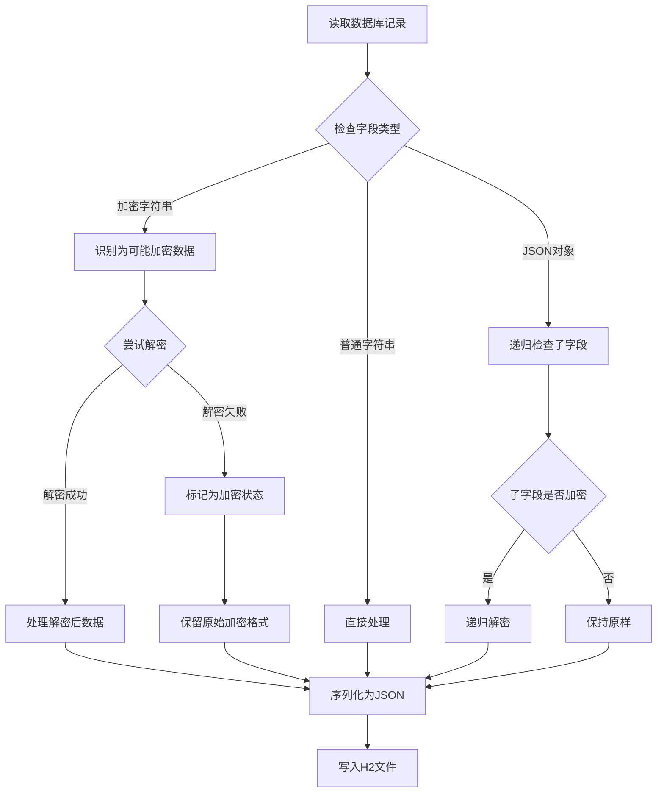
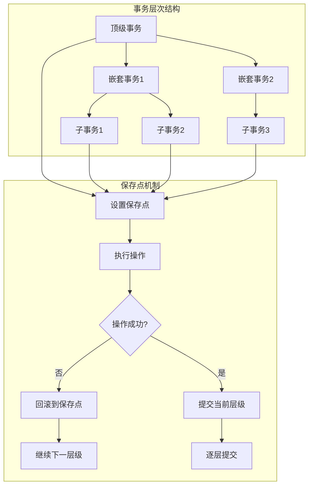
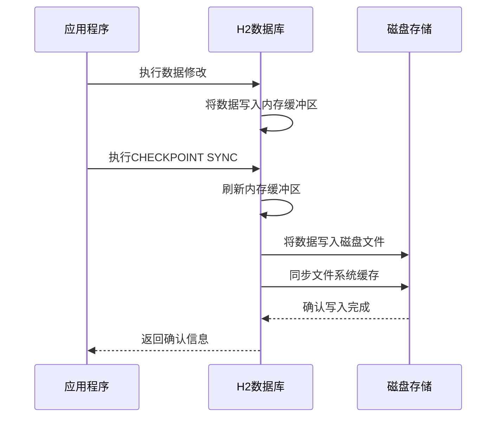
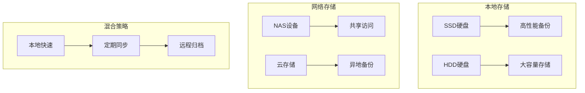
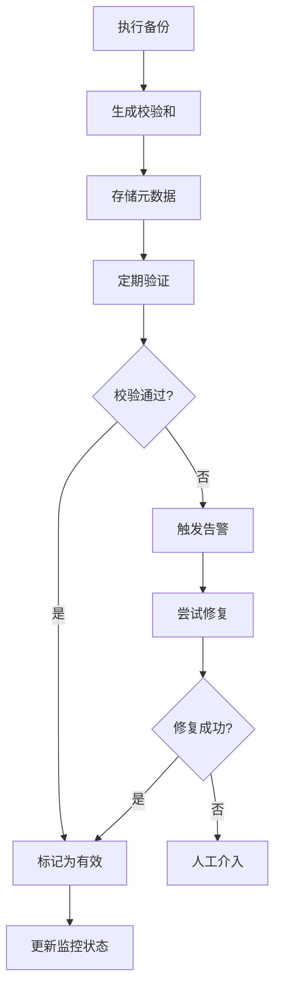
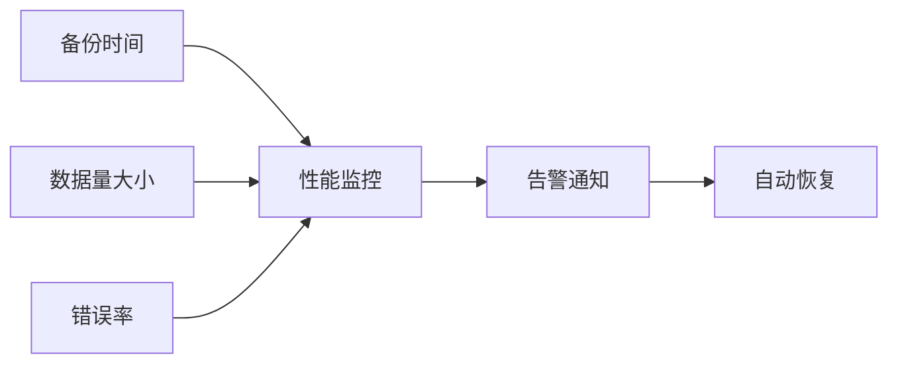

# Metabase备份策略文档

<cite>
**本文档中引用的文件**
- [dump_to_h2.clj](file://src/metabase/cmd/dump_to_h2.clj)
- [copy.clj](file://src/metabase/cmd/copy.clj)
- [copy/h2.clj](file://src/metabase/cmd/copy/h2.clj)
- [load_from_h2.clj](file://src/metabase/cmd/load_from_h2.clj)
- [custom_migrations.clj](file://src/metabase/app_db/custom_migrations.clj)
- [encryption.clj](file://src/metabase/app_db/encryption.clj)
- [connection.clj](file://src/metabase/app_db/connection.clj)
- [json_migration.clj](file://src/metabase/models/json_migration.clj)
- [update_h2.clj](file://src/metabase/app_db/update_h2.clj)
- [h2.clj](file://src/metabase/driver/h2.clj)
</cite>

## 目录
1. [概述](#概述)
2. [dump-to-h2命令详解](#dump-to-h2命令详解)
3. [备份过程架构](#备份过程架构)
4. [数据复制机制](#数据复制机制)
5. [加密数据处理](#加密数据处理)
6. [数据一致性保障](#数据一致性保障)
7. [CHECKPOINT SYNC机制](#checkpoint-sync机制)
8. [生产环境最佳实践](#生产环境最佳实践)
9. [故障排除指南](#故障排除指南)
10. [总结](#总结)

## 概述

Metabase提供了基于H2数据库的备份策略，主要通过`dump-to-h2`命令实现从现有应用数据库到H2文件的完整数据导出。该备份机制采用事务性数据复制、加密字段特殊处理和数据一致性保障等关键技术，确保备份过程的安全性和可靠性。

## dump-to-h2命令详解

### 命令结构与参数

`dump-to-h2`命令是Metabase备份系统的核心组件，负责将应用数据库中的所有数据导出到H2文件格式。

**图表来源**
- [dump_to_h2.clj](file://src/metabase/cmd/dump_to_h2.clj#L25-L46)

### 关键参数说明

| 参数 | 类型 | 默认值 | 描述 |
|------|------|--------|------|
| `h2-filename` | 字符串 | "metabase_dump.h2" | 目标H2数据库文件路径 |
| `keep-existing?` | 布尔值 | false | 是否保留已存在的H2文件 |
| `dump-plaintext?` | 布尔值 | false | 是否以明文形式导出数据 |

**节来源**
- [dump_to_h2.clj](file://src/metabase/cmd/dump_to_h2.clj#L25-L46)

## 备份过程架构

### 整体架构设计

**图表来源**
- [copy.clj](file://src/metabase/cmd/copy.clj#L45-L85)
- [connection.clj](file://src/metabase/app_db/connection.clj#L40-L80)

### 实体依赖关系

备份过程按照严格的实体依赖顺序进行数据复制，确保外键约束的一致性：

**图表来源**
- [copy.clj](file://src/metabase/cmd/copy.clj#L50-L85)

**节来源**
- [copy.clj](file://src/metabase/cmd/copy.clj#L50-L85)

## 数据复制机制

### 连接管理与事务控制

Metabase采用多层连接管理和事务控制机制确保数据复制的可靠性：

**图表来源**
- [copy.clj](file://src/metabase/cmd/copy.clj#L439-L448)
- [connection.clj](file://src/metabase/app_db/connection.clj#L125-L164)

### 数据复制流程

数据复制过程采用分块处理和批量插入优化：

| 步骤 | 操作 | 性能特点 |
|------|------|----------|
| 1 | 禁用外键约束 | 避免插入顺序限制 |
| 2 | 开启事务模式 | 确保原子性 |
| 3 | 分块读取数据 | 控制内存使用 |
| 4 | 批量插入目标 | 提高写入效率 |
| 5 | 提交事务 | 确保数据完整性 |

**节来源**
- [copy.clj](file://src/metabase/cmd/copy.clj#L242-L272)
- [copy.clj](file://src/metabase/cmd/copy.clj#L299-L333)

## 加密数据处理

### 加密字段识别与处理

Metabase对加密字段采用特殊的处理机制，确保备份数据的安全性：

**图表来源**
- [encryption.clj](file://src/metabase/app_db/encryption.clj#L10-L60)
- [custom_migrations.clj](file://src/metabase/app_db/custom_migrations.clj#L115-L142)

### 加密处理函数

| 函数名 | 功能 | 应用场景 |
|--------|------|----------|
| `encrypted-json-in` | 加密JSON输入 | 写入数据库前的加密 |
| `encrypted-json-out` | 解密JSON输出 | 读取数据库后的解密 |
| `maybe-encrypt` | 条件加密 | 根据配置决定是否加密 |
| `maybe-decrypt` | 条件解密 | 根据配置决定是否解密 |

**节来源**
- [encryption.clj](file://src/metabase/app_db/encryption.clj#L10-L60)
- [custom_migrations.clj](file://src/metabase/app_db/custom_migrations.clj#L115-L142)

## 数据一致性保障

### 事务管理机制

Metabase实现了多层次的事务管理确保数据一致性：

**图表来源**
- [connection.clj](file://src/metabase/app_db/connection.clj#L140-L180)

### 自定义迁移中的数据一致性

自定义迁移通过可逆机制确保数据一致性：

| 特性 | 实现方式 | 优势 |
|------|----------|------|
| 可逆性 | 定义正向和反向迁移 | 支持版本回退 |
| 事务保护 | 包装在数据库事务中 | 确保原子性 |
| 错误处理 | 异常捕获和回滚 | 防止部分更新 |
| 状态跟踪 | 使用`should-execute-change?` | 避免重复执行 |

**节来源**
- [custom_migrations.clj](file://src/metabase/app_db/custom_migrations.clj#L61-L99)

## CHECKPOINT SYNC机制

### 数据持久化保证

`CHECKPOINT SYNC`是H2数据库的关键操作，确保内存中的数据完全持久化到磁盘：

**图表来源**
- [dump_to_h2.clj](file://src/metabase/cmd/dump_to_h2.clj#L46)

### CHECKPOINT SYNC的作用

| 功能 | 描述 | 重要性 |
|------|------|--------|
| 内存同步 | 将内存中的脏页写入磁盘 | 防止数据丢失 |
| 文件完整性 | 确保数据文件的完整性 | 避免损坏 |
| 性能优化 | 减少后续I/O操作 | 提高系统性能 |
| 一致性保证 | 确保数据的一致性状态 | 支持恢复操作 |

**节来源**
- [dump_to_h2.clj](file://src/metabase/cmd/dump_to_h2.clj#L46)

## 生产环境最佳实践

### 备份频率策略

根据数据变化频率制定备份计划：

| 数据类型 | 推荐频率 | 备注 |
|----------|----------|------|
| 用户信息 | 每日备份 | 包含敏感信息 |
| 查询历史 | 每周备份 | 数据量较大 |
| 设置配置 | 实时备份 | 影响系统运行 |
| 数据模型 | 版本变更时 | 结构化数据 |

### 存储位置选择

### 性能优化策略

| 优化项 | 方法 | 预期效果 |
|--------|------|----------|
| 并行处理 | 批量分片处理 | 提高处理速度 |
| 内存管理 | 控制批大小 | 避免内存溢出 |
| 网络优化 | 压缩传输 | 减少带宽占用 |
| 存储优化 | SSD优先 | 提升I/O性能 |

### 备份验证流程

## 故障排除指南

### 常见问题及解决方案

| 问题类型 | 症状 | 解决方案 |
|----------|------|----------|
| 内存不足 | 备份过程中OOM异常 | 减小批处理大小 |
| 权限错误 | 无法访问数据库 | 检查数据库连接权限 |
| 文件锁定 | H2文件被占用 | 确保数据库服务停止 |
| 加密失败 | 解密字段报错 | 检查加密密钥配置 |

### 监控指标

### 恢复流程

当备份出现问题时的标准恢复流程：

1. **问题诊断**：分析错误日志和系统状态
2. **数据验证**：检查现有备份的完整性
3. **清理工作**：移除损坏的备份文件
4. **重新备份**：执行新的备份操作
5. **验证测试**：确保备份可用性

## 总结

Metabase的基于H2数据库的备份策略通过dump-to-h2命令实现了完整的数据导出功能。该策略具有以下核心优势：

1. **安全性**：支持加密数据的特殊处理和密钥轮换
2. **可靠性**：采用事务性操作和CHECKPOINT SYNC确保数据一致性
3. **灵活性**：支持多种参数配置和自定义迁移
4. **性能**：通过批量处理和连接池优化提升备份效率

通过遵循本文档提供的最佳实践和故障排除指南，可以确保Metabase备份系统的稳定运行和数据安全。建议定期评估备份策略的有效性，并根据业务需求调整备份频率和存储策略。