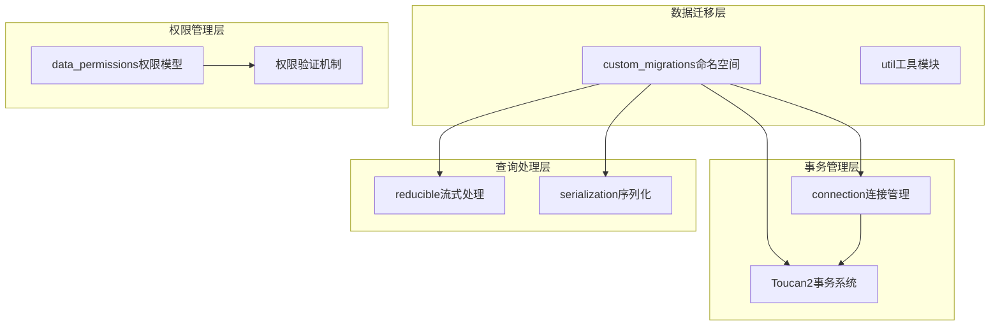
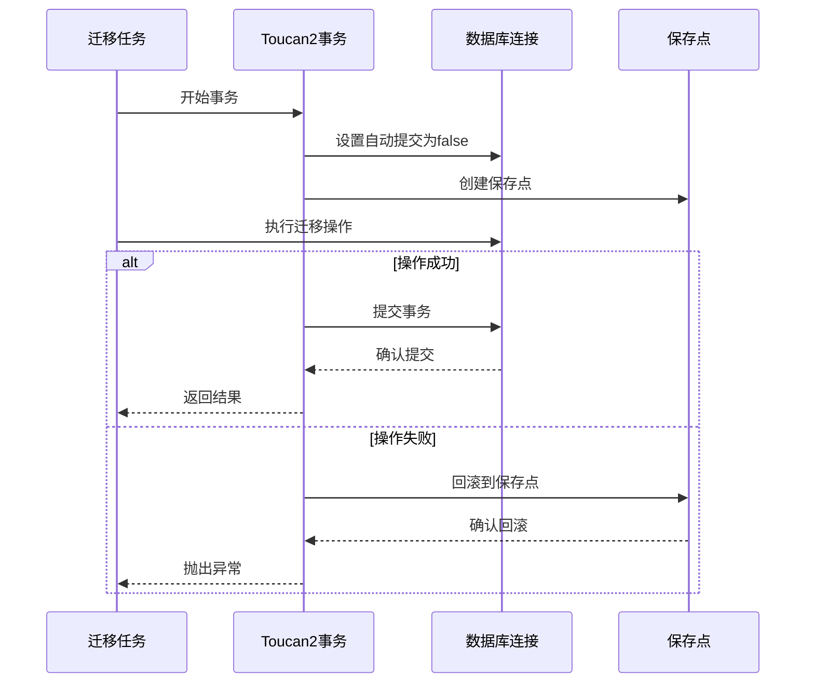
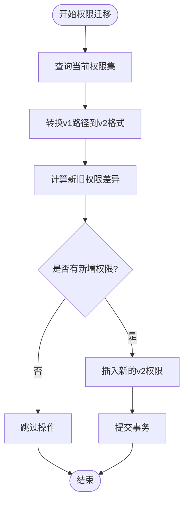
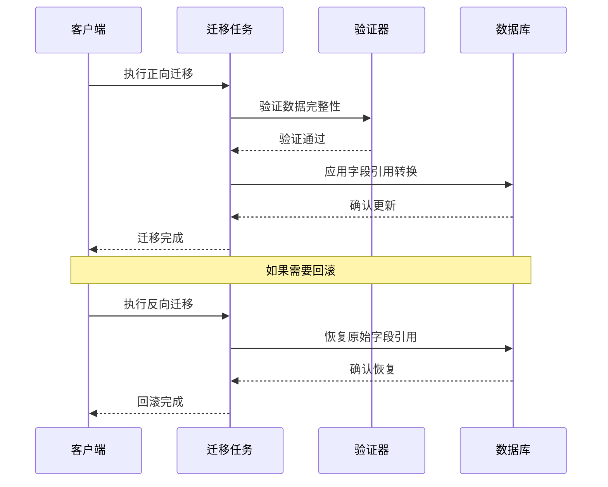
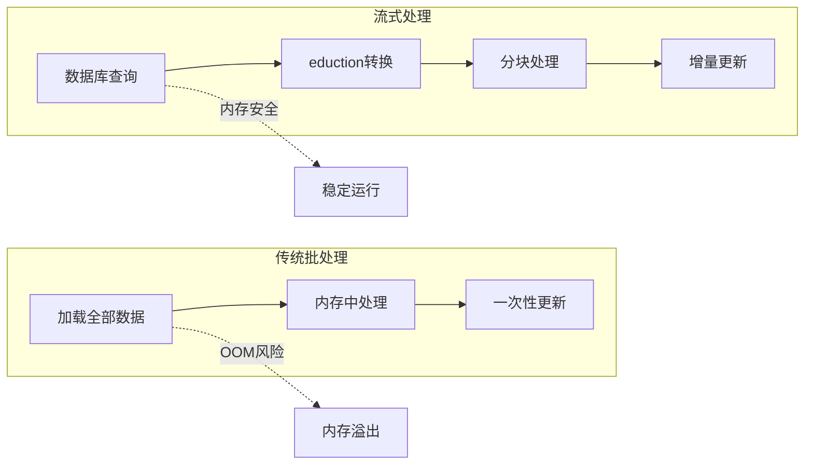
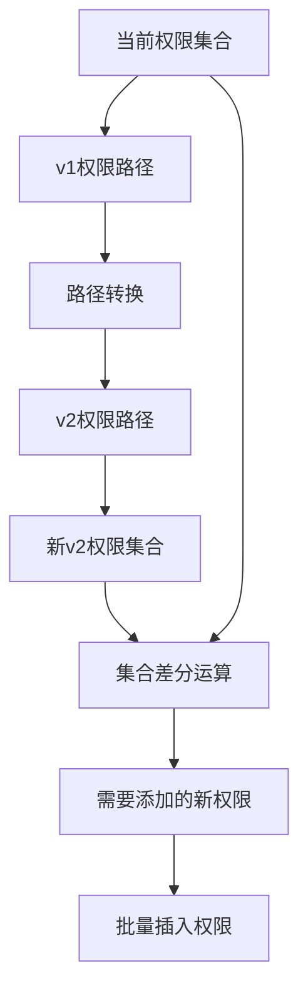
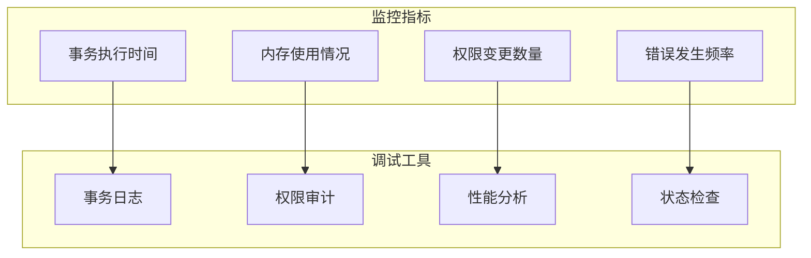

# 数据一致性保障

<cite>
**本文档中引用的文件**
- [custom_migrations.clj](file://src/metabase/app_db/custom_migrations.clj)
- [util.clj](file://src/metabase/app_db/custom_migrations/util.clj)
- [connection.clj](file://src/metabase/app_db/connection.clj)
- [data_permissions.clj](file://src/metabase/permissions/models/data_permissions.clj)
- [reducible.clj](file://src/metabase/query_processor/reducible.clj)
- [serialization.clj](file://src/metabase/models/serialization.clj)
</cite>

## 目录
1. [引言](#引言)
2. [项目结构概览](#项目结构概览)
3. [Toucan2事务机制](#toucan2事务机制)
4. [数据路径转换与权限完整性](#数据路径转换与权限完整性)
5. [JSON数据处理与字段引用转换](#json数据处理与字段引用转换)
6. [内存友好型批量更新机制](#内存友好型批量更新机制)
7. [权限变更范围控制](#权限变更范围控制)
8. [故障排除指南](#故障排除指南)
9. [总结](#总结)

## 引言

Metabase在备份和数据迁移过程中采用了多层次的数据一致性保障机制，确保在复杂的数据转换场景下能够维持系统的完整性和可靠性。本文档深入分析了Metabase如何通过Toucan2事务、集合运算、流式处理等技术手段来保障数据一致性。

## 项目结构概览

Metabase的数据一致性保障主要集中在以下核心模块：



**图表来源**
- [custom_migrations.clj](file://src/metabase/app_db/custom_migrations.clj#L1-L50)
- [connection.clj](file://src/metabase/app_db/connection.clj#L120-L180)

## Toucan2事务机制

### 原子性保障的核心实现

Metabase通过Toucan2事务系统确保迁移操作的原子性。在custom_migrations命名空间中，所有可逆迁移都使用`t2/with-transaction`宏来包装迁移逻辑。



**图表来源**
- [connection.clj](file://src/metabase/app_db/connection.clj#L140-L185)

### 事务深度管理和嵌套规则

系统实现了智能的事务深度管理机制，支持嵌套事务但提供灵活的规则控制：

| 嵌套事务规则 | 行为描述 | 使用场景 |
|------------|----------|----------|
| :allow | 允许嵌套事务，使用保存点隔离 | 复杂迁移场景 |
| :ignore | 忽略内层事务，保持外层事务状态 | 性能优化场景 |
| :prohibit | 禁止嵌套事务，抛出异常 | 高度敏感操作 |

**节来源**
- [connection.clj](file://src/metabase/app_db/connection.clj#L184-L209)

## 数据路径转换与权限完整性

### SplitDataPermissions迁移案例

SplitDataPermissions迁移是权限数据完整性保障的经典案例，展示了如何通过集合运算精确控制权限变更。



**图表来源**
- [custom_migrations.clj](file://src/metabase/app_db/custom_migrations.clj#L160-L183)

### 权限路径转换算法

系统实现了复杂的路径转换算法，确保从v1权限格式到v2格式的正确映射：

| v1路径格式 | 转换后的v2路径 | 说明 |
|-----------|---------------|------|
| `/db/{id}/schema/` | `/data/db/{id}/` 和 `/query/db/{id}/schema/` | 特殊全权限路径处理 |
| `/db/{id}/schema/{schema}/table/{table}/` | `/data/db/{id}/{schema}/table/{table}/` 和 `/query/db/{id}/{schema}/table/{table}/` | 标准表级权限 |
| `/db/{id}/` | `/data/db/{id}/` 和 `/query/db/{id}/` | 数据库级权限 |

**节来源**
- [custom_migrations.clj](file://src/metabase/app_db/custom_migrations.clj#L120-L150)

## JSON数据处理与字段引用转换

### 字段引用转换机制

在JSON数据处理过程中，系统需要确保字段引用的正确转换，特别是在可视化设置和结果元数据中的字段引用。

```mermaid
classDiagram
class FieldRefConverter {
+update-legacy-field-refs-in-viz-settings(viz-settings)
+update-legacy-field-refs-in-result-metadata(metadata)
+old-to-new(old-ref) new-ref
-match-field-id(x) ["field" x nil]
-match-field-literal(x,y) ["field" x {"base-type" y}]
-match-fk(x,y) ["field" y { : source-field x}]
}
class LegacyFieldRef {
+["ref" ["field-id" x]]
+["ref" ["field-literal" x y]]
+["ref" ["fk->" x y]]
}
class ModernFieldRef {
+["field" x nil]
+["field" x {"base-type" y}]
+["field" y { : source-field x}]
}
FieldRefConverter --> LegacyFieldRef : 转换
FieldRefConverter --> ModernFieldRef : 输出
```

**图表来源**
- [custom_migrations.clj](file://src/metabase/app_db/custom_migrations.clj#L221-L246)

### 可逆迁移模式

系统采用可逆迁移模式，确保在需要时能够回滚到原始状态：



**图表来源**
- [custom_migrations.clj](file://src/metabase/app_db/custom_migrations.clj#L61-L99)

**节来源**
- [custom_migrations.clj](file://src/metabase/app_db/custom_migrations.clj#L244-L261)

## 内存友好型批量更新机制

### eduction和reducible-query的应用

为了处理大规模数据更新而不引发内存溢出，Metabase广泛使用eduction和reducible-query来实现内存友好的流式处理。



**图表来源**
- [reducible.clj](file://src/metabase/query_processor/reducible.clj#L0-L38)
- [serialization.clj](file://src/metabase/models/serialization.clj#L529-L560)

### MigrateLegacyResultMetadataFieldRefs实现

该迁移展示了如何通过流式处理避免大量数据导致的内存问题：

| 处理阶段 | 实现方式 | 内存效率 | 并发安全性 |
|---------|----------|----------|-----------|
| 数据查询 | reducible-query | O(1) | 支持并发 |
| 数据转换 | eduction管道 | O(1) | 流式处理 |
| 结果更新 | 分块批量写入 | O(batch_size) | 事务隔离 |

**节来源**
- [custom_migrations.clj](file://src/metabase/app_db/custom_migrations.clj#L279-L300)

## 权限变更范围控制

### 集合运算精确控制

系统通过集合运算精确控制权限变更范围，避免不必要的权限修改：



**图表来源**
- [custom_migrations.clj](file://src/metabase/app_db/custom_migrations.clj#L160-L183)

### 权限验证和审计机制

系统实现了完整的权限验证和审计机制：

| 验证层级 | 检查内容 | 错误处理 |
|---------|----------|----------|
| 数据完整性 | 权限值有效性 | 抛出验证异常 |
| 业务规则 | 权限组合合理性 | 记录警告日志 |
| 审计跟踪 | 权限变更历史 | 自动记录变更 |

**节来源**
- [data_permissions.clj](file://src/metabase/permissions/models/data_permissions.clj#L612-L645)

## 故障排除指南

### 常见问题诊断

1. **事务死锁问题**
   - 症状：迁移过程中出现超时或死锁异常
   - 解决方案：检查事务嵌套深度，调整嵌套事务规则

2. **内存溢出问题**
   - 症状：大批量数据处理时出现OutOfMemoryError
   - 解决方案：使用eduction和reducible-query进行流式处理

3. **权限不一致问题**
   - 症状：权限迁移后用户访问异常
   - 解决方案：检查权限路径转换逻辑，验证权限集合运算

### 监控和调试工具

系统提供了丰富的监控和调试功能：



## 总结

Metabase通过多层次的数据一致性保障机制，确保在复杂的备份和迁移场景中能够维持系统的完整性和可靠性。这些机制包括：

1. **Toucan2事务系统**：提供原子性保障，支持嵌套事务和保存点回滚
2. **集合运算精确控制**：通过set/difference运算精确控制权限变更范围
3. **流式处理机制**：使用eduction和reducible-query避免内存溢出
4. **可逆迁移模式**：确保在需要时能够回滚到原始状态
5. **权限验证和审计**：提供完整的权限验证和变更跟踪机制

这些技术手段的综合应用，使得Metabase能够在大规模数据迁移过程中保持高度的数据一致性和系统稳定性。