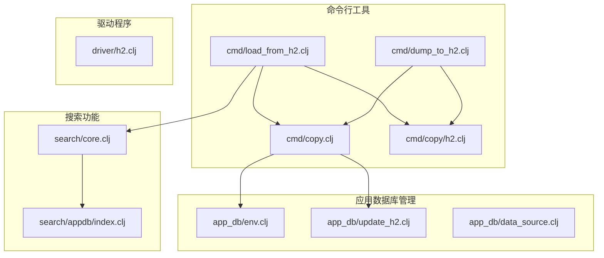
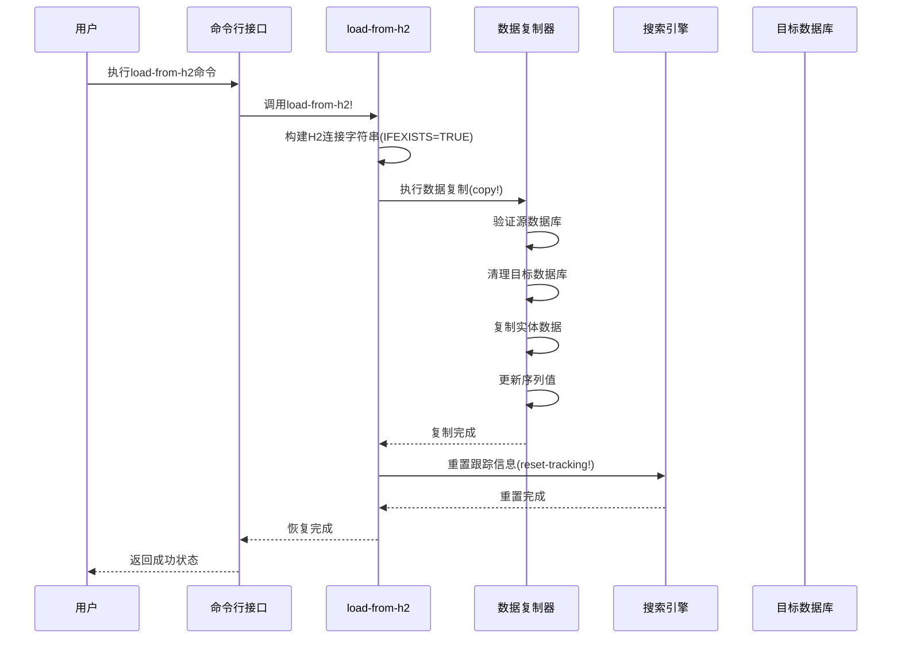
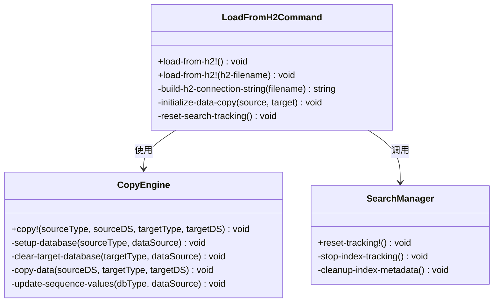
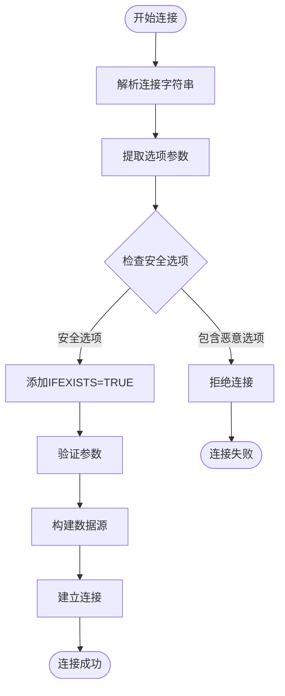
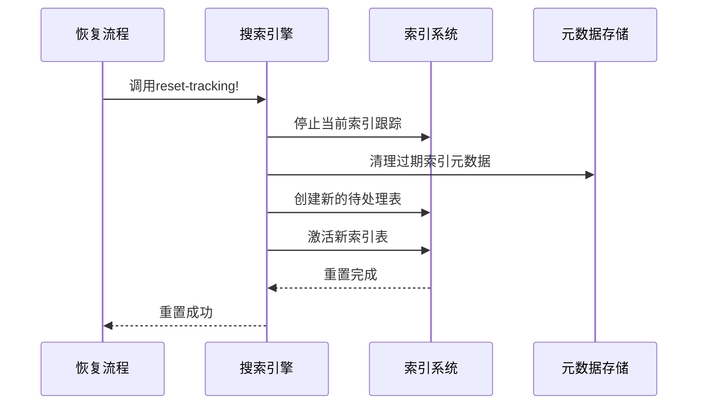
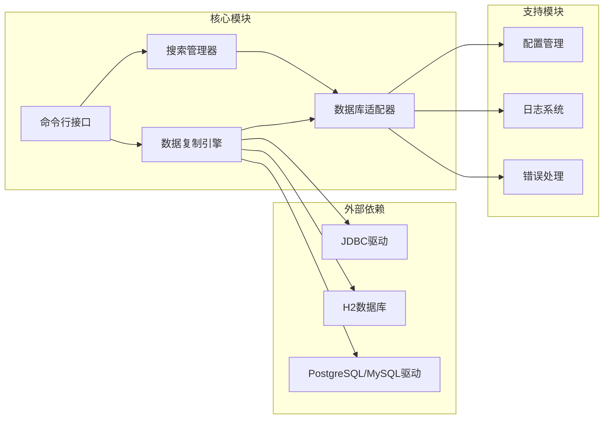
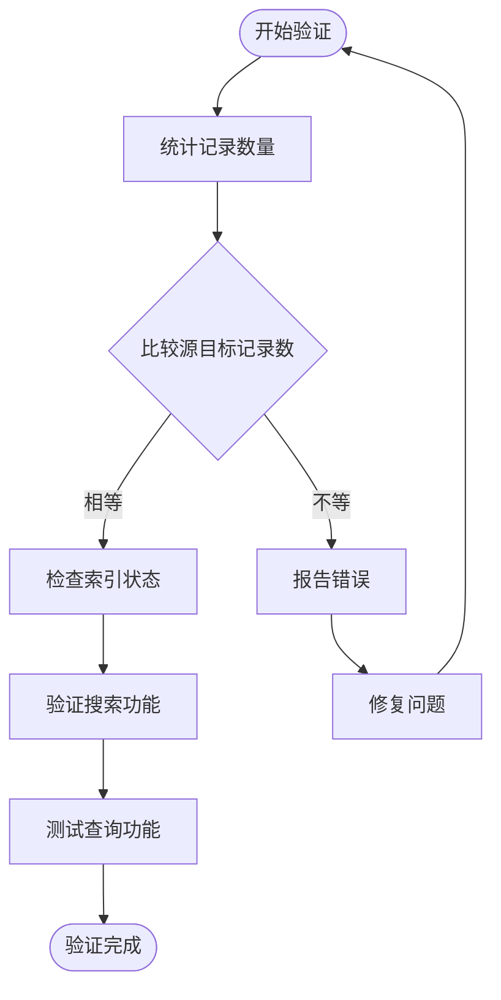

# 恢复流程

<cite>
**本文档中引用的文件**
- [load_from_h2.clj](file://src/metabase/cmd/load_from_h2.clj)
- [dump_to_h2.clj](file://src/metabase/cmd/dump_to_h2.clj)
- [copy.clj](file://src/metabase/cmd/copy.clj)
- [copy/h2.clj](file://src/metabase/cmd/copy/h2.clj)
- [update_h2.clj](file://src/metabase/app_db/update_h2.clj)
- [env.clj](file://src/metabase/app_db/env.clj)
- [core.clj](file://src/metabase/search/core.clj)
- [index.clj](file://src/metabase/search/appdb/index.clj)
- [h2.clj](file://src/metabase/driver/h2.clj)
</cite>

## 目录
1. [简介](#简介)
2. [项目结构概览](#项目结构概览)
3. [核心组件分析](#核心组件分析)
4. [架构概览](#架构概览)
5. [详细组件分析](#详细组件分析)
6. [依赖关系分析](#依赖关系分析)
7. [性能考虑](#性能考虑)
8. [故障排除指南](#故障排除指南)
9. [结论](#结论)

## 简介

Metabase的数据恢复流程是一个复杂而精密的系统，主要通过`load-from-h2`命令实现从H2文件到目标数据库的数据迁移。该流程不仅涉及数据的物理迁移，还包括索引重建、搜索功能重置等关键步骤，确保恢复后的数据完整性和系统功能正常运行。

本文档将详细说明load-from-h2命令的使用方法、执行步骤和内部实现机制，包括H2文件连接字符串中IFEXISTS=TRUE参数的作用和重要性，以及恢复过程中索引重建和搜索功能重置的必要性。

## 项目结构概览

Metabase的数据恢复功能主要分布在以下关键目录中：

**图表来源**
- [load_from_h2.clj](file://src/metabase/cmd/load_from_h2.clj#L1-L38)
- [copy.clj](file://src/metabase/cmd/copy.clj#L1-L50)
- [search/core.clj](file://src/metabase/search/core.clj#L1-L30)

## 核心组件分析

### load-from-h2命令核心功能

`load-from-h2`命令是数据恢复的核心入口点，负责将现有的H2数据库数据迁移到新的目标数据库（通常是PostgreSQL或MySQL）。

**章节来源**
- [load_from_h2.clj](file://src/metabase/cmd/load_from_h2.clj#L20-L38)

### 数据复制引擎

数据复制引擎是整个恢复流程的技术核心，负责处理不同数据库类型之间的数据迁移。

**章节来源**
- [copy.clj](file://src/metabase/cmd/copy.clj#L400-L450)

### H2数据库更新器

专门处理H2数据库版本升级的组件，确保数据库格式兼容性。

**章节来源**
- [update_h2.clj](file://src/metabase/app_db/update_h2.clj#L80-L108)

## 架构概览

数据恢复流程采用分层架构设计，确保各组件职责明确且相互协作：

**图表来源**
- [load_from_h2.clj](file://src/metabase/cmd/load_from_h2.clj#L25-L38)
- [copy.clj](file://src/metabase/cmd/copy.clj#L420-L450)

## 详细组件分析

### load-from-h2命令实现

load-from-h2命令的设计遵循单一职责原则，专注于数据迁移任务：

**图表来源**
- [load_from_h2.clj](file://src/metabase/cmd/load_from_h2.clj#L20-L38)
- [copy.clj](file://src/metabase/cmd/copy.clj#L420-L450)

### H2连接字符串安全机制

H2连接字符串的安全处理是防止SQL注入攻击的关键环节：

**图表来源**
- [h2.clj](file://src/metabase/driver/h2.clj#L520-L540)
- [copy/h2.clj](file://src/metabase/cmd/copy/h2.clj#L20-L38)

### 数据实体迁移顺序

为了确保数据完整性，系统按照特定顺序迁移不同的数据实体：

| 序号 | 实体名称 | 迁移优先级 | 依赖关系 |
|------|----------|------------|----------|
| 1 | Channel | 最高 | 无 |
| 2 | Database | 高 | Channel |
| 3 | User | 高 | Database |
| 4 | Setting | 中 | User |
| 5 | Table | 中 | Setting |
| 6 | Field | 中 | Table |
| 7 | Card | 低 | Field |
| 8 | Dashboard | 低 | Card |
| 9 | Pulse | 低 | Dashboard |

**章节来源**
- [copy.clj](file://src/metabase/cmd/copy.clj#L50-L100)

### 索引重建和搜索功能重置

搜索功能的重置是恢复流程中的关键步骤：

**图表来源**
- [core.clj](file://src/metabase/search/core.clj#L140-L150)
- [index.clj](file://src/metabase/search/appdb/index.clj#L370-L400)

**章节来源**
- [core.clj](file://src/metabase/search/core.clj#L140-L172)

## 依赖关系分析

数据恢复流程涉及多个模块间的复杂依赖关系：

**图表来源**
- [copy.clj](file://src/metabase/cmd/copy.clj#L1-L20)
- [env.clj](file://src/metabase/app_db/env.clj#L1-L30)

**章节来源**
- [copy.clj](file://src/metabase/cmd/copy.clj#L1-L50)

## 性能考虑

### 大数据量处理策略

对于大型数据库，系统采用分块处理和事务管理来优化性能：

- **分块大小**: 默认100行/块，平衡内存使用和网络开销
- **事务控制**: 使用回滚点确保数据一致性
- **并发处理**: 支持异步索引重建

### 内存优化

- **流式处理**: 对大数据集采用流式读取
- **连接池管理**: 合理配置数据库连接池
- **垃圾回收**: 及时释放不再使用的资源

## 故障排除指南

### 常见错误及解决方案

#### 1. H2文件不存在错误

**错误信息**: `H2 file does not exist`

**解决方案**:
- 确认H2文件路径正确
- 检查文件权限设置
- 验证文件扩展名(.mv.db)

#### 2. 目标数据库已存在数据

**错误信息**: `Target DB is already populated`

**解决方案**:
- 清空目标数据库
- 使用干净的目标数据库实例
- 检查数据库连接配置

#### 3. 索引重建失败

**错误信息**: `Index initialization failed`

**解决方案**:
- 检查磁盘空间
- 验证数据库权限
- 重启搜索服务

#### 4. 连接超时问题

**错误信息**: `Connection timeout`

**解决方案**:
- 增加连接超时时间
- 检查网络连接
- 优化数据库配置

### 验证恢复结果

#### 数据完整性检查

#### 功能测试清单

- [ ] 用户认证功能
- [ ] 数据库连接测试
- [ ] 查询执行能力
- [ ] 权限管理系统
- [ ] 搜索功能可用性
- [ ] 报告生成功能

**章节来源**
- [copy.clj](file://src/metabase/cmd/copy.clj#L300-L350)

## 结论

Metabase的数据恢复流程是一个精心设计的系统，通过load-from-h2命令实现了从H2文件到目标数据库的无缝迁移。该流程不仅保证了数据的完整性和一致性，还通过索引重建和搜索功能重置确保了系统的功能性。

关键要点总结：

1. **安全性**: 通过IFEXISTS=TRUE参数和连接字符串安全检查防止数据丢失和安全漏洞
2. **完整性**: 严格按照依赖关系顺序迁移数据实体，确保外键约束的正确性
3. **可维护性**: 模块化设计便于扩展和维护
4. **可靠性**: 完善的错误处理和回滚机制
5. **性能**: 分块处理和事务管理优化大数据量场景

通过遵循本文档提供的指导和最佳实践，用户可以安全、可靠地完成Metabase数据的恢复和迁移工作。