# 事件跟踪

<cite>
**本文档中引用的文件**
- [snowplow.clj](file://src/metabase/analytics/snowplow.clj)
- [send_anonymous_stats.clj](file://src/metabase/analytics/task/send_anonymous_stats.clj)
- [core.clj](file://src/metabase/analytics/core.clj)
- [settings.clj](file://src/metabase/analytics/settings.clj)
- [stats.clj](file://src/metabase/analytics/stats.clj)
- [schema.clj](file://src/metabase/events/schema.clj)
- [impl.clj](file://src/metabase/events/impl.clj)
- [view_log.clj](file://src/metabase/view_log/events/view_log.clj)
- [api.clj](file://src/metabase/dashboards/api.clj)
- [execution.clj](file://src/metabase/actions/execution.clj)
- [process_userland_query.clj](file://src/metabase/query_processor/middleware/process_userland_query.clj)
</cite>

## 目录
1. [简介](#简介)
2. [系统架构概览](#系统架构概览)
3. [Snowplow事件收集机制](#snowplow事件收集机制)
4. [事件类型与模式](#事件类型与模式)
5. [事件发布与订阅系统](#事件发布与订阅系统)
6. [查询执行跟踪](#查询执行跟踪)
7. [仪表板与卡片视图跟踪](#仪表板与卡片视图跟踪)
8. [匿名统计信息收集](#匿名统计信息收集)
9. [配置与隐私保护](#配置与隐私保护)
10. [数据处理与消费者端](#数据处理与消费者端)
11. [故障排除指南](#故障排除指南)
12. [总结](#总结)

## 简介

Metabase事件跟踪系统是一个基于Snowplow的综合数据分析平台，用于收集和分析用户行为数据。该系统通过多种渠道收集用户交互信息，包括仪表板访问、查询执行、卡片操作等，并将其发送到Snowplow收集器进行后续分析。

系统采用事件驱动架构，支持实时事件捕获、批量处理和异步传输，确保不影响主业务流程的性能。同时，系统提供了完善的隐私保护机制，允许用户选择是否参与匿名统计数据收集。

## 系统架构概览

事件跟踪系统采用分层架构设计，包含以下核心组件：

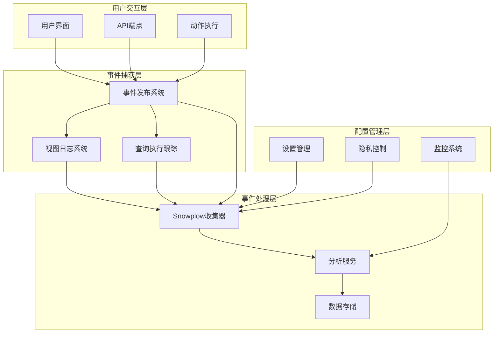

**图表来源**
- [core.clj](file://src/metabase/analytics/core.clj#L1-L59)
- [impl.clj](file://src/metabase/events/impl.clj#L1-L127)

**章节来源**
- [core.clj](file://src/metabase/analytics/core.clj#L1-L59)
- [impl.clj](file://src/metabase/events/impl.clj#L1-L127)

## Snowplow事件收集机制

### 收集器配置

Snowplow收集器是事件跟踪系统的核心组件，负责接收、验证和转发事件数据。

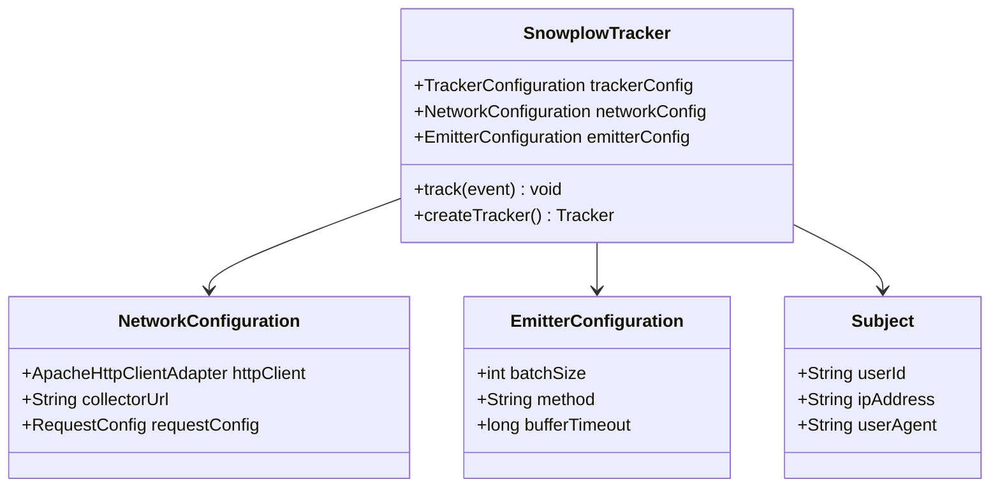

**图表来源**
- [snowplow.clj](file://src/metabase/analytics/snowplow.clj#L54-L89)

### 事件上下文构建

每个事件都包含丰富的上下文信息，确保数据分析的准确性：

| 上下文类型 | 描述 | 包含内容 |
|-----------|------|----------|
| 实例信息 | Metabase实例基本信息 | UUID、版本、数据库类型、令牌功能 |
| 用户信息 | 当前用户标识 | 用户ID、IP地址（匿名化） |
| 环境信息 | 运行环境详情 | 操作系统、Java版本、部署模型 |
| 时间戳 | 事件发生时间 | RFC3339格式的时间戳 |

### 事件序列化与发送流程

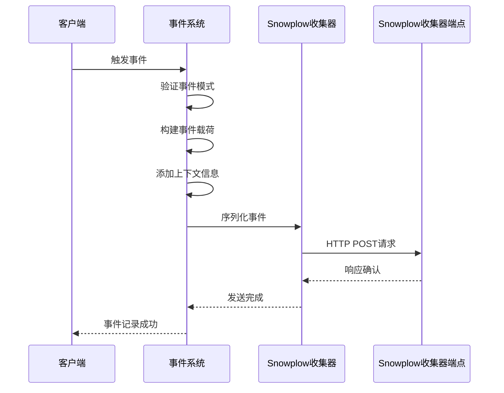

**图表来源**
- [snowplow.clj](file://src/metabase/analytics/snowplow.clj#L147-L160)

**章节来源**
- [snowplow.clj](file://src/metabase/analytics/snowplow.clj#L1-L162)

## 事件类型与模式

### 核心事件类型

系统定义了多种事件类型，每种都有特定的结构和用途：

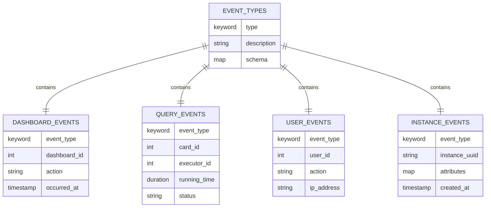

**图表来源**
- [schema.clj](file://src/metabase/events/schema.clj#L1-L198)

### 事件模式设计

系统使用Malli库定义严格的事件模式，确保数据质量和一致性：

| 事件类别 | 模式名称 | 主要字段 | 验证规则 |
|---------|----------|----------|----------|
| 仪表板事件 | `:event/dashboard-create` | `user-id`, `object` | 必须为Dashboard对象 |
| 查询事件 | `:event/card-query` | `card-id`, `executor-id` | 必须为有效卡片ID |
| 用户事件 | `:event/user-login` | `user-id` | 必须为正整数 |
| 权限事件 | `:event/read-permission-failure` | `user-id`, `object` | 可选用户ID |

**章节来源**
- [schema.clj](file://src/metabase/events/schema.clj#L1-L198)

## 事件发布与订阅系统

### 事件发布机制

事件系统采用Methodical库实现的多方法分发机制：

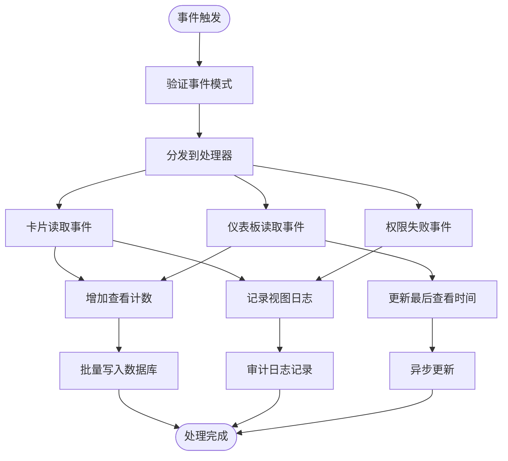

**图表来源**
- [impl.clj](file://src/metabase/events/impl.clj#L40-L126)
- [view_log.clj](file://src/metabase/view_log/events/view_log.clj#L80-L218)

### 异步处理队列

系统使用Grouper库实现高效的异步处理队列：

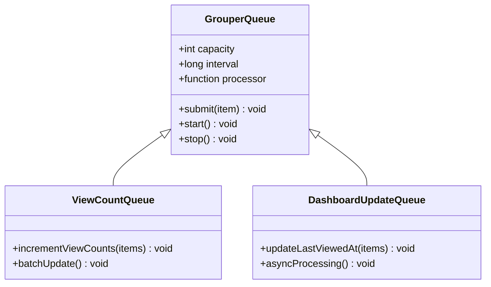

**图表来源**
- [view_log.clj](file://src/metabase/view_log/events/view_log.clj#L60-L80)

**章节来源**
- [impl.clj](file://src/metabase/events/impl.clj#L1-L127)
- [view_log.clj](file://src/metabase/view_log/events/view_log.clj#L1-L219)

## 查询执行跟踪

### 查询执行生命周期

查询执行跟踪系统记录从查询开始到结束的完整生命周期：

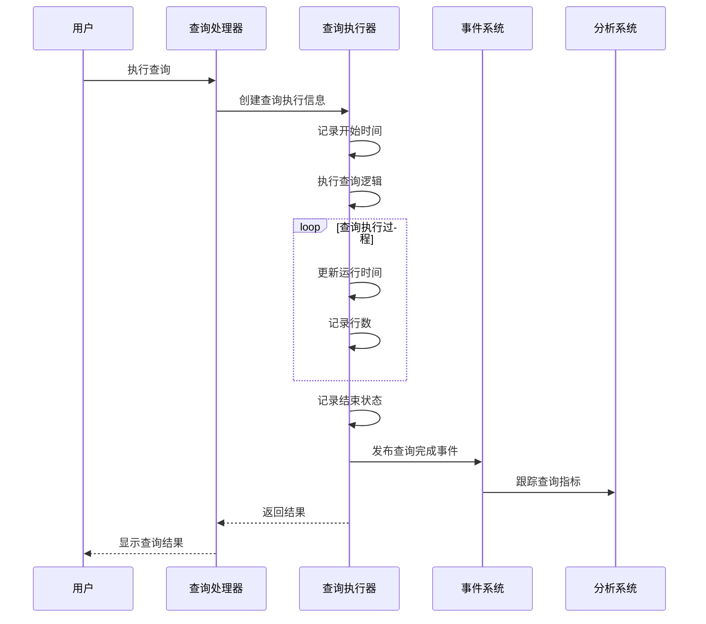

**图表来源**
- [process_userland_query.clj](file://src/metabase/query_processor/middleware/process_userland_query.clj#L144-L176)

### 查询执行指标

系统收集详细的查询执行指标：

| 指标类别 | 具体指标 | 数据类型 | 用途 |
|---------|----------|----------|------|
| 执行统计 | 总执行次数、成功次数、失败次数 | 整数计数 | 性能监控 |
| 延迟分布 | 0ms、1-10s、11-50s、51-250s等 | 分桶计数 | 性能分析 |
| 用户分布 | 每用户执行次数分布 | 中位数统计 | 使用模式分析 |
| 查询类型 | 原生查询、GUI查询比例 | 百分比 | 功能使用度 |

**章节来源**
- [process_userland_query.clj](file://src/metabase/query_processor/middleware/process_userland_query.clj#L1-L176)
- [stats.clj](file://src/metabase/analytics/stats.clj#L368-L450)

## 仪表板与卡片视图跟踪

### 视图事件处理

系统自动跟踪仪表板和卡片的访问情况：

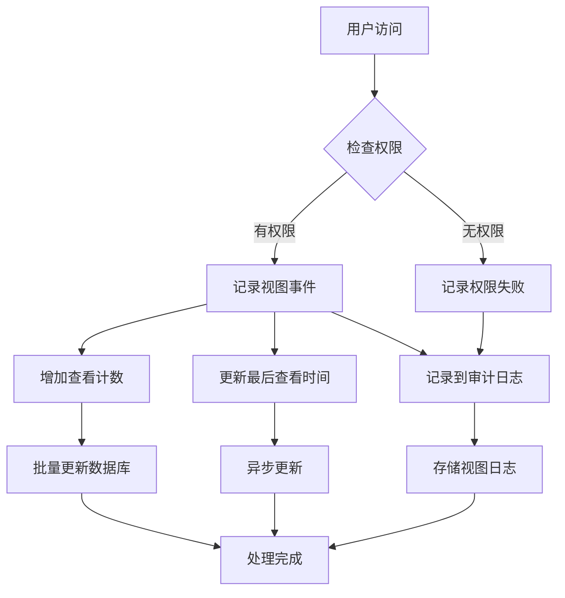

**图表来源**
- [view_log.clj](file://src/metabase/view_log/events/view_log.clj#L80-L218)

### 仪表板卡片事件

仪表板卡片事件跟踪包括添加、删除和移动操作：

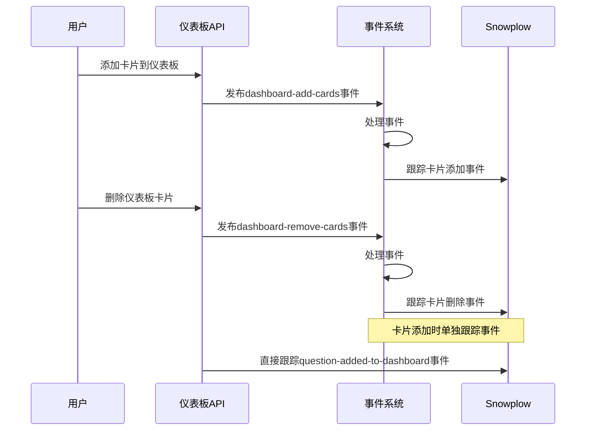

**图表来源**
- [api.clj](file://src/metabase/dashboards/api.clj#L782-L810)

**章节来源**
- [view_log.clj](file://src/metabase/view_log/events/view_log.clj#L1-L219)
- [api.clj](file://src/metabase/dashboards/api.clj#L780-L820)

## 匿名统计信息收集

### 统计数据生成

系统定期收集和发送匿名使用统计数据：

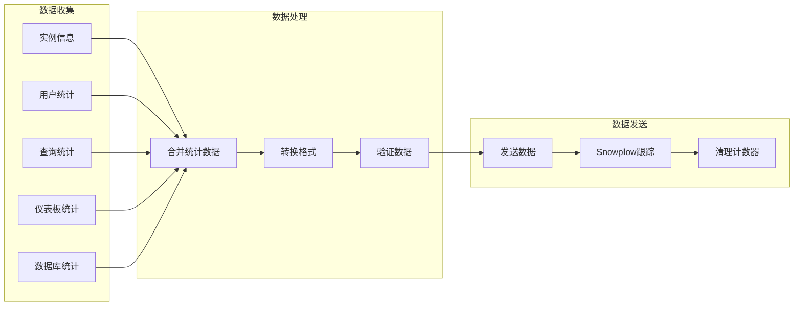

**图表来源**
- [stats.clj](file://src/metabase/analytics/stats.clj#L942-L1000)

### 统计指标分类

系统收集的统计数据按功能模块分类：

| 模块类别 | 统计指标 | 数据来源 | 更新频率 |
|---------|----------|----------|----------|
| 基础信息 | 版本、部署模式、启动时间 | 系统设置 | 实时 |
| 用户统计 | 活跃用户、管理员数量、SSO用户 | 用户表 | 实时 |
| 查询统计 | 执行次数、成功率、延迟分布 | 查询执行表 | 每日 |
| 内容统计 | 仪表板数量、卡片数量、收藏夹 | 内容表 | 实时 |
| 系统统计 | 缓存大小、内存使用、处理器数量 | JVM指标 | 实时 |

### 激活信号检测

系统自动检测实例激活状态：

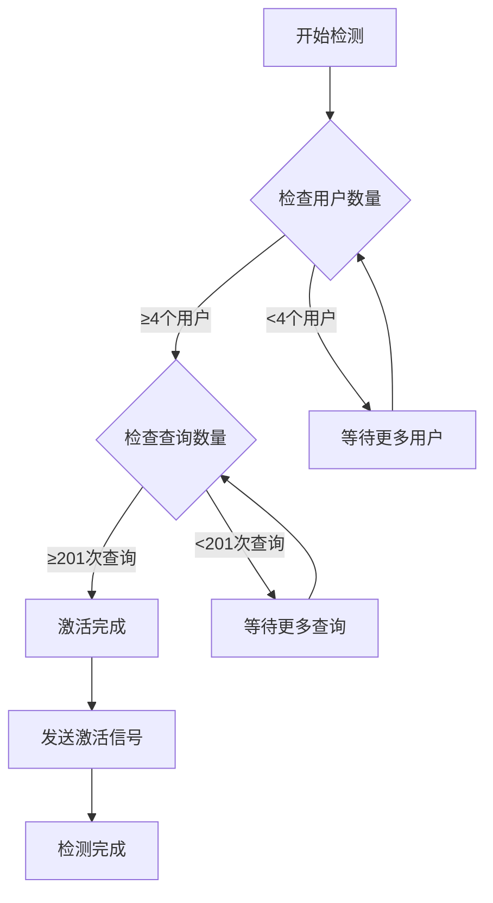

**图表来源**
- [stats.clj](file://src/metabase/analytics/stats.clj#L526-L551)

**章节来源**
- [stats.clj](file://src/metabase/analytics/stats.clj#L1-L1002)
- [send_anonymous_stats.clj](file://src/metabase/analytics/task/send_anonymous_stats.clj#L1-L41)

## 配置与隐私保护

### 隐私设置选项

系统提供多层次的隐私保护配置：

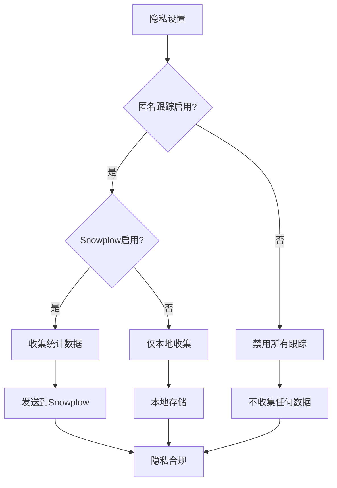

**图表来源**
- [settings.clj](file://src/metabase/analytics/settings.clj#L35-L65)

### 配置参数详解

| 配置项 | 默认值 | 描述 | 影响范围 |
|-------|--------|------|----------|
| `anon-tracking-enabled` | `true` | 启用匿名统计数据收集 | 全局 |
| `snowplow-available` | 生产环境`true` | Snowplow收集器可用性 | 网络连接 |
| `snowplow-enabled` | 自动 | 综合状态决定是否发送事件 | 事件发送 |
| `snowplow-url` | 生产环境URL | Snowplow收集器端点 | 数据传输 |

### 数据匿名化处理

系统在数据收集过程中实施多重匿名化措施：

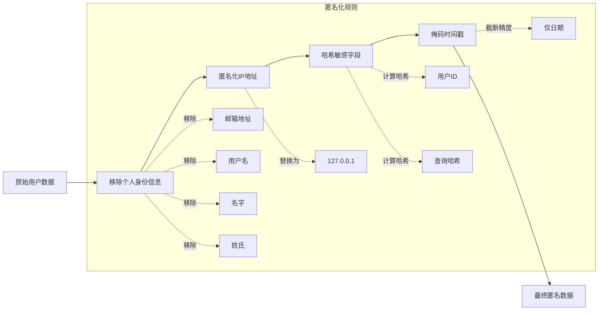

**图表来源**
- [snowplow.clj](file://src/metabase/analytics/snowplow.clj#L86-L118)

**章节来源**
- [settings.clj](file://src/metabase/analytics/settings.clj#L1-L110)

## 数据处理与消费者端

### Snowplow模式版本管理

系统维护严格的Snowplow模式版本控制：

| 事件类型 | 当前版本 | 最新版本 | 更新时间 |
|---------|----------|----------|----------|
| `account` | 1-0-1 | 1-0-1 | 最新 |
| `dashboard` | 1-1-4 | 1-1-4 | 最新 |
| `instance_stats` | 2-0-0 | 2-0-0 | 最新 |
| `csvupload` | 1-0-3 | 1-0-3 | 最新 |
| `database` | 1-0-1 | 1-0-1 | 最新 |

### 数据消费者集成

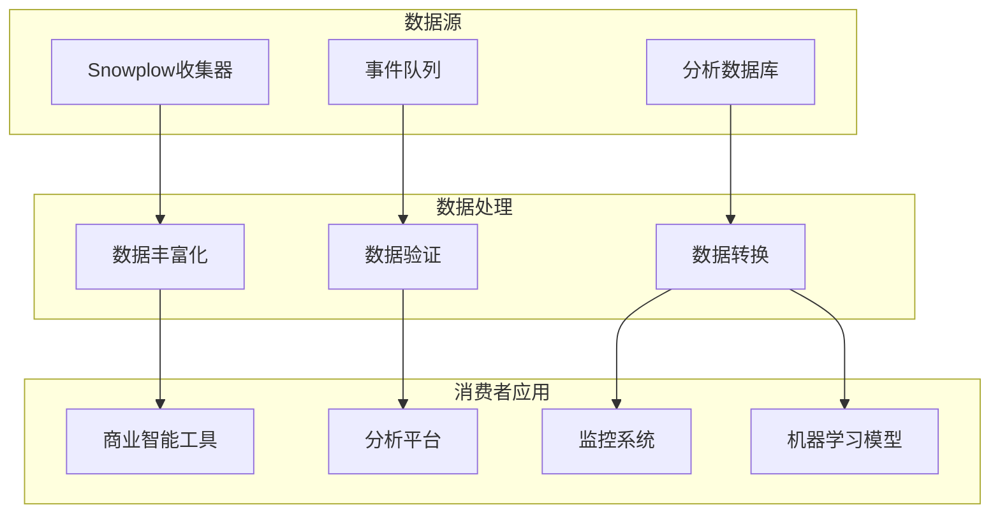

### 事件模式设计指南

为确保数据质量和一致性，建议遵循以下模式设计原则：

1. **严格的数据类型验证**：使用Malli模式定义明确的数据类型
2. **版本兼容性**：保持向后兼容的版本策略
3. **字段命名规范**：使用snake_case命名法
4. **可选字段处理**：合理使用可选字段减少数据冗余
5. **事件粒度平衡**：在详细性和性能之间找到平衡

**章节来源**
- [snowplow.clj](file://src/metabase/analytics/snowplow.clj#L26-L53)

## 故障排除指南

### 常见问题诊断

| 问题类型 | 症状描述 | 可能原因 | 解决方案 |
|---------|----------|----------|----------|
| 事件未发送 | Snowplow中没有收到事件 | 网络连接问题 | 检查防火墙设置 |
| 数据格式错误 | 事件被拒绝 | 模式验证失败 | 检查事件数据结构 |
| 性能影响 | 系统响应变慢 | 事件处理队列积压 | 调整队列配置 |
| 隐私违规 | 数据泄露风险 | 配置不当 | 检查隐私设置 |

### 监控与调试

系统提供多种监控和调试工具：

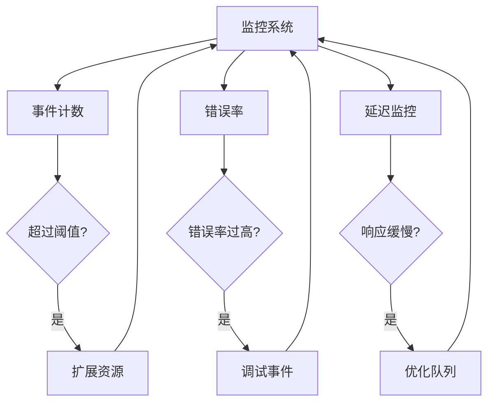

### 性能优化建议

1. **批量处理**：合理设置事件批处理大小
2. **异步处理**：使用异步队列避免阻塞主线程
3. **缓存策略**：缓存频繁访问的配置信息
4. **资源限制**：设置合理的内存和CPU使用限制
5. **重试机制**：实现指数退避的重试策略

## 总结

Metabase事件跟踪系统是一个功能完善、设计精良的数据收集平台。它通过基于Snowplow的技术栈，实现了高效、可靠的用户行为数据收集和分析能力。

### 主要优势

1. **全面覆盖**：涵盖用户交互、查询执行、系统性能等多个维度
2. **高性能**：采用异步处理和批量传输，最小化对业务的影响
3. **隐私保护**：提供多层次的隐私控制和数据匿名化机制
4. **可扩展性**：模块化设计支持灵活的功能扩展
5. **标准化**：遵循Snowplow标准，便于与其他分析系统集成

### 最佳实践建议

1. **合理配置**：根据实际需求调整跟踪级别和数据保留策略
2. **定期审查**：定期检查事件模式和数据质量
3. **性能监控**：持续监控事件处理性能和系统资源使用
4. **隐私合规**：确保符合相关数据保护法规要求
5. **团队协作**：建立跨团队的数据使用规范和流程

通过这个事件跟踪系统，Metabase能够深入了解用户行为模式，优化产品功能，并为用户提供更好的数据分析体验。