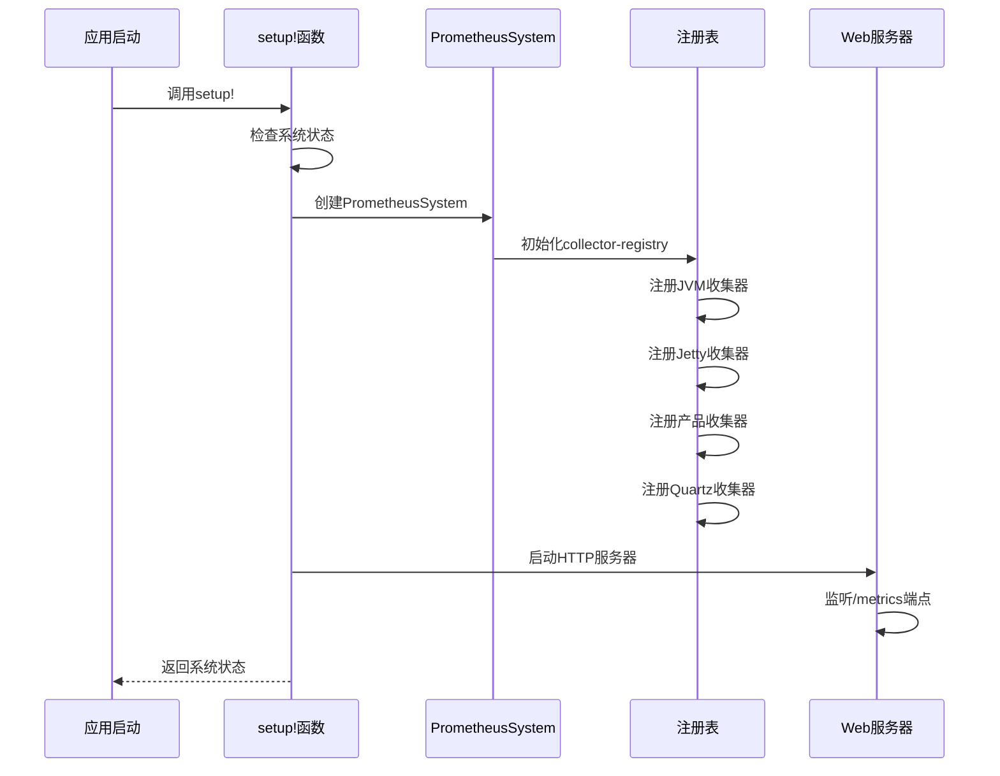
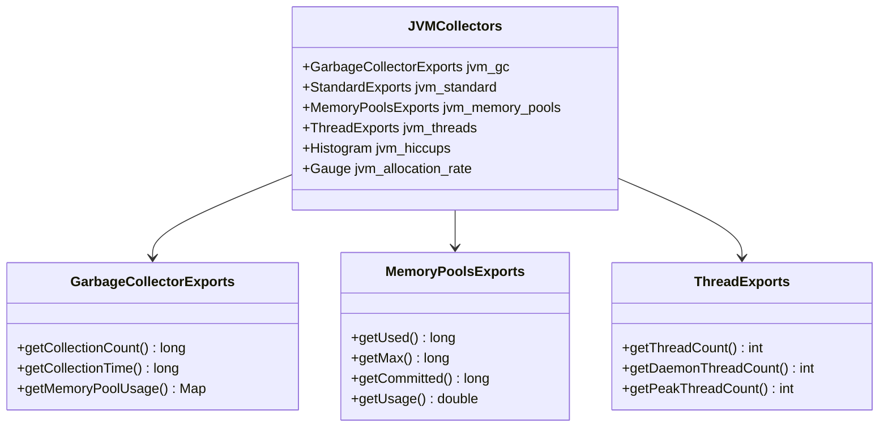
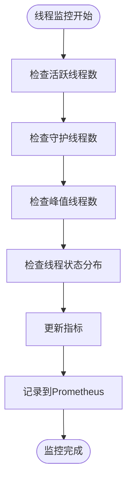
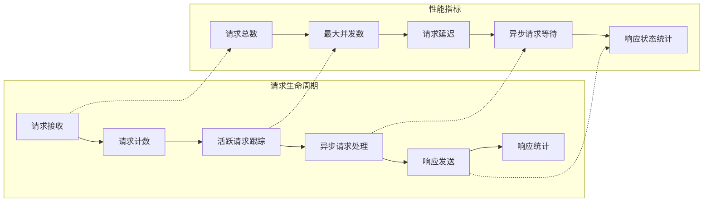
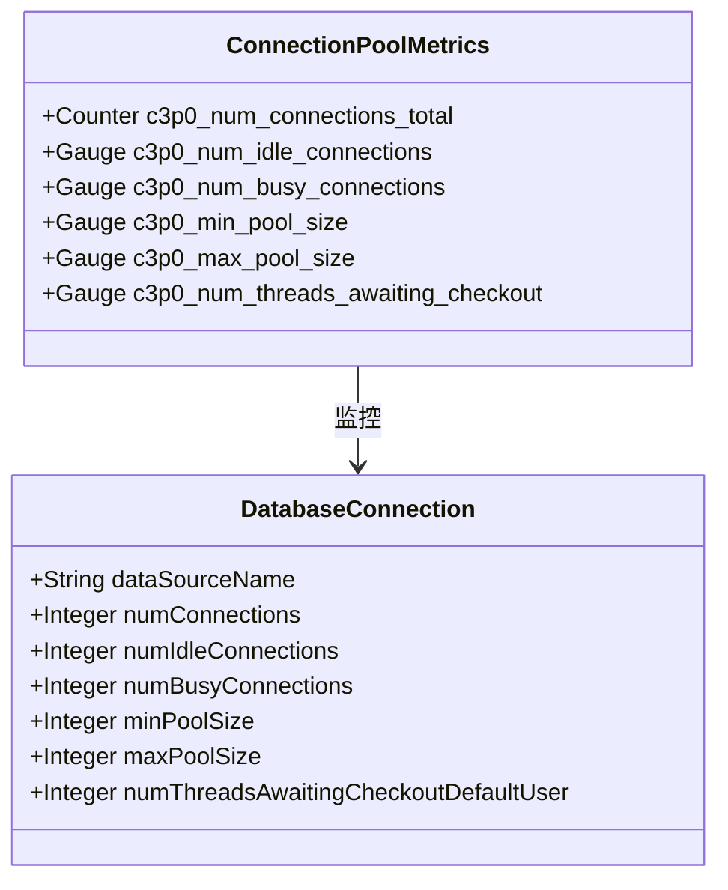
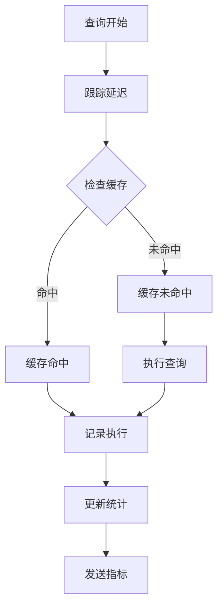
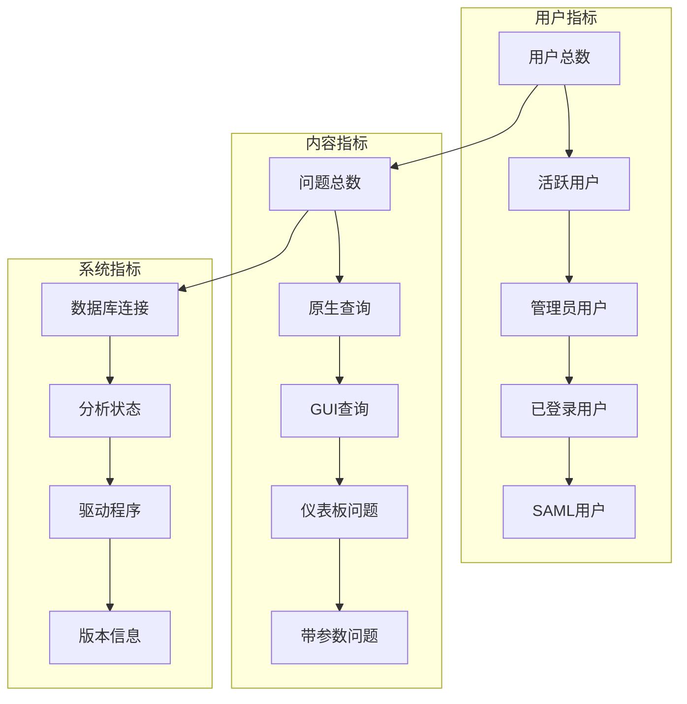
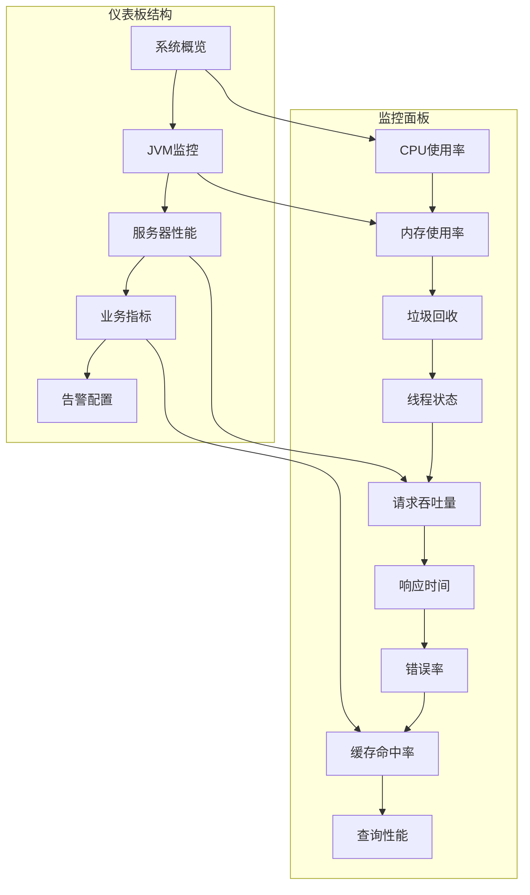
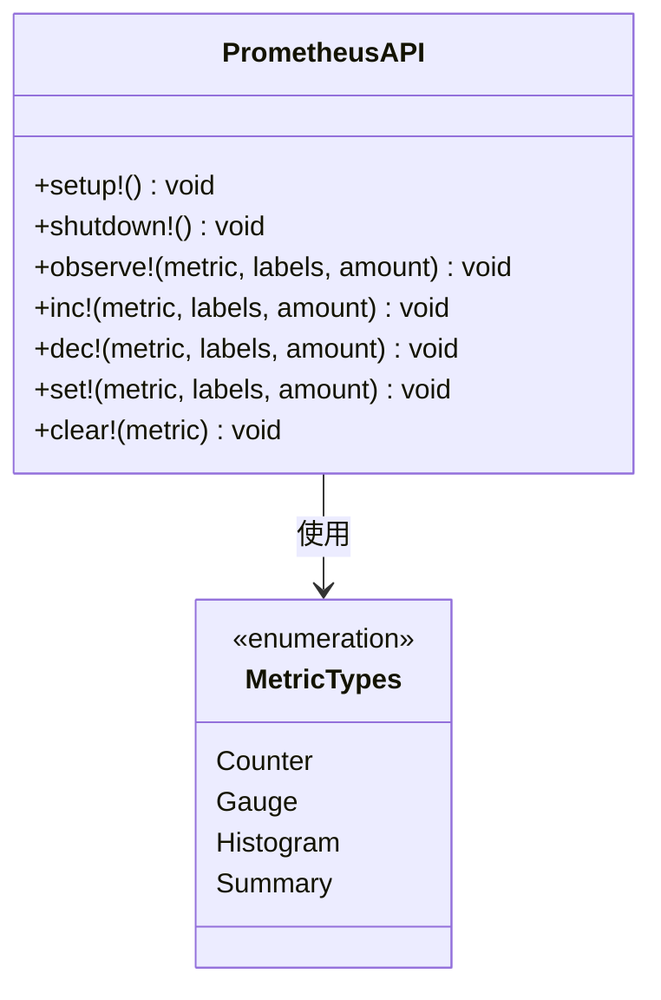

# 指标监控

<cite>
**本文档中引用的文件**
- [prometheus.clj](file://src/metabase/analytics/prometheus.clj)
- [statistics_handler.clj](file://src/metabase/server/statistics_handler.clj)
- [stats.clj](file://src/metabase/analytics/stats.clj)
- [settings.clj](file://src/metabase/analytics/settings.clj)
- [query_executions.clj](file://src/metabase/internal_stats/query_executions.clj)
- [process_userland_query.clj](file://src/metabase/query_processor/middleware/process_userland_query.clj)
</cite>

## 目录
1. [简介](#简介)
2. [系统架构概览](#系统架构概览)
3. [Prometheus指标暴露机制](#prometheus指标暴露机制)
4. [JVM运行时指标](#jvm运行时指标)
5. [Jetty服务器性能指标](#jetty服务器性能指标)
6. [Metabase自定义业务指标](#metabase自定义业务指标)
7. [指标命名规范和标签设计](#指标命名规范和标签设计)
8. [Grafana仪表板配置](#grafana仪表板配置)
9. [安全访问控制](#安全访问控制)
10. [与Prometheus监控系统集成](#与prometheus监控系统集成)
11. [添加自定义指标](#添加自定义指标)
12. [故障排除指南](#故障排除指南)

## 简介

Metabase提供了基于Prometheus的全面指标监控系统，能够实时收集和暴露JVM运行时指标、Jetty服务器性能数据以及Metabase特有的业务指标。该监控系统采用模块化设计，支持灵活的指标收集和自定义扩展，为运维团队提供了强大的可观测性能力。

## 系统架构概览

Metabase的指标监控系统采用分层架构设计，主要由以下组件构成：

```mermaid
graph TB
subgraph "指标收集层"
JVM[JVM指标收集器]
Jetty[Jetty服务器指标]
Product[产品功能指标]
Quartz[Quartz任务指标]
end
subgraph "指标处理层"
Registry[Prometheus注册表]
Collectors[指标收集器]
Handlers[统计处理器]
end
subgraph "指标暴露层"
WebServer[HTTP Web服务器]
MetricsEndpoint[/metrics端点]
Security[安全控制]
end
subgraph "外部系统"
Prometheus[Prometheus服务器]
Grafana[Grafana仪表板]
AlertManager[告警管理器]
end
JVM --> Registry
Jetty --> Registry
Product --> Registry
Quartz --> Registry
Registry --> Collectors
Collectors --> Handlers
Handlers --> WebServer
WebServer --> MetricsEndpoint
MetricsEndpoint --> Security
Security --> Prometheus
Prometheus --> Grafana
Prometheus --> AlertManager
```

**图表来源**
- [prometheus.clj](file://src/metabase/analytics/prometheus.clj#L168-L290)
- [statistics_handler.clj](file://src/metabase/server/statistics_handler.clj#L80-L120)

## Prometheus指标暴露机制

### 核心组件初始化

Metabase的Prometheus集成通过`setup!`函数启动，该函数负责初始化整个指标收集系统：



**图表来源**
- [prometheus.clj](file://src/metabase/analytics/prometheus.clj#L550-L584)
- [prometheus.clj](file://src/metabase/analytics/prometheus.clj#L526-L551)

### 环境变量配置

指标端点的启用依赖于环境变量配置：

| 配置项 | 类型 | 默认值 | 描述 |
|--------|------|--------|------|
| `MB_PROMETHEUS_SERVER_PORT` | 整数 | 无 | Prometheus指标服务监听端口 |
| `prometheus-server-port` | 设置项 | 无 | 内部配置项，仅通过环境变量设置 |

**章节来源**
- [settings.clj](file://src/metabase/analytics/settings.clj#L11-L25)

### 端点访问模式

指标数据通过以下URL路径暴露：
- **标准端点**: `http://localhost:<port>/metrics`
- **认证端点**: 受安全控制的指标访问

## JVM运行时指标

### 垃圾回收指标

JVM垃圾回收指标通过专门的收集器实时监控：



**图表来源**
- [prometheus.clj](file://src/metabase/analytics/prometheus.clj#L175-L198)

### 内存池使用指标

关键内存池的使用情况监控：

| 指标名称 | 类型 | 描述 | 单位 |
|----------|------|------|------|
| `metabase_application/jvm_gc` | Counter | 垃圾回收次数 | 次数 |
| `metabase_application/jvm_standard` | Gauge | JVM标准指标 | 字节 |
| `metabase_application/jvm_memory_pools` | Gauge | 内存池使用量 | 字节 |
| `metabase_application/jvm_threads` | Gauge | 线程状态统计 | 个数 |
| `metabase_application/jvm_hiccups` | Histogram | 系统暂停持续时间 | 毫秒 |
| `metabase_application/jvm_allocation_rate` | Gauge | 堆分配速率 | 字节/秒 |

**章节来源**
- [prometheus.clj](file://src/metabase/analytics/prometheus.clj#L175-L198)

### 线程状态监控

线程池和线程状态的实时监控：



**图表来源**
- [prometheus.clj](file://src/metabase/analytics/prometheus.clj#L190-L198)

## Jetty服务器性能指标

### 请求处理指标

Jetty服务器的请求处理性能通过多层次指标进行监控：



**图表来源**
- [statistics_handler.clj](file://src/metabase/server/statistics_handler.clj#L80-L120)

### 关键性能指标

| 指标类别 | 指标名称 | 类型 | 描述 |
|----------|----------|------|------|
| **请求统计** | `jetty/requests-total` | Counter | 总请求数 |
| **请求统计** | `jetty/requests-active` | Gauge | 当前活跃请求数 |
| **请求统计** | `jetty/requests-max` | Gauge | 历史最大并发数 |
| **请求统计** | `jetty/request-time-max-seconds` | Gauge | 最大请求处理时间 |
| **请求统计** | `jetty/request-time-seconds-total` | Counter | 总请求处理时间 |
| **分发统计** | `jetty/dispatched-total` | Counter | 已处理请求数 |
| **分发统计** | `jetty/dispatched-active` | Gauge | 当前活跃分发数 |
| **分发统计** | `jetty/dispatched-active-max` | Gauge | 历史最大分发数 |
| **异步统计** | `jetty/async-requests-total` | Counter | 异步请求数 |
| **异步统计** | `jetty/async-requests-waiting` | Gauge | 等待异步请求数 |
| **响应统计** | `jetty/responses-total` | Counter | 响应总数（按状态码分组） |
| **响应统计** | `jetty/responses-bytes-total` | Counter | 总响应字节数 |

**章节来源**
- [prometheus.clj](file://src/metabase/analytics/prometheus.clj#L199-L239)

### 连接池监控

数据库连接池的状态监控：



**图表来源**
- [prometheus.clj](file://src/metabase/analytics/prometheus.clj#L60-L110)

## Metabase自定义业务指标

### 查询执行指标

查询执行性能的全面监控：



**图表来源**
- [process_userland_query.clj](file://src/metabase/query_processor/middleware/process_userland_query.clj#L65-L90)

### 缓存命中率指标

查询缓存性能的关键指标：

| 指标名称 | 类型 | 描述 | 计算方式 |
|----------|------|------|----------|
| `metabase-cache/average_entry_size` | Gauge | 平均缓存条目大小 | `(总大小 / 条目数)` |
| `metabase-cache/num_queries_cached` | Gauge | 已缓存查询数量 | 分箱统计 |
| `metabase-cache/num_queries_cached_unbinned` | Gauge | 未分箱缓存查询数量 | 精确计数 |

**章节来源**
- [stats.clj](file://src/metabase/analytics/stats.clj#L426-L440)

### 用户活动指标

用户行为和系统使用情况的统计：



**图表来源**
- [stats.clj](file://src/metabase/analytics/stats.clj#L150-L200)

### 系统环境指标

运行环境的元数据收集：

| 指标类别 | 具体指标 | 描述 |
|----------|----------|------|
| **内存信息** | `max_memory` | 最大可用内存（MB） |
| **处理器信息** | `processors` | CPU核心数 |
| **Java信息** | `java_version` | Java版本 |
| **操作系统** | `os_name` | 操作系统名称 |
| **语言设置** | `user_language` | 用户语言 |
| **时区信息** | `user_timezone` | 用户时区 |

**章节来源**
- [stats.clj](file://src/metabase/analytics/stats.clj#L442-L464)

## 指标命名规范和标签设计

### 命名规范

Metabase采用层次化的指标命名规范：

```
格式：namespace/category/subcategory/metric_name
示例：metabase_application/jvm_gc
      metabase_email/messages
      jetty/requests-total
```

### 标签设计原则

1. **一致性原则**: 相同类型的指标使用相同的标签结构
2. **语义明确**: 标签名称清晰表达其含义
3. **避免高基数**: 避免在标签中使用唯一标识符
4. **可组合性**: 支持多维度的指标聚合

### 标签类型分类

| 标签类型 | 示例 | 使用场景 |
|----------|------|----------|
| **状态码** | `code="2xx"`, `code="4xx"` | HTTP响应状态 |
| **驱动类型** | `driver="postgres"`, `driver="mysql"` | 数据库驱动 |
| **嵌入类型** | `embedding_client="sdk_embed"` | 嵌入客户端类型 |
| **操作类型** | `operation="clone"`, `operation="delete"` | Git操作类型 |
| **模型类型** | `model="Card"`, `model="Dashboard"` | 搜索索引模型 |

**章节来源**
- [prometheus.clj](file://src/metabase/analytics/prometheus.clj#L239-L290)

## Grafana仪表板配置

### 推荐仪表板布局



### 关键监控面板配置

#### 1. JVM健康状况面板
- **内存使用趋势**: 堆内存、非堆内存使用率
- **垃圾回收频率**: GC次数和耗时
- **线程状态**: 活跃线程数、峰值线程数
- **类加载**: 已加载类数量、卸载类数量

#### 2. 服务器性能面板
- **请求处理**: QPS、平均响应时间、P99延迟
- **连接状态**: 活跃连接数、队列长度
- **资源利用率**: CPU使用率、磁盘I/O
- **异常监控**: 错误率、超时率

#### 3. 业务指标面板
- **查询性能**: 执行时间分布、成功率
- **缓存效率**: 命中率、平均响应时间
- **用户活动**: 登录次数、查询频率
- **系统状态**: 版本信息、配置变更

### 告警规则配置

| 告警级别 | 触发条件 | 建议动作 |
|----------|----------|----------|
| **严重** | JVM堆内存 > 90% | 立即扩容或优化 |
| **警告** | GC频率 > 10次/分钟 | 检查GC配置 |
| **信息** | 请求延迟 > 5秒 | 性能调优 |
| **通知** | 错误率 > 5% | 检查应用日志 |

## 安全访问控制

### 网络安全配置

指标端点的安全访问需要考虑以下安全措施：

```mermaid
flowchart TD
Client[客户端请求] --> Firewall[防火墙规则]
Firewall --> Proxy[反向代理]
Proxy --> Auth[身份认证]
Auth --> TLS[TLS加密]
TLS --> Endpoint[/metrics端点]
Endpoint --> Prometheus[Prometheus采集]
Firewall --> |限制IP| AllowedIPs[允许的IP范围]
Proxy --> |认证头| AuthHeader[认证令牌]
TLS --> |证书验证| CertValidation[SSL证书]
```

### 认证机制

虽然当前实现不直接支持认证，但可以通过以下方式增强安全性：

1. **网络隔离**: 仅允许监控网络访问指标端点
2. **反向代理**: 使用Nginx/Apache作为认证网关
3. **VPN访问**: 通过VPN隧道访问内部指标
4. **API密钥**: 在代理层实现API密钥验证

### 访问控制策略

| 访问级别 | IP范围 | 认证要求 | 用途 |
|----------|--------|----------|------|
| **内部监控** | 10.0.0.0/8 | 无 | 内部监控系统 |
| **运维访问** | 172.16.0.0/12 | VPN + 密钥 | 运维人员 |
| **外部监控** | 0.0.0.0/0 | 无 | 公共监控服务 |

## 与Prometheus监控系统集成

### Prometheus配置

典型的Prometheus配置示例：

```yaml
global:
  scrape_interval: 15s
  evaluation_interval: 15s

scrape_configs:
  - job_name: 'metabase'
    static_configs:
      - targets: ['metabase-host:9090']
    scrape_interval: 30s
    metrics_path: '/metrics'
    scheme: 'http'
```

### 数据源配置

在Prometheus中添加Metabase数据源：

1. **目标地址**: `http://metabase-host:9090/metrics`
2. **抓取间隔**: 30秒（推荐）
3. **超时设置**: 10秒
4. **认证配置**: 如需认证，请配置相应的Bearer Token

### 监控数据存储

| 存储级别 | 时间范围 | 精度 | 保留期 |
|----------|----------|------|--------|
| **短期存储** | 1小时 | 15秒 | 2天 |
| **中期存储** | 1天 | 5分钟 | 30天 |
| **长期存储** | 1周 | 1小时 | 1年 |

### 告警集成

与AlertManager的集成配置：

```yaml
groups:
  - name: metabase-alerts
    rules:
      - alert: MetabaseHighMemoryUsage
        expr: metabase_application_jvm_memory_pools_bytes_used / metabase_application_jvm_memory_pools_bytes_max > 0.9
        for: 5m
        labels:
          severity: warning
        annotations:
          summary: "Metabase内存使用率过高"
          
      - alert: MetabaseHighResponseTime
        expr: histogram_quantile(0.95, rate(jetty_request_time_seconds_bucket[5m])) > 5
        for: 2m
        labels:
          severity: critical
        annotations:
          summary: "Metabase响应时间过长"
```

## 添加自定义指标

### API接口

Metabase提供了丰富的API接口用于指标操作：



**图表来源**
- [prometheus.clj](file://src/metabase/analytics/prometheus.clj#L585-L656)

### 实现自定义指标

#### 步骤1：定义指标收集器

```clojure
(defn- custom-collectors
  []
  [(prometheus/gauge :metabase-custom/processing_time
                     {:description "Average processing time in milliseconds"
                      :labels [:service :operation]})
   (prometheus/counter :metabase-custom/requests_total
                       {:description "Total number of requests"
                        :labels [:service :status]})
   (prometheus/histogram :metabase-custom/response_time
                         {:description "Response time distribution"
                          :labels [:service]
                          :buckets [0.1 0.5 1 2 5 10 20 50 100]})])
```

#### 步骤2：注册指标收集器

```clojure
(defn- setup-metrics!
  [registry-name]
  (let [registry (prometheus/collector-registry registry-name)
        registry (apply prometheus/register
                        (concat (jvm-collectors)
                                (jetty-collectors)
                                [@c3p0-collector]
                                (product-collectors)
                                (quartz-collectors)
                                (custom-collectors)))]
    ;; 初始化指标值
    (doseq [{:keys [metric labels value]} (initial-labelled-metric-values)]
      (prometheus/inc registry metric (qualified-vals labels) value))
    registry))
```

#### 步骤3：在业务逻辑中使用指标

```clojure
(defn process-data [data service operation]
  (let [start-time (System/currentTimeMillis)]
    (try
      ;; 执行业务逻辑
      (let [result (business-logic data)]
        ;; 更新成功指标
        (prometheus/inc! :metabase-custom/requests_total
                         {:service service
                          :status "success"})
        ;; 记录处理时间
        (prometheus/observe! :metabase-custom/processing_time
                             {:service service
                              :operation operation}
                             (- (System/currentTimeMillis) start-time))
        result)
      (catch Exception e
        ;; 更新失败指标
        (prometheus/inc! :metabase-custom/requests_total
                         {:service service
                          :status "failure"})
        (throw e)))))
```

### 最佳实践

1. **命名规范**: 遵循统一的命名约定
2. **标签设计**: 避免高基数标签
3. **性能影响**: 控制指标收集的性能开销
4. **错误处理**: 确保指标收集不影响主业务流程
5. **文档维护**: 保持指标文档的及时更新

**章节来源**
- [prometheus.clj](file://src/metabase/analytics/prometheus.clj#L489-L527)

## 故障排除指南

### 常见问题诊断

#### 1. 指标端点无法访问

**症状**: 访问`/metrics`返回404或连接被拒绝

**排查步骤**:
```bash
# 检查环境变量设置
echo $MB_PROMETHEUS_SERVER_PORT

# 检查进程监听状态
netstat -tlnp | grep :9090

# 检查日志输出
tail -f metabase.log | grep prometheus
```

**解决方案**:
- 确认环境变量正确设置
- 检查端口冲突
- 验证防火墙规则

#### 2. 指标数据缺失

**症状**: 某些指标显示为NaN或零值

**排查方法**:
```clojure
;; 检查指标注册状态
(require '[iapetos.export :as export])
(println (export/text-format registry))

;; 检查特定指标值
(prometheus/value registry :jetty/requests-total)
```

**解决方案**:
- 验证指标收集器注册
- 检查指标更新逻辑
- 确认数据源可用性

#### 3. 性能问题

**症状**: 指标收集导致应用性能下降

**优化措施**:
- 调整抓取频率
- 减少不必要的指标
- 使用采样策略
- 优化指标计算逻辑

### 监控和调试工具

#### 1. 内置调试命令

```clojure
;; 查看所有指标
(require '[iapetos.export :as export])
(spit "metrics.txt" (export/text-format (:registry system)))

;; 获取特定指标值
(prometheus/value (:registry system) :jetty/requests-total)

;; 清理指标
(prometheus/clear registry)
```

#### 2. 日志分析

关键日志关键字：
- `prometheus metrics`
- `Failed to initialize Prometheus`
- `Starting prometheus metrics web-server`
- `Prometheus web-server shut down`

#### 3. 性能监控

推荐的性能监控指标：
- 指标收集耗时
- 内存使用增长
- 网络I/O变化
- CPU使用率波动

### 维护和升级

#### 1. 版本兼容性

确保Prometheus客户端库版本与Metabase版本兼容：
- Metabase 0.47+: iapetos 0.1.0+
- Metabase 0.48+: iapetos 0.2.0+
- Metabase 0.49+: iapetos 0.3.0+

#### 2. 配置备份

定期备份指标相关配置：
- 环境变量设置
- Prometheus配置文件
- Grafana仪表板配置
- 告警规则配置

#### 3. 清理策略

制定指标数据清理策略：
- 历史数据归档
- 临时指标清理
- 大小限制管理
- 存储空间监控

**章节来源**
- [prometheus.clj](file://src/metabase/analytics/prometheus.clj#L654-L666)