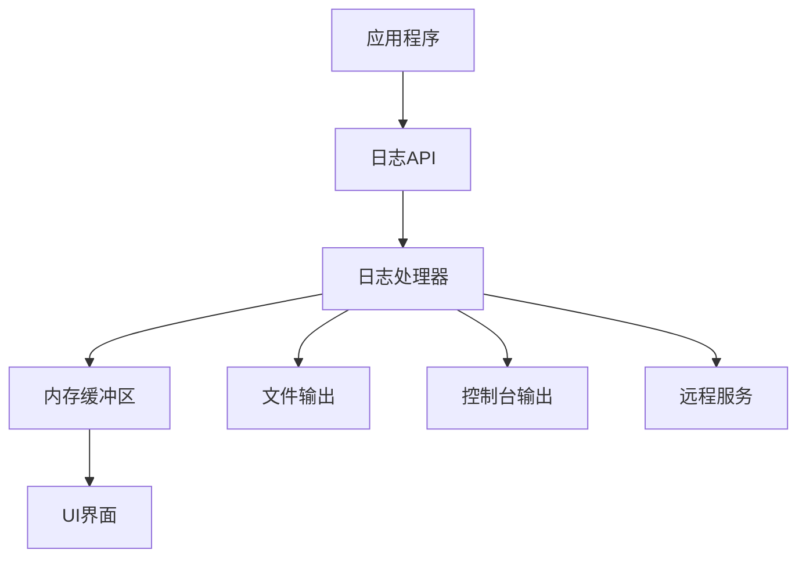
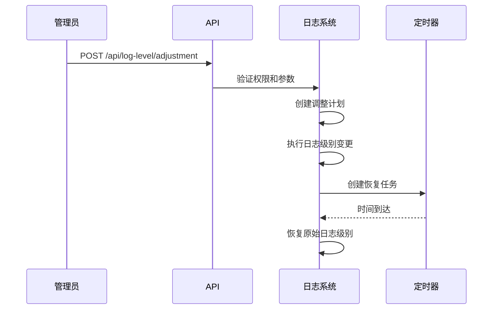
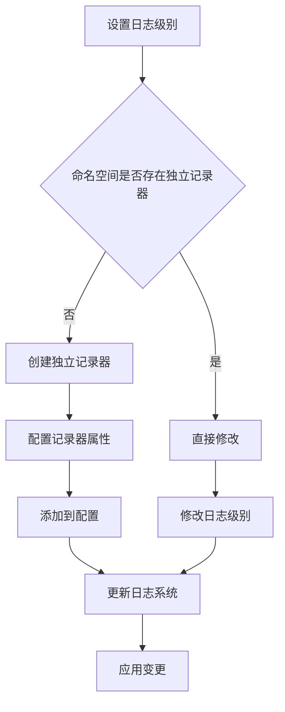

# 日志管理

<cite>
**本文档中引用的文件**  
- [api.clj](file://src/metabase/logger/api.clj)
- [core.clj](file://src/metabase/logger/core.clj)
- [init.clj](file://src/metabase/logger/init.clj)
- [log.clj](file://src/metabase/server/middleware/log.clj)
- [bootstrap.clj](file://src/metabase/core/bootstrap.clj)
- [log.clj](file://src/metabase/util/log.clj)
</cite>

## 目录
1. [简介](#简介)
2. [日志架构设计](#日志架构设计)
3. [动态日志级别调整](#动态日志级别调整)
4. [命名空间级别的日志控制](#命名空间级别的日志控制)
5. [日志格式化与输出目标](#日志格式化与输出目标)
6. [故障排查与日志分析](#故障排查与日志分析)
7. [性能影响与优化建议](#性能影响与优化建议)
8. [总结](#总结)

## 简介
Metabase的日志系统基于Timbre日志框架构建，提供了强大的日志管理功能。该系统支持动态调整日志级别、命名空间级别的细粒度控制、多种输出目标配置等特性。通过POST /api/log-level/set接口，管理员可以临时调整特定命名空间的日志级别，便于故障排查和性能分析。日志系统还集成了异步日志写入机制，在高负载环境下仍能保持良好的性能表现。

**Section sources**
- [core.clj](file://src/metabase/logger/core.clj#L1-L32)
- [api.clj](file://src/metabase/logger/api.clj#L1-L43)

## 日志架构设计
Metabase日志系统采用分层架构设计，核心组件包括日志记录器、日志处理器和日志存储。系统使用Log4j2作为底层日志框架，并通过clojure.tools.logging进行封装。在系统启动时，通过metabase.core.bootstrap配置日志上下文选择器为BasicContextSelector，确保整个应用使用单一的LoggerContext实例。

日志系统在内存中维护一个环形缓冲区（ring buffer），默认存储250条日志记录，用于在UI界面中显示实时日志。同时，系统支持多种输出目标，包括控制台、文件和远程服务。日志记录包含时间戳、日志级别、命名空间、消息内容和异常堆栈等信息。

**Diagram sources**
- [core.clj](file://src/metabase/logger/core.clj#L1-L32)
- [bootstrap.clj](file://src/metabase/core/bootstrap.clj#L1-L36)

**Section sources**
- [core.clj](file://src/metabase/logger/core.clj#L1-L32)
- [bootstrap.clj](file://src/metabase/core/bootstrap.clj#L1-L36)

## 动态日志级别调整
Metabase提供REST API接口用于动态调整日志级别，允许管理员在不重启服务的情况下临时修改日志输出的详细程度。主要接口包括：

- **POST /api/log-level/adjustment**: 临时调整指定命名空间的日志级别
- **DELETE /api/log-level/adjustment**: 撤销日志级别调整，恢复到原始配置

通过POST /api/log-level/adjustment接口，可以设置日志级别调整的持续时间和目标级别。系统使用ScheduledThreadPoolExecutor来管理定时任务，在指定时间后自动恢复原始日志级别。此功能需要超级用户权限才能执行。

**Diagram sources**
- [api.clj](file://src/metabase/logger/api.clj#L182-L234)
- [core.clj](file://src/metabase/logger/core.clj#L266-L278)

**Section sources**
- [api.clj](file://src/metabase/logger/api.clj#L182-L234)
- [core.clj](file://src/metabase/logger/core.clj#L266-L278)

## 命名空间级别的日志控制
Metabase支持基于命名空间的细粒度日志控制，允许对不同模块设置不同的日志级别。每个命名空间可以拥有独立的日志记录器，通过LoggerConfig进行配置。系统提供预设的日志配置，如同步问题排查、链式过滤器排查和序列化排查等。

日志级别从低到高依次为：off、fatal、error、warn、info、debug、trace。通过ensure-unique-logger!函数确保命名空间拥有独立的日志记录器，避免影响其他模块。set-ns-log-level!函数用于设置指定命名空间的日志级别，remove-ns-logger!函数用于移除自定义的日志记录器。

**Diagram sources**
- [core.clj](file://src/metabase/logger/core.clj#L203-L229)
- [api.clj](file://src/metabase/logger/api.clj#L101-L146)

**Section sources**
- [core.clj](file://src/metabase/logger/core.clj#L203-L229)
- [api.clj](file://src/metabase/logger/api.clj#L101-L146)

## 日志格式化与输出目标
Metabase日志系统支持多种输出目标和格式化策略。日志记录包含时间戳、日志级别、命名空间、消息内容和异常堆栈等字段。时间戳采用ISO 8601格式，便于日志分析和时间序列处理。

系统支持以下输出目标：
- **控制台输出**: 用于开发和调试环境
- **文件输出**: 支持滚动文件和归档
- **内存缓冲区**: 用于UI界面实时显示
- **远程服务**: 支持发送到集中式日志系统

日志格式化通过Layout组件实现，支持JSON、文本等多种格式。对于异常信息，系统会截取前20帧堆栈信息，并对长字符串进行截断处理，避免日志文件过大。

**Section sources**
- [core.clj](file://src/metabase/logger/core.clj#L96-L137)
- [log.clj](file://src/metabase/util/log.clj#L1-L349)

## 故障排查与日志分析
Metabase日志系统为常见故障提供了详细的日志分析示例。对于查询超时场景，系统会记录查询开始和结束时间、执行时长、数据库调用次数等性能信息。对于认证失败场景，日志会记录详细的错误原因，如用户名或密码错误、账户禁用等。

通过日志上下文（ThreadContext）功能，可以为日志记录添加额外的上下文信息，如请求ID、用户ID等，便于追踪特定请求的完整处理流程。with-context宏允许在代码块中设置上下文信息，这些信息会自动包含在该代码块产生的所有日志记录中。

**Section sources**
- [log.clj](file://src/metabase/server/middleware/log.clj#L31-L60)
- [util.clj](file://src/metabase/driver/util.clj#L58-L91)

## 性能影响与优化建议
在高负载环境下，日志系统可能成为性能瓶颈。Metabase通过异步日志写入和内存缓冲区等机制优化性能。建议在生产环境中采用以下优化策略：

1. **异步日志写入**: 将日志写入操作放入独立线程，避免阻塞主业务逻辑
2. **合理设置日志级别**: 生产环境建议使用INFO级别，避免DEBUG级别产生过多日志
3. **日志轮转策略**: 配置日志文件轮转和归档，防止磁盘空间耗尽
4. **集中式日志管理**: 将日志发送到ELK等集中式日志系统，便于分析和监控

对于性能敏感的场景，可以使用with-no-logs宏临时关闭日志输出，或使用性能分析工具定位日志相关的性能瓶颈。

**Section sources**
- [core.clj](file://src/metabase/logger/core.clj#L135-L166)
- [log.clj](file://src/metabase/util/log.clj#L1-L349)

## 总结
Metabase的日志系统提供了全面的日志管理功能，支持动态调整、细粒度控制和多种输出目标。通过合理的配置和优化，可以在保证故障排查能力的同时，最大限度地减少对系统性能的影响。建议管理员根据实际需求配置日志级别，并定期审查日志策略，确保系统稳定运行。