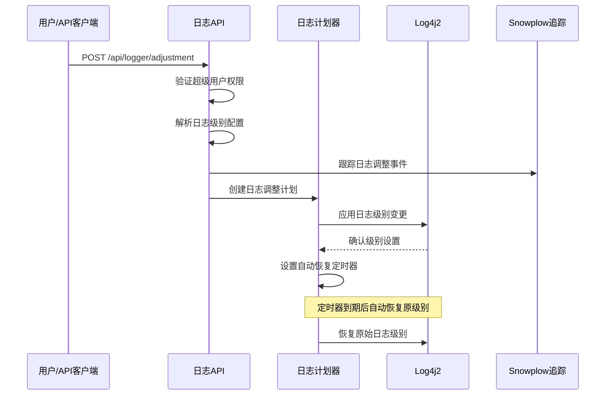
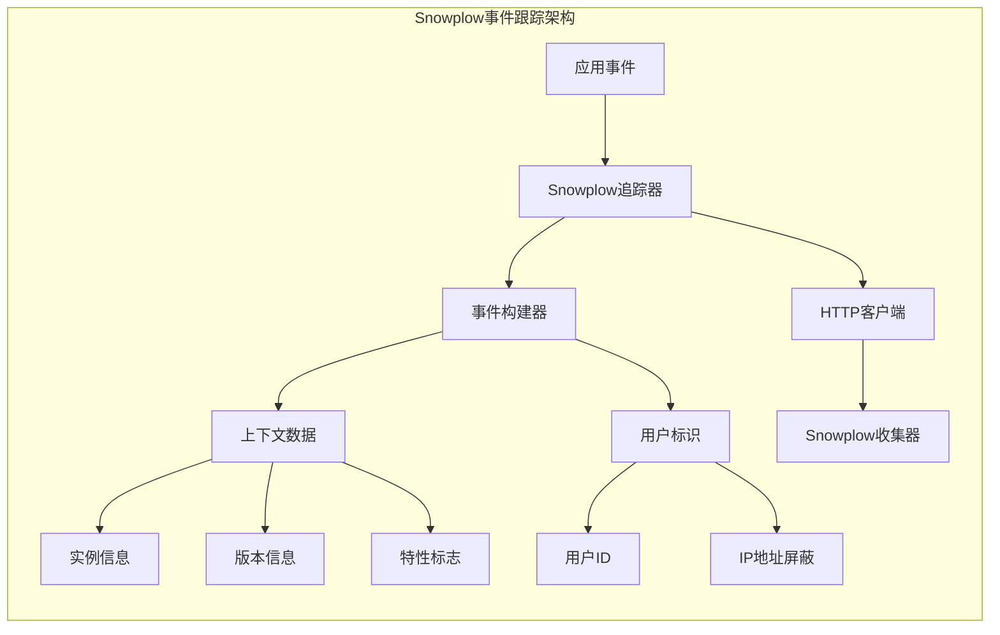
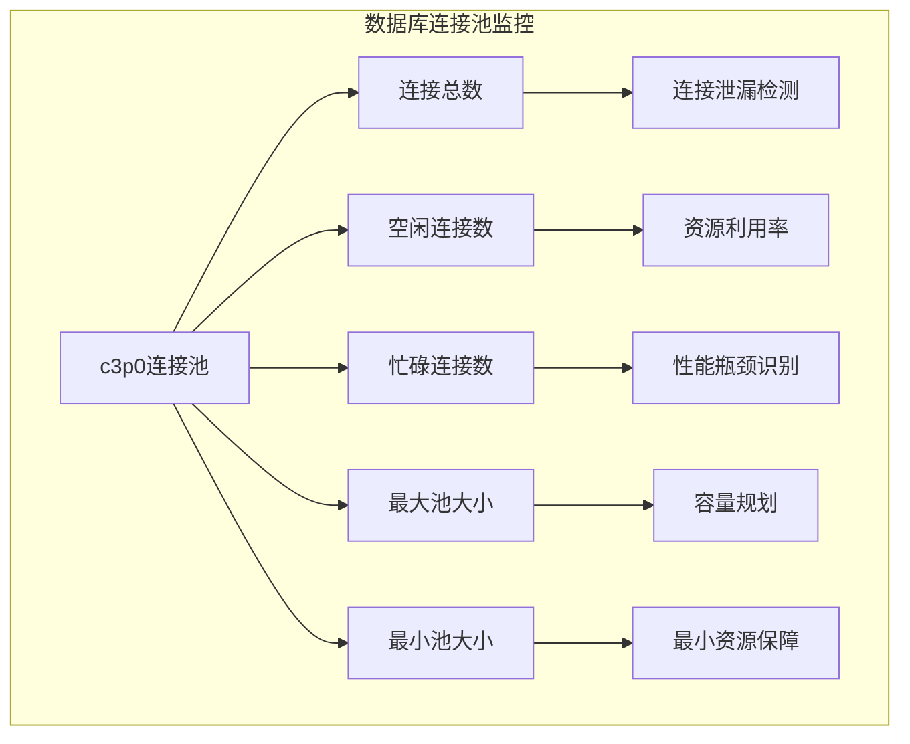

# 监控与告警

<cite>
**本文档中引用的文件**
- [prometheus.clj](file://src/metabase/analytics/prometheus.clj)
- [snowplow.clj](file://src/metabase/analytics/snowplow.clj)
- [settings.clj](file://src/metabase/analytics/settings.clj)
- [logger/api.clj](file://src/metabase/logger/api.clj)
- [logger/core.clj](file://src/metabase/logger/core.clj)
- [statistics_handler.clj](file://src/metabase/server/statistics_handler.clj)
- [bootstrap.clj](file://src/metabase/core/bootstrap.clj)
- [instance.clj](file://src/metabase/server/instance.clj)
</cite>

## 目录
1. [简介](#简介)
2. [Prometheus指标收集机制](#prometheus指标收集机制)
3. [日志记录架构](#日志记录架构)
4. [Snowplow事件跟踪](#snowplow事件跟踪)
5. [监控指标详解](#监控指标详解)
6. [告警规则配置](#告警规则配置)
7. [最佳实践](#最佳实践)
8. [故障排除](#故障排除)

## 简介

Metabase提供了全面的监控与告警系统，通过多种技术手段确保系统的可观测性和稳定性。该系统包含三个核心组件：Prometheus指标收集、日志记录管理和Snowplow事件跟踪，为运维人员提供了全方位的系统监控能力。

## Prometheus指标收集机制

### 架构概述

Metabase的Prometheus集成采用模块化设计，支持JVM指标、Jetty服务器指标和自定义业务指标的统一收集和暴露。

```mermaid
graph TB
subgraph "Prometheus监控架构"
A[应用启动] --> B[指标注册器]
B --> C[JVM指标收集器]
B --> D[Jetty指标收集器]
B --> E[产品指标收集器]
B --> F[Quartz指标收集器]
C --> G[垃圾回收指标]
C --> H[内存池指标]
C --> I[线程指标]
C --> J[分配速率指标]
D --> K[请求总数]
D --> L[活跃请求数]
D --> M[响应时间]
D --> N[异步请求]
E --> O[查询执行指标]
E --> P[通知发送指标]
E --> Q[搜索索引指标]
B --> R[Web服务器]
R --> S[/metrics端点]
end
```

**图表来源**
- [prometheus.clj](file://src/metabase/analytics/prometheus.clj#L526-L551)
- [statistics_handler.clj](file://src/metabase/server/statistics_handler.clj#L87-L109)

### JVM指标收集

#### 垃圾回收指标
- **metabase_application/jvm_gc**: JVM垃圾回收器统计信息
- **metabase_application/jvm_hiccups**: 系统暂停持续时间（毫秒）
- **metabase_application/jvm_allocation_rate**: 堆分配速率（字节/秒）

#### 内存池指标
- **metabase_application/jvm_memory_pools**: 各内存池使用情况
- **metabase_application/jvm_standard**: 标准JVM指标

#### 线程指标
- **metabase_application/jvm_threads**: 线程池状态信息

### Jetty服务器指标

#### 请求指标
- **jetty/requests-total**: 总请求数
- **jetty/requests-active**: 当前活跃请求数
- **jetty/requests-max**: 历史最大并发请求数
- **jetty/request-time-max-seconds**: 最大请求处理时间
- **jetty/request-time-seconds-total**: 总请求处理时间

#### 分发指标
- **jetty/dispatched-total**: 总分发请求数
- **jetty/dispatched-active**: 当前活跃分发数
- **jetty/dispatched-active-max**: 历史最大分发数
- **jetty/dispatched-time-max**: 最大分发时间
- **jetty/dispatched-time-seconds-total**: 总分发时间

#### 异步请求指标
- **jetty/async-requests-total**: 总异步请求数
- **jetty/async-requests-waiting**: 当前等待异步请求数
- **jetty/async-requests-waiting-max**: 历史最大等待异步请求数
- **jetty/async-dispatches-total**: 总异步分发数
- **jetty/expires-total**: 过期异请求数

#### 响应指标
- **jetty/responses-total**: 总响应数（按状态码分组）
- **jetty/responses-bytes-total**: 总响应字节数

### 自定义业务指标

#### 数据库连接池指标
- **metabase_database/c3p0_num_connections**: 当前连接数
- **metabase_database/c3p0_num_idle_connections**: 空闲连接数
- **metabase_database/c3p0_num_busy_connections**: 忙碌连接数
- **metabase_database/c3p0_max_pool_size**: 最大连接池大小
- **metabase_database/c3p0_min_pool_size**: 最小连接池大小

#### 查询处理器指标
- **metabase-query-processor/query**: 查询执行状态统计
- **metabase-query-processor/metrics-adjust**: 指标调整中间件处理次数
- **metabase-query-processor/metrics-adjust-errors**: 指标调整错误次数

#### 通知系统指标
- **metabase-notification/send-ok**: 成功发送的通知数
- **metabase-notification/send-error**: 发送失败的通知数
- **metabase-notification/concurrent-tasks**: 并发任务数
- **metabase-notification/wait-duration-ms**: 队列等待时间
- **metabase-notification/send-duration-ms**: 发送持续时间
- **metabase-notification/total-duration-ms**: 总处理时间

#### 搜索系统指标
- **metabase-search/index-updates**: 索引更新次数
- **metabase-search/index-error**: 索引错误次数
- **metabase-search/response-ok**: 搜索成功响应数
- **metabase-search/response-error**: 搜索错误响应数
- **metabase-search/semantic-search-ms**: 语义搜索总耗时

### 配置与访问

#### 端口配置
通过环境变量 `MB_PROMETHEUS_SERVER_PORT` 配置指标暴露端口：

```bash
export MB_PROMETHEUS_SERVER_PORT=9091
```

#### 访问端点
- **指标端点**: `http://localhost:<port>/metrics`
- **健康检查**: `/metrics` 端点返回200状态码表示服务正常

#### 集成到现有监控系统
1. **Prometheus抓取配置**：
```yaml
scrape_configs:
  - job_name: 'metabase'
    static_configs:
      - targets: ['localhost:9091']
    scrape_interval: 15s
```

2. **Grafana仪表板**：
   - 创建新的数据源指向Metabase指标端点
   - 导入预定义的仪表板模板或自定义查询

**章节来源**
- [prometheus.clj](file://src/metabase/analytics/prometheus.clj#L550-L584)
- [settings.clj](file://src/metabase/analytics/settings.clj#L10-L25)

## 日志记录架构

### 动态日志级别管理

Metabase提供了强大的动态日志级别调整功能，允许运维人员在运行时临时修改日志级别而无需重启服务。



**图表来源**
- [logger/api.clj](file://src/metabase/logger/api.clj#L182-L235)
- [logger/core.clj](file://src/metabase/logger/core.clj#L266-L278)

### 日志级别控制API

#### 获取日志配置
```http
GET /api/logger/logs
Authorization: Bearer <token>
```

#### 设置日志级别
```http
POST /api/logger/adjustment
Content-Type: application/json
Authorization: Bearer <token>

{
  "duration": 3600,
  "duration_unit": "seconds",
  "log_levels": {
    "metabase.query-processor": "debug",
    "metabase.sync": "info"
  }
}
```

#### 重置日志级别
```http
DELETE /api/logger/adjustment
Authorization: Bearer <token>
```

### 命名空间级别的日志控制

#### 支持的日志级别
从最不详细到最详细的顺序：
- `:off` - 关闭所有日志
- `:fatal` - 致命错误
- `:error` - 错误
- `:warn` - 警告
- `:info` - 信息（默认）
- `:debug` - 调试
- `:trace` - 跟踪

#### 日志级别预设
- **同步问题排查**: `:sync` 预设，启用调试级别日志
- **链接过滤器排查**: `:linkedfilters` 预设
- **序列化排查**: `:serialization` 预设

### 日志存储与检索

#### 内存缓冲区
- 最大保留250条日志消息
- 使用环形缓冲区实现高效存储
- 支持按时间戳排序检索

#### 日志格式
```clojure
{:timestamp "2024-01-01T12:00:00Z"
 :level :info
 :fqns "metabase.query-processor"
 :msg "Query executed successfully"
 :exception nil
 :process_uuid "abc123"}
```

**章节来源**
- [logger/api.clj](file://src/metabase/logger/api.clj#L182-L235)
- [logger/core.clj](file://src/metabase/logger/core.clj#L266-L278)

## Snowplow事件跟踪

### 架构概述

Snowplow集成提供了匿名使用数据分析和系统行为跟踪功能，支持离线分析和实时监控。



**图表来源**
- [snowplow.clj](file://src/metabase/analytics/snowplow.clj#L86-L118)

### 配置选项

#### 匿名跟踪启用
```clojure
;; 在配置文件中启用匿名跟踪
:anon-tracking-enabled true
```

#### Snowplow收集器URL
```clojure
;; 生产环境默认值
:snowplow-url "https://sp.metabase.com"

;; 开发环境默认值
:snowplow-url "http://localhost:9090"
```

#### 可用性检测
```clojure
;; 检查Snowplow收集器是否可用
(snowplow-available?) ;; 返回布尔值
```

### 事件类型

#### 实例统计事件
- **schema**: `:snowplow/instance_stats`
- **用途**: 发送完整的实例统计数据
- **包含内容**: 用户数量、查询统计、数据库类型等

#### 简单事件
- **schema**: `:snowplow/simple_event`
- **用途**: 通用事件跟踪
- **示例**: 日志级别调整、实例创建等

#### 特定功能事件
- **dashboard**: 仪表板相关操作
- **database**: 数据库连接状态
- **csvupload**: CSV上传统计
- **search**: 搜索功能使用情况
- **notification**: 通知系统状态

### 事件数据结构

#### 上下文信息
```clojure
{
  "id"                           (analytics-uuid)
  "version"                      {"tag" (:tag (version/version))}
  "token_features"               (token-features)
  "created_at"                   (instance-creation)
  "application_database"         (app-db-type)
  "application_database_version" (app-db-version)
}
```

#### 用户标识
- 使用用户ID进行事件关联
- IP地址自动屏蔽为`127.0.0.1`
- 支持匿名事件跟踪

**章节来源**
- [snowplow.clj](file://src/metabase/analytics/snowplow.clj#L147-L160)
- [settings.clj](file://src/metabase/analytics/settings.clj#L28-L63)

## 监控指标详解

### 关键性能指标

#### JVM健康状况指标
| 指标名称 | 类型 | 描述 | 正常范围 |
|---------|------|------|----------|
| `metabase_application/jvm_gc` | Counter | 垃圾回收次数 | 持续增长 |
| `metabase_application/jvm_hiccups` | Histogram | 系统暂停时间（ms） | < 100ms |
| `metabase_application/jvm_allocation_rate` | Gauge | 堆分配速率（B/s） | < 100MB/s |
| `metabase_application/jvm_memory_pools` | Gauge | 内存池使用率 | < 85% |

#### Jetty服务器性能指标
| 指标名称 | 类型 | 描述 | 监控阈值 |
|---------|------|------|----------|
| `jetty/requests-active` | Gauge | 当前活跃请求数 | < CPU核心数×2 |
| `jetty/requests-max` | Gauge | 历史最大并发数 | 监控趋势 |
| `jetty/request-time-max-seconds` | Gauge | 最大请求处理时间 | < 5秒 |
| `jetty/responses-bytes-total` | Counter | 总响应字节数 | 监控流量趋势 |

#### 业务功能指标
| 指标名称 | 类型 | 描述 | 关键性 |
|---------|------|------|--------|
| `metabase-query-processor/query` | Counter | 查询执行统计 | 高 |
| `metabase-notification/send-ok` | Counter | 成功通知数 | 高 |
| `metabase-search/response-ok` | Counter | 搜索成功响应 | 中 |
| `metabase-csv-upload/failed` | Counter | CSV上传失败数 | 中 |

### 数据库连接池监控

#### 连接池健康指标


**图表来源**
- [prometheus.clj](file://src/metabase/analytics/prometheus.clj#L80-L120)

#### 连接池优化建议
- **连接数监控**: 监控 `c3p0_num_connections` 和 `c3p0_num_busy_connections`
- **连接泄漏检测**: 关注长时间未释放的连接
- **池大小调优**: 根据负载调整 `c3p0_max_pool_size` 和 `c3p0_min_pool_size`

**章节来源**
- [prometheus.clj](file://src/metabase/analytics/prometheus.clj#L80-L120)

## 告警规则配置

### Prometheus告警规则示例

#### JVM健康告警
```yaml
groups:
- name: metabase.jvm
  rules:
  - alert: HighGCPressure
    expr: increase(metabase_application/jvm_gc[5m]) > 10
    for: 2m
    labels:
      severity: warning
    annotations:
      summary: "高GC压力"
      description: "过去5分钟内GC次数增加超过10次"
      
  - alert: HighMemoryUsage
    expr: rate(metabase_application/jvm_allocation_rate[5m]) > 100000000
    for: 5m
    labels:
      severity: critical
    annotations:
      summary: "高内存使用率"
      description: "堆分配速率超过100MB/s"
```

#### 服务器性能告警
```yaml
- name: metabase.server
  rules:
  - alert: HighRequestLatency
    expr: histogram_quantile(0.95, rate(jetty_request_time_seconds_bucket[5m])) > 5
    for: 3m
    labels:
      severity: warning
    annotations:
      summary: "高请求延迟"
      description: "95%分位数请求延迟超过5秒"
      
  - alert: HighActiveRequests
    expr: jetty_requests_active > 100
    for: 1m
    labels:
      severity: warning
    annotations:
      summary: "高活跃请求数"
      description: "当前活跃请求数超过100"
```

#### 业务功能告警
```yaml
- name: metabase.business
  rules:
  - alert: NotificationFailures
    expr: increase(metabase_notification_send_error[5m]) > 5
    for: 2m
    labels:
      severity: critical
    annotations:
      summary: "通知发送失败"
      description: "过去5分钟内通知发送失败超过5次"
      
  - alert: SearchPerformanceDegradation
    expr: increase(metabase_search_response_error[5m]) > 3
    for: 2m
    labels:
      severity: warning
    annotations:
      summary: "搜索性能退化"
      description: "搜索错误率显著上升"
```

### 告警通知配置

#### Slack通知
```yaml
receivers:
- name: 'slack-notifications'
  slack_configs:
  - api_url: 'https://hooks.slack.com/services/YOUR/SLACK/WEBHOOK'
    channel: '#metabase-alerts'
    title: '{{ .GroupLabels.alertname }}'
    text: '{{ .Annotations.summary }}\n{{ .Annotations.description }}'
```

#### 邮件通知
```yaml
- name: 'email-notifications'
  email_configs:
  - to: 'ops@company.com'
    subject: '[Metabase Alert] {{ .GroupLabels.alertname }}'
    body: |
      Alert: {{ .GroupLabels.alertname }}
      Description: {{ .Annotations.description }}
      Severity: {{ .GroupLabels.severity }}
      Timestamp: {{ .StartsAt }}
```

## 最佳实践

### 监控部署策略

#### 分层监控架构
1. **基础设施层**: 监控服务器资源使用情况
2. **应用层**: 监控JVM指标和应用性能
3. **业务层**: 监控关键业务指标和用户体验

#### 监控数据保留策略
- **短期存储**: 7天内的高精度指标数据
- **中期存储**: 30天内的聚合指标数据
- **长期存储**: 1年的审计和分析数据

### 性能优化建议

#### JVM调优
```bash
# 推荐JVM参数
-Xms2g -Xmx8g
-XX:+UseG1GC
-XX:MaxGCPauseMillis=200
-XX:+UnlockExperimentalVMOptions
-XX:+UseJVMCICompiler
```

#### 连接池优化
```yaml
# c3p0连接池配置
maxPoolSize: 20
minPoolSize: 5
acquireIncrement: 5
idleConnectionTestPeriod: 300
maxIdleTime: 600
```

### 故障预防措施

#### 自动化运维
- **健康检查**: 定期检查关键指标
- **自动恢复**: 实现自动故障转移
- **容量预测**: 基于历史数据预测资源需求

#### 文档化
- **监控仪表板**: 维护最新的监控界面
- **告警规则**: 记录告警规则的业务背景
- **故障处理**: 建立标准化的故障处理流程

## 故障排除

### 常见问题诊断

#### 指标缺失问题
**症状**: `/metrics` 端点无响应或指标不显示

**排查步骤**:
1. 检查 `MB_PROMETHEUS_SERVER_PORT` 环境变量设置
2. 验证Prometheus系统是否正确初始化
3. 查看应用启动日志中的Prometheus相关消息

**解决方案**:
```bash
# 检查环境变量
echo $MB_PROMETHEUS_SERVER_PORT

# 重启应用以重新初始化Prometheus
kill -9 $(pgrep -f metabase)
```

#### 日志级别调整失效
**症状**: 通过API调整日志级别后未生效

**排查步骤**:
1. 验证API权限和认证
2. 检查日志级别配置格式
3. 查看Log4j2配置文件冲突

**解决方案**:
```bash
# 检查当前日志级别
curl -X GET "http://localhost:3000/api/logger/logs" \
     -H "Authorization: Bearer <token>"

# 手动重置日志配置
curl -X DELETE "http://localhost:3000/api/logger/adjustment" \
     -H "Authorization: Bearer <token>"
```

#### Snowplow事件丢失
**症状**: 期望的事件未发送到Snowplow收集器

**排查步骤**:
1. 检查匿名跟踪是否启用
2. 验证Snowplow收集器可用性
3. 查看事件发送日志

**解决方案**:
```clojure
;; 检查Snowplow配置
(analytics.settings/anon-tracking-enabled)
(analytics.settings/snowplow-available?)
(analytics.settings/snowplow-enabled)

;; 手动触发测试事件
(snowplow/track-event! :snowplow/simple_event {:event "test_event"})
```

### 性能问题诊断

#### 内存泄漏检测
```bash
# 监控内存使用趋势
watch -n 5 'jstat -gc <pid>'

# 检查堆转储
jmap -dump:format=b,file=heap.hprof <pid>
```

#### CPU性能分析
```bash
# 监控CPU使用率
top -p <pid>

# 生成火焰图
jstack <pid> > thread_dump.txt
```

### 监控系统维护

#### 清理过期数据
```sql
-- 清理过期的日志数据
DELETE FROM log_events WHERE timestamp < NOW() - INTERVAL '30 days';

-- 优化监控数据库
VACUUM ANALYZE;
```

#### 监控系统升级
1. **备份现有配置**: 备份Prometheus、Grafana配置
2. **测试新版本**: 在测试环境中验证兼容性
3. **逐步迁移**: 分阶段升级监控组件
4. **回滚准备**: 准备快速回滚方案

**章节来源**
- [prometheus.clj](file://src/metabase/analytics/prometheus.clj#L583-L620)
- [logger/api.clj](file://src/metabase/logger/api.clj#L223-L234)