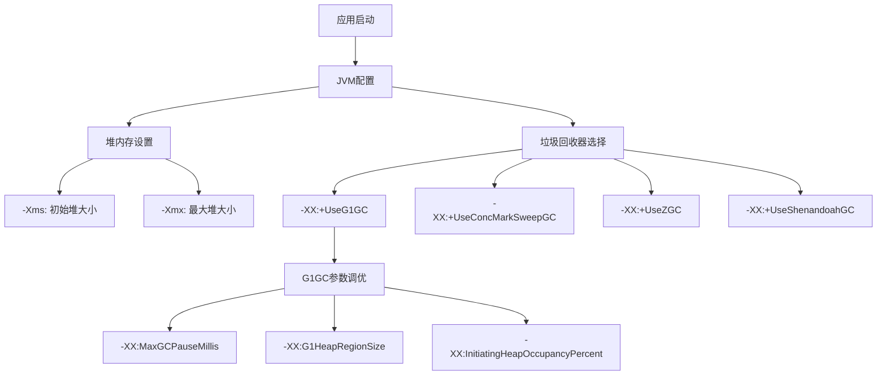
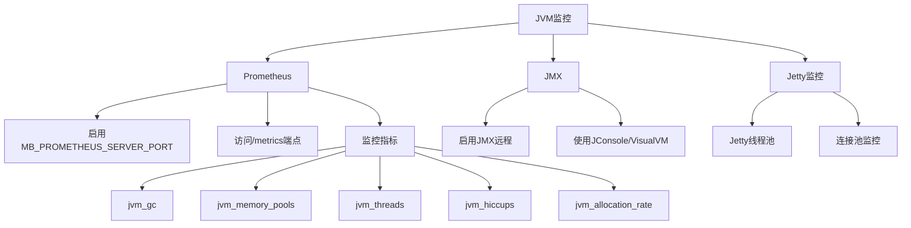
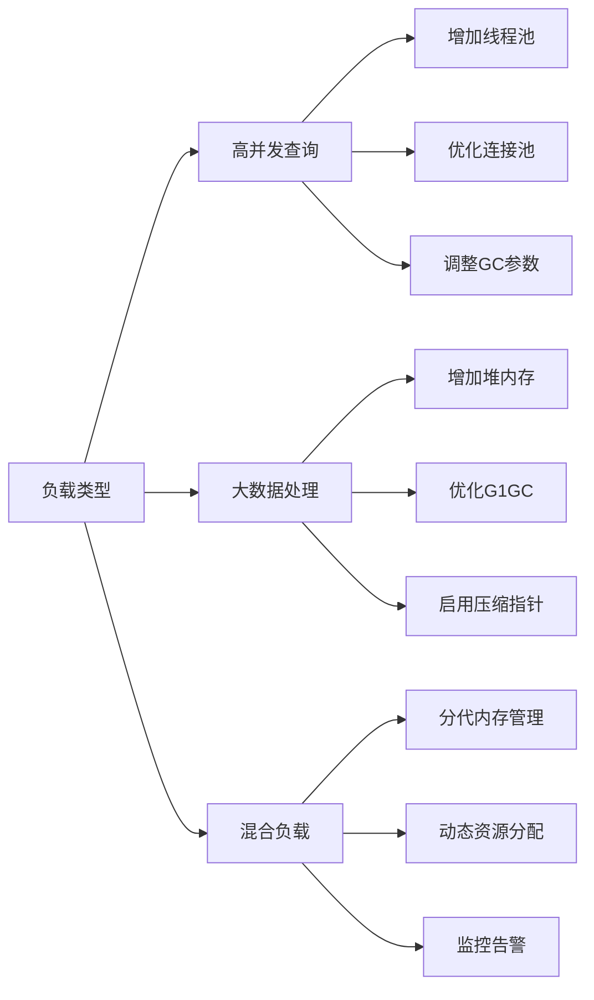
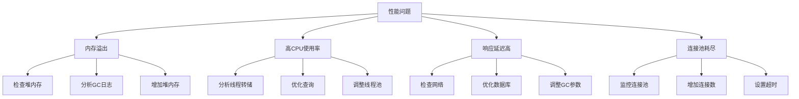

# JVM调优

<cite>
**本文档中引用的文件**  
- [prometheus.clj](file://src/metabase/analytics/prometheus.clj)
- [memory.clj](file://src/metabase/util/memory.clj)
- [jvm.clj](file://src/metabase/util/jvm.clj)
- [core.clj](file://src/metabase/core/core.clj)
- [instance.clj](file://src/metabase/server/instance.clj)
- [config.clj](file://src/metabase/config/core.clj)
- [other-env-vars.md](file://src/metabase/cmd/resources/other-env-vars.md)
</cite>

## 目录
1. [引言](#引言)
2. [堆内存配置](#堆内存配置)
3. [垃圾回收器选择](#垃圾回收器选择)
4. [JVM性能监控](#jvm性能监控)
5. [不同负载场景下的调优建议](#不同负载场景下的调优建议)
6. [服务器启动逻辑与JVM参数](#服务器启动逻辑与jvm参数)
7. [常见性能问题诊断](#常见性能问题诊断)
8. [结论](#结论)

## 引言
Metabase是一个基于JVM的开源商业智能平台，其性能和稳定性在很大程度上取决于JVM的配置和调优。本指南旨在为Metabase用户提供全面的JVM调优指导，重点关注堆内存配置、垃圾回收器选择、性能监控以及不同负载场景下的调优策略。通过合理配置JVM参数，可以显著提升Metabase在高并发查询和大数据集处理场景下的性能表现。

**Section sources**
- [core.clj](file://src/metabase/core/core.clj#L125-L236)
- [instance.clj](file://src/metabase/server/instance.clj#L32-L61)

## 堆内存配置
堆内存是JVM中用于存储对象实例的内存区域，其大小直接影响Metabase的性能和稳定性。合理的堆内存配置需要平衡内存使用效率和垃圾回收开销。

### 初始堆大小（-Xms）和最大堆大小（-Xmx）
- **-Xms**：设置JVM启动时的初始堆大小
- **-Xmx**：设置JVM堆内存的最大值

在Metabase中，建议将-Xms和-Xmx设置为相同的值，以避免运行时堆内存动态调整带来的性能波动。根据应用负载和可用系统内存，通常建议：

- 小型部署：2-4GB
- 中型部署：8-16GB  
- 大型部署：32GB或更高

### 内存使用监控
Metabase提供了内存使用情况的监控功能，可以通过以下代码获取当前内存使用信息：

```clojure
(defn pretty-usage-str
  "Return pretty string with memory usage."
  []
  (let [free (free-memory)
        total (total-memory)]
    (format "free: %.2fG, total: %.2fG, ratio: %.2f"
            (/ free 1e9)
            (/ total 1e9)
            (double (/ free total)))))
```

该函数返回格式化的内存使用字符串，包括空闲内存、总内存和使用率。

**Section sources**
- [memory.clj](file://src/metabase/util/memory.clj#L0-L22)
- [config.clj](file://src/metabase/config/core.clj#L38-L89)

## 垃圾回收器选择
垃圾回收器的选择对Metabase的性能有重要影响。不同的垃圾回收器适用于不同的应用场景。

### G1GC（Garbage-First Garbage Collector）
G1GC是Java 9及更高版本的默认垃圾回收器，特别适合大内存应用。它将堆内存划分为多个区域（Region），能够预测性地控制垃圾回收暂停时间。

#### G1GC主要参数
- **-XX:+UseG1GC**：启用G1垃圾回收器
- **-XX:MaxGCPauseMillis**：设置最大GC暂停时间目标
- **-XX:G1HeapRegionSize**：设置堆区域大小
- **-XX:InitiatingHeapOccupancyPercent**：设置触发并发GC周期的堆占用百分比

### 其他垃圾回收器
- **CMS（Concurrent Mark-Sweep）**：适用于需要低延迟的应用，但在Java 9中已标记为废弃
- **ZGC**：超低延迟垃圾回收器，适合需要极低暂停时间的大内存应用
- **Shenandoah**：与ZGC类似，提供低延迟垃圾回收

对于Metabase，推荐使用G1GC，因为它在大内存场景下表现良好，且能够有效控制GC暂停时间。



**Diagram sources**
- [jvm.clj](file://src/metabase/util/jvm.clj#L0-L360)
- [config.clj](file://src/metabase/config/core.clj#L62-L89)

**Section sources**
- [jvm.clj](file://src/metabase/util/jvm.clj#L0-L360)
- [config.clj](file://src/metabase/config/core.clj#L62-L89)

## JVM性能监控
有效的性能监控是JVM调优的基础。Metabase提供了多种监控选项，帮助管理员了解应用的运行状态。

### Prometheus监控
Metabase内置了Prometheus监控支持，可以通过设置`MB_PROMETHEUS_SERVER_PORT`环境变量来启用。

#### 启用Prometheus监控
```bash
export MB_PROMETHEUS_SERVER_PORT=9090
java -jar metabase.jar
```

启用后，可以在`http://localhost:9090/metrics`访问监控数据。

#### 监控指标
Metabase通过Prometheus暴露了丰富的JVM监控指标：

- **jvm_gc**：垃圾回收相关指标
- **jvm_memory_pools**：内存池使用情况
- **jvm_threads**：线程使用情况
- **jvm_hiccups**：系统暂停持续时间
- **jvm_allocation_rate**：堆分配速率

```clojure
(defn- jvm-collectors
  "JVM collectors. Essentially duplicating [[iapetos.collector.jvm]] namespace so we can set our own namespaces rather
  than \"iapetos_internal\""
  []
  [(collector/named {:namespace "metabase_application"
                     :name      "jvm_gc"}
                    (GarbageCollectorExports.))
   (collector/named {:namespace "metabase_application"
                     :name      "jvm_standard"}
                    (StandardExports.))
   (collector/named {:namespace "metabase_application"
                     :name      "jvm_memory_pools"}
                    (MemoryPoolsExports.))
   (collector/named {:namespace "metabase_application"
                     :name      "jvm_threads"}
                    (ThreadExports.))
   (prometheus/histogram :metabase_application/jvm_hiccups
                         {:description "Duration in milliseconds of system-induced pauses."})
   (prometheus/gauge :metabase_application/jvm_allocation_rate
                     {:description "Heap allocation rate in bytes/sec."})])
```

### JMX监控
Java Management Extensions (JMX)提供了标准的JVM监控接口。可以通过JConsole或VisualVM连接到Metabase进程进行监控。

#### 启用JMX远程监控
```bash
java -Dcom.sun.management.jmxremote \
     -Dcom.sun.management.jmxremote.port=9999 \
     -Dcom.sun.management.jmxremote.authenticate=false \
     -Dcom.sun.management.jmxremote.ssl=false \
     -jar metabase.jar
```

### Jetty线程监控
Metabase使用Jetty作为嵌入式Web服务器，其线程池配置对性能有重要影响。

```clojure
(mu/defn- jetty-config :- :map
  []
  (cond-> (m/filter-vals
           some?
           {:port          (config/config-int :mb-jetty-port)
            :host          (config/config-str :mb-jetty-host)
            :max-threads   (config/config-int :mb-jetty-maxthreads)
            :min-threads   (config/config-int :mb-jetty-minthreads)
            :max-queued    (config/config-int :mb-jetty-maxqueued)
            :max-idle-time (config/config-int :mb-jetty-maxidletime)
            :send-server-version? false})
    (config/config-int :mb-jetty-request-header-size) (assoc :request-header-size (config/config-int
                                                                                   :mb-jetty-request-header-size))
    (config/config-str :mb-jetty-daemon) (assoc :daemon? (config/config-bool :mb-jetty-daemon))
    (config/config-str :mb-jetty-ssl)    (-> (assoc :ssl? true)
                                             (merge (jetty-ssl-config))))))
```

关键参数：
- **MB_JETTY_MAXTHREADS**：最大线程数，默认50
- **MB_JETTY_MINTHREADS**：最小线程数，默认8
- **MB_JETTY_MAXQUEUED**：最大排队请求数



**Diagram sources**
- [prometheus.clj](file://src/metabase/analytics/prometheus.clj#L0-L33)
- [instance.clj](file://src/metabase/server/instance.clj#L32-L61)

**Section sources**
- [prometheus.clj](file://src/metabase/analytics/prometheus.clj#L0-L584)
- [instance.clj](file://src/metabase/server/instance.clj#L32-L61)

## 不同负载场景下的调优建议
Metabase在不同负载场景下需要不同的JVM调优策略。

### 高并发查询环境
在高并发查询场景下，主要关注点是线程池和连接池的配置。

#### 调优建议
1. **增加Jetty线程池大小**
   ```bash
   export MB_JETTY_MAXTHREADS=100
   ```

2. **优化数据库连接池**
   - 增加最大连接数
   - 启用连接池监控
   - 设置合理的连接超时时间

3. **调整垃圾回收器参数**
   ```bash
   -XX:+UseG1GC
   -XX:MaxGCPauseMillis=200
   -XX:InitiatingHeapOccupancyPercent=45
   ```

4. **增加堆内存**
   ```bash
   -Xms8g -Xmx8g
   ```

### 大数据集处理场景
处理大数据集时，主要挑战是内存使用和垃圾回收效率。

#### 调优建议
1. **使用大内存配置**
   ```bash
   -Xms32g -Xmx32g
   ```

2. **优化G1GC参数**
   ```bash
   -XX:+UseG1GC
   -XX:G1HeapRegionSize=32m
   -XX:MaxGCPauseMillis=500
   ```

3. **启用压缩指针**
   ```bash
   -XX:+UseCompressedOops
   ```

4. **监控堆分配速率**
   使用Prometheus监控`jvm_allocation_rate`指标，了解内存分配模式。

### 混合负载场景
对于同时存在高并发和大数据处理的混合场景，需要平衡各种资源的使用。

#### 调优建议
1. **分代内存管理**
   - 为查询处理分配独立的线程池
   - 为大数据处理分配独立的内存区域

2. **动态资源分配**
   - 根据负载类型动态调整资源分配
   - 使用优先级队列管理不同类型的任务

3. **监控和告警**
   - 设置关键指标的监控和告警
   - 实现自动化的性能调优



**Section sources**
- [other-env-vars.md](file://src/metabase/cmd/resources/other-env-vars.md#L238-L301)
- [prometheus.clj](file://src/metabase/analytics/prometheus.clj#L168-L198)

## 服务器启动逻辑与JVM参数
Metabase的服务器启动逻辑与JVM参数密切相关，理解这一关系有助于更好地进行性能调优。

### 启动流程
1. **JVM初始化**
   - 加载JVM参数
   - 初始化堆内存
   - 启动垃圾回收器

2. **Metabase核心初始化**
   - 加载配置
   - 初始化数据库连接
   - 启动Web服务器

3. **服务启动**
   - 启动Jetty服务器
   - 注册路由
   - 开始监听请求

### 关键启动参数
- **MB_JETTY_PORT**：HTTP端口，默认3000
- **MB_JETTY_HOST**：监听地址
- **MB_JETTY_MAXTHREADS**：最大线程数
- **MB_JETTY_MINTHREADS**：最小线程数

### 环境变量优先级
Metabase的配置遵循以下优先级顺序：
1. 环境变量
2. JVM系统属性
3. 默认配置

```clojure
(defn config-str
  "Retrieve value for a single configuration key.  Accepts either a keyword or a string.

   We resolve properties from these places:

   1.  environment variables (ex: MB_DB_TYPE -> :mb-db-type)
   2.  jvm options (ex: -Dmb.db.type -> :mb-db-type)
   3.  hard coded `app-defaults`"
  [k]
  (let [k       (keyword k)
        env-val (k env/env)]
    (or (when-not (str/blank? env-val) env-val)
        (k app-defaults))))
```

### 启动性能优化
1. **预热JVM**
   - 在生产流量前进行预热
   - 让JIT编译器充分优化代码

2. **延迟初始化**
   - 延迟加载非关键组件
   - 优先启动核心服务

3. **资源预分配**
   - 预分配连接池
   - 预加载常用数据

**Section sources**
- [core.clj](file://src/metabase/core/core.clj#L151-L236)
- [config.clj](file://src/metabase/config/core.clj#L62-L89)

## 常见性能问题诊断
在Metabase运行过程中，可能会遇到各种性能问题。以下是常见问题的诊断方法和解决方案。

### 内存溢出（OutOfMemoryError）
#### 诊断方法
1. 检查堆内存使用情况
2. 分析GC日志
3. 使用内存分析工具（如VisualVM）

#### 解决方案
1. 增加堆内存
   ```bash
   -Xms8g -Xmx8g
   ```

2. 优化查询，减少内存使用
3. 调整垃圾回收器参数

### 高CPU使用率
#### 诊断方法
1. 使用JVM监控工具
2. 分析线程转储
3. 检查查询执行计划

#### 解决方案
1. 优化慢查询
2. 调整线程池大小
3. 检查是否有死循环或无限递归

### 响应延迟高
#### 诊断方法
1. 检查网络延迟
2. 分析数据库查询性能
3. 监控GC暂停时间

#### 解决方案
1. 优化数据库索引
2. 增加连接池大小
3. 调整G1GC参数以减少暂停时间

### 连接池耗尽
#### 诊断方法
1. 监控连接池使用情况
2. 检查连接泄漏
3. 分析查询执行时间

#### 解决方案
1. 增加最大连接数
2. 设置合理的连接超时
3. 优化长查询



**Diagram sources**
- [memory.clj](file://src/metabase/util/memory.clj#L0-L22)
- [prometheus.clj](file://src/metabase/analytics/prometheus.clj#L168-L198)

**Section sources**
- [memory.clj](file://src/metabase/util/memory.clj#L0-L22)
- [prometheus.clj](file://src/metabase/analytics/prometheus.clj#L168-L198)

## 结论
JVM调优是确保Metabase高性能和稳定运行的关键。通过合理配置堆内存、选择合适的垃圾回收器、实施有效的性能监控，并根据具体负载场景进行针对性调优，可以显著提升Metabase的性能表现。

关键要点：
1. **堆内存配置**：根据应用规模设置合适的-Xms和-Xmx值
2. **垃圾回收器选择**：推荐使用G1GC，特别是对于大内存应用
3. **性能监控**：充分利用Prometheus和JMX监控工具
4. **场景化调优**：针对高并发查询和大数据处理等不同场景采取不同的调优策略
5. **问题诊断**：建立完善的性能问题诊断和解决机制

通过持续监控和调优，可以确保Metabase在各种负载条件下都能提供稳定可靠的服务。