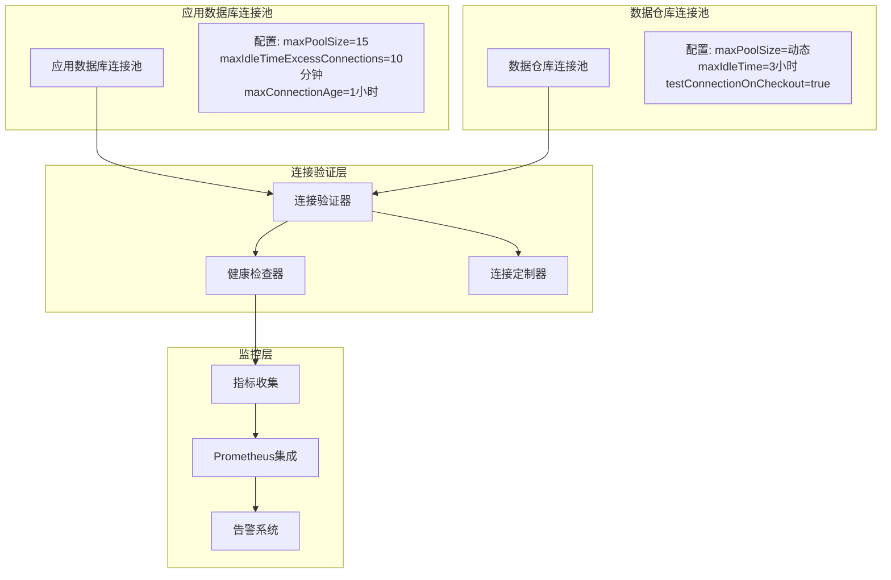
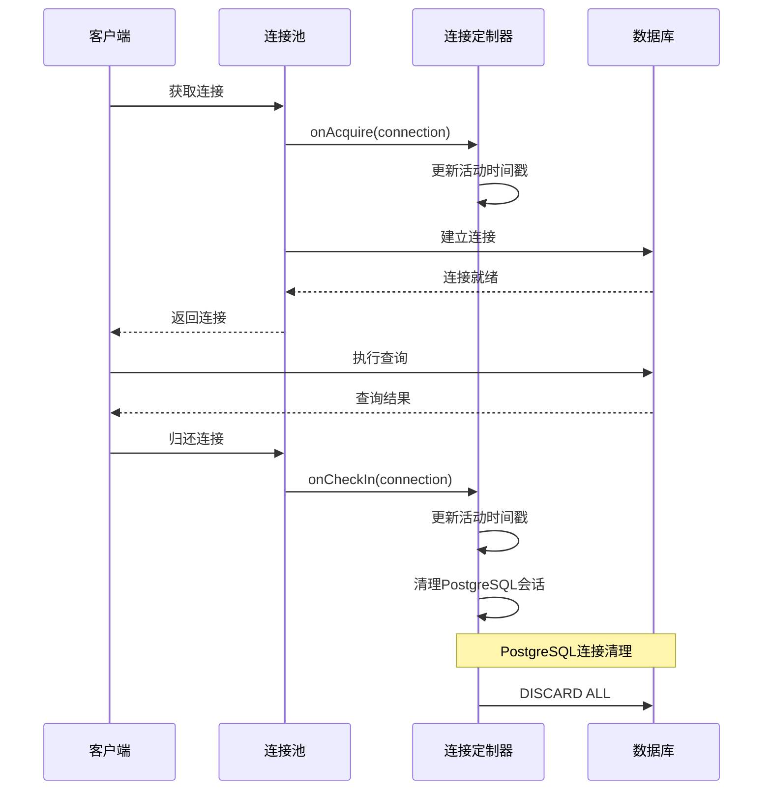
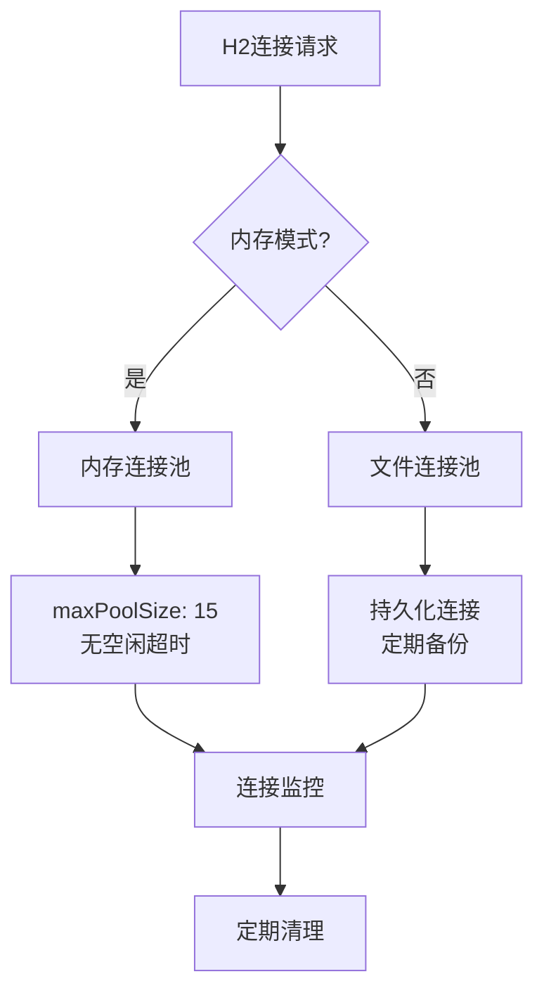
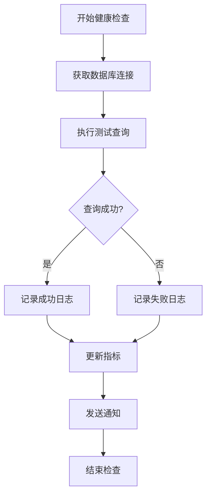

# 数据库连接池配置

<cite>
**本文档中引用的文件**
- [connection_pool_setup.clj](file://src/metabase/app_db/connection_pool_setup.clj)
- [data_source.clj](file://src/metabase/app_db/data_source.clj)
- [setup.clj](file://src/metabase/app_db/setup.clj)
- [connection.clj](file://src/metabase/driver/sql_jdbc/connection.clj)
- [env.clj](file://src/metabase/app_db/env.clj)
- [core.clj](file://src/metabase/config/core.clj)
- [mysql.clj](file://src/metabase/driver/mysql.clj)
- [postgres.clj](file://src/metabase/driver/postgres.clj)
- [settings.clj](file://src/metabase/driver/settings.clj)
</cite>

## 目录
1. [简介](#简介)
2. [连接池架构概述](#连接池架构概述)
3. [核心配置参数](#核心配置参数)
4. [连接验证机制](#连接验证机制)
5. [数据库特定配置](#数据库特定配置)
6. [环境变量配置](#环境变量配置)
7. [健康检查机制](#健康检查机制)
8. [性能监控与调优](#性能监控与调优)
9. [故障排除指南](#故障排除指南)
10. [最佳实践](#最佳实践)

## 简介

Metabase使用C3P0连接池作为其数据库连接管理的核心组件，为应用程序数据库和数据仓库提供可靠的连接池服务。本文档详细说明了连接池的配置参数、验证机制、健康检查以及针对不同数据库的最佳实践。

连接池在Metabase中扮演着关键角色：
- **资源管理**：控制数据库连接的数量，避免资源耗尽
- **性能优化**：减少连接建立和销毁的开销
- **可靠性保障**：提供连接验证和自动恢复机制
- **监控支持**：集成Prometheus指标监控

## 连接池架构概述

Metabase采用分层的连接池架构，根据不同的使用场景配置不同的连接池策略：



**图表来源**
- [connection_pool_setup.clj](file://src/metabase/app_db/connection_pool_setup.clj#L63-L150)
- [connection.clj](file://src/metabase/driver/sql_jdbc/connection.clj#L50-L150)

**章节来源**
- [connection_pool_setup.clj](file://src/metabase/app_db/connection_pool_setup.clj#L1-L152)
- [connection.clj](file://src/metabase/driver/sql_jdbc/connection.clj#L1-L383)

## 核心配置参数

### 应用数据库连接池参数

应用数据库连接池使用固定的配置参数，确保系统稳定运行：

| 参数名称 | 默认值 | 描述 | 配置位置 |
|---------|--------|------|----------|
| `maxPoolSize` | 15 | 最大连接数 | `application-db-connection-pool-props` |
| `minPoolSize` | 1 | 最小连接数 | C3P0默认值 |
| `initialPoolSize` | 1 | 初始连接数 | C3P0默认值 |
| `maxIdleTimeExcessConnections` | 600秒 (10分钟) | 多余连接空闲超时 | `application-db-connection-pool-props` |
| `maxConnectionAge` | 3600秒 (1小时) | 连接最大生存时间 | `application-db-connection-pool-props` |
| `idleConnectionTestPeriod` | 60秒 | 空闲连接测试间隔 | `application-db-connection-pool-props` |
| `testConnectionOnCheckout` | true | 检出时测试连接 | `data-warehouse-connection-pool-properties` |

### 数据仓库连接池参数

数据仓库连接池采用动态配置，适应不同负载需求：

| 参数名称 | 默认值 | 描述 | 配置位置 |
|---------|--------|------|----------|
| `maxPoolSize` | 动态计算 | 最大连接数 | `jdbc-data-warehouse-max-connection-pool-size` |
| `minPoolSize` | 0 | 最小连接数 | 服务器无状态设计 |
| `initialPoolSize` | 0 | 初始连接数 | 服务器无状态设计 |
| `maxIdleTime` | 10800秒 (3小时) | 连接空闲超时 | `data-warehouse-connection-pool-properties` |
| `maxIdleTimeExcessConnections` | 300秒 (5分钟) | 多余连接空闲超时 | `data-warehouse-connection-pool-properties` |
| `unreturnedConnectionTimeout` | 动态配置 | 未返回连接超时 | `jdbc-data-warehouse-unreturned-connection-timeout-seconds` |

**章节来源**
- [connection_pool_setup.clj](file://src/metabase/app_db/connection_pool_setup.clj#L85-L150)
- [connection.clj](file://src/metabase/driver/sql_jdbc/connection.clj#L50-L150)

## 连接验证机制

### 连接生命周期管理

Metabase实现了完整的连接生命周期管理，通过`ConnectionCustomizer`接口监控连接状态：



**图表来源**
- [connection_pool_setup.clj](file://src/metabase/app_db/connection_pool_setup.clj#L40-L70)

### 连接验证策略

#### 应用数据库验证
- **空闲连接测试**：每60秒测试一次空闲连接
- **连接年龄检查**：超过1小时的连接会被销毁
- **多余连接清理**：超过最小池大小的连接10分钟后被回收

#### 数据仓库验证
- **检出时验证**：每次获取连接时进行有效性检查
- **网络延迟容忍**：基于实际网络情况调整验证开销
- **泄漏检测**：监控未归还的连接，防止连接池耗尽

**章节来源**
- [connection_pool_setup.clj](file://src/metabase/app_db/connection_pool_setup.clj#L40-L85)
- [connection.clj](file://src/metabase/driver/sql_jdbc/connection.clj#L110-L140)

## 数据库特定配置

### H2数据库配置

H2数据库使用内存存储，连接池配置相对简单：



**图表来源**
- [env.clj](file://src/metabase/app_db/env.clj#L80-L116)

### MySQL数据库配置

MySQL连接池配置考虑版本兼容性和性能优化：

| 特性 | 配置 | 说明 |
|------|------|------|
| 最低版本支持 | MySQL 5.7+ | 确保JSON类型支持 |
| MariaDB兼容 | MariaDB 10.2+ | 支持部分Revokes特性 |
| 连接验证 | 检出时验证 | 防止死连接 |
| 权限检查 | 表级权限验证 | 支持部分Revokes |
| 字符集处理 | 自动字符集检测 | 兼容不同字符集 |

### PostgreSQL数据库配置

PostgreSQL连接池配置最为复杂，支持高级特性：

| 特性 | 配置 | 说明 |
|------|------|------|
| SSL模式 | VERIFY_CA/VERIFY_FULL | 安全连接支持 |
| 客户端认证 | 证书认证 | 双向认证支持 |
| 会话清理 | DISCARD ALL | PostgreSQL专用清理 |
| 架构过滤 | 模式过滤 | 多架构支持 |
| 时间区域 | 自动时区检测 | 时区转换支持 |

**章节来源**
- [mysql.clj](file://src/metabase/driver/mysql.clj#L1-L199)
- [postgres.clj](file://src/metabase/driver/postgres.clj#L1-L199)

## 环境变量配置

### 应用数据库环境变量

Metabase支持多种方式配置应用数据库连接：

| 配置方式 | 环境变量 | 示例值 | 优先级 |
|----------|----------|--------|--------|
| 连接字符串 | `MB_DB_CONNECTION_URI` | `jdbc:h2:./metabase.db` | 最高 |
| 分解配置 | `MB_DB_TYPE=h2` | `h2` | 中等 |
| 文件路径 | `MB_DB_FILE=metabase.db` | `./metabase.db` | 最低 |

### 数据库连接参数

| 参数名称 | 环境变量 | 默认值 | 描述 |
|----------|----------|--------|------|
| 主机名 | `MB_DB_HOST` | localhost | 数据库主机地址 |
| 端口 | `MB_DB_PORT` | 5432/3306 | 数据库端口号 |
| 数据库名 | `MB_DB_DBNAME` | metabase | 数据库名称 |
| 用户名 | `MB_DB_USER` | - | 认证用户名 |
| 密码 | `MB_DB_PASS` | - | 认证密码 |
| SSL证书 | `MB_DB_SSL_CERT` | - | SSL证书路径 |

**章节来源**
- [env.clj](file://src/metabase/app_db/env.clj#L111-L141)
- [core.clj](file://src/metabase/config/core.clj#L80-L120)

## 健康检查机制

### 连接健康检查流程



**图表来源**
- [setup.clj](file://src/metabase/app_db/setup.clj#L120-L150)

### 健康检查配置

| 检查类型 | 验证内容 | 超时时间 | 错误处理 |
|----------|----------|----------|----------|
| 连接测试 | SELECT 1 | 10秒 | 重试3次 |
| 查询执行 | 复杂查询 | 20分钟 | 查询取消 |
| 权限检查 | 表访问 | 5秒 | 权限警告 |
| SSL验证 | 证书链 | 3秒 | SSL错误 |

**章节来源**
- [setup.clj](file://src/metabase/app_db/setup.clj#L120-L180)
- [connection.clj](file://src/metabase/driver/sql_jdbc/connection.clj#L350-L383)

## 性能监控与调优

### C3P0指标监控

Metabase集成了C3P0连接池的完整指标监控：

| 指标名称 | 类型 | 描述 | 监控目的 |
|----------|------|------|----------|
| `numConnections` | 数值 | 当前连接总数 | 资源使用情况 |
| `numIdleConnections` | 数值 | 空闲连接数 | 连接池效率 |
| `numBusyConnections` | 数值 | 忙碌连接数 | 性能瓶颈识别 |
| `maxPoolSize` | 配置 | 最大连接限制 | 扩容决策 |
| `minPoolSize` | 配置 | 最小连接要求 | 基础容量 |

### 性能调优建议

#### 连接池大小优化
- **小规模部署**：maxPoolSize = CPU核心数 × 2
- **中等规模部署**：maxPoolSize = CPU核心数 × 4
- **大规模部署**：maxPoolSize = CPU核心数 × 6 + 内存限制

#### 超时参数调整
- **连接超时**：根据网络延迟设置，通常30-60秒
- **查询超时**：根据业务需求，通常5-30分钟
- **空闲超时**：根据连接使用模式，通常5-30分钟

**章节来源**
- [connection_pool_setup.clj](file://src/metabase/app_db/connection_pool_setup.clj#L131-L150)

## 故障排除指南

### 常见症状与解决方案

#### 连接池耗尽

**症状**：
- `com.mchange.v2.resourcepool.CannotAcquireResourceException`
- 应用程序响应缓慢或超时
- 连接池指标显示接近最大值

**诊断步骤**：
1. 检查连接池指标：`numConnections` 接近 `maxPoolSize`
2. 分析连接泄漏：检查 `unreturnedConnectionTimeout` 设置
3. 监控查询执行时间：识别长时间运行的查询

**解决方案**：
- 增加 `maxPoolSize` 配置
- 优化查询性能，减少连接占用时间
- 启用连接泄漏检测：设置 `debugUnreturnedConnectionStackTraces`

#### 连接验证失败

**症状**：
- 连接获取时抛出验证异常
- 日志中出现 `Connection is not valid` 错误
- 偶发性的连接获取超时

**诊断步骤**：
1. 检查数据库连接状态
2. 验证网络连接稳定性
3. 查看连接池配置是否合理

**解决方案**：
- 调整 `idleConnectionTestPeriod` 参数
- 检查数据库配置和防火墙设置
- 优化网络环境

#### PostgreSQL会话清理问题

**症状**：
- PostgreSQL连接占用大量内存
- 连接池增长过快
- 内存使用持续上升

**诊断步骤**：
1. 检查PostgreSQL连接状态
2. 监控DISCARD ALL执行情况
3. 分析会话级别资源使用

**解决方案**：
- 确认连接定制器正确配置
- 监控PostgreSQL版本兼容性
- 调整会话清理频率

### 诊断工具和命令

#### 连接池状态检查
```bash
# 检查连接池指标
curl -s http://localhost:3000/api/metrics/prometheus | grep c3p0

# 检查数据库连接状态
psql -c "SELECT * FROM pg_stat_activity;" postgres
```

#### 性能分析
```bash
# 分析连接池性能
jstack <metabase-pid> | grep -A 10 "com.mchange"

# 监控连接池事件
tail -f metabase.log | grep -i "connection.*pool"
```

**章节来源**
- [connection_pool_setup.clj](file://src/metabase/app_db/connection_pool_setup.clj#L40-L85)

## 最佳实践

### 生产环境配置

#### 连接池配置模板
```yaml
# 应用数据库连接池
application-db:
  maxPoolSize: 20
  maxIdleTimeExcessConnections: 600
  maxConnectionAge: 3600
  idleConnectionTestPeriod: 60
  
# 数据仓库连接池
data-warehouse:
  maxPoolSize: 50
  maxIdleTime: 10800
  testConnectionOnCheckout: true
  unreturnedConnectionTimeout: 300
```

#### 监控配置
- **关键指标**：连接池利用率、连接获取时间、连接泄漏数量
- **告警阈值**：连接池利用率 > 80%，连接获取时间 > 5秒
- **日志级别**：启用DEBUG级别连接池事件日志

### 开发环境配置

#### 调试友好设置
```yaml
# 开发环境特殊配置
development:
  connection-pool:
    debugUnreturnedConnectionStackTraces: true
    acquireRetryAttempts: 3
    acquireRetryDelay: 1000
```

#### 性能测试配置
- **基准测试**：使用较小的连接池大小进行压力测试
- **并发测试**：模拟真实用户负载
- **长时间测试**：验证连接池稳定性

### 安全配置

#### 连接安全
- **SSL/TLS**：启用加密连接传输
- **证书验证**：配置完整的证书链验证
- **访问控制**：限制数据库访问权限

#### 敏感信息保护
- **密码管理**：使用环境变量存储敏感信息
- **连接字符串**：避免在日志中记录完整连接信息
- **审计日志**：记录连接池操作和异常事件

### 扩展性考虑

#### 水平扩展
- **多实例部署**：每个实例使用独立的连接池
- **负载均衡**：配置适当的连接池大小以支持扩展
- **状态同步**：确保连接池状态的一致性

#### 垂直扩展
- **资源监控**：监控CPU、内存、网络资源使用
- **动态调整**：根据负载动态调整连接池参数
- **容量规划**：基于历史数据预测资源需求

通过遵循这些最佳实践，可以确保Metabase连接池在各种环境下都能提供稳定、高效的数据库连接服务。定期监控和调优连接池配置，能够显著提升系统的整体性能和可靠性。