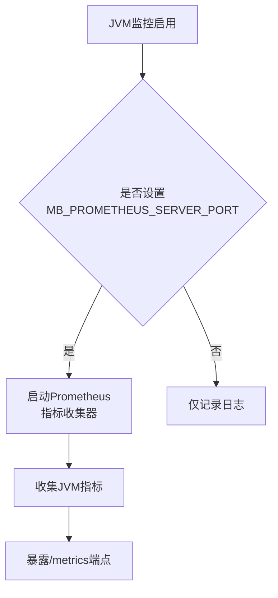
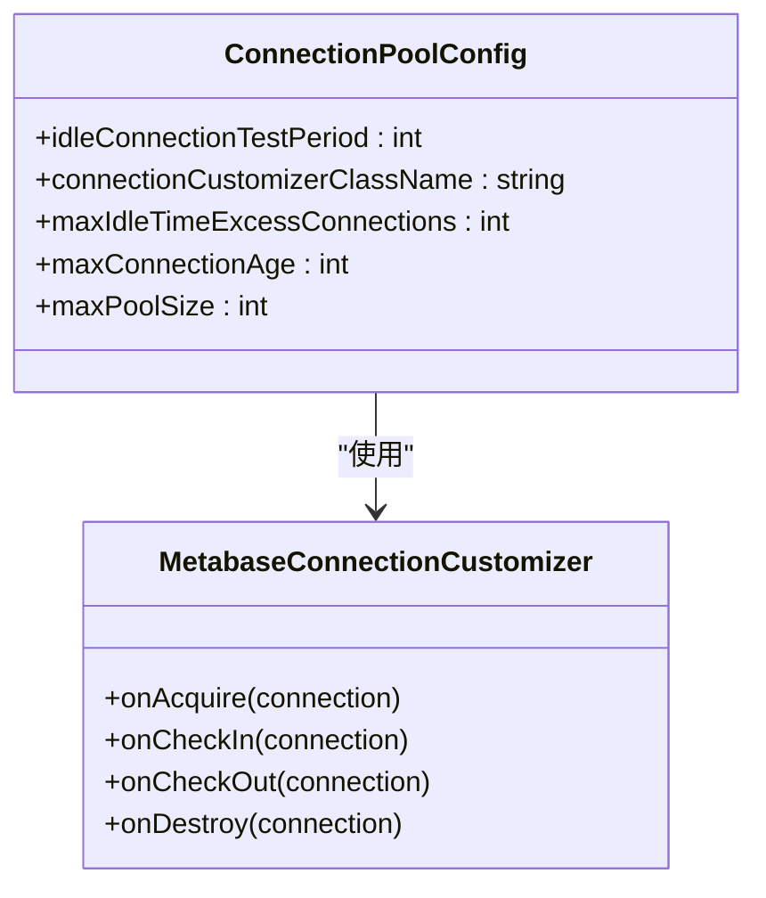
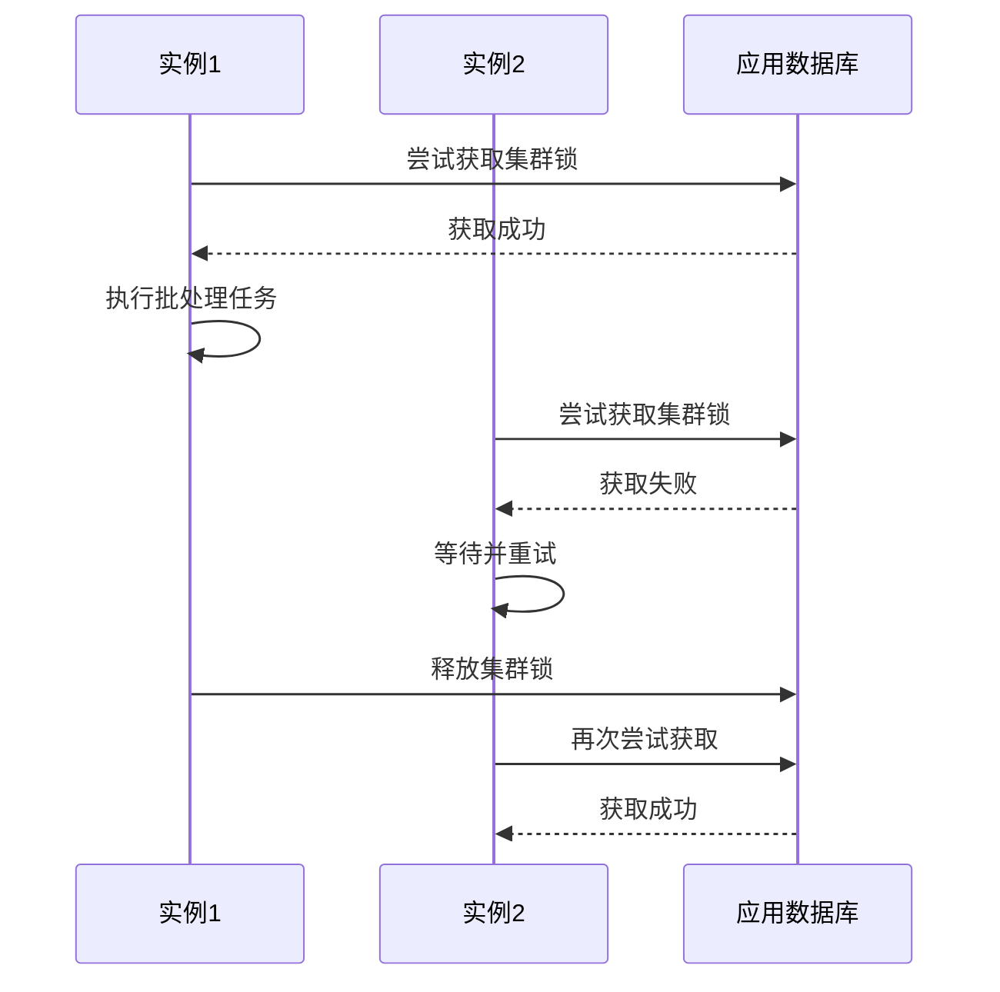
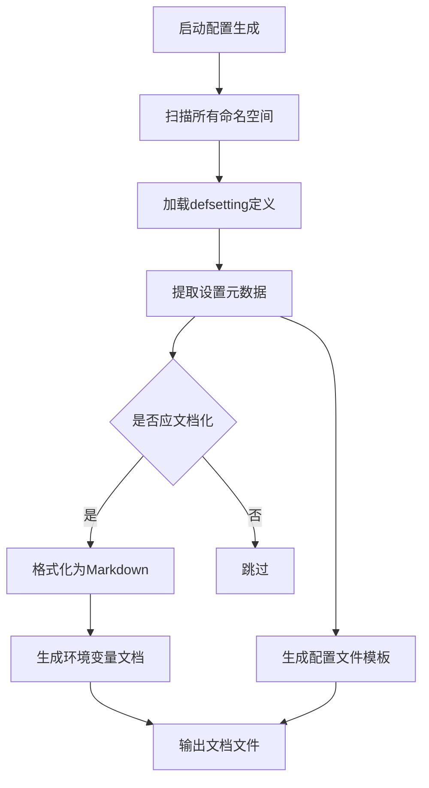
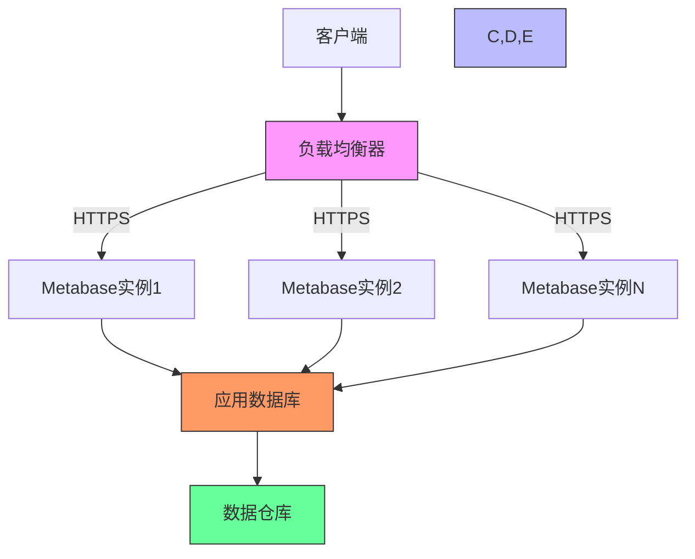

# 部署配置

<cite>
**本文档中引用的文件**  
- [env_var_dox.clj](file://src/metabase/cmd/env_var_dox.clj)
- [connection_pool_setup.clj](file://src/metabase/app_db/connection_pool_setup.clj)
- [cluster_lock.clj](file://src/metabase/app_db/cluster_lock.clj)
- [settings.clj](file://src/metabase/cache/settings.clj)
- [config_from_file.clj](file://src/metabase/core/config_from_file.clj)
- [core.clj](file://src/metabase/config/core.clj)
- [config_file_gen.clj](file://src/metabase/cmd/config_file_gen.clj)
- [config-template.yaml](file://src/metabase/cmd/resources/config-template.yaml)
- [env-var-intro.md](file://src/metabase/cmd/resources/env-var-intro.md)
- [other-env-vars.md](file://src/metabase/cmd/resources/other-env-vars.md)
</cite>

## 目录
1. [环境配置概述](#环境配置概述)
2. [JVM启动参数调优](#jvm启动参数调优)
3. [应用数据库连接池配置](#应用数据库连接池配置)
4. [部署模式配置](#部署模式配置)
5. [配置管理实践](#配置管理实践)
6. [高可用性部署网络配置](#高可用性部署网络配置)

## 环境配置概述

Metabase支持通过环境变量和配置文件进行配置，其中环境变量的优先级高于配置文件。配置可以针对开发、测试和生产环境进行差异化设置。核心配置包括应用数据库连接、JVM参数、连接池设置和缓存策略等。

**Section sources**
- [core.clj](file://src/metabase/config/core.clj#L1-L242)
- [env-var-intro.md](file://src/metabase/cmd/resources/env-var-intro.md#L1-L53)

## JVM启动参数调优

### 堆内存设置

Metabase作为Java应用，其性能与JVM堆内存配置密切相关。建议根据部署环境的内存资源合理设置堆内存大小。对于生产环境，建议设置初始堆和最大堆大小，避免运行时动态调整带来的性能波动。

### 垃圾回收配置

Metabase在`analytics/prometheus.clj`中集成了JVM监控，可以收集垃圾回收相关指标。建议启用G1垃圾回收器以获得更好的性能表现，特别是在大内存场景下。通过监控`metabase_application/jvm_gc`指标可以评估垃圾回收性能。

### 性能监控选项

Metabase内置了Prometheus监控支持，可以通过设置`MB_PROMETHEUS_SERVER_PORT`环境变量启用。这将启动一个Prometheus指标收集器，暴露JVM内存、垃圾回收、线程等关键性能指标。监控指标包括：
- `metabase_application/jvm_memory_pools`：JVM内存池使用情况
- `metabase_application/jvm_allocation_rate`：堆内存分配速率
- `jetty/requests-active`：活跃请求数



**Diagram sources**
- [prometheus.clj](file://src/metabase/analytics/prometheus.clj#L1-L33)
- [prometheus.clj](file://src/metabase/analytics/prometheus.clj#L168-L198)

**Section sources**
- [prometheus.clj](file://src/metabase/analytics/prometheus.clj#L1-L584)

## 应用数据库连接池配置

Metabase使用c3p0连接池管理应用数据库连接。连接池配置在`app_db/connection_pool_setup.clj`中定义，关键参数包括：

### 最大连接数

通过`MB_APPLICATION_DB_MAX_CONNECTION_POOL_SIZE`环境变量设置最大连接数，默认值为15。可以根据应用负载调整此值，监控日志中的"App DB connections: X/Y"信息可以评估连接使用情况。

### 超时设置

连接池配置了多项超时参数：
- `idleConnectionTestPeriod`：60秒，定期测试空闲连接
- `maxIdleTimeExcessConnections`：600秒（10分钟），超出最小池大小的空闲连接存活时间
- `maxConnectionAge`：3600秒（1小时），连接的最大存活时间

### 连接验证机制

连接池配置了连接验证机制，确保连接的有效性：
- `testConnectionOnCheckout`：获取连接时进行测试
- 使用`MetabaseConnectionCustomizer`在连接获取、归还时执行自定义逻辑
- 对PostgreSQL连接执行"DISCARD ALL"清理会话资源



**Diagram sources**
- [connection_pool_setup.clj](file://src/metabase/app_db/connection_pool_setup.clj#L85-L134)

**Section sources**
- [connection_pool_setup.clj](file://src/metabase/app_db/connection_pool_setup.clj#L1-L152)

## 部署模式配置

### 单机模式

单机模式是最简单的部署方式，适用于开发和测试环境。在这种模式下，所有组件运行在单个JVM实例中，无需特殊的集群配置。

### 集群模式

集群模式支持多个Metabase实例共享同一个应用数据库，实现高可用和负载均衡。集群模式下的关键配置包括：

#### 集群锁机制

`app_db/cluster_lock.clj`实现了基于应用数据库的分布式锁机制，用于协调集群中多个实例的并发操作。关键特性包括：
- 使用`metabase_cluster_lock`表实现分布式锁
- 支持重试机制，最大重试5次
- 对H2数据库使用进程内锁（不支持多实例）
- 超时时间为1秒

#### 缓存同步机制

集群模式下，查询结果缓存需要在实例间保持一致。通过以下配置实现：
- `enable-query-caching`：启用查询缓存
- `query-caching-max-kb`：设置单个查询结果的最大缓存大小（默认2000KB）
- `query-caching-max-ttl`：设置缓存的最大生存时间（默认35天）



**Diagram sources**
- [cluster_lock.clj](file://src/metabase/app_db/cluster_lock.clj#L1-L106)
- [settings.clj](file://src/metabase/cache/settings.clj#L1-L47)

**Section sources**
- [cluster_lock.clj](file://src/metabase/app_db/cluster_lock.clj#L1-L106)
- [settings.clj](file://src/metabase/cache/settings.clj#L1-L47)

## 配置管理实践

### 环境变量配置

Metabase支持通过环境变量进行配置，这是最常用的配置方式。环境变量名称以"MB_"为前缀，例如`MB_SITE_NAME`。配置优先级为环境变量 > 配置文件 > 默认值。

### 配置文件管理

通过`env_var_dox.clj`中的配置生成逻辑，可以创建结构化的配置文件。配置文件使用YAML格式，包含用户、数据库和API密钥等配置。配置文件模板位于`config-template.yaml`，包含以下结构：

```yaml
version: 1
config:
  users:
    - first_name: First
      last_name: Person
      password: metabot1
      email: first@example.com
  databases:
    - name: Sample PostgreSQL
      engine: postgres
      details:
        host: postgres-data
        port: 5432
        user: metabase
        password: metasample123
        dbname: sample
```

### 配置生成逻辑

`cmd/env_var_dox.clj`和`cmd/config_file_gen.clj`提供了配置文档和文件的自动生成逻辑：
- 扫描所有命名空间中的`defsetting`定义
- 提取设置项的元数据（类型、默认值、描述等）
- 生成环境变量文档和配置文件模板
- 过滤掉不应公开的内部设置



**Diagram sources**
- [env_var_dox.clj](file://src/metabase/cmd/env_var_dox.clj#L1-L229)
- [config_file_gen.clj](file://src/metabase/cmd/config_file_gen.clj#L1-L102)

**Section sources**
- [env_var_dox.clj](file://src/metabase/cmd/env_var_dox.clj#L1-L229)
- [config_file_gen.clj](file://src/metabase/cmd/config_file_gen.clj#L1-L102)
- [config-template.yaml](file://src/metabase/cmd/resources/config-template.yaml#L1-L43)

## 高可用性部署网络配置

### 负载均衡器设置

在高可用性部署中，建议在多个Metabase实例前配置负载均衡器。关键配置包括：
- 会话亲缘性（Session Affinity）：建议启用以提高缓存效率
- 健康检查：配置对`/api/health`端点的健康检查
- 连接超时：设置合理的连接和读取超时

### SSL终止

SSL终止可以在负载均衡器或Metabase实例上配置：
- 在负载均衡器上终止SSL：简化证书管理，减轻应用服务器负担
- 在Metabase上终止SSL：通过`MB_JETTY_SSL_*`环境变量配置

关键SSL相关环境变量：
- `MB_JETTY_SSL`：启用HTTPS
- `MB_JETTY_SSL_PORT`：HTTPS端口
- `MB_JETTY_SSL_KEYSTORE`：密钥库路径
- `MB_JETTY_SSL_KEYSTORE_PASSWORD`：密钥库密码

### 网络安全建议

- 使用安全组或防火墙限制对Metabase实例的访问
- 配置`MB_JETTY_HOST`为`0.0.0.0`以监听所有接口（Docker默认）
- 使用`MB_SOURCE_ADDRESS_HEADER`正确识别客户端IP地址
- 启用`MB_JETTY_SKIP_SNI`以处理SNI相关问题



**Diagram sources**
- [core.clj](file://src/metabase/config/core.clj#L1-L242)
- [other-env-vars.md](file://src/metabase/cmd/resources/other-env-vars.md#L1-L489)

**Section sources**
- [core.clj](file://src/metabase/config/core.clj#L1-L242)
- [other-env-vars.md](file://src/metabase/cmd/resources/other-env-vars.md#L1-L489)