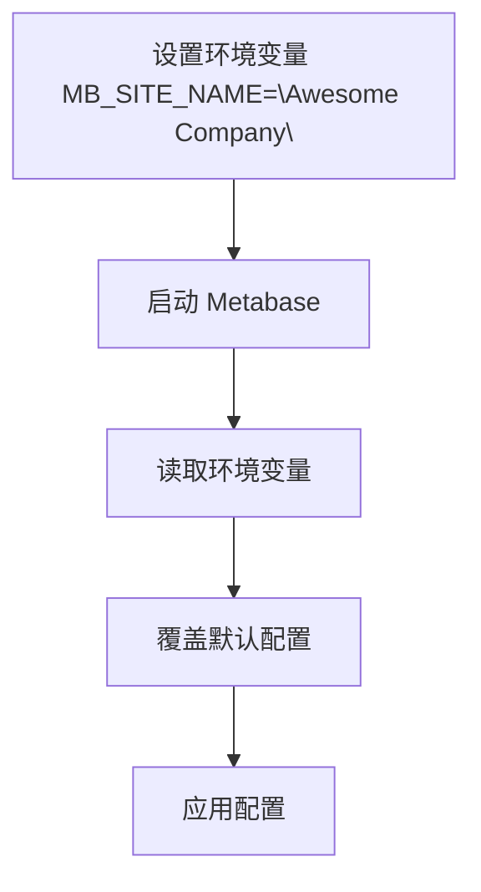
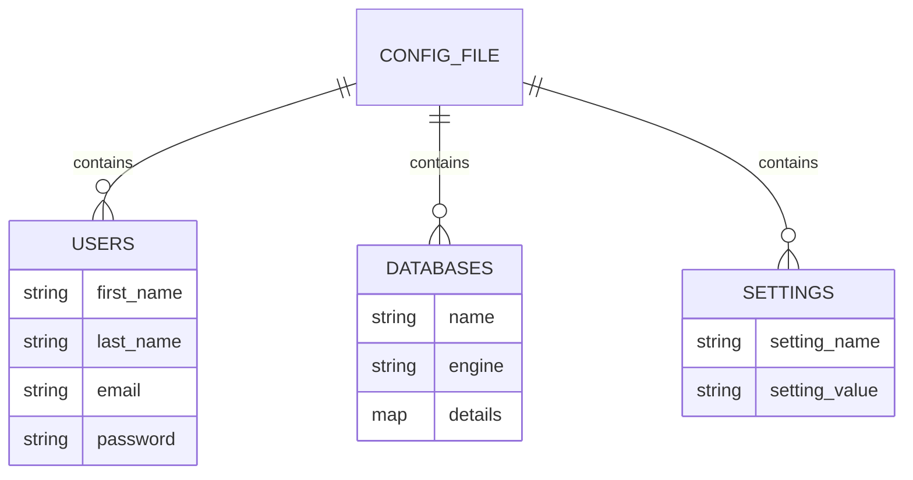
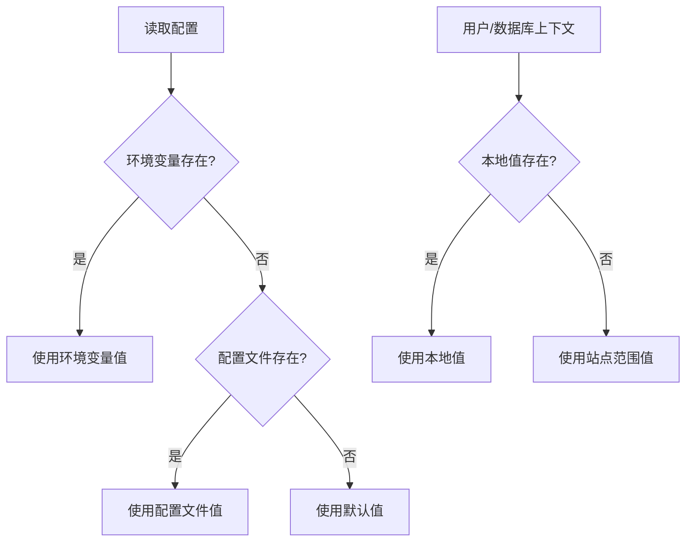
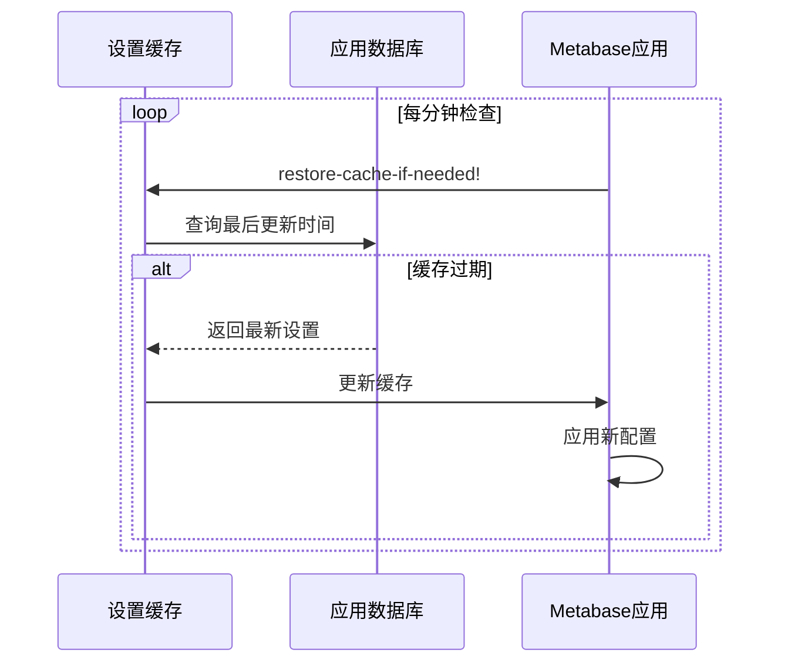
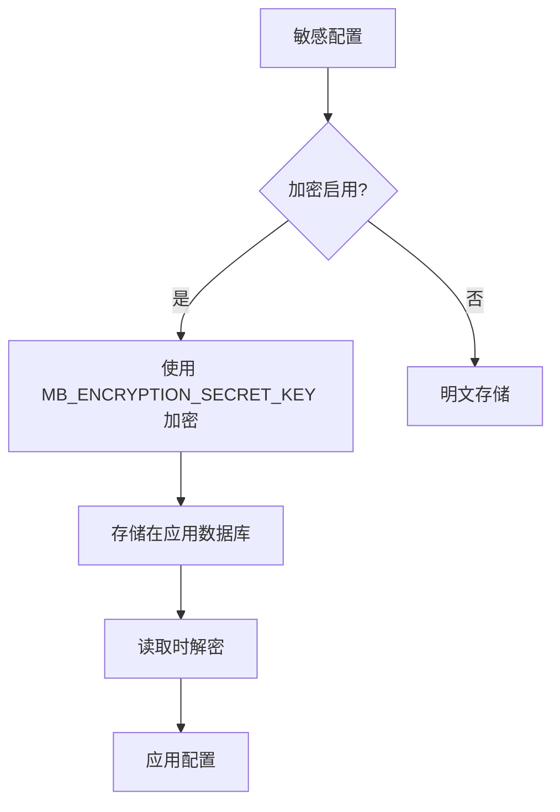

# 配置管理

<cite>
**本文档中引用的文件**  
- [env_var_dox.clj](file://src/metabase/cmd/env_var_dox.clj)
- [config_file_gen.clj](file://src/metabase/cmd/config_file_gen.clj)
- [config-template.yaml](file://src/metabase/cmd/resources/config-template.yaml)
- [config-from_file.clj](file://src/metabase/core/config-from_file.clj)
- [core.clj](file://src/metabase/config/core.clj)
- [setting.clj](file://src/metabase/settings/models/setting.clj)
- [env.clj](file://src/metabase/app_db/env.clj)
- [env-var-intro.md](file://src/metabase/cmd/resources/env-var-intro.md)
- [config-file-intro.md](file://src/metabase/cmd/resources/config-file-intro.md)
- [other-env-vars.md](file://src/metabase/cmd/resources/other-env-vars.md)
</cite>

## 目录
1. [简介](#简介)
2. [环境变量管理](#环境变量管理)
3. [配置文件管理](#配置文件管理)
4. [配置优先级规则](#配置优先级规则)
5. [配置热加载与重启生效](#配置热加载与重启生效)
6. [安全最佳实践](#安全最佳实践)
7. [配置变更流程](#配置变更流程)

## 简介

Metabase 提供了灵活的配置管理机制，支持通过环境变量和配置文件两种方式管理应用设置。本指南详细说明了如何使用 `env_var_dox.clj` 和 `config_file_gen.clj` 生成的配置逻辑，以及配置优先级、热加载机制和安全最佳实践。

**本文档中引用的文件**  
- [env_var_dox.clj](file://src/metabase/cmd/env_var_dox.clj)
- [config_file_gen.clj](file://src/metabase/cmd/config_file_gen.clj)

## 环境变量管理

Metabase 支持通过环境变量覆盖默认配置。所有环境变量都以 `MB_` 为前缀，后跟设置名称的全大写形式，其中连字符 `-` 被替换为下划线 `_`。例如，`site-name` 设置对应的环境变量是 `MB_SITE_NAME`。

环境变量的值优先于配置文件和默认值。可以通过多种方式设置环境变量，包括直接设置、Java 属性或 Docker 环境变量。



**图表来源**  
- [env_var_dox.clj](file://src/metabase/cmd/env_var_dox.clj#L100-L145)
- [setting.clj](file://src/metabase/settings/models/setting.clj#L433-L462)

**本节来源**  
- [env_var_dox.clj](file://src/metabase/cmd/env_var_dox.clj#L31-L67)
- [env-var-intro.md](file://src/metabase/cmd/resources/env-var-intro.md#L0-L52)

## 配置文件管理

Metabase 支持使用 YAML 格式的配置文件来管理设置。`config_file_gen.clj` 脚本生成了一个包含所有可配置设置及其默认值的示例配置文件模板。

配置文件结构包括 `users`、`databases` 和 `settings` 等部分。用户和数据库部分用于初始设置，而设置部分包含所有可配置的选项。

```yaml
version: 1
config:
  users:
    - first_name: First
      last_name: Person
      password: metabot1
      email: first@example.com
  databases:
    - name: Sample PostgreSQL
      engine: postgres
      details:
        host: postgres-data
        port: 5432
        user: metabase
        password: metasample123
        dbname: sample
  settings:
    site-name: "My Metabase"
    email-smtp-host: "smtp.example.com"
```



**图表来源**  
- [config_file_gen.clj](file://src/metabase/cmd/config_file_gen.clj#L36-L80)
- [config-template.yaml](file://src/metabase/cmd/resources/config-template.yaml#L0-L42)

**本节来源**  
- [config_file_gen.clj](file://src/metabase/cmd/config_file_gen.clj#L0-L40)
- [config-file-intro.md](file://src/metabase/cmd/resources/config-file-intro.md#L0-L26)

## 配置优先级规则

Metabase 遵循明确的配置优先级顺序，确保配置的一致性和可预测性。优先级从高到低如下：

1. **环境变量**：最高优先级，直接覆盖其他所有配置
2. **配置文件**：中等优先级，覆盖默认值但被环境变量覆盖
3. **默认值**：最低优先级，仅在没有其他配置时使用

对于用户本地和数据库本地设置，存在特殊的优先级规则。当在特定用户或数据库上下文中时，本地值优先于站点范围的值。



**图表来源**  
- [core.clj](file://src/metabase/config/core.clj#L0-L241)
- [setting.clj](file://src/metabase/settings/models/setting.clj#L543-L573)

**本节来源**  
- [core.clj](file://src/metabase/config/core.clj#L0-L241)
- [setting.clj](file://src/metabase/settings/models/setting.clj#L44-L62)

## 配置热加载与重启生效

Metabase 实现了配置的热加载机制，允许在不重启服务的情况下更新某些配置。设置缓存每分钟检查一次更新，当检测到其他实例更改了设置时，会自动重新加载缓存。

然而，某些关键配置（如数据库连接信息）需要重启才能生效。这些配置在应用启动时读取，之后不会动态更新。



**图表来源**  
- [setting.clj](file://src/metabase/settings/models/setting/cache.clj#L118-L146)
- [env.clj](file://src/metabase/app_db/env.clj#L0-L203)

**本节来源**  
- [setting.clj](file://src/metabase/settings/models/setting/cache.clj#L118-L146)
- [env.clj](file://src/metabase/app_db/env.clj#L0-L203)

## 安全最佳实践

配置管理的安全性至关重要，特别是对于敏感信息如数据库凭据和 API 密钥。Metabase 提供了多种安全机制来保护配置数据。

`MB_ENCRYPTION_SECRET_KEY` 环境变量用于启用加密功能，可以加密存储在应用数据库中的敏感设置。加密密钥必须是至少 16 个字符的 base64 编码字符串。



**图表来源**  
- [util/encryption.clj](file://src/metabase/util/encryption.clj#L35-L66)
- [setting.clj](file://src/metabase/settings/models/setting.clj#L977-L1003)

**本节来源**  
- [util/encryption.clj](file://src/metabase/util/encryption.clj#L35-L66)
- [other-env-vars.md](file://src/metabase/cmd/resources/other-env-vars.md#L0-L488)

## 配置变更流程

配置变更应遵循标准化的流程，确保变更的可追溯性和安全性。对于生产环境，建议使用配置文件而非环境变量，以便更好地进行版本控制和审计。

配置变更流程包括验证、应用和监控三个阶段。在应用变更前，应验证配置格式的正确性，避免因配置错误导致服务中断。


**图表来源**  
- [setting.clj](file://src/metabase/settings/models/setting.clj#L1617-L1642)
- [core.clj](file://src/metabase/config/core.clj#L0-L241)

**本节来源**  
- [setting.clj](file://src/metabase/settings/models/setting.clj#L1617-L1642)
- [config-from_file.clj](file://src/metabase/core/config-from_file.clj#L0-L17)